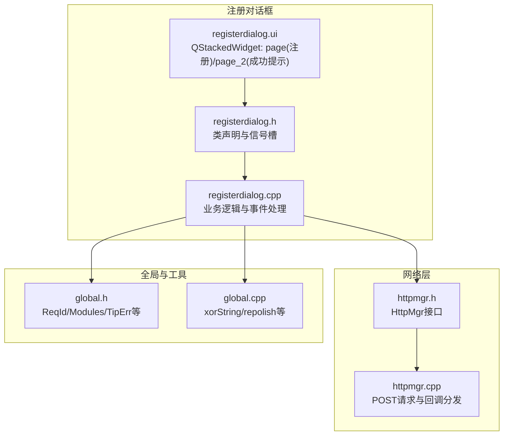
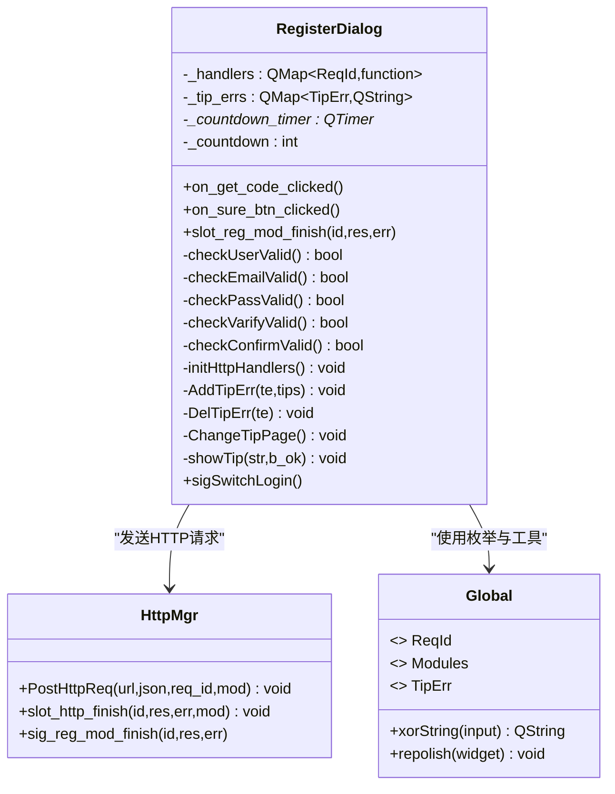
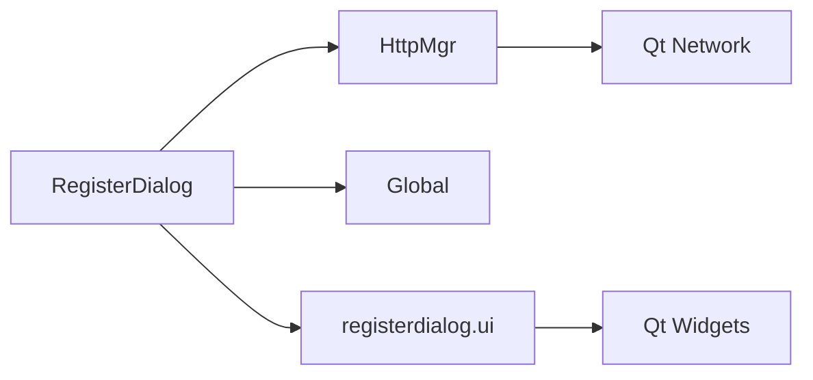
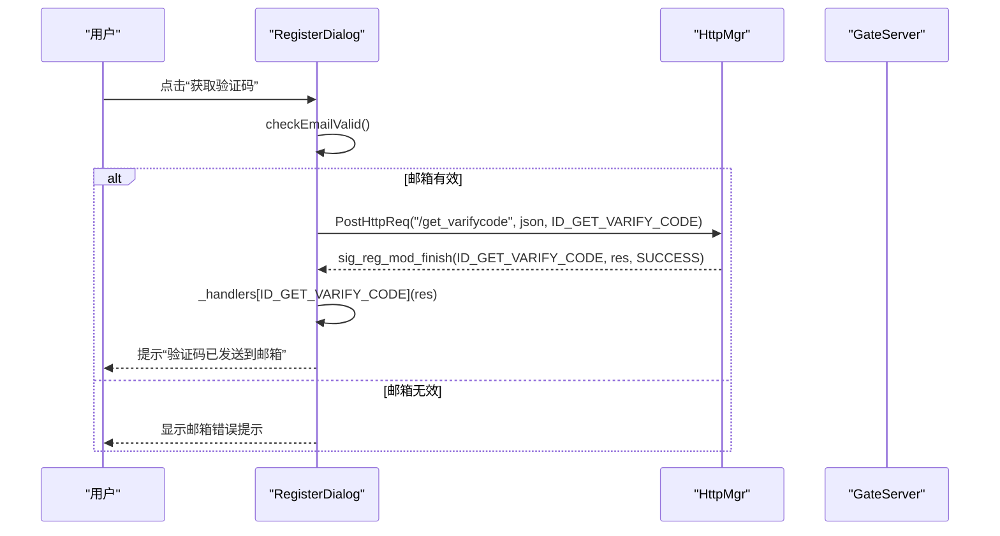
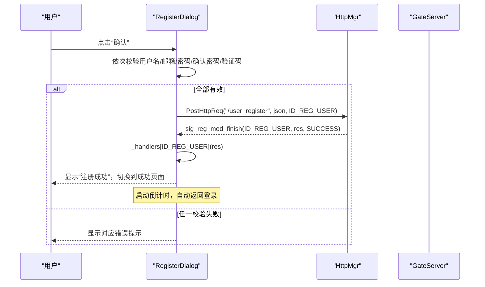
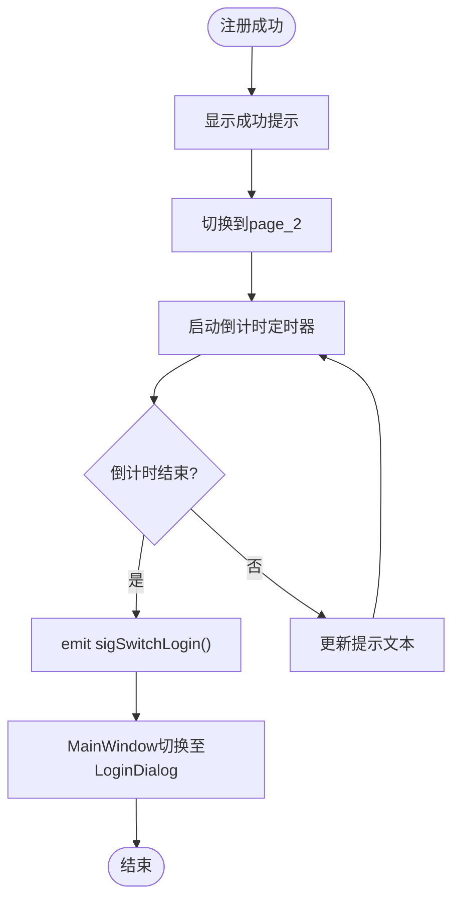

# 注册对话框实现

<cite>
**本文引用的文件**   
- [registerdialog.h](file://client/llfcchat/include/registerdialog.h)
- [registerdialog.cpp](file://client/llfcchat/src/registerdialog.cpp)
- [registerdialog.ui](file://client/llfcchat/ui/registerdialog.ui)
- [global.h](file://client/llfcchat/include/global.h)
- [global.cpp](file://client/llfcchat/src/global.cpp)
- [httpmgr.h](file://client/llfcchat/include/httpmgr.h)
- [httpmgr.cpp](file://client/llfcchat/src/httpmgr.cpp)
- [logindialog.h](file://client/llfcchat/include/logindialog.h)
- [day11-注册功能.md](file://开发文档/day11-注册功能.md)
- [day12-注册界面完善.md](file://开发文档/day12-注册界面完善.md)
</cite>

## 目录
1. [简介](#简介)
2. [项目结构](#项目结构)
3. [核心组件](#核心组件)
4. [架构总览](#架构总览)
5. [详细组件分析](#详细组件分析)
6. [依赖关系分析](#依赖关系分析)
7. [性能与体验优化](#性能与体验优化)
8. [故障排查指南](#故障排查指南)
9. [结论](#结论)
10. [附录：关键流程时序图](#附录关键流程时序图)

## 简介
本文件面向LLFCChat客户端的“注册对话框”模块，聚焦RegisterDialog类的实现细节与交互流程。内容涵盖：
- 表单实时验证（邮箱、密码强度、确认密码匹配、验证码非空）
- 验证码获取与倒计时按钮
- 用户信息提交与异步HTTP请求处理
- 注册成功后的自动返回登录逻辑、错误提示显示机制
- 与登录对话框的切换机制
- 用户体验优化（输入即时反馈、密码可见切换、QSS样式刷新等）

## 项目结构
注册对话框由Qt UI与C++逻辑组成，UI通过QStackedWidget管理两个页面：注册页与成功提示页。网络层通过HttpMgr统一封装POST请求与回调分发。全局常量与工具函数在global中定义。

图表来源
- [registerdialog.ui](file://client/llfcchat/ui/registerdialog.ui)
- [registerdialog.h](file://client/llfcchat/include/registerdialog.h)
- [registerdialog.cpp](file://client/llfcchat/src/registerdialog.cpp)
- [httpmgr.h](file://client/llfcchat/include/httpmgr.h)
- [httpmgr.cpp](file://client/llfcchat/src/httpmgr.cpp)
- [global.h](file://client/llfcchat/include/global.h)
- [global.cpp](file://client/llfcchat/src/global.cpp)

章节来源
- [registerdialog.ui](file://client/llfcchat/ui/registerdialog.ui)
- [registerdialog.h](file://client/llfcchat/include/registerdialog.h)
- [registerdialog.cpp](file://client/llfcchat/src/registerdialog.cpp)
- [httpmgr.h](file://client/llfcchat/include/httpmgr.h)
- [httpmgr.cpp](file://client/llfcchat/src/httpmgr.cpp)
- [global.h](file://client/llfcchat/include/global.h)
- [global.cpp](file://client/llfcchat/src/global.cpp)

## 核心组件
- RegisterDialog：注册对话框主类，负责表单校验、验证码获取、注册提交、结果处理与页面切换。
- HttpMgr：HTTP请求管理器，封装POST请求、错误处理与按模块分发的完成信号。
- global：全局枚举与工具函数，包括ReqId、Modules、TipErr、xorString字符串异或加密、repolish样式刷新等。
- LoginDialog：登录对话框，与注册对话框通过MainWindow进行切换。

章节来源
- [registerdialog.h](file://client/llfcchat/include/registerdialog.h)
- [registerdialog.cpp](file://client/llfcchat/src/registerdialog.cpp)
- [httpmgr.h](file://client/llfcchat/include/httpmgr.h)
- [httpmgr.cpp](file://client/llfcchat/src/httpmgr.cpp)
- [global.h](file://client/llfcchat/include/global.h)
- [global.cpp](file://client/llfcchat/src/global.cpp)
- [logindialog.h](file://client/llfcchat/include/logindialog.h)

## 架构总览
注册对话框采用“UI + 业务逻辑 + 网络层 + 全局工具”的分层设计：
- UI层：QLineEdit/QPushButton/QLabel/自定义ClickedLabel/TimerBtn/QStackedWidget
- 业务层：RegisterDialog中的校验方法、HTTP回调处理、定时器控制
- 网络层：HttpMgr统一POST请求，按模块分发sig_reg_mod_finish信号
- 全局层：ReqId/Modules/TipErr枚举、xorString加密、repolish刷新

图表来源
- [registerdialog.h](file://client/llfcchat/include/registerdialog.h)
- [registerdialog.cpp](file://client/llfcchat/src/registerdialog.cpp)
- [httpmgr.h](file://client/llfcchat/include/httpmgr.h)
- [httpmgr.cpp](file://client/llfcchat/src/httpmgr.cpp)
- [global.h](file://client/llfcchat/include/global.h)
- [global.cpp](file://client/llfcchat/src/global.cpp)

## 详细组件分析

### 表单实时验证与错误提示
- 用户名校验：检查是否为空，为空则添加TIP_USER_ERR提示；否则清除该错误。
- 邮箱校验：使用正则表达式匹配邮箱格式，不匹配则添加TIP_EMAIL_ERR提示；否则清除。
- 密码强度校验：长度6~15，字符集限制为字母、数字及特定特殊字符；不符合则添加TIP_PWD_ERR提示；否则清除。
- 确认密码匹配：与密码字段一致才通过，不一致则添加TIP_PWD_CONFIRM提示；否则清除。
- 验证码校验：非空即通过，否则添加TIP_VARIFY_ERR提示；否则清除。
- 错误提示缓存：_tip_errs用于缓存各字段错误，每次仅显示一条；DelTipErr移除后若仍有错误则继续显示下一条。

章节来源
- [registerdialog.cpp](file://client/llfcchat/src/registerdialog.cpp)
- [global.h](file://client/llfcchat/include/global.h)

### 验证码输入处理与倒计时按钮
- 点击“获取验证码”按钮时，先校验邮箱有效性，通过后构造JSON并调用HttpMgr发送GET验证码请求（ID_GET_VARIFY_CODE）。
- TimerBtn内置倒计时逻辑：点击后禁用按钮并开始计时，每秒更新文本，倒计时结束后恢复可点击状态。
- 验证码回包处理：根据ReqId路由到对应处理器，成功后提示“验证码已发送到邮箱”。

章节来源
- [registerdialog.cpp](file://client/llfcchat/src/registerdialog.cpp)
- [registerdialog.ui](file://client/llfcchat/ui/registerdialog.ui)
- [httpmgr.cpp](file://client/llfcchat/src/httpmgr.cpp)

### 用户信息提交流程与异步请求处理
- 点击“确认”按钮时，依次执行所有校验方法，全部通过后才组装JSON数据并提交。
- JSON字段包含：user、email、passwd（经xorString加密）、sex、icon（随机头像）、nick、confirm（经xorString加密）、varifycode。
- 通过HttpMgr::PostHttpReq发送POST请求至/user_register，ReqId为ID_REG_USER，Modules为REGISTERMOD。
- 异步响应通过sig_reg_mod_finish信号分发到slot_reg_mod_finish，解析JSON后调用_handlers[id]回调处理。

章节来源
- [registerdialog.cpp](file://client/llfcchat/src/registerdialog.cpp)
- [httpmgr.cpp](file://client/llfcchat/src/httpmgr.cpp)
- [global.h](file://client/llfcchat/include/global.h)

### 注册成功后的自动登录逻辑与页面切换
- 注册成功回调中，显示成功提示并切换到success页面（page_2），启动_countdown_timer倒计时。
- 倒计时结束或点击“返回登录”、“取消”按钮时，停止定时器并通过sigSwitchLogin信号通知上层切换至登录对话框。
- 错误提示通过showTip设置err_tip的state属性并使用repolish刷新样式。

章节来源
- [registerdialog.cpp](file://client/llfcchat/src/registerdialog.cpp)
- [registerdialog.ui](file://client/llfcchat/ui/registerdialog.ui)
- [global.cpp](file://client/llfcchat/src/global.cpp)

### 与登录对话框的切换机制
- RegisterDialog通过sigSwitchLogin信号通知MainWindow切换至LoginDialog。
- LoginDialog提供switchRegister信号以打开注册对话框，形成双向切换。
- MainWindow负责持有并管理两个对话框实例，确保正确隐藏/显示与信号连接。

章节来源
- [registerdialog.h](file://client/llfcchat/include/registerdialog.h)
- [logindialog.h](file://client/llfcchat/include/logindialog.h)
- [day12-注册界面完善.md](file://开发文档/day12-注册界面完善.md)

### 密码可见性切换与用户体验优化
- 自定义ClickedLabel支持多状态（普通/选中及其悬浮/按下），通过QSS动态切换图标。
- 密码输入框支持点击图标切换明文/密文显示，提升输入体验。
- repolish用于强制刷新QSS样式，确保状态变化即时生效。

章节来源
- [registerdialog.cpp](file://client/llfcchat/src/registerdialog.cpp)
- [day12-注册界面完善.md](file://开发文档/day12-注册界面完善.md)
- [global.cpp](file://client/llfcchat/src/global.cpp)

## 依赖关系分析
- RegisterDialog依赖HttpMgr进行网络请求，依赖global中的枚举与工具函数。
- HttpMgr依赖Qt网络模块（QNetworkAccessManager）发送POST请求，并通过信号将结果分发到对应模块。
- UI层依赖Qt控件与自定义控件（ClickedLabel、TimerBtn），通过QStackedWidget管理页面切换。

图表来源
- [registerdialog.cpp](file://client/llfcchat/src/registerdialog.cpp)
- [httpmgr.cpp](file://client/llfcchat/src/httpmgr.cpp)
- [registerdialog.ui](file://client/llfcchat/ui/registerdialog.ui)
- [global.h](file://client/llfcchat/include/global.h)

章节来源
- [registerdialog.cpp](file://client/llfcchat/src/registerdialog.cpp)
- [httpmgr.cpp](file://client/llfcchat/src/httpmgr.cpp)
- [registerdialog.ui](file://client/llfcchat/ui/registerdialog.ui)
- [global.h](file://client/llfcchat/include/global.h)

## 性能与体验优化
- 实时验证：editingFinished信号触发即时校验，减少用户等待时间。
- 错误提示合并：_tip_errs缓存多条错误，逐条显示避免信息过载。
- 异步网络：HttpMgr使用信号槽机制，避免阻塞UI线程。
- 样式刷新：repolish确保QSS状态变化即时生效。
- 密码可见切换：提升输入准确性与用户体验。
- 倒计时按钮：防止重复请求，提升服务器压力可控性。

[本节为通用指导，无需具体文件引用]

## 故障排查指南
- 网络错误：检查HttpMgr的ERR_NETWORK分支，确认URL配置与网络连接。
- JSON解析失败：检查服务端返回格式，确保error字段存在且类型正确。
- 验证码无效：确认Redis中验证码是否过期或匹配失败。
- 用户名/邮箱已存在：检查数据库唯一约束与服务端校验逻辑。
- 样式未刷新：确认repolish调用是否正确，QSS路径是否有效。

章节来源
- [httpmgr.cpp](file://client/llfcchat/src/httpmgr.cpp)
- [registerdialog.cpp](file://client/llfcchat/src/registerdialog.cpp)
- [global.cpp](file://client/llfcchat/src/global.cpp)

## 结论
RegisterDialog实现了完整的注册流程，包括表单验证、验证码获取、异步提交、结果处理与页面切换。通过模块化设计与信号槽机制，确保了代码的可维护性与用户体验的流畅性。建议后续可增强密码强度提示、增加更严格的邮箱格式校验、优化错误提示的国际化支持。

[本节为总结，无需具体文件引用]

## 附录：关键流程时序图

### 验证码获取流程

图表来源
- [registerdialog.cpp](file://client/llfcchat/src/registerdialog.cpp)
- [httpmgr.cpp](file://client/llfcchat/src/httpmgr.cpp)

### 用户注册提交流程

图表来源
- [registerdialog.cpp](file://client/llfcchat/src/registerdialog.cpp)
- [httpmgr.cpp](file://client/llfcchat/src/httpmgr.cpp)

### 页面切换与自动返回登录

图表来源
- [registerdialog.cpp](file://client/llfcchat/src/registerdialog.cpp)
- [registerdialog.ui](file://client/llfcchat/ui/registerdialog.ui)