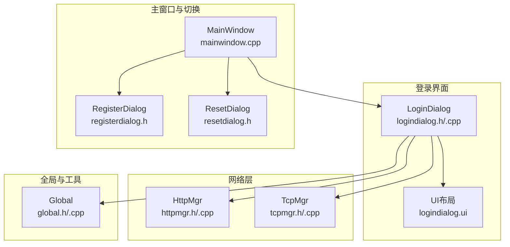
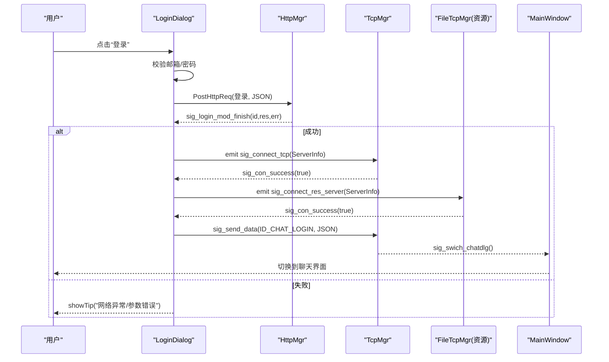
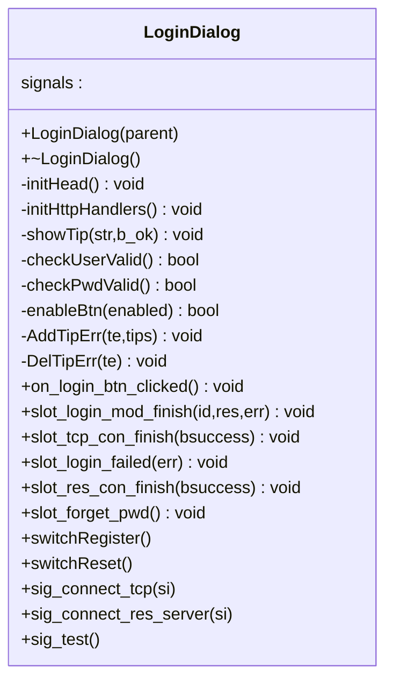
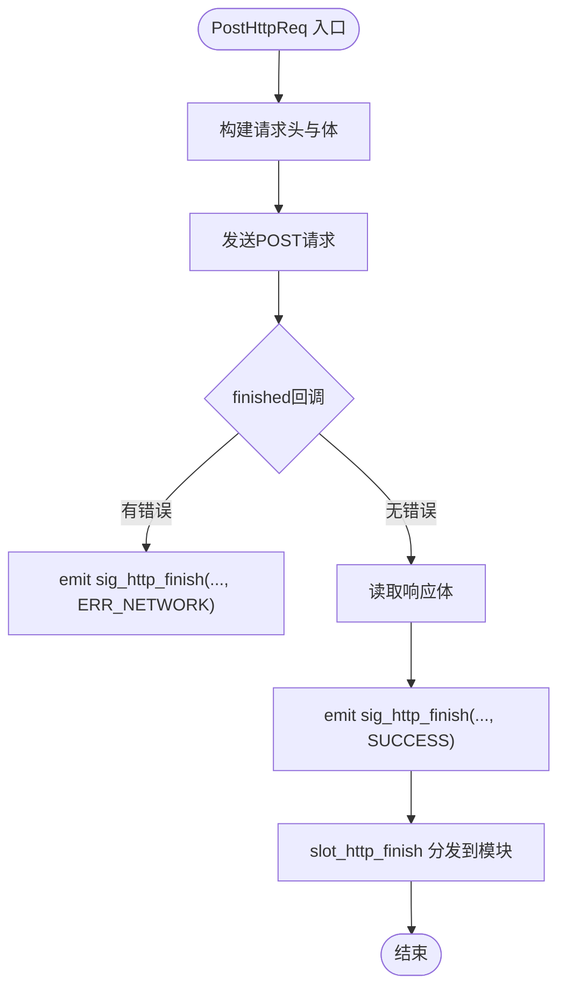
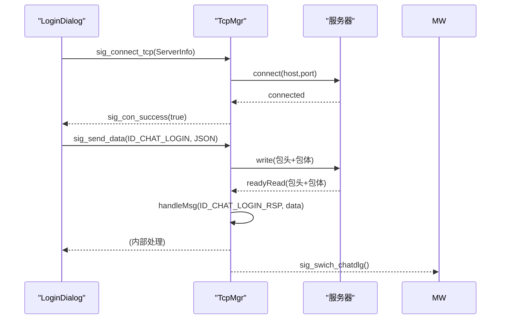
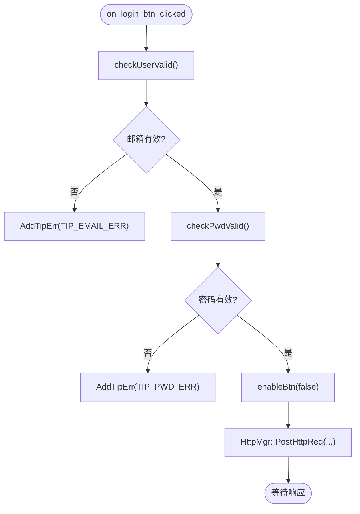
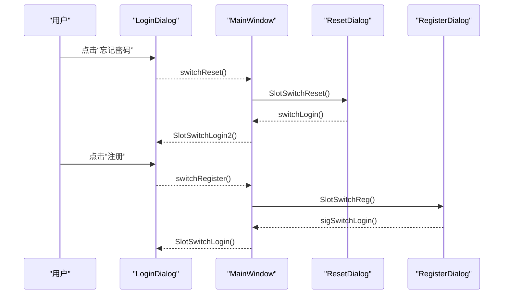
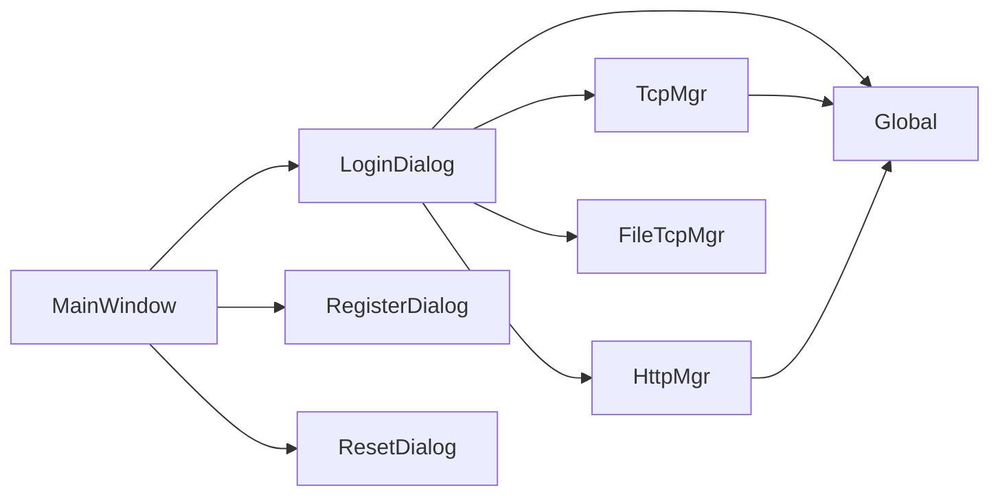

# 登录对话框实现

<cite>
**本文引用的文件**   
- [logindialog.h](file://client/llfcchat/include/logindialog.h)
- [logindialog.cpp](file://client/llfcchat/src/logindialog.cpp)
- [logindialog.ui](file://client/llfcchat/ui/logindialog.ui)
- [httpmgr.h](file://client/llfcchat/include/httpmgr.h)
- [httpmgr.cpp](file://client/llfcchat/src/httpmgr.cpp)
- [tcpmgr.h](file://client/llfcchat/include/tcpmgr.h)
- [tcpmgr.cpp](file://client/llfcchat/src/tcpmgr.cpp)
- [global.h](file://client/llfcchat/include/global.h)
- [global.cpp](file://client/llfcchat/src/global.cpp)
- [registerdialog.h](file://client/llfcchat/include/registerdialog.h)
- [resetdialog.h](file://client/llfcchat/include/resetdialog.h)
- [mainwindow.cpp](file://client/llfcchat/src/mainwindow.cpp)
</cite>

## 目录
1. [简介](#简介)
2. [项目结构](#项目结构)
3. [核心组件](#核心组件)
4. [架构总览](#架构总览)
5. [详细组件分析](#详细组件分析)
6. [依赖关系分析](#依赖关系分析)
7. [性能考虑](#性能考虑)
8. [故障排查指南](#故障排查指南)
9. [结论](#结论)
10. [附录](#附录)

## 简介
本文件面向LLFCChat客户端的登录对话框（LoginDialog）进行系统化文档说明，覆盖以下关键点：
- LoginDialog类的职责与内部结构
- 用户输入验证规则（邮箱、密码格式）
- HTTP请求处理流程（登录接口调用、响应解析、错误提示）
- TCP连接建立过程（聊天服务器与资源服务器）
- 忘记密码功能与界面切换逻辑（注册、重置）
- 信号槽连接模式、表单验证规则、错误码处理与用户反馈机制
- 关键流程图与类图，帮助快速理解交互时序与数据流

## 项目结构
登录相关代码主要位于客户端模块中，UI由Qt Designer生成，业务逻辑在C++源文件中实现。核心文件包括：
- UI定义：logindialog.ui
- 登录对话框类：logindialog.h / logindialog.cpp
- HTTP管理：httpmgr.h / httpmgr.cpp
- TCP管理：tcpmgr.h / tcpmgr.cpp
- 全局常量与工具：global.h / global.cpp
- 主窗口与界面切换：mainwindow.cpp
- 注册与重置对话框头文件：registerdialog.h / resetdialog.h

图表来源
- [logindialog.h:11-44](file://client/llfcchat/include/logindialog.h#L11-L44)
- [logindialog.cpp:12-39](file://client/llfcchat/src/logindialog.cpp#L12-L39)
- [httpmgr.h:11-31](file://client/llfcchat/include/httpmgr.h#L11-L31)
- [httpmgr.cpp:8-38](file://client/llfcchat/src/httpmgr.cpp#L8-L38)
- [tcpmgr.h:22-87](file://client/llfcchat/include/tcpmgr.h#L22-L87)
- [tcpmgr.cpp:12-136](file://client/llfcchat/src/tcpmgr.cpp#L12-L136)
- [global.h:91-136](file://client/llfcchat/include/global.h#L91-L136)
- [global.cpp:12-24](file://client/llfcchat/src/global.cpp#L12-L24)
- [mainwindow.cpp:16-34](file://client/llfcchat/src/mainwindow.cpp#L16-L34)

章节来源
- [logindialog.h:11-44](file://client/llfcchat/include/logindialog.h#L11-L44)
- [logindialog.cpp:12-39](file://client/llfcchat/src/logindialog.cpp#L12-L39)
- [httpmgr.h:11-31](file://client/llfcchat/include/httpmgr.h#L11-L31)
- [httpmgr.cpp:8-38](file://client/llfcchat/src/httpmgr.cpp#L8-L38)
- [tcpmgr.h:22-87](file://client/llfcchat/include/tcpmgr.h#L22-L87)
- [tcpmgr.cpp:12-136](file://client/llfcchat/src/tcpmgr.cpp#L12-L136)
- [global.h:91-136](file://client/llfcchat/include/global.h#L91-L136)
- [global.cpp:12-24](file://client/llfcchat/src/global.cpp#L12-L24)
- [mainwindow.cpp:16-34](file://client/llfcchat/src/mainwindow.cpp#L16-L34)

## 核心组件
- LoginDialog：负责登录界面的初始化、用户输入校验、HTTP登录请求发起、TCP连接调度、错误提示与界面状态控制。
- HttpMgr：封装HTTP POST请求，统一分发完成信号到各模块（登录、注册、重置）。
- TcpMgr：管理TCP长连接，处理粘包/拆包、消息分发、连接成功/失败回调。
- Global：提供ReqId、ErrorCodes、Modules等枚举，以及xorString等工具函数。
- MainWindow：作为容器，管理LoginDialog、RegisterDialog、ResetDialog之间的切换。

章节来源
- [logindialog.h:11-44](file://client/llfcchat/include/logindialog.h#L11-L44)
- [httpmgr.h:11-31](file://client/llfcchat/include/httpmgr.h#L11-L31)
- [tcpmgr.h:22-87](file://client/llfcchat/include/tcpmgr.h#L22-L87)
- [global.h:43-136](file://client/llfcchat/include/global.h#L43-L136)
- [mainwindow.cpp:16-34](file://client/llfcchat/src/mainwindow.cpp#L16-L34)

## 架构总览
登录流程从用户点击“登录”开始，经过本地校验后通过HttpMgr发起HTTP请求；成功后根据返回信息建立与聊天服务器的TCP连接，再连接资源服务器，最后发送TCP登录消息完成认证并进入聊天界面。

图表来源
- [logindialog.cpp:175-195](file://client/llfcchat/src/logindialog.cpp#L175-L195)
- [logindialog.cpp:197-223](file://client/llfcchat/src/logindialog.cpp#L197-L223)
- [logindialog.cpp:225-262](file://client/llfcchat/src/logindialog.cpp#L225-L262)
- [httpmgr.cpp:8-38](file://client/llfcchat/src/httpmgr.cpp#L8-L38)
- [tcpmgr.cpp:12-136](file://client/llfcchat/src/tcpmgr.cpp#L12-L136)
- [mainwindow.cpp:104-115](file://client/llfcchat/src/mainwindow.cpp#L104-L115)

## 详细组件分析

### LoginDialog类分析
- 初始化与信号槽
  - 构造时设置UI、绑定按钮事件、注册HTTP处理器、连接HttpMgr/TcpMgr/FileTcpMgr的信号槽。
- 用户输入验证
  - checkUserValid：检查邮箱非空。
  - checkPwdValid：长度6~15，字符集限制（字母、数字及特定符号），正则匹配。
- HTTP登录流程
  - on_login_btn_clicked：组装JSON（邮箱、异或后的密码），调用HttpMgr::PostHttpReq。
  - slot_login_mod_finish：错误码检查、JSON解析、按ReqId分发到对应处理器。
- TCP连接流程
  - initHead：加载头像图片并圆角绘制。
  - initHttpHandlers：注册ID_LOGIN_USER处理器，解析uid、token、聊天/资源服务器地址端口，发出sig_connect_tcp。
  - slot_tcp_con_finish：聊天服务连接成功后，发出sig_connect_res_server。
  - slot_res_con_finish：资源服务连接成功后，发送ID_CHAT_LOGIN的TCP登录消息。
- 错误提示与按钮状态
  - showTip：根据b_ok设置样式属性并重绘。
  - enableBtn：禁用/启用登录与注册按钮。
  - AddTipErr/DelTipErr：维护错误提示映射，清空或显示首个错误。
- 忘记密码与界面切换
  - slot_forget_pwd：触发switchReset信号，由MainWindow切换到ResetDialog。
  - 注册按钮：触发switchRegister信号，由MainWindow切换到RegisterDialog。

图表来源
- [logindialog.h:11-44](file://client/llfcchat/include/logindialog.h#L11-L44)
- [logindialog.cpp:12-39](file://client/llfcchat/src/logindialog.cpp#L12-L39)
- [logindialog.cpp:175-262](file://client/llfcchat/src/logindialog.cpp#L175-L262)

章节来源
- [logindialog.h:11-44](file://client/llfcchat/include/logindialog.h#L11-L44)
- [logindialog.cpp:12-39](file://client/llfcchat/src/logindialog.cpp#L12-L39)
- [logindialog.cpp:175-262](file://client/llfcchat/src/logindialog.cpp#L175-L262)

### HTTP请求处理（HttpMgr）
- PostHttpReq：构造QNetworkRequest，设置Content-Type为application/json，发送POST请求，并在finished回调中处理错误与响应。
- 完成信号分发：slot_http_finish根据Modules将结果转发给对应模块（LOGINMOD→sig_login_mod_finish）。

图表来源
- [httpmgr.cpp:8-38](file://client/llfcchat/src/httpmgr.cpp#L8-L38)
- [httpmgr.cpp:46-61](file://client/llfcchat/src/httpmgr.cpp#L46-L61)

章节来源
- [httpmgr.h:11-31](file://client/llfcchat/include/httpmgr.h#L11-L31)
- [httpmgr.cpp:8-38](file://client/llfcchat/src/httpmgr.cpp#L8-L38)
- [httpmgr.cpp:46-61](file://client/llfcchat/src/httpmgr.cpp#L46-L61)

### TCP连接与消息处理（TcpMgr）
- 连接生命周期：connected→readyRead→error/disconnected，分别触发sig_con_success、handleMsg、sig_connection_closed。
- 粘包处理：循环读取缓冲区，先解析头部（消息ID+长度），再读取消息体，调用handleMsg分发。
- 发送队列：bytesWritten回调驱动队列出队与写入，避免阻塞。
- 登录流程：收到ID_CHAT_LOGIN_RSP后解析JSON，若成功则触发sig_swich_chatdlg，由MainWindow切换到聊天界面。

图表来源
- [tcpmgr.cpp:12-136](file://client/llfcchat/src/tcpmgr.cpp#L12-L136)
- [tcpmgr.cpp:182-200](file://client/llfcchat/src/tcpmgr.cpp#L182-L200)
- [logindialog.cpp:225-262](file://client/llfcchat/src/logindialog.cpp#L225-L262)
- [mainwindow.cpp:104-115](file://client/llfcchat/src/mainwindow.cpp#L104-L115)

章节来源
- [tcpmgr.h:22-87](file://client/llfcchat/include/tcpmgr.h#L22-L87)
- [tcpmgr.cpp:12-136](file://client/llfcchat/src/tcpmgr.cpp#L12-L136)
- [tcpmgr.cpp:182-200](file://client/llfcchat/src/tcpmgr.cpp#L182-L200)

### 用户输入验证与错误提示
- 邮箱验证：非空检查，失败时AddTipErr(TIP_EMAIL_ERR, “邮箱不能为空”)。
- 密码验证：长度6~15，字符集正则匹配，失败时AddTipErr(TIP_PWD_ERR, “密码长度应为6~15”或“不能包含非法字符且长度为(6~15)”)。
- 提示机制：showTip根据b_ok设置样式属性并重绘；_tip_errs维护当前错误集合，DelTipErr清空或显示首个错误。

图表来源
- [logindialog.cpp:175-195](file://client/llfcchat/src/logindialog.cpp#L175-L195)
- [logindialog.cpp:131-166](file://client/llfcchat/src/logindialog.cpp#L131-L166)
- [logindialog.cpp:112-123](file://client/llfcchat/src/logindialog.cpp#L112-L123)
- [logindialog.cpp:264-276](file://client/llfcchat/src/logindialog.cpp#L264-L276)

章节来源
- [logindialog.cpp:131-166](file://client/llfcchat/src/logindialog.cpp#L131-L166)
- [logindialog.cpp:175-195](file://client/llfcchat/src/logindialog.cpp#L175-L195)
- [logindialog.cpp:112-123](file://client/llfcchat/src/logindialog.cpp#L112-L123)
- [logindialog.cpp:264-276](file://client/llfcchat/src/logindialog.cpp#L264-L276)

### 忘记密码与界面切换逻辑
- 忘记密码：点击“忘记密码”标签触发slot_forget_pwd，发射switchReset信号。
- 主窗口切换：MainWindow::SlotSwitchReset创建ResetDialog并替换中心部件；ResetDialog完成后发射switchLogin回到登录界面。
- 注册切换：LoginDialog::reg_btn点击发射switchRegister，MainWindow::SlotSwitchReg创建RegisterDialog并替换中心部件。

图表来源
- [logindialog.cpp:125-129](file://client/llfcchat/src/logindialog.cpp#L125-L129)
- [mainwindow.cpp:73-102](file://client/llfcchat/src/mainwindow.cpp#L73-L102)
- [mainwindow.cpp:41-54](file://client/llfcchat/src/mainwindow.cpp#L41-L54)

章节来源
- [logindialog.cpp:125-129](file://client/llfcchat/src/logindialog.cpp#L125-L129)
- [mainwindow.cpp:41-102](file://client/llfcchat/src/mainwindow.cpp#L41-L102)

### 错误码与用户反馈
- ErrorCodes：SUCCESS=0，ERR_JSON=1，ERR_NETWORK=2。
- 登录失败：slot_login_failed接收错误码并显示提示信息，恢复按钮可用。
- 网络异常：slot_tcp_con_finish与slot_res_con_finish对bsuccess分支处理，失败时提示“网络异常”。
- JSON解析错误：slot_login_mod_finish中jsonDoc.isNull()/!isObject()分支提示“json解析错误”。

章节来源
- [global.h:91-95](file://client/llfcchat/include/global.h#L91-L95)
- [logindialog.cpp:197-223](file://client/llfcchat/src/logindialog.cpp#L197-L223)
- [logindialog.cpp:235-241](file://client/llfcchat/src/logindialog.cpp#L235-L241)
- [logindialog.cpp:225-262](file://client/llfcchat/src/logindialog.cpp#L225-L262)

## 依赖关系分析
- LoginDialog依赖：
  - HttpMgr：用于发起HTTP登录请求与接收完成信号。
  - TcpMgr：用于建立聊天服务器TCP连接与发送登录消息。
  - FileTcpMgr：用于建立资源服务器TCP连接（头像等资源）。
  - Global：使用ReqId、ErrorCodes、Modules、xorString等。
- MainWindow依赖：
  - 管理LoginDialog、RegisterDialog、ResetDialog的实例化与切换。
  - 订阅TcpMgr与FileTcpMgr的连接/断开信号，处理下线与异常。

图表来源
- [logindialog.cpp:12-39](file://client/llfcchat/src/logindialog.cpp#L12-L39)
- [httpmgr.cpp:8-38](file://client/llfcchat/src/httpmgr.cpp#L8-L38)
- [tcpmgr.cpp:12-136](file://client/llfcchat/src/tcpmgr.cpp#L12-L136)
- [global.h:43-136](file://client/llfcchat/include/global.h#L43-L136)
- [mainwindow.cpp:16-34](file://client/llfcchat/src/mainwindow.cpp#L16-L34)

章节来源
- [logindialog.cpp:12-39](file://client/llfcchat/src/logindialog.cpp#L12-L39)
- [httpmgr.cpp:8-38](file://client/llfcchat/src/httpmgr.cpp#L8-L38)
- [tcpmgr.cpp:12-136](file://client/llfcchat/src/tcpmgr.cpp#L12-L136)
- [global.h:43-136](file://client/llfcchat/include/global.h#L43-L136)
- [mainwindow.cpp:16-34](file://client/llfcchat/src/mainwindow.cpp#L16-L34)

## 性能考虑
- HTTP请求：使用QNetworkAccessManager异步发送，finished回调处理响应，避免阻塞UI线程。
- TCP粘包处理：采用缓冲区和循环解析，减少不必要的内存拷贝；发送端使用队列与bytesWritten驱动，避免写阻塞。
- 资源加载：头像图片缩放与圆角绘制在初始化阶段执行，避免频繁重绘。
- 建议优化：
  - 对大JSON响应进行增量解析或流式处理（如需要）。
  - 在网络不稳定场景增加重试与超时控制。
  - 对正则表达式编译缓存以提升重复校验性能。

[本节为通用指导，不直接分析具体文件]

## 故障排查指南
- 登录失败提示“网络请求错误”：检查HttpMgr::slot_http_finish的错误码是否为ERR_NETWORK，确认网关URL前缀配置是否正确。
- JSON解析错误：确认服务器返回JSON结构与字段名一致（如email、uid、chathost、chatport、token、reshost、resport）。
- TCP连接失败：查看TcpMgr::error分支日志，常见错误包括ConnectionRefusedError、HostNotFoundError、SocketTimeoutError。
- 资源服务器连接失败：检查FileTcpMgr连接成功信号是否触发，确认reshost/resport配置正确。
- 异地登录被踢：MainWindow::SlotOffline弹出提示并关闭连接，重新回到登录界面。

章节来源
- [logindialog.cpp:197-223](file://client/llfcchat/src/logindialog.cpp#L197-L223)
- [tcpmgr.cpp:64-91](file://client/llfcchat/src/tcpmgr.cpp#L64-L91)
- [mainwindow.cpp:117-131](file://client/llfcchat/src/mainwindow.cpp#L117-L131)

## 结论
LoginDialog实现了完整的登录交互流程：严格的输入校验、可靠的HTTP请求处理、健壮的TCP连接管理与清晰的错误提示机制。通过与HttpMgr和TcpMgr的解耦设计，登录流程具备良好的可维护性与扩展性。配合MainWindow的界面切换逻辑，用户可以顺畅地在登录、注册与重置之间流转。

[本节为总结，不直接分析具体文件]

## 附录
- 关键枚举与常量
  - ReqId：ID_LOGIN_USER、ID_CHAT_LOGIN、ID_CHAT_LOGIN_RSP等。
  - ErrorCodes：SUCCESS、ERR_JSON、ERR_NETWORK。
  - Modules：REGISTERMOD、RESETMOD、LOGINMOD。
  - TipErr：TIP_EMAIL_ERR、TIP_PWD_ERR等。
- 工具函数
  - xorString：对密码进行简单异或加密传输。
  - repolish：刷新QSS样式以更新错误提示样式。

章节来源
- [global.h:43-136](file://client/llfcchat/include/global.h#L43-L136)
- [global.cpp:12-24](file://client/llfcchat/src/global.cpp#L12-L24)