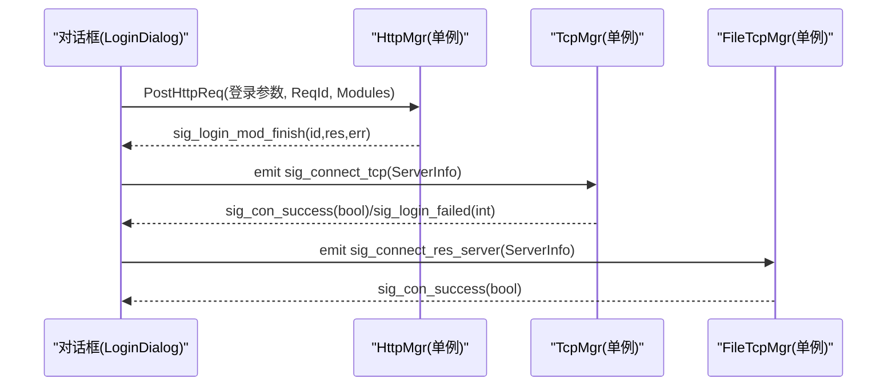
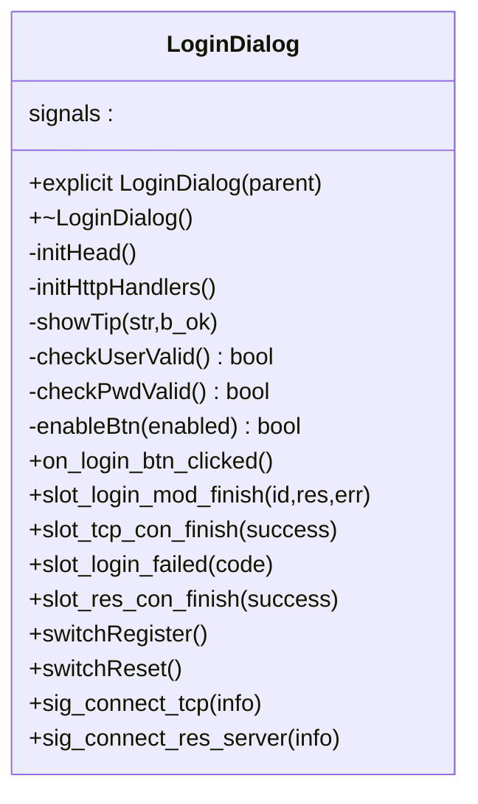
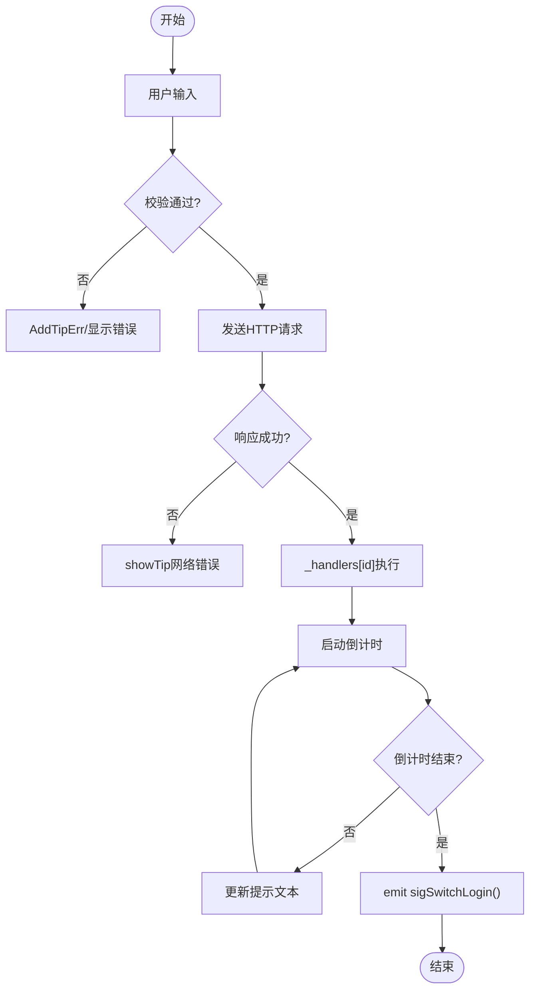
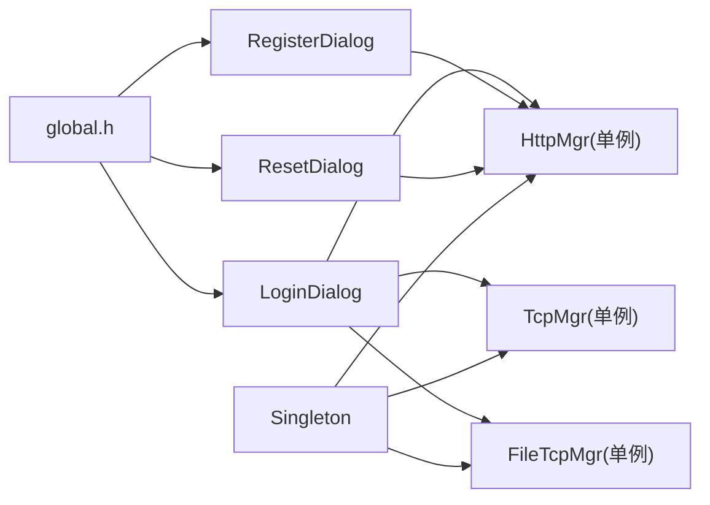

# 通用对话框设计模式

<cite>
**本文引用的文件**   
- [singleton.h](file://client/llfcchat/include/singleton.h)
- [global.h](file://client/llfcchat/include/global.h)
- [logindialog.h](file://client/llfcchat/include/logindialog.h)
- [logindialog.cpp](file://client/llfcchat/src/logindialog.cpp)
- [registerdialog.h](file://client/llfcchat/include/registerdialog.h)
- [registerdialog.cpp](file://client/llfcchat/src/registerdialog.cpp)
- [resetdialog.h](file://client/llfcchat/include/resetdialog.h)
- [resetdialog.cpp](file://client/llfcchat/src/resetdialog.cpp)
- [loadingdlg.h](file://client/llfcchat/include/loadingdlg.h)
- [loadingdlg.cpp](file://client/llfcchat/src/loadingdlg.cpp)
- [imagecropperdialog.h](file://client/llfcchat/include/imagecropperdialog.h)
- [findfaildlg.h](file://client/llfcchat/include/findfaildlg.h)
- [tcpmgr.cpp](file://client/llfcchat/src/tcpmgr.cpp)
- [filetcpmgr.cpp](file://client/llfcchat/src/filetcpmgr.cpp)
</cite>

## 目录
1. [引言](#引言)
2. [项目结构](#项目结构)
3. [核心组件](#核心组件)
4. [架构总览](#架构总览)
5. [详细组件分析](#详细组件分析)
6. [依赖关系分析](#依赖关系分析)
7. [性能考虑](#性能考虑)
8. [故障排查指南](#故障排查指南)
9. [结论](#结论)
10. [附录](#附录)

## 引言
本文件面向LLFCChat客户端的“通用对话框设计模式”，系统梳理各类对话框（登录、注册、重置密码、加载提示、图片裁剪等）共用的架构原则与实现范式。重点覆盖：
- 单例模式在对话框管理中的应用
- Qt信号槽通信机制与跨模块事件分发
- 数据绑定与UI状态同步策略
- 对话框生命周期管理、模态显示控制、结果返回机制
- 统一错误处理策略、用户提示标准化、国际化支持方案
- 对话框间通信最佳实践、内存管理与性能优化技巧
- 通用对话框基类设计与扩展方法建议

## 项目结构
本项目采用Qt/C++开发，对话框相关代码集中在client/llfcchat下，包含头文件（include）、实现（src）、界面定义（ui）与资源（resources）。对话框普遍继承自QDialog，通过Qt元对象系统（Q_OBJECT）启用信号槽；网络交互由HttpMgr/TcpMgr/FileTcpMgr等管理器提供，对话框通过信号槽与其解耦。

```mermaid
graph TB
subgraph "对话框层"
Login["LoginDialog"]
Register["RegisterDialog"]
Reset["ResetDialog"]
Loading["LoadingDlg"]
Crop["ImageCropperDialog"]
FindFail["FindFailDlg"]
end
subgraph "服务管理层"
HttpMgr["HttpMgr(单例)"]
TcpMgr["TcpMgr(单例)"]
FileTcpMgr["FileTcpMgr(单例)"]
end
subgraph "全局与工具"
Global["global.h<br/>枚举/常量/类型"]
Singleton["Singleton<T><br/>线程安全单例模板"]
end
Login --> HttpMgr
Login --> TcpMgr
Login --> FileTcpMgr
Register --> HttpMgr
Reset --> HttpMgr
Login --> Loading
Crop --> |exec()模态| Crop
Login --> Global
Register --> Global
Reset --> Global
HttpMgr --> Global
TcpMgr --> Global
FileTcpMgr --> Global
Singleton -.-> HttpMgr
Singleton -.-> TcpMgr
Singleton -.-> FileTcpMgr
```

图表来源 
- [logindialog.h:1-47](file://client/llfcchat/include/logindialog.h#L1-L47)
- [registerdialog.h:1-55](file://client/llfcchat/include/registerdialog.h#L1-L55)
- [resetdialog.h:1-44](file://client/llfcchat/include/resetdialog.h#L1-L44)
- [loadingdlg.h:1-23](file://client/llfcchat/include/loadingdlg.h#L1-L23)
- [imagecropperdialog.h:1-100](file://client/llfcchat/include/imagecropperdialog.h#L1-L100)
- [singleton.h:1-46](file://client/llfcchat/include/singleton.h#L1-L46)
- [global.h:1-296](file://client/llfcchat/include/global.h#L1-L296)

章节来源
- [logindialog.h:1-47](file://client/llfcchat/include/logindialog.h#L1-L47)
- [registerdialog.h:1-55](file://client/llfcchat/include/registerdialog.h#L1-L55)
- [resetdialog.h:1-44](file://client/llfcchat/include/resetdialog.h#L1-L44)
- [loadingdlg.h:1-23](file://client/llfcchat/include/loadingdlg.h#L1-L23)
- [imagecropperdialog.h:1-100](file://client/llfcchat/include/imagecropperdialog.h#L1-L100)
- [singleton.h:1-46](file://client/llfcchat/include/singleton.h#L1-L46)
- [global.h:1-296](file://client/llfcchat/include/global.h#L1-L296)

## 核心组件
- 单例模板 Singleton<T>：基于std::call_once保证线程安全的懒加载实例获取，配合shared_ptr管理生命周期，避免重复构造与手动释放。
- 全局常量与类型 global.h：集中定义请求ID、错误码、消息类型、传输状态、聊天模式等枚举与公共数据结构，为对话框提供统一的契约。
- HTTP/TCP/文件传输管理器：通过单例暴露接口，对话框以信号槽方式订阅回包与连接状态，实现低耦合的事件驱动架构。
- 通用对话框族：LoginDialog、RegisterDialog、ResetDialog、LoadingDlg、ImageCropperDialog、FindFailDlg等，遵循一致的输入校验、提示展示、异步回调与国际化规范。

章节来源
- [singleton.h:1-46](file://client/llfcchat/include/singleton.h#L1-L46)
- [global.h:1-296](file://client/llfcchat/include/global.h#L1-L296)
- [logindialog.cpp:1-200](file://client/llfcchat/src/logindialog.cpp#L1-L200)
- [registerdialog.cpp:1-200](file://client/llfcchat/src/registerdialog.cpp#L1-L200)
- [resetdialog.cpp:163-214](file://client/llfcchat/src/resetdialog.cpp#L163-L214)
- [loadingdlg.cpp:1-44](file://client/llfcchat/src/loadingdlg.cpp#L1-L44)
- [imagecropperdialog.h:1-100](file://client/llfcchat/include/imagecropperdialog.h#L1-L100)

## 架构总览
对话框作为UI层，通过信号槽与服务管理层（Http/Tcp/FileTcp）解耦。所有网络请求均通过单例管理器发起，管理器内部解析协议并转发业务结果到对应对话框。错误与提示统一通过全局提示机制与样式刷新函数repolish进行标准化展示。



图表来源 
- [logindialog.cpp:1-200](file://client/llfcchat/src/logindialog.cpp#L1-L200)
- [tcpmgr.cpp:63-729](file://client/llfcchat/src/tcpmgr.cpp#L63-L729)
- [filetcpmgr.cpp:37-77](file://client/llfcchat/src/filetcpmgr.cpp#L37-L77)

章节来源
- [logindialog.cpp:1-200](file://client/llfcchat/src/logindialog.cpp#L1-L200)
- [tcpmgr.cpp:63-729](file://client/llfcchat/src/tcpmgr.cpp#L63-L729)
- [filetcpmgr.cpp:37-77](file://client/llfcchat/src/filetcpmgr.cpp#L37-L77)

## 详细组件分析

### 登录对话框（LoginDialog）
- 职责：收集用户凭据，发起HTTP登录请求，成功后建立TCP长连接与资源服务器连接，统一提示与按钮状态控制。
- 关键模式：
  - 单例管理器调用：HttpMgr/TcpMgr/FileTcpMgr通过GetInstance获取。
  - 信号槽解耦：登录完成、TCP连接成功/失败、资源服务器连接成功均以信号形式通知。
  - 输入校验与提示：checkUserValid/checkPwdValid结合AddTipErr/DelTipErr统一管理错误信息，showTip统一样式刷新。
  - 国际化：使用tr()包裹提示文本。
- 生命周期：构造函数中setupUi与信号连接；析构时清理ui指针。
- 模态与非模态：非模态主流程，通过LoadingDlg覆盖父窗口显示加载状态。



图表来源 
- [logindialog.h:1-47](file://client/llfcchat/include/logindialog.h#L1-L47)
- [logindialog.cpp:1-200](file://client/llfcchat/src/logindialog.cpp#L1-L200)

章节来源
- [logindialog.h:1-47](file://client/llfcchat/include/logindialog.h#L1-L47)
- [logindialog.cpp:1-200](file://client/llfcchat/src/logindialog.cpp#L1-L200)

### 注册对话框（RegisterDialog）
- 职责：用户注册流程，包括验证码获取、表单校验、提交注册、倒计时跳转登录。
- 关键模式：
  - 输入实时校验：editingFinished触发各字段校验，AddTipErr/DelTipErr维护错误集合。
  - 异步回调：slot_reg_mod_finish根据ReqId分派到_handlers中的具体逻辑。
  - 定时器：倒计时结束后emit sigSwitchLogin()切换页面。
  - 国际化：tr()包裹提示文本。
- 生命周期：构造中初始化验证器、样式、信号连接；析构清理ui。



图表来源 
- [registerdialog.cpp:1-200](file://client/llfcchat/src/registerdialog.cpp#L1-L200)

章节来源
- [registerdialog.h:1-55](file://client/llfcchat/include/registerdialog.h#L1-L55)
- [registerdialog.cpp:1-200](file://client/llfcchat/src/registerdialog.cpp#L1-L200)

### 重置密码对话框（ResetDialog）
- 职责：重置密码流程，包括验证码获取、密码校验、提交重置、提示与返回登录。
- 关键模式：与RegisterDialog一致，使用_handlers按ReqId分派，AddTipErr/DelTipErr统一错误提示，showTip统一样式刷新。
- 国际化：tr()包裹提示文本。

章节来源
- [resetdialog.h:1-44](file://client/llfcchat/include/resetdialog.h#L1-L44)
- [resetdialog.cpp:163-214](file://client/llfcchat/src/resetdialog.cpp#L163-L214)

### 加载提示对话框（LoadingDlg）
- 职责：全屏半透明遮罩+动画提示，用于阻塞式等待或后台任务反馈。
- 关键模式：
  - 模态覆盖：设置无边框、置顶、透明背景，尺寸跟随父窗口，移动至父窗口左上角。
  - 动画：QMovie播放loading.gif，自动缩放适配Label大小。
- 使用场景：登录、注册、文件传输等耗时操作期间显示。

章节来源
- [loadingdlg.h:1-23](file://client/llfcchat/include/loadingdlg.h#L1-L23)
- [loadingdlg.cpp:1-44](file://client/llfcchat/src/loadingdlg.cpp#L1-L44)

### 图片裁剪对话框（ImageCropperDialog）
- 职责：提供模态图片裁剪能力，返回裁剪后的图像。
- 关键模式：
  - exec()模态阻塞：静态方法getCroppedImage创建私有对话框实例，exec()阻塞直到用户确认或取消。
  - 结果返回：通过引用参数outputImage返回裁剪结果，取消时返回空QPixmap。
  - 属性设置：setAttribute(Qt::WA_DeleteOnClose)确保关闭后自动释放。

章节来源
- [imagecropperdialog.h:1-100](file://client/llfcchat/include/imagecropperdialog.h#L1-L100)

### 查找失败提示对话框（FindFailDlg）
- 职责：简单提示查找失败的对话框，点击确定关闭。
- 关键模式：标准QDialog用法，信号槽绑定按钮点击事件。

章节来源
- [findfaildlg.h:1-28](file://client/llfcchat/include/findfaildlg.h#L1-L28)

## 依赖关系分析
- 单例依赖：HttpMgr/TcpMgr/FileTcpMgr通过Singleton<T>模板获取实例，保证全局唯一与线程安全。
- 全局契约：global.h定义的ReqId、ErrorCodes、TipErr等枚举被各对话框共享，确保协议一致性。
- 信号槽解耦：对话框不直接持有网络层对象，仅通过信号槽与单例管理器通信，降低耦合度。
- 资源与样式：repolish函数用于统一刷新QSS样式，提示文本通过setProperty("state",...)切换样式状态。



图表来源 
- [singleton.h:1-46](file://client/llfcchat/include/singleton.h#L1-L46)
- [global.h:1-296](file://client/llfcchat/include/global.h#L1-L296)
- [logindialog.cpp:1-200](file://client/llfcchat/src/logindialog.cpp#L1-L200)
- [registerdialog.cpp:1-200](file://client/llfcchat/src/registerdialog.cpp#L1-L200)
- [resetdialog.cpp:163-214](file://client/llfcchat/src/resetdialog.cpp#L163-L214)

章节来源
- [singleton.h:1-46](file://client/llfcchat/include/singleton.h#L1-L46)
- [global.h:1-296](file://client/llfcchat/include/global.h#L1-L296)
- [logindialog.cpp:1-200](file://client/llfcchat/src/logindialog.cpp#L1-L200)
- [registerdialog.cpp:1-200](file://client/llfcchat/src/registerdialog.cpp#L1-L200)
- [resetdialog.cpp:163-214](file://client/llfcchat/src/resetdialog.cpp#L163-L214)

## 性能考虑
- 单例懒加载：Singleton<T>使用std::call_once确保首次访问时才构造实例，减少启动开销。
- 异步网络：所有网络请求通过管理器异步处理，避免阻塞UI线程。
- 资源复用：LoadingDlg复用QMovie动画，避免频繁创建销毁。
- 样式刷新：repolish集中刷新QSS，减少重复样式计算。
- 内存管理：对话框析构时delete ui，避免内存泄漏；ImageCropperDialog使用WA_DeleteOnClose自动释放。

[本节为通用指导，不直接分析具体文件]

## 故障排查指南
- 网络错误：检查HttpMgr/TcpMgr的错误信号与日志，确认网络连通性与服务器地址配置。
- JSON解析失败：确认服务端返回格式与ReqId映射是否正确，参考slot_reg_mod_finish中的解析流程。
- 提示未显示：检查repolish是否被调用，setProperty("state",...)是否正确设置。
- 模态阻塞：ImageCropperDialog使用exec()会阻塞当前线程，确保不在主循环中误用导致界面卡死。
- 国际化缺失：确认提示文本是否使用tr()包裹，语言包是否正确加载。

章节来源
- [tcpmgr.cpp:63-729](file://client/llfcchat/src/tcpmgr.cpp#L63-L729)
- [filetcpmgr.cpp:37-77](file://client/llfcchat/src/filetcpmgr.cpp#L37-L77)
- [registerdialog.cpp:113-139](file://client/llfcchat/src/registerdialog.cpp#L113-L139)
- [logindialog.cpp:112-123](file://client/llfcchat/src/logindialog.cpp#L112-L123)

## 结论
LLFCChat的对话框体系基于Qt信号槽与单例管理器构建，实现了高内聚、低耦合的模块化设计。通过统一的错误处理、提示样式与国际化方案，确保了用户体验的一致性。未来可进一步抽象出通用对话框基类，封装输入校验、提示管理、生命周期控制等共性逻辑，提升代码复用率与维护性。

[本节为总结性内容，不直接分析具体文件]

## 附录

### 通用对话框基类设计建议
- 基类职责：
  - 统一输入校验框架：提供checkField(field, validator)接口，返回错误码并记录到_tip_errs。
  - 统一提示管理：showTip(msg, ok)结合repolish刷新样式。
  - 生命周期钩子：onShow()/onHide()供子类扩展。
  - 国际化支持：封装tr()调用，确保所有提示文本可翻译。
- 扩展方法：
  - enableButtons(bool): 批量控制按钮可用状态。
  - showLoading(QString tip): 显示LoadingDlg覆盖父窗口。
  - hideLoading(): 隐藏LoadingDlg。
  - setResult(resultType, data): 统一结果返回机制，供调用方接收。

[本节为概念性设计建议，不直接分析具体文件]

### 对话框间通信最佳实践
- 使用信号槽：对话框之间通过信号传递状态变化，避免直接耦合。
- 事件总线：对于复杂场景，可引入轻量级事件总线（如基于QObject的信号槽广播）解耦多对多通信。
- 结果回调：通过自定义Result结构体封装返回值，避免参数过多导致的接口膨胀。

[本节为概念性指导，不直接分析具体文件]

### 内存管理策略
- 智能指针：优先使用std::shared_ptr管理跨模块对象，避免手动释放。
- 父子对象模型：利用Qt的父子关系自动释放子Widget，减少内存泄漏风险。
- 延迟删除：对于长时间运行的任务，使用Qt::DeleteLater确保在主循环中安全删除。

[本节为通用指导，不直接分析具体文件]