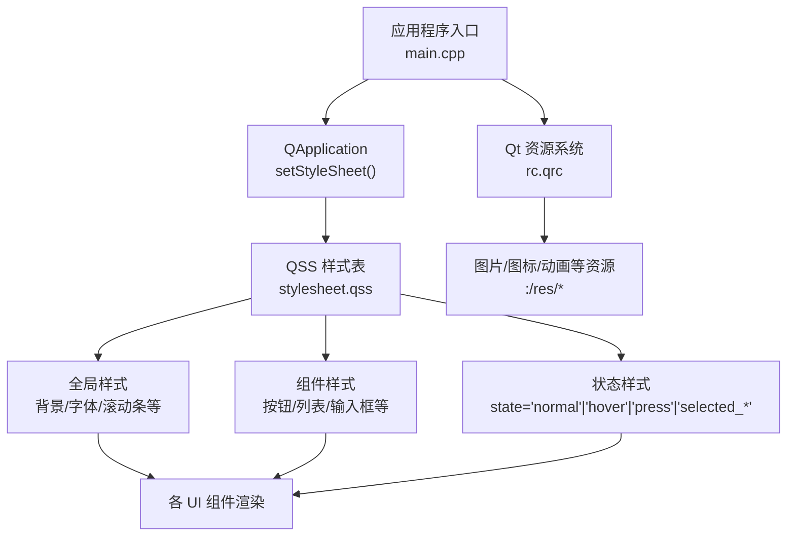
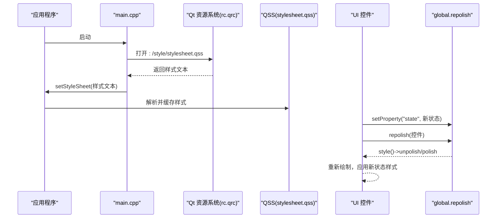
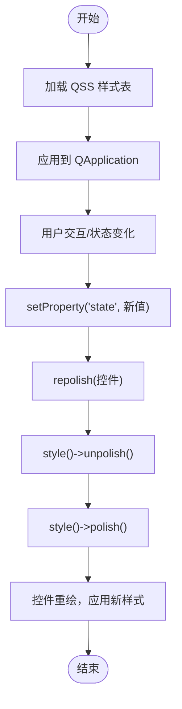
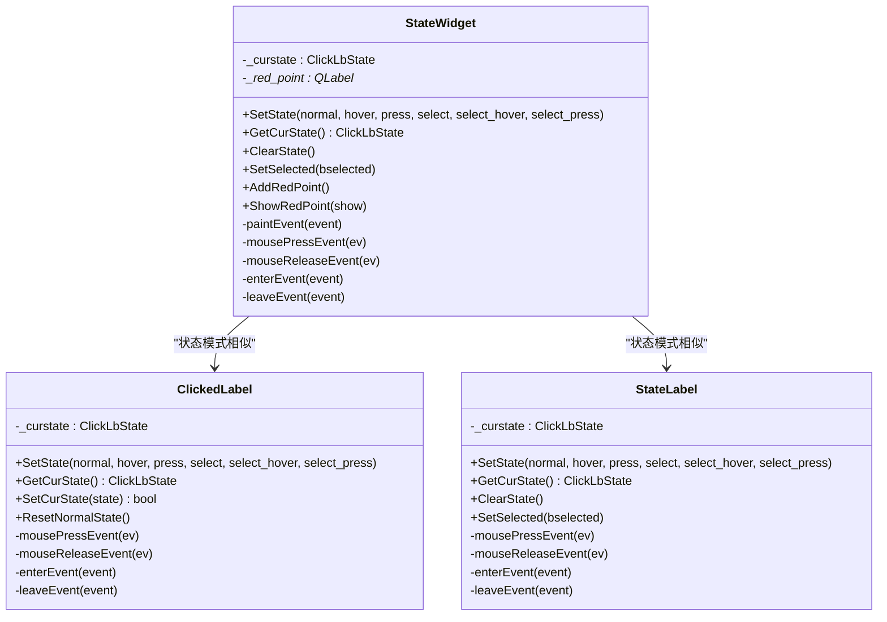
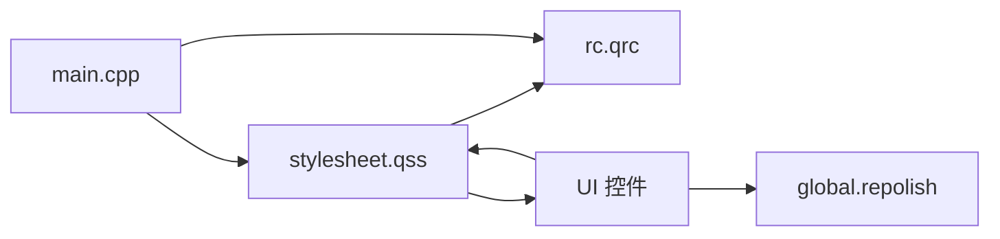

# 界面样式与主题

<cite>
**本文引用的文件**   
- [client/llfcchat/resources/style/stylesheet.qss](file://client/llfcchat/resources/style/stylesheet.qss)
- [client/llfcchat/resources/rc.qrc](file://client/llfcchat/resources/rc.qrc)
- [client/llfcchat/src/main.cpp](file://client/llfcchat/src/main.cpp)
- [client/llfcchat/include/global.h](file://client/llfcchat/include/global.h)
- [client/llfcchat/src/logindialog.cpp](file://client/llfcchat/src/logindialog.cpp)
- [client/llfcchat/include/logindialog.h](file://client/llfcchat/include/logindialog.h)
- [client/llfcchat/src/statewidget.cpp](file://client/llfcchat/src/statewidget.cpp)
- [client/llfcchat/include/statewidget.h](file://client/llfcchat/include/statewidget.h)
- [client/llfcchat/src/clickedlabel.cpp](file://client/llfcchat/src/clickedlabel.cpp)
- [client/llfcchat/include/clickedlabel.h](file://client/llfcchat/include/clickedlabel.h)
- [client/llfcchat/src/statelabel.cpp](file://client/llfcchat/src/statelabel.cpp)
- [client/llfcchat/include/statelabel.h](file://client/llfcchat/include/statelabel.h)
- [client/llfcchat/src/mainwindow.cpp](file://client/llfcchat/src/mainwindow.cpp)
- [client/llfcchat/include/mainwindow.h](file://client/llfcchat/include/mainwindow.h)
</cite>

## 目录
1. [简介](#简介)
2. [项目结构](#项目结构)
3. [核心组件](#核心组件)
4. [架构总览](#架构总览)
5. [详细组件分析](#详细组件分析)
6. [依赖关系分析](#依赖关系分析)
7. [性能考虑](#性能考虑)
8. [故障排查指南](#故障排查指南)
9. [结论](#结论)
10. [附录](#附录)

## 简介
本文件面向 LLFCChat 的界面样式与主题系统，系统性说明 QSS 样式表的使用方式、资源文件 rc.qrc 的管理机制、动态主题切换的实现流程，以及样式调试与性能优化建议。文档以代码级为依据，结合仓库中的 stylesheet.qss、rc.qrc、main.cpp 及状态控件实现，帮助开发者快速理解并扩展主题能力。

## 项目结构
LLFCChat 客户端将样式与资源集中管理：
- 样式表：resources/style/stylesheet.qss，定义全局与组件样式、状态样式。
- 资源清单：resources/rc.qrc，打包图片、动画、样式表等静态资源，供 Qt 资源系统访问。
- 应用入口：src/main.cpp，在程序启动时加载 QSS 并应用到 QApplication。
- 状态控件：StateWidget、ClickedLabel、StateLabel 等自定义控件通过属性 state 驱动 QSS 状态样式。
- 业务界面：LoginDialog 等界面通过设置属性并调用 repolish 刷新样式。

图表来源 
- [client/llfcchat/src/main.cpp:1-44](file://client/llfcchat/src/main.cpp#L1-L44)
- [client/llfcchat/resources/rc.qrc:1-62](file://client/llfcchat/resources/rc.qrc#L1-L62)
- [client/llfcchat/resources/style/stylesheet.qss:1-815](file://client/llfcchat/resources/style/stylesheet.qss#L1-L815)

章节来源
- [client/llfcchat/src/main.cpp:1-44](file://client/llfcchat/src/main.cpp#L1-L44)
- [client/llfcchat/resources/rc.qrc:1-62](file://client/llfcchat/resources/rc.qrc#L1-L62)
- [client/llfcchat/resources/style/stylesheet.qss:1-815](file://client/llfcchat/resources/style/stylesheet.qss#L1-L815)

## 核心组件
- QSS 样式表（stylesheet.qss）
  - 选择器语法：ID 选择器、类型选择器、伪类/伪元素（如 ::item、::handle）、属性选择器（[state='...']）。
  - 常用属性：background-color、border-image、color、font-family、font-size、border-radius、outline、padding、margin 等。
  - 继承规则：未显式设置的属性从父对象继承；子控件可覆盖父样式。
- 资源文件（rc.qrc）
  - 使用 <qresource prefix="/"> 统一前缀，所有资源可通过 :/res/xxx 或 :/style/xxx 访问。
  - 支持图片、动画、样式表等二进制资源编译进可执行文件。
- 样式加载与应用
  - main.cpp 中读取 :/style/stylesheet.qss，调用 QApplication::setStyleSheet 全局生效。
- 动态刷新
  - global.h 暴露 repolish 函数指针，用于对单个控件进行 unpolish/polish 刷新。
  - LoginDialog 等界面通过 setProperty("state", ...) + repolish(...) 触发样式重绘。

章节来源
- [client/llfcchat/resources/style/stylesheet.qss:1-815](file://client/llfcchat/resources/style/stylesheet.qss#L1-L815)
- [client/llfcchat/resources/rc.qrc:1-62](file://client/llfcchat/resources/rc.qrc#L1-L62)
- [client/llfcchat/src/main.cpp:1-44](file://client/llfcchat/src/main.cpp#L1-L44)
- [client/llfcchat/include/global.h:1-296](file://client/llfcchat/include/global.h#L1-L296)
- [client/llfcchat/src/logindialog.cpp:1-200](file://client/llfcchat/src/logindialog.cpp#L1-L200)

## 架构总览
样式系统在运行时的关键路径如下：
- 启动阶段：main.cpp 加载 QSS 并设置到 QApplication。
- 资源阶段：rc.qrc 将样式与图片等资源编译进应用，QSS 中通过 :/res/... 引用。
- 运行时：自定义控件维护 state 属性，鼠标事件改变 state，调用 repolish 刷新样式。
- 主题切换：替换 QApplication 的样式表即可实现全局主题切换。

图表来源 
- [client/llfcchat/src/main.cpp:1-44](file://client/llfcchat/src/main.cpp#L1-L44)
- [client/llfcchat/resources/rc.qrc:1-62](file://client/llfcchat/resources/rc.qrc#L1-L62)
- [client/llfcchat/resources/style/stylesheet.qss:1-815](file://client/llfcchat/resources/style/stylesheet.qss#L1-L815)
- [client/llfcchat/include/global.h:1-296](file://client/llfcchat/include/global.h#L1-L296)

## 详细组件分析

### QSS 样式表结构与用法
- 选择器分类
  - ID 选择器：如 #err_tip[state='normal']，精确匹配对象名与属性。
  - 类型选择器：如 QDialog#LoginDialog,#RegisterDialog,#ResetDialog，限定特定对话框背景。
  - 伪类/伪元素：如 QScrollBar::handle:vertical、QListWidget::item:selected。
- 属性设置要点
  - border-image：用于按钮、标签等多态图标切换（如 add_btn、emo_lb、side_chat_lb）。
  - background-color/color/font-family/font-size：统一字体与配色。
  - outline/border：去除默认边框，保持简洁风格。
- 继承规则
  - 未定义的属性从父控件继承；子控件可覆盖父样式。
  - 列表项、滚动条等子部件需单独定义伪元素样式。

章节来源
- [client/llfcchat/resources/style/stylesheet.qss:1-815](file://client/llfcchat/resources/style/stylesheet.qss#L1-L815)

### 资源文件 rc.qrc 管理
- 资源组织
  - 所有资源置于 resources/res 与 resources/style 下，通过 rc.qrc 注册。
  - 统一前缀 "/"，引用路径为 :/res/xxx 或 :/style/xxx。
- 常见资源
  - 图片：头像、图标、状态图（如 head_*.jpg、chat_icon.png、red_point.png）。
  - 动画：loading.gif、loading2.gif。
  - 样式表：stylesheet.qss。
- 使用示例
  - QSS 中通过 url(:/res/visible.png) 引用图片。
  - 代码中通过 QPixmap(":/res/head_1.jpg") 加载头像。

章节来源
- [client/llfcchat/resources/rc.qrc:1-62](file://client/llfcchat/resources/rc.qrc#L1-L62)
- [client/llfcchat/src/logindialog.cpp:1-200](file://client/llfcchat/src/logindialog.cpp#L1-L200)

### 动态主题切换机制
- 样式加载
  - main.cpp 启动时读取 :/style/stylesheet.qss 并设置到 QApplication。
- 应用刷新
  - 自定义控件通过 setProperty("state", ...) 更新状态，再调用 repolish 触发样式重绘。
- 内存管理
  - repolish 仅对目标控件进行 unpolish/polish，避免全树重绘开销。
  - 主题切换时建议先卸载旧样式，再设置新样式，必要时清理临时对象。

图表来源 
- [client/llfcchat/src/main.cpp:1-44](file://client/llfcchat/src/main.cpp#L1-L44)
- [client/llfcchat/include/global.h:1-296](file://client/llfcchat/include/global.h#L1-L296)
- [client/llfcchat/src/logindialog.cpp:1-200](file://client/llfcchat/src/logindialog.cpp#L1-L200)

章节来源
- [client/llfcchat/src/main.cpp:1-44](file://client/llfcchat/src/main.cpp#L1-L44)
- [client/llfcchat/include/global.h:1-296](file://client/llfcchat/include/global.h#L1-L296)
- [client/llfcchat/src/logindialog.cpp:1-200](file://client/llfcchat/src/logindialog.cpp#L1-L200)

### 状态控件实现（StateWidget、ClickedLabel、StateLabel）
- StateWidget
  - 封装 normal/hover/press/selected/select_hover/select_press 多态状态。
  - 通过 setProperty("state", ...) 与 repolish 刷新样式。
  - 提供红点提示、选中切换、鼠标事件处理。
- ClickedLabel / StateLabel
  - 基于 QLabel 扩展，支持点击与悬停状态切换。
  - SetState/SetSelected/ClearState 等方法统一管理状态。
- 与 QSS 联动
  - QSS 中使用 [state='...'] 选择器匹配不同状态，实现图标与颜色切换。

图表来源 
- [client/llfcchat/src/statewidget.cpp:1-176](file://client/llfcchat/src/statewidget.cpp#L1-L176)
- [client/llfcchat/include/statewidget.h:1-52](file://client/llfcchat/include/statewidget.h#L1-L52)
- [client/llfcchat/src/clickedlabel.cpp:91-130](file://client/llfcchat/src/clickedlabel.cpp#L91-L130)
- [client/llfcchat/include/clickedlabel.h:1-39](file://client/llfcchat/include/clickedlabel.h#L1-L39)
- [client/llfcchat/src/statelabel.cpp:92-135](file://client/llfcchat/src/statelabel.cpp#L92-L135)
- [client/llfcchat/include/statelabel.h:1-40](file://client/llfcchat/include/statelabel.h#L1-L40)

章节来源
- [client/llfcchat/src/statewidget.cpp:1-176](file://client/llfcchat/src/statewidget.cpp#L1-L176)
- [client/llfcchat/include/statewidget.h:1-52](file://client/llfcchat/include/statewidget.h#L1-L52)
- [client/llfcchat/src/clickedlabel.cpp:91-130](file://client/llfcchat/src/clickedlabel.cpp#L91-L130)
- [client/llfcchat/include/clickedlabel.h:1-39](file://client/llfcchat/include/clickedlabel.h#L1-L39)
- [client/llfcchat/src/statelabel.cpp:92-135](file://client/llfcchat/src/statelabel.cpp#L92-L135)
- [client/llfcchat/include/statelabel.h:1-40](file://client/llfcchat/include/statelabel.h#L1-L40)

### 登录界面与样式刷新
- LoginDialog 通过 showTip 设置错误提示状态，并使用 repolish 刷新。
- 密码可见性切换通过 state 属性与 QSS 的 border-image 切换图标。
- 链接“忘记密码”等交互通过 ClickedLabel 的状态切换与样式响应。

章节来源
- [client/llfcchat/src/logindialog.cpp:1-200](file://client/llfcchat/src/logindialog.cpp#L1-L200)
- [client/llfcchat/include/logindialog.h:1-47](file://client/llfcchat/include/logindialog.h#L1-L47)
- [client/llfcchat/resources/style/stylesheet.qss:1-815](file://client/llfcchat/resources/style/stylesheet.qss#L1-L815)

### 主窗口与界面切换
- MainWindow 负责登录、注册、重置、聊天界面的切换。
- 切换过程中不直接涉及样式逻辑，但整体界面受全局 QSS 控制。

章节来源
- [client/llfcchat/src/mainwindow.cpp:1-164](file://client/llfcchat/src/mainwindow.cpp#L1-L164)
- [client/llfcchat/include/mainwindow.h:1-57](file://client/llfcchat/include/mainwindow.h#L1-L57)

## 依赖关系分析
- 样式依赖
  - stylesheet.qss 依赖 rc.qrc 提供的资源路径（:/res/*）。
  - 自定义控件依赖 global.h 中的 repolish 函数指针。
- 运行时依赖
  - main.cpp 依赖 Qt 资源系统与 QApplication 样式接口。
  - 界面逻辑依赖自定义控件的状态管理与事件处理。

图表来源 
- [client/llfcchat/resources/style/stylesheet.qss:1-815](file://client/llfcchat/resources/style/stylesheet.qss#L1-L815)
- [client/llfcchat/resources/rc.qrc:1-62](file://client/llfcchat/resources/rc.qrc#L1-L62)
- [client/llfcchat/src/main.cpp:1-44](file://client/llfcchat/src/main.cpp#L1-L44)
- [client/llfcchat/include/global.h:1-296](file://client/llfcchat/include/global.h#L1-L296)

章节来源
- [client/llfcchat/resources/style/stylesheet.qss:1-815](file://client/llfcchat/resources/style/stylesheet.qss#L1-L815)
- [client/llfcchat/resources/rc.qrc:1-62](file://client/llfcchat/resources/rc.qrc#L1-L62)
- [client/llfcchat/src/main.cpp:1-44](file://client/llfcchat/src/main.cpp#L1-L44)
- [client/llfcchat/include/global.h:1-296](file://client/llfcchat/include/global.h#L1-L296)

## 性能考虑
- 样式粒度
  - 尽量使用 ID 选择器与类型选择器，减少复杂组合选择器的计算开销。
  - 避免对大量子控件重复设置样式，优先在父容器统一设置。
- 刷新策略
  - 使用 repolish 仅刷新必要控件，避免全树重绘。
  - 批量状态变更时合并 repolish 调用，降低重绘次数。
- 资源管理
  - 合理压缩图片资源，减少内存占用。
  - 避免频繁创建/销毁 QPixmap，复用已加载资源。
- 主题切换
  - 切换主题时先卸载旧样式，再设置新样式，必要时清理临时对象。
  - 对于大样式表，考虑分模块加载与按需应用。

## 故障排查指南
- QSS 未生效
  - 检查 main.cpp 是否正确加载 :/style/stylesheet.qss。
  - 确认 rc.qrc 是否包含样式表与所需资源。
  - 验证 QSS 选择器与控件 objectName 是否一致。
- 状态样式不更新
  - 确认 setProperty("state", ...) 后是否调用 repolish。
  - 检查 QSS 中对应 [state='...'] 选择器是否存在。
- 图片资源缺失
  - 核对 rc.qrc 中资源路径与 QSS 中 url(:/res/...) 是否一致。
  - 确保构建产物中包含资源（查看生成 qrc 相关源文件）。
- 性能问题
  - 定位高频 repolish 调用，合并或延迟刷新。
  - 检查是否有过多 border-image 或复杂背景导致重绘缓慢。

章节来源
- [client/llfcchat/src/main.cpp:1-44](file://client/llfcchat/src/main.cpp#L1-L44)
- [client/llfcchat/resources/rc.qrc:1-62](file://client/llfcchat/resources/rc.qrc#L1-L62)
- [client/llfcchat/resources/style/stylesheet.qss:1-815](file://client/llfcchat/resources/style/stylesheet.qss#L1-L815)
- [client/llfcchat/include/global.h:1-296](file://client/llfcchat/include/global.h#L1-L296)
- [client/llfcchat/src/logindialog.cpp:1-200](file://client/llfcchat/src/logindialog.cpp#L1-L200)

## 结论
LLFCChat 的样式与主题系统以 QSS 为核心，配合 rc.qrc 资源管理与自定义状态控件，实现了灵活、可扩展的主题方案。通过 repolish 精准刷新与合理的样式组织，可在保证性能的同时实现丰富的交互效果。建议遵循本文档的选择器规范、资源管理与刷新策略，持续优化样式质量与用户体验。

## 附录
- 样式示例与定制指南
  - 全局样式：为对话框、滚动条、输入框等设置统一背景与字体。
  - 组件样式：为按钮、列表项、标签等定义正常/悬停/按下状态。
  - 状态样式：通过 [state='...'] 选择器与 setProperty 联动，实现图标与颜色切换。
  - 主题定制：准备多套 QSS 与资源包，运行时切换 QApplication 样式表即可。