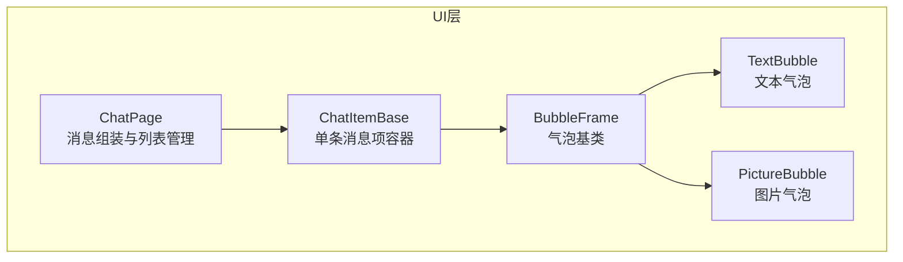
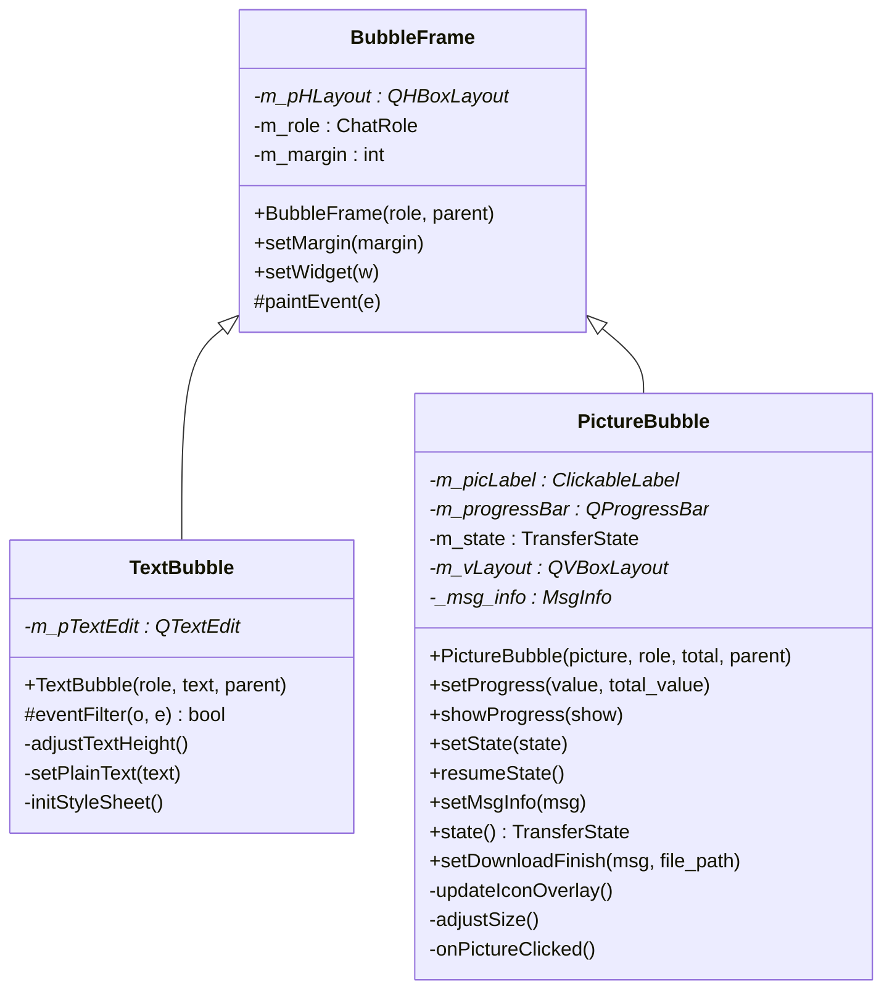
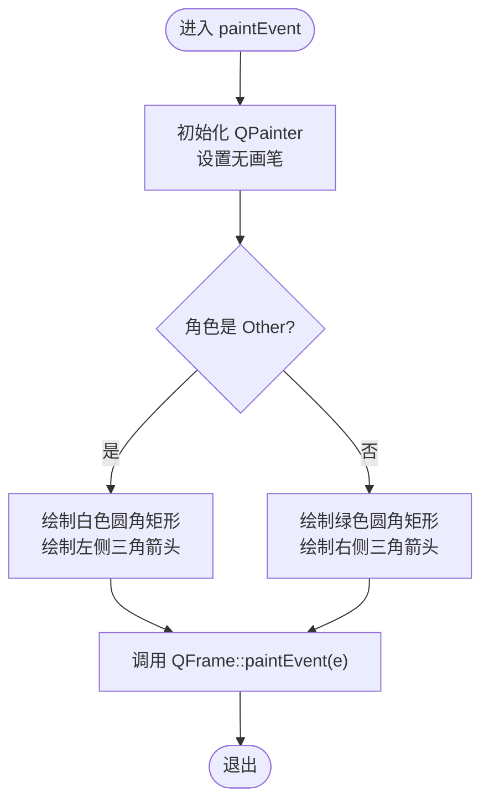
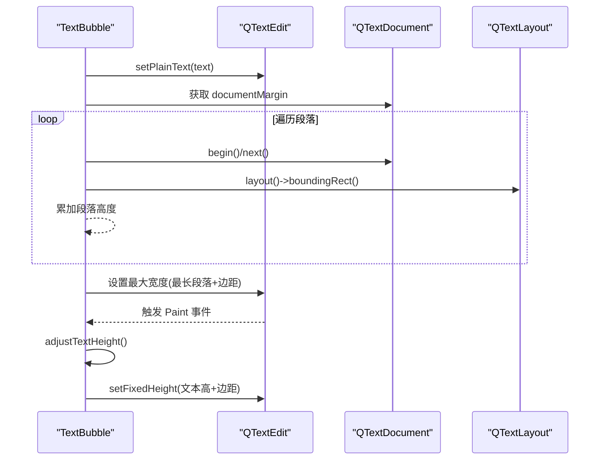
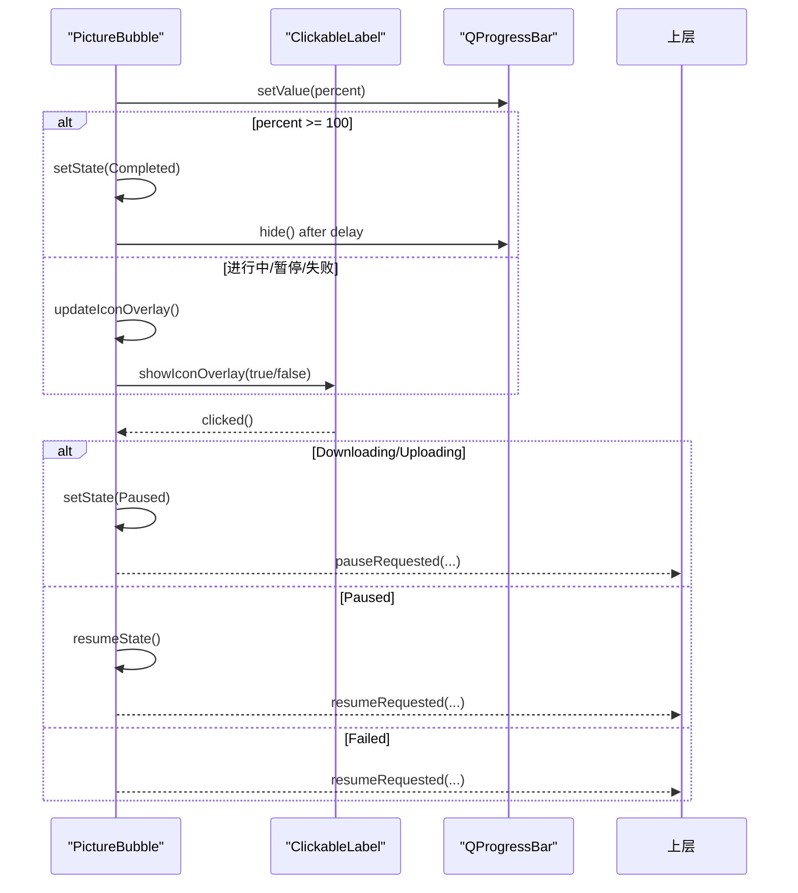
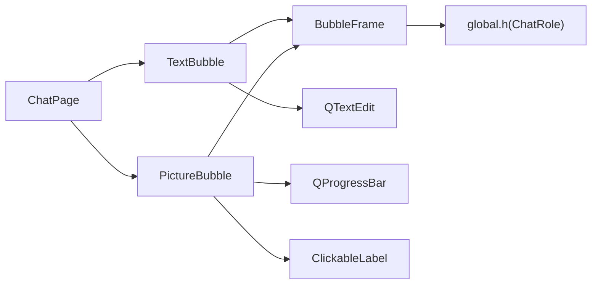

# BubbleFrame聊天气泡控件

<cite>
**本文引用的文件**   
- [BubbleFrame.h](file://client/llfcchat/include/BubbleFrame.h)
- [BubbleFrame.cpp](file://client/llfcchat/src/BubbleFrame.cpp)
- [TextBubble.h](file://client/llfcchat/include/TextBubble.h)
- [TextBubble.cpp](file://client/llfcchat/src/TextBubble.cpp)
- [PictureBubble.h](file://client/llfcchat/include/PictureBubble.h)
- [PictureBubble.cpp](file://client/llfcchat/src/PictureBubble.cpp)
- [global.h](file://client/llfcchat/include/global.h)
- [chatpage.cpp](file://client/llfcchat/src/chatpage.cpp)
- [day22.气泡聊天对话框.md](file://开发文档/day22.气泡聊天对话框.md)
</cite>

## 目录
1. [简介](#简介)
2. [项目结构](#项目结构)
3. [核心组件](#核心组件)
4. [架构总览](#架构总览)
5. [详细组件分析](#详细组件分析)
6. [依赖关系分析](#依赖关系分析)
7. [性能与布局特性](#性能与布局特性)
8. [故障排查指南](#故障排查指南)
9. [结论](#结论)
10. [附录：使用示例与样式定制](#附录使用示例与样式定制)

## 简介
本文件为 BubbleFrame 聊天气泡控件的完整技术文档。内容覆盖：
- ChatRole 角色区分（发送方/接收方）对气泡外观与布局的影响
- 气泡边框绘制与自适应布局算法
- paintEvent 事件处理机制、QPainter 绘图 API 的使用、颜色主题切换、圆角矩形绘制
- setWidget 方法如何动态嵌入消息内容，setMargin 边距控制的作用
- 与 TextBubble、PictureBubble 的继承关系及样式定制方法
- 完整使用示例与自定义样式指南

## 项目结构
BubbleFrame 及其派生类位于客户端 UI 层，负责聊天消息的气泡展示；ChatPage 作为上层容器负责根据消息类型创建对应的气泡实例并插入到聊天列表中。

图表来源
- [chatpage.cpp:66-174](file://client/llfcchat/src/chatpage.cpp#L66-L174)
- [BubbleFrame.h:1-24](file://client/llfcchat/include/BubbleFrame.h#L1-L24)
- [TextBubble.h:1-24](file://client/llfcchat/include/TextBubble.h#L1-L24)
- [PictureBubble.h:1-53](file://client/llfcchat/include/PictureBubble.h#L1-L53)

章节来源
- [chatpage.cpp:66-174](file://client/llfcchat/src/chatpage.cpp#L66-L174)
- [BubbleFrame.h:1-24](file://client/llfcchat/include/BubbleFrame.h#L1-L24)
- [TextBubble.h:1-24](file://client/llfcchat/include/TextBubble.h#L1-L24)
- [PictureBubble.h:1-53](file://client/llfcchat/include/PictureBubble.h#L1-L53)

## 核心组件
- BubbleFrame：气泡基类，封装了左右三角箭头、圆角矩形背景、水平布局与内容嵌入接口。
- TextBubble：基于 QTextEdit 的文本气泡，支持自动宽度与高度计算、透明背景与无边框样式。
- PictureBubble：基于 QLabel + QProgressBar 的图片气泡，支持缩放、进度显示、状态切换与图标叠加。

章节来源
- [BubbleFrame.cpp:1-73](file://client/llfcchat/src/BubbleFrame.cpp#L1-L73)
- [TextBubble.cpp:1-79](file://client/llfcchat/src/TextBubble.cpp#L1-L79)
- [PictureBubble.cpp:1-243](file://client/llfcchat/src/PictureBubble.cpp#L1-L243)

## 架构总览
BubbleFrame 通过 Qt 的 QFrame 提供自定义绘制能力，内部使用 QHBoxLayout 管理子控件。ChatRole 决定三角箭头方向与背景色，从而区分“我”和“对方”。TextBubble 与 PictureBubble 分别扩展了文本和图片内容的自适应布局与交互逻辑。

图表来源
- [BubbleFrame.h:1-24](file://client/llfcchat/include/BubbleFrame.h#L1-L24)
- [BubbleFrame.cpp:1-73](file://client/llfcchat/src/BubbleFrame.cpp#L1-L73)
- [TextBubble.h:1-24](file://client/llfcchat/include/TextBubble.h#L1-L24)
- [TextBubble.cpp:1-79](file://client/llfcchat/src/TextBubble.cpp#L1-L79)
- [PictureBubble.h:1-53](file://client/llfcchat/include/PictureBubble.h#L1-L53)
- [PictureBubble.cpp:1-243](file://client/llfcchat/src/PictureBubble.cpp#L1-L243)

## 详细组件分析

### BubbleFrame：气泡基类
- 角色区分与布局
  - 构造函数根据 ChatRole 设置 QHBoxLayout 的边距，使三角箭头在左侧或右侧留出空间。
  - setMargin 预留用于调整内边距，当前实现未生效（占位）。
- 内容嵌入
  - setWidget 将子控件添加到水平布局中，且仅允许添加一次，避免重复插入。
- 绘制机制
  - paintEvent 使用 QPainter 绘制圆角矩形背景与三角形箭头。
  - ChatRole::Other：白色背景，三角箭头指向左侧。
  - ChatRole::Self：绿色背景，三角箭头指向右侧。
  - 绘制完成后调用父类 paintEvent 以渲染子控件。

图表来源
- [BubbleFrame.cpp:34-72](file://client/llfcchat/src/BubbleFrame.cpp#L34-L72)

章节来源
- [BubbleFrame.h:1-24](file://client/llfcchat/include/BubbleFrame.h#L1-L24)
- [BubbleFrame.cpp:1-73](file://client/llfcchat/src/BubbleFrame.cpp#L1-L73)

### TextBubble：文本气泡
- 构造与样式
  - 创建只读 QTextEdit，关闭滚动条，安装事件过滤器，设置字体与透明背景无边框样式。
- 自适应宽度
  - setPlainText 遍历文档段落，计算最宽段落的像素宽度，结合文档边距与布局左右边距，设置气泡最大宽度。
- 自适应高度
  - eventFilter 拦截 Paint 事件，调用 adjustTextHeight 累加各段落布局高度，加上文档边距与垂直边距，设置固定高度。
- 样式定制
  - initStyleSheet 设置 QTextEdit 透明背景与无边框，确保与气泡背景融合。

图表来源
- [TextBubble.cpp:37-73](file://client/llfcchat/src/TextBubble.cpp#L37-L73)

章节来源
- [TextBubble.h:1-24](file://client/llfcchat/include/TextBubble.h#L1-L24)
- [TextBubble.cpp:1-79](file://client/llfcchat/src/TextBubble.cpp#L1-L79)

### PictureBubble：图片气泡
- 构造与布局
  - 使用 QVBoxLayout 垂直排列图片标签与进度条，图片按最大宽高等比缩放，固定尺寸。
- 进度与状态
  - setProgress 更新进度百分比，达到 100% 后延迟隐藏进度条。
  - setState 根据传输状态显示/隐藏进度条，并更新图标叠加（暂停/播放/下载）。
  - resumeState 根据传输类型恢复相应状态。
- 点击交互
  - onPictureClicked 根据当前状态执行暂停、继续、重试等操作，并通过信号通知上层。
- 下载完成
  - setDownloadFinish 设置进度为 100%，加载本地图片并刷新显示。

图表来源
- [PictureBubble.cpp:82-243](file://client/llfcchat/src/PictureBubble.cpp#L82-L243)

章节来源
- [PictureBubble.h:1-53](file://client/llfcchat/include/PictureBubble.h#L1-L53)
- [PictureBubble.cpp:1-243](file://client/llfcchat/src/PictureBubble.cpp#L1-L243)

### ChatRole 角色区分
- ChatRole::Self：表示“我”发送的消息，气泡背景为绿色，三角箭头指向右侧。
- ChatRole::Other：表示“对方”发送的消息，气泡背景为白色，三角箭头指向左侧。
- 该枚举定义于全局头文件，供气泡组件与上层逻辑共同使用。

章节来源
- [global.h:138-143](file://client/llfcchat/include/global.h#L138-L143)

## 依赖关系分析
- ChatPage 根据消息类型创建 TextBubble 或 PictureBubble，并将其放入 ChatItemBase 容器中，再追加到聊天列表。
- BubbleFrame 依赖 global.h 中的 ChatRole 枚举。
- TextBubble 依赖 QTextEdit、QFontMetricsF、QTextDocument、QTextLayout 进行文本度量与布局。
- PictureBubble 依赖 ClickableLabel、QProgressBar、QTimer 与全局传输状态枚举。

图表来源
- [chatpage.cpp:66-174](file://client/llfcchat/src/chatpage.cpp#L66-L174)
- [BubbleFrame.h:1-24](file://client/llfcchat/include/BubbleFrame.h#L1-L24)
- [TextBubble.h:1-24](file://client/llfcchat/include/TextBubble.h#L1-L24)
- [PictureBubble.h:1-53](file://client/llfcchat/include/PictureBubble.h#L1-L53)

章节来源
- [chatpage.cpp:66-174](file://client/llfcchat/src/chatpage.cpp#L66-L174)
- [global.h:138-143](file://client/llfcchat/include/global.h#L138-L143)

## 性能与布局特性
- 文本气泡
  - 通过遍历段落计算最大宽度与高度，避免不必要的重绘；仅在 Paint 事件中调整高度，减少频繁布局计算。
  - 使用只读 QTextEdit 与透明背景，降低渲染开销。
- 图片气泡
  - 图片按比例缩放至固定最大尺寸，避免大图导致布局抖动。
  - 进度条与图标叠加按需显示，减少无效绘制。
- 气泡绘制
  - 使用 QPainter 直接绘制圆角矩形与三角形，避免复杂样式带来的性能损耗。
  - 三角箭头宽度常量化，便于统一风格与计算。

[本节为通用指导，不直接分析具体文件]

## 故障排查指南
- 气泡内容未显示
  - 检查 setWidget 是否被多次调用（仅允许一次），确认布局 count 是否为 0。
  - 确认 ChatRole 是否正确传入，影响三角箭头位置与背景色。
- 文本气泡高度异常
  - 检查 eventFilter 是否拦截到 Paint 事件，确保 adjustTextHeight 被调用。
  - 确认 QTextEdit 的 documentMargin 与布局边距设置正确。
- 图片气泡进度不更新
  - 检查 setProgress 的 value 与 total_value 是否一致，确保百分比计算正确。
  - 确认 setState 的状态流转是否符合预期（Downloading/Uploading/Paused/Completed/Failed）。
- 样式不生效
  - 确认 initStyleSheet 已调用，QTextEdit 背景透明与无边框设置正确。
  - 若使用外部样式表，检查选择器与对象名是否匹配。

章节来源
- [BubbleFrame.cpp:25-32](file://client/llfcchat/src/BubbleFrame.cpp#L25-L32)
- [TextBubble.cpp:28-35](file://client/llfcchat/src/TextBubble.cpp#L28-L35)
- [PictureBubble.cpp:82-149](file://client/llfcchat/src/PictureBubble.cpp#L82-L149)

## 结论
BubbleFrame 提供了简洁而强大的聊天气泡基础能力，通过 ChatRole 区分角色、QPainter 绘制圆角与三角箭头、以及灵活的 setWidget 嵌入机制，实现了文本与图片消息的高效展示。TextBubble 与 PictureBubble 在此基础上分别实现了自适应布局与传输状态交互，满足常见聊天场景需求。整体设计清晰、可扩展性强，适合进一步定制样式与行为。

[本节为总结性内容，不直接分析具体文件]

## 附录：使用示例与样式定制

### 使用示例
- 创建文本气泡
  - 在 ChatPage 中根据消息类型创建 TextBubble，并设置角色与文本内容。
- 创建图片气泡
  - 根据预览图与总大小创建 PictureBubble，设置角色与消息信息，连接暂停/恢复信号。
- 插入聊天列表
  - 将气泡放入 ChatItemBase，再追加到聊天列表。

章节来源
- [chatpage.cpp:66-174](file://client/llfcchat/src/chatpage.cpp#L66-L174)

### 样式定制指南
- 气泡背景与三角箭头
  - 修改 BubbleFrame::paintEvent 中的背景色与圆角半径，调整三角箭头宽度与位置。
- 文本气泡样式
  - 在 TextBubble::initStyleSheet 中设置 QTextEdit 的背景、边框、字体与颜色。
- 图片气泡样式
  - 在 PictureBubble 构造中调整 QProgressBar 的样式表，包括进度条颜色、圆角与文字可见性。
- 主题切换
  - 可通过 repolish 函数刷新样式（全局变量），或在运行时替换样式表。

章节来源
- [BubbleFrame.cpp:34-72](file://client/llfcchat/src/BubbleFrame.cpp#L34-L72)
- [TextBubble.cpp:75-79](file://client/llfcchat/src/TextBubble.cpp#L75-L79)
- [PictureBubble.cpp:44-58](file://client/llfcchat/src/PictureBubble.cpp#L44-L58)
- [global.h:28-31](file://client/llfcchat/include/global.h#L28-L31)

### 参考文档
- 气泡聊天对话框设计与实现细节可参考开发文档 day22。

章节来源
- [day22.气泡聊天对话框.md:122-274](file://开发文档/day22.气泡聊天对话框.md#L122-L274)