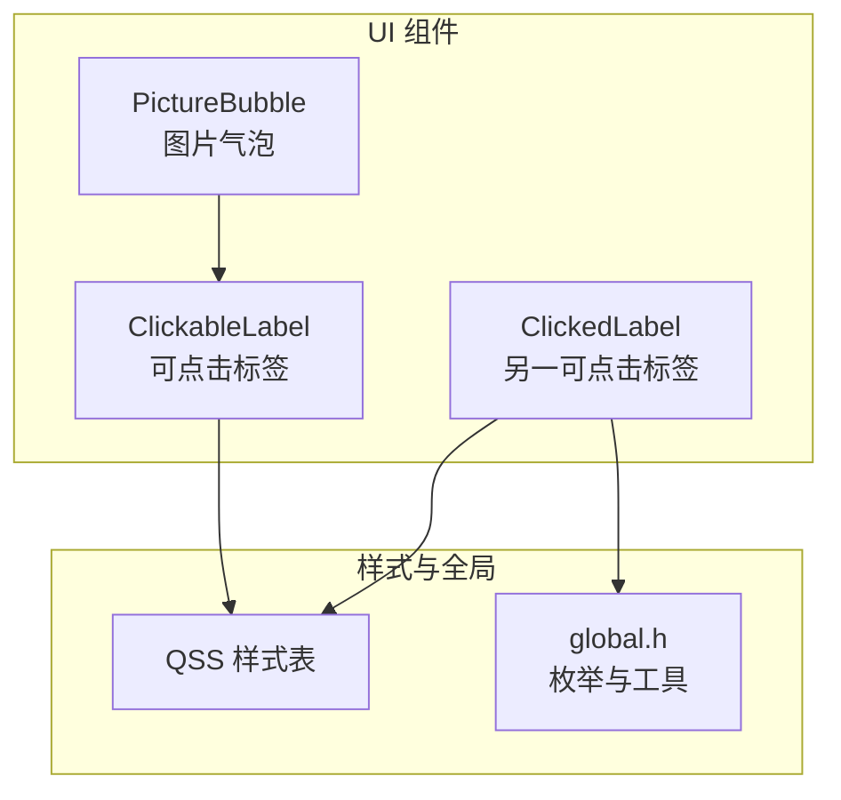
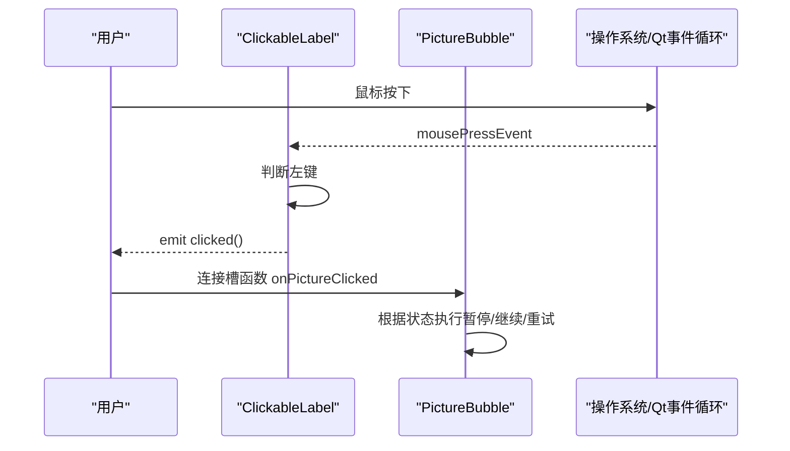
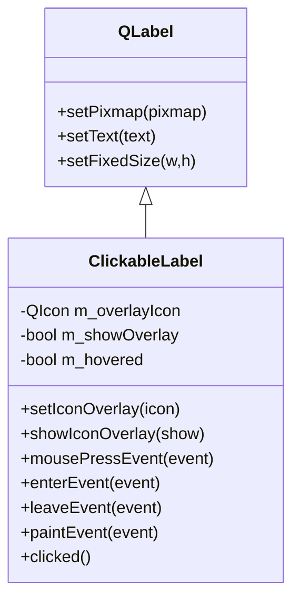
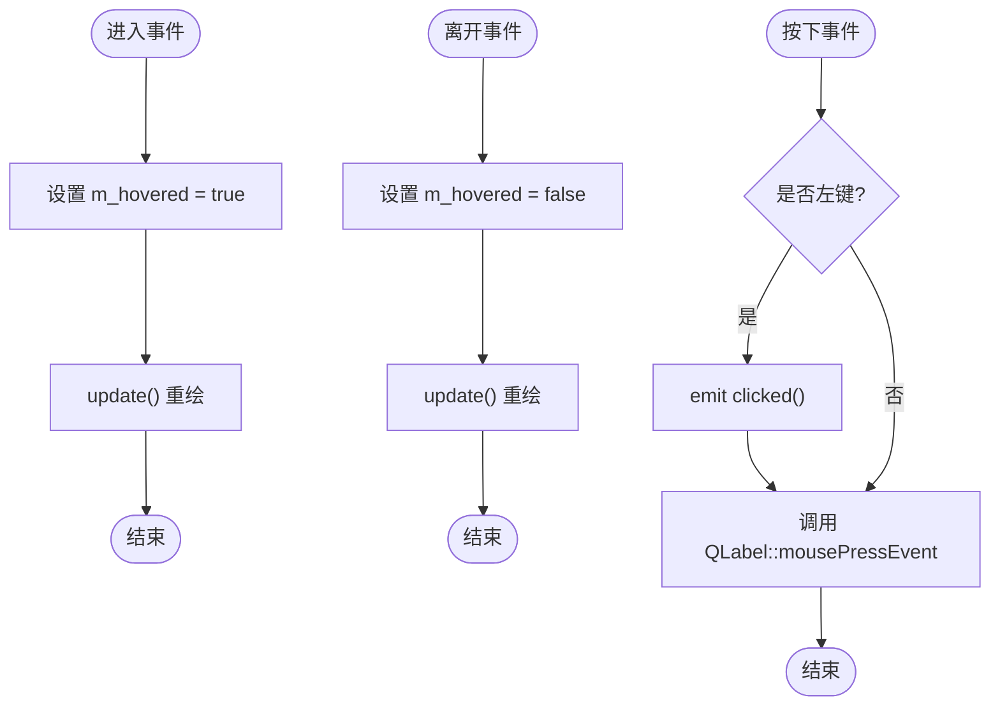
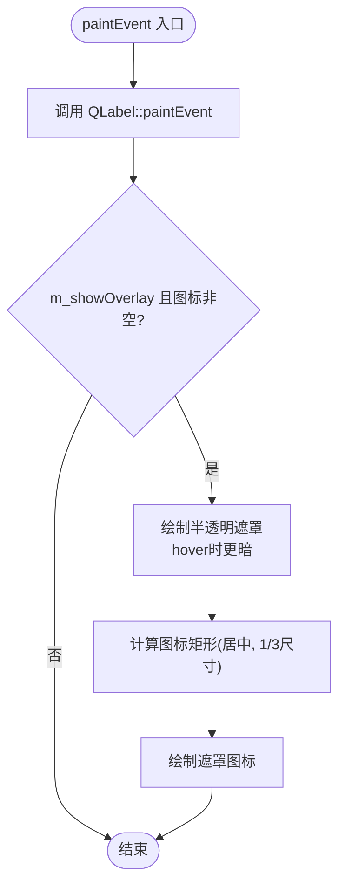
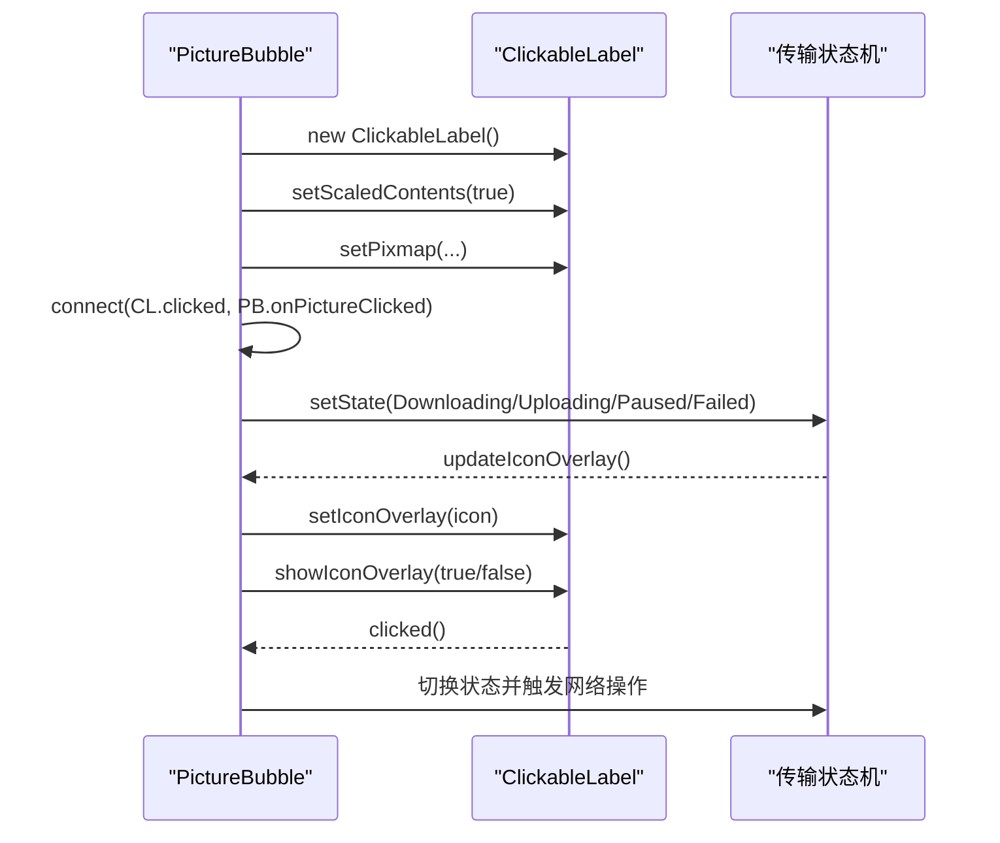
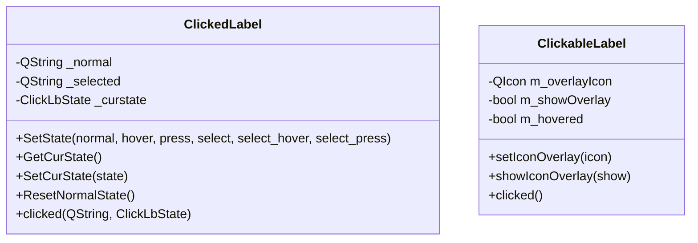
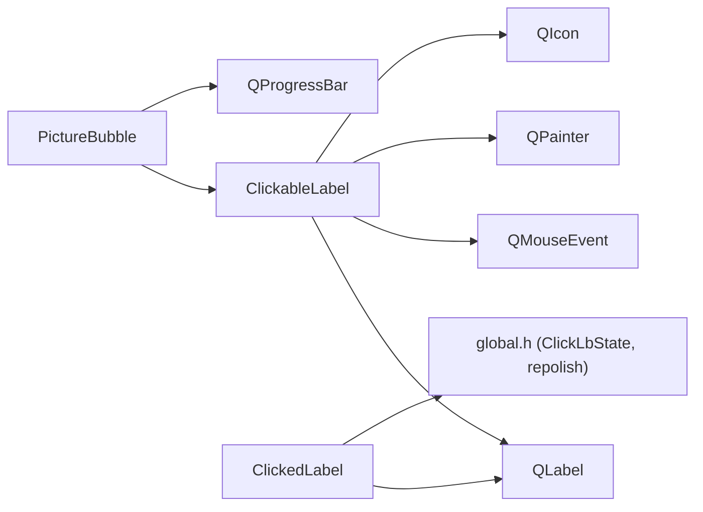

# ClickableLabel可点击标签

<cite>
**本文引用的文件**   
- [ClickableLabel.h](file://client/llfcchat/include/ClickableLabel.h)
- [ClickableLabel.cpp](file://client/llfcchat/src/ClickableLabel.cpp)
- [PictureBubble.cpp](file://client/llfcchat/src/PictureBubble.cpp)
- [global.h](file://client/llfcchat/include/global.h)
- [clickedlabel.h](file://client/llfcchat/include/clickedlabel.h)
- [clickedlabel.cpp](file://client/llfcchat/src/clickedlabel.cpp)
- [stylesheet.qss](file://client/llfcchat/resources/style/stylesheet.qss)
</cite>

## 目录
1. [简介](#简介)
2. [项目结构](#项目结构)
3. [核心组件](#核心组件)
4. [架构总览](#架构总览)
5. [详细组件分析](#详细组件分析)
6. [依赖关系分析](#依赖关系分析)
7. [性能考量](#性能考量)
8. [故障排查指南](#故障排查指南)
9. [结论](#结论)
10. [附录](#附录)

## 简介
本文件为 ClickableLabel 可点击标签控件的完整技术文档。该控件基于 QLabel 扩展，提供：
- 鼠标事件处理（按下、移动、释放）与悬停反馈
- 图标遮罩叠加显示（用于暂停/播放/重试等状态提示）
- clicked 信号发射机制，便于上层业务回调
- 与 QSS 样式系统配合的状态化外观定制
- 在 PictureBubble 中的实际使用示例（图片消息的点击交互）

同时，文档还对比了同仓库中另一个可点击标签 ClickedLabel，帮助理解不同实现风格与适用场景。

## 项目结构
ClickableLabel 位于客户端 UI 层，作为通用可点击文本/图像容器被多处复用。其头文件定义类接口与信号，源文件实现事件处理与绘制逻辑；PictureBubble 展示了如何在聊天气泡中组合使用 ClickableLabel 完成图片点击控制传输状态。

图表来源 
- [ClickableLabel.h:1-29](file://client/llfcchat/include/ClickableLabel.h#L1-L29)
- [ClickableLabel.cpp:1-74](file://client/llfcchat/src/ClickableLabel.cpp#L1-L74)
- [PictureBubble.cpp:20-243](file://client/llfcchat/src/PictureBubble.cpp#L20-L243)
- [clickedlabel.h:1-39](file://client/llfcchat/include/clickedlabel.h#L1-L39)
- [global.h:113-116](file://client/llfcchat/include/global.h#L113-L116)

章节来源
- [ClickableLabel.h:1-29](file://client/llfcchat/include/ClickableLabel.h#L1-L29)
- [ClickableLabel.cpp:1-74](file://client/llfcchat/src/ClickableLabel.cpp#L1-L74)
- [PictureBubble.cpp:20-243](file://client/llfcchat/src/PictureBubble.cpp#L20-L243)

## 核心组件
- ClickableLabel
  - 继承自 QLabel，启用鼠标跟踪与手型光标，提供 clicked 信号
  - 支持设置并切换图标遮罩（如暂停/播放/重试），根据悬停状态改变遮罩透明度
  - 重写 mousePressEvent、enterEvent、leaveEvent、paintEvent 实现交互与绘制
- PictureBubble
  - 将 ClickableLabel 嵌入图片气泡，绑定 clicked 信号到 onPictureClicked
  - 根据传输状态动态更新遮罩图标与进度条，并通过 ClickableLabel 暴露点击能力

章节来源
- [ClickableLabel.h:1-29](file://client/llfcchat/include/ClickableLabel.h#L1-L29)
- [ClickableLabel.cpp:1-74](file://client/llfcchat/src/ClickableLabel.cpp#L1-L74)
- [PictureBubble.cpp:20-243](file://client/llfcchat/src/PictureBubble.cpp#L20-L243)

## 架构总览
ClickableLabel 通过 Qt 的事件系统与信号槽机制与上层组件解耦。PictureBubble 负责业务状态管理，ClickableLabel 专注交互与视觉反馈。

图表来源 
- [ClickableLabel.cpp:14-20](file://client/llfcchat/src/ClickableLabel.cpp#L14-L20)
- [PictureBubble.cpp:32-33](file://client/llfcchat/src/PictureBubble.cpp#L32-L33)
- [PictureBubble.cpp:189-217](file://client/llfcchat/src/PictureBubble.cpp#L189-L217)

## 详细组件分析

### ClickableLabel 类设计
- 继承关系：QLabel -> ClickableLabel
- 关键成员：
  - m_overlayIcon：遮罩图标
  - m_showOverlay：是否显示遮罩
  - m_hovered：当前是否悬停
- 关键方法：
  - setIconOverlay / showIconOverlay：设置并控制遮罩显示
  - mousePressEvent：捕获左键点击并发射 clicked
  - enterEvent / leaveEvent：维护悬停状态并重绘
  - paintEvent：先调用基类绘制文本/图片，再叠加半透明遮罩与图标

图表来源 
- [ClickableLabel.h:6-27](file://client/llfcchat/include/ClickableLabel.h#L6-L27)
- [ClickableLabel.cpp:5-12](file://client/llfcchat/src/ClickableLabel.cpp#L5-L12)

章节来源
- [ClickableLabel.h:1-29](file://client/llfcchat/include/ClickableLabel.h#L1-L29)
- [ClickableLabel.cpp:1-74](file://client/llfcchat/src/ClickableLabel.cpp#L1-L74)

### 鼠标事件处理机制
- mousePressEvent
  - 仅响应左键，发射 clicked 信号，随后调用基类处理以保证默认行为
- enterEvent / leaveEvent
  - 维护 m_hovered 标志位，触发 update() 重绘以刷新遮罩透明度
- mouseMoveEvent
  - 未重写；由于启用了鼠标跟踪，enter/leave 已足够驱动悬停效果

图表来源 
- [ClickableLabel.cpp:14-20](file://client/llfcchat/src/ClickableLabel.cpp#L14-L20)
- [ClickableLabel.cpp:22-34](file://client/llfcchat/src/ClickableLabel.cpp#L22-L34)

章节来源
- [ClickableLabel.cpp:14-34](file://client/llfcchat/src/ClickableLabel.cpp#L14-L34)

### 悬停效果与绘制
- 光标变化：构造函数中设置手型光标，提升可点击感知
- 颜色反馈：paintEvent 中根据 m_hovered 选择不同透明度的黑色遮罩
- 边框高亮：可通过 QSS 对 state 属性进行样式控制（见 stylesheet.qss 示例）
- 图标遮罩：按控件宽高计算居中图标区域，绘制遮罩与图标

图表来源 
- [ClickableLabel.cpp:36-62](file://client/llfcchat/src/ClickableLabel.cpp#L36-L62)

章节来源
- [ClickableLabel.cpp:36-62](file://client/llfcchat/src/ClickableLabel.cpp#L36-L62)

### clicked 信号与事件过滤器
- 信号发射：在 mousePressEvent 中左键按下时发射 clicked
- 事件过滤器：本实现未使用事件过滤器，直接重写事件处理器；如需拦截子部件事件或跨组件过滤，可在父级安装 eventFilter
- 与 QLabel 的关系：继承后保留文本/图片显示能力，叠加自定义交互与绘制

章节来源
- [ClickableLabel.cpp:14-20](file://client/llfcchat/src/ClickableLabel.cpp#L14-L20)
- [ClickableLabel.h:6-27](file://client/llfcchat/include/ClickableLabel.h#L6-L27)

### 与 PictureBubble 的集成示例
- 创建 ClickableLabel 并设置缩放内容与固定尺寸
- 连接 clicked 信号到 onPictureClicked
- 根据传输状态调用 setIconOverlay 与 showIconOverlay 展示暂停/播放/重试图标
- 进度条与遮罩联动，点击实现暂停/继续/重试

图表来源 
- [PictureBubble.cpp:23-33](file://client/llfcchat/src/PictureBubble.cpp#L23-L33)
- [PictureBubble.cpp:219-243](file://client/llfcchat/src/PictureBubble.cpp#L219-L243)
- [PictureBubble.cpp:189-217](file://client/llfcchat/src/PictureBubble.cpp#L189-L217)

章节来源
- [PictureBubble.cpp:20-243](file://client/llfcchat/src/PictureBubble.cpp#L20-L243)

### 与 ClickedLabel 的对比
- ClickedLabel 强调“选中/未选中”状态切换，通过 property("state") 与 repolish 刷新 QSS
- ClickableLabel 强调“遮罩叠加+悬停透明度”，适合图片/文件传输状态指示
- 两者均继承 QLabel，但交互模型与样式策略不同

图表来源 
- [clickedlabel.h:6-36](file://client/llfcchat/include/clickedlabel.h#L6-L36)
- [clickedlabel.cpp:1-133](file://client/llfcchat/src/clickedlabel.cpp#L1-L133)
- [ClickableLabel.h:6-27](file://client/llfcchat/include/ClickableLabel.h#L6-L27)

章节来源
- [clickedlabel.h:1-39](file://client/llfcchat/include/clickedlabel.h#L1-L39)
- [clickedlabel.cpp:1-133](file://client/llfcchat/src/clickedlabel.cpp#L1-L133)
- [global.h:113-116](file://client/llfcchat/include/global.h#L113-L116)

## 依赖关系分析
- ClickableLabel 依赖 Qt 基础类：QLabel、QMouseEvent、QPainter、QIcon
- PictureBubble 依赖 ClickableLabel 与 QProgressBar，并通过信号槽耦合
- ClickedLabel 依赖 global.h 中的 ClickLbState 枚举与 repolish 工具函数

图表来源 
- [ClickableLabel.h:1-5](file://client/llfcchat/include/ClickableLabel.h#L1-L5)
- [ClickableLabel.cpp:1-4](file://client/llfcchat/src/ClickableLabel.cpp#L1-L4)
- [PictureBubble.cpp:20-64](file://client/llfcchat/src/PictureBubble.cpp#L20-L64)
- [clickedlabel.h:1-5](file://client/llfcchat/include/clickedlabel.h#L1-L5)
- [global.h:28-31](file://client/llfcchat/include/global.h#L28-L31)

章节来源
- [ClickableLabel.h:1-5](file://client/llfcchat/include/ClickableLabel.h#L1-L5)
- [ClickableLabel.cpp:1-4](file://client/llfcchat/src/ClickableLabel.cpp#L1-L4)
- [PictureBubble.cpp:20-64](file://client/llfcchat/src/PictureBubble.cpp#L20-L64)
- [clickedlabel.h:1-5](file://client/llfcchat/include/clickedlabel.h#L1-L5)
- [global.h:28-31](file://client/llfcchat/include/global.h#L28-L31)

## 性能考量
- 事件处理开销：仅在必要处调用 update()，避免频繁重绘
- 绘制优化：paintEvent 中先调用基类绘制，再按需叠加遮罩；图标尺寸按控件比例计算，减少大图缩放开销
- 鼠标跟踪：启用鼠标跟踪以获取 enter/leave，但未重写 mouseMoveEvent，降低每帧处理成本
- 资源管理：遮罩图标应复用同一 QIcon 实例，避免重复加载
- 样式刷新：结合 repolish 按需刷新 QSS，避免全量重绘

[本节为通用指导，不直接分析具体文件]

## 故障排查指南
- 点击无响应
  - 确认已启用鼠标跟踪与手型光标
  - 检查是否在 mousePressEvent 中正确判断左键并发射 clicked
- 遮罩不显示
  - 确保 setIconOverlay 设置了有效图标
  - 确认 showIconOverlay(true) 已被调用
  - 检查 paintEvent 中 m_showOverlay 与图标是否为空
- 悬停无变化
  - 检查 enterEvent/leaveEvent 是否正确设置 m_hovered 并调用 update()
- 样式未生效
  - 确认通过 property("state", ...) 设置状态值
  - 调用 repolish(this) 触发 QSS 重新应用

章节来源
- [ClickableLabel.cpp:5-12](file://client/llfcchat/src/ClickableLabel.cpp#L5-L12)
- [ClickableLabel.cpp:14-20](file://client/llfcchat/src/ClickableLabel.cpp#L14-L20)
- [ClickableLabel.cpp:22-34](file://client/llfcchat/src/ClickableLabel.cpp#L22-L34)
- [ClickableLabel.cpp:36-62](file://client/llfcchat/src/ClickableLabel.cpp#L36-L62)
- [clickedlabel.cpp:91-104](file://client/llfcchat/src/clickedlabel.cpp#L91-L104)

## 结论
ClickableLabel 是一个轻量、可复用的可点击标签控件，专注于：
- 清晰的鼠标交互与悬停反馈
- 灵活的遮罩叠加显示，适配多种业务状态
- 与 QSS 样式系统的无缝协作
- 与 PictureBubble 等业务组件的低耦合集成

在实际使用中，建议：
- 合理设置遮罩图标与透明度，保证视觉一致性
- 通过信号槽解耦点击逻辑，保持组件职责单一
- 谨慎使用 update() 与 repolish，避免不必要的重绘

[本节为总结性内容，不直接分析具体文件]

## 附录

### 使用示例要点（基于仓库代码）
- 创建与配置 ClickableLabel
  - 设置缩放内容与固定尺寸
  - 连接 clicked 信号到业务槽函数
- 状态驱动的遮罩显示
  - 根据下载/上传/暂停/失败等状态设置不同图标
  - 控制 showIconOverlay 显隐遮罩
- 样式定制
  - 通过 property("state", ...) 与 QSS 实现多态外观
  - 使用 repolish(this) 刷新样式

章节来源
- [PictureBubble.cpp:23-33](file://client/llfcchat/src/PictureBubble.cpp#L23-L33)
- [PictureBubble.cpp:219-243](file://client/llfcchat/src/PictureBubble.cpp#L219-L243)
- [stylesheet.qss:10-33](file://client/llfcchat/resources/style/stylesheet.qss#L10-L33)
- [clickedlabel.cpp:91-104](file://client/llfcchat/src/clickedlabel.cpp#L91-L104)