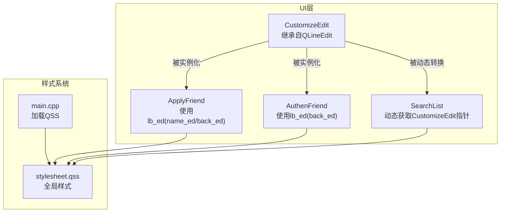
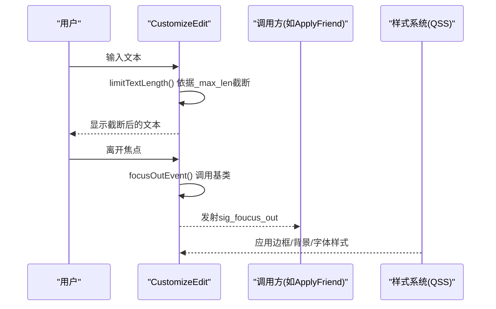
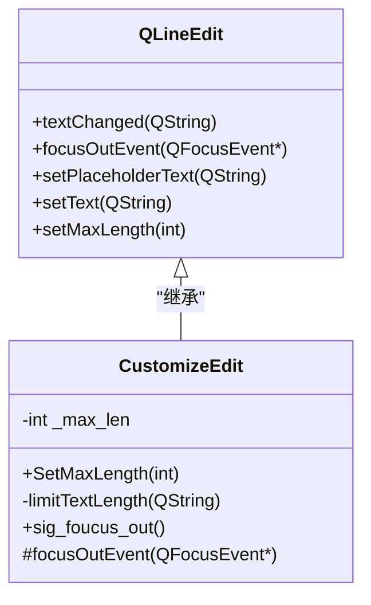
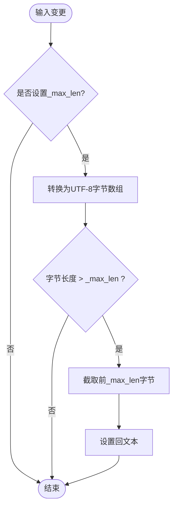
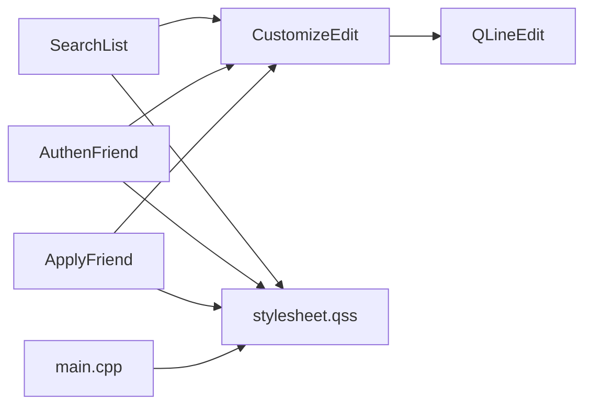

# CustomizeEdit自定义编辑框

<cite>
**本文引用的文件**   
- [customizeedit.h](file://client/llfcchat/include/customizeedit.h)
- [customizeedit.cpp](file://client/llfcchat/src/customizeedit.cpp)
- [applyfriend.cpp](file://client/llfcchat/src/applyfriend.cpp)
- [authenfriend.cpp](file://client/llfcchat/src/authenfriend.cpp)
- [searchlist.cpp](file://client/llfcchat/src/searchlist.cpp)
- [stylesheet.qss](file://client/llfcchat/resources/style/stylesheet.qss)
- [main.cpp](file://client/llfcchat/src/main.cpp)
</cite>

## 目录
1. [简介](#简介)
2. [项目结构](#项目结构)
3. [核心组件](#核心组件)
4. [架构总览](#架构总览)
5. [详细组件分析](#详细组件分析)
6. [依赖关系分析](#依赖关系分析)
7. [性能考量](#性能考量)
8. [故障排查指南](#故障排查指南)
9. [结论](#结论)
10. [附录](#附录)

## 简介
本文件为 CustomizeEdit 自定义编辑框控件的完整技术文档。该控件基于 QLineEdit 扩展，提供输入长度限制、失去焦点事件通知等能力，并在项目中广泛用于“申请好友”“认证好友”等对话框的标签与备注输入场景。本文围绕以下目标展开：
- 输入验证机制：当前实现以长度限制为主，未包含正则表达式与实时校验反馈；给出可扩展方案。
- 占位符文本：说明 placeholderText 的使用、颜色管理与焦点状态处理（通过样式表）。
- 样式美化：边框绘制、背景色、字体样式的统一配置方式。
- 继承与事件重写：与 QLineEdit 的继承关系、focusOutEvent 的重写策略。
- 输入限制、格式验证、用户体验优化：结合现有代码给出最佳实践与示例路径。
- 键盘快捷键与无障碍访问：回车触发、信号发射及可访问性建议。

## 项目结构
CustomizeEdit 位于客户端 UI 层，作为 QLineEdit 的子类被多处 UI 使用。其头文件与源文件分别位于 include 与 src 目录，样式由全局 QSS 管理，应用启动时加载。

图表来源
- [customizeedit.h:6-39](file://client/llfcchat/include/customizeedit.h#L6-L39)
- [customizeedit.cpp:1-12](file://client/llfcchat/src/customizeedit.cpp#L1-L12)
- [applyfriend.cpp:17-25](file://client/llfcchat/src/applyfriend.cpp#L17-L25)
- [authenfriend.cpp:17-25](file://client/llfcchat/src/authenfriend.cpp#L17-L25)
- [searchlist.cpp:105](file://client/llfcchat/src/searchlist.cpp#L105)
- [stylesheet.qss:164-170](file://client/llfcchat/resources/style/stylesheet.qss#L164-L170)
- [main.cpp:10-21](file://client/llfcchat/src/main.cpp#L10-L21)

章节来源
- [customizeedit.h:1-42](file://client/llfcchat/include/customizeedit.h#L1-L42)
- [customizeedit.cpp:1-12](file://client/llfcchat/src/customizeedit.cpp#L1-L12)
- [applyfriend.cpp:17-25](file://client/llfcchat/src/applyfriend.cpp#L17-L25)
- [authenfriend.cpp:17-25](file://client/llfcchat/src/authenfriend.cpp#L17-L25)
- [searchlist.cpp:105](file://client/llfcchat/src/searchlist.cpp#L105)
- [stylesheet.qss:164-170](file://client/llfcchat/resources/style/stylesheet.qss#L164-L170)
- [main.cpp:10-21](file://client/llfcchat/src/main.cpp#L10-L21)

## 核心组件
- CustomizeEdit：继承自 QLineEdit，提供最大长度限制与失去焦点信号。
- 使用方：ApplyFriend、AuthenFriend、SearchList 等界面通过 UI 或动态转换获得 CustomizeEdit 实例并绑定信号。
- 样式系统：通过 stylesheet.qss 对输入框进行统一的边框、背景、字体设置。

章节来源
- [customizeedit.h:6-39](file://client/llfcchat/include/customizeedit.h#L6-L39)
- [customizeedit.cpp:1-12](file://client/llfcchat/src/customizeedit.cpp#L1-L12)
- [applyfriend.cpp:36-39](file://client/llfcchat/src/applyfriend.cpp#L36-L39)
- [authenfriend.cpp:35-38](file://client/llfcchat/src/authenfriend.cpp#L35-L38)
- [searchlist.cpp:105](file://client/llfcchat/src/searchlist.cpp#L105)

## 架构总览
CustomizeEdit 在应用中承担“增强型单行输入”的职责，核心流程如下：
- 构造阶段：连接 textChanged 到内部长度限制逻辑。
- 输入阶段：用户输入触发 textChanged，内部根据 _max_len 截断超出部分。
- 失焦阶段：重写 focusOutEvent，调用基类行为后发射 sig_foucus_out 信号。
- 样式阶段：全局 QSS 控制外观（边框、背景、字体），placeholderText 由调用方设置。

图表来源
- [customizeedit.cpp:4-6](file://client/llfcchat/src/customizeedit.cpp#L4-L6)
- [customizeedit.h:23-34](file://client/llfcchat/include/customizeedit.h#L23-L34)
- [customizeedit.h:13-21](file://client/llfcchat/include/customizeedit.h#L13-L21)
- [stylesheet.qss:164-170](file://client/llfcchat/resources/style/stylesheet.qss#L164-L170)

## 详细组件分析

### 类结构与继承关系
CustomizeEdit 继承自 QLineEdit，扩展了最大长度限制与失焦信号。

图表来源
- [customizeedit.h:6-39](file://client/llfcchat/include/customizeedit.h#L6-L39)
- [customizeedit.cpp:1-12](file://client/llfcchat/src/customizeedit.cpp#L1-L12)

章节来源
- [customizeedit.h:6-39](file://client/llfcchat/include/customizeedit.h#L6-L39)
- [customizeedit.cpp:1-12](file://client/llfcchat/src/customizeedit.cpp#L1-L12)

### 输入验证机制（长度限制）
- 机制：构造函数中连接 textChanged 到 limitTextLength，当输入超过 _max_len 时按 UTF-8 字节数截断。
- 复杂度：每次输入 O(n)，n 为当前文本长度；截断操作为线性拷贝。
- 优化点：可引入增量校验与只比较新增字符，减少重复处理。

图表来源
- [customizeedit.h:23-34](file://client/llfcchat/include/customizeedit.h#L23-L34)
- [customizeedit.cpp:4-6](file://client/llfcchat/src/customizeedit.cpp#L4-L6)

章节来源
- [customizeedit.h:23-34](file://client/llfcchat/include/customizeedit.h#L23-L34)
- [customizeedit.cpp:4-6](file://client/llfcchat/src/customizeedit.cpp#L4-L6)

### 占位符文本与颜色管理
- 占位符设置：调用方通过 setPlaceholderText 设置提示文本，例如“搜索、添加标签”。
- 颜色与焦点：通过 QSS 统一控制输入框外观；焦点态可通过 ::focus 选择器调整边框或背景。
- 注意：当前 QSS 中未直接定义 CustomizeEdit 的 placeholder 颜色规则，如需定制可在 QSS 中添加对应规则。

章节来源
- [applyfriend.cpp:17-20](file://client/llfcchat/src/applyfriend.cpp#L17-L20)
- [authenfriend.cpp:17-19](file://client/llfcchat/src/authenfriend.cpp#L17-L19)
- [stylesheet.qss:164-170](file://client/llfcchat/resources/style/stylesheet.qss#L164-L170)

### 样式美化（边框、背景、字体）
- 全局样式：main.cpp 加载 stylesheet.qss，所有输入框遵循统一风格。
- 输入框样式：QSS 中对 chatEdit 等输入控件设置了背景、无边框、字体与内边距，可作为 CustomizeEdit 的参考样式。
- 建议：为 CustomizeEdit 增加专用选择器，确保在不同界面保持一致的外观。

章节来源
- [main.cpp:10-21](file://client/llfcchat/src/main.cpp#L10-L21)
- [stylesheet.qss:164-170](file://client/llfcchat/resources/style/stylesheet.qss#L164-L170)

### 事件重写策略（失焦）
- 重写 focusOutEvent：先调用基类实现，再发射 sig_foucus_out 信号，供上层监听。
- 使用方示例：ApplyFriend、AuthenFriend 将 returnPressed、textChanged、editingFinished 等信号连接到槽函数，形成完整的交互闭环。

章节来源
- [customizeedit.h:13-21](file://client/llfcchat/include/customizeedit.h#L13-L21)
- [applyfriend.cpp:36-39](file://client/llfcchat/src/applyfriend.cpp#L36-L39)
- [authenfriend.cpp:35-38](file://client/llfcchat/src/authenfriend.cpp#L35-L38)

### 输入限制、格式验证与用户体验优化
- 输入限制：通过 SetMaxLength 设置最大长度，内部按 UTF-8 字节限制，避免超长输入。
- 格式验证：当前未实现正则表达式验证；建议在 limitTextLength 之前插入 validateInput(text) 钩子，返回合法文本或空字符串。
- 实时反馈：可结合 textChanged 信号在调用方更新错误提示或禁用提交按钮，提升体验。
- 无障碍：为输入框设置 accessibleName 与工具提示，便于屏幕阅读器识别。

章节来源
- [customizeedit.cpp:8-11](file://client/llfcchat/src/customizeedit.cpp#L8-L11)
- [customizeedit.h:23-34](file://client/llfcchat/include/customizeedit.h#L23-L34)

### 键盘快捷键支持
- 回车键：QLineEdit 默认发射 returnPressed 信号，调用方可直接连接槽函数执行确认逻辑。
- 建议：在需要多行输入的控件上禁用 Enter 的默认行为，或在 CustomizeEdit 中拦截特定组合键以实现快捷操作。

章节来源
- [applyfriend.cpp:36-39](file://client/llfcchat/src/applyfriend.cpp#L36-L39)
- [authenfriend.cpp:35-38](file://client/llfcchat/src/authenfriend.cpp#L35-L38)

## 依赖关系分析
- CustomizeEdit 依赖 QLineEdit 提供的输入、事件与样式能力。
- 调用方依赖 CustomizeEdit 的信号（returnPressed、textChanged、editingFinished、sig_foucus_out）完成业务逻辑。
- 样式依赖 stylesheet.qss，由 main.cpp 统一加载。

图表来源
- [customizeedit.h:6-39](file://client/llfcchat/include/customizeedit.h#L6-L39)
- [applyfriend.cpp:36-39](file://client/llfcchat/src/applyfriend.cpp#L36-L39)
- [authenfriend.cpp:35-38](file://client/llfcchat/src/authenfriend.cpp#L35-L38)
- [searchlist.cpp:105](file://client/llfcchat/src/searchlist.cpp#L105)
- [main.cpp:10-21](file://client/llfcchat/src/main.cpp#L10-L21)

章节来源
- [customizeedit.h:6-39](file://client/llfcchat/include/customizeedit.h#L6-L39)
- [applyfriend.cpp:36-39](file://client/llfcchat/src/applyfriend.cpp#L36-L39)
- [authenfriend.cpp:35-38](file://client/llfcchat/src/authenfriend.cpp#L35-L38)
- [searchlist.cpp:105](file://client/llfcchat/src/searchlist.cpp#L105)
- [main.cpp:10-21](file://client/llfcchat/src/main.cpp#L10-L21)

## 性能考量
- 长度限制复杂度：每次输入 O(n)，在高频率输入场景下可能产生轻微卡顿。建议采用增量校验，仅处理新增字符。
- UTF-8 转换开销：频繁 toUtf8 与 fromUtf8 转换有成本，可缓存已计算长度或使用 QRegularExpression 预编译模式。
- 样式渲染：大量 QSS 规则会影响渲染性能，建议按需加载或合并规则。

[本节为通用指导，不直接分析具体文件]

## 故障排查指南
- 输入未被限制：检查是否调用 SetMaxLength 且 _max_len > 0；确认 textChanged 连接成功。
- 失焦信号未触发：确认 focusOutEvent 中调用了基类实现且信号已连接。
- 占位符不可见：检查 QSS 是否覆盖默认样式；必要时为 placeholder 添加显式颜色规则。
- 回车无效：确认 returnPressed 信号已连接至槽函数。

章节来源
- [customizeedit.cpp:4-6](file://client/llfcchat/src/customizeedit.cpp#L4-L6)
- [customizeedit.h:13-21](file://client/llfcchat/include/customizeedit.h#L13-L21)
- [applyfriend.cpp:36-39](file://client/llfcchat/src/applyfriend.cpp#L36-L39)
- [authenfriend.cpp:35-38](file://client/llfcchat/src/authenfriend.cpp#L35-L38)

## 结论
CustomizeEdit 在当前项目中提供了基础的单行输入增强能力，包括长度限制与失焦信号。样式通过全局 QSS 统一管理，占位符文本由调用方设置。若需更完善的输入验证与实时反馈，可在现有框架基础上扩展正则验证与错误提示机制，同时保持与 QLineEdit 的事件兼容性与无障碍支持。

[本节为总结，不直接分析具体文件]

## 附录
- 使用示例路径：
  - 占位符设置与长度限制：[applyfriend.cpp:17-25](file://client/llfcchat/src/applyfriend.cpp#L17-L25)、[authenfriend.cpp:17-25](file://client/llfcchat/src/authenfriend.cpp#L17-L25)
  - 信号连接与回调：[applyfriend.cpp:36-39](file://client/llfcchat/src/applyfriend.cpp#L36-L39)、[authenfriend.cpp:35-38](file://client/llfcchat/src/authenfriend.cpp#L35-L38)
  - 动态获取 CustomizeEdit：[searchlist.cpp:105](file://client/llfcchat/src/searchlist.cpp#L105)
  - 样式加载与输入框样式：[main.cpp:10-21](file://client/llfcchat/src/main.cpp#L10-L21)、[stylesheet.qss:164-170](file://client/llfcchat/resources/style/stylesheet.qss#L164-L170)