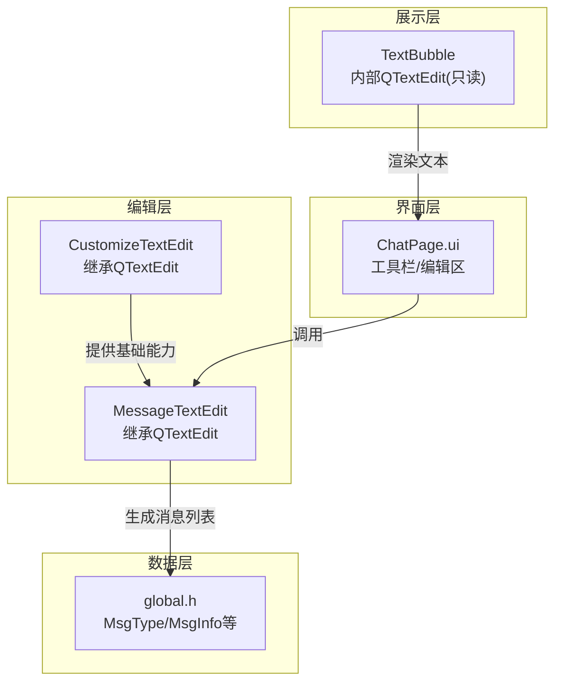
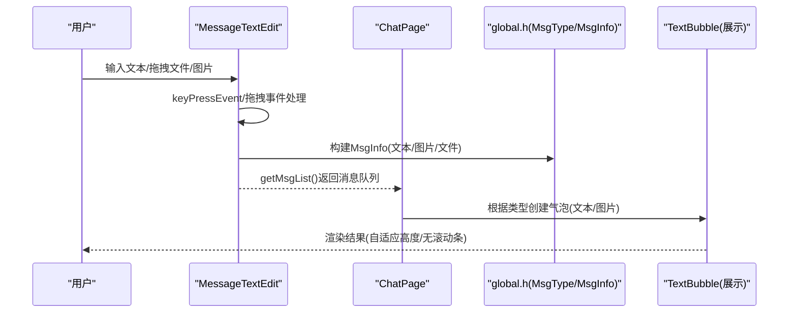
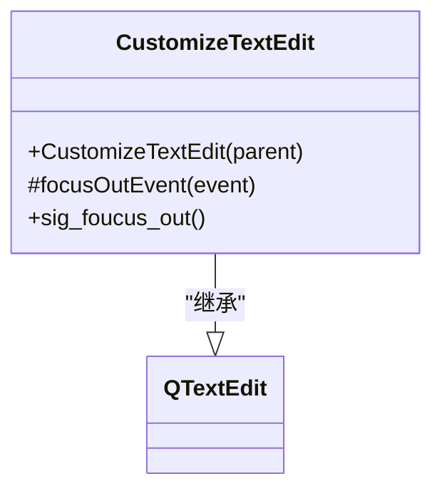
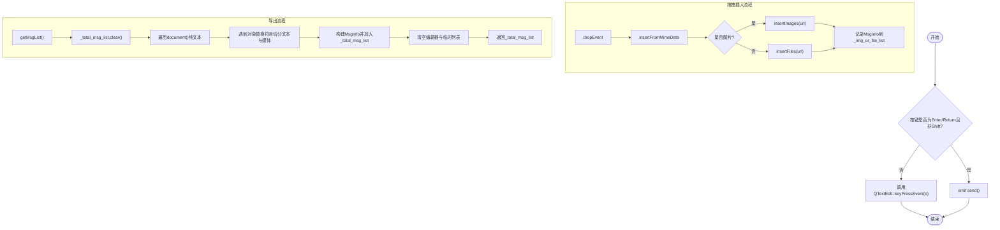
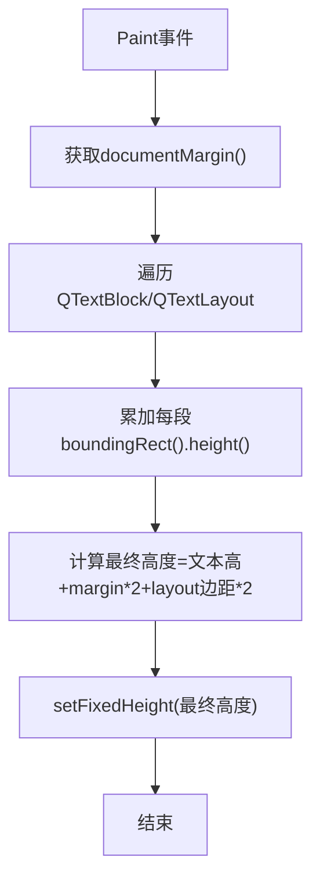
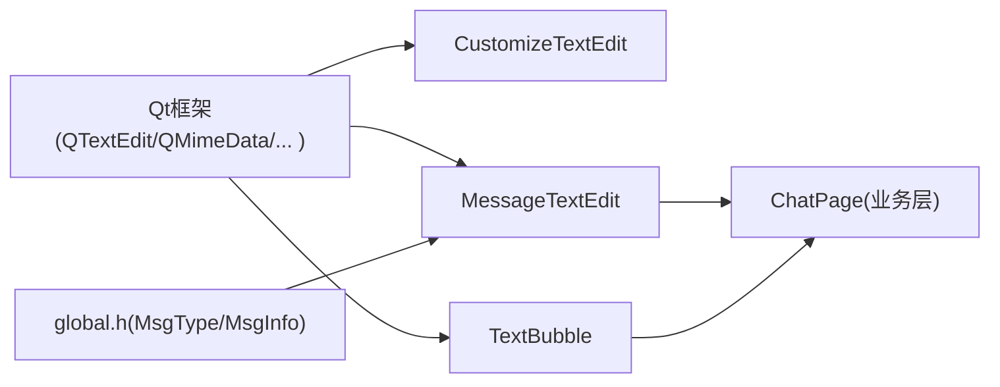

# CustomizeTextEdit多行编辑框

<cite>
**本文引用的文件**   
- [customizetextedit.h](file://client/llfcchat/include/customizetextedit.h)
- [customizetextedit.cpp](file://client/llfcchat/src/customizetextedit.cpp)
- [MessageTextEdit.h](file://client/llfcchat/include/MessageTextEdit.h)
- [MessageTextEdit.cpp](file://client/llfcchat/src/MessageTextEdit.cpp)
- [global.h](file://client/llfcchat/include/global.h)
- [TextBubble.cpp](file://client/llfcchat/src/TextBubble.cpp)
- [chatpage.ui](file://client/llfcchat/ui/chatpage.ui)
- [chatpage.cpp](file://client/llfcchat/src/chatpage.cpp)
</cite>

## 目录
1. [简介](#简介)
2. [项目结构](#项目结构)
3. [核心组件](#核心组件)
4. [架构总览](#架构总览)
5. [详细组件分析](#详细组件分析)
6. [依赖关系分析](#依赖关系分析)
7. [性能与内存优化](#性能与内存优化)
8. [故障排查指南](#故障排查指南)
9. [结论](#结论)
10. [附录：扩展建议与最佳实践](#附录：扩展建议与最佳实践)

## 简介
本文件围绕 CustomizeTextEdit 多行编辑框控件，结合仓库中已有的 QTextEdit 定制实现（CustomizeTextEdit、MessageTextEdit）以及气泡文本展示（TextBubble），系统阐述多行文本处理能力、富文本支持、输入增强特性、事件过滤机制、大文本处理优化、导出与查找替换、快捷键定制等。文档同时给出代码级架构图与流程图，帮助读者快速理解并在此基础上进行二次开发。

## 项目结构
与 CustomizeTextEdit 相关的源码主要位于客户端模块的 include 与 src 目录，UI 定义在 ui 目录中。关键文件包括：
- 基础多行编辑封装：CustomizeTextEdit（继承自 QTextEdit）
- 消息编辑增强：MessageTextEdit（继承自 QTextEdit，支持拖拽图片/文件、发送快捷键等）
- 气泡文本显示：TextBubble（内部使用只读 QTextEdit 自适应高度）
- UI 布局：chatpage.ui（包含聊天页工具栏与编辑区占位）
- 全局类型与数据结构：global.h（消息类型、传输状态等）

图表来源
- [customizetextedit.h:1-26](file://client/llfcchat/include/customizetextedit.h#L1-L26)
- [MessageTextEdit.h:1-62](file://client/llfcchat/include/MessageTextEdit.h#L1-L62)
- [TextBubble.cpp:1-35](file://client/llfcchat/src/TextBubble.cpp#L1-L35)
- [chatpage.ui:1-200](file://client/llfcchat/ui/chatpage.ui#L1-L200)
- [global.h:145-200](file://client/llfcchat/include/global.h#L145-L200)

章节来源
- [customizetextedit.h:1-26](file://client/llfcchat/include/customizetextedit.h#L1-L26)
- [MessageTextEdit.h:1-62](file://client/llfcchat/include/MessageTextEdit.h#L1-L62)
- [chatpage.ui:1-200](file://client/llfcchat/ui/chatpage.ui#L1-L200)
- [global.h:145-200](file://client/llfcchat/include/global.h#L145-L200)

## 核心组件
- CustomizeTextEdit：轻量封装，仅重写焦点事件以发出“失去焦点”信号，便于上层监听。
- MessageTextEdit：面向消息输入的增强型多行编辑器，支持：
  - 键盘回车发送（非 Shift+Enter）
  - 拖拽图片/文件插入预览
  - 将纯文本与媒体资源统一转换为消息列表（文本、图片、文件）
  - 限制文件大小与格式校验
- TextBubble：用于聊天气泡中的只读文本展示，自动计算内容高度并隐藏滚动条，保持气泡紧凑。

章节来源
- [customizetextedit.cpp:1-7](file://client/llfcchat/src/customizetextedit.cpp#L1-L7)
- [MessageTextEdit.cpp:1-319](file://client/llfcchat/src/MessageTextEdit.cpp#L1-L319)
- [TextBubble.cpp:1-35](file://client/llfcchat/src/TextBubble.cpp#L1-L35)

## 架构总览
下图展示了从用户输入到消息导出的整体流程，以及各组件之间的交互关系。

图表来源
- [MessageTextEdit.cpp:83-91](file://client/llfcchat/src/MessageTextEdit.cpp#L83-L91)
- [MessageTextEdit.cpp:22-67](file://client/llfcchat/src/MessageTextEdit.cpp#L22-L67)
- [global.h:145-200](file://client/llfcchat/include/global.h#L145-L200)
- [TextBubble.cpp:12-26](file://client/llfcchat/src/TextBubble.cpp#L12-L26)

## 详细组件分析

### CustomizeTextEdit 组件
- 继承关系：直接继承 QTextEdit，保留全部多行编辑能力。
- 事件处理：重写 focusOutEvent，在失去焦点时调用基类逻辑并发出 sig_foucus_out 信号。
- 适用场景：需要监听多行编辑框失焦行为的页面或对话框。

图表来源
- [customizetextedit.h:5-24](file://client/llfcchat/include/customizetextedit.h#L5-L24)
- [customizetextedit.cpp:3-6](file://client/llfcchat/src/customizetextedit.cpp#L3-L6)

章节来源
- [customizetextedit.h:1-26](file://client/llfcchat/include/customizetextedit.h#L1-L26)
- [customizetextedit.cpp:1-7](file://client/llfcchat/src/customizetextedit.cpp#L1-L7)

### MessageTextEdit 组件
- 功能要点：
  - 键盘事件：Enter/Return 触发发送信号；Shift+Enter 换行。
  - 拖拽支持：dragEnterEvent/dropEvent 解析 MIME 数据，区分图片与文件。
  - 插入逻辑：insertImages/insertFiles 分别处理图片缩放与文件图标预览，记录 MsgInfo。
  - 导出逻辑：getMsgList 遍历文档，按对象替换符拆分文本与媒体，生成统一的消息列表并清空编辑器。
  - 大小与格式限制：图片与文件均有限制提示与 MD5 计算（MD5 计算函数由外部提供）。
- 数据结构：
  - _img_or_file_list：暂存当前编辑过程中的图片/文件信息。
  - _total_msg_list：最终导出的消息列表。
  - global.h 中的 MsgType/MsgInfo 用于统一描述消息类型与元数据。

图表来源
- [MessageTextEdit.cpp:83-91](file://client/llfcchat/src/MessageTextEdit.cpp#L83-L91)
- [MessageTextEdit.cpp:69-81](file://client/llfcchat/src/MessageTextEdit.cpp#L69-L81)
- [MessageTextEdit.cpp:93-104](file://client/llfcchat/src/MessageTextEdit.cpp#L93-L104)
- [MessageTextEdit.cpp:106-155](file://client/llfcchat/src/MessageTextEdit.cpp#L106-L155)
- [MessageTextEdit.cpp:157-192](file://client/llfcchat/src/MessageTextEdit.cpp#L157-L192)
- [MessageTextEdit.cpp:22-67](file://client/llfcchat/src/MessageTextEdit.cpp#L22-L67)
- [global.h:145-200](file://client/llfcchat/include/global.h#L145-L200)

章节来源
- [MessageTextEdit.h:1-62](file://client/llfcchat/include/MessageTextEdit.h#L1-L62)
- [MessageTextEdit.cpp:1-319](file://client/llfcchat/src/MessageTextEdit.cpp#L1-L319)
- [global.h:145-200](file://client/llfcchat/include/global.h#L145-L200)

### TextBubble 组件（只读文本展示）
- 行为特征：
  - 只读模式，关闭水平/垂直滚动条，保证气泡紧凑。
  - 安装事件过滤器，在 Paint 事件中计算文本高度并调整气泡固定高度。
  - 样式表设置透明背景与无边框，使气泡更贴合设计。
- 高度计算：遍历 QTextDocument 的每个段落，累加布局矩形高度，加上文档边距与布局边距得到最终高度。

图表来源
- [TextBubble.cpp:12-26](file://client/llfcchat/src/TextBubble.cpp#L12-L26)
- [TextBubble.cpp:28-35](file://client/llfcchat/src/TextBubble.cpp#L28-L35)

章节来源
- [TextBubble.cpp:1-35](file://client/llfcchat/src/TextBubble.cpp#L1-L35)

## 依赖关系分析
- CustomizeTextEdit 依赖 Qt 的 QTextEdit，提供基础多行编辑能力与焦点事件扩展。
- MessageTextEdit 依赖 Qt 的 QTextEdit、QMimeData、QFileInfo、QPainter 等，实现富媒体插入与预览。
- TextBubble 依赖 QTextDocument、QTextBlock、QTextLayout 进行高度测量与绘制。
- global.h 定义了 MsgType、MsgInfo、TransferState 等核心数据结构，被 MessageTextEdit 与上层业务（如 ChatPage）共同使用。

图表来源
- [customizetextedit.h:5-24](file://client/llfcchat/include/customizetextedit.h#L5-L24)
- [MessageTextEdit.h:1-62](file://client/llfcchat/include/MessageTextEdit.h#L1-L62)
- [TextBubble.cpp:1-35](file://client/llfcchat/src/TextBubble.cpp#L1-L35)
- [global.h:145-200](file://client/llfcchat/include/global.h#L145-L200)

章节来源
- [customizetextedit.h:1-26](file://client/llfcchat/include/customizetextedit.h#L1-L26)
- [MessageTextEdit.h:1-62](file://client/llfcchat/include/MessageTextEdit.h#L1-L62)
- [TextBubble.cpp:1-35](file://client/llfcchat/src/TextBubble.cpp#L1-L35)
- [global.h:145-200](file://client/llfcchat/include/global.h#L145-L200)

## 性能与内存优化
- 大文本处理
  - 避免频繁重建文档：批量更新时使用 QTextCursor 操作，减少重排次数。
  - 懒加载与分页：对超长历史消息采用分页加载，仅在可见区域渲染。
  - 文本测量优化：TextBubble 的高度计算应在必要时触发（如内容变更或窗口尺寸变化），避免每帧重算。
- 内存管理
  - 及时释放临时 QPixmap/QImage：插入图片后尽快释放中间图像对象，避免内存峰值。
  - 控制最大高度：MessageTextEdit 设置了最大高度，防止无限增长导致内存膨胀。
  - 清理临时列表：getMsgList 完成后清空 _img_or_file_list 与 _total_msg_list，避免累积。
- 性能调优
  - 禁用不必要的滚动条：TextBubble 关闭滚动条以减少绘制开销。
  - 合并网络请求：发送消息前聚合文本片段，减少网络往返（参考 ChatPage 发送逻辑）。
  - 异步计算：文件 MD5、缩略图生成可放入后台线程，避免阻塞 UI。

[本节为通用指导，不直接分析具体文件]

## 故障排查指南
- 回车未触发发送
  - 检查 keyPressEvent 是否正确拦截 Enter/Return，并确保未屏蔽默认行为。
  - 确认 Shift+Enter 换行逻辑未被误改。
- 拖拽无效或无法识别文件类型
  - 检查 dragEnterEvent 与 dropEvent 是否接受事件。
  - 确认 canInsertFromMimeData 与 insertFromMimeData 的实现是否覆盖默认行为。
  - 核对 isImage 后缀白名单与实际文件扩展名一致。
- 气泡高度不正确或出现滚动条
  - 确保 eventFilter 在 Paint 事件中调用 adjustTextHeight。
  - 检查 documentMargin 与 layout 边距设置是否与预期一致。
- 导出消息为空或顺序错误
  - 检查 getMsgList 遍历逻辑是否正确识别对象替换符。
  - 确认 _img_or_file_list 与文档 HTML 中的 URL 匹配策略。

章节来源
- [MessageTextEdit.cpp:83-91](file://client/llfcchat/src/MessageTextEdit.cpp#L83-L91)
- [MessageTextEdit.cpp:69-81](file://client/llfcchat/src/MessageTextEdit.cpp#L69-L81)
- [MessageTextEdit.cpp:22-67](file://client/llfcchat/src/MessageTextEdit.cpp#L22-L67)
- [TextBubble.cpp:28-35](file://client/llfcchat/src/TextBubble.cpp#L28-L35)

## 结论
CustomizeTextEdit 提供了轻量化的多行编辑能力，而 MessageTextEdit 在此基础上实现了面向消息输入的完整工作流，包括键盘快捷键、拖拽富媒体、统一消息导出与大小限制。配合 TextBubble 的只读自适应展示，形成了从输入到展示的闭环。通过合理的性能优化与内存管理策略，可在大文本与多媒体场景下保持流畅体验。后续可扩展语法高亮、自动补全、拼写检查、查找替换与快捷键定制等功能，以满足更复杂的编辑需求。

[本节为总结性内容，不直接分析具体文件]

## 附录：扩展建议与最佳实践
- 自动补全
  - 基于 QCompleter 或自定义词法分析器，在 textChanged 信号中触发候选项计算。
  - 使用延迟与去抖策略，避免频繁 UI 刷新。
- 拼写检查
  - 集成第三方词典库，基于 QTextCursor 定位单词边界，标记错误位置。
  - 提供右键菜单修正建议。
- 撤销/重做栈
  - 利用 QTextEdit 内置的 undo/redo 能力，必要时扩展自定义动作。
- 查找/替换
  - 使用 QTextDocument::find 实现跨段落搜索，支持正则表达式与高亮匹配。
- 快捷键定制
  - 在 keyPressEvent 中注册自定义组合键，优先处理业务快捷键，再回退到基类行为。
- 导出功能
  - 支持导出为纯文本、HTML 或 PDF，注意图片与文件的嵌入策略。
- 大文本优化
  - 分段加载与虚拟滚动，按需渲染可见区域。
  - 增量更新与批处理，降低重排成本。

[本节为概念性内容，不直接分析具体文件]