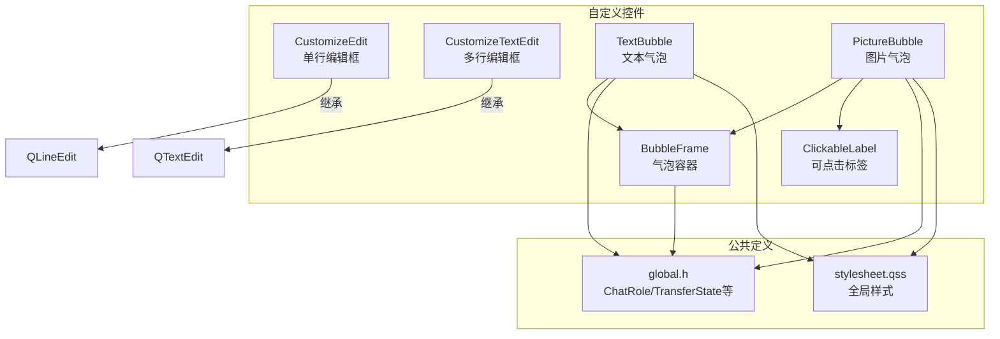
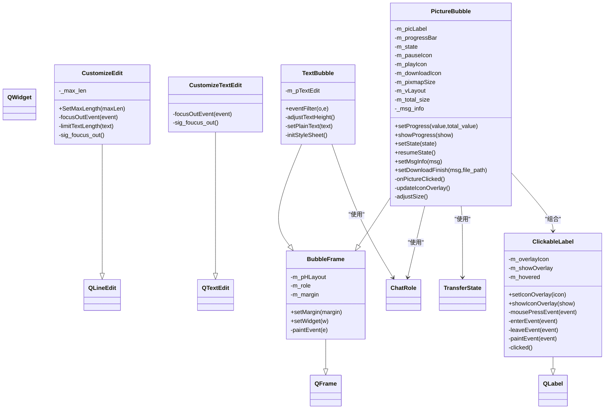
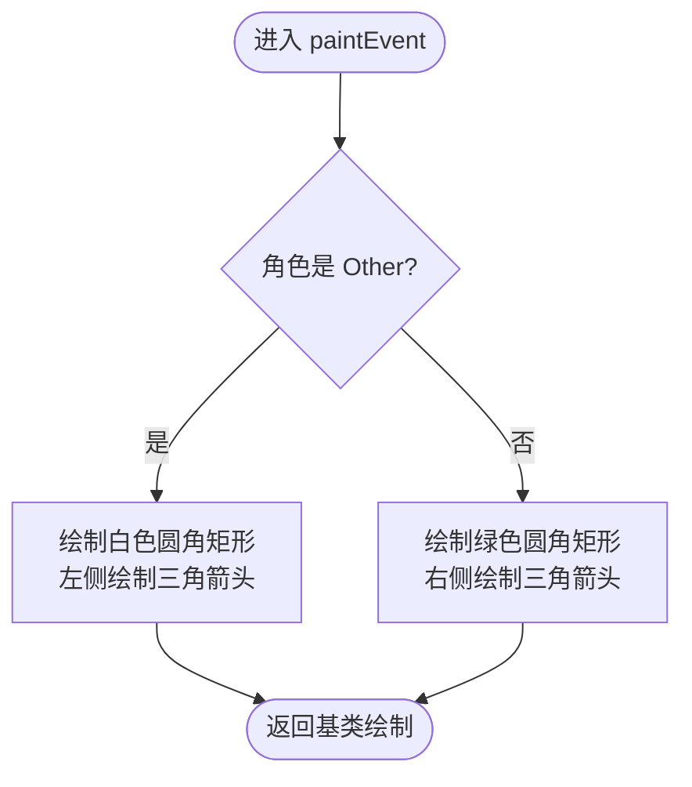
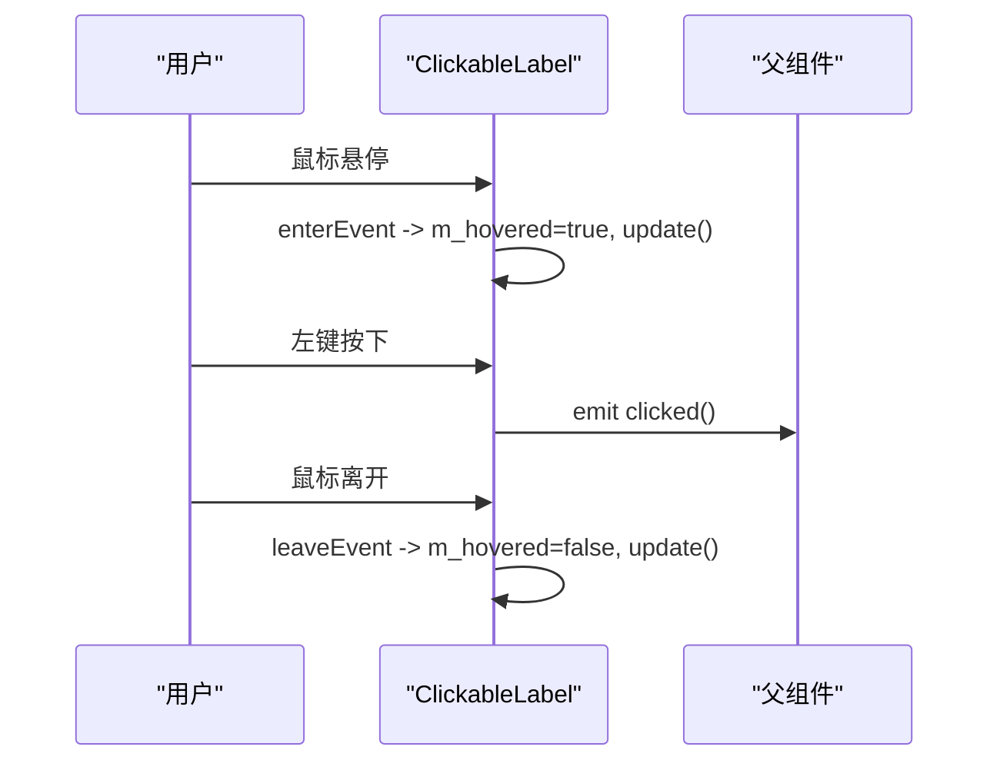
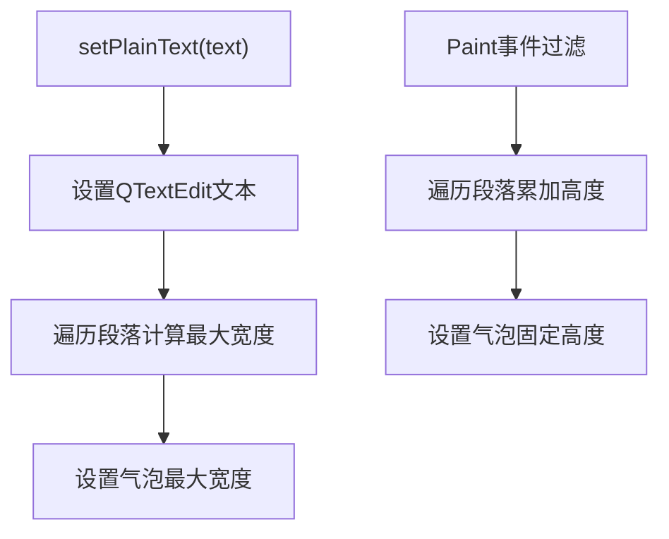
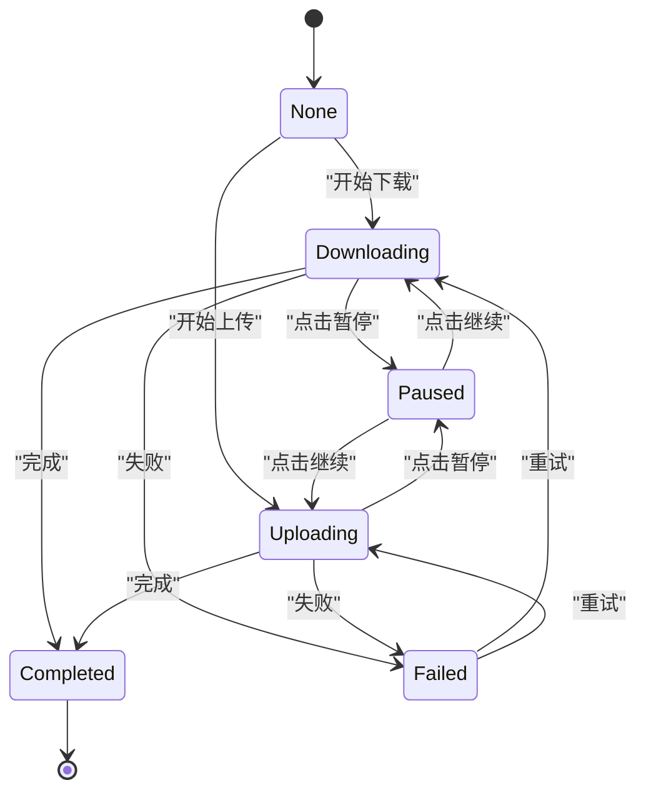
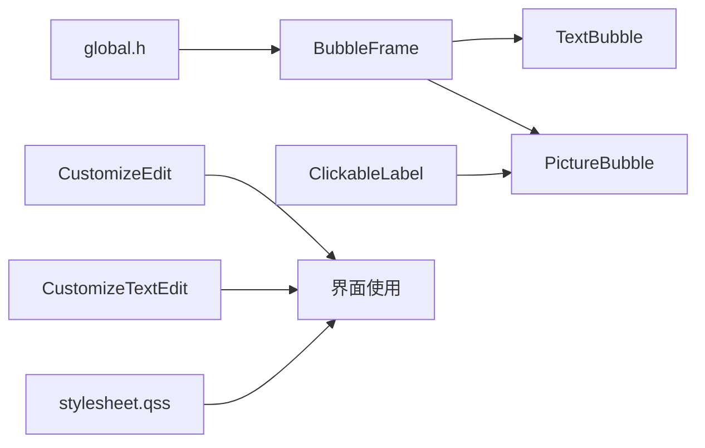

# 自定义控件开发

<cite>
**本文引用的文件**   
- [BubbleFrame.h](file://client/llfcchat/include/BubbleFrame.h)
- [BubbleFrame.cpp](file://client/llfcchat/src/BubbleFrame.cpp)
- [ClickableLabel.h](file://client/llfcchat/include/ClickableLabel.h)
- [ClickableLabel.cpp](file://client/llfcchat/src/ClickableLabel.cpp)
- [customizeedit.h](file://client/llfcchat/include/customizeedit.h)
- [customizeedit.cpp](file://client/llfcchat/src/customizeedit.cpp)
- [customizetextedit.h](file://client/llfcchat/include/customizetextedit.h)
- [customizetextedit.cpp](file://client/llfcchat/src/customizetextedit.cpp)
- [TextBubble.h](file://client/llfcchat/include/TextBubble.h)
- [TextBubble.cpp](file://client/llfcchat/src/TextBubble.cpp)
- [PictureBubble.h](file://client/llfcchat/include/PictureBubble.h)
- [PictureBubble.cpp](file://client/llfcchat/src/PictureBubble.cpp)
- [global.h](file://client/llfcchat/include/global.h)
- [stylesheet.qss](file://client/llfcchat/resources/style/stylesheet.qss)
</cite>

## 目录
1. [简介](#简介)
2. [项目结构](#项目结构)
3. [核心组件](#核心组件)
4. [架构总览](#架构总览)
5. [详细组件分析](#详细组件分析)
6. [依赖关系分析](#依赖关系分析)
7. [性能考量](#性能考量)
8. [故障排查指南](#故障排查指南)
9. [结论](#结论)
10. [附录：使用示例与样式定制](#附录使用示例与样式定制)

## 简介
本文件面向LLFCChat客户端的自定义控件，系统性说明以下控件的设计与实现：
- BubbleFrame聊天气泡容器：负责气泡背景绘制、三角箭头方向、自适应布局。
- ClickableLabel可点击标签：鼠标事件处理、悬停效果、遮罩图标叠加。
- CustomizeEdit单行编辑框：输入长度限制、失去焦点信号。
- CustomizeTextEdit多行编辑框：失去焦点信号。
- TextBubble文本气泡：基于BubbleFrame封装QTextEdit，自动计算宽高并适配气泡尺寸。
- PictureBubble图片气泡：展示图片、进度条、暂停/继续/失败状态及交互。

文档同时给出继承体系、事件机制、属性绑定方法、复用与扩展最佳实践，以及完整的使用示例和样式定制指南。

## 项目结构
自定义控件位于client/llfcchat/include与src目录下，按“头文件+实现”组织；全局类型定义在global.h中；样式统一由stylesheet.qss管理。

图表来源
- [BubbleFrame.h:1-24](file://client/llfcchat/include/BubbleFrame.h#L1-L24)
- [BubbleFrame.cpp:1-73](file://client/llfcchat/src/BubbleFrame.cpp#L1-L73)
- [ClickableLabel.h:1-29](file://client/llfcchat/include/ClickableLabel.h#L1-L29)
- [ClickableLabel.cpp:1-74](file://client/llfcchat/src/ClickableLabel.cpp#L1-L74)
- [customizeedit.h:1-42](file://client/llfcchat/include/customizeedit.h#L1-L42)
- [customizeedit.cpp:1-12](file://client/llfcchat/src/customizeedit.cpp#L1-L12)
- [customizetextedit.h:1-27](file://client/llfcchat/include/customizetextedit.h#L1-L27)
- [customizetextedit.cpp:1-7](file://client/llfcchat/src/customizetextedit.cpp#L1-L7)
- [TextBubble.h:1-24](file://client/llfcchat/include/TextBubble.h#L1-L24)
- [TextBubble.cpp:1-79](file://client/llfcchat/src/TextBubble.cpp#L1-L79)
- [PictureBubble.h:1-53](file://client/llfcchat/include/PictureBubble.h#L1-L53)
- [PictureBubble.cpp:1-243](file://client/llfcchat/src/PictureBubble.cpp#L1-L243)
- [global.h:138-165](file://client/llfcchat/include/global.h#L138-L165)
- [stylesheet.qss:132-152](file://client/llfcchat/resources/style/stylesheet.qss#L132-L152)

章节来源
- [BubbleFrame.h:1-24](file://client/llfcchat/include/BubbleFrame.h#L1-L24)
- [BubbleFrame.cpp:1-73](file://client/llfcchat/src/BubbleFrame.cpp#L1-L73)
- [ClickableLabel.h:1-29](file://client/llfcchat/include/ClickableLabel.h#L1-L29)
- [ClickableLabel.cpp:1-74](file://client/llfcchat/src/ClickableLabel.cpp#L1-L74)
- [customizeedit.h:1-42](file://client/llfcchat/include/customizeedit.h#L1-L42)
- [customizeedit.cpp:1-12](file://client/llfcchat/src/customizeedit.cpp#L1-L12)
- [customizetextedit.h:1-27](file://client/llfcchat/include/customizetextedit.h#L1-L27)
- [customizetextedit.cpp:1-7](file://client/llfcchat/src/customizetextedit.cpp#L1-L7)
- [TextBubble.h:1-24](file://client/llfcchat/include/TextBubble.h#L1-L24)
- [TextBubble.cpp:1-79](file://client/llfcchat/src/TextBubble.cpp#L1-L79)
- [PictureBubble.h:1-53](file://client/llfcchat/include/PictureBubble.h#L1-L53)
- [PictureBubble.cpp:1-243](file://client/llfcchat/src/PictureBubble.cpp#L1-L243)
- [global.h:138-165](file://client/llfcchat/include/global.h#L138-L165)
- [stylesheet.qss:132-152](file://client/llfcchat/resources/style/stylesheet.qss#L132-L152)

## 核心组件
- BubbleFrame：提供气泡容器能力，根据角色（Self/Other）决定三角箭头方向与背景色，内部使用水平布局承载子控件。
- ClickableLabel：在QLabel基础上增加鼠标事件、悬停高亮、遮罩图标叠加显示能力。
- CustomizeEdit：在QLineEdit基础上增加最大长度限制与失去焦点信号。
- CustomizeTextEdit：在QTextEdit基础上增加失去焦点信号。
- TextBubble：基于BubbleFrame封装只读QTextEdit，自动计算文本宽度与高度以适配气泡。
- PictureBubble：基于BubbleFrame封装图片与进度条，支持下载/上传/暂停/完成/失败状态切换与交互。

章节来源
- [BubbleFrame.h:1-24](file://client/llfcchat/include/BubbleFrame.h#L1-L24)
- [BubbleFrame.cpp:1-73](file://client/llfcchat/src/BubbleFrame.cpp#L1-L73)
- [ClickableLabel.h:1-29](file://client/llfcchat/include/ClickableLabel.h#L1-L29)
- [ClickableLabel.cpp:1-74](file://client/llfcchat/src/ClickableLabel.cpp#L1-L74)
- [customizeedit.h:1-42](file://client/llfcchat/include/customizeedit.h#L1-L42)
- [customizeedit.cpp:1-12](file://client/llfcchat/src/customizeedit.cpp#L1-L12)
- [customizetextedit.h:1-27](file://client/llfcchat/include/customizetextedit.h#L1-L27)
- [customizetextedit.cpp:1-7](file://client/llfcchat/src/customizetextedit.cpp#L1-L7)
- [TextBubble.h:1-24](file://client/llfcchat/include/TextBubble.h#L1-L24)
- [TextBubble.cpp:1-79](file://client/llfcchat/src/TextBubble.cpp#L1-L79)
- [PictureBubble.h:1-53](file://client/llfcchat/include/PictureBubble.h#L1-L53)
- [PictureBubble.cpp:1-243](file://client/llfcchat/src/PictureBubble.cpp#L1-L243)

## 架构总览
下图展示了自定义控件之间的继承与组合关系，以及与全局类型的关联。

图表来源
- [BubbleFrame.h:1-24](file://client/llfcchat/include/BubbleFrame.h#L1-L24)
- [BubbleFrame.cpp:1-73](file://client/llfcchat/src/BubbleFrame.cpp#L1-L73)
- [ClickableLabel.h:1-29](file://client/llfcchat/include/ClickableLabel.h#L1-L29)
- [ClickableLabel.cpp:1-74](file://client/llfcchat/src/ClickableLabel.cpp#L1-L74)
- [customizeedit.h:1-42](file://client/llfcchat/include/customizeedit.h#L1-L42)
- [customizeedit.cpp:1-12](file://client/llfcchat/src/customizeedit.cpp#L1-L12)
- [customizetextedit.h:1-27](file://client/llfcchat/include/customizetextedit.h#L1-L27)
- [customizetextedit.cpp:1-7](file://client/llfcchat/src/customizetextedit.cpp#L1-L7)
- [TextBubble.h:1-24](file://client/llfcchat/include/TextBubble.h#L1-L24)
- [TextBubble.cpp:1-79](file://client/llfcchat/src/TextBubble.cpp#L1-L79)
- [PictureBubble.h:1-53](file://client/llfcchat/include/PictureBubble.h#L1-L53)
- [PictureBubble.cpp:1-243](file://client/llfcchat/src/PictureBubble.cpp#L1-L243)
- [global.h:138-165](file://client/llfcchat/include/global.h#L138-L165)

## 详细组件分析

### BubbleFrame：聊天气泡容器
- 设计要点
  - 通过ChatRole区分左右气泡（Self/Other），分别设置三角箭头位置与背景色。
  - 使用QHBoxLayout作为内容容器，setWidget仅允许添加一个子控件，避免重复添加。
  - 重写paintEvent绘制圆角矩形与三角形，保证视觉一致性。
- 关键接口
  - setMargin：预留接口用于调整内边距（当前未生效）。
  - setWidget：将子控件加入气泡布局。
  - paintEvent：根据角色绘制不同样式的气泡背景与箭头。
- 数据与复杂度
  - 绘制为O(1)，布局为O(n)（n=子控件数量，固定为1）。
- 错误处理
  - setWidget对已有子控件进行保护，防止重复添加导致布局异常。

图表来源
- [BubbleFrame.cpp:34-72](file://client/llfcchat/src/BubbleFrame.cpp#L34-L72)

章节来源
- [BubbleFrame.h:1-24](file://client/llfcchat/include/BubbleFrame.h#L1-L24)
- [BubbleFrame.cpp:1-73](file://client/llfcchat/src/BubbleFrame.cpp#L1-L73)

### ClickableLabel：可点击标签
- 设计要点
  - 启用鼠标跟踪与手型光标，增强可点击语义。
  - 支持遮罩图标叠加，悬停时加深半透明蒙版，提升反馈感。
  - 暴露clicked信号供上层响应。
- 关键接口
  - setIconOverlay：设置遮罩图标。
  - showIconOverlay：控制是否显示遮罩。
  - mousePressEvent/enterEvent/leaveEvent/paintEvent：事件处理与绘制。
- 交互流程

图表来源
- [ClickableLabel.cpp:14-34](file://client/llfcchat/src/ClickableLabel.cpp#L14-L34)
- [ClickableLabel.cpp:36-62](file://client/llfcchat/src/ClickableLabel.cpp#L36-L62)

章节来源
- [ClickableLabel.h:1-29](file://client/llfcchat/include/ClickableLabel.h#L1-L29)
- [ClickableLabel.cpp:1-74](file://client/llfcchat/src/ClickableLabel.cpp#L1-L74)

### CustomizeEdit：单行编辑框
- 设计要点
  - 监听textChanged信号，限制字节长度（UTF-8），超过则截断。
  - focusOutEvent中调用基类行为并发送sig_foucus_out信号。
- 关键接口
  - SetMaxLength：设置最大长度。
  - limitTextLength：内部长度限制逻辑。
- 注意事项
  - 长度限制基于字节数，中文等多字节字符需确保上限合理。

章节来源
- [customizeedit.h:1-42](file://client/llfcchat/include/customizeedit.h#L1-L42)
- [customizeedit.cpp:1-12](file://client/llfcchat/src/customizeedit.cpp#L1-L12)

### CustomizeTextEdit：多行编辑框
- 设计要点
  - 在focusOutEvent中调用基类行为并发送sig_foucus_out信号。
- 关键接口
  - 无额外公开API，主要扩展焦点事件信号。

章节来源
- [customizetextedit.h:1-27](file://client/llfcchat/include/customizetextedit.h#L1-L27)
- [customizetextedit.cpp:1-7](file://client/llfcchat/src/customizetextedit.cpp#L1-L7)

### TextBubble：文本气泡
- 设计要点
  - 内部使用只读QTextEdit，隐藏滚动条，设置字体与样式。
  - setPlainText中遍历段落计算最大宽度，设置气泡最大宽度。
  - eventFilter拦截Paint事件，动态计算文本高度并固定气泡高度。
- 关键接口
  - setPlainText：设置文本并计算宽度。
  - adjustTextHeight：计算文本高度并固定气泡高度。
  - initStyleSheet：设置透明背景与无边框。
- 性能考虑
  - 每次重绘都重新计算高度，建议对频繁更新场景做增量优化或缓存。

图表来源
- [TextBubble.cpp:37-56](file://client/llfcchat/src/TextBubble.cpp#L37-L56)
- [TextBubble.cpp:58-73](file://client/llfcchat/src/TextBubble.cpp#L58-L73)

章节来源
- [TextBubble.h:1-24](file://client/llfcchat/include/TextBubble.h#L1-L24)
- [TextBubble.cpp:1-79](file://client/llfcchat/src/TextBubble.cpp#L1-L79)

### PictureBubble：图片气泡
- 设计要点
  - 组合ClickableLabel与QProgressBar，垂直布局管理。
  - 根据TransferState切换遮罩图标与进度条显示。
  - 点击图片触发暂停/继续/重试等操作，并通过信号上报。
- 关键接口
  - setProgress/setState/showProgress/resumeState/setMsgInfo/setDownloadFinish。
  - onPictureClicked：状态机驱动交互。
  - updateIconOverlay：根据状态更新遮罩图标。
  - adjustSize：根据图片与进度条可见性调整整体尺寸。
- 状态机

图表来源
- [PictureBubble.cpp:122-149](file://client/llfcchat/src/PictureBubble.cpp#L122-L149)
- [PictureBubble.cpp:189-217](file://client/llfcchat/src/PictureBubble.cpp#L189-L217)

章节来源
- [PictureBubble.h:1-53](file://client/llfcchat/include/PictureBubble.h#L1-L53)
- [PictureBubble.cpp:1-243](file://client/llfcchat/src/PictureBubble.cpp#L1-L243)

## 依赖关系分析
- BubbleFrame依赖global.h中的ChatRole枚举，用于决定气泡样式。
- TextBubble与PictureBubble均继承BubbleFrame，复用气泡绘制与布局能力。
- PictureBubble组合ClickableLabel以实现可点击与遮罩图标功能。
- CustomizeEdit与CustomizeTextEdit分别继承QLineEdit与QTextEdit，扩展焦点事件与输入限制。
- 样式由stylesheet.qss统一管理，控件可通过对象名或类型选择器应用样式。

图表来源
- [global.h:138-165](file://client/llfcchat/include/global.h#L138-L165)
- [BubbleFrame.h:1-24](file://client/llfcchat/include/BubbleFrame.h#L1-L24)
- [TextBubble.h:1-24](file://client/llfcchat/include/TextBubble.h#L1-L24)
- [PictureBubble.h:1-53](file://client/llfcchat/include/PictureBubble.h#L1-L53)
- [ClickableLabel.h:1-29](file://client/llfcchat/include/ClickableLabel.h#L1-L29)
- [customizeedit.h:1-42](file://client/llfcchat/include/customizeedit.h#L1-L42)
- [customizetextedit.h:1-27](file://client/llfcchat/include/customizetextedit.h#L1-L27)
- [stylesheet.qss:132-152](file://client/llfcchat/resources/style/stylesheet.qss#L132-L152)

章节来源
- [global.h:138-165](file://client/llfcchat/include/global.h#L138-L165)
- [BubbleFrame.h:1-24](file://client/llfcchat/include/BubbleFrame.h#L1-L24)
- [TextBubble.h:1-24](file://client/llfcchat/include/TextBubble.h#L1-L24)
- [PictureBubble.h:1-53](file://client/llfcchat/include/PictureBubble.h#L1-L53)
- [ClickableLabel.h:1-29](file://client/llfcchat/include/ClickableLabel.h#L1-L29)
- [customizeedit.h:1-42](file://client/llfcchat/include/customizeedit.h#L1-L42)
- [customizetextedit.h:1-27](file://client/llfcchat/include/customizetextedit.h#L1-L27)
- [stylesheet.qss:132-152](file://client/llfcchat/resources/style/stylesheet.qss#L132-L152)

## 性能考量
- TextBubble的高度计算在每次Paint事件中执行，若消息频繁刷新，建议引入缓存或增量更新策略，减少遍历开销。
- PictureBubble的状态切换会触发遮罩图标与进度条显隐，注意避免在高频回调中重复update。
- CustomizeEdit的长度限制基于UTF-8字节计数，长文本输入时应尽量减少不必要的setText调用。
- 气泡绘制为O(1)，但大量气泡渲染时需注意整体布局与滚动性能。

[本节为通用性能建议，不直接分析具体文件]

## 故障排查指南
- 气泡三角方向不正确
  - 检查传入的ChatRole是否正确，确认BubbleFrame构造函数与paintEvent分支逻辑。
- 文本气泡高度异常
  - 确认eventFilter是否正确拦截Paint事件，并确保adjustTextHeight被调用。
- 图片气泡遮罩图标不显示
  - 检查setIconOverlay与showIconOverlay是否成对调用，确认m_showOverlay状态。
- 进度条不更新
  - 确认setProgress调用频率与total_value是否与真实大小一致。
- 编辑框失去焦点信号未触发
  - 确认focusOutEvent中是否调用了基类实现并emit了sig_foucus_out。

章节来源
- [BubbleFrame.cpp:34-72](file://client/llfcchat/src/BubbleFrame.cpp#L34-L72)
- [TextBubble.cpp:28-35](file://client/llfcchat/src/TextBubble.cpp#L28-L35)
- [ClickableLabel.cpp:64-74](file://client/llfcchat/src/ClickableLabel.cpp#L64-L74)
- [PictureBubble.cpp:82-92](file://client/llfcchat/src/PictureBubble.cpp#L82-L92)
- [customizeedit.cpp:1-12](file://client/llfcchat/src/customizeedit.cpp#L1-L12)

## 结论
LLFCChat的自定义控件围绕BubbleFrame构建，形成清晰的分层与复用体系：BubbleFrame提供气泡基础能力，TextBubble与PictureBubble在其之上实现具体业务；ClickableLabel提供可点击与遮罩能力；CustomizeEdit与CustomizeTextEdit扩展输入体验。通过Qt事件机制与信号槽，实现了良好的交互与解耦。配合统一的样式表，便于主题化与定制化。

[本节为总结，不直接分析具体文件]

## 附录：使用示例与样式定制

### 使用示例
- 创建文本气泡
  - 构造TextBubble并传入ChatRole与文本，随后添加到聊天视图容器中。
  - 参考路径：[TextBubble.cpp:12-26](file://client/llfcchat/src/TextBubble.cpp#L12-L26)
- 创建图片气泡
  - 构造PictureBubble并传入图片、角色与总大小，设置进度与状态后添加到容器。
  - 参考路径：[PictureBubble.cpp:8-64](file://client/llfcchat/src/PictureBubble.cpp#L8-L64)
- 可点击标签
  - 设置遮罩图标并连接clicked信号，用于打开大图或触发操作。
  - 参考路径：[ClickableLabel.cpp:64-74](file://client/llfcchat/src/ClickableLabel.cpp#L64-L74)
- 单行编辑框
  - 设置最大长度并在失去焦点时处理逻辑。
  - 参考路径：[customizeedit.cpp:1-12](file://client/llfcchat/src/customizeedit.cpp#L1-L12)
- 多行编辑框
  - 在失去焦点时触发信号，用于保存或提交。
  - 参考路径：[customizetextedit.cpp:1-7](file://client/llfcchat/src/customizetextedit.cpp#L1-L7)

### 样式定制指南
- 全局滚动条样式
  - 通过stylesheet.qss配置QScrollBar的轨道、滑块与页面区域样式。
  - 参考路径：[stylesheet.qss:132-152](file://client/llfcchat/resources/style/stylesheet.qss#L132-L152)
- 气泡文本样式
  - TextBubble内部QTextEdit设置为透明背景与无边框，可在外部样式表中覆盖。
  - 参考路径：[TextBubble.cpp:75-78](file://client/llfcchat/src/TextBubble.cpp#L75-L78)
- 进度条样式
  - PictureBubble内联样式定义了进度条外观，可按需替换。
  - 参考路径：[PictureBubble.cpp:44-58](file://client/llfcchat/src/PictureBubble.cpp#L44-L58)
- 按钮与标签状态样式
  - 使用[state='...']伪类定义normal/hover/pressed等状态，保持UI一致性。
  - 参考路径：[stylesheet.qss:177-236](file://client/llfcchat/resources/style/stylesheet.qss#L177-L236)

### 最佳实践
- 继承体系
  - 优先继承BubbleFrame实现气泡类，复用绘制与布局能力。
  - 对输入控件扩展时，尽量保留基类行为，再叠加自定义逻辑。
- 事件处理
  - 使用eventFilter捕获特定事件（如Paint），避免侵入基类实现。
  - 通过信号槽解耦UI与业务逻辑，提高可测试性与可维护性。
- 属性绑定
  - 对外暴露简洁API（如setProgress、setState），内部维护状态一致性。
  - 对于复杂状态（如TransferState），提供clear与reset方法确保状态可恢复。
- 复用与扩展
  - 将通用样式抽取到stylesheet.qss，避免硬编码。
  - 对频繁更新的组件引入缓存或懒加载，降低渲染开销。

章节来源
- [TextBubble.cpp:12-26](file://client/llfcchat/src/TextBubble.cpp#L12-L26)
- [PictureBubble.cpp:8-64](file://client/llfcchat/src/PictureBubble.cpp#L8-L64)
- [ClickableLabel.cpp:64-74](file://client/llfcchat/src/ClickableLabel.cpp#L64-L74)
- [customizeedit.cpp:1-12](file://client/llfcchat/src/customizeedit.cpp#L1-L12)
- [customizetextedit.cpp:1-7](file://client/llfcchat/src/customizetextedit.cpp#L1-L7)
- [stylesheet.qss:132-152](file://client/llfcchat/resources/style/stylesheet.qss#L132-L152)
- [TextBubble.cpp:75-78](file://client/llfcchat/src/TextBubble.cpp#L75-L78)
- [PictureBubble.cpp:44-58](file://client/llfcchat/src/PictureBubble.cpp#L44-L58)
- [stylesheet.qss:177-236](file://client/llfcchat/resources/style/stylesheet.qss#L177-L236)