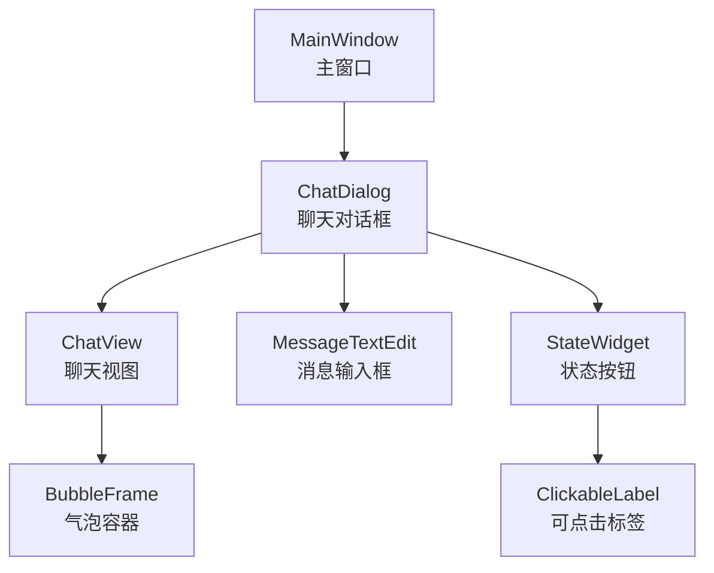
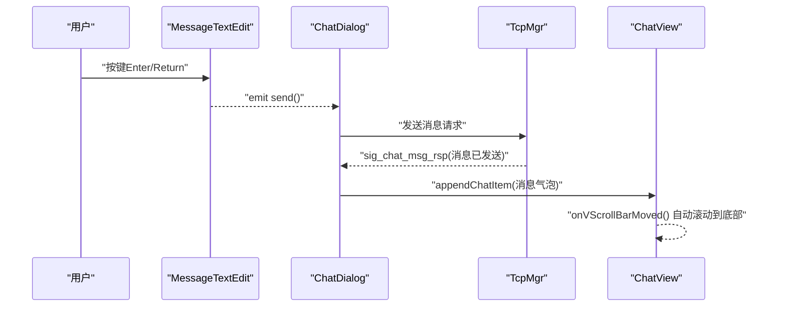
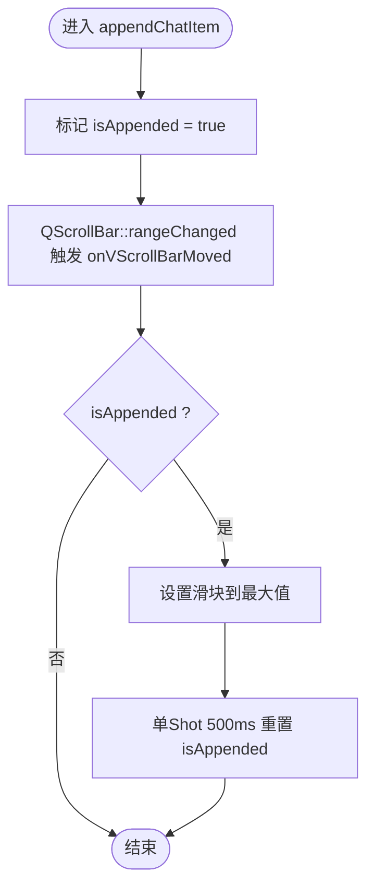
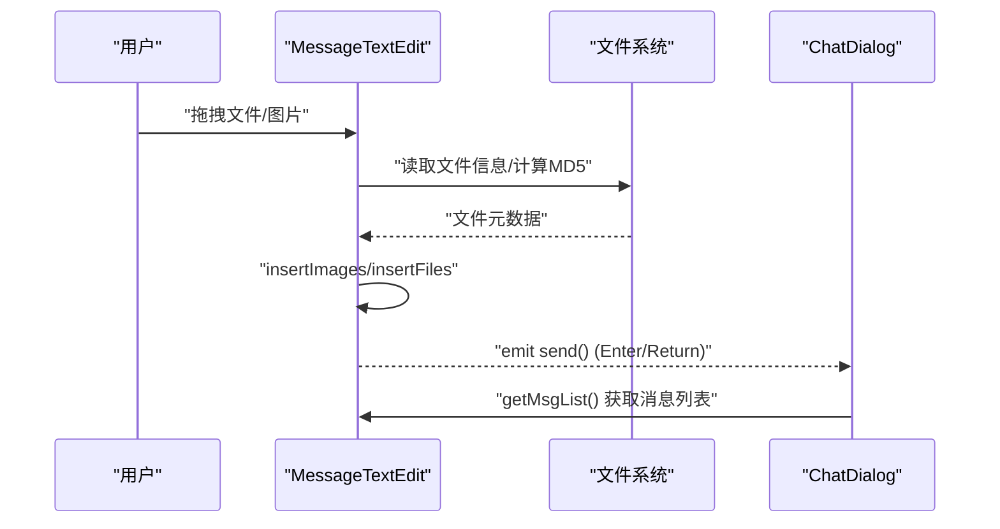
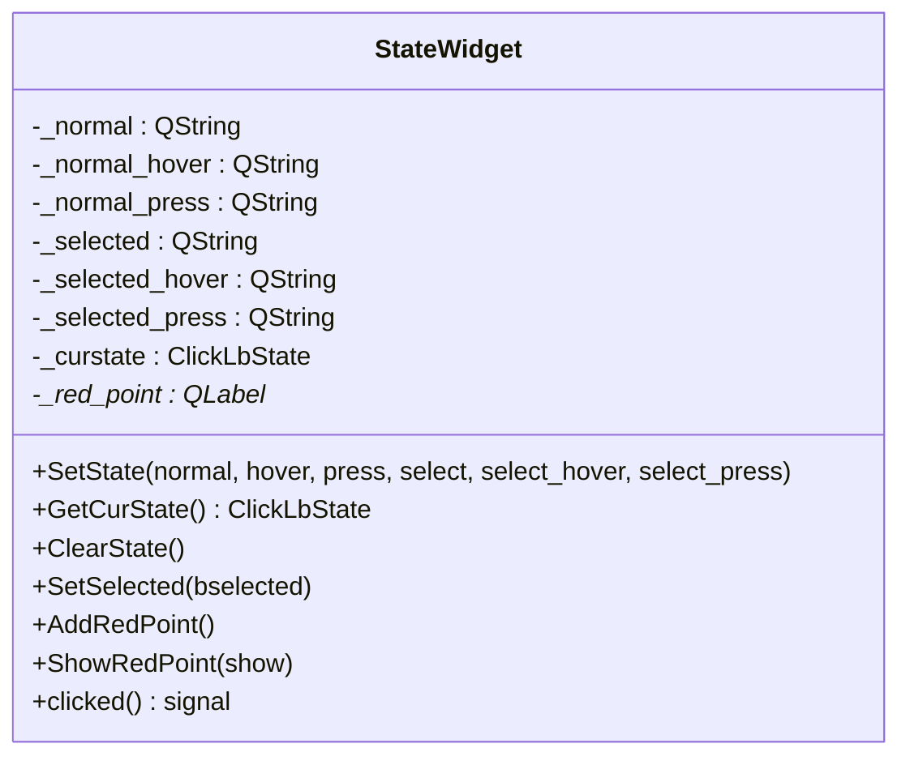
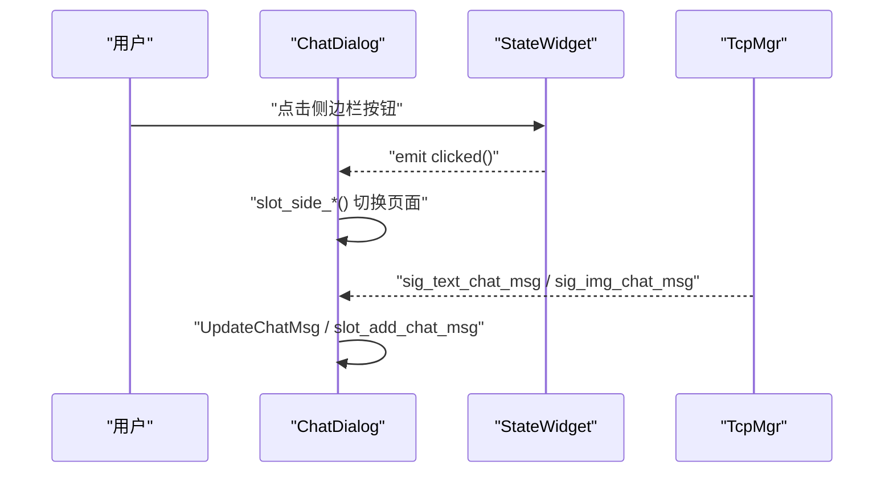
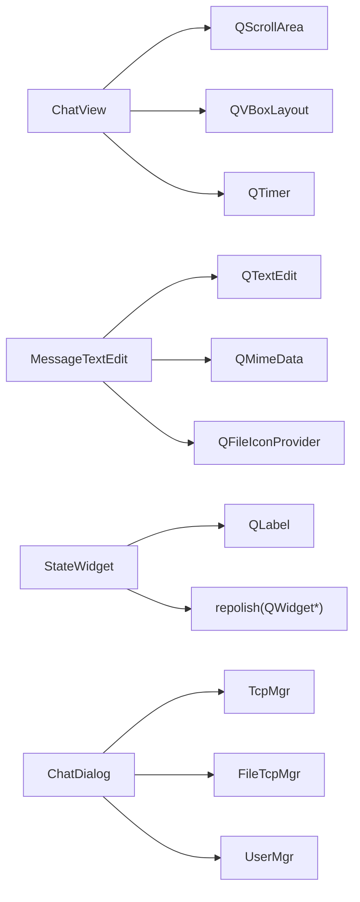

# 事件处理机制

<cite>
**本文引用的文件**   
- [ChatView.h](file://client/llfcchat/include/ChatView.h)
- [ChatView.cpp](file://client/llfcchat/src/ChatView.cpp)
- [statewidget.h](file://client/llfcchat/include/statewidget.h)
- [statewidget.cpp](file://client/llfcchat/src/statewidget.cpp)
- [MessageTextEdit.h](file://client/llfcchat/include/MessageTextEdit.h)
- [MessageTextEdit.cpp](file://client/llfcchat/src/MessageTextEdit.cpp)
- [BubbleFrame.h](file://client/llfcchat/include/BubbleFrame.h)
- [ClickableLabel.h](file://client/llfcchat/include/ClickableLabel.h)
- [global.h](file://client/llfcchat/include/global.h)
- [mainwindow.h](file://client/llfcchat/include/mainwindow.h)
- [mainwindow.cpp](file://client/llfcchat/src/mainwindow.cpp)
- [chatdialog.h](file://client/llfcchat/include/chatdialog.h)
- [chatdialog.cpp](file://client/llfcchat/src/chatdialog.cpp)
</cite>

## 目录
1. [简介](#简介)
2. [项目结构](#项目结构)
3. [核心组件](#核心组件)
4. [架构总览](#架构总览)
5. [详细组件分析](#详细组件分析)
6. [依赖关系分析](#依赖关系分析)
7. [性能考虑](#性能考虑)
8. [故障排查指南](#故障排查指南)
9. [结论](#结论)
10. [附录](#附录)

## 简介
本技术文档围绕 LLFCChat 客户端的事件处理机制展开，重点说明 Qt 信号槽在应用中的使用模式（自定义信号、槽函数、跨线程通信）、事件过滤器 EventFilter 的应用（鼠标捕获、键盘处理、自定义分发），以及 ChatView 聊天视图与 StateWidget 状态组件的事件流程。同时给出事件处理的性能优化建议，包括去抖、批量处理与内存管理最佳实践。

## 项目结构
LLFCChat 的 UI 层由多个 QWidget/QDialog 派生类组成，通过 Qt 的信号槽机制进行解耦通信；事件处理主要分布在以下模块：
- 聊天视图：ChatView 负责消息列表渲染与滚动区域交互
- 输入框：MessageTextEdit 负责文本与拖拽文件/图片的输入与发送
- 状态按钮：StateWidget 封装点击态、悬停态、选中态等交互反馈
- 主窗口与对话框：MainWindow 与 ChatDialog 作为页面容器与业务编排中心
- 气泡与标签：BubbleFrame、ClickableLabel 提供基础控件能力

图表来源
- [mainwindow.cpp:104-115](file://client/llfcchat/src/mainwindow.cpp#L104-L115)
- [chatdialog.cpp:25-195](file://client/llfcchat/src/chatdialog.cpp#L25-L195)
- [ChatView.cpp:11-44](file://client/llfcchat/src/ChatView.cpp#L11-L44)
- [MessageTextEdit.cpp:6-15](file://client/llfcchat/src/MessageTextEdit.cpp#L6-L15)
- [statewidget.cpp:8-13](file://client/llfcchat/src/statewidget.cpp#L8-L13)

章节来源
- [mainwindow.h:29-54](file://client/llfcchat/include/mainwindow.h#L29-L54)
- [chatdialog.h:18-93](file://client/llfcchat/include/chatdialog.h#L18-L93)
- [ChatView.h:7-30](file://client/llfcchat/include/ChatView.h#L7-L30)
- [MessageTextEdit.h:18-59](file://client/llfcchat/include/MessageTextEdit.h#L18-L59)
- [statewidget.h:7-50](file://client/llfcchat/include/statewidget.h#L7-L50)

## 核心组件
- ChatView：基于 QScrollArea 的消息列表容器，提供尾插/头插/中间插入接口，重写 eventFilter 控制滚动条显隐，paintEvent 绘制背景样式，onVScrollBarMoved 实现添加后自动滚到底部并去抖。
- MessageTextEdit：继承 QTextEdit，支持 Enter/Return 发送、拖拽图片/文件、解析 MIME 数据、生成消息列表并清空输入区。
- StateWidget：封装 Normal/Hover/Press/Selected 等多态样式切换，维护红点提示，发射 clicked 信号供上层订阅。
- BubbleFrame：气泡容器，按角色设置边距与布局，用于承载 TextBubble/PictureBubble。
- ClickableLabel：可点击标签，支持遮罩图标显示与鼠标事件转发。

章节来源
- [ChatView.cpp:11-44](file://client/llfcchat/src/ChatView.cpp#L11-L44)
- [ChatView.cpp:82-97](file://client/llfcchat/src/ChatView.cpp#L82-L97)
- [ChatView.cpp:108-120](file://client/llfcchat/src/ChatView.cpp#L108-L120)
- [MessageTextEdit.cpp:83-91](file://client/llfcchat/src/MessageTextEdit.cpp#L83-L91)
- [MessageTextEdit.cpp:69-81](file://client/llfcchat/src/MessageTextEdit.cpp#L69-L81)
- [statewidget.cpp:25-70](file://client/llfcchat/src/statewidget.cpp#L25-L70)
- [statewidget.cpp:72-107](file://client/llfcchat/src/statewidget.cpp#L72-L107)
- [BubbleFrame.h:7-21](file://client/llfcchat/include/BubbleFrame.h#L7-L21)
- [ClickableLabel.h:6-27](file://client/llfcchat/include/ClickableLabel.h#L6-L27)

## 架构总览
下图展示 UI 层事件流与信号槽协作：用户输入与鼠标操作触发各控件事件，经事件过滤器或重写的事件处理函数处理后，通过信号通知上层（ChatDialog/MainWindow）执行业务逻辑（加载消息、发送消息、切换页面等）。网络回调通过 TcpMgr/FileTcpMgr 的信号进入 UI 线程，再由槽函数更新界面。

图表来源
- [MessageTextEdit.cpp:83-91](file://client/llfcchat/src/MessageTextEdit.cpp#L83-L91)
- [chatdialog.cpp:176-182](file://client/llfcchat/src/chatdialog.cpp#L176-L182)
- [ChatView.cpp:108-120](file://client/llfcchat/src/ChatView.cpp#L108-L120)

章节来源
- [chatdialog.cpp:146-195](file://client/llfcchat/src/chatdialog.cpp#L146-L195)
- [mainwindow.cpp:22-34](file://client/llfcchat/src/mainwindow.cpp#L22-L34)

## 详细组件分析

### ChatView 聊天视图事件处理
- 初始化：创建 QScrollArea，隐藏垂直滚动条，将滚动条置于右侧并通过 rangeChanged 监听滚动范围变化。
- 事件过滤器：拦截 Enter/Leave 事件以控制滚动条显隐，提升视觉体验。
- 滚动联动：appendChatItem 后标记 isAppended=true，onVScrollBarMoved 中判断并在 500ms 内避免重复滚动，确保新消息始终可见。
- 绘制：paintEvent 委托样式绘制背景，保持统一外观。

图表来源
- [ChatView.cpp:46-52](file://client/llfcchat/src/ChatView.cpp#L46-L52)
- [ChatView.cpp:108-120](file://client/llfcchat/src/ChatView.cpp#L108-L120)

章节来源
- [ChatView.cpp:11-44](file://client/llfcchat/src/ChatView.cpp#L11-L44)
- [ChatView.cpp:82-97](file://client/llfcchat/src/ChatView.cpp#L82-L97)
- [ChatView.cpp:99-105](file://client/llfcchat/src/ChatView.cpp#L99-L105)

### MessageTextEdit 输入与拖拽事件
- 键盘事件：Enter/Return（非 Shift）触发 send 信号，交由上层发送。
- 拖拽事件：dragEnterEvent 接受外部拖拽，dropEvent 调用 insertFromMimeData 解析 URL。
- 媒体插入：insertImages/insertFiles 分别处理图片与文件，计算 MD5、生成唯一文件名、缩略图预览，并记录到 _img_or_file_list。
- 消息组装：getMsgList 遍历富文本，识别替换符，组合文本与媒体为 MsgInfo 列表，返回后清空输入框。

图表来源
- [MessageTextEdit.cpp:69-81](file://client/llfcchat/src/MessageTextEdit.cpp#L69-L81)
- [MessageTextEdit.cpp:106-155](file://client/llfcchat/src/MessageTextEdit.cpp#L106-L155)
- [MessageTextEdit.cpp:157-192](file://client/llfcchat/src/MessageTextEdit.cpp#L157-L192)
- [MessageTextEdit.cpp:22-67](file://client/llfcchat/src/MessageTextEdit.cpp#L22-L67)
- [MessageTextEdit.cpp:83-91](file://client/llfcchat/src/MessageTextEdit.cpp#L83-L91)

章节来源
- [MessageTextEdit.h:18-59](file://client/llfcchat/include/MessageTextEdit.h#L18-L59)
- [MessageTextEdit.cpp:6-15](file://client/llfcchat/src/MessageTextEdit.cpp#L6-L15)

### StateWidget 状态组件事件管理
- 状态切换：mousePressEvent/mouseReleaseEvent/enterEvent/leaveEvent 根据当前状态设置 QSS 属性 state，调用 repolish 刷新样式。
- 选中态：SetSelected/ClearState 切换 Normal/Selected，并同步样式。
- 红点提示：AddRedPoint/ShowRedPoint 动态添加 QLabel 红点，增强未读提醒。
- 信号发射：释放左键时 emit clicked()，供上层订阅响应。

图表来源
- [statewidget.h:7-50](file://client/llfcchat/include/statewidget.h#L7-L50)
- [statewidget.cpp:25-107](file://client/llfcchat/src/statewidget.cpp#L25-L107)
- [statewidget.cpp:109-152](file://client/llfcchat/src/statewidget.cpp#L109-L152)
- [statewidget.cpp:154-170](file://client/llfcchat/src/statewidget.cpp#L154-L170)

章节来源
- [statewidget.cpp:8-13](file://client/llfcchat/src/statewidget.cpp#L8-L13)
- [statewidget.cpp:25-70](file://client/llfcchat/src/statewidget.cpp#L25-L70)
- [statewidget.cpp:72-107](file://client/llfcchat/src/statewidget.cpp#L72-L107)

### ChatDialog 事件过滤与全局交互
- 安装事件过滤器：this->installEventFilter(this)，用于捕获全局鼠标点击位置，决定是否清空搜索框或关闭搜索面板。
- 侧边栏状态：side_chat_lb/side_contact_lb/side_settings_lb 通过 StateWidget 的 clicked 信号切换页面。
- 网络回调：连接 TcpMgr/FileTcpMgr 的信号到槽函数，处理好友申请、认证回复、聊天消息、上传下载进度等。

图表来源
- [chatdialog.cpp:97-106](file://client/llfcchat/src/chatdialog.cpp#L97-L106)
- [chatdialog.cpp:88-90](file://client/llfcchat/src/chatdialog.cpp#L88-L90)
- [chatdialog.cpp:146-195](file://client/llfcchat/src/chatdialog.cpp#L146-L195)

章节来源
- [chatdialog.h:27-93](file://client/llfcchat/include/chatdialog.h#L27-L93)
- [chatdialog.cpp:25-195](file://client/llfcchat/src/chatdialog.cpp#L25-L195)

### MainWindow 主窗口事件编排
- 页面切换：SlotSwitchReg/SwitchLogin/SwitchReset/SwitchChat 切换中央部件，建立信号槽连接。
- 离线处理：SlotOffline/SlotExcepConOffline/SlotResServerConOffline 弹出提示并回退登录界面。

章节来源
- [mainwindow.cpp:9-34](file://client/llfcchat/src/mainwindow.cpp#L9-L34)
- [mainwindow.cpp:104-115](file://client/llfcchat/src/mainwindow.cpp#L104-L115)
- [mainwindow.cpp:117-140](file://client/llfcchat/src/mainwindow.cpp#L117-L140)

## 依赖关系分析
- ChatView 依赖 QScrollArea、QVBoxLayout、QTimer，通过 installEventFilter 拦截事件。
- MessageTextEdit 依赖 QTextEdit、QMimeData、QFileIconProvider、QPainter，实现富文本与拖拽。
- StateWidget 依赖 QLabel、QStyleOption、repolish 全局函数刷新样式。
- ChatDialog 依赖 TcpMgr/FileTcpMgr、UserMgr、LoadingDlg、SearchList、ContactUserList 等，协调 UI 与网络。
- global.h 定义通用枚举、数据结构（MsgInfo、TransferState、ChatRole 等）与工具函数。

图表来源
- [ChatView.cpp:11-44](file://client/llfcchat/src/ChatView.cpp#L11-L44)
- [MessageTextEdit.cpp:6-15](file://client/llfcchat/src/MessageTextEdit.cpp#L6-L15)
- [statewidget.cpp:8-13](file://client/llfcchat/src/statewidget.cpp#L8-L13)
- [chatdialog.cpp:146-195](file://client/llfcchat/src/chatdialog.cpp#L146-L195)
- [global.h:167-199](file://client/llfcchat/include/global.h#L167-L199)

章节来源
- [global.h:167-199](file://client/llfcchat/include/global.h#L167-L199)
- [chatdialog.cpp:146-195](file://client/llfcchat/src/chatdialog.cpp#L146-L195)

## 性能考虑
- 事件去抖：ChatView 使用 QTimer::singleShot(500ms) 限制 onVScrollBarMoved 频繁调用，避免重复滚动与重绘。
- 批量处理：MessageTextEdit.getMsgList 一次性遍历富文本，合并相邻文本段，减少多次 UI 更新。
- 内存管理：removeAllItem 逐个 takeAt 并 delete widget/item，防止内存泄漏；_img_or_file_list/_total_msg_list 在 getMsgList 后清理。
- 样式刷新：StateWidget 通过 setProperty("state", ...) + repolish(this) + update() 精准刷新，避免全量重绘。
- 资源限制：拖拽文件/图片前校验大小上限（图片 2GB、文件 100MB），避免大对象阻塞 UI。

章节来源
- [ChatView.cpp:108-120](file://client/llfcchat/src/ChatView.cpp#L108-L120)
- [MessageTextEdit.cpp:22-67](file://client/llfcchat/src/MessageTextEdit.cpp#L22-L67)
- [ChatView.cpp:64-80](file://client/llfcchat/src/ChatView.cpp#L64-L80)
- [statewidget.cpp:109-152](file://client/llfcchat/src/statewidget.cpp#L109-L152)
- [MessageTextEdit.cpp:116-173](file://client/llfcchat/src/MessageTextEdit.cpp#L116-L173)

## 故障排查指南
- 滚动条不显示：检查 ChatView::eventFilter 中 Enter/Leave 是否被正确拦截，确认 m_pScrollArea->verticalScrollBar()->maximum() 是否为 0。
- 发送无效：确认 MessageTextEdit::keyPressEvent 中 Enter/Return 分支是否触发 send 信号，上层是否连接对应槽。
- 状态样式不更新：检查 StateWidget 是否正确设置 property("state") 并调用 repolish/update。
- 拖拽失败：验证 dragEnterEvent 是否 accept，dropEvent 是否调用 insertFromMimeData，MIME 数据是否包含有效 URL。
- 网络回调未更新 UI：确认 ChatDialog 中 TcpMgr/FileTcpMgr 信号已连接到相应槽函数，且槽函数在主线程执行。

章节来源
- [ChatView.cpp:82-97](file://client/llfcchat/src/ChatView.cpp#L82-L97)
- [MessageTextEdit.cpp:83-91](file://client/llfcchat/src/MessageTextEdit.cpp#L83-L91)
- [statewidget.cpp:109-152](file://client/llfcchat/src/statewidget.cpp#L109-L152)
- [chatdialog.cpp:146-195](file://client/llfcchat/src/chatdialog.cpp#L146-L195)

## 结论
LLFCChat 的事件处理机制以 Qt 信号槽为核心，结合事件过滤器与重写事件处理函数，实现了清晰的职责分离与高效的交互反馈。ChatView 与 MessageTextEdit 分别承担消息渲染与输入处理，StateWidget 提供一致的按钮状态管理。通过去抖、批量处理与严格的资源校验，系统在用户体验与性能之间取得平衡。建议在后续迭代中继续优化事件分发路径，减少不必要的重绘与内存分配，进一步提升流畅度。

## 附录
- 自定义信号与槽：在各组件中使用 signals/slots 声明与 connect 绑定，确保跨线程安全（Qt 默认队列连接）。
- 事件过滤器：installEventFilter 后在 eventFilter 中判断 watched 对象与事件类型，必要时调用基类实现。
- 样式系统：setProperty("state", ...) 配合 repolish 实现动态 QSS 切换，避免硬编码样式。