# 客户端架构

<cite>
**本文引用的文件**   
- [main.cpp](file://client/llfcchat/src/main.cpp)
- [mainwindow.h](file://client/llfcchat/include/mainwindow.h)
- [tcpmgr.h](file://client/llfcchat/include/tcpmgr.h)
- [httpmgr.h](file://client/llfcchat/include/httpmgr.h)
- [filetcpmgr.h](file://client/llfcchat/include/filetcpmgr.h)
- [usermgr.h](file://client/llfcchat/include/usermgr.h)
- [global.h](file://client/llfcchat/include/global.h)
- [singleton.h](file://client/llfcchat/include/singleton.h)
- [logindialog.h](file://client/llfcchat/include/logindialog.h)
- [chatdialog.h](file://client/llfcchat/include/chatdialog.h)
- [userdata.h](file://client/llfcchat/include/userdata.h)
- [chatview.h](file://client/llfcchat/include/chatview.h)
- [textbubble.h](file://client/llfcchat/include/textbubble.h)
- [picturebubble.h](file://client/llfcchat/include/picturebubble.h)
- [README.md](file://README.md)
</cite>

## 目录
1. [简介](#简介)
2. [项目结构](#项目结构)
3. [核心组件](#核心组件)
4. [架构总览](#架构总览)
5. [详细组件分析](#详细组件分析)
6. [依赖关系分析](#依赖关系分析)
7. [性能考虑](#性能考虑)
8. [故障排查指南](#故障排查指南)
9. [结论](#结论)
10. [附录](#附录)

## 简介
本文件为 LLFCChat Qt 客户端的全面架构文档，面向基于 Qt5 的桌面应用。内容覆盖主窗口架构、对话框设计模式与自定义控件体系；网络通信层（TcpMgr 单例 TCP 管理器、FileTcpMgr 文件传输管理器、HttpMgr HTTP 客户端）的实现原理；数据管理层（UserMgr 用户数据管理、消息缓存机制、配置文件管理）；Qt 信号槽事件处理模式、异步 I/O 模型与内存管理机制；以及 UI 组件层次结构与交互流程（登录界面、聊天界面、好友管理等）。

## 项目结构
客户端采用“功能模块 + 分层”组织方式：
- include：头文件与公共接口定义
- src：实现代码
- ui：Qt Designer 生成的 .ui 文件
- resources：样式表与资源
- config：运行时配置（config.ini）

启动流程由 main.cpp 负责加载样式、读取配置、创建并启动独立线程（TCP 与文件传输），随后显示主窗口 MainWindow。

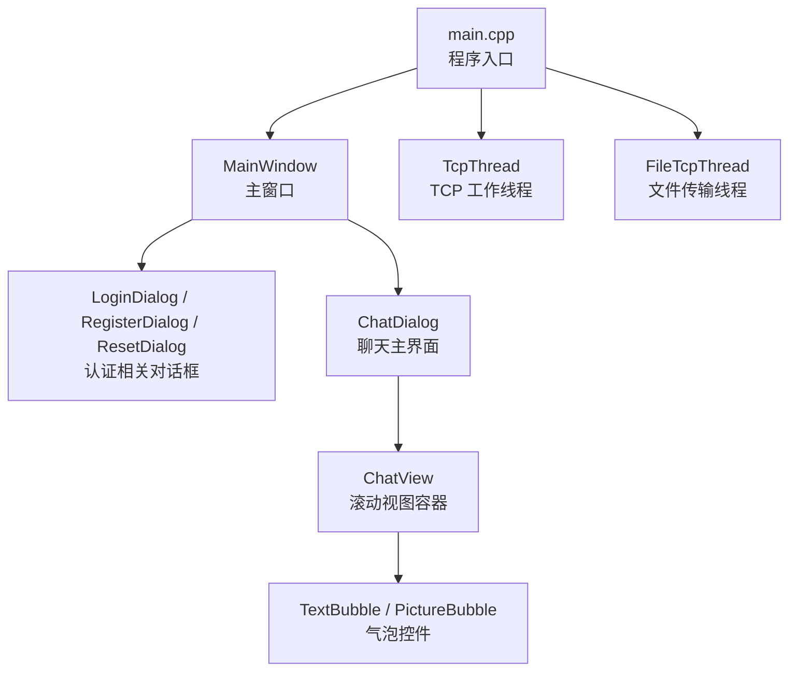

图表来源 
- [main.cpp:1-44](file://client/llfcchat/src/main.cpp#L1-L44)
- [mainwindow.h:1-57](file://client/llfcchat/include/mainwindow.h#L1-L57)
- [chatview.h:1-33](file://client/llfcchat/include/chatview.h#L1-L33)
- [textbubble.h:1-24](file://client/llfcchat/include/textbubble.h#L1-L24)
- [picturebubble.h:1-53](file://client/llfcchat/include/picturebubble.h#L1-L53)

章节来源
- [main.cpp:1-44](file://client/llfcchat/src/main.cpp#L1-L44)
- [mainwindow.h:1-57](file://client/llfcchat/include/mainwindow.h#L1-L57)

## 核心组件
- 主窗口与对话框
  - MainWindow：统一切换登录、注册、重置、聊天等界面状态
  - LoginDialog/ChatDialog：承载具体业务交互逻辑
- 网络通信层
  - TcpMgr：单例 TCP 管理器，封装连接、粘包处理、请求分发与信号回调
  - FileTcpMgr：单例文件传输管理器，支持断点续传、并发控制与进度上报
  - HttpMgr：单例 HTTP 客户端，封装 QNetworkAccessManager 的请求与响应回调
- 数据管理层
  - UserMgr：单例用户数据管理，维护会话、好友、申请列表、上传下载状态等
  - Global：全局类型、枚举、常量与工具函数
  - Singleton：线程安全的单例模板
- UI 组件
  - ChatView：滚动布局与插入策略
  - TextBubble/PictureBubble：文本与图片气泡，集成进度与状态展示

章节来源
- [tcpmgr.h:1-90](file://client/llfcchat/include/tcpmgr.h#L1-L90)
- [filetcpmgr.h:1-85](file://client/llfcchat/include/filetcpmgr.h#L1-L85)
- [httpmgr.h:1-34](file://client/llfcchat/include/httpmgr.h#L1-L34)
- [usermgr.h:1-116](file://client/llfcchat/include/usermgr.h#L1-L116)
- [global.h:1-296](file://client/llfcchat/include/global.h#L1-L296)
- [singleton.h:1-46](file://client/llfcchat/include/singleton.h#L1-L46)
- [chatview.h:1-33](file://client/llfcchat/include/chatview.h#L1-L33)
- [textbubble.h:1-24](file://client/llfcchat/include/textbubble.h#L1-L24)
- [picturebubble.h:1-53](file://client/llfcchat/include/picturebubble.h#L1-L53)

## 架构总览
客户端采用“UI 层 — 业务管理层 — 网络通信层 — 系统服务”的分层架构。UI 层通过 Qt 信号槽驱动业务逻辑；业务管理层（UserMgr）集中管理数据与状态；网络层提供稳定的 TCP/HTTP 通道，并通过独立线程避免阻塞 UI。

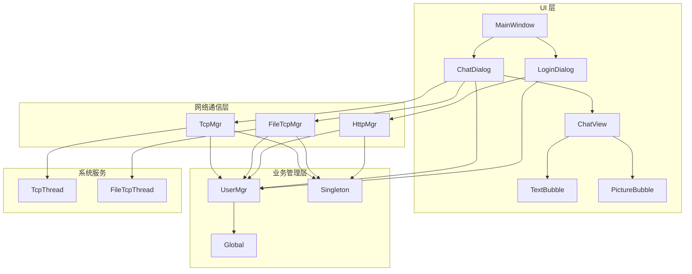

图表来源 
- [mainwindow.h:1-57](file://client/llfcchat/include/mainwindow.h#L1-L57)
- [logindialog.h:1-47](file://client/llfcchat/include/logindialog.h#L1-L47)
- [chatdialog.h:1-98](file://client/llfcchat/include/chatdialog.h#L1-L98)
- [chatview.h:1-33](file://client/llfcchat/include/chatview.h#L1-L33)
- [textbubble.h:1-24](file://client/llfcchat/include/textbubble.h#L1-L24)
- [picturebubble.h:1-53](file://client/llfcchat/include/picturebubble.h#L1-L53)
- [usermgr.h:1-116](file://client/llfcchat/include/usermgr.h#L1-L116)
- [tcpmgr.h:1-90](file://client/llfcchat/include/tcpmgr.h#L1-L90)
- [filetcpmgr.h:1-85](file://client/llfcchat/include/filetcpmgr.h#L1-L85)
- [httpmgr.h:1-34](file://client/llfcchat/include/httpmgr.h#L1-L34)
- [global.h:1-296](file://client/llfcchat/include/global.h#L1-L296)
- [singleton.h:1-46](file://client/llfcchat/include/singleton.h#L1-L46)

## 详细组件分析

### 主窗口与对话框架构
- MainWindow 使用枚举 UIStatus 管理界面状态，持有 LoginDialog/RegisterDialog/ResetDialog/ChatDialog 指针，通过槽函数进行界面切换。
- LoginDialog 负责登录、跳转注册/重置、发起 HTTP 登录请求、建立 TCP 连接，并通过信号通知上层完成或失败。
- ChatDialog 是聊天主界面，负责聊天列表加载、消息渲染、好友申请、搜索联动、头像加载与文件传输进度更新。

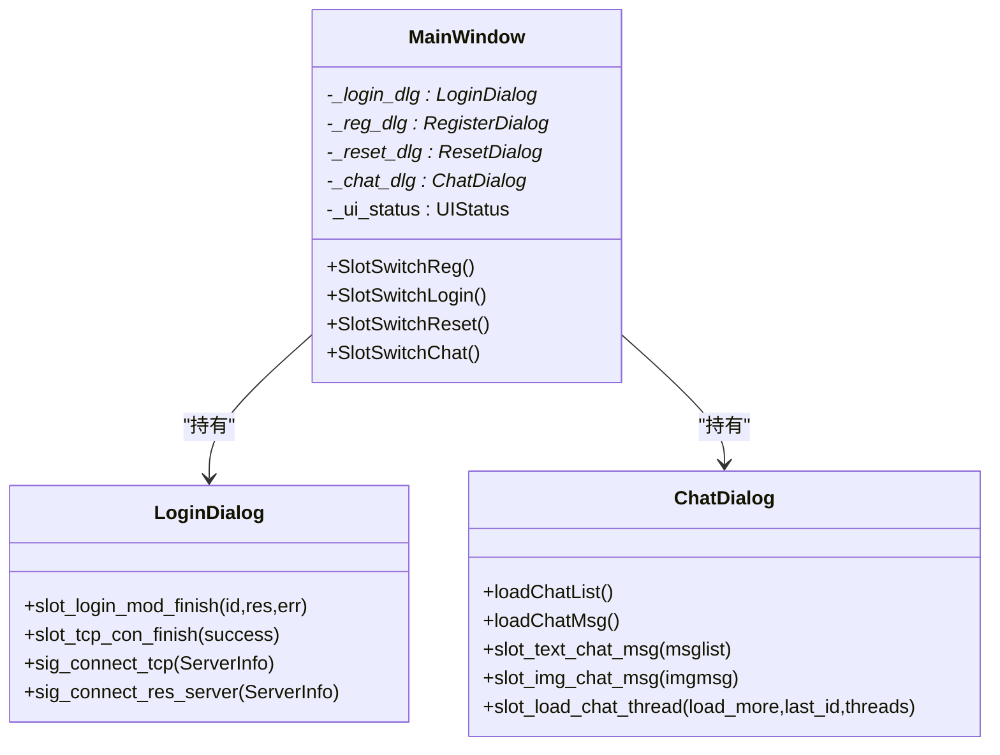

图表来源 
- [mainwindow.h:1-57](file://client/llfcchat/include/mainwindow.h#L1-L57)
- [logindialog.h:1-47](file://client/llfcchat/include/logindialog.h#L1-L47)
- [chatdialog.h:1-98](file://client/llfcchat/include/chatdialog.h#L1-L98)

章节来源
- [mainwindow.h:1-57](file://client/llfcchat/include/mainwindow.h#L1-L57)
- [logindialog.h:1-47](file://client/llfcchat/include/logindialog.h#L1-L47)
- [chatdialog.h:1-98](file://client/llfcchat/include/chatdialog.h#L1-L98)

### 网络通信层

#### TcpMgr（TCP 管理器）
- 单例模式，内部维护 QTcpSocket、接收缓冲、发送队列与当前发送块，处理粘包/拆包。
- 通过 handlers 映射 ReqId 到处理函数，将网络数据分发到对应业务逻辑。
- 暴露大量信号用于跨线程通知 UI（如登录结果、聊天消息、离线通知、聊天线程/消息加载等）。
- 通过 TcpThread 在独立线程中运行，避免阻塞主线程。

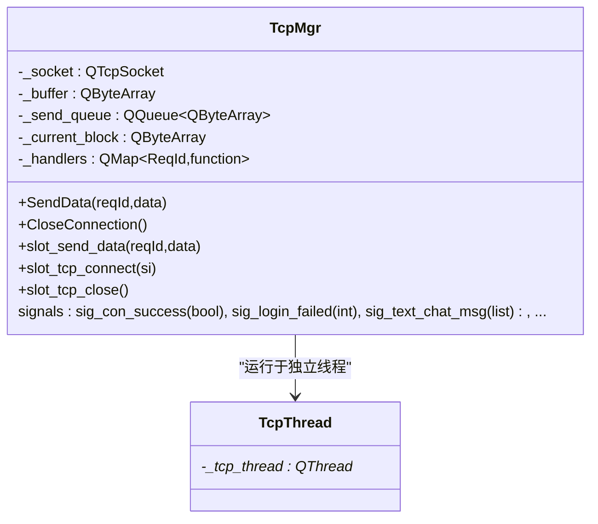

图表来源 
- [tcpmgr.h:1-90](file://client/llfcchat/include/tcpmgr.h#L1-L90)

章节来源
- [tcpmgr.h:1-90](file://client/llfcchat/include/tcpmgr.h#L1-L90)

#### FileTcpMgr（文件传输管理器）
- 单例模式，封装 QTcpSocket 与拥塞窗口控制（cwnd_size），支持批量发送、断点续传、暂停/恢复。
- 维护上传/下载信息映射，跟踪 MsgInfo 的序列号、已确认序列、飞行中序列集合，保证可靠传输。
- 通过信号上报进度、完成、继续上传/下载等事件给 UI 层。

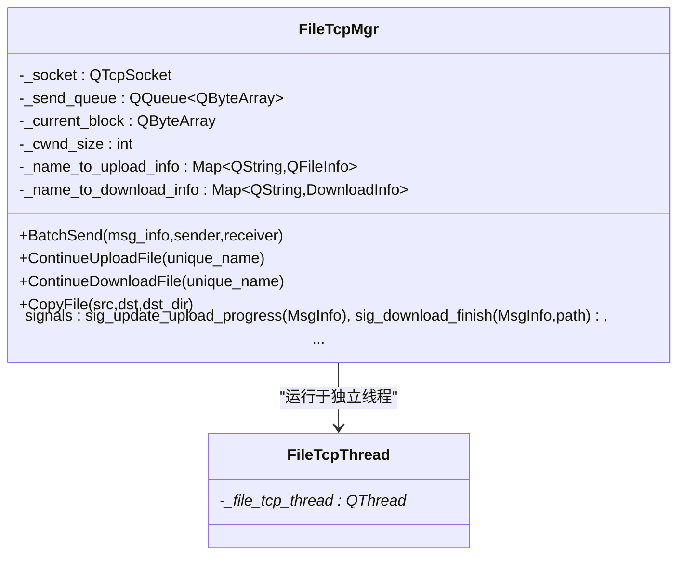

图表来源 
- [filetcpmgr.h:1-85](file://client/llfcchat/include/filetcpmgr.h#L1-L85)

章节来源
- [filetcpmgr.h:1-85](file://client/llfcchat/include/filetcpmgr.h#L1-L85)

#### HttpMgr（HTTP 客户端）
- 单例模式，封装 QNetworkAccessManager，统一发起 POST 请求并返回 JSON。
- 通过 ReqId 与 Modules 区分不同模块的请求，完成后以信号形式回传结果与错误码。

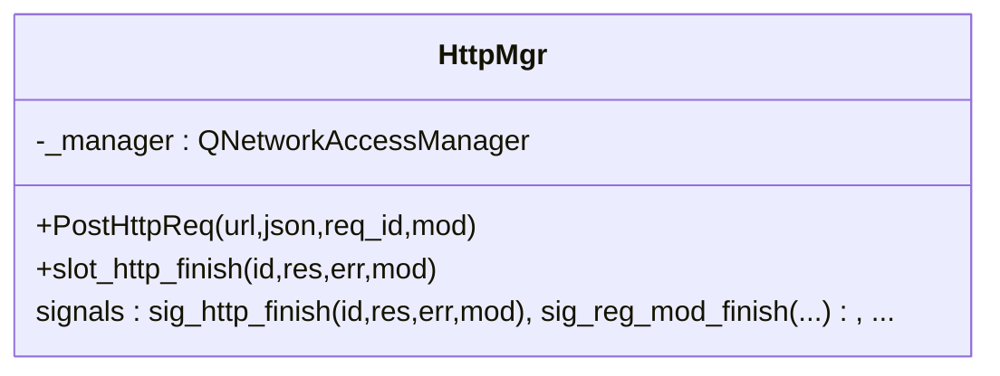

图表来源 
- [httpmgr.h:1-34](file://client/llfcchat/include/httpmgr.h#L1-L34)

章节来源
- [httpmgr.h:1-34](file://client/llfcchat/include/httpmgr.h#L1-L34)

### 数据管理层

#### UserMgr（用户数据管理）
- 单例模式，维护当前用户信息、Token、好友列表、申请列表、聊天会话映射、上传/下载任务状态等。
- 提供分页加载计数、是否加载完成判断、按 UID 查找好友、添加好友、设置最后聊天会话 ID 等方法。
- 对共享数据进行互斥保护（mutex），确保多线程安全。

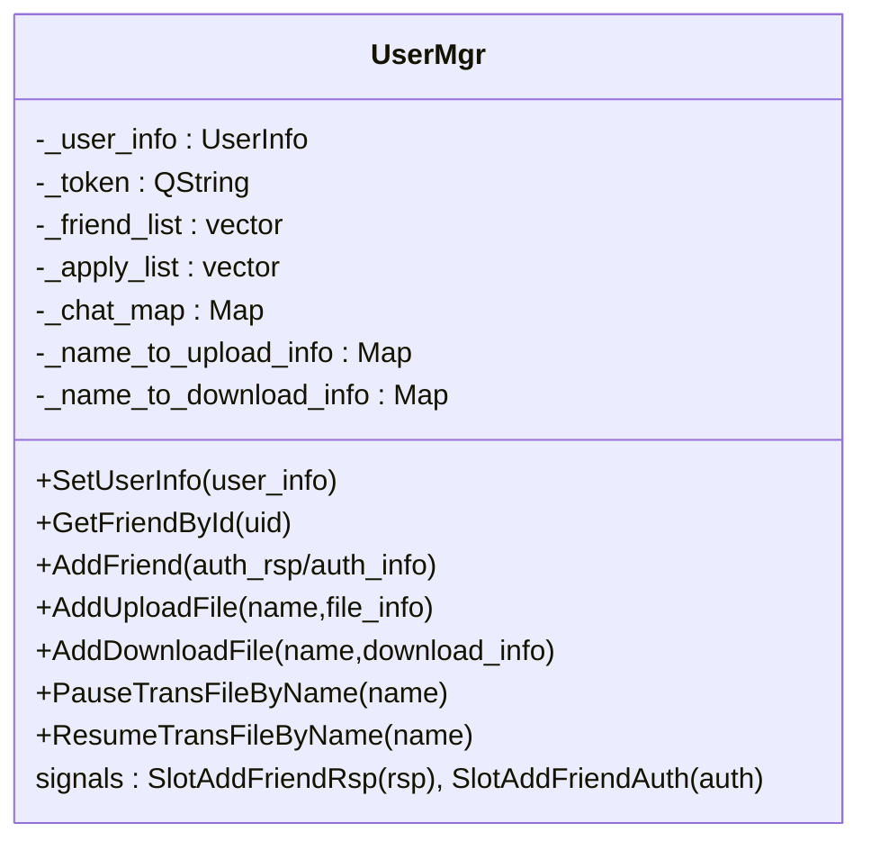

图表来源 
- [usermgr.h:1-116](file://client/llfcchat/include/usermgr.h#L1-L116)

章节来源
- [usermgr.h:1-116](file://client/llfcchat/include/usermgr.h#L1-L116)

#### 全局类型与数据结构
- global.h 定义了 ReqId、ErrorCodes、Modules、MsgType、TransferState、MsgInfo、DownloadInfo 等关键类型与常量。
- userdata.h 定义了 SearchInfo、AddFriendApply、AuthInfo/AuthRsp、UserInfo、ChatDataBase/TextChatData/ImgChatData、ChatThreadInfo/ChatThreadData 等数据模型。

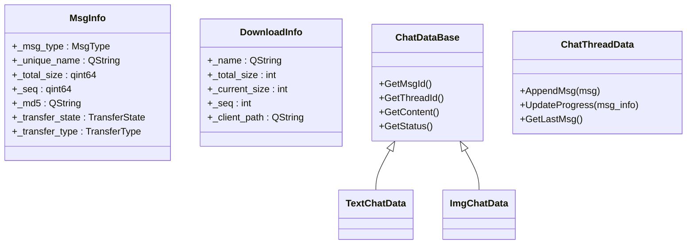

图表来源 
- [global.h:1-296](file://client/llfcchat/include/global.h#L1-L296)
- [userdata.h:1-288](file://client/llfcchat/include/userdata.h#L1-L288)

章节来源
- [global.h:1-296](file://client/llfcchat/include/global.h#L1-L296)
- [userdata.h:1-288](file://client/llfcchat/include/userdata.h#L1-L288)

### UI 组件与交互流程

#### ChatView（滚动视图）
- 提供 append/prepend/insert 三种插入策略，内置滚动条监听与样式初始化，优化长列表渲染体验。

章节来源
- [chatview.h:1-33](file://client/llfcchat/include/chatview.h#L1-L33)

#### TextBubble / PictureBubble（气泡控件）
- TextBubble：文本气泡，自适应高度与样式。
- PictureBubble：图片气泡，集成进度条、状态图标（暂停/播放/下载）、点击交互与状态切换。

章节来源
- [textbubble.h:1-24](file://client/llfcchat/include/textbubble.h#L1-L24)
- [picturebubble.h:1-53](file://client/llfcchat/include/picturebubble.h#L1-L53)

#### 登录流程时序图
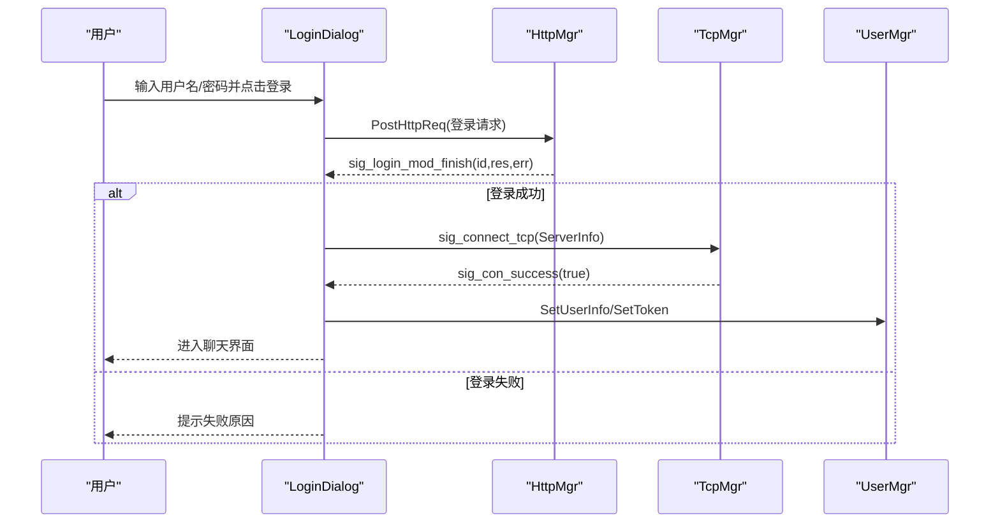

图表来源 
- [logindialog.h:1-47](file://client/llfcchat/include/logindialog.h#L1-L47)
- [httpmgr.h:1-34](file://client/llfcchat/include/httpmgr.h#L1-L34)
- [tcpmgr.h:1-90](file://client/llfcchat/include/tcpmgr.h#L1-L90)
- [usermgr.h:1-116](file://client/llfcchat/include/usermgr.h#L1-L116)

章节来源
- [logindialog.h:1-47](file://client/llfcchat/include/logindialog.h#L1-L47)
- [httpmgr.h:1-34](file://client/llfcchat/include/httpmgr.h#L1-L34)
- [tcpmgr.h:1-90](file://client/llfcchat/include/tcpmgr.h#L1-L90)
- [usermgr.h:1-116](file://client/llfcchat/include/usermgr.h#L1-L116)

#### 聊天消息收发流程（文本）
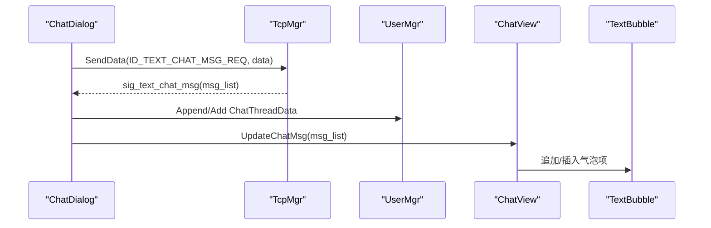

图表来源 
- [chatdialog.h:1-98](file://client/llfcchat/include/chatdialog.h#L1-L98)
- [tcpmgr.h:1-90](file://client/llfcchat/include/tcpmgr.h#L1-L90)
- [usermgr.h:1-116](file://client/llfcchat/include/usermgr.h#L1-L116)
- [chatview.h:1-33](file://client/llfcchat/include/chatview.h#L1-L33)
- [textbubble.h:1-24](file://client/llfcchat/include/textbubble.h#L1-L24)

章节来源
- [chatdialog.h:1-98](file://client/llfcchat/include/chatdialog.h#L1-L98)
- [tcpmgr.h:1-90](file://client/llfcchat/include/tcpmgr.h#L1-L90)
- [usermgr.h:1-116](file://client/llfcchat/include/usermgr.h#L1-L116)
- [chatview.h:1-33](file://client/llfcchat/include/chatview.h#L1-L33)
- [textbubble.h:1-24](file://client/llfcchat/include/textbubble.h#L1-L24)

#### 文件传输流程（断点续传）
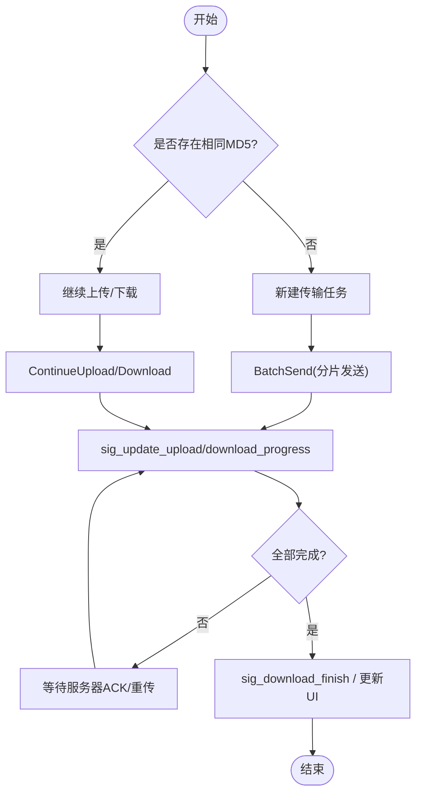

图表来源 
- [filetcpmgr.h:1-85](file://client/llfcchat/include/filetcpmgr.h#L1-L85)
- [global.h:1-296](file://client/llfcchat/include/global.h#L1-L296)
- [usermgr.h:1-116](file://client/llfcchat/include/usermgr.h#L1-L116)

章节来源
- [filetcpmgr.h:1-85](file://client/llfcchat/include/filetcpmgr.h#L1-L85)
- [global.h:1-296](file://client/llfcchat/include/global.h#L1-L296)
- [usermgr.h:1-116](file://client/llfcchat/include/usermgr.h#L1-L116)

## 依赖关系分析
- 单例依赖：TcpMgr/FileTcpMgr/HttpMgr/UserMgr 均依赖 Singleton 模板获取唯一实例，降低耦合度。
- 全局依赖：global.h 提供统一的枚举、类型与工具函数，被各模块广泛引用。
- UI 依赖：ChatDialog 依赖 UserMgr 进行数据持久化与状态管理，依赖 TcpMgr/FileTcpMgr 进行网络与文件传输。
- 线程依赖：main.cpp 启动 TcpThread 与 FileTcpThread，确保网络 I/O 不阻塞 UI。

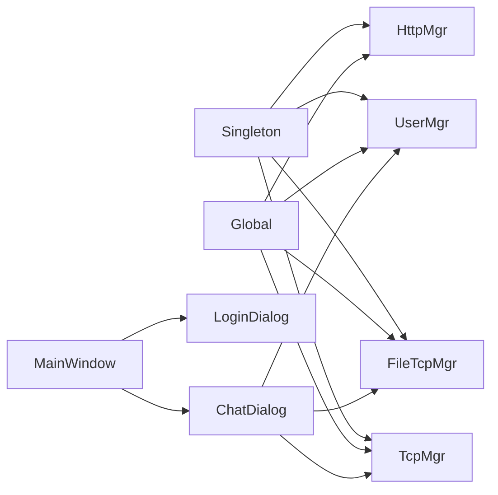

图表来源 
- [singleton.h:1-46](file://client/llfcchat/include/singleton.h#L1-L46)
- [global.h:1-296](file://client/llfcchat/include/global.h#L1-L296)
- [tcpmgr.h:1-90](file://client/llfcchat/include/tcpmgr.h#L1-L90)
- [filetcpmgr.h:1-85](file://client/llfcchat/include/filetcpmgr.h#L1-L85)
- [httpmgr.h:1-34](file://client/llfcchat/include/httpmgr.h#L1-L34)
- [usermgr.h:1-116](file://client/llfcchat/include/usermgr.h#L1-L116)
- [mainwindow.h:1-57](file://client/llfcchat/include/mainwindow.h#L1-L57)
- [logindialog.h:1-47](file://client/llfcchat/include/logindialog.h#L1-L47)
- [chatdialog.h:1-98](file://client/llfcchat/include/chatdialog.h#L1-L98)

章节来源
- [singleton.h:1-46](file://client/llfcchat/include/singleton.h#L1-L46)
- [global.h:1-296](file://client/llfcchat/include/global.h#L1-L296)
- [tcpmgr.h:1-90](file://client/llfcchat/include/tcpmgr.h#L1-L90)
- [filetcpmgr.h:1-85](file://client/llfcchat/include/filetcpmgr.h#L1-L85)
- [httpmgr.h:1-34](file://client/llfcchat/include/httpmgr.h#L1-L34)
- [usermgr.h:1-116](file://client/llfcchat/include/usermgr.h#L1-L116)
- [mainwindow.h:1-57](file://client/llfcchat/include/mainwindow.h#L1-L57)
- [logindialog.h:1-47](file://client/llfcchat/include/logindialog.h#L1-L47)
- [chatdialog.h:1-98](file://client/llfcchat/include/chatdialog.h#L1-L98)

## 性能考虑
- 异步 I/O：TcpMgr/FileTcpMgr 在独立线程中运行，避免阻塞 UI 主线程；HttpMgr 基于 QNetworkAccessManager 异步请求。
- 粘包处理：TcpMgr 使用缓冲区与长度字段解析，防止粘包/拆包问题导致的数据错乱。
- 拥塞控制：FileTcpMgr 引入 cwnd_size 限制并发发送数量，提升大文件传输稳定性。
- 分页加载：UserMgr 维护聊天与联系人分页计数，减少一次性加载开销。
- 内存管理：使用 std::shared_ptr 管理对象生命周期，降低手动释放风险；全局常量与类型集中在 global.h，减少重复定义。

[本节为通用指导，无需特定文件来源]

## 故障排查指南
- 网络连接失败
  - 检查 GateServer 配置（host/port）是否正确加载
  - 观察 TcpMgr 的连接信号与错误回调
- 登录失败
  - 查看 HttpMgr 返回的错误码与响应体
  - 确认 Token 与用户信息是否设置到 UserMgr
- 聊天消息未刷新
  - 检查 TcpMgr 的信号是否触发（sig_text_chat_msg 等）
  - 确认 ChatDialog 的槽函数是否正确绑定
- 文件传输中断
  - 检查 FileTcpMgr 的进度信号与完成信号
  - 核对 MsgInfo 的序列号与 ACK 状态

章节来源
- [tcpmgr.h:1-90](file://client/llfcchat/include/tcpmgr.h#L1-L90)
- [filetcpmgr.h:1-85](file://client/llfcchat/include/filetcpmgr.h#L1-L85)
- [httpmgr.h:1-34](file://client/llfcchat/include/httpmgr.h#L1-L34)
- [usermgr.h:1-116](file://client/llfcchat/include/usermgr.h#L1-L116)
- [logindialog.h:1-47](file://client/llfcchat/include/logindialog.h#L1-L47)
- [chatdialog.h:1-98](file://client/llfcchat/include/chatdialog.h#L1-L98)

## 结论
LLFCChat 客户端采用清晰的分层架构与单例模式，结合 Qt 信号槽与异步 I/O，实现了稳定高效的网络通信与流畅的 UI 交互。TcpMgr/FileTcpMgr/HttpMgr 分别承担即时通讯、文件传输与 HTTP 请求职责；UserMgr 集中管理用户数据与状态；UI 层通过模块化对话框与自定义控件提供良好的用户体验。整体设计具备良好的可扩展性与可维护性。

[本节为总结性内容，无需特定文件来源]

## 附录
- 项目背景与课程目录参见 README.md，涵盖从环境搭建到功能实现的完整学习路径。

章节来源
- [README.md:1-112](file://README.md#L1-L112)