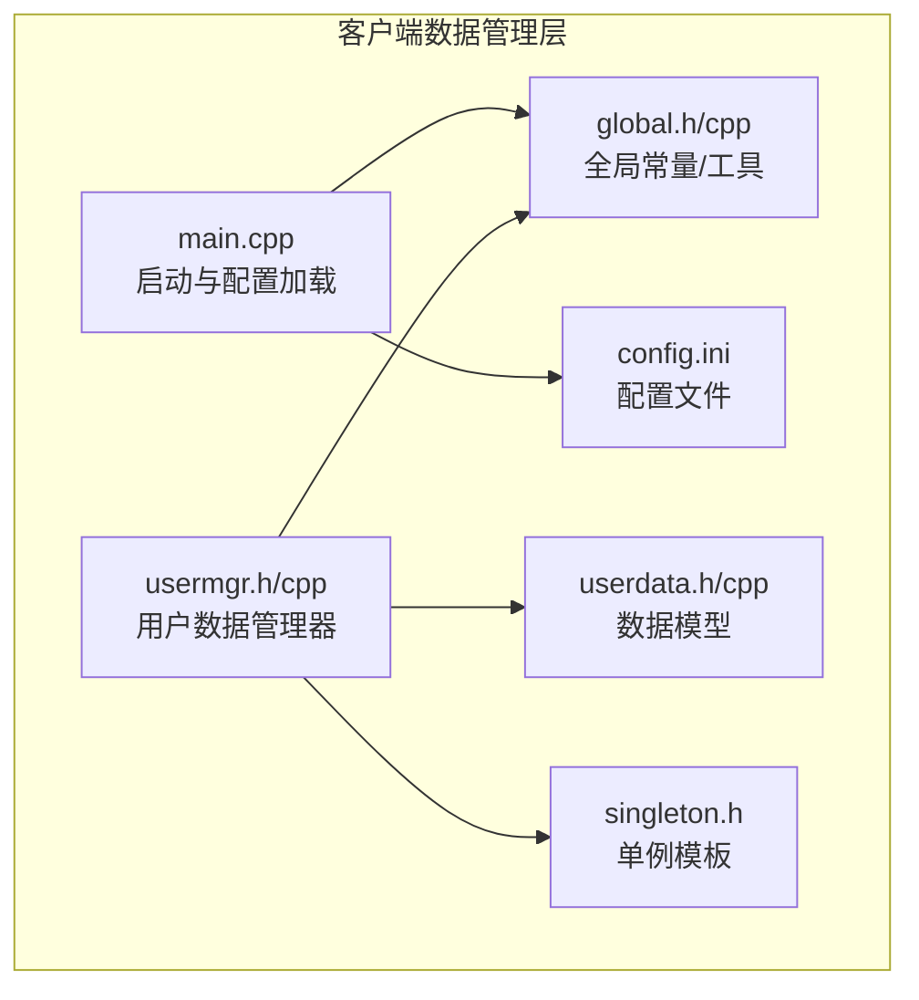
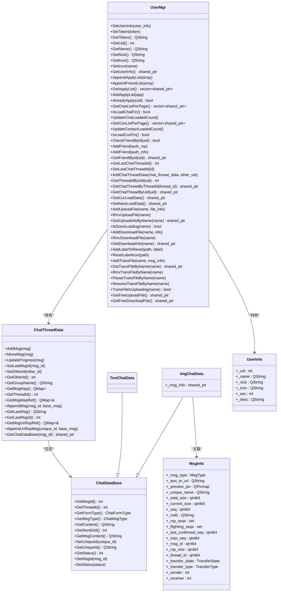
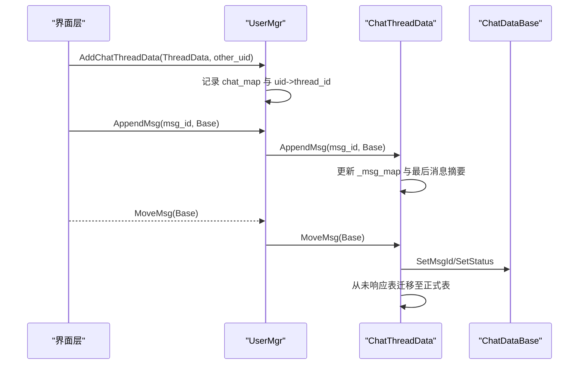
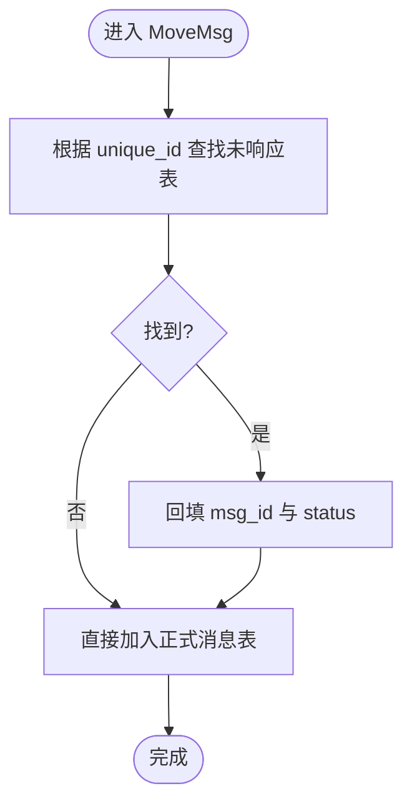
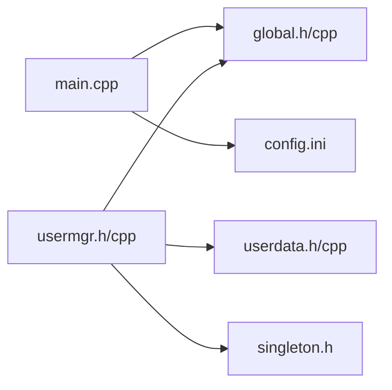

# 数据管理层

<cite>
**本文引用的文件**   
- [userdata.h](file://client/llfcchat/include/userdata.h)
- [userdata.cpp](file://client/llfcchat/src/userdata.cpp)
- [usermgr.h](file://client/llfcchat/include/usermgr.h)
- [usermgr.cpp](file://client/llfcchat/src/usermgr.cpp)
- [global.h](file://client/llfcchat/include/global.h)
- [global.cpp](file://client/llfcchat/src/global.cpp)
- [singleton.h](file://client/llfcchat/include/singleton.h)
- [config.ini](file://client/llfcchat/config/config.ini)
- [main.cpp](file://client/llfcchat/src/main.cpp)
</cite>

## 目录
1. [简介](#简介)
2. [项目结构](#项目结构)
3. [核心组件](#核心组件)
4. [架构总览](#架构总览)
5. [详细组件分析](#详细组件分析)
6. [依赖关系分析](#依赖关系分析)
7. [性能考量](#性能考量)
8. [故障排查指南](#故障排查指南)
9. [结论](#结论)
10. [附录](#附录)

## 简介
本技术文档聚焦于 LLFCChat 客户端的数据管理层，围绕 UserMgr 用户数据管理器、UserData 数据结构与 Global 全局配置管理三大模块展开。内容涵盖：
- 用户信息缓存、好友关系管理、在线状态同步等核心能力
- 聊天会话与消息历史的数据模型组织与存储策略
- 配置文件读写、环境变量设置、运行时参数管理机制
- 本地缓存、内存数据库、数据同步等持久化方案
- 数据一致性保证、并发访问控制、内存优化等关键技术点

## 项目结构
客户端数据管理层主要位于 client/llfcchat 目录下，关键文件分布如下：
- include/userdata.h：定义用户、会话、消息等数据模型
- src/userdata.cpp：数据模型的实现与辅助方法
- include/usermgr.h / src/usermgr.cpp：用户数据管理器（单例），负责用户信息、好友列表、会话线程、文件传输等内存态管理
- include/global.h / src/global.cpp：全局常量、枚举、工具函数与资源路径等
- include/singleton.h：线程安全的单例模板
- config/config.ini：应用配置文件（网关地址等）
- src/main.cpp：启动时读取配置并初始化全局变量

图表来源
- [main.cpp:1-44](file://client/llfcchat/src/main.cpp#L1-L44)
- [global.h:1-296](file://client/llfcchat/include/global.h#L1-L296)
- [userdata.h:1-288](file://client/llfcchat/include/userdata.h#L1-L288)
- [usermgr.h:1-116](file://client/llfcchat/include/usermgr.h#L1-L116)
- [singleton.h:1-46](file://client/llfcchat/include/singleton.h#L1-L46)
- [config.ini:1-4](file://client/llfcchat/config/config.ini#L1-L4)

章节来源
- [main.cpp:1-44](file://client/llfcchat/src/main.cpp#L1-L44)
- [config.ini:1-4](file://client/llfcchat/config/config.ini#L1-L4)

## 核心组件
- UserMgr（用户数据管理器）
  - 职责：维护当前登录用户信息、Token、好友列表、申请列表、聊天会话映射、上传下载文件元数据、头像Label刷新队列等
  - 设计模式：基于 Singleton 的单例；通过互斥量保护并发访问；提供分页查询接口以支持UI懒加载
- UserData（数据模型层）
  - 职责：定义用户信息、认证信息、搜索信息、聊天消息基类与派生类型、聊天会话线程信息等
  - 存储策略：纯内存容器（QMap/QVector/QHash），按会话维度组织消息，支持未响应消息的临时缓存
- Global（全局配置与工具）
  - 职责：定义协议ID、错误码、消息类型、传输状态等全局枚举；提供字符串异或、延迟执行、唯一文件名生成、文件MD5计算、加载占位图等工具
  - 配置管理：在 main.cpp 中通过 QSettings 读取 config.ini，填充 gate_url_prefix 等全局变量

章节来源
- [usermgr.h:1-116](file://client/llfcchat/include/usermgr.h#L1-L116)
- [usermgr.cpp:1-566](file://client/llfcchat/src/usermgr.cpp#L1-L566)
- [userdata.h:1-288](file://client/llfcchat/include/userdata.h#L1-L288)
- [userdata.cpp:1-162](file://client/llfcchat/src/userdata.cpp#L1-L162)
- [global.h:1-296](file://client/llfcchat/include/global.h#L1-L296)
- [global.cpp:1-91](file://client/llfcchat/src/global.cpp#L1-L91)
- [singleton.h:1-46](file://client/llfcchat/include/singleton.h#L1-L46)
- [main.cpp:1-44](file://client/llfcchat/src/main.cpp#L1-L44)

## 架构总览
下图展示了数据管理层的核心交互：UserMgr 作为中心协调者，聚合用户信息、好友关系、会话线程与文件传输状态，并通过全局工具与配置进行支撑。

图表来源
- [usermgr.h:1-116](file://client/llfcchat/include/usermgr.h#L1-L116)
- [usermgr.cpp:1-566](file://client/llfcchat/src/usermgr.cpp#L1-L566)
- [userdata.h:1-288](file://client/llfcchat/include/userdata.h#L1-L288)
- [userdata.cpp:1-162](file://client/llfcchat/src/userdata.cpp#L1-L162)
- [global.h:1-296](file://client/llfcchat/include/global.h#L1-L296)

## 详细组件分析

### UserMgr 用户数据管理器
- 设计要点
  - 单例模式：继承自 Singleton<UserMgr>，确保进程内唯一实例
  - 并发安全：对共享状态使用 std::mutex 保护，包括用户信息、好友列表、会话映射、下载/上传文件映射、传输文件集合等
  - 分页与懒加载：维护 _chat_loaded 与 _contact_loaded 索引，配合 CHAT_COUNT_PER_PAGE 实现 UI 分页拉取
  - 会话映射：通过 _chat_map 将 thread_id 映射到 ChatThreadData，同时维护 uid->thread_id 的索引以便快速查找
  - 文件传输：集中管理上传、下载与聊天内传输的文件元数据，支持暂停/恢复、进度更新与去重判断
- 关键流程
  - 好友列表与申请列表：从 JSON 数组解析为 ApplyInfo/UserInfo，插入内存容器并加锁
  - 会话创建与消息追加：AddChatThreadData 建立会话映射，ChatThreadData::AddMsg/AppendMsg 维护消息顺序与最后一条消息摘要
  - 未响应消息迁移：MoveMsg 将 unique_id 暂存的未响应消息迁移到正式消息表，并回填服务端 msg_id 与状态
  - 头像刷新：AddLabelToReset 收集需要重置的 QLabel，ResetLabelIcon 批量刷新并清理引用

图表来源
- [usermgr.cpp:288-335](file://client/llfcchat/src/usermgr.cpp#L288-L335)
- [userdata.cpp:49-82](file://client/llfcchat/src/userdata.cpp#L49-L82)

章节来源
- [usermgr.h:1-116](file://client/llfcchat/include/usermgr.h#L1-L116)
- [usermgr.cpp:1-566](file://client/llfcchat/src/usermgr.cpp#L1-L566)
- [userdata.cpp:1-162](file://client/llfcchat/src/userdata.cpp#L1-L162)

### UserData 数据模型
- 数据模型概览
  - SearchInfo/AddFriendApply/ApplyInfo：用于搜索与好友申请相关的数据封装
  - AuthInfo/AuthRsp：认证信息与响应，携带初始聊天数据与线程id
  - UserInfo：用户基本信息（uid、名称、昵称、头像、性别、描述）
  - ChatDataBase：消息基类，统一字段（msg_id、thread_id、form_type、msg_type、content、send_uid、status、chat_time、unique_id）
  - TextChatData/ImgChatData：文本与图片消息的具体实现，图片消息关联 MsgInfo
  - ChatThreadInfo/ChatThreadData：会话线程信息与本地消息缓存，维护消息映射、未响应消息映射、群成员与群名等
  - MsgInfo/DownloadInfo：文件传输元数据与下载信息，包含大小、序列号、MD5、传输状态等
- 存储策略
  - 内存优先：所有数据均保存在内存容器中（QMap/QVector/QHash），适合短时会话与高频访问
  - 会话级隔离：每个 ChatThreadData 独立维护消息映射，避免跨会话污染
  - 未响应缓冲：使用 unique_id 暂存未收到服务器确认的消息，待 MoveMsg 后迁移

图表来源
- [userdata.cpp:49-82](file://client/llfcchat/src/userdata.cpp#L49-L82)

章节来源
- [userdata.h:1-288](file://client/llfcchat/include/userdata.h#L1-L288)
- [userdata.cpp:1-162](file://client/llfcchat/src/userdata.cpp#L1-L162)
- [global.h:1-296](file://client/llfcchat/include/global.h#L1-L296)

### Global 全局配置管理与工具
- 配置读取
  - main.cpp 中使用 QSettings 读取 config.ini 的 GateServer/host 与 port，拼接成 gate_url_prefix
- 工具函数
  - generateUniqueFileName/generateUniqueIconName：基于 UUID 生成唯一文件名
  - calculateFileHash：分块计算 MD5，避免大文件内存占用过高
  - CreateLoadingPlaceholder：生成加载占位图
  - xorString/delay_run/repolish：字符串处理、事件循环延迟、样式刷新回调
- 全局常量与枚举
  - ReqId：网络请求与回包标识
  - ErrorCodes/TipErr：错误码与提示码
  - ChatFormType/ChatMsgType/TransferState/TransferType：聊天形式、消息类型、传输状态与类型
  - ServerInfo：服务器连接信息（host/port/token/uid）

章节来源
- [main.cpp:1-44](file://client/llfcchat/src/main.cpp#L1-L44)
- [global.h:1-296](file://client/llfcchat/include/global.h#L1-L296)
- [global.cpp:1-91](file://client/llfcchat/src/global.cpp#L1-L91)
- [config.ini:1-4](file://client/llfcchat/config/config.ini#L1-L4)

## 依赖关系分析
- UserMgr 依赖
  - userdata.h/cpp：数据模型与会话消息操作
  - global.h/cpp：枚举、工具函数与全局变量
  - singleton.h：单例模板
- 配置依赖
  - main.cpp 依赖 global.h 中的 gate_url_prefix，并在启动阶段写入
- 并发与锁
  - UserMgr 内部多个互斥量：_mtx（主数据）、_down_load_mtx（下载）、_trans_mtx（传输文件）

图表来源
- [main.cpp:1-44](file://client/llfcchat/src/main.cpp#L1-L44)
- [global.h:1-296](file://client/llfcchat/include/global.h#L1-L296)
- [usermgr.h:1-116](file://client/llfcchat/include/usermgr.h#L1-L116)
- [userdata.h:1-288](file://client/llfcchat/include/userdata.h#L1-L288)
- [singleton.h:1-46](file://client/llfcchat/include/singleton.h#L1-L46)

章节来源
- [usermgr.cpp:1-566](file://client/llfcchat/src/usermgr.cpp#L1-L566)
- [global.cpp:1-91](file://client/llfcchat/src/global.cpp#L1-L91)

## 性能考量
- 内存布局与访问
  - 使用 QMap/QHash 提升键值查找效率，O(log n)/O(1) 级别
  - 会话级消息映射避免全量扫描，降低渲染与检索开销
- 分页与懒加载
  - CHAT_COUNT_PER_PAGE 限制每次返回数量，减少 UI 压力与内存峰值
- 文件传输优化
  - 分块计算 MD5，避免一次性读入大文件
  - 传输状态机与序列号集合支持断点续传与重传
- 并发控制
  - 细粒度互斥量分离不同资源域，降低锁竞争
  - 单例构造使用 call_once，保证线程安全且仅一次初始化

[本节为通用指导，不直接分析具体文件]

## 故障排查指南
- 配置加载失败
  - 检查 config.ini 是否存在且格式正确，GateServer/host 与 port 是否有效
  - 确认 main.cpp 中 QSettings 的路径拼接与读取逻辑
- 好友列表为空或重复
  - 检查 AppendFriendList 的 JSON 解析字段是否与后端一致
  - 确认 _friend_map 的插入逻辑是否覆盖已有条目
- 消息未显示或顺序错乱
  - 检查 ChatThreadData::AddMsg/AppendMsg 是否正确更新 _msg_map 与最后消息摘要
  - 确认 MoveMsg 的 unique_id 匹配与状态回填
- 头像未刷新
  - 确认 AddLabelToReset 是否被调用，ResetLabelIcon 是否能成功加载图片路径
- 文件传输卡住或中断
  - 检查 IsDownLoading/TransFileIsUploading 的状态判断
  - 确认 Pause/Resume 是否按传输类型正确设置状态

章节来源
- [main.cpp:1-44](file://client/llfcchat/src/main.cpp#L1-L44)
- [usermgr.cpp:1-566](file://client/llfcchat/src/usermgr.cpp#L1-L566)
- [userdata.cpp:1-162](file://client/llfcchat/src/userdata.cpp#L1-L162)
- [global.cpp:1-91](file://client/llfcchat/src/global.cpp#L1-L91)

## 结论
LLFCChat 的数据管理层以 UserMgr 为核心，结合清晰的数据模型与全局工具，实现了高效的用户信息管理、好友关系维护、会话与消息缓存以及文件传输状态管理。通过单例与互斥量保障并发安全，借助分页与内存映射优化性能。后续可考虑引入本地持久化（如 SQLite）与增量同步机制，进一步提升数据可靠性与离线可用性。

[本节为总结性内容，不直接分析具体文件]

## 附录
- 数据模型字段说明（节选）
  - ChatDataBase：消息基础字段（msg_id、thread_id、form_type、msg_type、content、send_uid、status、chat_time、unique_id）
  - MsgInfo：文件传输元数据（类型、URL/文本、预览图、唯一名、总大小、当前大小、序列号、MD5、已响应序列、飞行序列、最后确认序列、最大序列、消息id、响应大小、会话id、传输状态、传输类型、发送者、接收者）
  - DownloadInfo：下载信息（名称、总大小、当前大小、序列号、客户端路径）
- 配置项示例
  - GateServer/host：网关主机地址
  - GateServer/port：网关端口

章节来源
- [userdata.h:1-288](file://client/llfcchat/include/userdata.h#L1-L288)
- [global.h:1-296](file://client/llfcchat/include/global.h#L1-L296)
- [config.ini:1-4](file://client/llfcchat/config/config.ini#L1-L4)