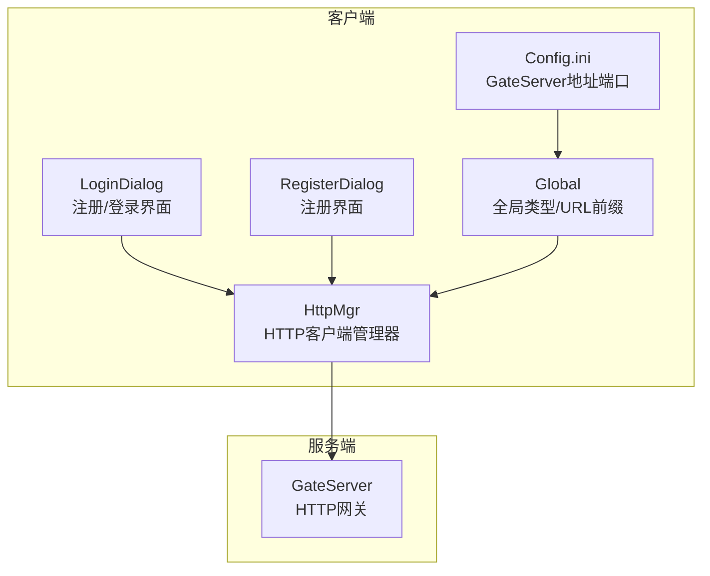
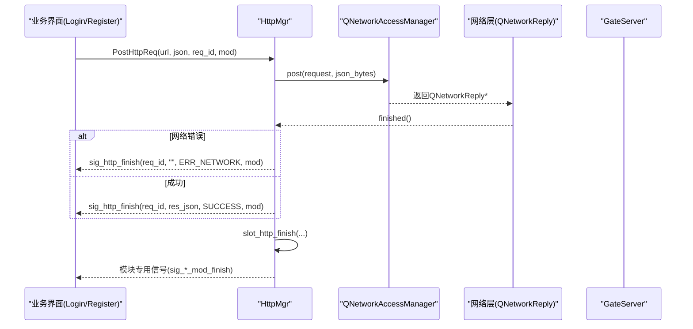
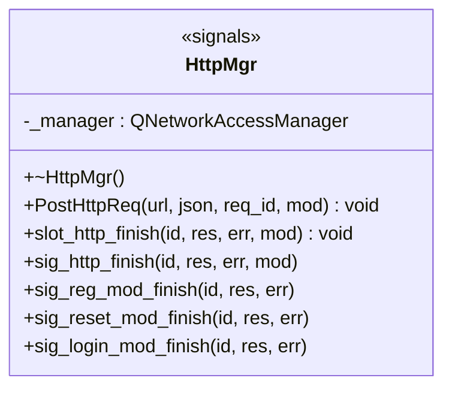
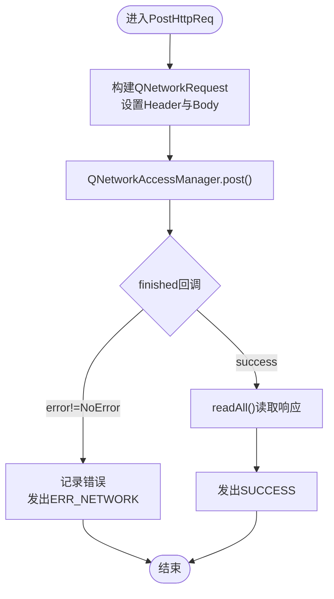
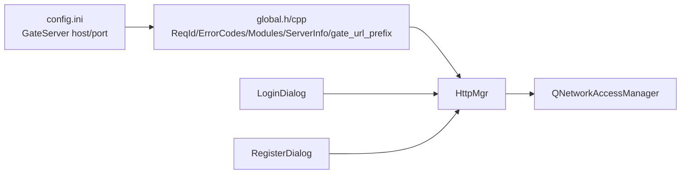

# HTTP客户端管理

<cite>
**本文引用的文件**   
- [httpmgr.h](file://client/llfcchat/include/httpmgr.h)
- [httpmgr.cpp](file://client/llfcchat/src/httpmgr.cpp)
- [global.h](file://client/llfcchat/include/global.h)
- [global.cpp](file://client/llfcchat/src/global.cpp)
- [config.ini](file://client/llfcchat/config/config.ini)
- [logindialog.cpp](file://client/llfcchat/src/logindialog.cpp)
- [registerdialog.cpp](file://client/llfcchat/src/registerdialog.cpp)
</cite>

## 目录
1. [简介](#简介)
2. [项目结构](#项目结构)
3. [核心组件](#核心组件)
4. [架构总览](#架构总览)
5. [详细组件分析](#详细组件分析)
6. [依赖关系分析](#依赖关系分析)
7. [性能与可靠性](#性能与可靠性)
8. [故障排查指南](#故障排查指南)
9. [结论](#结论)
10. [附录：API与使用示例](#附录api与使用示例)

## 简介
本技术文档聚焦于LLFCChat客户端的HTTP客户端管理器（HttpMgr），系统性阐述其实现架构与关键能力，包括：
- RESTful API调用封装（基于QNetworkAccessManager）
- JSON数据序列化/反序列化与响应处理
- 异步请求模型、回调机制与错误处理策略
- 认证授权相关设计（令牌传递与会话保持思路）
- 缓存策略现状与可扩展建议
- 配置项与实用功能（超时、重试、代理等扩展点）
- 完整API接口说明与常见使用场景示例

该模块采用Qt信号槽与异步网络I/O，将HTTP请求统一抽象为PostHttpReq接口，并通过模块化的信号分发到注册、重置密码、登录等业务模块。

## 项目结构
围绕HttpMgr的相关代码主要分布在以下位置：
- 头文件定义：client/llfcchat/include/httpmgr.h
- 实现逻辑：client/llfcchat/src/httpmgr.cpp
- 全局类型与常量：client/llfcchat/include/global.h、client/llfcchat/src/global.cpp
- 配置文件：client/llfcchat/config/config.ini
- 业务调用方：client/llfcchat/src/logindialog.cpp、client/llfcchat/src/registerdialog.cpp

图表来源
- [httpmgr.h:1-33](file://client/llfcchat/include/httpmgr.h#L1-L33)
- [httpmgr.cpp:1-62](file://client/llfcchat/src/httpmgr.cpp#L1-L62)
- [global.h:119-135](file://client/llfcchat/include/global.h#L119-L135)
- [global.cpp:24-24](file://client/llfcchat/src/global.cpp#L24-L24)
- [config.ini:1-4](file://client/llfcchat/config/config.ini#L1-L4)
- [logindialog.cpp:175-195](file://client/llfcchat/src/logindialog.cpp#L175-L195)
- [registerdialog.cpp:98-111](file://client/llfcchat/src/registerdialog.cpp#L98-L111)

章节来源
- [httpmgr.h:1-33](file://client/llfcchat/include/httpmgr.h#L1-L33)
- [httpmgr.cpp:1-62](file://client/llfcchat/src/httpmgr.cpp#L1-L62)
- [global.h:91-101](file://client/llfcchat/include/global.h#L91-L101)
- [global.cpp:24-24](file://client/llfcchat/src/global.cpp#L24-L24)
- [config.ini:1-4](file://client/llfcchat/config/config.ini#L1-L4)
- [logindialog.cpp:175-195](file://client/llfcchat/src/logindialog.cpp#L175-L195)
- [registerdialog.cpp:98-111](file://client/llfcchat/src/registerdialog.cpp#L98-L111)

## 核心组件
- HttpMgr：单例HTTP管理器，封装QNetworkAccessManager，提供统一的POST请求入口，内部通过信号槽完成异步回调与模块分发。
- Global：集中定义请求ID枚举、错误码、模块枚举、服务器信息结构体以及全局URL前缀gate_url_prefix。
- 配置：config.ini提供GateServer主机与端口，启动时由应用读取并拼接成gate_url_prefix。
- 业务模块：LoginDialog、RegisterDialog等通过HttpMgr发送HTTP请求，并订阅对应模块的信号以处理响应。

章节来源
- [httpmgr.h:11-31](file://client/llfcchat/include/httpmgr.h#L11-L31)
- [httpmgr.cpp:8-38](file://client/llfcchat/src/httpmgr.cpp#L8-L38)
- [global.h:43-101](file://client/llfcchat/include/global.h#L43-L101)
- [global.cpp:24-24](file://client/llfcchat/src/global.cpp#L24-L24)
- [config.ini:1-4](file://client/llfcchat/config/config.ini#L1-L4)

## 架构总览
HttpMgr作为HTTP客户端的统一入口，负责：
- 构造QNetworkRequest并设置Content-Type为application/json
- 将QJsonObject序列化为JSON字节流
- 通过QNetworkAccessManager发起异步POST请求
- 在finished回调中处理错误与成功路径，发出sig_http_finish信号
- slot_http_finish根据Modules路由到各模块专用信号（如sig_login_mod_finish）

图表来源
- [httpmgr.cpp:8-38](file://client/llfcchat/src/httpmgr.cpp#L8-L38)
- [httpmgr.cpp:40-61](file://client/llfcchat/src/httpmgr.cpp#L40-L61)
- [logindialog.cpp:175-195](file://client/llfcchat/src/logindialog.cpp#L175-L195)
- [registerdialog.cpp:98-111](file://client/llfcchat/src/registerdialog.cpp#L98-L111)

## 详细组件分析

### HttpMgr类设计与职责
- 继承QObject与Singleton模式，保证单例与事件循环集成
- 成员QNetworkAccessManager用于底层网络IO
- 对外暴露PostHttpReq接口，内部通过shared_from_this捕获自身智能指针，避免生命周期问题
- 信号：
  - sig_http_finish：通用完成信号，携带req_id、响应字符串、错误码、模块标识
  - sig_reg_mod_finish / sig_reset_mod_finish / sig_login_mod_finish：按模块分发的专用信号
- 槽：slot_http_finish用于接收sig_http_finish并按Modules转发

图表来源
- [httpmgr.h:11-31](file://client/llfcchat/include/httpmgr.h#L11-L31)

章节来源
- [httpmgr.h:11-31](file://client/llfcchat/include/httpmgr.h#L11-L31)
- [httpmgr.cpp:8-38](file://client/llfcchat/src/httpmgr.cpp#L8-L38)
- [httpmgr.cpp:40-61](file://client/llfcchat/src/httpmgr.cpp#L40-L61)

### 请求流程与错误处理
- 请求构造：
  - 将QJsonObject序列化为QByteArray
  - 设置Content-Type为application/json，Content-Length为数据长度
- 异步发送：
  - _manager.post返回QNetworkReply*
  - 连接finished回调，捕获reply、self、req_id、mod
- 错误处理：
  - 若reply->error() != NoError，输出错误信息并发出ERR_NETWORK
  - 成功则readAll读取响应字符串，发出SUCCESS
- 资源释放：
  - reply->deleteLater()确保异步安全释放

图表来源
- [httpmgr.cpp:8-38](file://client/llfcchat/src/httpmgr.cpp#L8-L38)

章节来源
- [httpmgr.cpp:8-38](file://client/llfcchat/src/httpmgr.cpp#L8-L38)

### 模块分发与信号路由
- slot_http_finish根据Modules判断：
  - REGISTERMOD -> sig_reg_mod_finish
  - RESETMOD -> sig_reset_mod_finish
  - LOGINMOD -> sig_login_mod_finish
- 业务模块（如LoginDialog、RegisterDialog）订阅对应信号，解析JSON并执行业务逻辑

章节来源
- [httpmgr.cpp:46-61](file://client/llfcchat/src/httpmgr.cpp#L46-L61)
- [logindialog.cpp:175-195](file://client/llfcchat/src/logindialog.cpp#L175-L195)
- [registerdialog.cpp:98-111](file://client/llfcchat/src/registerdialog.cpp#L98-L111)

### 全局类型与配置
- ReqId：所有HTTP/TCP消息的唯一标识，涵盖验证码、注册、登录、聊天消息、文件传输等
- ErrorCodes：SUCCESS、ERR_JSON、ERR_NETWORK
- Modules：REGISTERMOD、RESETMOD、LOGINMOD
- ServerInfo：保存会话相关的服务器信息与token
- gate_url_prefix：从config.ini读取GateServer host/port拼接而成

章节来源
- [global.h:43-101](file://client/llfcchat/include/global.h#L43-L101)
- [global.h:122-135](file://client/llfcchat/include/global.h#L122-L135)
- [global.cpp:24-24](file://client/llfcchat/src/global.cpp#L24-L24)
- [config.ini:1-4](file://client/llfcchat/config/config.ini#L1-L4)

## 依赖关系分析
- HttpMgr依赖：
  - QNetworkAccessManager（网络IO）
  - QJsonObject/QJsonDocument（JSON序列化/反序列化）
  - global.h中的枚举与结构体（ReqId、ErrorCodes、Modules、ServerInfo）
- 业务模块依赖：
  - LoginDialog/ RegisterDialog通过HttpMgr::GetInstance().get()获取单例并调用PostHttpReq
  - 订阅HttpMgr的模块专用信号进行响应处理

图表来源
- [global.h:43-101](file://client/llfcchat/include/global.h#L43-L101)
- [global.cpp:24-24](file://client/llfcchat/src/global.cpp#L24-L24)
- [config.ini:1-4](file://client/llfcchat/config/config.ini#L1-L4)
- [httpmgr.h:11-31](file://client/llfcchat/include/httpmgr.h#L11-L31)
- [logindialog.cpp:175-195](file://client/llfcchat/src/logindialog.cpp#L175-L195)
- [registerdialog.cpp:98-111](file://client/llfcchat/src/registerdialog.cpp#L98-L111)

章节来源
- [global.h:43-101](file://client/llfcchat/include/global.h#L43-L101)
- [global.cpp:24-24](file://client/llfcchat/src/global.cpp#L24-L24)
- [config.ini:1-4](file://client/llfcchat/config/config.ini#L1-L4)
- [httpmgr.h:11-31](file://client/llfcchat/include/httpmgr.h#L11-L31)
- [logindialog.cpp:175-195](file://client/llfcchat/src/logindialog.cpp#L175-L195)
- [registerdialog.cpp:98-111](file://client/llfcchat/src/registerdialog.cpp#L98-L111)

## 性能与可靠性
- 当前实现特点
  - 使用QNetworkAccessManager进行异步网络请求，避免阻塞UI线程
  - 通过信号槽机制解耦网络回调与业务处理
  - 错误路径统一返回ERR_NETWORK，便于上层统一处理
- 可扩展优化点
  - 超时控制：可在QNetworkRequest上设置Timeout属性（当前未显式设置）
  - 重试机制：可在PostHttpReq外层增加指数退避重试策略
  - 代理支持：可通过QNetworkAccessManager配置代理
  - 连接池与复用：QNetworkAccessManager默认复用连接，可进一步结合Keep-Alive优化
  - 缓存策略：可在请求前检查本地缓存或内存缓存，减少重复请求
  - 日志与监控：增强错误分类与统计，便于定位问题

[本节为通用指导，不直接分析具体文件]

## 故障排查指南
- 常见问题
  - 网络错误：reply->error()非NoError，检查网络连通性、防火墙、代理设置
  - JSON解析失败：上层解析QJsonDocument失败时，确认响应格式与字段名
  - URL前缀错误：gate_url_prefix未正确拼接导致请求404
- 调试建议
  - 打印reply->errorString()与响应内容
  - 检查config.ini中host/port是否正确
  - 确认业务模块已订阅对应模块信号

章节来源
- [httpmgr.cpp:20-37](file://client/llfcchat/src/httpmgr.cpp#L20-L37)
- [registerdialog.cpp:113-139](file://client/llfcchat/src/registerdialog.cpp#L113-L139)
- [global.cpp:24-24](file://client/llfcchat/src/global.cpp#L24-L24)
- [config.ini:1-4](file://client/llfcchat/config/config.ini#L1-L4)

## 结论
HttpMgr以简洁清晰的架构封装了HTTP客户端的核心能力，通过统一的PostHttpReq接口与信号槽机制，实现了异步请求、错误处理与模块分发。当前版本已满足基础REST调用需求，后续可在超时、重试、代理、缓存等方面进一步增强，以提升鲁棒性与性能。

[本节为总结性内容，不直接分析具体文件]

## 附录：API与使用示例

### HTTP接口清单（客户端侧）
- 接口方法：POST
- 内容类型：application/json
- 请求体：QJsonObject序列化后的JSON字符串
- 响应体：JSON字符串，包含error字段及业务字段
- 错误码：
  - SUCCESS：0
  - ERR_JSON：1
  - ERR_NETWORK：2

章节来源
- [httpmgr.cpp:10-15](file://client/llfcchat/src/httpmgr.cpp#L10-L15)
- [global.h:91-95](file://client/llfcchat/include/global.h#L91-L95)

### 典型使用场景

#### 登录流程
- 触发点：LoginDialog按钮点击
- 步骤：
  - 组装QJsonObject（email、passwd）
  - 调用HttpMgr::GetInstance()->PostHttpReq(gate_url_prefix+"/user_login", json, ID_LOGIN_USER, LOGINMOD)
  - 订阅sig_login_mod_finish，解析响应并建立TCP长连接

章节来源
- [logindialog.cpp:175-195](file://client/llfcchat/src/logindialog.cpp#L175-L195)
- [logindialog.cpp:197-200](file://client/llfcchat/src/logindialog.cpp#L197-L200)

#### 注册流程
- 触发点：RegisterDialog获取验证码/提交注册
- 步骤：
  - 组装QJsonObject（email/passwd等）
  - 调用HttpMgr::GetInstance()->PostHttpReq(gate_url_prefix+"/get_varifycode", json, ID_GET_VARIFY_CODE, REGISTERMOD)
  - 订阅sig_reg_mod_finish，解析响应并提示结果

章节来源
- [registerdialog.cpp:98-111](file://client/llfcchat/src/registerdialog.cpp#L98-L111)
- [registerdialog.cpp:113-139](file://client/llfcchat/src/registerdialog.cpp#L113-L139)

### 认证与授权（令牌与会话）
- 令牌传递：登录成功后，服务端返回token，客户端保存在ServerInfo中，后续通过TCP通道使用（当前HTTP阶段仅用于登录鉴权）
- 会话保持：HTTP层未实现Cookie/Session机制；如需扩展，可在QNetworkRequest中添加Authorization头或在QNetworkAccessManager中维护会话状态
- 权限验证：当前HTTP接口未做细粒度权限校验，建议在GateServer层对路径与方法进行鉴权

章节来源
- [global.h:122-135](file://client/llfcchat/include/global.h#L122-L135)
- [logindialog.cpp:175-195](file://client/llfcchat/src/logindialog.cpp#L175-L195)

### 缓存策略（现状与建议）
- 现状：当前HttpMgr未实现任何缓存（本地或内存）
- 建议：
  - 针对静态资源（头像、公告等）实现内存LRU缓存
  - 针对列表类数据实现磁盘缓存与失效策略（时间戳/ETag）
  - 在PostHttpReq前检查缓存命中，命中则直接返回，否则发起网络请求

[本节为通用建议，不直接分析具体文件]

### 配置选项与实用功能
- 超时设置：可在QNetworkRequest上设置Timeout（当前未设置）
- 重试机制：建议在业务层实现指数退避重试
- 代理支持：通过QNetworkAccessManager配置代理
- 配置读取：从config.ini读取GateServer host/port，拼接gate_url_prefix

章节来源
- [config.ini:1-4](file://client/llfcchat/config/config.ini#L1-L4)
- [global.cpp:24-24](file://client/llfcchat/src/global.cpp#L24-L24)