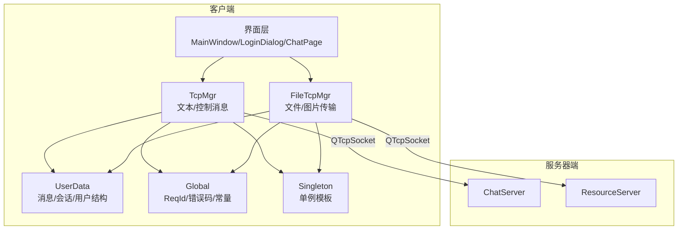
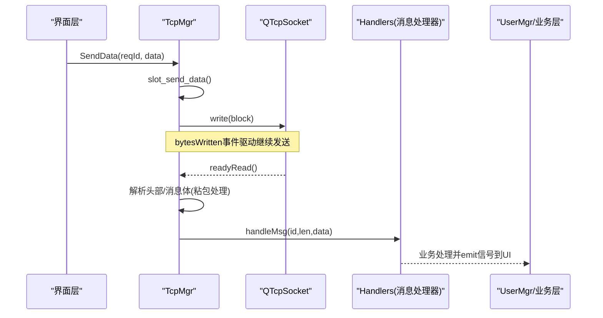
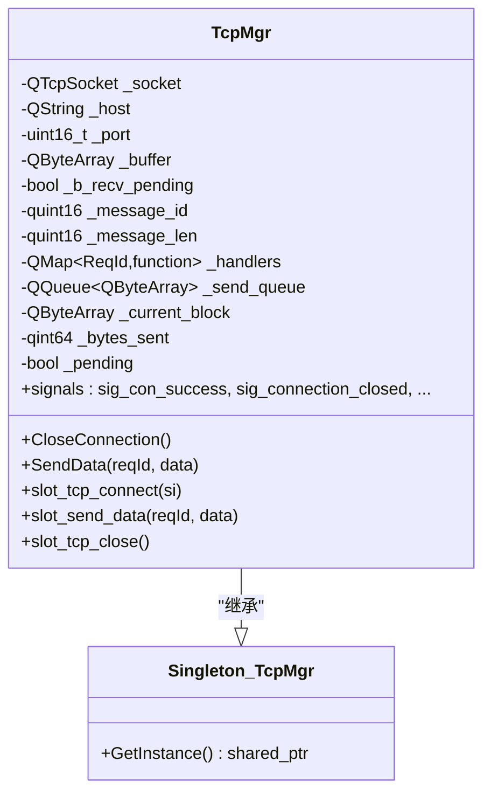
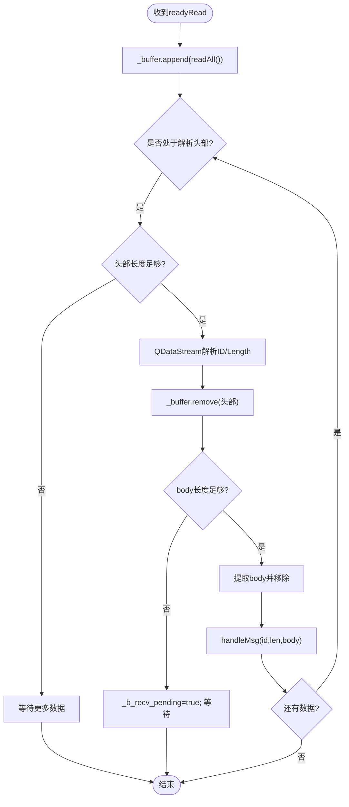
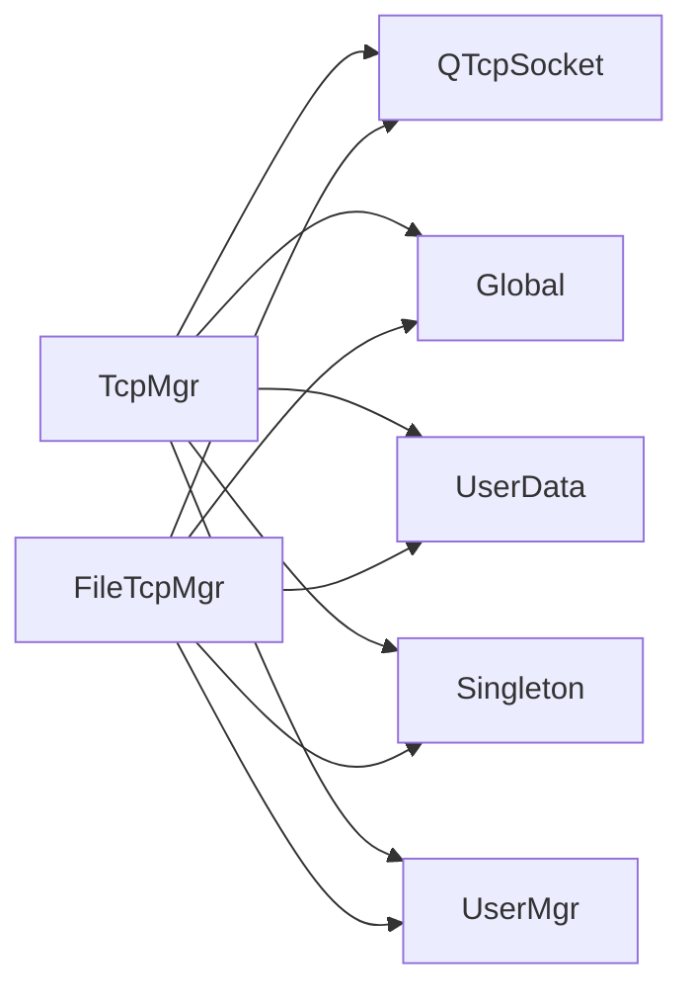
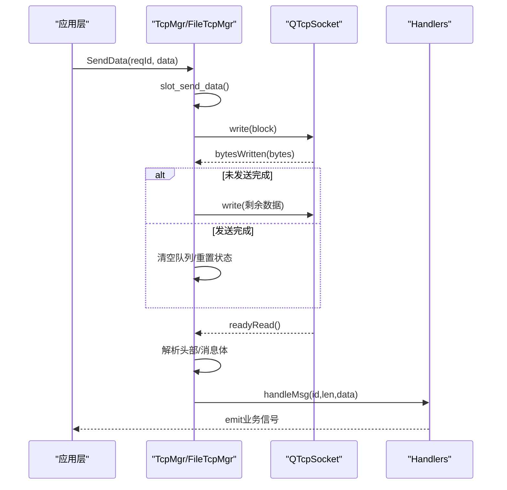

# TCP通信管理

<cite>
**本文引用的文件**   
- [tcpmgr.h](file://client/llfcchat/include/tcpmgr.h)
- [tcpmgr.cpp](file://client/llfcchat/src/tcpmgr.cpp)
- [filetcpmgr.h](file://client/llfcchat/include/filetcpmgr.h)
- [filetcpmgr.cpp](file://client/llfcchat/src/filetcpmgr.cpp)
- [singleton.h](file://client/llfcchat/include/singleton.h)
- [global.h](file://client/llfcchat/include/global.h)
- [userdata.h](file://client/llfcchat/include/userdata.h)
- [day15-客户端Tcp管理类设计.md](file://开发文档/day15-客户端Tcp管理类设计.md)
- [day42-Qt粘包引发的血案.md](file://开发文档/day42-Qt粘包引发的血案.md)
</cite>

## 目录
1. [简介](#简介)
2. [项目结构](#项目结构)
3. [核心组件](#核心组件)
4. [架构总览](#架构总览)
5. [详细组件分析](#详细组件分析)
6. [依赖关系分析](#依赖关系分析)
7. [性能考虑](#性能考虑)
8. [故障排查指南](#故障排查指南)
9. [结论](#结论)
10. [附录](#附录)

## 简介
本技术文档围绕LLFCChat客户端的TCP通信管理器展开，重点解析TcpMgr与FileTcpMgr两个单例模块的实现原理与协作方式。内容涵盖：
- 连接建立、消息收发、重连机制、心跳保活等核心功能
- QTcpSocket的使用方式与异步I/O模型
- Qt信号槽在网络通信中的应用
- 消息队列管理机制（发送队列、接收缓冲、粘包处理）
- 错误处理策略（连接异常、网络超时、数据损坏）
- 性能优化技巧（连接池、内存优化、线程安全）
- 具体代码示例路径与最佳实践指导

## 项目结构
本项目采用分层与按功能组织相结合的结构：
- 客户端UI层：包含聊天界面、登录注册、联系人管理等
- 网络层：TcpMgr负责文本/控制类消息；FileTcpMgr负责大文件/图片传输
- 数据层：UserData定义消息体、会话、用户信息等数据结构
- 全局常量与协议：Global定义ReqId、错误码、传输参数等

图表来源
- [tcpmgr.h:22-87](file://client/llfcchat/include/tcpmgr.h#L22-L87)
- [filetcpmgr.h:26-82](file://client/llfcchat/include/filetcpmgr.h#L26-L82)
- [global.h:43-88](file://client/llfcchat/include/global.h#L43-L88)
- [singleton.h:18-44](file://client/llfcchat/include/singleton.h#L18-L44)

章节来源
- [tcpmgr.h:22-87](file://client/llfcchat/include/tcpmgr.h#L22-L87)
- [filetcpmgr.h:26-82](file://client/llfcchat/include/filetcpmgr.h#L26-L82)
- [global.h:43-88](file://client/llfcchat/include/global.h#L43-L88)
- [singleton.h:18-44](file://client/llfcchat/include/singleton.h#L18-L44)

## 核心组件
- TcpMgr：基于QTcpSocket实现长连接，负责登录、搜索、好友申请、认证、聊天消息、离线通知、心跳、聊天线程加载、私聊创建、聊天消息加载等控制面与文本消息。
- FileTcpMgr：基于QTcpSocket实现大文件/图片上传下载，支持断点续传、分片、拥塞窗口控制、进度回调等。
- Singleton<T>：线程安全的单例模板，提供GetInstance()获取唯一实例。
- Global：集中定义ReqId枚举、错误码、传输常量（如MAX_FILE_LEN、FILE_UPLOAD_HEAD_LEN）、数据类型（MsgInfo、DownloadInfo等）。
- UserData：消息与会话相关的数据结构（TextChatData、ImgChatData、AuthInfo、UserInfo、ChatThreadInfo等）。

章节来源
- [tcpmgr.h:22-87](file://client/llfcchat/include/tcpmgr.h#L22-L87)
- [filetcpmgr.h:26-82](file://client/llfcchat/include/filetcpmgr.h#L26-L82)
- [singleton.h:18-44](file://client/llfcchat/include/singleton.h#L18-L44)
- [global.h:43-88](file://client/llfcchat/include/global.h#L43-L88)
- [userdata.h:144-288](file://client/llfcchat/include/userdata.h#L144-L288)

## 架构总览
整体采用“单例管理器 + 信号槽驱动”的架构：
- 单例模式保证全局唯一性，避免多实例导致的连接冲突
- 通过Qt信号槽解耦UI与网络层，跨线程安全传递数据
- 接收侧使用缓冲区+状态机处理粘包/半包
- 发送侧使用QQueue做串行化发送，bytesWritten事件驱动分块写入

图表来源
- [tcpmgr.cpp:171-174](file://client/llfcchat/src/tcpmgr.cpp#L171-L174)
- [tcpmgr.cpp:103-129](file://client/llfcchat/src/tcpmgr.cpp#L103-L129)
- [tcpmgr.cpp:18-55](file://client/llfcchat/src/tcpmgr.cpp#L18-L55)
- [tcpmgr.cpp:182-800](file://client/llfcchat/src/tcpmgr.cpp#L182-L800)

## 详细组件分析

### TcpMgr：文本与控制消息通道
- 单例实现：继承Singleton<TcpMgr>，通过GetInstance()获取唯一实例
- 连接管理：connectToHost发起连接，connected/disconnected/error信号处理连接生命周期
- 接收流程：readyRead中读取所有数据追加到_buffer，循环解析头部与消息体，处理粘包/半包
- 发送流程：SendData触发sig_send_data，slot_send_data组装block后write，bytesWritten事件驱动分块发送
- 消息分发：_handlers映射ReqId到lambda处理器，handleMsg统一调度
- 信号输出：向UI层发射各类业务信号（登录结果、聊天消息、离线通知等）

图表来源
- [tcpmgr.h:22-87](file://client/llfcchat/include/tcpmgr.h#L22-L87)
- [singleton.h:18-44](file://client/llfcchat/include/singleton.h#L18-L44)

章节来源
- [tcpmgr.h:22-87](file://client/llfcchat/include/tcpmgr.h#L22-L87)
- [tcpmgr.cpp:18-136](file://client/llfcchat/src/tcpmgr.cpp#L18-L136)
- [tcpmgr.cpp:171-174](file://client/llfcchat/src/tcpmgr.cpp#L171-L174)
- [tcpmgr.cpp:182-800](file://client/llfcchat/src/tcpmgr.cpp#L182-L800)

### FileTcpMgr：文件与图片传输通道
- 单例实现：继承Singleton<FileTcpMgr>
- 连接管理：同TcpMgr，connectToHost与信号处理
- 接收流程：readyRead中读取数据到_buffer，循环解析头部（ID+长度），处理粘包/半包
- 发送流程：slot_send_data组装block，bytesWritten事件驱动分块发送
- 拥塞控制：_cwnd_size控制并发发送数量，防止拥塞
- 断点续传：支持上传/下载的seq、last、trans_size等字段，维护已确认序列集合
- 进度回调：sig_update_upload_progress、sig_download_finish等信号更新UI

图表来源
- [filetcpmgr.cpp:16-55](file://client/llfcchat/src/filetcpmgr.cpp#L16-L55)
- [filetcpmgr.cpp:186-221](file://client/llfcchat/src/filetcpmgr.cpp#L186-L221)
- [global.h:15-24](file://client/llfcchat/include/global.h#L15-L24)

章节来源
- [filetcpmgr.h:26-82](file://client/llfcchat/include/filetcpmgr.h#L26-L82)
- [filetcpmgr.cpp:16-143](file://client/llfcchat/src/filetcpmgr.cpp#L16-L143)
- [filetcpmgr.cpp:186-221](file://client/llfcchat/src/filetcpmgr.cpp#L186-L221)
- [global.h:15-24](file://client/llfcchat/include/global.h#L15-L24)

### 单例模式实现原理
- 使用模板类Singleton<T>，内部持有static shared_ptr<T> _instance
- GetInstance()使用std::call_once与once_flag确保线程安全初始化
- 禁止拷贝构造与赋值，保证唯一性

章节来源
- [singleton.h:18-44](file://client/llfcchat/include/singleton.h#L18-L44)

### 消息协议与数据结构
- ReqId：定义所有请求/响应类型（登录、搜索、好友、聊天、心跳、文件等）
- ErrorCodes：SUCCESS、ERR_JSON、ERR_NETWORK等
- MsgInfo：文件/图片传输元信息（大小、MD5、序列号、状态等）
- DownloadInfo：下载任务信息（名称、大小、当前进度、序列号、本地路径）
- TextChatData/ImgChatData：聊天消息基类与派生类

章节来源
- [global.h:43-88](file://client/llfcchat/include/global.h#L43-L88)
- [global.h:167-200](file://client/llfcchat/include/global.h#L167-L200)
- [global.h:284-290](file://client/llfcchat/include/global.h#L284-L290)
- [userdata.h:144-288](file://client/llfcchat/include/userdata.h#L144-L288)

## 依赖关系分析
- TcpMgr/FileTcpMgr依赖QTcpSocket进行网络I/O
- 依赖Global中的ReqId、ErrorCodes、常量定义
- 依赖UserData中的消息与会话结构
- 依赖Singleton<T>提供单例访问
- 与UserMgr交互（设置用户信息、令牌、上传/下载任务管理）

图表来源
- [tcpmgr.h:22-87](file://client/llfcchat/include/tcpmgr.h#L22-L87)
- [filetcpmgr.h:26-82](file://client/llfcchat/include/filetcpmgr.h#L26-L82)
- [global.h:43-88](file://client/llfcchat/include/global.h#L43-L88)
- [singleton.h:18-44](file://client/llfcchat/include/singleton.h#L18-L44)

章节来源
- [tcpmgr.h:22-87](file://client/llfcchat/include/tcpmgr.h#L22-L87)
- [filetcpmgr.h:26-82](file://client/llfcchat/include/filetcpmgr.h#L26-L82)
- [global.h:43-88](file://client/llfcchat/include/global.h#L43-L88)
- [singleton.h:18-44](file://client/llfcchat/include/singleton.h#L18-L44)

## 性能考虑
- 粘包处理优化：每次循环重新创建QDataStream，避免stream位置错乱；使用_buffer.remove替代mid减少拷贝
- 发送队列：QQueue串行化发送，bytesWritten事件驱动，避免阻塞UI线程
- 拥塞控制：FileTcpMgr使用_cwnd_size限制并发发送数量，防止网络拥塞
- 内存优化：预分配_buffer容量，避免频繁realloc；大数据使用引用传递
- 线程安全：信号槽跨线程调用，避免直接操作共享资源；单例初始化使用call_once

章节来源
- [tcpmgr.cpp:18-55](file://client/llfcchat/src/tcpmgr.cpp#L18-L55)
- [filetcpmgr.cpp:16-55](file://client/llfcchat/src/filetcpmgr.cpp#L16-L55)
- [filetcpmgr.cpp:106-132](file://client/llfcchat/src/filetcpmgr.cpp#L106-L132)
- [global.h:22-24](file://client/llfcchat/include/global.h#L22-L24)
- [singleton.h:27-34](file://client/llfcchat/include/singleton.h#L27-L34)

## 故障排查指南
- 连接失败：检查error信号中的ConnectionRefusedError、HostNotFoundError、SocketTimeoutError等
- 粘包问题：确保每次循环重新创建QDataStream，使用remove而非mid；添加长度校验
- 数据损坏：JSON解析失败时返回ERR_JSON，记录日志并清理_buffer
- 断开重连：disconnected信号触发后，可启动重连逻辑（需上层实现）
- 心跳保活：ID_HEARTBEAT_REQ/RSP用于检测连接存活，未收到心跳则判定连接失效

章节来源
- [tcpmgr.cpp:64-91](file://client/llfcchat/src/tcpmgr.cpp#L64-L91)
- [tcpmgr.cpp:94-98](file://client/llfcchat/src/tcpmgr.cpp#L94-L98)
- [tcpmgr.cpp:584-612](file://client/llfcchat/src/tcpmgr.cpp#L584-L612)
- [day42-Qt粘包引发的血案.md:256-320](file://开发文档/day42-Qt粘包引发的血案.md#L256-L320)

## 结论
TcpMgr与FileTcpMgr通过单例模式与Qt信号槽机制，构建了稳定高效的TCP通信框架。其核心优势包括：
- 清晰的职责分离：控制面与数据面分离
- 健壮的粘包处理：状态机+缓冲区管理
- 高性能发送：队列+事件驱动+拥塞控制
- 可扩展性：Handler映射机制便于新增消息类型
建议后续增强：
- 完善重连机制（指数退避、最大重试次数）
- 增加心跳定时器与超时检测
- 引入连接池管理多服务器场景
- 细化错误码与监控指标

[本节不直接分析具体文件，无需章节来源]

## 附录

### 关键流程图：消息发送与接收

图表来源
- [tcpmgr.cpp:103-129](file://client/llfcchat/src/tcpmgr.cpp#L103-L129)
- [filetcpmgr.cpp:106-132](file://client/llfcchat/src/filetcpmgr.cpp#L106-L132)
- [tcpmgr.cpp:18-55](file://client/llfcchat/src/tcpmgr.cpp#L18-L55)
- [filetcpmgr.cpp:16-55](file://client/llfcchat/src/filetcpmgr.cpp#L16-L55)

### 最佳实践清单
- 使用单例模式管理网络模块，避免多实例冲突
- 在readyRead中始终重新创建QDataStream，避免位置错乱
- 使用_buffer.remove替代mid提升性能
- 添加消息长度校验，防止异常数据导致崩溃
- 通过信号槽解耦UI与网络层，保证线程安全
- 实现心跳保活与超时检测，提升连接可靠性
- 使用QQueue串行化发送，避免阻塞主线程
- 对大文件传输实施拥塞控制与断点续传

章节来源
- [day42-Qt粘包引发的血案.md:457-514](file://开发文档/day42-Qt粘包引发的血案.md#L457-L514)
- [tcpmgr.cpp:18-55](file://client/llfcchat/src/tcpmgr.cpp#L18-L55)
- [filetcpmgr.cpp:16-55](file://client/llfcchat/src/filetcpmgr.cpp#L16-L55)