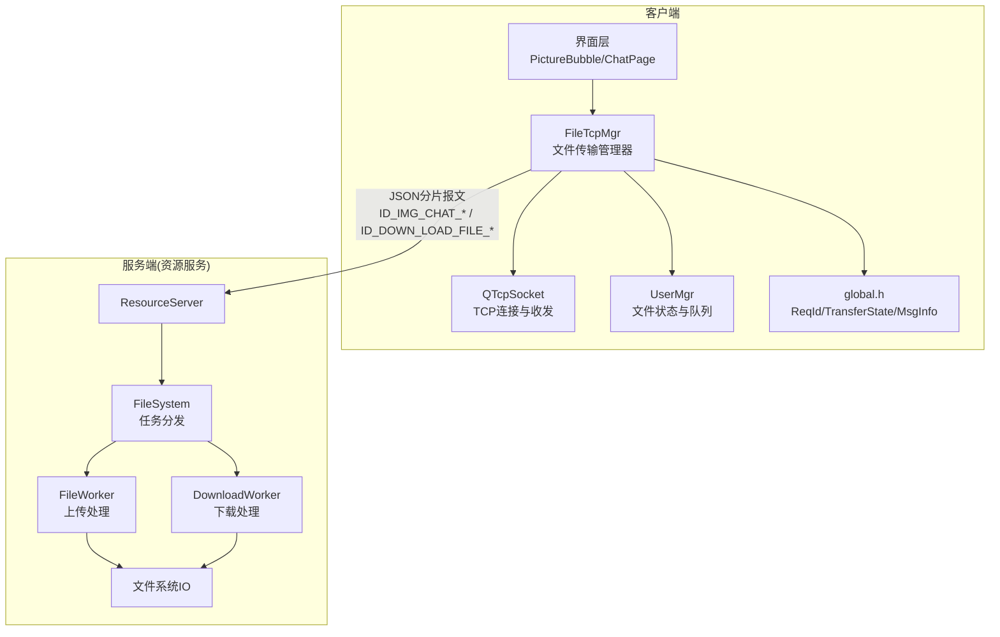
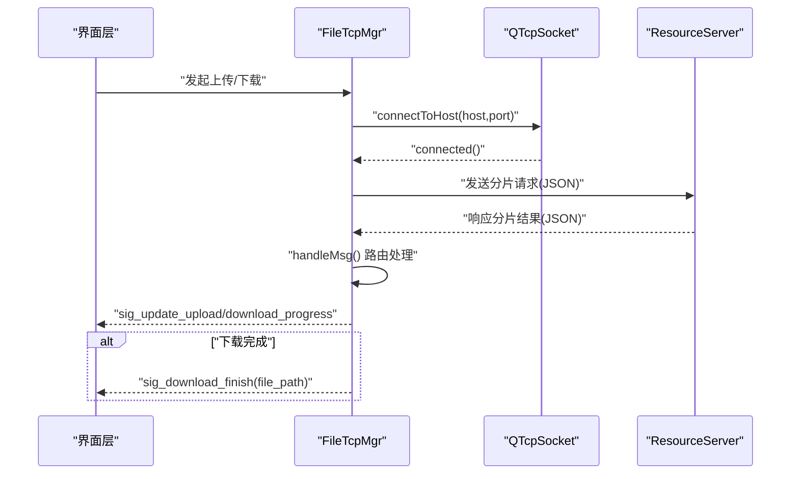
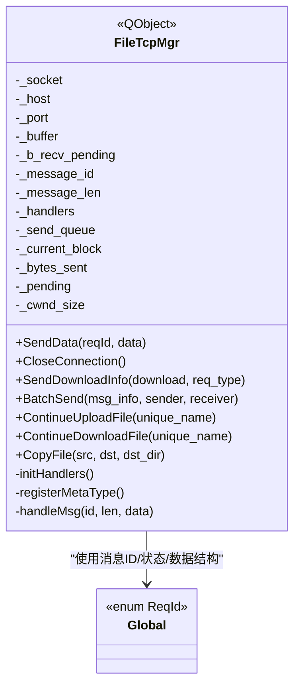
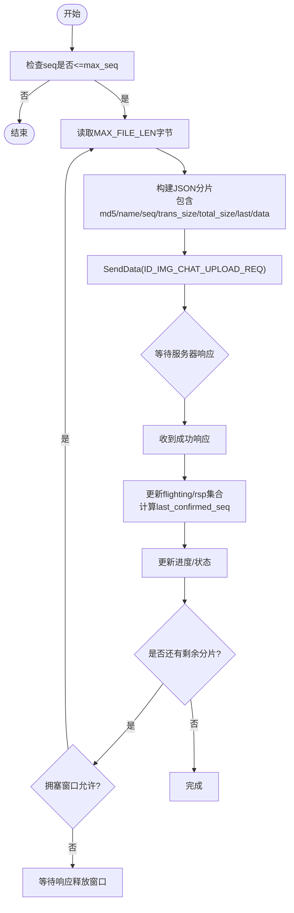
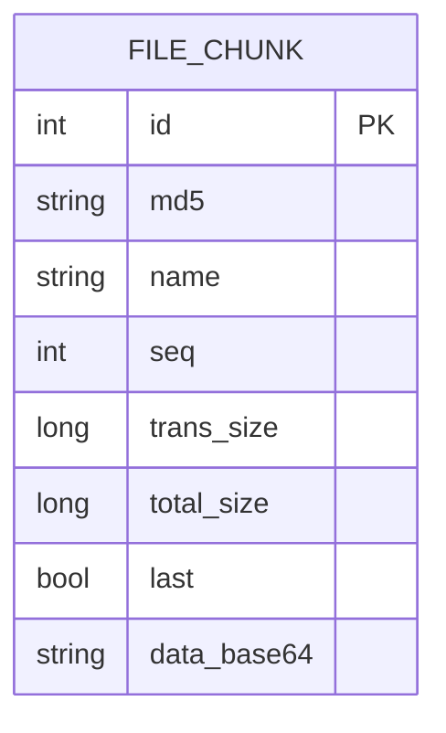
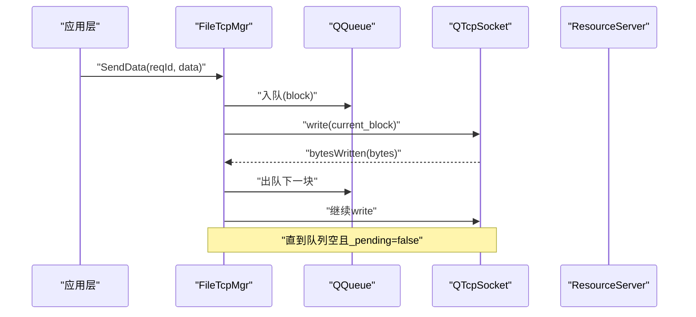
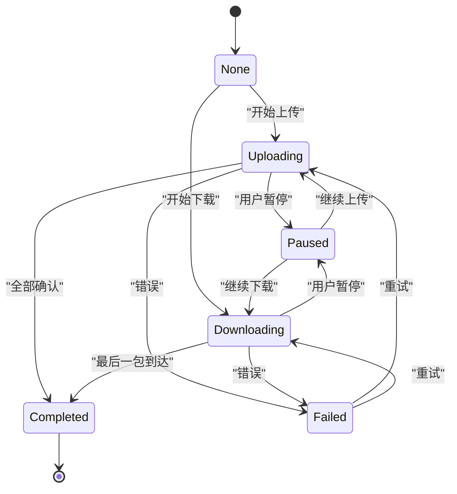
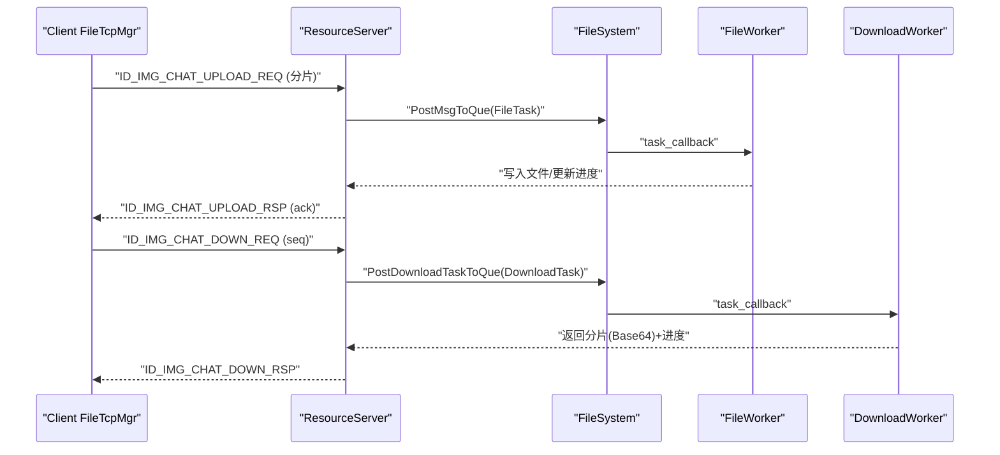
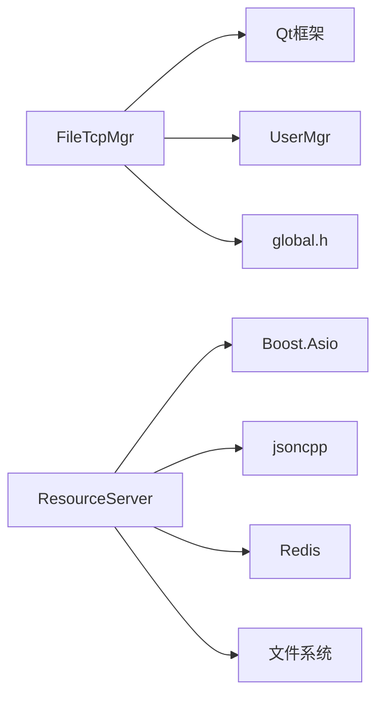

# 文件传输管理

<cite>
**本文引用的文件**   
- [filetcpmgr.h](file://client/llfcchat/include/filetcpmgr.h)
- [filetcpmgr.cpp](file://client/llfcchat/src/filetcpmgr.cpp)
- [global.h](file://client/llfcchat/include/global.h)
- [userdata.h](file://client/llfcchat/include/userdata.h)
- [FileWorker.h](file://server/ResourceServer/include/FileWorker.h)
- [FileSystem.h](file://server/ResourceServer/include/FileSystem.h)
- [FileInfo.h](file://server/ResourceServer/include/FileInfo.h)
- [CSession.cpp](file://server/ChatServer/src/CSession.cpp)
- [day31-文件传输.md](file://开发文档/day31-文件传输.md)
- [day38-断点续传.md](file://开发文档/day38-断点续传.md)
- [day40-聊天图片资源续传和进度显示.md](file://开发文档/day40-聊天图片资源续传和进度显示.md)
- [day41-通知客户端异步下载聊天图片.md](file://开发文档/day41-通知客户端异步下载聊天图片.md)
</cite>

## 目录
1. [简介](#简介)
2. [项目结构](#项目结构)
3. [核心组件](#核心组件)
4. [架构总览](#架构总览)
5. [详细组件分析](#详细组件分析)
6. [依赖关系分析](#依赖关系分析)
7. [性能考量](#性能考量)
8. [故障排查指南](#故障排查指南)
9. [结论](#结论)
10. [附录：API与使用示例](#附录api与使用示例)

## 简介
本技术文档围绕 LLFCChat 客户端的文件传输管理器 FileTcpMgr 展开，系统性阐述其设计架构、协议定义、分片上传/下载算法、断点续传机制、并发控制、内存与缓冲区管理、状态管理与可靠性保障，以及性能优化策略。同时给出完整的 API 接口说明与使用示例，帮助开发者快速理解并扩展该模块。

## 项目结构
- 客户端侧
  - 文件传输管理器：FileTcpMgr（头文件与实现）
  - 全局常量与消息 ID、传输状态枚举、消息体数据结构：global.h、userdata.h
- 服务端侧（资源服务）
  - 文件工作者与下载工作者：FileWorker.h
  - 文件系统调度器：FileSystem.h
  - 文件元数据模型：FileInfo.h
  - 会话层读写封装：CSession.cpp（ChatServer）
- 开发文档
  - 文件传输、断点续传、图片资源续传与进度显示、异步下载等演进记录

**图示来源** 
- [filetcpmgr.h:26-82](file://client/llfcchat/include/filetcpmgr.h#L26-L82)
- [filetcpmgr.cpp:175-221](file://client/llfcchat/src/filetcpmgr.cpp#L175-L221)
- [global.h:43-88](file://client/llfcchat/include/global.h#L43-L88)
- [FileWorker.h:14-56](file://server/ResourceServer/include/FileWorker.h#L14-L56)
- [FileSystem.h:7-18](file://server/ResourceServer/include/FileSystem.h#L7-L18)

**章节来源**
- [filetcpmgr.h:26-82](file://client/llfcchat/include/filetcpmgr.h#L26-L82)
- [filetcpmgr.cpp:1-143](file://client/llfcchat/src/filetcpmgr.cpp#L1-L143)
- [global.h:43-88](file://client/llfcchat/include/global.h#L43-L88)
- [FileWorker.h:14-56](file://server/ResourceServer/include/FileWorker.h#L14-L56)
- [FileSystem.h:7-18](file://server/ResourceServer/include/FileSystem.h#L7-L18)

## 核心组件
- FileTcpMgr：客户端文件传输的核心管理器，负责 TCP 连接、粘包/拆包解析、消息路由、分片上传/下载、拥塞窗口控制、进度上报与断点续传。
- global.h：定义 ReqId（消息类型）、ErrorCodes、TransferState、TransferType、MsgInfo 等关键结构与常量（如 MAX_FILE_LEN、MAX_CWND_SIZE）。
- userdata.h：聊天相关数据结构（如 ImgChatData、ChatThreadData），用于将 MsgInfo 与界面展示关联。
- 服务端 FileWorker/DownloadWorker：基于线程池的任务队列，分别处理上传与下载，配合 Redis 持久化断点信息。
- FileSystem：单例调度器，按哈希或索引将任务投递到不同 Worker，保证同文件有序处理。

**章节来源**
- [filetcpmgr.h:26-82](file://client/llfcchat/include/filetcpmgr.h#L26-L82)
- [global.h:15-24](file://client/llfcchat/include/global.h#L15-L24)
- [global.h:158-197](file://client/llfcchat/include/global.h#L158-L197)
- [FileWorker.h:58-88](file://server/ResourceServer/include/FileWorker.h#L58-L88)
- [FileSystem.h:7-18](file://server/ResourceServer/include/FileSystem.h#L7-L18)

## 架构总览
FileTcpMgr 采用“事件驱动 + 队列 + 回调”的架构：
- 接收端：QTcpSocket::readyRead 触发，循环解析头部（ID+长度）与消息体，调用 handleMsg 路由至具体处理器。
- 发送端：slot_send_data 组装报文（大端序 ID+长度+JSON 体），通过 _send_queue 与 bytesWritten 回调完成可靠发送。
- 业务处理器：initHandlers 注册各 ReqId 的处理逻辑，包括头像上传、聊天图片上传/下载、文件信息同步、断点续传等。
- 状态与进度：通过 UserMgr 维护 MsgInfo，结合信号 sig_update_upload_progress/sig_update_download_progress 驱动 UI。

**图示来源** 
- [filetcpmgr.cpp:10-13](file://client/llfcchat/src/filetcpmgr.cpp#L10-L13)
- [filetcpmgr.cpp:16-55](file://client/llfcchat/src/filetcpmgr.cpp#L16-L55)
- [filetcpmgr.cpp:186-221](file://client/llfcchat/src/filetcpmgr.cpp#L186-L221)
- [filetcpmgr.cpp:243-332](file://client/llfcchat/src/filetcpmgr.cpp#L243-L332)

## 详细组件分析

### FileTcpMgr 类设计与职责
- 成员变量
  - 网络：_socket、_host、_port、_buffer、_b_recv_pending、_message_id、_message_len
  - 发送：_send_queue、_current_block、_bytes_sent、_pending、_cwnd_size
  - 处理器映射：_handlers
- 关键方法
  - SendData：统一发送入口，封装为 JSON 并通过信号进入 slot_send_data
  - slot_tcp_connect：建立与服务器的连接
  - initHandlers：注册所有消息处理器（上传头像、聊天图片上传/下载、文件信息同步、续传）
  - ContinueUploadFile/ContinueDownloadFile：断点续传入口
  - CopyFile：本地文件复制（用于最终落盘）
- 信号槽
  - 连接/断开：sig_con_success、sig_connection_closed
  - 进度更新：sig_update_upload_progress、sig_update_download_progress
  - 下载完成：sig_download_finish
  - 续传触发：sig_continue_upload_file、sig_continue_download_file

**图示来源** 
- [filetcpmgr.h:26-82](file://client/llfcchat/include/filetcpmgr.h#L26-L82)
- [global.h:43-88](file://client/llfcchat/include/global.h#L43-L88)
- [global.h:158-197](file://client/llfcchat/include/global.h#L158-L197)

**章节来源**
- [filetcpmgr.h:26-82](file://client/llfcchat/include/filetcpmgr.h#L26-L82)
- [filetcpmgr.cpp:175-221](file://client/llfcchat/src/filetcpmgr.cpp#L175-L221)
- [filetcpmgr.cpp:243-332](file://client/llfcchat/src/filetcpmgr.cpp#L243-L332)

### 分片上传/下载算法与断点续传
- 分片大小：MAX_FILE_LEN（默认 32KB）
- 序列号 seq：自增，标识分片顺序；last 标记最后一个分片
- 已确认序列：_last_confirmed_seq 与 _rsp_seqs/_flighting_seqs 共同维护可靠传输
- 断点恢复：
  - 上传：根据 last_confirmed_seq 定位文件偏移继续读取
  - 下载：根据 seq 决定覆盖/追加写入，并在最后一条时清理状态
- 拥塞窗口：MAX_CWND_SIZE 限制未确认分片数量，避免拥塞

**图示来源** 
- [filetcpmgr.cpp:1031-1076](file://client/llfcchat/src/filetcpmgr.cpp#L1031-L1076)
- [filetcpmgr.cpp:521-608](file://client/llfcchat/src/filetcpmgr.cpp#L521-L608)
- [global.h:22-24](file://client/llfcchat/include/global.h#L22-L24)

**章节来源**
- [filetcpmgr.cpp:1031-1076](file://client/llfcchat/src/filetcpmgr.cpp#L1031-L1076)
- [filetcpmgr.cpp:521-608](file://client/llfcchat/src/filetcpmgr.cpp#L521-L608)
- [global.h:22-24](file://client/llfcchat/include/global.h#L22-L24)

### 文件传输协议设计
- 传输格式：固定头部（ID=2字节，长度=4字节）+ JSON 体
- 关键字段
  - md5：文件校验（可选用于完整性校验）
  - name/unique_name：文件名与唯一名
  - seq：分片序号
  - trans_size/current_size：当前累计传输大小
  - total_size：总大小
  - last/is_last：是否最后一个分片
  - uid/sender/receiver/message_id：上下文关联
- 错误码：ErrorCodes（SUCCESS/ERR_JSON/ERR_NETWORK）

**图示来源** 
- [global.h:43-88](file://client/llfcchat/include/global.h#L43-L88)
- [filetcpmgr.cpp:243-332](file://client/llfcchat/src/filetcpmgr.cpp#L243-L332)
- [filetcpmgr.cpp:695-784](file://client/llfcchat/src/filetcpmgr.cpp#L695-L784)

**章节来源**
- [global.h:43-88](file://client/llfcchat/include/global.h#L43-L88)
- [filetcpmgr.cpp:243-332](file://client/llfcchat/src/filetcpmgr.cpp#L243-L332)
- [filetcpmgr.cpp:695-784](file://client/llfcchat/src/filetcpmgr.cpp#L695-L784)

### 并发控制与内存管理
- 发送队列：QQueue 缓冲待发包，bytesWritten 回调驱动出队与续写
- 拥塞窗口：_cwnd_size 控制未确认分片数量，防止拥塞
- 多线程：
  - 客户端：Qt 事件循环与信号槽跨线程安全
  - 服务端：FileWorker/DownloadWorker 独立线程处理任务，条件变量唤醒
- 内存管理：
  - 分片 Base64 编解码，注意内存峰值
  - 文件流按需打开/关闭，避免长时间占用句柄

**图示来源** 
- [filetcpmgr.cpp:106-132](file://client/llfcchat/src/filetcpmgr.cpp#L106-L132)
- [filetcpmgr.cpp:186-221](file://client/llfcchat/src/filetcpmgr.cpp#L186-L221)
- [FileWorker.h:58-88](file://server/ResourceServer/include/FileWorker.h#L58-L88)

**章节来源**
- [filetcpmgr.cpp:106-132](file://client/llfcchat/src/filetcpmgr.cpp#L106-L132)
- [filetcpmgr.cpp:186-221](file://client/llfcchat/src/filetcpmgr.cpp#L186-L221)
- [FileWorker.h:58-88](file://server/ResourceServer/include/FileWorker.h#L58-L88)

### 文件状态管理与可靠性保障
- 状态机：None/Downloading/Uploading/Paused/Completed/Failed
- 进度跟踪：_current_size/_total_size/_last_confirmed_seq
- 中断恢复：
  - 暂停：设置 Paused，停止后续发送
  - 恢复：从 last_confirmed_seq 继续
- 错误重试：
  - 网络错误：重连与信号通知
  - 分片失败：基于 flighting/rsp 集合判断缺失并重发

**图示来源** 
- [global.h:158-165](file://client/llfcchat/include/global.h#L158-L165)
- [filetcpmgr.cpp:521-608](file://client/llfcchat/src/filetcpmgr.cpp#L521-L608)
- [filetcpmgr.cpp:695-784](file://client/llfcchat/src/filetcpmgr.cpp#L695-L784)

**章节来源**
- [global.h:158-165](file://client/llfcchat/include/global.h#L158-L165)
- [filetcpmgr.cpp:521-608](file://client/llfcchat/src/filetcpmgr.cpp#L521-L608)
- [filetcpmgr.cpp:695-784](file://client/llfcchat/src/filetcpmgr.cpp#L695-L784)

### 服务端文件处理（ResourceServer）
- FileWorker：处理上传任务，Base64 解码后按 seq 写入文件，首个分片覆盖，后续追加
- DownloadWorker：按 seq 读取文件分片，Base64 编码返回，首包获取文件大小并持久化到 Redis，后续续传更新 Redis
- FileSystem：单例，按索引分发任务到多个 Worker，保证同文件有序

**图示来源** 
- [FileWorker.h:14-56](file://server/ResourceServer/include/FileWorker.h#L14-L56)
- [FileWorker.h:58-88](file://server/ResourceServer/include/FileWorker.h#L58-L88)
- [FileSystem.h:7-18](file://server/ResourceServer/include/FileSystem.h#L7-L18)
- [day41-通知客户端异步下载聊天图片.md:571-709](file://开发文档/day41-通知客户端异步下载聊天图片.md#L571-L709)

**章节来源**
- [FileWorker.h:14-56](file://server/ResourceServer/include/FileWorker.h#L14-L56)
- [FileWorker.h:58-88](file://server/ResourceServer/include/FileWorker.h#L58-L88)
- [FileSystem.h:7-18](file://server/ResourceServer/include/FileSystem.h#L7-L18)
- [day41-通知客户端异步下载聊天图片.md:571-709](file://开发文档/day41-通知客户端异步下载聊天图片.md#L571-L709)

## 依赖关系分析
- 客户端依赖
  - Qt：QTcpSocket、QQueue、QJsonObject/QJsonDocument、QStandardPaths
  - 内部模块：UserMgr（文件状态与队列）、global.h（常量与枚举）
- 服务端依赖
  - Boost.Asio：异步 I/O
  - JSON库：jsoncpp
  - Redis：断点信息持久化
  - 文件系统：boost::filesystem

**图示来源** 
- [filetcpmgr.cpp:1-10](file://client/llfcchat/src/filetcpmgr.cpp#L1-L10)
- [global.h:1-24](file://client/llfcchat/include/global.h#L1-L24)
- [FileWorker.h:1-12](file://server/ResourceServer/include/FileWorker.h#L1-L12)

**章节来源**
- [filetcpmgr.cpp:1-10](file://client/llfcchat/src/filetcpmgr.cpp#L1-L10)
- [global.h:1-24](file://client/llfcchat/include/global.h#L1-L24)
- [FileWorker.h:1-12](file://server/ResourceServer/include/FileWorker.h#L1-L12)

## 性能考量
- 缓冲区大小调优
  - MAX_FILE_LEN 建议 32KB~64KB，平衡网络吞吐与内存占用
  - 发送队列长度与拥塞窗口 MAX_CWND_SIZE 需根据带宽与延迟调整
- 并发度控制
  - 客户端：_cwnd_size 控制未确认分片数，避免拥塞
  - 服务端：Worker 数量与队列长度按 CPU/IO 能力配置
- 网络带宽利用
  - 合理设置 socket 发送/接收缓冲区
  - 避免频繁 Base64 编解码，必要时考虑二进制帧
- I/O 优化
  - 文件读写使用二进制模式，减少拷贝
  - 下载首包获取文件大小，避免重复统计

[本节为通用指导，不直接分析具体文件]

## 故障排查指南
- 常见问题
  - 粘包/拆包：确保头部解析正确（ID+长度），缓冲区循环处理
  - 连接异常：监听 error/disconnected 信号，进行重连与状态重置
  - 进度不更新：检查 last_confirmed_seq 与 rsp_seqs 更新逻辑
  - 下载不完整：确认 is_last 标志与追加写入模式
- 调试建议
  - 打印关键路径日志（handleMsg、slot_send_data、bytesWritten）
  - 检查 JSON 字段完整性（error/md5/name/seq/total_size）
  - 服务端 Redis 断点信息一致性校验

**章节来源**
- [filetcpmgr.cpp:65-93](file://client/llfcchat/src/filetcpmgr.cpp#L65-L93)
- [filetcpmgr.cpp:16-55](file://client/llfcchat/src/filetcpmgr.cpp#L16-L55)
- [filetcpmgr.cpp:243-332](file://client/llfcchat/src/filetcpmgr.cpp#L243-L332)

## 结论
FileTcpMgr 以简洁清晰的架构实现了可靠的文件传输功能，涵盖分片、断点续传、进度监控与并发控制。通过统一的协议与状态管理，客户端与服务端协同高效完成大文件传输。建议在后续迭代中进一步优化 Base64 开销、增强错误恢复策略，并完善端到端校验机制。

[本节为总结性内容，不直接分析具体文件]

## 附录：API与使用示例
- 主要 API（客户端）
  - SendData(reqId, data)：发送数据
  - SendDownloadInfo(download, req_type)：发起下载
  - ContinueUploadFile(unique_name)：断点续传上传
  - ContinueDownloadFile(unique_name)：断点续传下载
  - CopyFile(src, dst, dst_dir)：复制文件
- 信号
  - sig_update_upload_progress(MsgInfo*)：上传进度
  - sig_update_download_progress(MsgInfo*)：下载进度
  - sig_download_finish(MsgInfo*, file_path)：下载完成
- 使用示例（概念流程）
  - 初始化 FileTcpMgr，连接服务器
  - 准备 MsgInfo（文件名、大小、md5、seq=1）
  - 调用 SendData 发送第一个分片
  - 监听进度信号更新 UI
  - 收到 last/is_last 后完成传输

**章节来源**
- [filetcpmgr.h:33-39](file://client/llfcchat/include/filetcpmgr.h#L33-L39)
- [filetcpmgr.h:65-75](file://client/llfcchat/include/filetcpmgr.h#L65-L75)
- [day40-聊天图片资源续传和进度显示.md:451-466](file://开发文档/day40-聊天图片资源续传和进度显示.md#L451-L466)