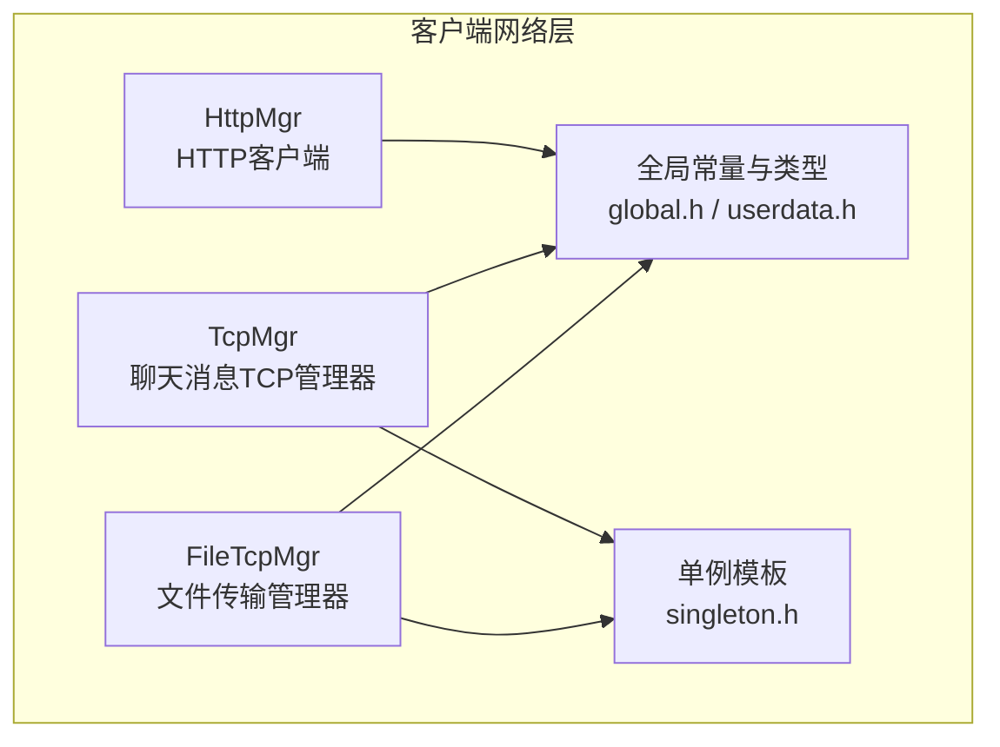
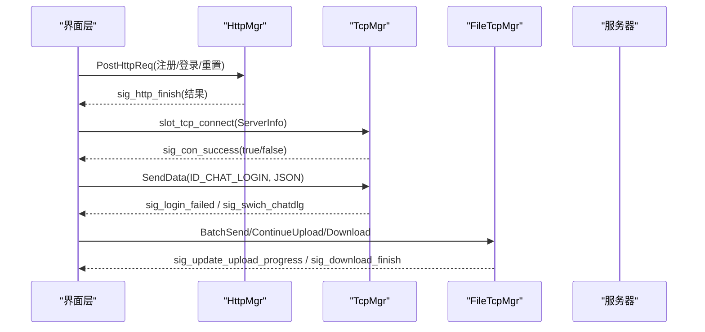
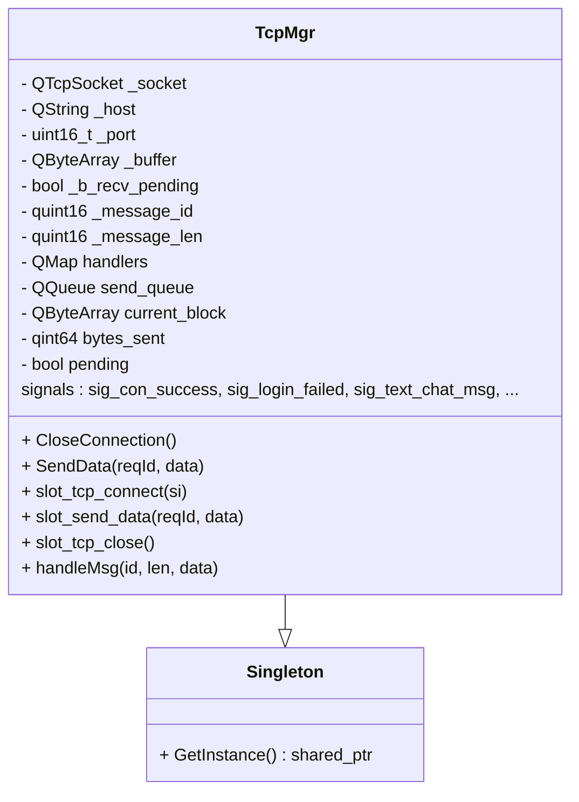
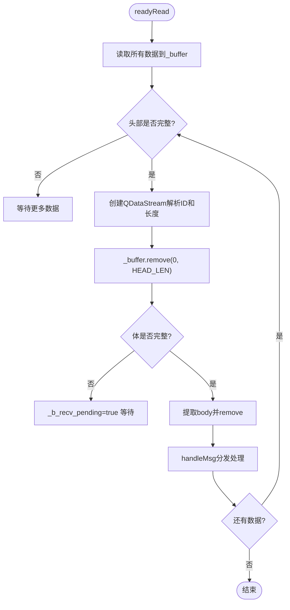
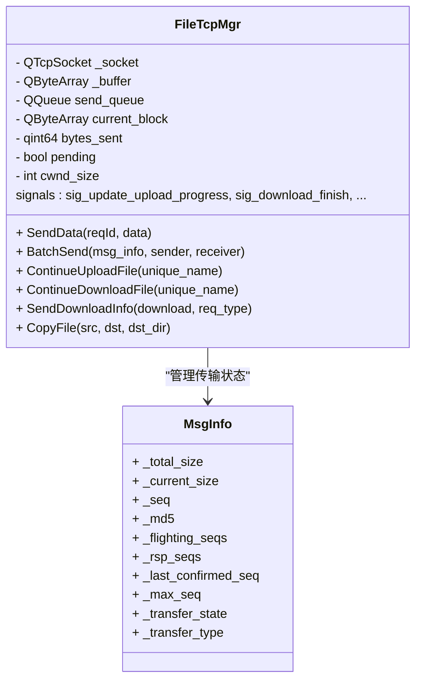
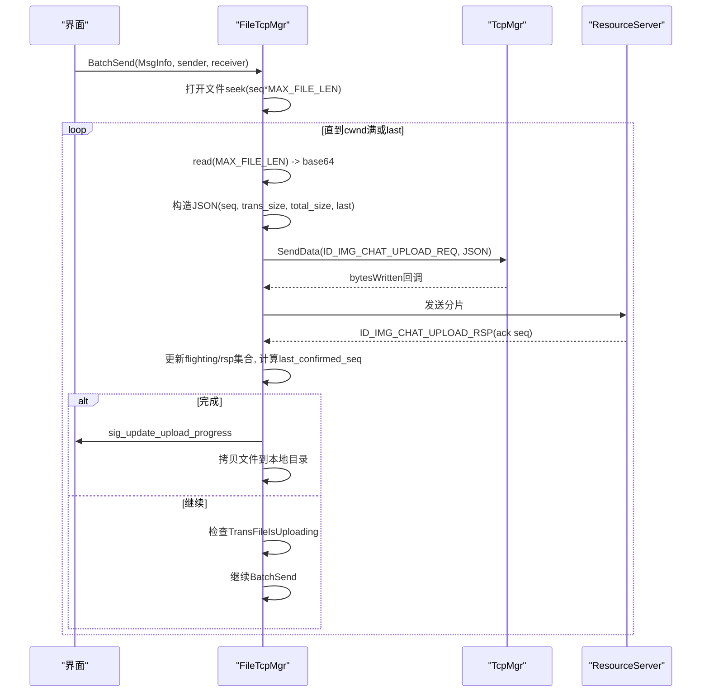
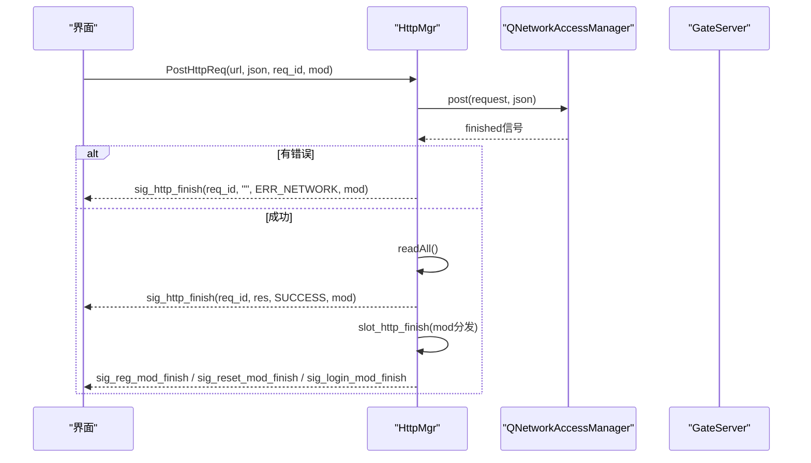
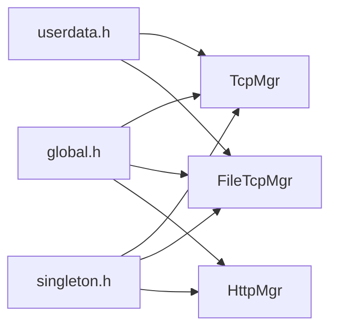

# 网络通信层

<cite>
**本文引用的文件**   
- [tcpmgr.h](file://client/llfcchat/include/tcpmgr.h)
- [tcpmgr.cpp](file://client/llfcchat/src/tcpmgr.cpp)
- [filetcpmgr.h](file://client/llfcchat/include/filetcpmgr.h)
- [filetcpmgr.cpp](file://client/llfcchat/src/filetcpmgr.cpp)
- [httpmgr.h](file://client/llfcchat/include/httpmgr.h)
- [httpmgr.cpp](file://client/llfcchat/src/httpmgr.cpp)
- [global.h](file://client/llfcchat/include/global.h)
- [userdata.h](file://client/llfcchat/include/userdata.h)
- [singleton.h](file://client/llfcchat/include/singleton.h)
- [day15-客户端Tcp管理类设计.md](file://开发文档/day15-客户端Tcp管理类设计.md)
- [day31-文件传输.md](file://开发文档/day31-文件传输.md)
- [day42-Qt粘包引发的血案.md](file://开发文档/day42-Qt粘包引发的血案.md)
</cite>

## 目录
1. [简介](#简介)
2. [项目结构](#项目结构)
3. [核心组件](#核心组件)
4. [架构总览](#架构总览)
5. [详细组件分析](#详细组件分析)
6. [依赖关系分析](#依赖关系分析)
7. [性能考量](#性能考量)
8. [故障排查指南](#故障排查指南)
9. [结论](#结论)
10. [附录](#附录)

## 简介
本技术文档聚焦于LLFCChat客户端的网络通信层，围绕以下三个核心管理器展开：
- TcpMgr：基于单例模式的TCP长连接管理器，负责连接建立、消息收发、错误处理与信号派发。
- FileTcpMgr：文件传输管理器，实现断点续传、分片上传/下载、进度监控、并发控制（拥塞窗口）等高级特性。
- HttpMgr：HTTP客户端封装，提供RESTful API调用、JSON数据解析、错误处理与模块级回调分发。

同时，文档将说明异步I/O模型在Qt中的使用方式（线程模型、信号槽机制），并总结异常处理策略、连接管理、性能优化技巧等实践经验。

## 项目结构
网络通信层主要位于客户端include与src目录下，按职责划分为：
- include：头文件定义类接口、数据结构与枚举常量
- src：具体实现逻辑，包括网络I/O、协议编解码、业务信号派发

图表来源
- [tcpmgr.h:1-90](file://client/llfcchat/include/tcpmgr.h#L1-L90)
- [filetcpmgr.h:1-85](file://client/llfcchat/include/filetcpmgr.h#L1-L85)
- [httpmgr.h:1-34](file://client/llfcchat/include/httpmgr.h#L1-L34)
- [global.h:1-296](file://client/llfcchat/include/global.h#L1-L296)
- [singleton.h:1-46](file://client/llfcchat/include/singleton.h#L1-L46)

章节来源
- [tcpmgr.h:1-90](file://client/llfcchat/include/tcpmgr.h#L1-L90)
- [filetcpmgr.h:1-85](file://client/llfcchat/include/filetcpmgr.h#L1-L85)
- [httpmgr.h:1-34](file://client/llfcchat/include/httpmgr.h#L1-L34)
- [global.h:1-296](file://client/llfcchat/include/global.h#L1-L296)
- [singleton.h:1-46](file://client/llfcchat/include/singleton.h#L1-L46)

## 核心组件
- TcpMgr：单例的TCP管理器，维护一个QTcpSocket实例，实现粘包/半包处理、发送队列、错误处理、消息路由与信号派发。
- FileTcpMgr：单例的文件传输管理器，独立线程运行，支持分片上传/下载、断点续传、进度更新、拥塞窗口控制。
- HttpMgr：单例的HTTP客户端，基于QNetworkAccessManager发起POST请求，统一回调分发到各业务模块。

章节来源
- [tcpmgr.cpp:1-137](file://client/llfcchat/src/tcpmgr.cpp#L1-L137)
- [filetcpmgr.cpp:1-143](file://client/llfcchat/src/filetcpmgr.cpp#L1-L143)
- [httpmgr.cpp:1-62](file://client/llfcchat/src/httpmgr.cpp#L1-L62)

## 架构总览
整体采用“分层+事件驱动”的架构：
- HTTP层：用于注册、登录、重置密码等REST接口
- TCP层：用于聊天消息、好友申请、认证、离线通知、心跳等实时通信
- 文件传输层：独立的TCP通道，承载头像、图片等资源的大文件传输

图表来源
- [httpmgr.cpp:8-38](file://client/llfcchat/src/httpmgr.cpp#L8-L38)
- [tcpmgr.cpp:1034-1042](file://client/llfcchat/src/tcpmgr.cpp#L1034-L1042)
- [filetcpmgr.cpp:925-996](file://client/llfcchat/src/filetcpmgr.cpp#L925-L996)

## 详细组件分析

### TcpMgr：TCP管理器
- 单例模式：继承Singleton<TcpMgr>，保证全局唯一实例
- 连接管理：connectToHost建立连接，connected/disconnected/error信号处理
- 粘包/半包处理：readyRead中循环读取，先解析头部（ID+长度），再解析体；使用_buffer.remove避免QDataStream位置错乱
- 发送队列：_send_queue + _current_block + _bytes_sent + _pending，配合bytesWritten回调实现可靠发送
- 消息路由：_handlers映射ReqId到处理函数，handleMsg分发
- 信号派发：登录成功、用户搜索、好友申请、文本/图片消息、离线通知、聊天线程加载等信号

图表来源
- [tcpmgr.h:22-87](file://client/llfcchat/include/tcpmgr.h#L22-L87)
- [tcpmgr.cpp:1044-1079](file://client/llfcchat/src/tcpmgr.cpp#L1044-L1079)
- [tcpmgr.cpp:1019-1028](file://client/llfcchat/src/tcpmgr.cpp#L1019-L1028)

关键流程：接收与解析

图表来源
- [tcpmgr.cpp:18-55](file://client/llfcchat/src/tcpmgr.cpp#L18-L55)
- [day42-Qt粘包引发的血案.md:258-320](file://开发文档/day42-Qt粘包引发的血案.md#L258-L320)

章节来源
- [tcpmgr.cpp:1-137](file://client/llfcchat/src/tcpmgr.cpp#L1-L137)
- [tcpmgr.cpp:1019-1079](file://client/llfcchat/src/tcpmgr.cpp#L1019-L1079)
- [day42-Qt粘包引发的血案.md:258-320](file://开发文档/day42-Qt粘包引发的血案.md#L258-L320)

### FileTcpMgr：文件传输管理器
- 独立线程：FileTcpThread将FileTcpMgr移动到独立线程，避免阻塞UI
- 分片上传/下载：MAX_FILE_LEN分片，seq序列号，last标记最后一包
- 断点续传：记录_last_confirmed_seq、_flighting_seqs、_rsp_seqs，支持暂停/恢复
- 并发控制：_cwnd_size拥塞窗口，限制未确认的分片数量
- 进度监控：sig_update_upload_progress、sig_update_download_progress、sig_download_finish
- 文件落盘：Base64解码后按seq覆盖或追加写入，完成后移动至用户资源目录

图表来源
- [filetcpmgr.h:26-82](file://client/llfcchat/include/filetcpmgr.h#L26-L82)
- [global.h:167-197](file://client/llfcchat/include/global.h#L167-L197)
- [filetcpmgr.cpp:925-996](file://client/llfcchat/src/filetcpmgr.cpp#L925-L996)

关键流程：分片上传

图表来源
- [filetcpmgr.cpp:925-996](file://client/llfcchat/src/filetcpmgr.cpp#L925-L996)
- [filetcpmgr.cpp:521-608](file://client/llfcchat/src/filetcpmgr.cpp#L521-L608)

章节来源
- [filetcpmgr.cpp:1-143](file://client/llfcchat/src/filetcpmgr.cpp#L1-L143)
- [filetcpmgr.cpp:925-996](file://client/llfcchat/src/filetcpmgr.cpp#L925-L996)
- [global.h:167-197](file://client/llfcchat/include/global.h#L167-L197)

### HttpMgr：HTTP客户端
- 基于QNetworkAccessManager发起POST请求，设置Content-Type为application/json
- finished信号回调统一处理错误与响应，通过sig_http_finish分发
- 根据Modules区分不同业务模块（注册、重置、登录），转发到对应sig_*_mod_finish信号

图表来源
- [httpmgr.cpp:8-38](file://client/llfcchat/src/httpmgr.cpp#L8-L38)
- [httpmgr.cpp:46-61](file://client/llfcchat/src/httpmgr.cpp#L46-L61)

章节来源
- [httpmgr.cpp:1-62](file://client/llfcchat/src/httpmgr.cpp#L1-L62)

## 依赖关系分析
- 全局常量与类型：ReqId、ErrorCodes、Modules、MsgInfo、TransferType、TransferState等定义在global.h
- 数据结构：SearchInfo、AddFriendApply、AuthInfo、UserInfo、ChatDataBase、TextChatData、ImgChatData等在userdata.h
- 单例模式：Singleton模板在singleton.h，被TcpMgr、FileTcpMgr、HttpMgr复用

图表来源
- [global.h:43-101](file://client/llfcchat/include/global.h#L43-L101)
- [global.h:167-197](file://client/llfcchat/include/global.h#L167-L197)
- [userdata.h:11-234](file://client/llfcchat/include/userdata.h#L11-L234)
- [singleton.h:18-41](file://client/llfcchat/include/singleton.h#L18-L41)

章节来源
- [global.h:43-101](file://client/llfcchat/include/global.h#L43-L101)
- [global.h:167-197](file://client/llfcchat/include/global.h#L167-L197)
- [userdata.h:11-234](file://client/llfcchat/include/userdata.h#L11-L234)
- [singleton.h:18-41](file://client/llfcchat/include/singleton.h#L18-L41)

## 性能考量
- 粘包/半包处理：每次循环重新创建QDataStream，避免stream内部位置错乱；使用_buffer.remove替代mid赋值提升性能
- 发送队列：bytesWritten回调驱动，避免阻塞；_pending标志防止重复写入
- 文件传输并发：MAX_CWND_SIZE=5限制未确认分片数，避免拥塞；_cwnd_size动态增减
- I/O线程分离：FileTcpMgr与TcpMgr各自独立线程，避免阻塞UI
- JSON序列化：紧凑格式减少带宽占用；Base64编码适合文本传输但增加开销，需权衡

章节来源
- [tcpmgr.cpp:18-55](file://client/llfcchat/src/tcpmgr.cpp#L18-L55)
- [tcpmgr.cpp:103-129](file://client/llfcchat/src/tcpmgr.cpp#L103-L129)
- [filetcpmgr.cpp:925-996](file://client/llfcchat/src/filetcpmgr.cpp#L925-L996)
- [day42-Qt粘包引发的血案.md:479-497](file://开发文档/day42-Qt粘包引发的血案.md#L479-L497)

## 故障排查指南
- 连接失败：检查error信号中的ConnectionRefusedError、HostNotFoundError、SocketTimeoutError，触发sig_con_success(false)
- 粘包解析错误：确保每次解析头部时重新创建QDataStream，使用_buffer.remove(0, HEAD_LEN)
- 文件传输中断：检查_cwnd_size是否为0，确认_trans_file_is_uploading状态，利用ContinueUploadFile/ContinueDownloadFile恢复
- JSON解析失败：检查error字段，ERR_JSON表示解析失败，需核对服务端返回格式
- 断开重连：disconnected信号触发sig_connection_closed，上层可发起重连逻辑

章节来源
- [tcpmgr.cpp:64-91](file://client/llfcchat/src/tcpmgr.cpp#L64-L91)
- [tcpmgr.cpp:94-98](file://client/llfcchat/src/tcpmgr.cpp#L94-L98)
- [filetcpmgr.cpp:1002-1076](file://client/llfcchat/src/filetcpmgr.cpp#L1002-L1076)
- [day42-Qt粘包引发的血案.md:258-320](file://开发文档/day42-Qt粘包引发的血案.md#L258-L320)

## 结论
LLFCChat的网络通信层通过TcpMgr、FileTcpMgr、HttpMgr三个管理器实现了健壮的实时通信与大文件传输能力。其设计遵循单例模式、事件驱动、异步I/O等原则，结合Qt的信号槽机制与线程模型，有效解耦了网络I/O与UI逻辑。在实际工程中，需注意粘包处理、发送队列、拥塞窗口控制等细节，以确保高可用与高性能。

## 附录
- 相关开发文档参考：
  - day15-客户端Tcp管理类设计.md：TcpMgr初始设计与信号槽用法
  - day31-文件传输.md：文件传输协议与服务器端实现思路
  - day42-Qt粘包引发的血案.md：QDataStream使用陷阱与解决方案

章节来源
- [day15-客户端Tcp管理类设计.md:1-236](file://开发文档/day15-客户端Tcp管理类设计.md#L1-L236)
- [day31-文件传输.md:1-779](file://开发文档/day31-文件传输.md#L1-L779)
- [day42-Qt粘包引发的血案.md:1-514](file://开发文档/day42-Qt粘包引发的血案.md#L1-L514)