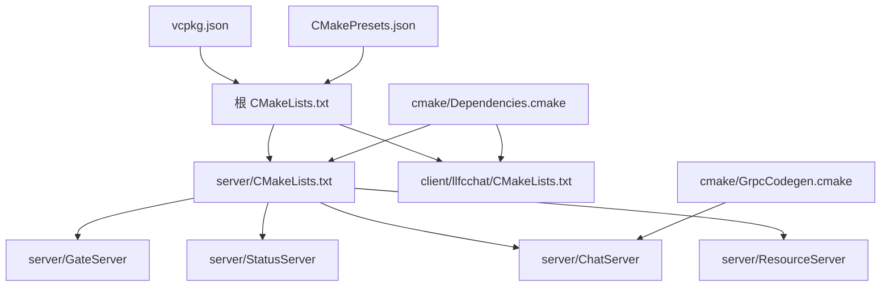
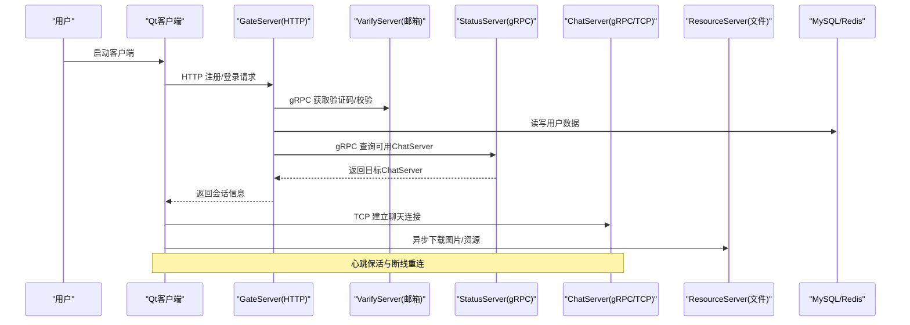
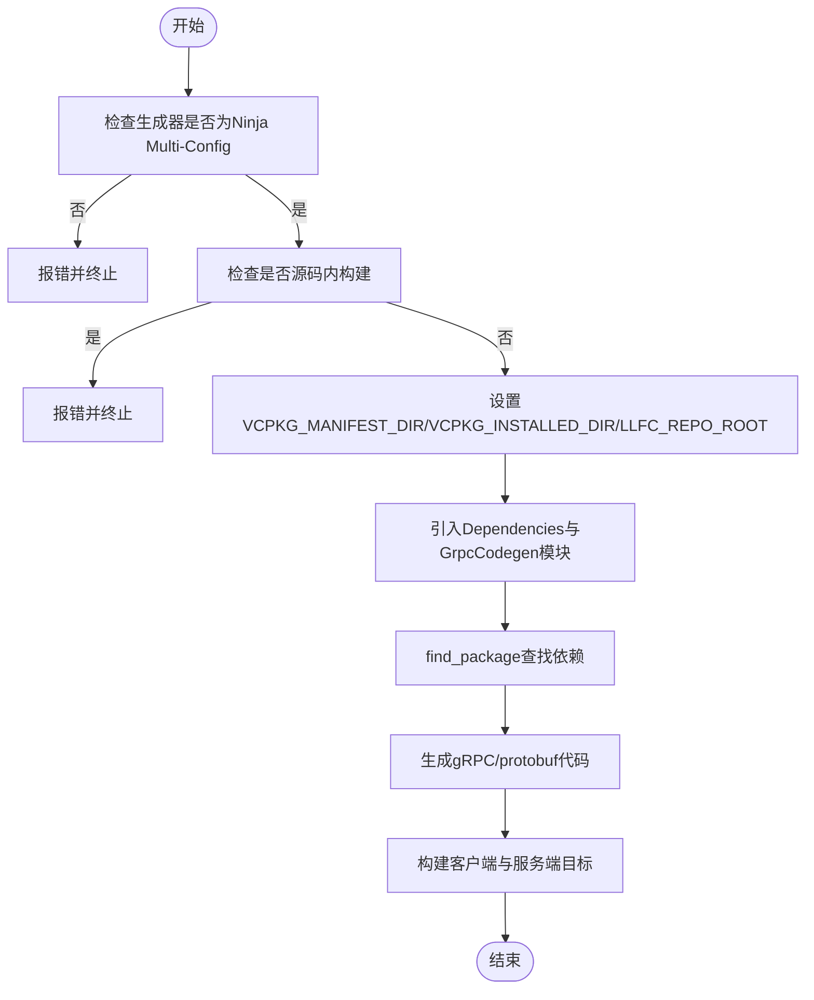
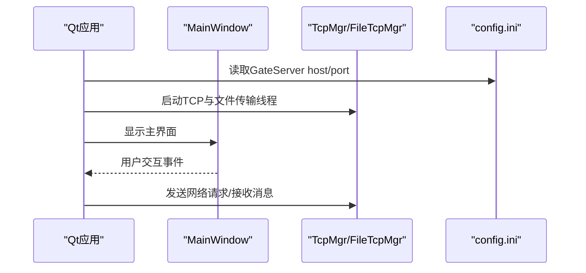
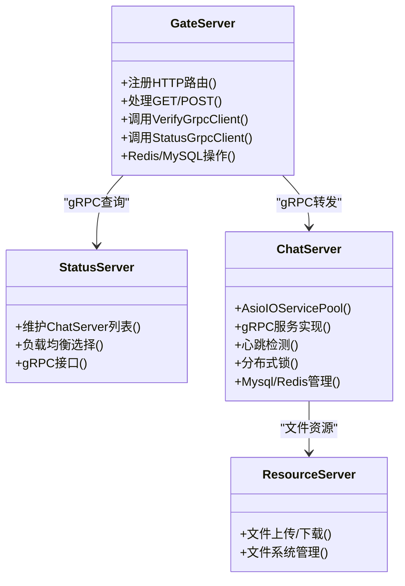
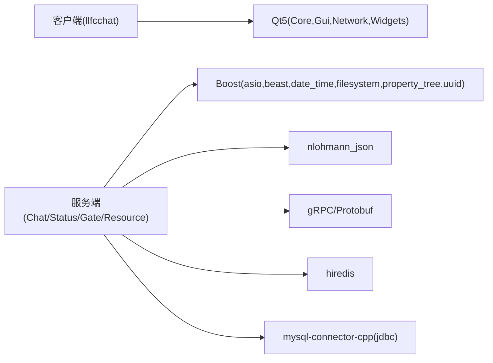

# 开发指南

<cite>
**本文引用的文件**   
- [CMakeLists.txt](file://CMakeLists.txt)
- [vcpkg.json](file://vcpkg.json)
- [CMakePresets.json](file://CMakePresets.json)
- [cmake/Dependencies.cmake](file://cmake/Dependencies.cmake)
- [cmake/GrpcCodegen.cmake](file://cmake/GrpcCodegen.cmake)
- [client/llfcchat/CMakeLists.txt](file://client/llfcchat/CMakeLists.txt)
- [server/CMakeLists.txt](file://server/CMakeLists.txt)
- [server/ChatServer/CMakeLists.txt](file://server/ChatServer/CMakeLists.txt)
- [client/llfcchat/config/config.ini](file://client/llfcchat/config/config.ini)
- [client/llfcchat/src/main.cpp](file://client/llfcchat/src/main.cpp)
- [.gitignore](file://.gitignore)
- [AGENTS.md](file://AGENTS.md)
- [README.md](file://README.md)
</cite>

## 目录
1. [简介](#简介)
2. [项目结构](#项目结构)
3. [核心组件](#核心组件)
4. [架构总览](#架构总览)
5. [详细组件分析](#详细组件分析)
6. [依赖关系分析](#依赖关系分析)
7. [性能与构建优化](#性能与构建优化)
8. [故障排查指南](#故障排查指南)
9. [结论](#结论)
10. [附录：工作流、规范与最佳实践](#附录工作流规范与最佳实践)

## 简介
本指南面向LLFCChat项目的开发者，覆盖开发环境配置、CMake构建系统与vcpkg包管理、IDE设置、代码格式化与静态分析、Git工作流与分支策略、测试方法（单元/集成/性能）、跨平台与交叉编译、持续集成等。文档以仓库现有构建脚本与配置文件为依据，确保可操作性与一致性。

## 项目结构
- 根级CMake入口统一要求使用Ninja Multi-Config生成器，强制禁止源码内构建，并集中设置vcpkg清单与安装目录。
- 客户端为Qt5应用，服务端由多个微服务组成（GateServer、StatusServer、ChatServer、ResourceServer），通过gRPC与HTTP交互，并使用Boost.Asio/Beast、MySQL、Redis等组件。
- Proto定义位于proto目录，由自定义CMake模块生成C++ gRPC/protobuf代码。
- vcpkg清单集中声明第三方库，包含Boost系列、nlohmann-json、grpc、protobuf、hiredis、mysql-connector-cpp、Qt5基础与图像格式插件。

**图表来源** 
- [CMakeLists.txt:1-34](file://CMakeLists.txt#L1-L34)
- [server/CMakeLists.txt:1-38](file://server/CMakeLists.txt#L1-L38)
- [client/llfcchat/CMakeLists.txt:1-222](file://client/llfcchat/CMakeLists.txt#L1-L222)
- [cmake/Dependencies.cmake:1-82](file://cmake/Dependencies.cmake#L1-L82)
- [cmake/GrpcCodegen.cmake:1-72](file://cmake/GrpcCodegen.cmake#L1-L72)
- [vcpkg.json:1-32](file://vcpkg.json#L1-L32)
- [CMakePresets.json:1-36](file://CMakePresets.json#L1-L36)

**章节来源**
- [CMakeLists.txt:1-34](file://CMakeLists.txt#L1-L34)
- [server/CMakeLists.txt:1-38](file://server/CMakeLists.txt#L1-L38)
- [client/llfcchat/CMakeLists.txt:1-222](file://client/llfcchat/CMakeLists.txt#L1-L222)
- [vcpkg.json:1-32](file://vcpkg.json#L1-L32)
- [CMakePresets.json:1-36](file://CMakePresets.json#L1-L36)

## 核心组件
- 构建系统
  - 根CMakeLists强制Ninja Multi-Config与独立构建目录，设置C++标准与模块路径。
  - cmake/Dependencies.cmake提供统一的依赖查找与MSVC默认选项封装，以及运行时输出目录统一规则。
  - cmake/GrpcCodegen.cmake封装protoc与gRPC插件调用，自动生成.pb/.grpc.pb源文件并链接对应库。
- 包管理
  - vcpkg.json集中声明依赖，triplet固定为x64-windows-static-md，已安装包目录指向项目内vcpkg_installed。
- 预设与工具链
  - CMakePresets.json定义Windows Ninja多配置预设，指定toolchainFile与缓存变量，便于一键配置与构建。
- 客户端
  - Qt5应用，启用AUTOMOC/AUTOUIC/AUTORCC，静态导入平台、图像格式与样式插件，构建后自动拷贝配置文件与静态资源。
- 服务端
  - GateServer作为HTTP网关；StatusServer负责状态与分配；ChatServer处理聊天业务；ResourceServer处理文件资源。各服务均遵循相同的依赖解析与输出目录约定。

**章节来源**
- [cmake/Dependencies.cmake:1-82](file://cmake/Dependencies.cmake#L1-L82)
- [cmake/GrpcCodegen.cmake:1-72](file://cmake/GrpcCodegen.cmake#L1-L72)
- [vcpkg.json:1-32](file://vcpkg.json#L1-L32)
- [CMakePresets.json:1-36](file://CMakePresets.json#L1-L36)
- [client/llfcchat/CMakeLists.txt:167-222](file://client/llfcchat/CMakeLists.txt#L167-L222)
- [server/ChatServer/CMakeLists.txt:1-111](file://server/ChatServer/CMakeLists.txt#L1-L111)

## 架构总览
整体采用微服务+gRPC+HTTP的混合架构：
- 客户端通过HTTP访问GateServer进行注册、登录、验证码等；随后建立TCP长连接至ChatServer进行消息通信；图片等资源通过ResourceServer异步下载。
- StatusServer维护ChatServer实例列表与负载信息，供GateServer在登录时选择目标ChatServer。
- Redis用于验证码缓存与分布式锁；MySQL用于用户与聊天数据持久化。

**图表来源** 
- [server/GateServer/src/LogicSystem.cpp:1-35](file://server/GateServer/src/LogicSystem.cpp#L1-L35)
- [server/ChatServer/CMakeLists.txt:1-111](file://server/ChatServer/CMakeLists.txt#L1-L111)
- [client/llfcchat/src/main.cpp:1-44](file://client/llfcchat/src/main.cpp#L1-L44)

## 详细组件分析

### CMake与vcpkg构建系统
- 根CMakeLists
  - 强制Ninja Multi-Config与独立构建目录，设置vcpkg清单与安装目录，引入cmake模块，定义C++17标准。
- Dependencies.cmake
  - 提供服务器与客户端依赖查找函数，封装MSVC默认编译选项，统一运行时输出目录到out/run/<Config>/<subdir>。
- GrpcCodegen.cmake
  - 封装protoc与gRPC插件调用，生成.pb与.grpc.pb源，创建静态库目标并链接protobuf与gRPC++。
- CMakePresets.json
  - 定义windows-ninja预设，指定generator、binaryDir、toolchainFile与缓存变量，提供Debug/Release构建预设。
- vcpkg.json
  - 声明所有依赖，包括Boost、nlohmann-json、grpc、protobuf、hiredis、mysql-connector-cpp、Qt5基础与imageformats。

**图表来源** 
- [CMakeLists.txt:1-34](file://CMakeLists.txt#L1-L34)
- [cmake/Dependencies.cmake:1-82](file://cmake/Dependencies.cmake#L1-L82)
- [cmake/GrpcCodegen.cmake:1-72](file://cmake/GrpcCodegen.cmake#L1-L72)
- [CMakePresets.json:1-36](file://CMakePresets.json#L1-L36)
- [vcpkg.json:1-32](file://vcpkg.json#L1-L32)

**章节来源**
- [CMakeLists.txt:1-34](file://CMakeLists.txt#L1-L34)
- [cmake/Dependencies.cmake:1-82](file://cmake/Dependencies.cmake#L1-L82)
- [cmake/GrpcCodegen.cmake:1-72](file://cmake/GrpcCodegen.cmake#L1-L72)
- [CMakePresets.json:1-36](file://CMakePresets.json#L1-L36)
- [vcpkg.json:1-32](file://vcpkg.json#L1-L32)

### 客户端Qt应用
- 入口main.cpp
  - 加载QSS样式、读取config.ini中的GateServer地址与端口，初始化Tcp线程与文件传输线程，显示主窗口。
- CMakeLists
  - 启用AUTOMOC/AUTOUIC/AUTORCC，链接Qt5::Core/Gui/Network/Widgets/WinMain，静态导入平台、图像格式与样式插件，构建后复制配置文件与静态资源。

**图表来源** 
- [client/llfcchat/src/main.cpp:1-44](file://client/llfcchat/src/main.cpp#L1-L44)
- [client/llfcchat/CMakeLists.txt:167-222](file://client/llfcchat/CMakeLists.txt#L167-L222)
- [client/llfcchat/config/config.ini:1-4](file://client/llfcchat/config/config.ini#L1-L4)

**章节来源**
- [client/llfcchat/src/main.cpp:1-44](file://client/llfcchat/src/main.cpp#L1-L44)
- [client/llfcchat/CMakeLists.txt:167-222](file://client/llfcchat/CMakeLists.txt#L167-L222)
- [client/llfcchat/config/config.ini:1-4](file://client/llfcchat/config/config.ini#L1-L4)

### 服务端微服务
- GateServer
  - HTTP路由注册与分发，调用VerifyGrpcClient与StatusGrpcClient，结合Redis与MySQL完成认证与用户数据操作。
- ChatServer
  - 基于AsioIOServicePool实现高并发TCP/gRPC服务，使用MysqlDao/MysqlMgr、RedisMgr、DistLock等组件，支持心跳检测与分布式踢人逻辑。
- StatusServer
  - 维护ChatServer实例列表与负载统计，提供gRPC接口供GateServer查询。
- ResourceServer
  - 提供文件上传/下载能力，配合客户端异步拉取聊天资源。

**图表来源** 
- [server/GateServer/src/LogicSystem.cpp:1-35](file://server/GateServer/src/LogicSystem.cpp#L1-L35)
- [server/ChatServer/CMakeLists.txt:1-111](file://server/ChatServer/CMakeLists.txt#L1-L111)

**章节来源**
- [server/GateServer/src/LogicSystem.cpp:1-35](file://server/GateServer/src/LogicSystem.cpp#L1-L35)
- [server/ChatServer/CMakeLists.txt:1-111](file://server/ChatServer/CMakeLists.txt#L1-L111)

## 依赖关系分析
- 客户端依赖
  - Qt5 Core/Gui/Network/Widgets，静态导入平台、图像格式与样式插件。
- 服务端依赖
  - Boost.Asio/Beast、nlohmann-json、gRPC、Protobuf、hiredis、mysql-connector-cpp（JDBC特性）。
- 构建期依赖
  - protoc与gRPC插件用于代码生成，CMake模块统一管理。

**图表来源** 
- [client/llfcchat/CMakeLists.txt:185-207](file://client/llfcchat/CMakeLists.txt#L185-L207)
- [cmake/Dependencies.cmake:6-24](file://cmake/Dependencies.cmake#L6-L24)
- [vcpkg.json:6-31](file://vcpkg.json#L6-L31)

**章节来源**
- [client/llfcchat/CMakeLists.txt:185-207](file://client/llfcchat/CMakeLists.txt#L185-L207)
- [cmake/Dependencies.cmake:6-24](file://cmake/Dependencies.cmake#L6-L24)
- [vcpkg.json:6-31](file://vcpkg.json#L6-L31)

## 性能与构建优化
- 构建并行
  - 使用Ninja Multi-Config提升增量构建速度，合理划分子模块避免全量重建。
- 依赖缓存
  - vcpkg已安装包目录固定于项目内，减少重复下载与编译时间。
- 输出目录统一
  - 通过llfc_set_runtime_outdir将可执行文件输出到out/run/<Config>/<subdir>，便于部署与调试。
- 插件静态导入
  - 客户端静态导入必要的Qt插件，避免运行期动态加载失败。

[本节为通用指导，不直接分析具体文件]

## 故障排查指南
- 生成器错误
  - 若未使用Ninja Multi-Config，CMake会报错。请根据CMakePresets或命令行指定正确生成器。
- 源码内构建错误
  - 必须在独立构建目录中配置与构建，否则会触发强制检查错误。
- vcpkg依赖缺失
  - 确认vcpkg.json中依赖与triplet一致，且VCPKG_INSTALLED_DIR指向正确的已安装包目录。
- Qt插件问题
  - 确保静态导入platforms、imageformats、styles插件，否则可能出现样式或图片无法加载。
- 配置文件路径
  - 客户端从应用程序目录读取config.ini，构建后会自动复制配置文件到输出目录。

**章节来源**
- [CMakeLists.txt:4-16](file://CMakeLists.txt#L4-L16)
- [client/llfcchat/CMakeLists.txt:212-221](file://client/llfcchat/CMakeLists.txt#L212-L221)
- [client/llfcchat/src/main.cpp:24-34](file://client/llfcchat/src/main.cpp#L24-L34)

## 结论
LLFCChat项目通过CMake与vcpkg实现了高度一致的构建与依赖管理，客户端与服务端职责清晰，微服务间通过gRPC与HTTP协作。遵循本指南的配置与流程，可快速搭建开发环境、高效构建与调试，并为后续跨平台与CI打下坚实基础。

[本节为总结性内容，不直接分析具体文件]

## 附录：工作流、规范与最佳实践

### 开发环境配置
- 工具链
  - Visual Studio BuildTools、CMake（VS内置）、Ninja（VS内置）、vcpkg。
- 环境变量
  - 建议设置VCPKG_ROOT指向vcpkg可执行文件所在目录，以便CMakePresets引用toolchainFile。
- 首次构建
  - 使用cmake --preset windows-ninja配置，再按目标构建。

**章节来源**
- [AGENTS.md:1-58](file://AGENTS.md#L1-L58)
- [CMakePresets.json:1-36](file://CMakePresets.json#L1-L36)

### IDE设置
- Visual Studio
  - 使用“打开文件夹”方式导入项目，CMake预设选择windows-ninja，生成器为Ninja Multi-Config。
- CLion
  - 选择CMake预设，确保toolchainFile指向vcpkg.cmake，并设置C++标准为17（服务端）与11（客户端）。
- VS Code
  - 安装CMake Tools扩展，选择预设与配置，启用C++ IntelliSense与任务构建。

[本节为通用指导，不直接分析具体文件]

### 代码规范与格式化
- 编码风格
  - 统一缩进、命名与注释风格，建议使用ClangFormat或EditorConfig保持一致。
- 头文件组织
  - 客户端与服务器分别维护include目录，避免循环依赖。
- 日志与调试
  - 服务端使用结构化日志，客户端使用qDebug输出关键路径。

[本节为通用指导，不直接分析具体文件]

### 静态分析与安全扫描
- 静态分析
  - 使用Clang Static Analyzer或Visual Studio静态分析，针对C++17特性开启相应规则。
- 安全扫描
  - 对第三方依赖进行漏洞扫描，关注gRPC、Boost、Qt版本更新。

[本节为通用指导，不直接分析具体文件]

### Git工作流与分支策略
- 分支模型
  - main为主分支，feature/*用于功能开发，hotfix/*用于紧急修复，release/*用于发布准备。
- 提交规范
  - 使用语义化提交信息，如feat、fix、docs、refactor等前缀。
- 代码审查
  - 通过Pull Request进行审查，至少一名Reviewer批准后方可合并。

[本节为通用指导，不直接分析具体文件]

### 测试方法与最佳实践
- 单元测试
  - 使用Google Test或Catch2对核心算法与工具类进行测试，覆盖边界条件与异常路径。
- 集成测试
  - 模拟客户端与服务端交互，验证HTTP/gRPC接口与数据库操作。
- 性能测试
  - 使用基准测试框架评估网络吞吐与内存占用，关注心跳与分布式锁的性能影响。

[本节为通用指导，不直接分析具体文件]

### 跨平台与交叉编译
- 当前平台
  - Windows x64，triplet为x64-windows-static-md，依赖已预编译并随仓库提交。
- 跨平台建议
  - 抽象平台相关代码，使用CMake条件编译；Linux下替换Qt与依赖为对应版本。
- 交叉编译
  - 配置vcpkg triplet与toolchainFile，确保依赖库与目标平台一致。

[本节为通用指导，不直接分析具体文件]

### 持续集成配置
- CI流水线
  - 配置步骤：安装依赖、vcpkg install、CMake配置、构建与测试、打包产物。
- 缓存策略
  - 缓存vcpkg_installed与CMake缓存目录，加速构建。
- 报告与通知
  - 生成测试报告与构建日志，失败时通知团队。

[本节为通用指导，不直接分析具体文件]

### 常见问题与解决方案
- 构建失败：检查生成器与C++标准，确认vcpkg依赖已安装。
- 运行时报错：确认配置文件路径与权限，检查Qt插件是否完整。
- 网络问题：验证GateServer与后端服务可达性，检查防火墙与代理设置。

**章节来源**
- [.gitignore:1-78](file://.gitignore#L1-L78)
- [README.md:1-112](file://README.md#L1-L112)