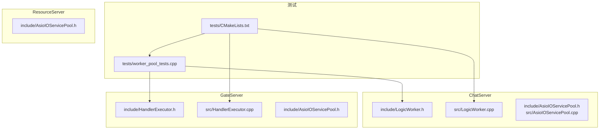
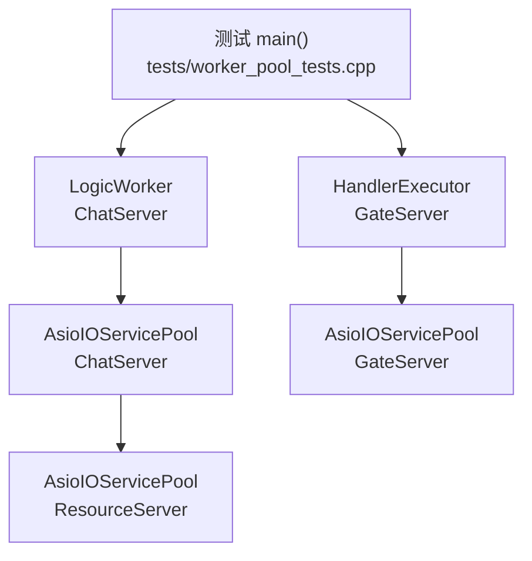
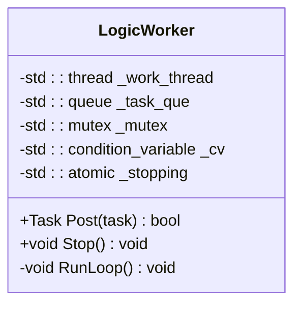
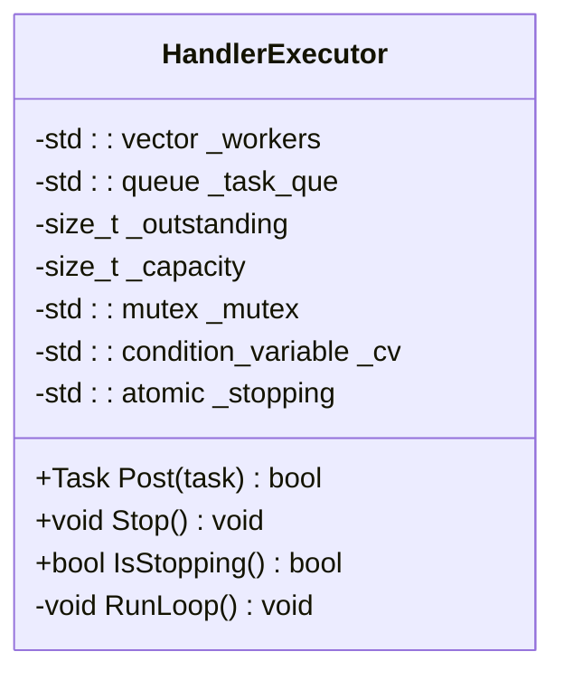
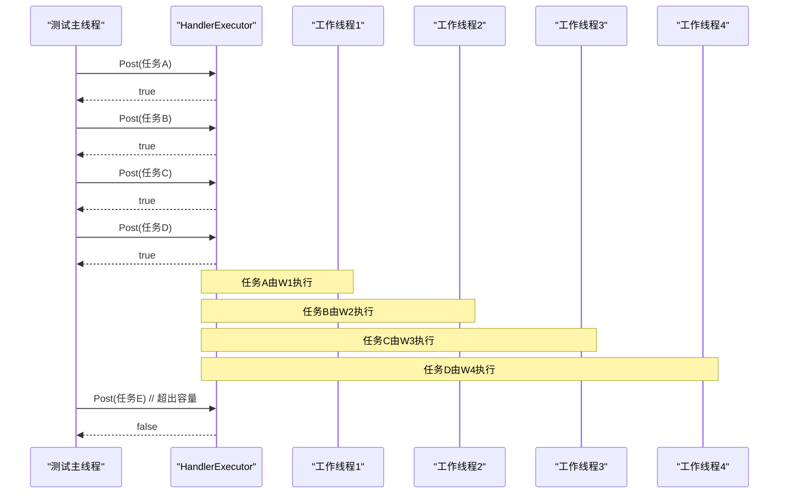
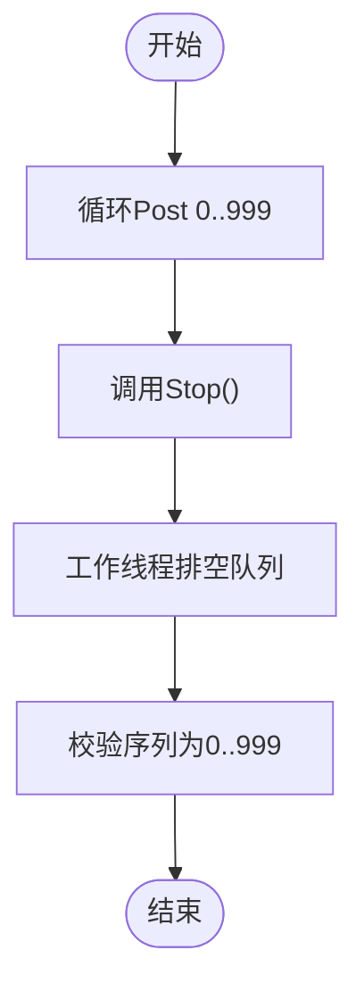
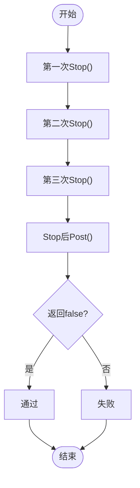
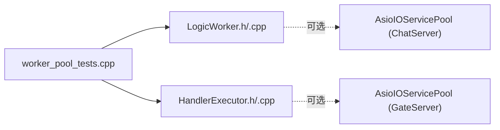

# 工作线程并发测试

<cite>
**本文引用的文件**   
- [tests/worker_pool_tests.cpp](file://tests/worker_pool_tests.cpp)
- [tests/CMakeLists.txt](file://tests/CMakeLists.txt)
- [server/ChatServer/include/LogicWorker.h](file://server/ChatServer/include/LogicWorker.h)
- [server/ChatServer/src/LogicWorker.cpp](file://server/ChatServer/src/LogicWorker.cpp)
- [server/GateServer/include/HandlerExecutor.h](file://server/GateServer/include/HandlerExecutor.h)
- [server/GateServer/src/HandlerExecutor.cpp](file://server/GateServer/src/HandlerExecutor.cpp)
- [server/ChatServer/include/AsioIOServicePool.h](file://server/ChatServer/include/AsioIOServicePool.h)
- [server/ChatServer/src/AsioIOServicePool.cpp](file://server/ChatServer/src/AsioIOServicePool.cpp)
- [server/GateServer/include/AsioServicePool.h](file://server/GateServer/include/AsioIOServicePool.h)
- [server/ResourceServer/include/AsioServicePool.h](file://server/ResourceServer/include/AsioIOServicePool.h)
- [CMakeLists.txt](file://CMakeLists.txt)
</cite>

## 目录
1. [简介](#简介)
2. [项目结构](#项目结构)
3. [核心组件](#核心组件)
4. [架构总览](#架构总览)
5. [详细组件分析](#详细组件分析)
6. [依赖关系分析](#依赖关系分析)
7. [性能考量](#性能考量)
8. [故障排查指南](#故障排查指南)
9. [结论](#结论)
10. [附录](#附录)

## 简介
本文件围绕“工作线程并发测试”展开，聚焦于项目中两类关键的工作线程执行器：
- ChatServer 的 LogicWorker：单线程 FIFO 任务执行器，用于将业务逻辑从 IO 线程剥离并按 uid 分片固定到不同 worker，保证同一用户任务的严格顺序。
- GateServer 的 HandlerExecutor：有界多工作线程池，用于将阻塞型 HTTP handler 从连接 io_context 剥离，提供容量反压与确定性停机语义。

测试用例通过纯 C++ 标准库实现同步原语（Barrier、ManualResetEvent、ArrivalCounter），不依赖第三方测试框架，确保在任意构建环境下可运行，且能检测死锁与并发不变量。

## 项目结构
与“工作线程并发测试”直接相关的代码分布在 tests 目录与两个服务器模块中：
- tests/worker_pool_tests.cpp：并发测试主程序，包含四组用例，覆盖并行度、容量拒绝、Stop 排空、FIFO 顺序、跨实例并发、幂等停止等。
- tests/CMakeLists.txt：定义 worker_pool_tests 目标，直接编译生产代码 LogicWorker.cpp 与 HandlerExecutor.cpp，无需链接任何服务器目标。
- server/ChatServer：LogicWorker 头/源，以及 AsioIOServicePool（IO 服务池）。
- server/GateServer：HandlerExecutor 头/源，以及 AsioIOServicePool（IO 服务池）。
- server/ResourceServer：AsioIOServicePool（IO 服务池）。

图表来源
- [tests/worker_pool_tests.cpp:1-399](file://tests/worker_pool_tests.cpp#L1-L399)
- [tests/CMakeLists.txt:19-33](file://tests/CMakeLists.txt#L19-L33)
- [server/ChatServer/include/LogicWorker.h:1-62](file://server/ChatServer/include/LogicWorker.h#L1-L62)
- [server/ChatServer/src/LogicWorker.cpp:1-64](file://server/ChatServer/src/LogicWorker.cpp#L1-L64)
- [server/GateServer/include/HandlerExecutor.h:1-80](file://server/GateServer/include/HandlerExecutor.h#L1-L80)
- [server/GateServer/src/HandlerExecutor.cpp:1-97](file://server/GateServer/src/HandlerExecutor.cpp#L1-L97)
- [server/ChatServer/include/AsioIOServicePool.h:1-60](file://server/ChatServer/include/AsioIOServicePool.h#L1-L60)
- [server/ChatServer/src/AsioIOServicePool.cpp:1-43](file://server/ChatServer/src/AsioIOServicePool.cpp#L1-L43)
- [server/GateServer/include/AsioIOServicePool.h:1-28](file://server/GateServer/include/AsioIOServicePool.h#L1-L28)
- [server/ResourceServer/include/AsioIOServicePool.h:1-28](file://server/ResourceServer/include/AsioIOServicePool.h#L1-L28)

章节来源
- [tests/worker_pool_tests.cpp:1-399](file://tests/worker_pool_tests.cpp#L1-L399)
- [tests/CMakeLists.txt:19-33](file://tests/CMakeLists.txt#L19-L33)
- [CMakeLists.txt:32-43](file://CMakeLists.txt#L32-L43)

## 核心组件
- LogicWorker（ChatServer）
  - 单线程 FIFO 队列，Post 入队，RunLoop 取任务执行；Stop 幂等，先置 stopping 再唤醒并 join。
  - 适合按 uid 分片固定到独立 worker，保证同用户任务顺序性。
- HandlerExecutor（GateServer）
  - 多工作线程 + 有界队列，Post 时统计 outstanding（运行中+排队），达到 capacity 即拒绝，形成反压。
  - Stop 幂等，排空后回收全部线程；Runloop 内异常被吞掉，避免击垮工作线程。
- AsioIOServicePool（各服务）
  - 管理多个 boost::asio::io_context 与其对应线程，轮询分配新连接，避免单线程 IO 瓶颈。

章节来源
- [server/ChatServer/include/LogicWorker.h:10-62](file://server/ChatServer/include/LogicWorker.h#L10-L62)
- [server/ChatServer/src/LogicWorker.cpp:15-64](file://server/ChatServer/src/LogicWorker.cpp#L15-L64)
- [server/GateServer/include/HandlerExecutor.h:12-80](file://server/GateServer/include/HandlerExecutor.h#L12-L80)
- [server/GateServer/src/HandlerExecutor.cpp:22-97](file://server/GateServer/src/HandlerExecutor.cpp#L22-L97)
- [server/ChatServer/include/AsioIOServicePool.h:8-60](file://server/ChatServer/include/AsioIOServicePool.h#L8-L60)
- [server/ChatServer/src/AsioIOServicePool.cpp:1-43](file://server/ChatServer/src/AsioIOServicePool.cpp#L1-L43)

## 架构总览
下图展示测试如何直接编译并验证两类工作线程执行器，以及与 IO 服务池的关系。

图表来源
- [tests/worker_pool_tests.cpp:26-27](file://tests/worker_pool_tests.cpp#L26-L27)
- [server/ChatServer/include/LogicWorker.h:10-62](file://server/ChatServer/include/LogicWorker.h#L10-L62)
- [server/GateServer/include/HandlerExecutor.h:12-80](file://server/GateServer/include/HandlerExecutor.h#L12-L80)
- [server/ChatServer/include/AsioIOServicePool.h:8-60](file://server/ChatServer/include/AsioIOServicePool.h#L8-L60)
- [server/GateServer/include/AsioIOServicePool.h:1-28](file://server/GateServer/include/AsioIOServicePool.h#L1-L28)
- [server/ResourceServer/include/AsioIOServicePool.h:1-28](file://server/ResourceServer/include/AsioIOServicePool.h#L1-L28)

## 详细组件分析

### LogicWorker 类图

图表来源
- [server/ChatServer/include/LogicWorker.h:20-62](file://server/ChatServer/include/LogicWorker.h#L20-L62)

章节来源
- [server/ChatServer/include/LogicWorker.h:10-62](file://server/ChatServer/include/LogicWorker.h#L10-L62)
- [server/ChatServer/src/LogicWorker.cpp:15-64](file://server/ChatServer/src/LogicWorker.cpp#L15-L64)

### HandlerExecutor 类图

图表来源
- [server/GateServer/include/HandlerExecutor.h:26-80](file://server/GateServer/include/HandlerExecutor.h#L26-L80)

章节来源
- [server/GateServer/include/HandlerExecutor.h:12-80](file://server/GateServer/include/HandlerExecutor.h#L12-L80)
- [server/GateServer/src/HandlerExecutor.cpp:22-97](file://server/GateServer/src/HandlerExecutor.cpp#L22-L97)

### 测试序列图：HandlerExecutor 并发与容量

图表来源
- [tests/worker_pool_tests.cpp:184-208](file://tests/worker_pool_tests.cpp#L184-L208)
- [server/GateServer/src/HandlerExecutor.cpp:22-37](file://server/GateServer/src/HandlerExecutor.cpp#L22-L37)

章节来源
- [tests/worker_pool_tests.cpp:184-208](file://tests/worker_pool_tests.cpp#L184-L208)
- [server/GateServer/src/HandlerExecutor.cpp:22-37](file://server/GateServer/src/HandlerExecutor.cpp#L22-L37)

### 测试流程：LogicWorker FIFO 顺序

图表来源
- [tests/worker_pool_tests.cpp:283-317](file://tests/worker_pool_tests.cpp#L283-L317)
- [server/ChatServer/src/LogicWorker.cpp:43-64](file://server/ChatServer/src/LogicWorker.cpp#L43-L64)

章节来源
- [tests/worker_pool_tests.cpp:283-317](file://tests/worker_pool_tests.cpp#L283-L317)
- [server/ChatServer/src/LogicWorker.cpp:43-64](file://server/ChatServer/src/LogicWorker.cpp#L43-L64)

### 测试流程：Stop 幂等与拒绝 Post

图表来源
- [tests/worker_pool_tests.cpp:351-376](file://tests/worker_pool_tests.cpp#L351-L376)
- [server/ChatServer/src/LogicWorker.cpp:27-41](file://server/ChatServer/src/LogicWorker.cpp#L27-L41)
- [server/GateServer/src/HandlerExecutor.cpp:39-55](file://server/GateServer/src/HandlerExecutor.cpp#L39-L55)

章节来源
- [tests/worker_pool_tests.cpp:351-376](file://tests/worker_pool_tests.cpp#L351-L376)
- [server/ChatServer/src/LogicWorker.cpp:27-41](file://server/ChatServer/src/LogicWorker.cpp#L27-L41)
- [server/GateServer/src/HandlerExecutor.cpp:39-55](file://server/GateServer/src/HandlerExecutor.cpp#L39-L55)

### AsioIOServicePool 角色
- 作用：维护多个 io_context 及其运行线程，以轮询方式为新连接分配事件循环，避免单点瓶颈。
- 生命周期：构造时启动线程；Stop() 停止所有 context 并释放 work_guard，随后 join 所有线程。

章节来源
- [server/ChatServer/include/AsioIOServicePool.h:8-60](file://server/ChatServer/include/AsioIOServicePool.h#L8-L60)
- [server/ChatServer/src/AsioIOServicePool.cpp:1-43](file://server/ChatServer/src/AsioIOServicePool.cpp#L1-L43)
- [server/GateServer/include/AsioIOServicePool.h:1-28](file://server/GateServer/include/AsioIOServicePool.h#L1-L28)
- [server/ResourceServer/include/AsioIOServicePool.h:1-28](file://server/ResourceServer/include/AsioIOServicePool.h#L1-L28)

## 依赖关系分析
- 测试对生产代码的直接依赖：
  - worker_pool_tests.cpp 直接 include LogicWorker.h 与 HandlerExecutor.h。
  - CMakeLists.txt 将 LogicWorker.cpp 与 HandlerExecutor.cpp 作为源码加入测试目标，避免链接服务器二进制。
- 组件耦合：
  - LogicWorker 与 HandlerExecutor 均使用互斥量、条件变量与原子标志，接口一致（Post/Stop），便于统一行为验证。
  - AsioIOServicePool 与各服务解耦，仅暴露 GetIOService()/Stop()。

图表来源
- [tests/CMakeLists.txt:19-33](file://tests/CMakeLists.txt#L19-L33)
- [tests/worker_pool_tests.cpp:26-27](file://tests/worker_pool_tests.cpp#L26-L27)

章节来源
- [tests/CMakeLists.txt:19-33](file://tests/CMakeLists.txt#L19-L33)
- [tests/worker_pool_tests.cpp:26-27](file://tests/worker_pool_tests.cpp#L26-L27)

## 性能考量
- LogicWorker 单线程串行执行，适合强顺序场景（如按 uid 分片），但吞吐受限于单核；可通过多实例分片提升整体吞吐。
- HandlerExecutor 的多线程池与有界队列提供可控并发与反压，capacity 配置需结合后端资源（DB/Redis/gRPC）调优。
- AsioIOServicePool 的线程数建议与 CPU 核数匹配，避免过多上下文切换。

[本节为通用指导，不直接分析具体文件]

## 故障排查指南
- 死锁检测：测试使用条件变量的超时等待，若到达超时阈值说明并发不变量被破坏（例如单线程执行器无法支撑 N 路并发）。
- Stop 未生效：检查 stopping 标志是否被正确设置，以及是否在所有工作线程上通知了条件变量。
- 容量拒绝异常：确认 outstanding 计数在任务完成时被递减，避免虚假满负载。
- 任务丢失或重复：检查 Post 是否在锁外执行任务，避免长任务阻塞队列；确认 Stop 后不再入队。

章节来源
- [tests/worker_pool_tests.cpp:45-48](file://tests/worker_pool_tests.cpp#L45-L48)
- [server/ChatServer/src/LogicWorker.cpp:27-41](file://server/ChatServer/src/LogicWorker.cpp#L27-L41)
- [server/GateServer/src/HandlerExecutor.cpp:39-55](file://server/GateServer/src/HandlerExecutor.cpp#L39-L55)

## 结论
该测试套件以最小依赖验证了两类工作线程执行器的关键并发语义：
- LogicWorker 的单线程 FIFO 顺序性与幂等停机；
- HandlerExecutor 的多线程并发、容量反压与幂等停机；
并通过手写的同步原语实现对死锁与并发不变量的确定性检测。配合 AsioIOServicePool，系统可在 IO 与逻辑处理之间实现清晰分层与可扩展并发。

[本节为总结，不直接分析具体文件]

## 附录
- 构建与运行
  - 根 CMakeLists 启用 CTest，tests/CMakeLists 注册 worker_pool_tests。
  - 默认不启用集成测试，worker_pool_tests 始终可用。

章节来源
- [CMakeLists.txt:32-43](file://CMakeLists.txt#L32-L43)
- [tests/CMakeLists.txt:1-106](file://tests/CMakeLists.txt#L1-L106)