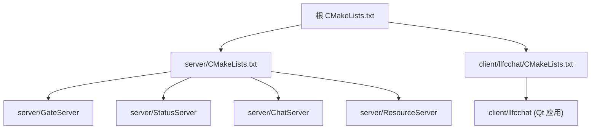
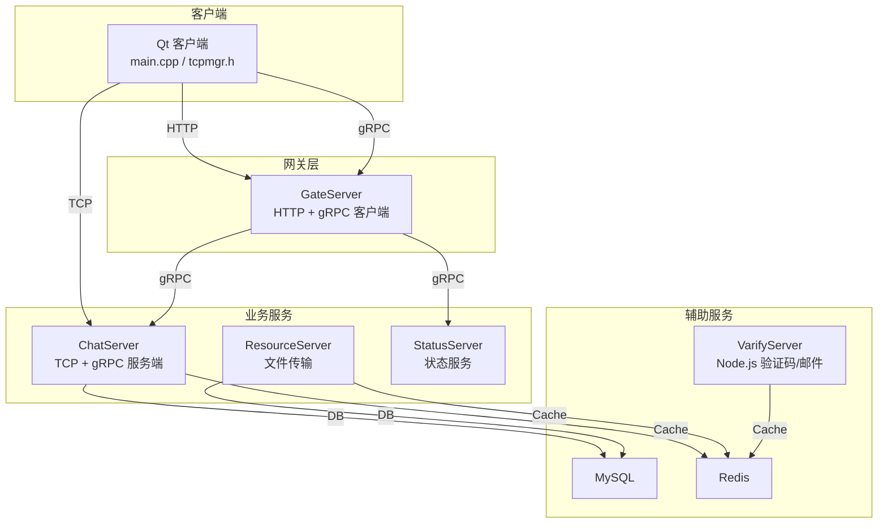
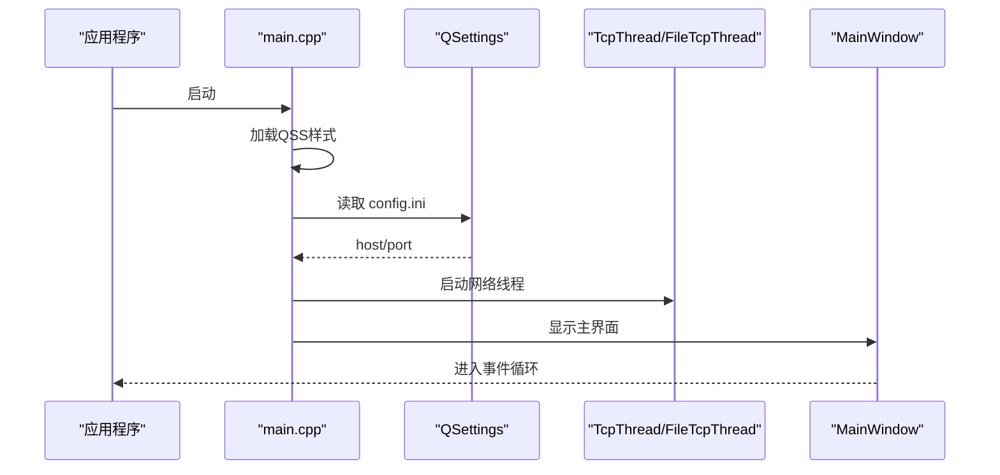
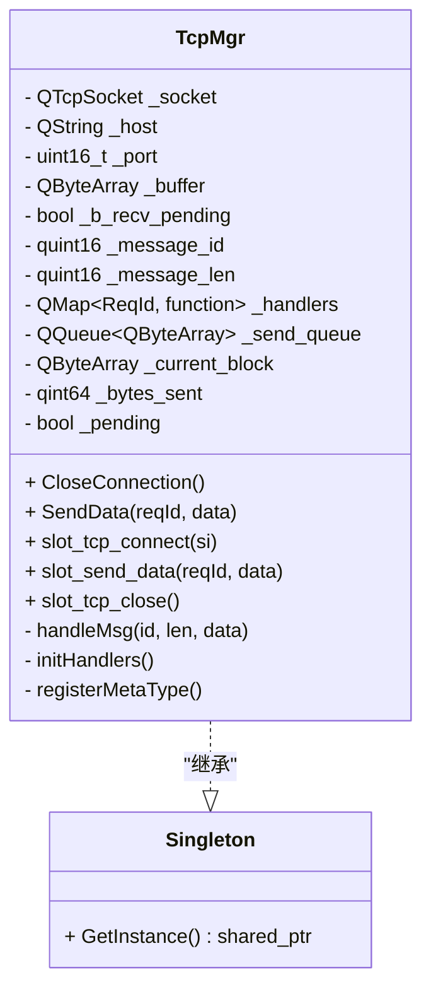
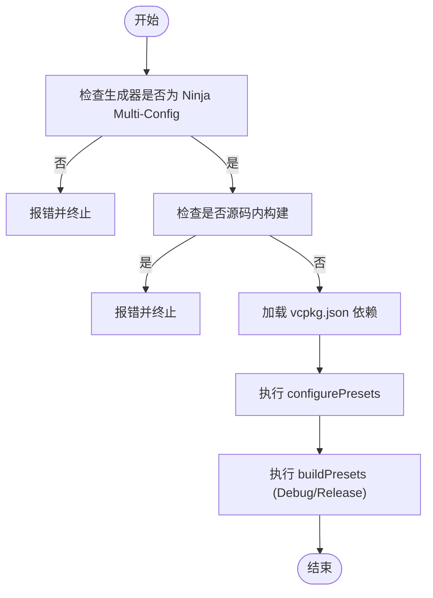

# 开发指南

<cite>
**本文引用的文件**   
- [README.md](file://README.md)
- [CMakeLists.txt](file://CMakeLists.txt)
- [CMakePresets.json](file://CMakePresets.json)
- [vcpkg.json](file://vcpkg.json)
- [.gitignore](file://.gitignore)
- [client/llfcchat/CMakeLists.txt](file://client/llfcchat/CMakeLists.txt)
- [server/CMakeLists.txt](file://server/CMakeLists.txt)
- [cmake/Dependencies.cmake](file://cmake/Dependencies.cmake)
- [client/llfcchat/src/main.cpp](file://client/llfcchat/src/main.cpp)
- [client/llfcchat/include/global.h](file://client/llfcchat/include/global.h)
- [client/llfcchat/include/tcpmgr.h](file://client/llfcchat/include/tcpmgr.h)
- [server/ChatServer/include/CServer.h](file://server/ChatServer/include/CServer.h)
- [server/ChatServer/include/Singleton.h](file://server/ChatServer/include/Singleton.h)
- [client/llfcchat/config/config.ini](file://client/llfcchat/config/config.ini)
</cite>

## 目录
1. [简介](#简介)
2. [项目结构](#项目结构)
3. [核心组件](#核心组件)
4. [架构总览](#架构总览)
5. [详细组件分析](#详细组件分析)
6. [依赖与构建系统](#依赖与构建系统)
7. [性能与稳定性](#性能与稳定性)
8. [调试与故障排查](#调试与故障排查)
9. [新功能开发指南](#新功能开发指南)
10. [团队协作与版本管理](#团队协作与版本管理)
11. [结论](#结论)
12. [附录：编码规范与最佳实践](#附录编码规范与最佳实践)

## 简介
本指南面向LLFCChat项目的开发者，覆盖C++编码规范、命名约定、代码风格、注释标准、文件组织与模块设计；详细说明开发环境搭建（IDE配置、编译器设置、依赖管理、调试配置）；阐述Git工作流与版本管理（分支策略、提交规范、代码审查、冲突解决）；提供调试技巧与故障排查（日志分析、性能分析、内存泄漏检测）；并给出新功能开发流程（模块设计、接口设计、测试用例编写、文档维护）以及重构与技术债务管理的团队最佳实践。

## 项目结构
项目采用多服务+Qt客户端的分布式架构，使用CMake作为统一构建系统，vcpkg进行第三方依赖管理，Ninja Multi-Config生成器驱动跨配置构建。根级CMakeLists负责聚合子工程，server下包含多个独立服务（GateServer、StatusServer、ChatServer、ResourceServer），client/llfcchat为Qt客户端应用。

图表来源 
- [CMakeLists.txt:1-34](file://CMakeLists.txt#L1-L34)
- [server/CMakeLists.txt:1-38](file://server/CMakeLists.txt#L1-L38)
- [client/llfcchat/CMakeLists.txt:1-222](file://client/llfcchat/CMakeLists.txt#L1-L222)

章节来源
- [CMakeLists.txt:1-34](file://CMakeLists.txt#L1-L34)
- [server/CMakeLists.txt:1-38](file://server/CMakeLists.txt#L1-L38)
- [client/llfcchat/CMakeLists.txt:1-222](file://client/llfcchat/CMakeLists.txt#L1-L222)

## 核心组件
- 客户端入口与初始化：main.cpp负责加载样式、读取配置、启动网络线程与主界面。
- 全局常量与协议定义：global.h集中定义消息ID、错误码、传输状态、消息结构体等。
- TCP管理器：tcpmgr.h封装连接、发送队列、粘包处理、事件分发与信号槽。
- 服务器会话与定时器：CServer.h实现基于Boost.Asio的TCP监听、会话管理与心跳定时器。
- 单例模式：Singleton.h提供线程安全的单例模板，被多处复用。

章节来源
- [client/llfcchat/src/main.cpp:1-44](file://client/llfcchat/src/main.cpp#L1-L44)
- [client/llfcchat/include/global.h:1-296](file://client/llfcchat/include/global.h#L1-L296)
- [client/llfcchat/include/tcpmgr.h:1-90](file://client/llfcchat/include/tcpmgr.h#L1-L90)
- [server/ChatServer/include/CServer.h:1-33](file://server/ChatServer/include/CServer.h#L1-L33)
- [server/ChatServer/include/Singleton.h:1-33](file://server/ChatServer/include/Singleton.h#L1-L33)

## 架构总览
整体架构由客户端与多个后端服务组成，通过HTTP、gRPC与TCP通信。客户端通过HTTP访问GateServer完成认证与资源获取，通过TCP与ChatServer进行实时聊天，通过ResourceServer进行文件上传下载，StatusServer提供状态服务，VarifyServer（Node.js）提供验证码与邮件验证。

图表来源 
- [client/llfcchat/src/main.cpp:1-44](file://client/llfcchat/src/main.cpp#L1-L44)
- [client/llfcchat/include/tcpmgr.h:1-90](file://client/llfcchat/include/tcpmgr.h#L1-L90)
- [server/ChatServer/include/CServer.h:1-33](file://server/ChatServer/include/CServer.h#L1-L33)
- [vcpkg.json:1-32](file://vcpkg.json#L1-L32)

## 详细组件分析

### 客户端入口与配置加载
- 启动流程：创建QApplication，加载QSS样式，读取config.ini中的GateServer地址前缀，启动TcpThread与FileTcpThread，显示MainWindow。
- 配置来源：config.ini中[GateServer]段host/port用于拼接gate_url_prefix。
- 关键路径：main.cpp中QSettings读取INI，随后初始化网络线程与UI。

图表来源 
- [client/llfcchat/src/main.cpp:1-44](file://client/llfcchat/src/main.cpp#L1-L44)
- [client/llfcchat/config/config.ini:1-4](file://client/llfcchat/config/config.ini#L1-L4)

章节来源
- [client/llfcchat/src/main.cpp:1-44](file://client/llfcchat/src/main.cpp#L1-L44)
- [client/llfcchat/config/config.ini:1-4](file://client/llfcchat/config/config.ini#L1-L4)

### 全局协议与数据结构
- 协议ID：ReqId枚举涵盖注册、登录、搜索、好友申请、认证、文本/图片消息、心跳、文件同步与下载等。
- 错误码：ErrorCodes定义成功与常见错误。
- 传输状态：TransferState描述下载/上传生命周期。
- 消息结构：MsgInfo包含类型、URL或文本、缩略图、唯一名、大小、序列号、MD5、进度、发送者/接收者等。
- 工具函数：generateUniqueFileName、calculateFileHash等。

章节来源
- [client/llfcchat/include/global.h:1-296](file://client/llfcchat/include/global.h#L1-L296)

### TCP管理器与粘包处理
- 职责：封装QTcpSocket连接、发送队列、当前块发送、已发送字节计数、接收缓冲与消息分派。
- 事件：slot_tcp_connect/slot_send_data/slot_tcp_close等信号槽；内部handleMsg按ReqId路由到处理器。
- 并发：结合QThread与QObject，保证UI线程安全。

图表来源 
- [client/llfcchat/include/tcpmgr.h:1-90](file://client/llfcchat/include/tcpmgr.h#L1-L90)
- [server/ChatServer/include/Singleton.h:1-33](file://server/ChatServer/include/Singleton.h#L1-L33)

章节来源
- [client/llfcchat/include/tcpmgr.h:1-90](file://client/llfcchat/include/tcpmgr.h#L1-L90)

### 服务器会话与定时器
- CServer：基于Boost.Asio的TCP监听器，维护会话映射、互斥锁、定时器，支持Accept、Timer回调、会话清理与查找。
- 典型用法：StartAccept启动异步接受；on_timer处理心跳/超时；GetSession根据uid获取会话。

章节来源
- [server/ChatServer/include/CServer.h:1-33](file://server/ChatServer/include/CServer.h#L1-L33)

## 依赖与构建系统
- 构建系统：CMake 3.25+，强制使用“Ninja Multi-Config”生成器，禁止源码内构建。
- 依赖管理：vcpkg manifest vcpkg.json声明Boost、jsoncpp、grpc、protobuf、hiredis、mysql-connector-cpp、Qt5等。
- 预设：CMakePresets.json提供windows-ninja配置与Debug/Release构建预设。
- 公共脚本：cmake/Dependencies.cmake封装find_package、MSVC默认选项、运行时输出目录等。

图表来源 
- [CMakeLists.txt:1-34](file://CMakeLists.txt#L1-L34)
- [CMakePresets.json:1-36](file://CMakePresets.json#L1-L36)
- [vcpkg.json:1-32](file://vcpkg.json#L1-L32)
- [cmake/Dependencies.cmake:1-82](file://cmake/Dependencies.cmake#L1-L82)

章节来源
- [CMakeLists.txt:1-34](file://CMakeLists.txt#L1-L34)
- [CMakePresets.json:1-36](file://CMakePresets.json#L1-L36)
- [vcpkg.json:1-32](file://vcpkg.json#L1-L32)
- [cmake/Dependencies.cmake:1-82](file://cmake/Dependencies.cmake#L1-L82)

## 性能与稳定性
- 网络I/O：客户端使用QTcpSocket与发送队列，避免阻塞UI；服务器端使用Asio异步模型，提升并发能力。
- 粘包处理：客户端维护_buffer与_message_len，确保完整帧解析。
- 资源管理：Singleton模板配合shared_ptr避免重复实例化与内存泄漏。
- 构建优化：MSVC启用多线程DLL运行时，减少依赖体积；静态插件导入减少运行时缺失。

章节来源
- [client/llfcchat/include/tcpmgr.h:1-90](file://client/llfcchat/include/tcpmgr.h#L1-L90)
- [server/ChatServer/include/CServer.h:1-33](file://server/ChatServer/include/CServer.h#L1-L33)
- [cmake/Dependencies.cmake:26-34](file://cmake/Dependencies.cmake#L26-L34)

## 调试与故障排查
- 常见问题定位
  - 连接失败：检查config.ini中GateServer host/port是否正确；确认防火墙与端口占用。
  - 粘包/丢包：检查缓冲区长度字段与发送队列顺序；核对消息头长度与数据体一致性。
  - 资源缺失：确认静态资源与配置文件在运行目录存在（CMake post-build拷贝）。
- 日志分析方法
  - 客户端qDebug输出便于快速定位；建议将关键路径日志分级输出。
  - 服务器端可结合Boost.Log或自定义日志模块，记录请求/响应与异常堆栈。
- 性能分析工具
  - Windows平台可使用Visual Studio Profiler、PerfView、xperf进行CPU/内存热点分析。
  - Qt应用可使用QElapsedTimer与QTimer统计耗时与延迟。
- 内存泄漏检测
  - Visual Studio诊断工具（内存快照、分配跟踪）；AddressSanitizer（编译期注入）。
  - 关注动态分配对象的生命周期与析构时机，避免悬挂指针。

章节来源
- [client/llfcchat/src/main.cpp:1-44](file://client/llfcchat/src/main.cpp#L1-L44)
- [client/llfcchat/CMakeLists.txt:212-221](file://client/llfcchat/CMakeLists.txt#L212-L221)

## 新功能开发指南
- 模块设计原则
  - 单一职责：每个类/模块聚焦一个功能域（如TcpMgr专注网络收发）。
  - 低耦合高内聚：通过接口与信号槽解耦UI与逻辑。
  - 可扩展性：新增消息类型时，扩展ReqId与handleMsg路由。
- 接口设计规范
  - 输入校验：对参数进行合法性检查，返回明确错误码。
  - 异步优先：长耗时操作使用异步回调或信号槽，避免阻塞UI。
  - 幂等性：对重复请求具备幂等处理，防止副作用。
- 测试用例编写
  - 单元测试：针对工具函数与数据处理逻辑编写最小化用例。
  - 集成测试：模拟网络请求与数据库交互，验证端到端流程。
  - 自动化：CI中集成构建与基础测试，保障回归质量。
- 文档维护
  - 更新README与开发文档，保持与代码同步。
  - 接口变更需更新API说明与示例。

章节来源
- [client/llfcchat/include/global.h:1-296](file://client/llfcchat/include/global.h#L1-L296)
- [client/llfcchat/include/tcpmgr.h:1-90](file://client/llfcchat/include/tcpmgr.h#L1-L90)

## 团队协作与版本管理
- 分支策略
  - main：稳定发布分支。
  - develop：集成开发分支。
  - feature/*：功能分支，完成后合并至develop。
  - hotfix/*：紧急修复分支，直接合并至main与develop。
- 提交规范
  - 使用语义化提交信息（feat/fix/docs/chore等），简要描述变更目的与影响范围。
- 代码审查
  - 所有PR需至少一名Reviewer批准；关注接口契约、错误处理与性能影响。
- 冲突解决
  - 先拉取最新分支，本地解决冲突后提交；必要时召开短会对齐方案。
- 依赖与构建
  - 使用vcpkg锁定版本，避免环境差异；CMakePresets统一构建配置。
- 忽略规则
  - .gitignore排除构建产物、IDE配置与运行时日志，保持仓库整洁。

章节来源
- [CMakePresets.json:1-36](file://CMakePresets.json#L1-L36)
- [vcpkg.json:1-32](file://vcpkg.json#L1-L32)
- [.gitignore:1-78](file://.gitignore#L1-L78)

## 结论
LLFCChat采用清晰的模块化设计与现代构建体系，借助CMake与vcpkg实现跨平台依赖管理，结合Qt与Asio提供高性能客户端与服务端。遵循本指南的编码规范、调试方法与协作流程，可有效提升开发效率与代码质量。

## 附录：编码规范与最佳实践
- 命名约定
  - 类名：PascalCase（如TcpMgr、CServer）。
  - 成员变量：_前缀小写（如_socket、_buffer）。
  - 枚举：大写加下划线（如ReqId、TransferState）。
  - 宏：全大写加下划线（如FILE_UPLOAD_HEAD_LEN）。
- 代码风格
  - 缩进与括号：K&R风格，保持一致；每行不超过合理长度。
  - 头文件保护：使用#pragma once或#ifndef守卫。
  - 智能指针：优先使用std::shared_ptr与std::unique_ptr，避免裸指针。
- 注释标准
  - 关键函数与复杂逻辑添加Doxygen风格注释，说明参数、返回值与异常。
  - 对外接口需补充使用示例与注意事项。
- 文件组织
  - include/: 头文件按模块划分。
  - src/: 源文件与头文件一一对应。
  - ui/: Qt Designer界面文件。
  - resources/: 资源与样式文件。
- 模块设计
  - 分层清晰：UI层、业务层、网络层、数据层分离。
  - 事件驱动：使用信号槽与回调解耦模块间通信。
- 错误处理
  - 统一错误码与异常类型，避免静默失败。
  - 关键路径增加重试与降级机制。
- 性能优化
  - 避免频繁内存分配，使用对象池或预分配缓冲。
  - I/O操作批量处理，减少系统调用次数。
- 安全实践
  - 输入校验与输出转义，防范注入攻击。
  - 敏感信息加密存储与传输。