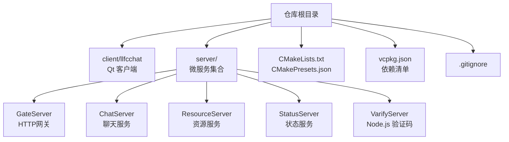
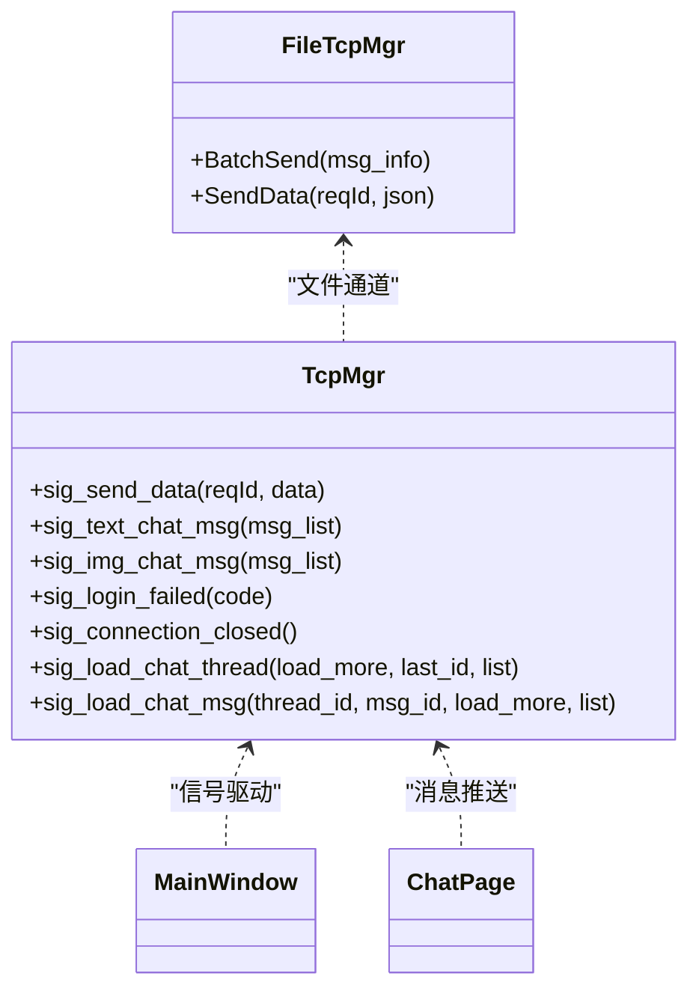
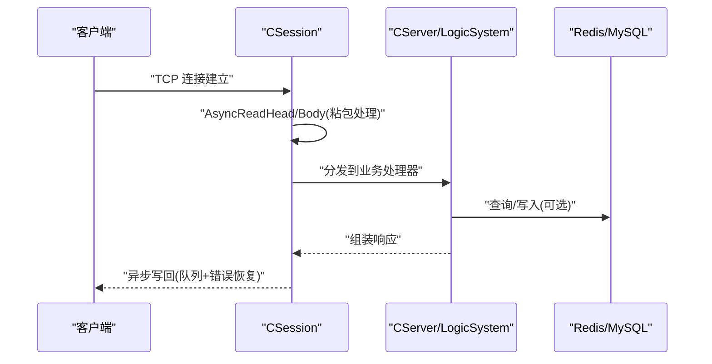
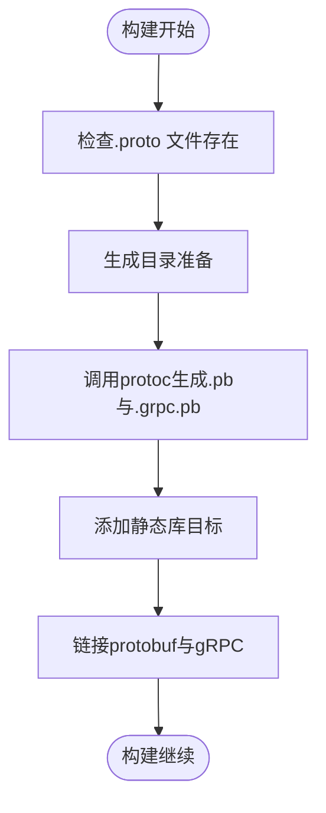
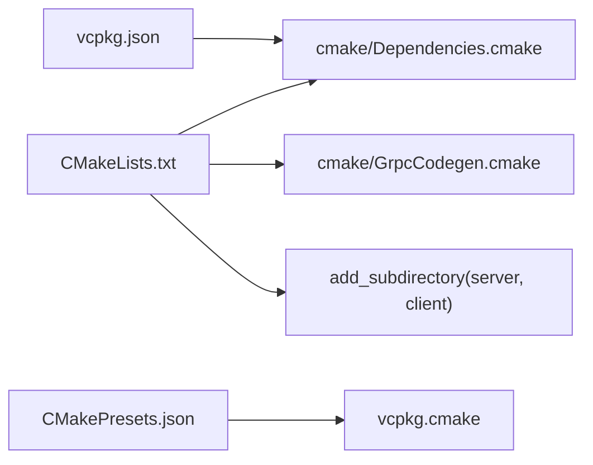
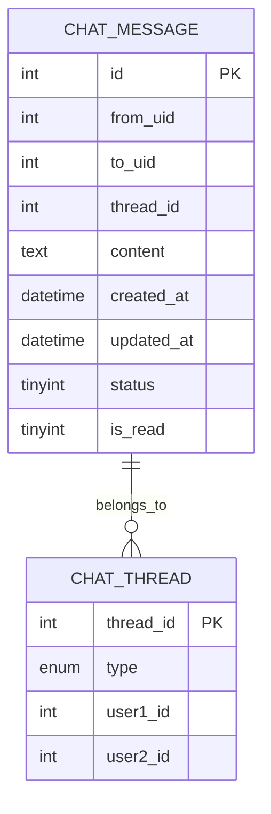
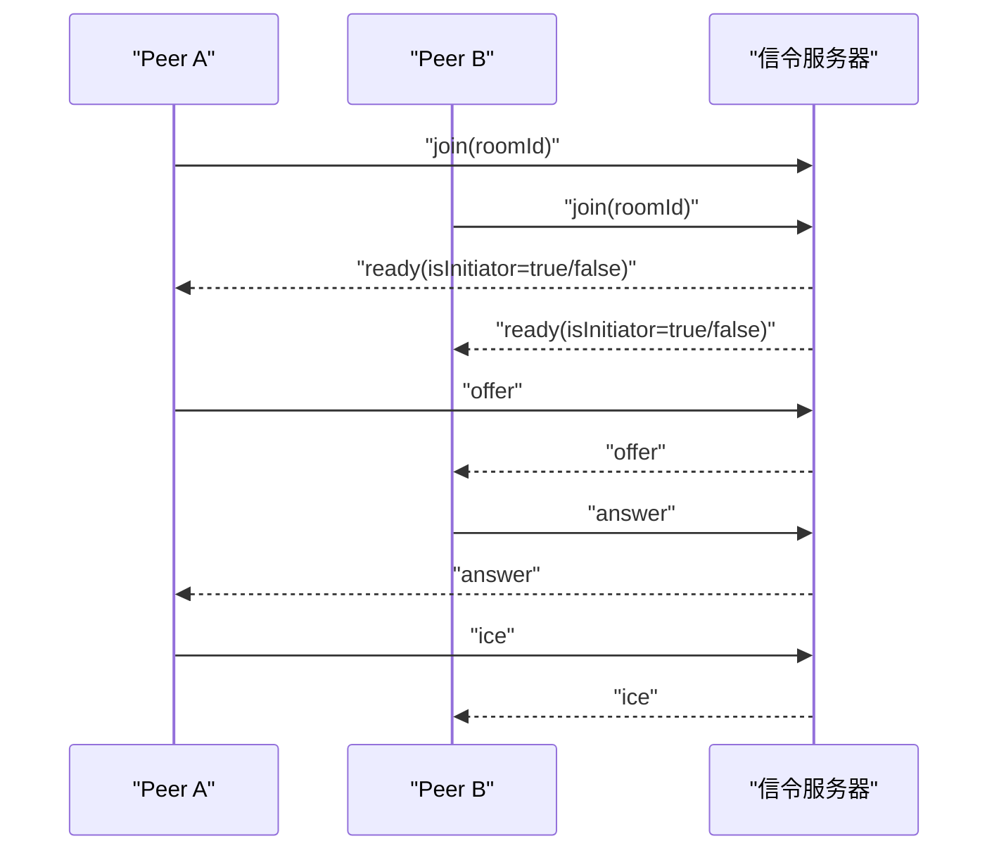
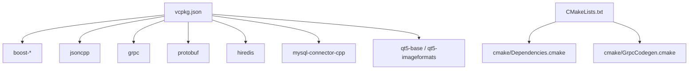

# 开发流程

<cite>
**本文引用的文件**   
- [README.md](file://README.md)
- [CMakeLists.txt](file://CMakeLists.txt)
- [CMakePresets.json](file://CMakePresets.json)
- [.gitignore](file://.gitignore)
- [vcpkg.json](file://vcpkg.json)
- [cmake/Dependencies.cmake](file://cmake/Dependencies.cmake)
- [cmake/GrpcCodegen.cmake](file://cmake/GrpcCodegen.cmake)
- [client/llfcchat/src/main.cpp](file://client/llfcchat/src/main.cpp)
- [server/ChatServer/src/ChatServer.cpp](file://server/ChatServer/src/ChatServer.cpp)
- [server/GateServer/src/GateServer.cpp](file://server/GateServer/src/GateServer.cpp)
- [server/ResourceServer/src/ResourceServer.cpp](file://server/ResourceServer/src/ResourceServer.cpp)
- [server/ChatServer/src/CSession.cpp](file://server/ChatServer/src/CSession.cpp)
- [server/ResourceServer/src/CSession.cpp](file://server/ResourceServer/src/CSession.cpp)
- [client/llfcchat/include/tcpmgr.h](file://client/llfcchat/include/tcpmgr.h)
- [更新记录.md](file://更新记录.md)
- [开发文档/day01-项目结构概述.md](file://开发文档/day01-项目结构概述.md)
- [开发文档/day02-客户端Http管理类设计.md](file://开发文档/day02-客户端Http管理类设计.md)
- [开发文档/day15-客户端Tcp管理类设计.md](file://开发文档/day15-客户端Tcp管理类设计.md)
- [开发文档/day35心跳逻辑.md](file://开发文档/day35心跳逻辑.md)
- [开发文档/day37-聊天信息存储方案.md](file://开发文档/day37-聊天信息存储方案.md)
- [开发文档/day44-webrtc信令服务器实现.md](file://开发文档/day44-webrtc信令服务器实现.md)
- [sql备份/llfc.sql](file://sql备份/llfc.sql)
</cite>

## 目录
1. [引言](#引言)
2. [项目结构](#项目结构)
3. [核心组件](#核心组件)
4. [架构总览](#架构总览)
5. [详细组件分析](#详细组件分析)
6. [依赖分析](#依赖分析)
7. [性能考虑](#性能考虑)
8. [故障排查指南](#故障排查指南)
9. [结论](#结论)
10. [附录](#附录)

## 引言
本文件为 LLFCChat 项目的标准化开发流程文档，面向全栈 C++（Qt 客户端 + Asio/gRPC 服务端）与 Node.js 验证服务。内容覆盖 Git 工作流、分支策略、提交规范、代码审查、冲突解决；新功能从需求到上线的完整流程；重构与技术债务管理；团队协作与知识沉淀；以及 CI/CD 自动化构建与部署建议。所有实践均结合仓库现有工程结构与实现进行说明，确保可落地执行。

## 项目结构
- 根目录使用 CMake 作为统一构建入口，强制 Ninja Multi-Config 生成器与非源码目录构建，便于多配置并行构建与缓存隔离。
- vcpkg 统一管理第三方依赖（Boost、gRPC、Protobuf、hiredis、MySQL、Qt5 等），通过预设工具链与安装目录固定版本与平台。
- 客户端基于 Qt5，包含 UI、网络、资源与业务模块；服务端按职责拆分为 ChatServer、GateServer、ResourceServer、StatusServer、VarifyServer（Node.js）。
- .gitignore 排除构建产物、IDE 用户文件、运行时日志与本地配置，保证仓库整洁。



**图表来源** 
- [CMakeLists.txt:1-34](file://CMakeLists.txt#L1-L34)
- [CMakePresets.json:1-36](file://CMakePresets.json#L1-L36)
- [vcpkg.json:1-32](file://vcpkg.json#L1-L32)
- [.gitignore:1-78](file://.gitignore#L1-L78)

**章节来源**
- [CMakeLists.txt:1-34](file://CMakeLists.txt#L1-L34)
- [CMakePresets.json:1-36](file://CMakePresets.json#L1-L36)
- [vcpkg.json:1-32](file://vcpkg.json#L1-L32)
- [.gitignore:1-78](file://.gitignore#L1-L78)

## 核心组件
- 客户端启动与初始化：加载样式、读取配置、启动 TCP/文件传输线程、显示主界面。
- 服务端启动与生命周期：各服务 main 函数负责初始化 IO 池、监听端口、注册 gRPC/HTTP 服务、信号处理与优雅退出。
- 会话与网络层：Asio 异步读写、粘包处理、发送队列与错误恢复。
- 协议与代码生成：Protobuf/gRPC 定义与 CMake 自动生成源文件并纳入构建。
- 依赖与构建：vcpkg 依赖解析、MSVC 默认编译选项、运行输出目录统一。

**章节来源**
- [client/llfcchat/src/main.cpp:1-44](file://client/llfcchat/src/main.cpp#L1-L44)
- [server/ChatServer/src/ChatServer.cpp:1-81](file://server/ChatServer/src/ChatServer.cpp#L1-L81)
- [server/GateServer/src/GateServer.cpp:1-48](file://server/GateServer/src/GateServer.cpp#L1-L48)
- [server/ResourceServer/src/ResourceServer.cpp:1-41](file://server/ResourceServer/src/ResourceServer.cpp#L1-L41)
- [cmake/GrpcCodegen.cmake:1-72](file://cmake/GrpcCodegen.cmake#L1-L72)
- [cmake/Dependencies.cmake:1-82](file://cmake/Dependencies.cmake#L1-L82)

## 架构总览
LLFCChat 采用“网关 + 微服务”的分布式架构：
- GateServer 作为 HTTP 网关，路由注册、登录、验证码等请求，并通过 gRPC 调用状态服务分配 ChatServer。
- ChatServer 维护长连接会话，处理聊天消息、好友关系、群聊等核心逻辑，必要时跨服通知。
- ResourceServer 提供文件上传下载、图片缩略图、断点续传等资源能力。
- StatusServer 集中维护在线状态、负载统计与调度。
- VarifyServer（Node.js）负责邮箱验证码派发与校验。
- Redis 用于缓存与分布式锁，MySQL 用于持久化数据。

```mermaid
graph TB
Client["Qt 客户端"] --> Gate["GateServer(HTTP)"]
Gate --> Verify["VarifyServer(Node.js)"]
Gate --> Status["StatusServer(gRPC)"]
Gate --> |选择| ChatA["ChatServer A"]
Gate --> |选择| ChatB["ChatServer B"]
ChatA < --> Redis["Redis"]
ChatB < --> Redis
ChatA < --> MySQL["MySQL"]
ChatB < --> MySQL
ChatA < --> Res["ResourceServer"]
ChatB < --> Res
```

**图表来源** 
- [开发文档/day01-项目结构概述.md:1-168](file://开发文档/day01-项目结构概述.md#L1-L168)
- [server/GateServer/src/GateServer.cpp:1-48](file://server/GateServer/src/GateServer.cpp#L1-L48)
- [server/ChatServer/src/ChatServer.cpp:1-81](file://server/ChatServer/src/ChatServer.cpp#L1-L81)
- [server/ResourceServer/src/ResourceServer.cpp:1-41](file://server/ResourceServer/src/ResourceServer.cpp#L1-L41)

## 详细组件分析

### 客户端网络与消息管线
- TcpMgr 暴露大量信号用于上层 UI 与业务解耦，包括登录、搜索、好友申请、认证、聊天消息、离线通知、会话切换等。
- 发送端采用队列与异步回调避免阻塞 UI 线程，支持拥塞窗口与批量发送优化。
- 接收端根据消息类型分发至对应槽函数，完成 UI 更新与状态同步。



**图表来源** 
- [client/llfcchat/include/tcpmgr.h:68-89](file://client/llfcchat/include/tcpmgr.h#L68-L89)
- [更新记录.md:226-292](file://更新记录.md#L226-L292)

**章节来源**
- [client/llfcchat/include/tcpmgr.h:68-89](file://client/llfcchat/include/tcpmgr.h#L68-L89)
- [开发文档/day15-客户端Tcp管理类设计.md:210-236](file://开发文档/day15-客户端Tcp管理类设计.md#L210-L236)
- [更新记录.md:226-292](file://更新记录.md#L226-L292)

### 服务端会话与异步 I/O
- CSession 实现异步读头/体、粘包处理、写队列与错误恢复，异常时关闭会话并清理。
- 各服务 main 中创建 AsioIOServicePool，绑定信号处理，启动定时器（心跳）、gRPC/HTTP 服务。



**图表来源** 
- [server/ChatServer/src/CSession.cpp:187-227](file://server/ChatServer/src/CSession.cpp#L187-L227)
- [server/ResourceServer/src/CSession.cpp:122-164](file://server/ResourceServer/src/CSession.cpp#L122-L164)
- [server/ChatServer/src/ChatServer.cpp:1-81](file://server/ChatServer/src/ChatServer.cpp#L1-L81)

**章节来源**
- [server/ChatServer/src/CSession.cpp:187-227](file://server/ChatServer/src/CSession.cpp#L187-L227)
- [server/ResourceServer/src/CSession.cpp:122-164](file://server/ResourceServer/src/CSession.cpp#L122-L164)
- [server/ChatServer/src/ChatServer.cpp:1-81](file://server/ChatServer/src/ChatServer.cpp#L1-L81)

### Protobuf/gRPC 代码生成与集成
- GrpcCodegen.cmake 提供 llfc_add_proto_library 宏，自动调用 protoc 生成 .pb.cc/.h 与 .grpc.pb.cc/.h，并封装为静态库供目标链接。
- 预置 chat/control/resource 三个 proto 的生成函数，确保构建期一致性。



**图表来源** 
- [cmake/GrpcCodegen.cmake:1-72](file://cmake/GrpcCodegen.cmake#L1-L72)

**章节来源**
- [cmake/GrpcCodegen.cmake:1-72](file://cmake/GrpcCodegen.cmake#L1-L72)

### 构建系统与依赖管理
- CMakeLists.txt 强制 Ninja Multi-Config 与非源码目录构建，设置 C++17 标准与扩展关闭。
- Dependencies.cmake 统一查找 Boost、jsoncpp、gRPC、Protobuf、hiredis、mysql-concpp、Qt5，并提供 MSVC 默认编译选项与运行输出目录。
- CMakePresets.json 定义 Windows 下的 Ninja 多配置预设，指定 vcpkg 工具链与安装目录。
- vcpkg.json 声明依赖与特性（如 Qt5-imageformats 启用 webp）。



**图表来源** 
- [CMakeLists.txt:1-34](file://CMakeLists.txt#L1-L34)
- [cmake/Dependencies.cmake:1-82](file://cmake/Dependencies.cmake#L1-L82)
- [CMakePresets.json:1-36](file://CMakePresets.json#L1-L36)
- [vcpkg.json:1-32](file://vcpkg.json#L1-L32)

**章节来源**
- [CMakeLists.txt:1-34](file://CMakeLists.txt#L1-L34)
- [cmake/Dependencies.cmake:1-82](file://cmake/Dependencies.cmake#L1-L82)
- [CMakePresets.json:1-36](file://CMakePresets.json#L1-L36)
- [vcpkg.json:1-32](file://vcpkg.json#L1-L32)

### 数据存储与消息持久化
- 聊天消息表 chat_message 与线程表 chat_thread 在 SQL 备份中体现，服务侧通过 MysqlDao/MysqlMgr 进行分页查询与结果映射。
- 消息入库与跨服转发由 LogicSystem 协调，必要时通过 gRPC 通知对端服务。



**图表来源** 
- [sql备份/llfc.sql:135-148](file://sql备份/llfc.sql#L135-L148)
- [开发文档/day37-聊天信息存储方案.md:3248-3281](file://开发文档/day37-聊天信息存储方案.md#L3248-L3281)

**章节来源**
- [sql备份/llfc.sql:135-148](file://sql备份/llfc.sql#L135-L148)
- [开发文档/day37-聊天信息存储方案.md:3248-3281](file://开发文档/day37-聊天信息存储方案.md#L3248-L3281)

### WebRTC 信令服务（概念性补充）
- webrtc-demo 中的 Node.js 信令服务器实现房间管理与 offer/answer/ice 透传，可用于后续视频通话功能扩展。



**图表来源** 
- [开发文档/day44-webrtc信令服务器实现.md:243-367](file://开发文档/day44-webrtc信令服务器实现.md#L243-L367)

**章节来源**
- [开发文档/day44-webrtc信令服务器实现.md:243-367](file://开发文档/day44-webrtc信令服务器实现.md#L243-L367)

## 依赖分析
- 客户端与服务端共享统一的依赖管理策略，通过 vcpkg 锁定版本与特性，CMake 脚本集中查找与配置。
- gRPC/Protobuf 代码生成与链接在构建期完成，避免运行时缺失。
- Qt 客户端依赖 Core/Gui/Network/Widgets，图片格式按需启用。



**图表来源** 
- [vcpkg.json:1-32](file://vcpkg.json#L1-L32)
- [cmake/Dependencies.cmake:1-82](file://cmake/Dependencies.cmake#L1-L82)
- [cmake/GrpcCodegen.cmake:1-72](file://cmake/GrpcCodegen.cmake#L1-L72)

**章节来源**
- [vcpkg.json:1-32](file://vcpkg.json#L1-L32)
- [cmake/Dependencies.cmake:1-82](file://cmake/Dependencies.cmake#L1-L82)
- [cmake/GrpcCodegen.cmake:1-72](file://cmake/GrpcCodegen.cmake#L1-L72)

## 性能考虑
- 客户端发送拥塞窗口与批量发送：通过控制并发发送数量与分片大小，降低网络拥塞与重传概率。
- 发送队列与异步回调：避免 UI 线程阻塞，提升吞吐与响应性。
- 服务端心跳与连接数统计：定时扫描过期会话，减少频繁加锁与 Redis 写入开销。
- 数据库分页查询：使用 CTE/UNION ALL/LIMIT N+1 模式高效获取列表与判断是否加载更多。

**章节来源**
- [更新记录.md:226-292](file://更新记录.md#L226-L292)
- [开发文档/day35心跳逻辑.md:272-688](file://开发文档/day35心跳逻辑.md#L272-L688)
- [server/ChatServer/src/MysqlDao.cpp:680-735](file://server/ChatServer/src/MysqlDao.cpp#L680-L735)

## 故障排查指南
- 网络粘包与写失败：检查 CSession 的 AsyncReadHead/Body 与 HandleWrite 的错误分支，确认长度校验与写队列消费。
- 客户端发送缓冲区满：参考 TcpMgr 的 slot_send_data 实现，确保使用队列与 bytesWritten 回调。
- Redis 连接问题：核对密码、端口与连接池初始化，关注 Win32 兼容性问题。
- gRPC/Protobuf 生成失败：检查 proto 路径与 protoc 插件可用性。

**章节来源**
- [server/ChatServer/src/CSession.cpp:187-227](file://server/ChatServer/src/CSession.cpp#L187-L227)
- [server/ResourceServer/src/CSession.cpp:122-164](file://server/ResourceServer/src/CSession.cpp#L122-L164)
- [开发文档/day38-断点续传.md:343-431](file://开发文档/day38-断点续传.md#L343-L431)
- [开发文档/day09-redis服务搭建.md:221-290](file://开发文档/day09-redis服务搭建.md#L221-L290)
- [cmake/GrpcCodegen.cmake:1-72](file://cmake/GrpcCodegen.cmake#L1-L72)

## 结论
LLFCChat 以清晰的模块化与统一的构建/依赖管理为基础，结合 Asio/gRPC/Qt 等技术栈实现了可扩展的聊天系统。遵循本文档的开发流程与规范，可有效提升协作效率、质量与可维护性。建议在团队内推广分支策略、提交规范与代码审查流程，并结合 CI/CD 实现自动化测试与发布。

## 附录

### Git 工作流与分支策略
- 分支模型
  - main：稳定发布基线，仅接受合并请求与热修复。
  - develop：日常开发主干，集成已完成的功能分支。
  - feature/*：功能分支，命名遵循 feature/模块-描述。
  - hotfix/*：紧急修复分支，快速修复后合并至 main 与 develop。
  - release/*：预发布分支，冻结变更并进行回归测试。
- 提交信息规范
  - 格式：<类型>(范围): 简述
  - 类型：feat、fix、docs、refactor、test、chore、perf、build、ci
  - 示例：feat(chat): 新增图片断点续传
- 代码审查流程
  - 所有变更需通过 Pull Request，至少一名 reviewer 批准。
  - 审查要点：接口契约、错误处理、性能影响、可测试性、文档更新。
- 冲突解决策略
  - 小冲突优先在本地 rebase 解决，大冲突建议新建分支重新实现。
  - 合并前必须通过本地构建与基础测试。

### 新功能开发流程
- 需求分析
  - 明确用户故事、验收条件与边界场景。
  - 产出 PRD 或简易需求卡片，标注优先级与依赖。
- 技术方案设计
  - 绘制时序图/流程图，确定接口与数据结构。
  - 评估性能、安全与可观测性指标。
- 代码实现
  - 遵循编码规范，拆分小粒度提交。
  - 关键逻辑增加注释与单元测试。
- 单元测试编写
  - 覆盖正常路径与异常分支，模拟网络与 IO。
  - 使用 Mock 隔离外部依赖。
- 集成测试
  - 端到端用例覆盖核心链路（登录、聊天、文件传输）。
  - 使用容器化环境复现依赖（Redis/MySQL）。
- 文档更新
  - 更新 README、API 文档与开发文档。
  - 变更记录与迁移说明。

### 代码重构与技术债务管理
- 代码质量检查
  - 引入静态分析工具（Clang-Tidy、Cppcheck），CI 中强制执行。
  - 代码风格统一（clang-format），提交前格式化。
- 性能优化流程
  - 热点路径 profiling，定位瓶颈。
  - 优化算法与数据结构，减少锁竞争与内存拷贝。
- 依赖更新策略
  - 定期升级 vcpkg 基线与依赖版本，评估兼容性。
  - 重大升级先在小分支验证，再合并至 develop。

### 团队协作规范
- 任务分配
  - 使用看板或 Issue 跟踪任务，明确负责人与截止日期。
- 进度跟踪
  - 每日站会同步进展与阻塞问题。
  - 周报汇总里程碑与风险。
- 知识分享
  - 技术分享会、代码走查、复盘总结。
- 技术讨论
  - 重要决策形成 RFC 文档，公开评审与归档。

### 持续集成与自动化部署（建议）
- CI/CD 管道
  - 触发条件：push/PR 到 develop/main。
  - 步骤：拉取代码 → 安装依赖（vcpkg）→ 构建（Debug/Release）→ 单元测试 → 打包产物。
- 自动化测试
  - 单元/集成测试套件，覆盖率阈值要求。
  - 网络与 IO 用例使用 Mock/Stub。
- 构建产物管理
  - 产物命名规范与版本标签。
  - 归档至制品库，供发布与回滚。
- 部署策略
  - 灰度发布与蓝绿部署。
  - 健康检查与自动回滚机制。

[本节为通用指导，不直接分析具体文件]