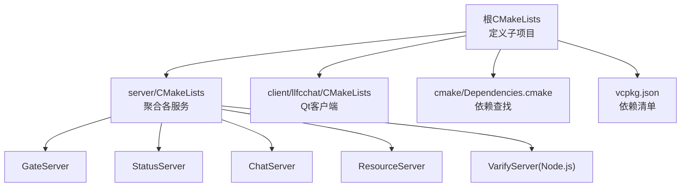
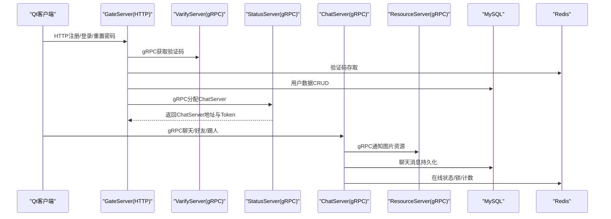
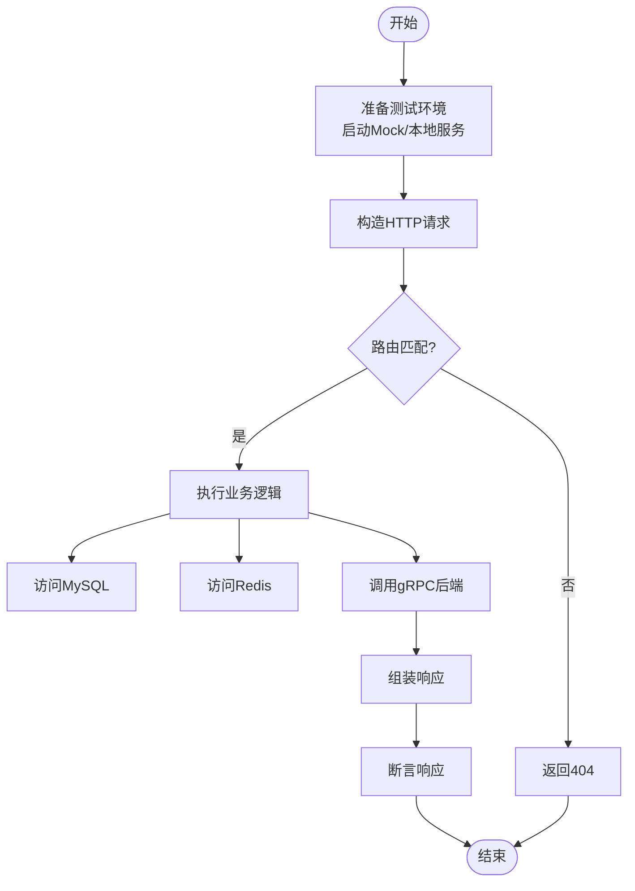
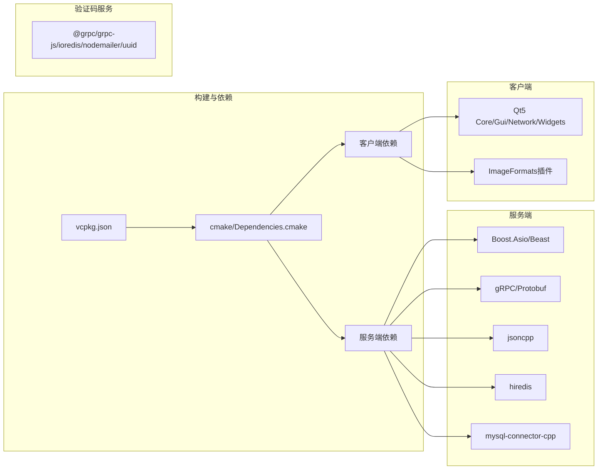
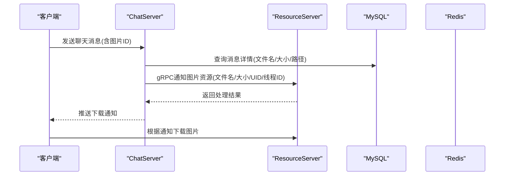

# 测试策略

<cite>
**本文引用的文件**   
- [CMakeLists.txt](file://CMakeLists.txt)
- [Dependencies.cmake](file://cmake/Dependencies.cmake)
- [vcpkg.json](file://vcpkg.json)
- [server/CMakeLists.txt](file://server/CMakeLists.txt)
- [client CMakeLists.txt](file://client/llfcchat/CMakeLists.txt)
- [GateServer LogicSystem.cpp](file://server/GateServer/src/LogicSystem.cpp)
- [GateServer GateServer.cpp](file://server/GateServer/src/GateServer.cpp)
- [GateServer RedisMgr.h](file://server/GateServer/include/RedisMgr.h)
- [ChatServer ChatServiceImpl.h](file://server/ChatServer/include/ChatServiceImpl.h)
- [ChatServer ChatGrpcClient.cpp](file://server/ChatServer/src/ChatGrpcClient.cpp)
- [StatusServer StatusServiceImpl.h](file://server/StatusServer/include/StatusServiceImpl.h)
- [StatusServer StatusGrpcClient.cpp](file://server/StatusServer/src/StatusGrpcClient.cpp)
- [VarifyServer package.json](file://server/VarifyServer/package.json)
- [VarifyServer proto.js](file://server/VarifyServer/proto.js)
- [开发文档 day09-redis服务搭建.md](file://开发文档/day09-redis服务搭建.md)
- [开发文档 day14-登录功能.md](file://开发文档/day14-登录功能.md)
- [开发文档 day29-好友认证和聊天通信.md](file://开发文档/day29-好友认证和聊天通信.md)
- [开发文档 day37-聊天信息存储方案.md](file://开发文档/day37-聊天信息存储方案.md)
- [开发文档 day41-通知客户端异步下载聊天图片.md](file://开发文档/day41-通知客户端异步下载聊天图片.md)
- [sql备份 llfc.sql](file://sql备份/llfc.sql)
</cite>

## 目录
1. [引言](#引言)
2. [项目结构](#项目结构)
3. [核心组件](#核心组件)
4. [架构总览](#架构总览)
5. [详细组件分析](#详细组件分析)
6. [依赖分析](#依赖分析)
7. [性能考虑](#性能考虑)
8. [故障排查指南](#故障排查指南)
9. [结论](#结论)
10. [附录](#附录)

## 引言
本测试策略面向LLFCChat项目的多语言、多服务、前后端一体化特性，覆盖单元测试、集成测试、端到端测试与性能测试四大维度。项目采用C++（Qt客户端、Boost.Asio/Beast网络栈、gRPC微服务）、Node.js（验证码服务）、MySQL与Redis等基础设施。策略重点包括：
- 单元测试框架选择与配置（Google Test集成建议）
- Mock对象使用与异步代码测试方法
- 集成测试策略（HTTP/gRPC接口、数据库、Redis缓存）
- 端到端测试（UI自动化、网络模拟、业务流程验证）
- 性能测试（压力、负载、内存、延迟）
- 测试数据管理（初始化、Mock数据、环境隔离）
- 覆盖率统计、CI执行与报告生成

## 项目结构
仓库采用分层与按服务划分相结合的目录组织方式：
- 根CMakeLists负责统一构建入口与模块引入
- server下包含GateServer、StatusServer、ChatServer、ResourceServer、VarifyServer等多个微服务
- client/llfcchat为Qt客户端工程
- cmake/存放通用依赖解析脚本
- vcpkg.json声明第三方依赖
- sql备份提供数据库初始脚本
- 开发文档记录关键实现与演进

**图表来源** 
- [CMakeLists.txt:1-34](file://CMakeLists.txt#L1-L34)
- [server/CMakeLists.txt:1-38](file://server/CMakeLists.txt#L1-L38)
- [client CMakeLists.txt:1-222](file://client/llfcchat/CMakeLists.txt#L1-L222)
- [Dependencies.cmake:1-82](file://cmake/Dependencies.cmake#L1-L82)
- [vcpkg.json:1-32](file://vcpkg.json#L1-L32)

**章节来源**
- [CMakeLists.txt:1-34](file://CMakeLists.txt#L1-L34)
- [server/CMakeLists.txt:1-38](file://server/CMakeLists.txt#L1-L38)
- [client CMakeLists.txt:1-222](file://client/llfcchat/CMakeLists.txt#L1-L222)
- [Dependencies.cmake:1-82](file://cmake/Dependencies.cmake#L1-L82)
- [vcpkg.json:1-32](file://vcpkg.json#L1-L32)

## 核心组件
- 网关服务GateServer：HTTP路由注册与分发，调用验证码服务、状态服务，操作Redis与MySQL
- 状态服务StatusServer：gRPC服务，分配ChatServer并处理登录
- 聊天服务ChatServer：gRPC服务，处理消息转发、好友关系、踢人、图片资源通知
- 资源服务ResourceServer：文件上传/下载、断点续传、任务队列
- 验证码服务VarifyServer：Node.js gRPC服务，邮件发送、验证码缓存（Redis）
- 客户端llfcchat：Qt界面，HTTP/TCP/gRPC交互，用户会话管理

这些组件通过gRPC与HTTP进行跨进程通信，并通过Redis与MySQL进行状态与持久化。

**章节来源**
- [GateServer LogicSystem.cpp:1-35](file://server/GateServer/src/LogicSystem.cpp#L1-L35)
- [ChatServer ChatServiceImpl.h:1-53](file://server/ChatServer/include/ChatServiceImpl.h#L1-L53)
- [StatusServer StatusServiceImpl.h:1-50](file://server/StatusServer/include/StatusServiceImpl.h#L1-L50)
- [VarifyServer package.json:1-19](file://server/VarifyServer/package.json#L1-L19)

## 架构总览
下图展示从客户端到各微服务的请求路径，以及Redis/MySQL的参与位置。

**图表来源** 
- [GateServer LogicSystem.cpp:1-35](file://server/GateServer/src/LogicSystem.cpp#L1-L35)
- [ChatServer ChatGrpcClient.cpp:1-60](file://server/ChatServer/src/ChatGrpcClient.cpp#L1-L60)
- [StatusServer StatusGrpcClient.cpp:1-52](file://server/StatusServer/src/StatusGrpcClient.cpp#L1-L52)
- [开发文档 day14-登录功能.md:254-329](file://开发文档/day14-登录功能.md#L254-L329)
- [开发文档 day29-好友认证和聊天通信.md:897-937](file://开发文档/day29-好友认证和聊天通信.md#L897-L937)
- [开发文档 day37-聊天信息存储方案.md:3462-3528](file://开发文档/day37-聊天信息存储方案.md#L3462-L3528)
- [开发文档 day41-通知客户端异步下载聊天图片.md:61-215](file://开发文档/day41-通知客户端异步下载聊天图片.md#L61-L215)

## 详细组件分析

### 单元测试策略（Google Test集成建议）
- 目标：对纯函数、工具类、连接池、单例、错误码等进行细粒度验证
- 推荐框架：Google Test（gtest），配合gmock进行Mock
- 集成方式：在CMake中启用gtest，将测试源加入test子目录；对每个服务或公共库建立独立可执行测试目标
- 用例规范：
  - 命名：Test_<组件>_<场景>
  - 结构：Arrange-Act-Assert
  - 隔离：避免共享全局状态，必要时重置单例实例
- Mock策略：
  - 对Redis/MySQL/gRPC客户端封装接口，使用gmock替换真实依赖
  - 对AsioIOServicePool与网络I/O，使用事件循环注入或回调拦截
- 异步测试：
  - 使用gtest的异步断言或自定义EventLoop驱动回调完成
  - 对条件变量/信号量等待，设置超时与失败分支

**章节来源**
- [vcpkg.json:1-32](file://vcpkg.json#L1-L32)
- [Dependencies.cmake:1-82](file://cmake/Dependencies.cmake#L1-L82)

### 集成测试策略（服务间通信、数据库、Redis、gRPC）
- 网关HTTP接口测试：
  - 构造HTTP请求（GET/POST），校验响应体与状态码
  - 覆盖路由注册与参数解析（如验证码、注册、登录）
- gRPC接口测试：
  - 启动Stub客户端，构造Request，断言Response字段与错误码
  - 覆盖异常路径（RPC失败、超时、无效Token）
- 数据库测试：
  - 使用事务+回滚保证数据一致性
  - 预置SQL脚本（参考sql备份），测试增删改查与分页
- Redis测试：
  - 连接池初始化、认证、键值/列表/哈希操作、分布式锁、计数器等
  - 参考现有示例用例风格编写断言

**图表来源** 
- [GateServer LogicSystem.cpp:1-35](file://server/GateServer/src/LogicSystem.cpp#L1-L35)
- [GateServer GateServer.cpp:119-162](file://server/GateServer/src/GateServer.cpp#L119-L162)
- [开发文档 day09-redis服务搭建.md:647-672](file://开发文档/day09-redis服务搭建.md#L647-L672)

**章节来源**
- [GateServer GateServer.cpp:119-162](file://server/GateServer/src/GateServer.cpp#L119-L162)
- [开发文档 day09-redis服务搭建.md:647-672](file://开发文档/day09-redis服务搭建.md#L647-L672)

### 端到端测试方案（UI自动化、网络模拟、业务流程）
- UI自动化：
  - 基于Qt的QSignalSpy/QTest对界面交互进行断言（输入、点击、弹窗）
  - 使用虚拟显示环境（如Xvfb或Windows虚拟桌面）运行无头测试
- 网络模拟：
  - 使用本地Mock服务器替代真实后端（gRPC/HTTP）
  - 注入延迟/丢包/错误响应以验证健壮性
- 业务流程：
  - 注册→获取验证码→登录→分配ChatServer→发起聊天→接收消息→图片资源下载
  - 断言状态流转与数据一致性（用户、好友、消息、资源）

**章节来源**
- [client CMakeLists.txt:1-222](file://client/llfcchat/CMakeLists.txt#L1-L222)
- [开发文档 day14-登录功能.md:254-329](file://开发文档/day14-登录功能.md#L254-L329)
- [开发文档 day29-好友认证和聊天通信.md:897-937](file://开发文档/day29-好友认证和聊天通信.md#L897-L937)
- [开发文档 day41-通知客户端异步下载聊天图片.md:61-215](file://开发文档/day41-通知客户端异步下载聊天图片.md#L61-L215)

### 性能测试方法（压力、负载、内存、延迟）
- 压力测试：
  - 使用ab/wrk/JMeter对HTTP接口压测
  - 使用grpcurl或自定义gRPC客户端对接口并发压测
- 负载测试：
  - 逐步增加并发用户数，观察CPU/内存/线程池/连接池指标
  - 关注AsioIOServicePool与连接池（Redis/MySQL/gRPC）的瓶颈
- 内存分析：
  - 使用Valgrind/Visual Studio诊断器检测泄漏
  - 针对Singleton与连接池生命周期进行验证
- 延迟测试：
  - 测量端到端时延（客户端→Gate→Status/Chat→DB/Redis）
  - 区分网络RTT与服务处理耗时

[本节为通用指导，不直接分析具体文件]

## 依赖分析
- 构建系统：CMake + Ninja Multi-Config，vcpkg管理依赖
- 服务端依赖：Boost.Asio/Beast、jsoncpp、gRPC、protobuf、hiredis、mysql-connector-cpp
- 客户端依赖：Qt5 Core/Gui/Network/Widgets、imageformats插件
- 验证码服务依赖：@grpc/grpc-js、ioredis、nodemailer、uuid

**图表来源** 
- [vcpkg.json:1-32](file://vcpkg.json#L1-L32)
- [Dependencies.cmake:1-82](file://cmake/Dependencies.cmake#L1-L82)
- [client CMakeLists.txt:1-222](file://client/llfcchat/CMakeLists.txt#L1-L222)
- [VarifyServer package.json:1-19](file://server/VarifyServer/package.json#L1-L19)

**章节来源**
- [vcpkg.json:1-32](file://vcpkg.json#L1-L32)
- [Dependencies.cmake:1-82](file://cmake/Dependencies.cmake#L1-L82)
- [client CMakeLists.txt:1-222](file://client/llfcchat/CMakeLists.txt#L1-L222)
- [VarifyServer package.json:1-19](file://server/VarifyServer/package.json#L1-L19)

## 性能考虑
- 连接池与线程池：
  - AsioIOServicePool轮询io_context，确保高并发下的吞吐
  - Redis/MySQL/gRPC连接池复用连接，减少握手开销
- 异步与事件循环：
  - 避免阻塞主事件循环，使用回调/协程模式
  - 合理设置超时与重试策略
- 缓存与锁：
  - Redis用于验证码、分布式锁、计数器等热点数据
  - 注意锁粒度与过期时间，避免死锁与雪崩
- 资源管理：
  - Singleton生命周期与析构顺序需明确
  - 文件IO与图片传输采用断点续传与分块处理

[本节为通用指导，不直接分析具体文件]

## 故障排查指南
- 常见问题定位：
  - gRPC调用失败：检查通道创建、Stub池、错误码（RPCFailed）
  - Redis连接失败：认证失败、连接池耗尽、命令执行异常
  - MySQL连接失败：URL/Schema/权限问题、连接池耗尽
  - 粘包/拆包：Qt网络层粘包导致解析错误，需长度前缀或分隔符
- 调试手段：
  - 日志分级与采样，关键路径打印上下文
  - 使用assert与错误码枚举快速定位
  - 借助Valgrind/内存分析器排查泄漏
- 恢复策略：
  - 连接池健康检查与自动重建
  - 超时重试与熔断降级
  - 优雅关闭与资源释放

**章节来源**
- [ChatServer ChatGrpcClient.cpp:1-60](file://server/ChatServer/src/ChatGrpcClient.cpp#L1-L60)
- [StatusServer StatusGrpcClient.cpp:1-52](file://server/StatusServer/src/StatusGrpcClient.cpp#L1-L52)
- [GateServer GateServer.cpp:119-162](file://server/GateServer/src/GateServer.cpp#L119-L162)
- [开发文档 day09-redis服务搭建.md:647-672](file://开发文档/day09-redis服务搭建.md#L647-L672)
- [开发文档 day42-Qt粘包引发的血案.md](file://开发文档/day42-Qt粘包引发的血案.md)

## 结论
本测试策略围绕LLFCChat的多服务、多协议、多依赖特点，构建了从单元到端到端的完整测试体系。通过合理的Mock与隔离、严格的断言与覆盖率统计、以及持续集成的自动化执行，可有效保障系统的稳定性与可维护性。建议在后续迭代中完善测试用例覆盖、优化性能基线、强化故障注入与混沌工程实践。

[本节为总结，不直接分析具体文件]

## 附录

### 测试数据管理
- 数据库初始化：
  - 使用sql备份脚本创建表结构与基础数据
  - 测试前清理/回滚，保证数据一致性
- Mock数据生成：
  - 用户、好友申请、聊天消息、图片资源元数据
  - 随机化与边界值组合，覆盖异常路径
- 环境隔离：
  - 独立的测试数据库与Redis实例
  - 端口与路径隔离，避免冲突

**章节来源**
- [sql备份 llfc.sql:456-480](file://sql备份/llfc.sql#L456-L480)

### 覆盖率统计与CI执行
- 覆盖率：
  - 使用gcov/lcov或Visual Studio覆盖率工具生成HTML报告
  - 设定最低覆盖率阈值，未达标阻断合并
- CI流程：
  - 构建→单元测试→集成测试→端到端测试→覆盖率收集→报告归档
  - 并行执行提升效率，失败即时告警

[本节为通用指导，不直接分析具体文件]

### 关键流程图（gRPC通知图片资源）

**图表来源** 
- [开发文档 day41-通知客户端异步下载聊天图片.md:61-215](file://开发文档/day41-通知客户端异步下载聊天图片.md#L61-L215)
- [开发文档 day37-聊天信息存储方案.md:3462-3528](file://开发文档/day37-聊天信息存储方案.md#L3462-L3528)