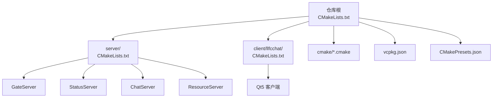
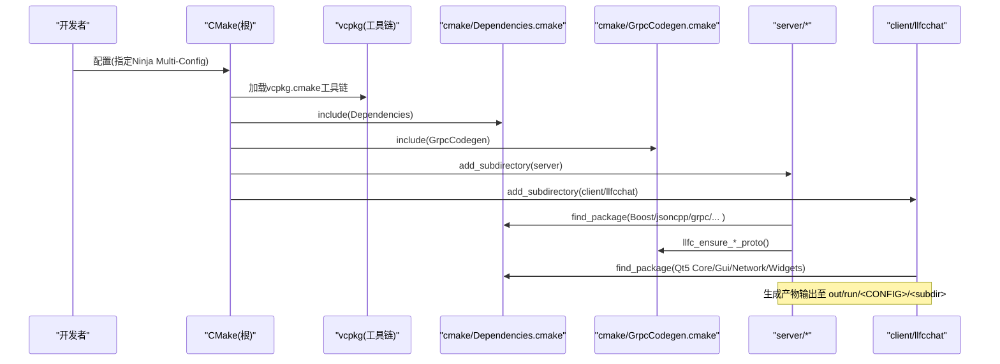
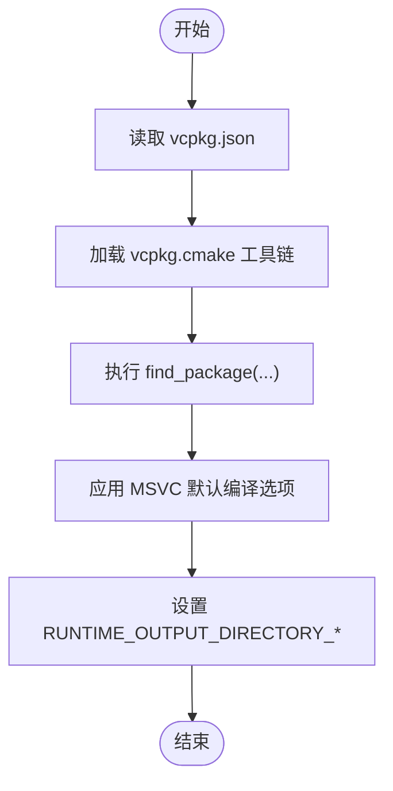
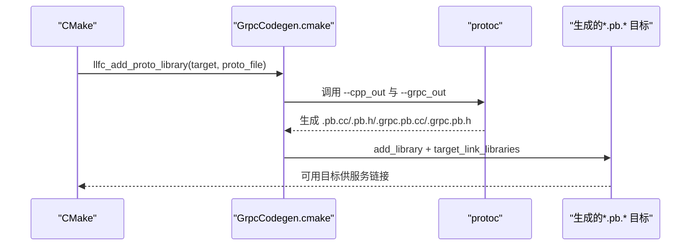
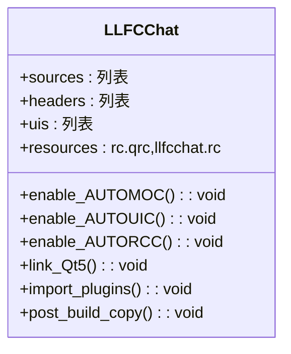
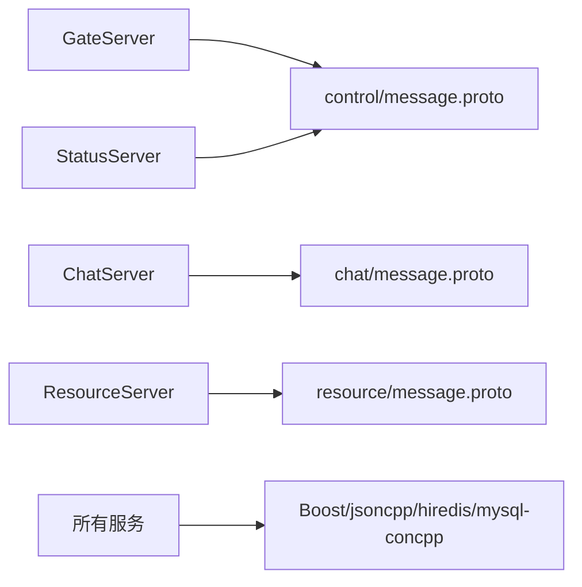
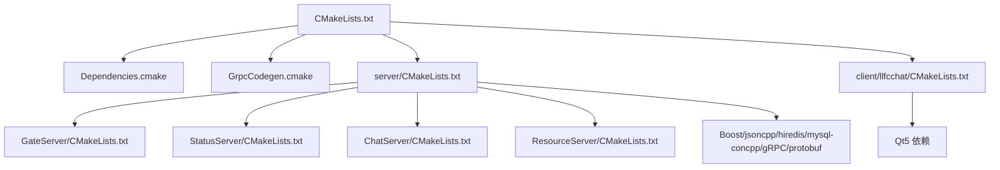

# 环境搭建

<cite>
**本文引用的文件**   
- [CMakeLists.txt](file://CMakeLists.txt)
- [vcpkg.json](file://vcpkg.json)
- [CMakePresets.json](file://CMakePresets.json)
- [cmake/Dependencies.cmake](file://cmake/Dependencies.cmake)
- [cmake/GrpcCodegen.cmake](file://cmake/GrpcCodegen.cmake)
- [server/CMakeLists.txt](file://server/CMakeLists.txt)
- [client/llfcchat/CMakeLists.txt](file://client/llfcchat/CMakeLists.txt)
- [server/ChatServer/CMakeLists.txt](file://server/ChatServer/CMakeLists.txt)
- [server/GateServer/CMakeLists.txt](file://server/GateServer/CMakeLists.txt)
- [server/StatusServer/CMakeLists.txt](file://server/StatusServer/CMakeLists.txt)
- [server/ResourceServer/CMakeLists.txt](file://server/ResourceServer/CMakeLists.txt)
- [client/llfcchat/config/config.ini](file://client/llfcchat/config/config.ini)
- [.gitignore](file://.gitignore)
- [README.md](file://README.md)
- [开发文档/day03-visualstudio配置boost和jsoncpp.md](file://开发文档/day03-visualstudio配置boost和jsoncpp.md)
- [开发文档/day07-visualstudio配置grpc.md](file://开发文档/day07-visualstudio配置grpc.md)
</cite>

## 目录
1. [简介](#简介)
2. [项目结构](#项目结构)
3. [核心组件](#核心组件)
4. [架构总览](#架构总览)
5. [详细组件分析](#详细组件分析)
6. [依赖关系分析](#依赖关系分析)
7. [性能与构建建议](#性能与构建建议)
8. [故障排查指南](#故障排查指南)
9. [结论](#结论)
10. [附录](#附录)

## 简介
本指南面向LLFCChat项目的开发与部署，覆盖操作系统与编译器要求、IDE推荐、依赖管理（vcpkg）、构建系统（CMake）配置、编译流程、调试与性能分析、以及常见问题排查。项目采用C++17（客户端部分模块兼容C++11），使用Ninja Multi-Config生成器，通过vcpkg统一安装第三方库（Boost、Qt5、gRPC、protobuf、hiredis、mysql-connector-cpp、jsoncpp）。服务端包含GateServer、StatusServer、ChatServer、ResourceServer四个子服务；客户端为基于Qt5的桌面应用。

## 项目结构
仓库根目录提供顶层CMake入口，按server与client两个子树组织：
- server：包含多个独立可执行服务（GateServer、StatusServer、ChatServer、ResourceServer），每个服务有独立的CMakeLists与配置文件。
- client/llfcchat：Qt5客户端工程，包含UI资源、样式表与静态资源。
- cmake：共享CMake脚本，负责依赖查找、gRPC代码生成、MSVC默认选项、输出目录规范等。
- vcpkg.json：声明所有C++依赖及特性开关。
- CMakePresets.json：Windows平台下的Ninja多配置预设，便于一键配置与构建。

图表来源
- [CMakeLists.txt:1-34](file://CMakeLists.txt#L1-L34)
- [server/CMakeLists.txt:1-38](file://server/CMakeLists.txt#L1-L38)
- [client/llfcchat/CMakeLists.txt:1-222](file://client/llfcchat/CMakeLists.txt#L1-L222)
- [vcpkg.json:1-32](file://vcpkg.json#L1-L32)
- [CMakePresets.json:1-36](file://CMakePresets.json#L1-L36)

章节来源
- [CMakeLists.txt:1-34](file://CMakeLists.txt#L1-L34)
- [server/CMakeLists.txt:1-38](file://server/CMakeLists.txt#L1-L38)
- [client/llfcchat/CMakeLists.txt:1-222](file://client/llfcchat/CMakeLists.txt#L1-L222)
- [vcpkg.json:1-32](file://vcpkg.json#L1-L32)
- [CMakePresets.json:1-36](file://CMakePresets.json#L1-L36)

## 核心组件
- 构建系统与工具链
  - CMake最低版本要求：3.25
  - 生成器：Ninja Multi-Config（强制）
  - 语言标准：C++17（客户端部分目标为C++11以兼容Qt5）
- 依赖管理
  - vcpkg清单：vcpkg.json
  - 目标三元组（Windows）：x64-windows-static-md（MD运行时）
- 第三方库（由vcpkg安装）
  - Boost：asio、beast、date_time、filesystem、property_tree、uuid
  - jsoncpp
  - gRPC、protobuf
  - hiredis
  - mysql-connector-cpp（启用jdbc特性）
  - Qt5：qt5-base（默认特性关闭）、qt5-imageformats（启用webp）
- 代码生成
  - gRPC/Protobuf代码生成封装在cmake/GrpcCodegen.cmake中，自动生成.pb与.grpc.pb源文件并链接对应库。

章节来源
- [CMakeLists.txt:1-34](file://CMakeLists.txt#L1-L34)
- [vcpkg.json:1-32](file://vcpkg.json#L1-L32)
- [cmake/Dependencies.cmake:1-82](file://cmake/Dependencies.cmake#L1-L82)
- [cmake/GrpcCodegen.cmake:1-72](file://cmake/GrpcCodegen.cmake#L1-L72)
- [client/llfcchat/CMakeLists.txt:1-222](file://client/llfcchat/CMakeLists.txt#L1-L222)

## 架构总览
下图展示仓库级构建与依赖解析流程，包括vcpkg工具链注入、CMake模块加载、各子模块依赖发现与gRPC代码生成。

图表来源
- [CMakeLists.txt:1-34](file://CMakeLists.txt#L1-L34)
- [cmake/Dependencies.cmake:1-82](file://cmake/Dependencies.cmake#L1-L82)
- [cmake/GrpcCodegen.cmake:1-72](file://cmake/GrpcCodegen.cmake#L1-L72)
- [server/CMakeLists.txt:1-38](file://server/CMakeLists.txt#L1-L38)
- [client/llfcchat/CMakeLists.txt:1-222](file://client/llfcchat/CMakeLists.txt#L1-L222)

## 详细组件分析

### 依赖管理与vcpkg
- 清单定义：vcpkg.json声明了所有C++依赖与特性开关（如mysql-connector-cpp的jdbc特性、qt5-imageformats的webp）。
- 工具链：CMakePresets.json指定Ninja Multi-Config生成器与vcpkg工具链文件路径，设置VCPKG_TARGET_TRIPLET为x64-windows-static-md，确保运行时链接MD模式。
- 依赖查找：cmake/Dependencies.cmake集中find_package调用，区分服务端与客户端依赖。
- 输出目录：llfc_set_runtime_outdir将各目标输出到out/run/<CONFIG>/<subdir>，便于运行与分发。

图表来源
- [vcpkg.json:1-32](file://vcpkg.json#L1-L32)
- [CMakePresets.json:1-36](file://CMakePresets.json#L1-L36)
- [cmake/Dependencies.cmake:1-82](file://cmake/Dependencies.cmake#L1-L82)

章节来源
- [vcpkg.json:1-32](file://vcpkg.json#L1-L32)
- [CMakePresets.json:1-36](file://CMakePresets.json#L1-L36)
- [cmake/Dependencies.cmake:1-82](file://cmake/Dependencies.cmake#L1-L82)

### gRPC/Protobuf代码生成
- 生成函数：llfc_add_proto_library根据.proto文件生成.pb与.grpc.pb源文件，创建静态库目标并链接libprotobuf与gRPC++。
- 预置接口：llfc_ensure_control_proto/chat_proto/resource_proto分别处理不同业务域的proto文件。
- 集成点：各服务CMakeLists中调用相应ensure函数完成代码生成。

图表来源
- [cmake/GrpcCodegen.cmake:1-72](file://cmake/GrpcCodegen.cmake#L1-L72)
- [server/ChatServer/CMakeLists.txt:1-109](file://server/ChatServer/CMakeLists.txt#L1-L109)
- [server/GateServer/CMakeLists.txt:1-90](file://server/GateServer/CMakeLists.txt#L1-L90)
- [server/StatusServer/CMakeLists.txt:1-35](file://server/StatusServer/CMakeLists.txt#L1-L35)
- [server/ResourceServer/CMakeLists.txt:1-34](file://server/ResourceServer/CMakeLists.txt#L1-L34)

章节来源
- [cmake/GrpcCodegen.cmake:1-72](file://cmake/GrpcCodegen.cmake#L1-L72)
- [server/ChatServer/CMakeLists.txt:1-109](file://server/ChatServer/CMakeLists.txt#L1-L109)
- [server/GateServer/CMakeLists.txt:1-90](file://server/GateServer/CMakeLists.txt#L1-L90)
- [server/StatusServer/CMakeLists.txt:1-35](file://server/StatusServer/CMakeLists.txt#L1-L35)
- [server/ResourceServer/CMakeLists.txt:1-34](file://server/ResourceServer/CMakeLists.txt#L1-L34)

### 客户端（Qt5）构建与资源部署
- 语言与标准：启用RC语言用于嵌入资源；C++标准为11以满足Qt5兼容性。
- 自动处理：AUTOMOC/AUTOUIC/AUTORCC开启，自动处理moc/uic/rcc。
- 插件导入：通过qt5_import_plugins静态导入platforms、imageformats、styles插件。
- 后构建步骤：复制config.ini与assets/static到可执行目录，保证运行期资源可用。

图表来源
- [client/llfcchat/CMakeLists.txt:1-222](file://client/llfcchat/CMakeLists.txt#L1-L222)

章节来源
- [client/llfcchat/CMakeLists.txt:1-222](file://client/llfcchat/CMakeLists.txt#L1-L222)

### 服务端（多服务）构建与配置
- GateServer：HTTP网关，依赖控制域proto，链接Boost、jsoncpp、hiredis、mysql-concpp。
- StatusServer：状态服务，依赖控制域proto。
- ChatServer：聊天服务，依赖聊天域proto，支持双实例部署（chatserver1与chatserver2）。
- ResourceServer：资源服务，依赖资源域proto。
- 统一依赖：均通过llfc_find_server_dependencies与对应ensure_*_proto完成依赖与代码生成。

图表来源
- [server/GateServer/CMakeLists.txt:1-90](file://server/GateServer/CMakeLists.txt#L1-L90)
- [server/StatusServer/CMakeLists.txt:1-35](file://server/StatusServer/CMakeLists.txt#L1-L35)
- [server/ChatServer/CMakeLists.txt:1-109](file://server/ChatServer/CMakeLists.txt#L1-L109)
- [server/ResourceServer/CMakeLists.txt:1-34](file://server/ResourceServer/CMakeLists.txt#L1-L34)

章节来源
- [server/GateServer/CMakeLists.txt:1-90](file://server/GateServer/CMakeLists.txt#L1-L90)
- [server/StatusServer/CMakeLists.txt:1-35](file://server/StatusServer/CMakeLists.txt#L1-L35)
- [server/ChatServer/CMakeLists.txt:1-109](file://server/ChatServer/CMakeLists.txt#L1-L109)
- [server/ResourceServer/CMakeLists.txt:1-34](file://server/ResourceServer/CMakeLists.txt#L1-L34)

## 依赖关系分析
- 顶层CMake强制Ninja Multi-Config与分离构建目录，避免in-source构建。
- vcpkg清单集中管理依赖，CMake通过find_package定位库。
- gRPC/Protobuf代码生成与链接在GrpcCodegen.cmake中统一管理。
- 客户端与服务端依赖差异清晰：客户端仅Qt5，服务端需要网络、JSON、数据库、缓存、gRPC等。

图表来源
- [CMakeLists.txt:1-34](file://CMakeLists.txt#L1-L34)
- [cmake/Dependencies.cmake:1-82](file://cmake/Dependencies.cmake#L1-L82)
- [cmake/GrpcCodegen.cmake:1-72](file://cmake/GrpcCodegen.cmake#L1-L72)
- [server/CMakeLists.txt:1-38](file://server/CMakeLists.txt#L1-L38)
- [client/llfcchat/CMakeLists.txt:1-222](file://client/llfcchat/CMakeLists.txt#L1-L222)

章节来源
- [CMakeLists.txt:1-34](file://CMakeLists.txt#L1-L34)
- [cmake/Dependencies.cmake:1-82](file://cmake/Dependencies.cmake#L1-L82)
- [cmake/GrpcCodegen.cmake:1-72](file://cmake/GrpcCodegen.cmake#L1-L72)
- [server/CMakeLists.txt:1-38](file://server/CMakeLists.txt#L1-L38)
- [client/llfcchat/CMakeLists.txt:1-222](file://client/llfcchat/CMakeLists.txt#L1-L222)

## 性能与构建建议
- 使用Ninja Multi-Config提升增量构建速度，配合CMakePresets快速切换Debug/Release。
- 合理划分构建目录（out/build与out/run），避免污染源码目录。
- 对gRPC/protobuf生成目标进行依赖声明，减少重复生成。
- 客户端静态导入必要插件可减少运行时分发复杂度。
- 服务端多实例部署时注意端口与配置文件隔离。

[本节为通用建议，不直接分析具体文件]

## 故障排查指南
- 生成器错误
  - 现象：提示必须使用“Ninja Multi-Config”生成器。
  - 解决：使用CMakePresets或命令行显式指定生成器。
- 原地构建错误
  - 现象：禁止in-source构建。
  - 解决：在独立目录执行cmake配置。
- vcpkg相关
  - 现象：找不到依赖或三元组不匹配。
  - 解决：确认VCPKG_ROOT环境变量、vcpkg.json清单与CMakePresets中的VCPKG_TARGET_TRIPLET一致。
- gRPC/Protobuf生成失败
  - 现象：protoc或grpc_cpp_plugin未找到。
  - 解决：检查vcpkg安装的gRPC与protobuf，确保工具链正确注入。
- Qt5客户端资源缺失
  - 现象：运行时报缺少config.ini或静态资源。
  - 解决：确认POST_BUILD步骤已复制资源到可执行目录。
- 运行时库冲突（MSVC）
  - 现象：链接或运行时崩溃。
  - 解决：确保所有依赖与目标使用相同运行时（MD/MT），项目已设置为MultiThreaded$<$<CONFIG:Debug>:Debug>DLL。

章节来源
- [CMakeLists.txt:1-34](file://CMakeLists.txt#L1-L34)
- [CMakePresets.json:1-36](file://CMakePresets.json#L1-L36)
- [cmake/Dependencies.cmake:1-82](file://cmake/Dependencies.cmake#L1-L82)
- [cmake/GrpcCodegen.cmake:1-72](file://cmake/GrpcCodegen.cmake#L1-L72)
- [client/llfcchat/CMakeLists.txt:1-222](file://client/llfcchat/CMakeLists.txt#L1-L222)

## 结论
本项目通过CMake与vcpkg实现了跨平台一致的依赖管理与构建流程，结合Ninja Multi-Config与CMakePresets简化了Windows平台的配置与构建。服务端模块化清晰，客户端资源自动化处理完善。遵循本指南可快速搭建开发环境并完成全量构建与调试。

[本节为总结性内容，不直接分析具体文件]

## 附录

### 环境与工具要求
- 操作系统：Windows、Linux、macOS（当前预设主要面向Windows）
- CMake：≥3.25
- 生成器：Ninja Multi-Config
- 编译器：MSVC（Visual Studio Build Tools）、GCC/Clang（需自行适配vcpkg与CMake）
- vcpkg：用于安装Boost、Qt5、gRPC、protobuf、hiredis、mysql-connector-cpp、jsoncpp

章节来源
- [CMakeLists.txt:1-34](file://CMakeLists.txt#L1-L34)
- [CMakePresets.json:1-36](file://CMakePresets.json#L1-L36)
- [vcpkg.json:1-32](file://vcpkg.json#L1-L32)

### IDE推荐与配置要点
- Visual Studio
  - 使用CMake项目集成，选择CMakePresets中的windows-ninja预设。
  - 属性管理器可复用公共属性（参考历史文档关于Boost与jsoncpp的配置思路）。
- CLion
  - 导入CMake项目，选择Ninja Multi-Config生成器，设置VCPKG_ROOT与triplet。
- Qt Creator
  - 导入CMake项目，启用AUTOMOC/AUTOUIC/AUTORCC，确保Qt5路径正确。

章节来源
- [开发文档/day03-visualstudio配置boost和jsoncpp.md:1-194](file://开发文档/day03-visualstudio配置boost和jsoncpp.md#L1-L194)
- [开发文档/day07-visualstudio配置grpc.md:1-200](file://开发文档/day07-visualstudio配置grpc.md#L1-L200)
- [CMakePresets.json:1-36](file://CMakePresets.json#L1-L36)

### 构建与运行流程
- 配置阶段
  - 使用CMakePresets或命令行配置，指定Ninja Multi-Config与vcpkg工具链。
- 依赖安装
  - vcpkg根据vcpkg.json安装依赖至vcpkg_installed目录。
- 构建阶段
  - 生成gRPC/protobuf代码，编译各服务与客户端。
- 运行阶段
  - 客户端会复制config.ini与static资源到可执行目录。
  - 服务端各自复制配置文件（如GateServer的config.ini、ChatServer的双实例配置）。

章节来源
- [CMakePresets.json:1-36](file://CMakePresets.json#L1-L36)
- [client/llfcchat/CMakeLists.txt:1-222](file://client/llfcchat/CMakeLists.txt#L1-L222)
- [server/GateServer/CMakeLists.txt:1-90](file://server/GateServer/CMakeLists.txt#L1-L90)
- [server/ChatServer/CMakeLists.txt:1-109](file://server/ChatServer/CMakeLists.txt#L1-L109)
- [client/llfcchat/config/config.ini:1-4](file://client/llfcchat/config/config.ini#L1-L4)

### 调试与性能分析
- 断点调试
  - VS/CLion/Qt Creator均可对CMake项目进行调试，确保符号目录与源代码路径一致。
- 日志输出
  - 服务端可根据配置文件调整日志级别；客户端可通过Qt调试输出辅助定位问题。
- 性能分析
  - Windows可使用VS内置性能分析器；Linux可使用perf、Valgrind等工具。

[本节为通用指导，不直接分析具体文件]

### 常见环境问题与解决方案
- 无法找到vcpkg工具链
  - 检查VCPKG_ROOT环境变量与CMakePresets中的toolchainFile路径。
- 找不到Qt5组件
  - 确认vcpkg已安装qt5-base与qt5-imageformats，且CMAKE_PREFIX_PATH包含Qt5路径。
- gRPC代码生成失败
  - 确认protobuf与gRPC已安装，protoc与grpc_cpp_plugin可在PATH中找到或通过CMake目标定位。
- 运行时缺少动态库
  - 检查vcpkg安装的库是否复制到可执行目录或加入系统PATH。

章节来源
- [CMakePresets.json:1-36](file://CMakePresets.json#L1-L36)
- [vcpkg.json:1-32](file://vcpkg.json#L1-L32)
- [cmake/GrpcCodegen.cmake:1-72](file://cmake/GrpcCodegen.cmake#L1-L72)
- [.gitignore:1-77](file://.gitignore#L1-L77)