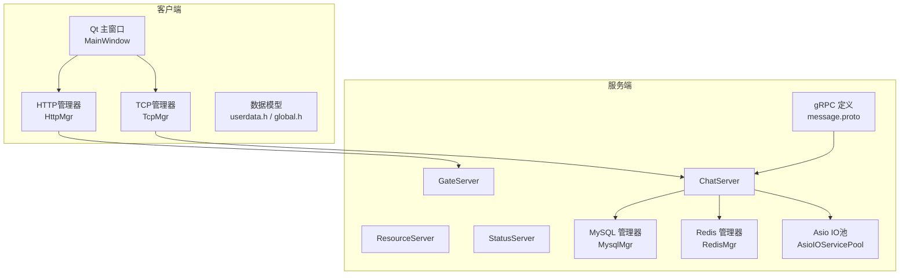
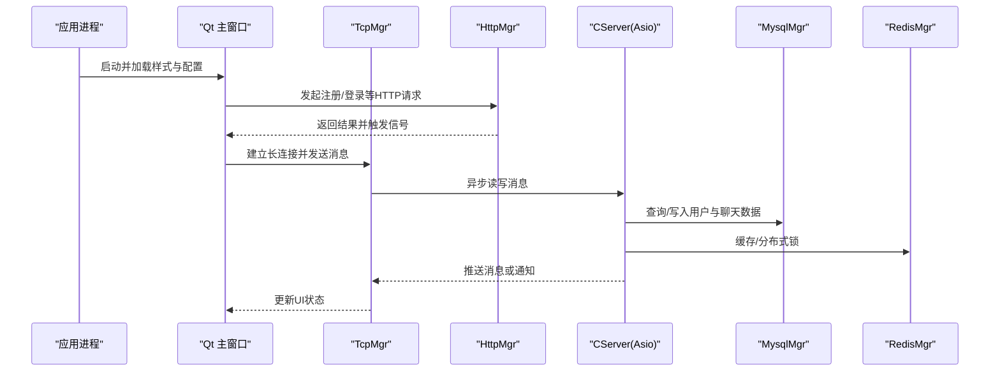
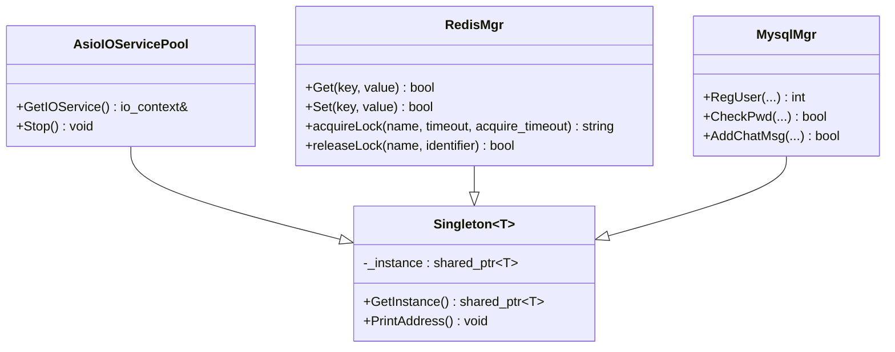
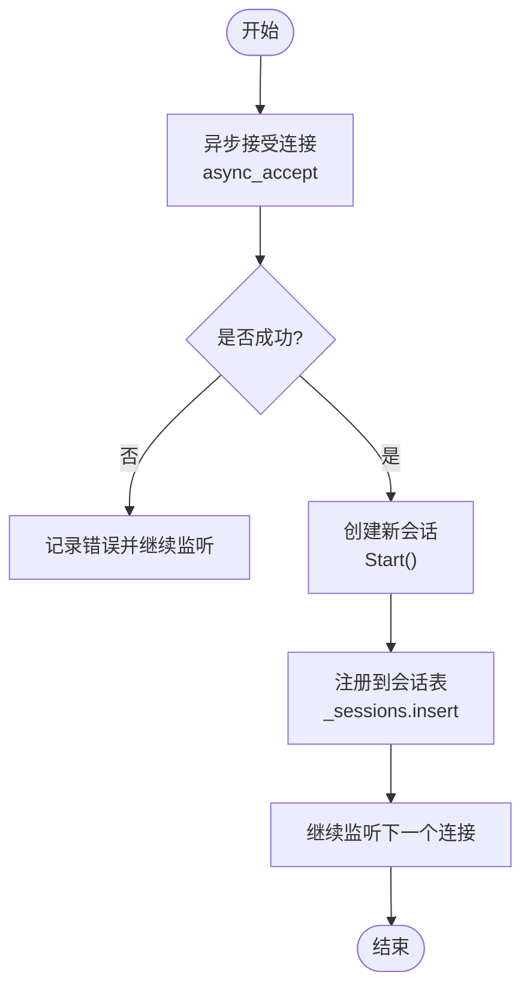
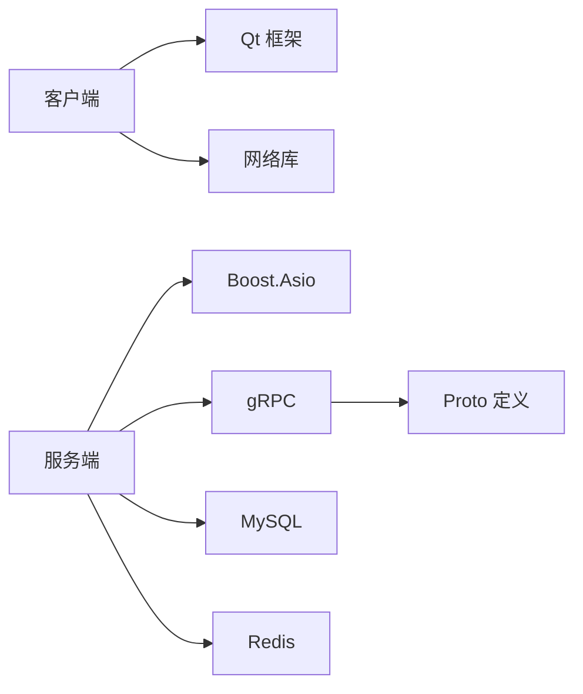

# 编码规范

<cite>
**本文引用的文件**   
- [client/llfcchat/include/singleton.h](file://client/llfcchat/include/singleton.h)
- [server/ChatServer/include/Singleton.h](file://server/ChatServer/include/Singleton.h)
- [client/llfcchat/include/global.h](file://client/llfcchat/include/global.h)
- [server/ChatServer/include/const.h](file://server/ChatServer/include/const.h)
- [client/llfcchat/src/main.cpp](file://client/llfcchat/src/main.cpp)
- [client/llfcchat/include/mainwindow.h](file://client/llfcchat/include/mainwindow.h)
- [client/llfcchat/src/mainwindow.cpp](file://client/llfcchat/src/mainwindow.cpp)
- [client/llfcchat/include/tcpmgr.h](file://client/llfcchat/include/tcpmgr.h)
- [client/llfcchat/include/httpmgr.h](file://client/llfcchat/include/httpmgr.h)
- [client/llfcchat/include/userdata.h](file://client/llfcchat/include/userdata.h)
- [server/ChatServer/include/CServer.h](file://server/ChatServer/include/CServer.h)
- [server/ChatServer/include/AsioIOServicePool.h](file://server/ChatServer/include/AsioIOServicePool.h)
- [server/ChatServer/src/CServer.cpp](file://server/ChatServer/src/CServer.cpp)
- [server/ChatServer/include/MysqlMgr.h](file://server/ChatServer/include/MysqlMgr.h)
- [server/ChatServer/include/RedisMgr.h](file://server/ChatServer/include/RedisMgr.h)
- [server/proto/chat/message.proto](file://server/proto/chat/message.proto)
</cite>

## 目录
1. [简介](#简介)
2. [项目结构](#项目结构)
3. [核心组件](#核心组件)
4. [架构总览](#架构总览)
5. [详细组件分析](#详细组件分析)
6. [依赖关系分析](#依赖关系分析)
7. [性能考量](#性能考量)
8. [故障排查指南](#故障排查指南)
9. [结论](#结论)
10. [附录](#附录)

## 简介
本规范面向LLFCChat项目的C++开发，覆盖代码风格、命名约定、注释规范、模块设计原则（含单例模式）、Qt与Boost.Asio网络编程规范、gRPC接口定义、数据库访问层设计与内存管理最佳实践。目标是在保证一致性与可维护性的同时，提升团队协作效率与系统稳定性。

## 项目结构
- 客户端（Qt）：位于 client/llfcchat，包含UI界面、网络通信、配置加载与资源管理。
- 服务端（多服务）：位于 server，包含聊天、网关、资源、状态等服务，使用Boost.Asio实现异步I/O，通过gRPC进行跨服务通信，MySQL/Redis作为持久化与缓存。
- 协议定义：proto目录存放gRPC消息与服务定义。
- CMake构建：根目录与各子模块的CMakeLists.txt负责编译与依赖管理。

图表来源
- [client/llfcchat/src/main.cpp:1-44](file://client/llfcchat/src/main.cpp#L1-L44)
- [client/llfcchat/include/mainwindow.h:1-57](file://client/llfcchat/include/mainwindow.h#L1-L57)
- [client/llfcchat/include/tcpmgr.h:1-90](file://client/llfcchat/include/tcpmgr.h#L1-L90)
- [client/llfcchat/include/httpmgr.h:1-34](file://client/llfcchat/include/httpmgr.h#L1-L34)
- [server/ChatServer/include/AsioIOServicePool.h:1-28](file://server/ChatServer/include/AsioIOServicePool.h#L1-L28)
- [server/ChatServer/include/MysqlMgr.h:1-41](file://server/ChatServer/include/MysqlMgr.h#L1-L41)
- [server/ChatServer/include/RedisMgr.h:1-305](file://server/ChatServer/include/RedisMgr.h#L1-L305)
- [server/proto/chat/message.proto:1-167](file://server/proto/chat/message.proto#L1-L167)

章节来源
- [client/llfcchat/src/main.cpp:1-44](file://client/llfcchat/src/main.cpp#L1-L44)
- [client/llfcchat/include/mainwindow.h:1-57](file://client/llfcchat/include/mainwindow.h#L1-L57)
- [client/llfcchat/include/tcpmgr.h:1-90](file://client/llfcchat/include/tcpmgr.h#L1-L90)
- [client/llfcchat/include/httpmgr.h:1-34](file://client/llfcchat/include/httpmgr.h#L1-L34)
- [server/ChatServer/include/AsioIOServicePool.h:1-28](file://server/ChatServer/include/AsioIOServicePool.h#L1-L28)
- [server/ChatServer/include/MysqlMgr.h:1-41](file://server/ChatServer/include/MysqlMgr.h#L1-L41)
- [server/ChatServer/include/RedisMgr.h:1-305](file://server/ChatServer/include/RedisMgr.h#L1-L305)
- [server/proto/chat/message.proto:1-167](file://server/proto/chat/message.proto#L1-L167)

## 核心组件
- 单例模板 Singleton：线程安全的懒初始化，基于 std::call_once 与 shared_ptr，避免拷贝与赋值。
- Qt 主窗口 MainWindow：负责界面切换、信号槽连接、生命周期管理。
- TCP管理器 TcpMgr：封装QTcpSocket，处理粘包、发送队列、消息分发与信号回调。
- HTTP管理器 HttpMgr：封装QNetworkAccessManager，统一HTTP请求与响应回调。
- 服务器 CServer：基于Boost.Asio的TCP服务器，管理会话、定时器与心跳检测。
- AsioIOServicePool：多线程IO上下文池，轮询分配io_context。
- MysqlMgr/RedisMgr：数据库与缓存管理器，提供连接池、事务封装与分布式锁能力。
- gRPC 协议 message.proto：定义跨服务消息与服务接口。

章节来源
- [client/llfcchat/include/singleton.h:1-46](file://client/llfcchat/include/singleton.h#L1-L46)
- [server/ChatServer/include/Singleton.h:1-33](file://server/ChatServer/include/Singleton.h#L1-L33)
- [client/llfcchat/src/mainwindow.cpp:1-164](file://client/llfcchat/src/mainwindow.cpp#L1-L164)
- [client/llfcchat/include/tcpmgr.h:1-90](file://client/llfcchat/include/tcpmgr.h#L1-L90)
- [client/llfcchat/include/httpmgr.h:1-34](file://client/llfcchat/include/httpmgr.h#L1-L34)
- [server/ChatServer/include/CServer.h:1-33](file://server/ChatServer/include/CServer.h#L1-L33)
- [server/ChatServer/src/CServer.cpp:1-133](file://server/ChatServer/src/CServer.cpp#L1-L133)
- [server/ChatServer/include/AsioIOServicePool.h:1-28](file://server/ChatServer/include/AsioIOServicePool.h#L1-L28)
- [server/ChatServer/include/MysqlMgr.h:1-41](file://server/ChatServer/include/MysqlMgr.h#L1-L41)
- [server/ChatServer/include/RedisMgr.h:1-305](file://server/ChatServer/include/RedisMgr.h#L1-L305)
- [server/proto/chat/message.proto:1-167](file://server/proto/chat/message.proto#L1-L167)

## 架构总览
客户端通过Qt事件循环驱动UI与网络操作；TcpMgr与HttpMgr分别负责长连接与HTTP短连接；服务端以CServer为核心，结合AsioIOServicePool实现高并发异步I/O；业务逻辑通过MysqlMgr与RedisMgr访问持久化与缓存；跨服务通信采用gRPC。

图表来源
- [client/llfcchat/src/mainwindow.cpp:1-164](file://client/llfcchat/src/mainwindow.cpp#L1-L164)
- [client/llfcchat/include/httpmgr.h:1-34](file://client/llfcchat/include/httpmgr.h#L1-L34)
- [client/llfcchat/include/tcpmgr.h:1-90](file://client/llfcchat/include/tcpmgr.h#L1-L90)
- [server/ChatServer/src/CServer.cpp:1-133](file://server/ChatServer/src/CServer.cpp#L1-L133)
- [server/ChatServer/include/MysqlMgr.h:1-41](file://server/ChatServer/include/MysqlMgr.h#L1-L41)
- [server/ChatServer/include/RedisMgr.h:1-305](file://server/ChatServer/include/RedisMgr.h#L1-L305)

## 详细组件分析

### 命名与代码风格规范
- 类名：大驼峰（如 MainWindow、TcpMgr、CServer）。
- 函数名：动词+名词，大驼峰（如 SlotSwitchLogin、StartAccept、GetSession）。
- 变量名：小驼峰或下划线分隔（成员变量前缀 _ 如 _port、_sessions）。
- 常量与宏：全大写+下划线（如 MAX_FILE_LEN、HEAD_TOTAL_LEN）。
- 枚举：首字母大写（如 ReqId、ErrorCodes、MsgType）。
- 头文件保护：#ifndef/#define/#endif 或 #pragma once。
- 缩进与格式：4空格缩进，行宽建议不超过120字符，花括号独占一行。
- 注释：文件头包含@file/@brief/@author/@date/@history；函数级注释说明参数、返回值与异常；关键逻辑行内注释解释意图。

章节来源
- [client/llfcchat/include/global.h:1-296](file://client/llfcchat/include/global.h#L1-L296)
- [server/ChatServer/include/const.h:1-104](file://server/ChatServer/include/const.h#L1-L104)
- [client/llfcchat/include/mainwindow.h:1-57](file://client/llfcchat/include/mainwindow.h#L1-L57)
- [server/ChatServer/include/CServer.h:1-33](file://server/ChatServer/include/CServer.h#L1-L33)

### 单例模式使用规范
- 使用 Singleton<T> 模板获取全局唯一实例，禁止拷贝与赋值。
- 构造私有化，通过 GetInstance() 获取 shared_ptr。
- 适用于无状态或全局共享对象（如 IO池、配置、数据库连接池）。
- 析构顺序需明确，避免在静态销毁阶段访问已销毁的单例。

图表来源
- [client/llfcchat/include/singleton.h:1-46](file://client/llfcchat/include/singleton.h#L1-L46)
- [server/ChatServer/include/Singleton.h:1-33](file://server/ChatServer/include/Singleton.h#L1-L33)
- [server/ChatServer/include/AsioIOServicePool.h:1-28](file://server/ChatServer/include/AsioIOServicePool.h#L1-L28)
- [server/ChatServer/include/RedisMgr.h:1-305](file://server/ChatServer/include/RedisMgr.h#L1-L305)
- [server/ChatServer/include/MysqlMgr.h:1-41](file://server/ChatServer/include/MysqlMgr.h#L1-L41)

章节来源
- [client/llfcchat/include/singleton.h:1-46](file://client/llfcchat/include/singleton.h#L1-L46)
- [server/ChatServer/include/Singleton.h:1-33](file://server/ChatServer/include/Singleton.h#L1-L33)

### 头文件组织与源文件结构
- 头文件仅声明接口与必要类型，避免包含实现细节。
- 源文件包含对应头文件与实现逻辑，必要时引入第三方库。
- 公共类型集中放置于 global.h/userdata.h，减少重复定义。
- 每个模块一个主头文件，便于引用与维护。

章节来源
- [client/llfcchat/include/global.h:1-296](file://client/llfcchat/include/global.h#L1-L296)
- [client/llfcchat/include/userdata.h:1-288](file://client/llfcchat/include/userdata.h#L1-L288)
- [client/llfcchat/include/mainwindow.h:1-57](file://client/llfcchat/include/mainwindow.h#L1-L57)

### 依赖管理策略
- 客户端依赖Qt、JSON、网络库；服务端依赖Boost.Asio、gRPC、MySQL、Redis。
- 通过CMake统一管理依赖与编译选项，避免硬编码路径。
- 模块间通过接口与头文件耦合，降低直接依赖。

章节来源
- [client/llfcchat/src/main.cpp:1-44](file://client/llfcchat/src/main.cpp#L1-L44)
- [server/ChatServer/include/CServer.h:1-33](file://server/ChatServer/include/CServer.h#L1-L33)

### Qt开发特定规范
- 信号槽机制：使用现代connect语法，确保生命周期安全；避免循环引用。
- UI组件设计：将样式与布局分离，使用QSS统一主题；自定义控件继承QWidget并重绘。
- 事件处理：优先使用事件过滤器与信号槽，避免阻塞UI线程。
- 资源管理：使用RAII与智能指针，避免内存泄漏。

章节来源
- [client/llfcchat/src/mainwindow.cpp:1-164](file://client/llfcchat/src/mainwindow.cpp#L1-L164)
- [client/llfcchat/include/httpmgr.h:1-34](file://client/llfcchat/include/httpmgr.h#L1-L34)

### Boost.Asio网络编程规范
- 异步I/O：所有socket操作使用async_*系列，避免阻塞。
- 错误处理：检查boost::system::error_code，记录日志并优雅降级。
- 资源管理：使用shared_ptr与enable_shared_from_this，避免悬空指针。
- 线程模型：通过AsioIOServicePool分配io_context，避免竞争。

图表来源
- [server/ChatServer/src/CServer.cpp:1-133](file://server/ChatServer/src/CServer.cpp#L1-L133)
- [server/ChatServer/include/CServer.h:1-33](file://server/ChatServer/include/CServer.h#L1-L33)

章节来源
- [server/ChatServer/include/AsioIOServicePool.h:1-28](file://server/ChatServer/include/AsioIOServicePool.h#L1-L28)
- [server/ChatServer/src/CServer.cpp:1-133](file://server/ChatServer/src/CServer.cpp#L1-L133)

### gRPC接口定义规范
- 使用proto3语法，字段命名小写下划线，按语义分组。
- 每个service定义清晰的rpc方法，输入输出消息独立。
- 错误码统一在返回消息中体现，避免异常传播。
- 版本控制：新增字段保持向后兼容，废弃字段标记deprecated。

章节来源
- [server/proto/chat/message.proto:1-167](file://server/proto/chat/message.proto#L1-L167)

### 数据库访问层设计模式
- 分层清晰：MysqlMgr暴露高层API，MysqlDao负责具体SQL。
- 连接复用：连接池与事务封装，减少开销。
- 错误处理：统一错误码与异常转换，便于上层处理。
- 数据映射：将结果集映射为领域对象，提高可读性。

章节来源
- [server/ChatServer/include/MysqlMgr.h:1-41](file://server/ChatServer/include/MysqlMgr.h#L1-L41)

### 内存管理最佳实践
- 优先使用std::shared_ptr与std::unique_ptr管理动态内存。
- 避免裸指针与手动new/delete，防止泄漏与悬挂指针。
- 对频繁分配的对象使用对象池或预分配策略。
- 在Qt中使用父对象所有权模型，自动释放UI资源。

章节来源
- [client/llfcchat/include/singleton.h:1-46](file://client/llfcchat/include/singleton.h#L1-L46)
- [server/ChatServer/include/RedisMgr.h:1-305](file://server/ChatServer/include/RedisMgr.h#L1-L305)

## 依赖关系分析
- 客户端依赖：Qt框架、网络库、JSON解析。
- 服务端依赖：Boost.Asio、gRPC、MySQL、Redis。
- 模块间依赖：通过接口与头文件解耦，单例模式提供全局访问点。

图表来源
- [client/llfcchat/src/main.cpp:1-44](file://client/llfcchat/src/main.cpp#L1-L44)
- [server/ChatServer/include/CServer.h:1-33](file://server/ChatServer/include/CServer.h#L1-L33)
- [server/proto/chat/message.proto:1-167](file://server/proto/chat/message.proto#L1-L167)

章节来源
- [client/llfcchat/src/main.cpp:1-44](file://client/llfcchat/src/main.cpp#L1-L44)
- [server/ChatServer/include/CServer.h:1-33](file://server/ChatServer/include/CServer.h#L1-L33)
- [server/proto/chat/message.proto:1-167](file://server/proto/chat/message.proto#L1-L167)

## 性能考量
- 异步I/O：避免阻塞调用，充分利用CPU与网络带宽。
- 连接池：复用数据库与Redis连接，减少握手开销。
- 序列化：使用高效的二进制协议（如protobuf），减少网络传输。
- 缓存：热点数据放入Redis，降低数据库压力。
- 内存：避免频繁分配，使用对象池与预分配策略。

## 故障排查指南
- 网络连接失败：检查端口、防火墙、超时设置；记录错误码与日志。
- 粘包/拆包：确认包头长度与校验，调试缓冲区拼接逻辑。
- 单例问题：确保线程安全，避免循环依赖与死锁。
- 数据库连接：检查连接池大小、认证信息、慢查询。
- Redis连接：PING健康检查，自动重连与错误恢复。

章节来源
- [client/llfcchat/include/tcpmgr.h:1-90](file://client/llfcchat/include/tcpmgr.h#L1-L90)
- [server/ChatServer/include/RedisMgr.h:1-305](file://server/ChatServer/include/RedisMgr.h#L1-L305)

## 结论
本规范为LLFCChat项目提供了统一的编码标准与设计原则，涵盖命名、注释、模块设计、网络编程、gRPC接口、数据库访问与内存管理。遵循这些规范有助于提升代码质量、可维护性与系统稳定性。

## 附录
- 参考文件清单见“本文引用的文件”部分。
- 建议在团队内部进行规范培训与代码审查，确保一致性。