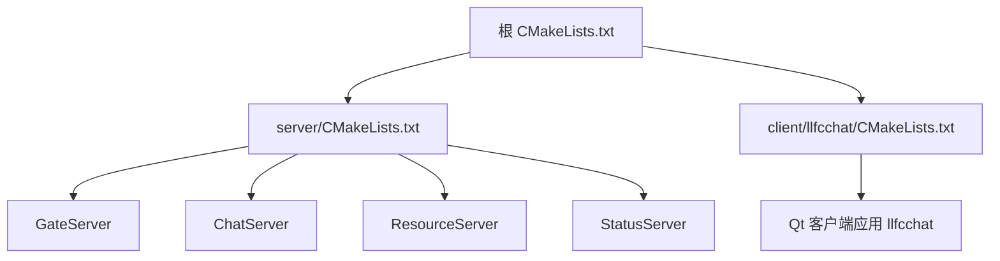
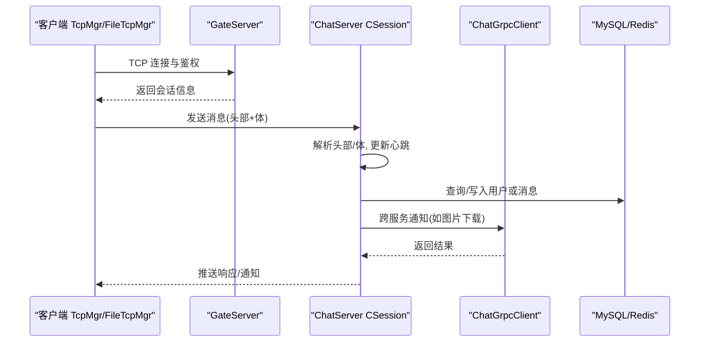
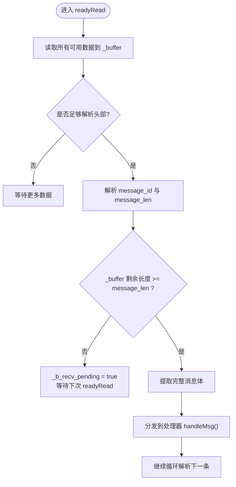
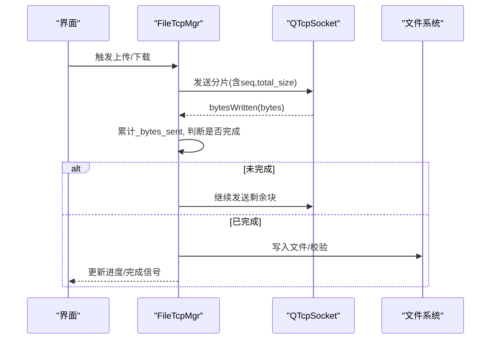
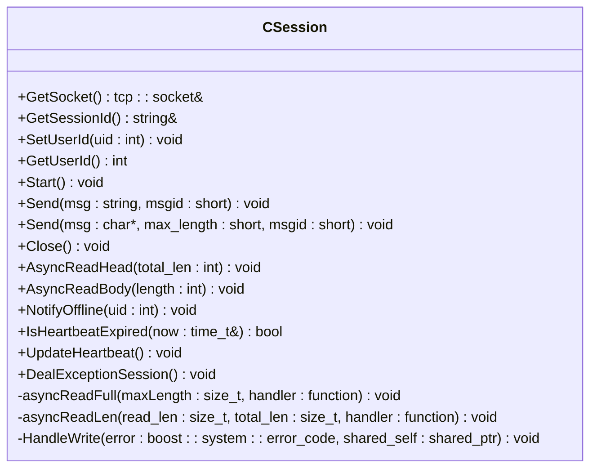
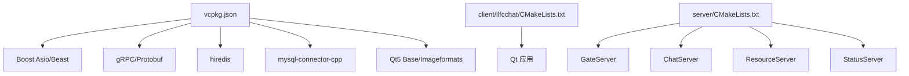

# 调试技巧

<cite>
**本文引用的文件**   
- [CMakeLists.txt](file://CMakeLists.txt)
- [CMakePresets.json](file://CMakePresets.json)
- [vcpkg.json](file://vcpkg.json)
- [client/llfcchat/CMakeLists.txt](file://client/llfcchat/CMakeLists.txt)
- [server/CMakeLists.txt](file://server/CMakeLists.txt)
- [client/llfcchat/src/main.cpp](file://client/llfcchat/src/main.cpp)
- [client/llfcchat/src/tcpmgr.cpp](file://client/llfcchat/src/tcpmgr.cpp)
- [client/llfcchat/src/filetcpmgr.cpp](file://client/llfcchat/src/filetcpmgr.cpp)
- [server/ChatServer/include/CSession.h](file://server/ChatServer/include/CSession.h)
- [server/ChatServer/src/CSession.cpp](file://server/ChatServer/src/CSession.cpp)
- [server/ChatServer/src/ChatGrpcClient.cpp](file://server/ChatServer/src/ChatGrpcClient.cpp)
- [server/GateServer/src/GateServer.cpp](file://server/GateServer/src/GateServer.cpp)
- [server/ChatServer/include/MysqlDao.h](file://server/ChatServer/include/MysqlDao.h)
- [server/ChatServer/include/RedisMgr.h](file://server/ChatServer/include/RedisMgr.h)
- [server/GateServer/include/RedisMgr.h](file://server/GateServer/include/RedisMgr.h)
- [server/ResourceServer/include/RedisMgr.h](file://server/ResourceServer/include/RedisMgr.h)
- [开发文档/day15-客户端Tcp管理类设计.md](file://开发文档/day15-客户端Tcp管理类设计.md)
- [开发文档/day33单服程踢人逻辑.md](file://开发文档/day33单服程踢人逻辑.md)
- [开发文档/day42-Qt粘包引发的血案.md](file://开发文档/day42-Qt粘包引发的血案.md)
- [开发文档/day09-redis服务搭建.md](file://开发文档/day09-redis服务搭建.md)
- [开发文档/day27-分布式服务设计.md](file://开发文档/day27-分布式服务设计.md)
- [开发文档/day41-通知客户端异步下载聊天图片.md](file://开发文档/day41-通知客户端异步下载聊天图片.md)
</cite>

## 目录
1. [简介](#简介)
2. [项目结构](#项目结构)
3. [核心组件](#核心组件)
4. [架构总览](#架构总览)
5. [详细组件分析](#详细组件分析)
6. [依赖关系分析](#依赖关系分析)
7. [性能与内存分析](#性能与内存分析)
8. [常见问题定位](#常见问题定位)
9. [日志分析方法](#日志分析方法)
10. [远程与容器化调试](#远程与容器化调试)
11. [结论](#结论)

## 简介
本指南面向LLFCChat项目的调试实践，覆盖客户端（Qt）与服务端（C++/gRPC/Asio/MySQL/Redis）的调试方法、网络与数据库问题排查、日志与性能分析、以及远程与容器化环境下的调试方案。内容基于仓库中的实际代码与开发文档，提供可操作的步骤与图示，帮助快速定位并解决问题。

## 项目结构
- 根构建系统使用CMake，要求Ninja Multi-Config生成器，统一配置vcpkg依赖与子模块。
- 客户端为Qt应用，包含TCP通信、HTTP管理、UI界面等。
- 服务端包含GateServer、ChatServer、ResourceServer、StatusServer等多个独立进程，通过gRPC与TCP协作。
- 配置文件采用INI格式，由ConfigMgr读取；运行期输出目录与资源拷贝在CMake中定义。

**图表来源** 
- [CMakeLists.txt:1-33](file://CMakeLists.txt#L1-L33)
- [server/CMakeLists.txt:1-38](file://server/CMakeLists.txt#L1-L38)
- [client/llfcchat/CMakeLists.txt:1-222](file://client/llfcchat/CMakeLists.txt#L1-L222)

**章节来源**
- [CMakeLists.txt:1-33](file://CMakeLists.txt#L1-L33)
- [CMakePresets.json:1-35](file://CMakePresets.json#L1-L35)
- [vcpkg.json:1-31](file://vcpkg.json#L1-L31)
- [client/llfcchat/CMakeLists.txt:1-222](file://client/llfcchat/CMakeLists.txt#L1-L222)
- [server/CMakeLists.txt:1-38](file://server/CMakeLists.txt#L1-L38)

## 核心组件
- 客户端网络层：TcpMgr负责TCP连接、错误处理、readyRead粘包解析；FileTcpMgr负责大文件分片上传/下载与进度回调。
- 服务端会话层：CSession封装Asio异步读写、心跳检测、异常清理与消息投递到LogicSystem。
- gRPC客户端：ChatGrpcClient维护多服务器连接池，用于跨服务通知与数据同步。
- 数据库与缓存：MysqlDao实现连接池健康检查与重连；各服务RedisMgr实现连接池、PING保活与认证。

**章节来源**
- [client/llfcchat/src/tcpmgr.cpp:63-91](file://client/llfcchat/src/tcpmgr.cpp#L63-L91)
- [client/llfcchat/src/filetcpmgr.cpp:399-433](file://client/llfcchat/src/filetcpmgr.cpp#L399-L433)
- [server/ChatServer/include/CSession.h:28-86](file://server/ChatServer/include/CSession.h#L28-L86)
- [server/ChatServer/src/CSession.cpp:90-131](file://server/ChatServer/src/CSession.cpp#L90-L131)
- [server/ChatServer/src/ChatGrpcClient.cpp:1-60](file://server/ChatServer/src/ChatGrpcClient.cpp#L1-L60)
- [server/ChatServer/include/MysqlDao.h:42-145](file://server/ChatServer/include/MysqlDao.h#L42-L145)
- [server/ChatServer/include/RedisMgr.h:198-246](file://server/ChatServer/include/RedisMgr.h#L198-L246)

## 架构总览
下图展示客户端与服务端交互的关键路径：客户端通过TcpMgr建立TCP连接，发送/接收自定义协议帧；服务端CSession解析头部与体，投递至逻辑队列；跨服务间通过ChatGrpcClient进行gRPC调用；状态与资源访问通过GateServer与ResourceServer协同完成。

**图表来源** 
- [client/llfcchat/src/tcpmgr.cpp:63-91](file://client/llfcchat/src/tcpmgr.cpp#L63-L91)
- [server/ChatServer/src/CSession.cpp:133-194](file://server/ChatServer/src/CSession.cpp#L133-L194)
- [server/ChatServer/src/ChatGrpcClient.cpp:145-204](file://server/ChatServer/src/ChatGrpcClient.cpp#L145-L204)

## 详细组件分析

### 客户端TCP管理器（TcpMgr）
- 功能要点：连接事件、错误分类、readyRead循环解析、粘包处理、信号回调。
- 调试建议：
  - 在readyRead分支设置断点，观察_buffer长度与stream位置变化。
  - 打印message_id与message_len，验证头体一致性。
  - 对QTcpSocket::error进行分类输出，区分拒绝、超时、主机未找到等。
- 常见问题：
  - readyRead多次累积导致粘包，需确保每次循环正确mid与len后截取buffer。
  - 错误码未覆盖全部类型，可能导致静默失败。

**图表来源** 
- [client/llfcchat/src/tcpmgr.cpp:63-91](file://client/llfcchat/src/tcpmgr.cpp#L63-L91)
- [开发文档/day15-客户端Tcp管理类设计.md:37-132](file://开发文档/day15-客户端Tcp管理类设计.md#L37-L132)

**章节来源**
- [client/llfcchat/src/tcpmgr.cpp:63-91](file://client/llfcchat/src/tcpmgr.cpp#L63-L91)
- [开发文档/day15-客户端Tcp管理类设计.md:37-132](file://开发文档/day15-客户端Tcp管理类设计.md#L37-L132)

### 客户端文件传输（FileTcpMgr）
- 功能要点：分片上传/下载、序列号确认、进度回调、暂停恢复、完成后复制与刷新UI。
- 调试建议：
  - 在bytesWritten回调中记录已发送字节数，验证队列消费顺序。
  - 在写文件分支打印写入大小与实际期望值，检查磁盘IO。
  - 在is_last分支确认最终状态与信号发射。
- 常见问题：
  - bytesWritten返回值小于请求长度时未继续发送。
  - 最后一片处理逻辑遗漏，导致进度不更新。

**图表来源** 
- [client/llfcchat/src/filetcpmgr.cpp:399-433](file://client/llfcchat/src/filetcpmgr.cpp#L399-L433)
- [client/llfcchat/src/filetcpmgr.cpp:656-690](file://client/llfcchat/src/filetcpmgr.cpp#L656-L690)
- [client/llfcchat/src/filetcpmgr.cpp:769-805](file://client/llfcchat/src/filetcpmgr.cpp#L769-L805)

**章节来源**
- [client/llfcchat/src/filetcpmgr.cpp:399-433](file://client/llfcchat/src/filetcpmgr.cpp#L399-L433)
- [client/llfcchat/src/filetcpmgr.cpp:656-690](file://client/llfcchat/src/filetcpmgr.cpp#L656-L690)
- [client/llfcchat/src/filetcpmgr.cpp:769-805](file://client/llfcchat/src/filetcpmgr.cpp#L769-L805)

### 服务端会话（CSession）
- 功能要点：异步读头/体、心跳更新、异常清理、消息投递、发送队列串行化。
- 调试建议：
  - 在AsyncReadHead/AsyncReadBody断点处检查msg_id/msg_len合法性。
  - 在HandleWrite分支观察_send_que长度与错误码。
  - 在DealExceptionSession中验证分布式锁获取与Redis键清理。
- 常见问题：
  - 长度不匹配直接Close但未清理session，导致资源泄漏。
  - 心跳过期判定阈值不合理，导致误判离线。

**图表来源** 
- [server/ChatServer/include/CSession.h:28-86](file://server/ChatServer/include/CSession.h#L28-L86)
- [server/ChatServer/src/CSession.cpp:196-220](file://server/ChatServer/src/CSession.cpp#L196-L220)

**章节来源**
- [server/ChatServer/include/CSession.h:28-86](file://server/ChatServer/include/CSession.h#L28-L86)
- [server/ChatServer/src/CSession.cpp:90-131](file://server/ChatServer/src/CSession.cpp#L90-L131)
- [server/ChatServer/src/CSession.cpp:133-194](file://server/ChatServer/src/CSession.cpp#L133-L194)
- [server/ChatServer/src/CSession.cpp:196-220](file://server/ChatServer/src/CSession.cpp#L196-L220)
- [开发文档/day33单服程踢人逻辑.md:397-460](file://开发文档/day33单服程踢人逻辑.md#L397-L460)

### gRPC客户端（ChatGrpcClient）
- 功能要点：多服务器连接池、上下文构造、调用封装、错误码映射。
- 调试建议：
  - 在getConnection/returnConnection处打点，观察池大小与归还情况。
  - 在Status.ok()分支外打印错误码，定位远端失败原因。
- 常见问题：
  - 连接池耗尽导致阻塞或超时。
  - 未释放stub造成连接泄漏。

**章节来源**
- [server/ChatServer/src/ChatGrpcClient.cpp:1-60](file://server/ChatServer/src/ChatGrpcClient.cpp#L1-L60)
- [server/ChatServer/src/ChatGrpcClient.cpp:145-204](file://server/ChatServer/src/ChatGrpcClient.cpp#L145-L204)
- [开发文档/day41-通知客户端异步下载聊天图片.md:159-215](file://开发文档/day41-通知客户端异步下载聊天图片.md#L159-L215)

### MySQL连接池（MysqlDao）
- 功能要点：后台线程周期性检查连接健康、失败计数、自动重连。
- 调试建议：
  - 在checkConnectionPro中打印当前pool.size与fail_count。
  - 在reconnect分支捕获SQLException并记录堆栈。
- 常见问题：
  - 检查间隔过长导致故障恢复延迟。
  - 重连失败未回退策略，导致业务持续失败。

**章节来源**
- [server/ChatServer/include/MysqlDao.h:42-145](file://server/ChatServer/include/MysqlDao.h#L42-L145)

### Redis连接池（RedisMgr）
- 功能要点：连接池PING保活、AUTH认证、失败重试、线程安全。
- 调试建议：
  - 在checkThread中打印reply是否为空、AUTH错误类型。
  - 监控fail_count变化趋势，评估稳定性。
- 常见问题：
  - AUTH失败后未正确freeReplyObject导致内存泄漏。
  - 连接池初始化参数不当导致频繁重建。

**章节来源**
- [server/ChatServer/include/RedisMgr.h:198-246](file://server/ChatServer/include/RedisMgr.h#L198-L246)
- [server/GateServer/include/RedisMgr.h:198-246](file://server/GateServer/include/RedisMgr.h#L198-L246)
- [server/ResourceServer/include/RedisMgr.h:194-282](file://server/ResourceServer/include/RedisMgr.h#L194-L282)
- [开发文档/day09-redis服务搭建.md:753-808](file://开发文档/day09-redis服务搭建.md#L753-L808)

## 依赖关系分析
- 构建依赖：vcpkg管理Boost、gRPC、protobuf、hiredis、mysql-connector-cpp、Qt5等。
- 运行时依赖：config.ini配置路径、静态资源static目录拷贝、动态库加载。
- 服务间依赖：GateServer作为入口，ChatServer处理聊天逻辑，ResourceServer处理文件，StatusServer提供状态。

**图表来源** 
- [vcpkg.json:1-31](file://vcpkg.json#L1-L31)
- [client/llfcchat/CMakeLists.txt:1-222](file://client/llfcchat/CMakeLists.txt#L1-L222)
- [server/CMakeLists.txt:1-38](file://server/CMakeLists.txt#L1-L38)

**章节来源**
- [vcpkg.json:1-31](file://vcpkg.json#L1-L31)
- [client/llfcchat/CMakeLists.txt:1-222](file://client/llfcchat/CMakeLists.txt#L1-L222)
- [server/CMakeLists.txt:1-38](file://server/CMakeLists.txt#L1-L38)

## 性能与内存分析
- 客户端性能：
  - 使用Qt Creator的性能剖析器（QProfiler）定位UI卡顿与网络I/O热点。
  - 在FileTcpMgr的bytesWritten与文件写入路径添加耗时统计。
- 服务端性能：
  - 使用gRPC内置指标或Prometheus导出调用耗时与错误率。
  - 对CSession的发送队列长度与HandleWrite耗时进行采样。
- 内存分析：
  - Windows下可使用Visual Studio诊断工具或AddressSanitizer（编译选项启用）。
  - Linux下使用Valgrind检测内存泄漏与越界访问。
  - 针对Redis/MySQL连接对象生命周期，确保析构与释放路径正确。

[本节为通用指导，不直接分析具体文件]

## 常见问题定位

### TCP粘包问题排查
- 现象：readyRead多次累积导致解析错位。
- 定位方法：
  - 在readyRead分支打印_buffer长度与stream.pos变化。
  - 确认每次解析头部后正确mid与len并截取buffer。
  - 打断点模拟慢速处理，观察粘包形成过程。
- 参考实现与说明：
  - 客户端TcpMgr的readyRead循环与缓冲处理。
  - 开发文档day42详细解释打断点暴露粘包的原理。

**章节来源**
- [client/llfcchat/src/tcpmgr.cpp:63-91](file://client/llfcchat/src/tcpmgr.cpp#L63-L91)
- [开发文档/day15-客户端Tcp管理类设计.md:37-132](file://开发文档/day15-客户端Tcp管理类设计.md#L37-L132)
- [开发文档/day42-Qt粘包引发的血案.md:232-255](file://开发文档/day42-Qt粘包引发的血案.md#L232-L255)

### gRPC通信故障诊断
- 现象：跨服务调用失败或超时。
- 定位方法：
  - 在ChatGrpcClient getConnection/returnConnection打点，检查池大小与归还。
  - 打印Status错误码与消息，定位远端异常。
  - 检查配置中PeerServer列表与端口是否正确。
- 参考实现：
  - ChatGrpcClient的连接池管理与调用封装。

**章节来源**
- [server/ChatServer/src/ChatGrpcClient.cpp:1-60](file://server/ChatServer/src/ChatGrpcClient.cpp#L1-L60)
- [server/ChatServer/src/ChatGrpcClient.cpp:145-204](file://server/ChatServer/src/ChatGrpcClient.cpp#L145-L204)

### MySQL连接池问题
- 现象：查询失败、连接断开、重连频繁。
- 定位方法：
  - 在checkConnectionPro中打印pool.size与fail_count。
  - 在reconnect分支捕获SQLException并记录堆栈。
  - 调整检查间隔与阈值，避免误判。
- 参考实现：
  - MysqlDao的连接健康检查与重连逻辑。

**章节来源**
- [server/ChatServer/include/MysqlDao.h:42-145](file://server/ChatServer/include/MysqlDao.h#L42-L145)

### Redis连接异常
- 现象：AUTH失败、PING无响应、连接池耗尽。
- 定位方法：
  - 在checkThread中打印reply为空与AUTH错误类型。
  - 监控fail_count与连接池大小，评估稳定性。
  - 确保freeReplyObject调用正确，避免内存泄漏。
- 参考实现：
  - 各服务RedisMgr的连接保活与认证流程。

**章节来源**
- [server/ChatServer/include/RedisMgr.h:198-246](file://server/ChatServer/include/RedisMgr.h#L198-L246)
- [server/GateServer/include/RedisMgr.h:198-246](file://server/GateServer/include/RedisMgr.h#L198-L246)
- [server/ResourceServer/include/RedisMgr.h:194-282](file://server/ResourceServer/include/RedisMgr.h#L194-L282)
- [开发文档/day09-redis服务搭建.md:753-808](file://开发文档/day09-redis服务搭建.md#L753-L808)

## 日志分析方法
- 日志级别配置：
  - 客户端使用qDebug输出关键路径与错误码，建议在release模式关闭或降级。
  - 服务端使用std::cout/cerr输出，结合环境变量或配置文件控制级别。
- 日志文件管理：
  - 将stdout/stderr重定向到文件，按时间或大小轮转。
  - 使用CMakePostBuild复制config.ini与static资源，便于运行期定位。
- 关键信息提取：
  - 在CSession的AsyncReadHead/AsyncReadBody打印msg_id/msg_len与错误码。
  - 在FileTcpMgr的bytesWritten与文件写入路径打印进度与状态。
- 性能指标监控：
  - 对gRPC调用耗时、MySQL/Redis操作耗时进行采样与上报。
  - 使用系统工具（如perf、Windows Performance Monitor）辅助分析。

**章节来源**
- [client/llfcchat/src/main.cpp:1-44](file://client/llfcchat/src/main.cpp#L1-L44)
- [client/llfcchat/CMakeLists.txt:212-222](file://client/llfcchat/CMakeLists.txt#L212-L222)
- [server/ChatServer/src/CSession.cpp:133-194](file://server/ChatServer/src/CSession.cpp#L133-L194)
- [server/ChatServer/src/CSession.cpp:196-220](file://server/ChatServer/src/CSession.cpp#L196-L220)
- [client/llfcchat/src/filetcpmgr.cpp:399-433](file://client/llfcchat/src/filetcpmgr.cpp#L399-L433)

## 远程与容器化调试
- 远程调试：
  - 使用VS Code Remote SSH或Rider Remote连接到目标机器，附加进程调试。
  - 在服务端进程启动时开启gRPC调试端口，配合grpcurl或gRPC控制台测试。
- 容器化调试：
  - 使用Docker运行MySQL/Redis，挂载配置文件与数据目录，便于持久化与查看。
  - 在容器内执行命令进入数据库或Redis CLI，验证连通性与数据。
- 构建与部署：
  - 使用CMakePresets统一构建配置，支持Debug/Release切换。
  - 在CI环境中安装vcpkg依赖，确保一致性与可重复性。

**章节来源**
- [CMakePresets.json:1-35](file://CMakePresets.json#L1-L35)
- [开发文档/day11-注册功能.md:310-367](file://开发文档/day11-注册功能.md#L310-L367)
- [开发文档/day27-分布式服务设计.md:221-276](file://开发文档/day27-分布式服务设计.md#L221-L276)

## 结论
通过对客户端与服务端核心组件的深入分析与调试实践，结合日志、性能与内存工具，可有效定位TCP粘包、gRPC通信、MySQL/Redis连接等问题。建议在开发过程中尽早引入完善的日志与监控机制，并结合容器化与远程调试提升效率与可靠性。