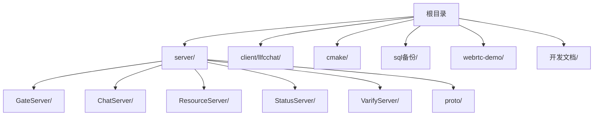
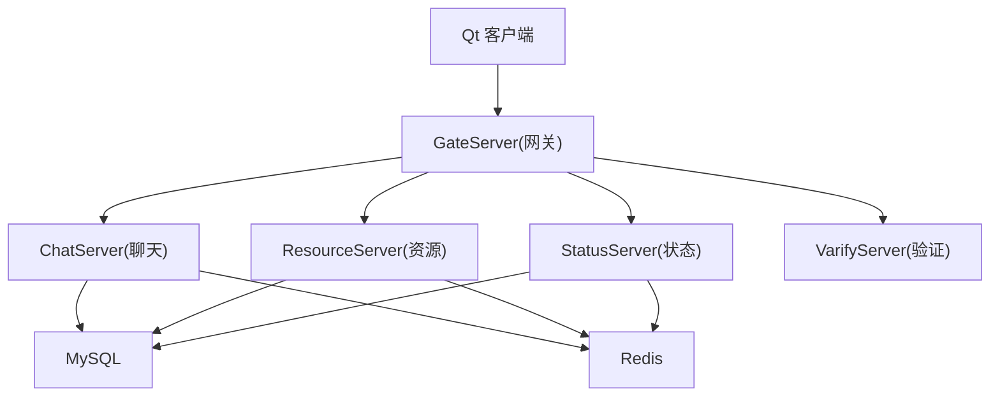
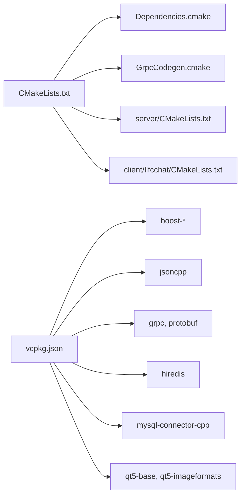

# 贡献指南

<cite>
**本文引用的文件**   
- [README.md](file://README.md)
- [CMakeLists.txt](file://CMakeLists.txt)
- [CMakePresets.json](file://CMakePresets.json)
- [vcpkg.json](file://vcpkg.json)
- [.gitignore](file://.gitignore)
- [开发文档/day01-项目结构概述.md](file://开发文档/day01-项目结构概述.md)
</cite>

## 目录
1. [简介](#简介)
2. [项目结构](#项目结构)
3. [核心组件](#核心组件)
4. [架构总览](#架构总览)
5. [详细组件分析](#详细组件分析)
6. [依赖分析](#依赖分析)
7. [性能考虑](#性能考虑)
8. [故障排查指南](#故障排查指南)
9. [结论](#结论)
10. [附录](#附录)

## 简介
本贡献指南面向希望参与 LLFCChat 项目的开发者，涵盖从 Fork、克隆、创建功能分支到提交代码与 Pull Request 的完整流程；同时给出代码提交规范、代码审查标准与合并策略、版本发布流程、问题报告与功能请求模板、文档贡献方式以及社区行为准则与支持渠道。LLFCChat 是一个 C++ 全栈聊天项目实战案例，涵盖 gRPC、并发线程、网络编程、Qt 客户端、数据库等多种技术综合应用。

**章节来源**
- [README.md:1-112](file://README.md#L1-L112)

## 项目结构
仓库采用多服务 + Qt 客户端的分层组织：
- server：包含 GateServer、ChatServer、ResourceServer、StatusServer、VarifyServer 等多个后端服务，使用 CMake 构建，依赖 vcpkg 管理第三方库。
- client/llfcchat：Qt 客户端工程，包含 UI、资源、头文件与实现。
- cmake：自定义 CMake 脚本（依赖解析、gRPC 代码生成）。
- sql备份：数据库脚本。
- webrtc-demo：WebRTC 信令服务器示例。
- 开发文档：按天记录的开发文档，覆盖从环境搭建到功能实现的完整链路。

**图表来源**
- [CMakeLists.txt:1-34](file://CMakeLists.txt#L1-L34)
- [CMakePresets.json:1-36](file://CMakePresets.json#L1-L36)

**章节来源**
- [CMakeLists.txt:1-34](file://CMakeLists.txt#L1-L34)
- [CMakePresets.json:1-36](file://CMakePresets.json#L1-L36)
- [开发文档/day01-项目结构概述.md:1-168](file://开发文档/day01-项目结构概述.md#L1-L168)

## 核心组件
- 构建系统：CMake 3.25+，要求 Ninja Multi-Config 生成器，禁止源码内构建；通过 CMakePresets 提供 Windows 配置与构建预设。
- 依赖管理：vcpkg 清单定义 Boost、jsoncpp、grpc、protobuf、hiredis、mysql-connector-cpp、Qt5 等依赖。
- 忽略规则：.gitignore 排除构建产物、IDE 用户文件、运行时配置与日志等。
- 服务端模块：各服务均包含 AsioIOServicePool、CServer、ConfigMgr、MysqlMgr/Dao、RedisMgr、LogicSystem、UserMgr 等通用组件。
- 客户端模块：Qt 界面与业务逻辑分离，UI 文件与 .qrc 资源集中管理。

**章节来源**
- [CMakeLists.txt:1-34](file://CMakeLists.txt#L1-L34)
- [CMakePresets.json:1-36](file://CMakePresets.json#L1-L36)
- [vcpkg.json:1-32](file://vcpkg.json#L1-L32)
- [.gitignore:1-78](file://.gitignore#L1-L78)

## 架构总览
整体架构由网关、状态服务、聊天服务、资源服务、验证服务组成，客户端通过 TCP/gRPC 与各服务交互，数据持久化至 MySQL，缓存与会话信息使用 Redis。

**图表来源**
- [开发文档/day01-项目结构概述.md:1-168](file://开发文档/day01-项目结构概述.md#L1-L168)

## 详细组件分析
本节聚焦贡献相关的关键流程与规范，帮助开发者高效协作。

### 开发与构建环境准备
- 工具链要求：CMake 3.25+，Ninja Multi-Config 生成器，MSVC（Windows），vcpkg 已安装并可用。
- 构建步骤：
  - 在仓库根目录执行 CMake 配置，指定 Ninja Multi-Config 生成器与 vcpkg toolchain。
  - 使用提供的 Preset 进行 Debug/Release 构建。
- 注意事项：
  - 禁止 in-source 构建，必须在独立 build 目录。
  - 确保 vcpkg_installed 目录存在或可写。

**章节来源**
- [CMakeLists.txt:1-34](file://CMakeLists.txt#L1-L34)
- [CMakePresets.json:1-36](file://CMakePresets.json#L1-L36)

### 依赖管理与更新
- 依赖清单位于 vcpkg.json，新增依赖需在此声明。
- 建议锁定 builtin-baseline，避免上游变动导致构建不稳定。
- 更新依赖后重新配置与构建，检查是否引入破坏性变更。

**章节来源**
- [vcpkg.json:1-32](file://vcpkg.json#L1-L32)

### 代码提交规范
- 提交信息格式：
  - 首行：类型(范围): 简述（例如 feat(client): 增加好友申请界面）
  - 正文：说明动机与变更点，必要时列出影响面与兼容性说明。
  - 结尾：关联 Issue（如 Fixes #123）。
- 变更描述要求：
  - 明确涉及的服务与模块（client/server/*）。
  - 对接口、协议、配置项的变更需单独说明。
- 分支命名：
  - feature/xxx、fix/xxx、docs/xxx、refactor/xxx、chore/xxx。
- 提交粒度：
  - 一次提交只完成一个逻辑变更，便于回滚与审查。

[无直接文件引用]

### Pull Request 模板与审查流程
- PR 模板建议字段：
  - 变更摘要
  - 涉及模块与服务
  - 测试方法与结果
  - 兼容性与风险说明
  - 关联 Issue
- 审查标准：
  - 代码风格一致（遵循现有命名、注释、错误处理模式）。
  - 无未跟踪的构建产物与敏感配置。
  - 新增依赖需评估必要性并更新清单。
  - 关键路径添加必要日志与错误码。
- 反馈处理：
  - 针对评论逐条回复与修改，保持 PR 历史清晰。
- 合并策略：
  - 至少一名维护者批准，CI 通过后再合并。
  - 优先使用 Squash Merge 保持主分支整洁（可选）。

[无直接文件引用]

### 版本发布流程
- 版本号约定：语义化版本（主.次.修订）。
- 发布前检查：
  - 所有 PR 已合并且 CI 通过。
  - 更新 README 与开发文档中相关章节。
  - 确认依赖版本稳定，vcpkg baseline 固定。
- 发布步骤：
  - 打 Tag，生成 Release Notes。
  - 提供构建产物与依赖说明。
  - 通知社区与更新公告。

[无直接文件引用]

### 问题报告与功能请求
- Bug 报告模板：
  - 环境信息（操作系统、编译器、依赖版本）
  - 复现步骤（最小可复现代码或操作序列）
  - 期望行为与实际行为
  - 日志与截图（如有）
- 功能建议格式：
  - 背景与动机
  - 需求描述与边界条件
  - 影响范围与替代方案
  - 验收标准

[无直接文件引用]

### 文档贡献方式
- 文档结构：
  - 新增或更新“开发文档”中的对应章节，保持编号与顺序一致。
  - 配图与链接需有效并可访问。
- 示例代码：
  - 仅展示关键片段，避免冗长；提供路径引用而非粘贴代码。
- 翻译贡献：
  - 保持术语一致性，必要时附英文原词。
- 社区维护：
  - 定期清理过期内容，修复死链与错别字。

[无直接文件引用]

### 开发者行为准则与社区交流
- 尊重与包容：以建设性方式讨论分歧，避免人身攻击。
- 透明沟通：公开讨论设计决策与权衡，记录在文档或 Issue 中。
- 技术支持渠道：
  - 通过 Issue 提交问题与反馈。
  - 在 PR 评论中协作解决问题。
  - 参考“开发文档”获取学习路径与常见问题解答。

[无直接文件引用]

## 依赖分析
项目依赖通过 vcpkg 统一管理，CMake 负责集成与构建。

**图表来源**
- [CMakeLists.txt:1-34](file://CMakeLists.txt#L1-L34)
- [vcpkg.json:1-32](file://vcpkg.json#L1-L32)

**章节来源**
- [CMakeLists.txt:1-34](file://CMakeLists.txt#L1-L34)
- [vcpkg.json:1-32](file://vcpkg.json#L1-L32)

## 性能考虑
- 构建性能：
  - 使用 Ninja Multi-Config 提升并行构建效率。
  - 增量构建时避免不必要的重编译，保持依赖清单稳定。
- 运行性能：
  - 合理设置 I/O 线程池大小与队列长度。
  - 使用 Redis 缓存热点数据，降低数据库压力。
  - 大文件传输采用分块与断点续传，减少内存占用与失败重试成本。

[无直接文件引用]

## 故障排查指南
- 构建失败常见原因：
  - 未使用 Ninja Multi-Config 生成器或 CMake 版本过低。
  - vcpkg 未正确初始化或环境变量缺失。
  - 源码内构建被拒绝，需在独立目录构建。
- 依赖缺失：
  - 检查 vcpkg.json 是否包含所需包，重新安装依赖。
- 运行时问题：
  - 查看服务日志与数据库连接配置。
  - 确认 Redis/Mysql 服务可达且凭据正确。

**章节来源**
- [CMakeLists.txt:1-34](file://CMakeLists.txt#L1-L34)
- [CMakePresets.json:1-36](file://CMakePresets.json#L1-L36)
- [vcpkg.json:1-32](file://vcpkg.json#L1-L32)

## 结论
本贡献指南旨在为 LLFCChat 项目建立清晰的协作规范与工作流程。通过统一的构建与依赖管理、规范的提交与审查流程、完善的文档与问题反馈机制，团队可以高效推进功能迭代与质量保障。欢迎更多开发者参与共建，共同完善这个全栈聊天项目。

[无直接文件引用]

## 附录
- 快速上手：
  - 阅读“开发文档”系列，了解环境与架构。
  - 使用 CMake Preset 进行本地构建与调试。
- 常用命令（概念性说明）：
  - 配置：选择 Ninja Multi-Config 生成器并加载 vcpkg toolchain。
  - 构建：Debug/Release 双配置，输出到 out/build 目录。
  - 依赖：通过 vcpkg 安装与更新依赖。

[无直接文件引用]