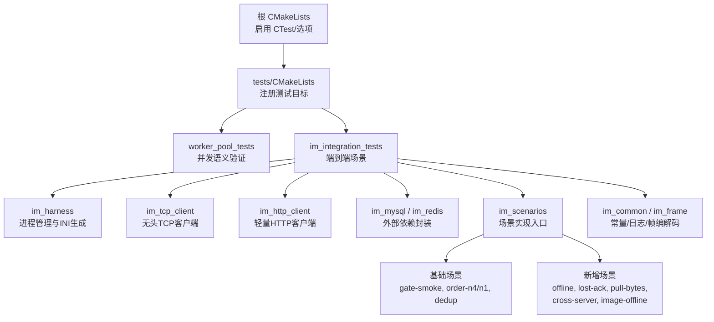
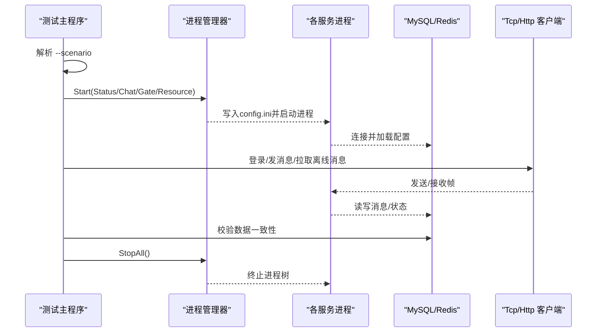
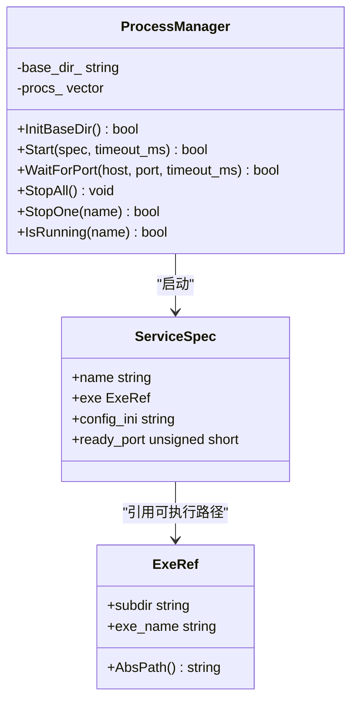
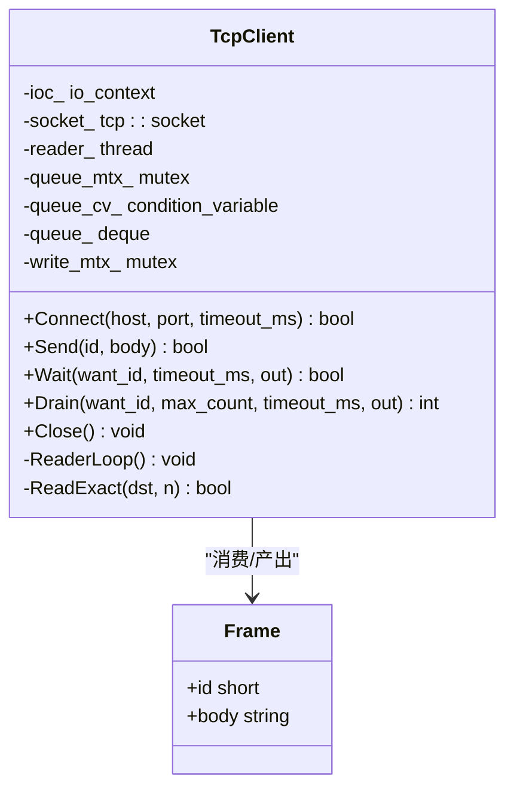
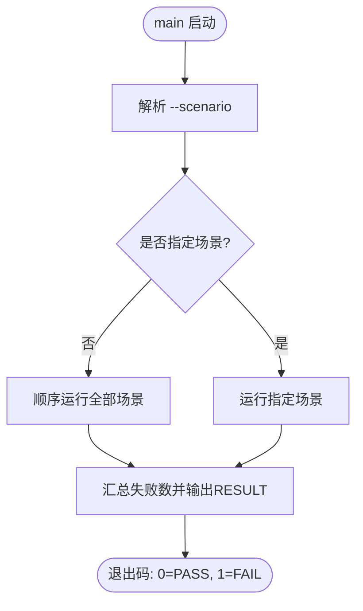
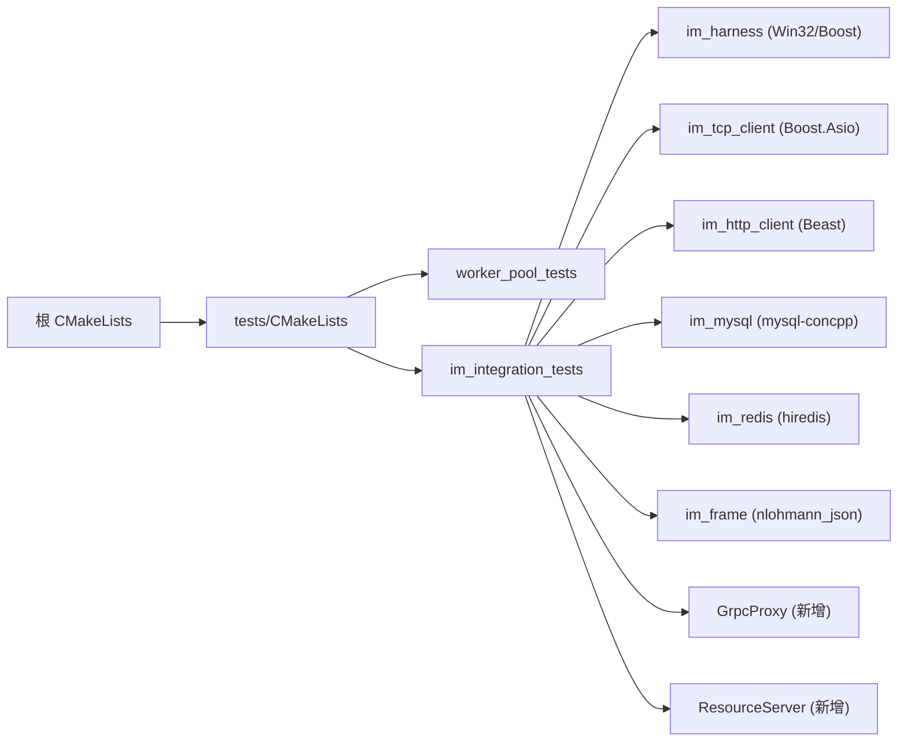

# 集成测试框架

<cite>
**本文引用的文件**   
- [CMakeLists.txt](file://CMakeLists.txt)
- [tests/CMakeLists.txt](file://tests/CMakeLists.txt)
- [tests/im_integration_tests.cpp](file://tests/im_integration_tests.cpp)
- [tests/worker_pool_tests.cpp](file://tests/worker_pool_tests.cpp)
- [tests/integration/im_common.h](file://tests/integration/im_common.h)
- [tests/integration/im_frame.h](file://tests/integration/im_frame.h)
- [tests/integration/im_harness.h](file://tests/integration/im_harness.h)
- [tests/integration/im_harness.cpp](file://tests/integration/im_harness.cpp)
- [tests/integration/im_scenarios.h](file://tests/integration/im_scenarios.h)
- [tests/integration/im_scenarios.cpp](file://tests/integration/im_scenarios.cpp)
- [tests/integration/im_tcp_client.h](file://tests/integration/im_tcp_client.h)
- [tests/integration/im_http_client.h](file://tests/integration/im_http_client.h)
- [tests/integration/im_mysql.h](file://tests/integration/im_mysql.h)
- [tests/integration/im_mysql.cpp](file://tests/integration/im_mysql.cpp)
- [tests/integration/im_redis.h](file://tests/integration/im_redis.h)
- [tests/integration/im_redis.cpp](file://tests/integration/im_redis.cpp)
- [AGENTS.md](file://AGENTS.md)
</cite>

## 更新摘要
**所做更改**   
- 新增五个综合集成测试场景：ScenarioOffline、ScenarioLostAck、ScenarioPullBytes、ScenarioCrossServer、ScenarioImageOffline
- 增强MySQL数据访问能力，支持更复杂的消息状态查询和清理操作
- 改进进程管理功能，支持跨服务器通信测试和资源服务集成
- 扩展协议帧支持，包含图片消息传输和分片上传机制
- **更新Redis::SetEx方法实现，采用新的SET key value EX ttl语法替代已废弃的SETEX命令**

## 目录
1. [简介](#简介)
2. [项目结构](#项目结构)
3. [核心组件](#核心组件)
4. [架构总览](#架构总览)
5. [详细组件分析](#详细组件分析)
6. [新增测试场景详解](#新增测试场景详解)
7. [依赖关系分析](#依赖关系分析)
8. [性能与稳定性考量](#性能与稳定性考量)
9. [故障排查指南](#故障排查指南)
10. [结论](#结论)
11. [附录](#附录)

## 简介
本仓库包含一个面向 IM（即时通讯）系统的 C++ 集成测试框架。该框架不依赖第三方测试库，采用"每个可执行体即一个主函数"的极简设计：通过命令行参数选择场景，启动真实服务器进程、连接外部依赖（MySQL、Redis），并以无头 TCP/HTTP 客户端驱动端到端验证。测试分为两类：
- 单元测试（并发语义）：worker_pool_tests，直接编译生产代码中的 LogicWorker 与 HandlerExecutor，验证单线程 FIFO 与有界多线程池的行为。
- 集成测试：im_integration_tests，按场景启动 StatusServer、ChatServer、GateServer、ResourceServer，使用固定端口隔离运行环境，并通过 MySQL/Redis 进行数据断言与清理。

**更新** 框架现已支持五个新的综合测试场景，涵盖离线消息处理、ACK丢失恢复、大消息分页拉取、跨服务器通信和图片消息传输等关键功能。同时，Redis封装已更新为使用最新的SET命令语法，确保与Redis服务器的兼容性。

## 项目结构
测试相关源码位于 tests 目录，其中 integration 子目录提供完整的集成测试基础设施（进程管理、协议帧、TCP/HTTP 客户端、MySQL/Redis 封装、场景定义）。顶层 CMakeLists 启用 CTest，并在 tests/CMakeLists.txt 中注册 worker_pool_tests 与可选的 im_integration_tests（需开启 LLFC_RUN_INTEGRATION_TESTS）。

**图表来源**
- [CMakeLists.txt:1-44](file://CMakeLists.txt#L1-L44)
- [tests/CMakeLists.txt:1-114](file://tests/CMakeLists.txt#L1-L114)

章节来源
- [CMakeLists.txt:1-44](file://CMakeLists.txt#L1-L44)
- [tests/CMakeLists.txt:1-114](file://tests/CMakeLists.txt#L1-L114)

## 核心组件
- 进程管理器（ProcessManager）：负责为每个服务创建独立工作目录、写入配置 INI、以 Job Object 启动并监控进程生命周期，支持按名称停止单个进程或全部停止。
- 场景编排（Scenario*）：每个场景拥有独立的 ProcessManager、Redis/Mysql 实例，完成种子数据准备、客户端交互、结果断言与资源清理。
- 无头客户端：
  - TcpClient：后台读取线程将服务端帧入队，测试线程发送请求并等待响应，避免阻塞。
  - HttpClient：基于 Boost.Beast 的同步 HTTP 客户端，带超时保护。
- 外部依赖封装：
  - Mysql：短连接查询/计数/删除，用于消息持久化断言与清理。
  - Redis：zset 成员检查、token 注入、清理等。
- 协议与常量：
  - Frame：[2字节大端类型][2字节大端长度][UTF-8 JSON] 的帧格式。
  - Common：固定端口、消息类型、错误码、失败计数器、日志与断言辅助。

**更新** MySQL封装现已支持更复杂的数据查询操作，包括按delivery_status过滤、LIKE模式匹配和批量删除等功能。Redis封装已更新为使用新的SET key value EX ttl语法，替代已废弃的SETEX命令。

章节来源
- [tests/integration/im_harness.h:1-89](file://tests/integration/im_harness.h#L1-L89)
- [tests/integration/im_harness.cpp:1-342](file://tests/integration/im_harness.cpp#L1-L342)
- [tests/integration/im_scenarios.h:1-27](file://tests/integration/im_scenarios.h#L1-L27)
- [tests/integration/im_tcp_client.h:1-75](file://tests/integration/im_tcp_client.h#L1-L75)
- [tests/integration/im_http_client.h:1-23](file://tests/integration/im_http_client.h#L1-L23)
- [tests/integration/im_mysql.h:1-74](file://tests/integration/im_mysql.h#L1-L74)
- [tests/integration/im_redis.h:1-43](file://tests/integration/im_redis.h#L1-L43)
- [tests/integration/im_frame.h:1-52](file://tests/integration/im_frame.h#L1-L52)
- [tests/integration/im_common.h:1-116](file://tests/integration/im_common.h#L1-L116)

## 架构总览
集成测试的执行流程如下：
- 主程序解析 --scenario 参数，选择对应场景函数执行。
- 场景内通过 ProcessManager 启动 Status/Chat/Gate/Resource 四个服务，生成各自 INI，绑定固定端口。
- 使用 Redis/Mysql 初始化种子数据（如 utoken_<uid>、离线消息集合等）。
- 通过 TcpClient/HttpClient 与服务交互，收集响应帧并断言。
- 最后清理数据库与 Redis 残留，确保下次运行干净。

**图表来源**
- [tests/im_integration_tests.cpp:1-90](file://tests/im_integration_tests.cpp#L1-L90)
- [tests/integration/im_harness.cpp:1-342](file://tests/integration/im_harness.cpp#L1-L342)
- [tests/integration/im_tcp_client.h:1-75](file://tests/integration/im_tcp_client.h#L1-L75)
- [tests/integration/im_http_client.h:1-23](file://tests/integration/im_http_client.h#L1-L23)
- [tests/integration/im_mysql.h:1-74](file://tests/integration/im_mysql.h#L1-L74)
- [tests/integration/im_redis.h:1-43](file://tests/integration/im_redis.h#L1-L43)

## 详细组件分析

### 进程管理器（ProcessManager）
- 职责：创建唯一工作目录、原子写入 config.ini、以 Job Object 启动进程、轮询 ready_port 判定就绪、统一销毁进程树。
- 关键点：
  - 使用 CREATE_SUSPENDED + AssignProcessToJobObject 保证进程树被回收。
  - 通过 boost::asio 轮询端口连通性作为就绪信号。
  - StopOne/StopAll 幂等安全，避免句柄泄漏。

**图表来源**
- [tests/integration/im_harness.h:1-89](file://tests/integration/im_harness.h#L1-L89)
- [tests/integration/im_harness.cpp:1-342](file://tests/integration/im_harness.cpp#L1-L342)

章节来源
- [tests/integration/im_harness.h:1-89](file://tests/integration/im_harness.h#L1-L89)
- [tests/integration/im_harness.cpp:1-342](file://tests/integration/im_harness.cpp#L1-L342)

### 无头 TCP 客户端（TcpClient）
- 职责：建立到 ChatServer 的连接，后台 ReaderLoop 持续读取帧并入队；测试线程通过 Send/Wait/Drain 非阻塞地收发。
- 关键点：
  - 使用条件变量与互斥保护队列，避免忙等。
  - Wait 支持按 ID 过滤，便于处理异步通知流。
  - Close 取消 socket 并 join 读取线程，确保资源释放。

**图表来源**
- [tests/integration/im_tcp_client.h:1-75](file://tests/integration/im_tcp_client.h#L1-L75)
- [tests/integration/im_frame.h:1-52](file://tests/integration/im_frame.h#L1-L52)

章节来源
- [tests/integration/im_tcp_client.h:1-75](file://tests/integration/im_tcp_client.h#L1-L75)
- [tests/integration/im_frame.h:1-52](file://tests/integration/im_frame.h#L1-L52)

### HTTP 客户端（HttpClient）
- 职责：为 gate-smoke 场景提供同步 HTTP GET/POST，带超时保护，防止挂起的处理器导致测试卡死。

章节来源
- [tests/integration/im_http_client.h:1-23](file://tests/integration/im_http_client.h#L1-L23)

### MySQL/Redis 封装
- Mysql：短连接封装，提供按 unique_id 查询/计数/删除、按 recv_id+delivery_status 查询等能力，用于消息落盘断言与清理。
- Redis：hiredis 薄封装，支持 Set/Get/Del/Exists、ZRange/ZCard/ZRem/FlushZSet，用于 token 注入与离线消息集合检查。

**更新** MySQL封装新增了以下功能：
- CountByUniqueIdLikeAndDelivery：按LIKE模式和delivery_status组合查询
- QueryByRecvIdAndDelivery：按接收用户ID和投递状态查询
- DeleteByUniqueIdLike：按LIKE模式批量删除消息

**更新** Redis封装的SetEx方法已更新为使用新的SET key value EX ttl语法：
- 原实现使用已废弃的SETEX命令
- 新实现使用redisCommandArgv调用SET命令，argv数组从4元素更新为5元素
- 新语法：`SET key value EX ttl`，更加符合Redis官方推荐的最佳实践

章节来源
- [tests/integration/im_mysql.h:1-74](file://tests/integration/im_mysql.h#L1-L74)
- [tests/integration/im_mysql.cpp:1-196](file://tests/integration/im_mysql.cpp#L1-L196)
- [tests/integration/im_redis.h:1-43](file://tests/integration/im_redis.h#L1-L43)
- [tests/integration/im_redis.cpp:55-66](file://tests/integration/im_redis.cpp#L55-L66)

### 场景与入口
- 入口：im_integration_tests.cpp 解析 --scenario，顺序或指定运行场景，统计失败数并输出 PASS/FAIL。
- 场景声明：im_scenarios.h 列出所有场景函数，包括基础冒烟、排序、去重、离线、丢ACK、分页拉取、跨服、图片离线等。

**图表来源**
- [tests/im_integration_tests.cpp:1-90](file://tests/im_integration_tests.cpp#L1-L90)
- [tests/integration/im_scenarios.h:1-27](file://tests/integration/im_scenarios.h#L1-L27)

章节来源
- [tests/im_integration_tests.cpp:1-90](file://tests/im_integration_tests.cpp#L1-L90)
- [tests/integration/im_scenarios.h:1-27](file://tests/integration/im_scenarios.h#L1-L27)

### 协议帧与常量
- 帧格式：[2字节大端类型][2字节大端长度][UTF-8 JSON]，提供 EncodeFrame/ParseJson 等工具。
- 常量：固定端口、消息类型、错误码、PullMaxBytes、失败计数器等，贯穿所有场景与客户端。

**更新** 新增了对图片消息的支持：
- ID_IMG_CHAT_MSG_REQ/RSP (1035/1036)：图片消息元数据
- ID_IMG_CHAT_UPLOAD_REQ/RSP (1037/1038)：图片分片上传
- MSG_STATUS_UN_UPLOAD (3)：未上传状态
- MSG_TYPE_PIC (1)：图片类型

章节来源
- [tests/integration/im_frame.h:1-52](file://tests/integration/im_frame.h#L1-L52)
- [tests/integration/im_common.h:1-116](file://tests/integration/im_common.h#L1-L116)

## 新增测试场景详解

### ScenarioOffline - 离线消息处理
**功能描述**：验证当接收方离线时，发送方发送的消息能够正确存储到MySQL和Redis，接收方上线后能够通过分页拉取获取所有离线消息。

**测试流程**：
1. 仅登录发送方，接收方保持离线状态
2. 发送100条消息到离线接收方
3. 验证MySQL中所有消息的delivery_status=0
4. 验证Redis ZSET中包含待处理的消息ID
5. 登录接收方并分页拉取离线消息
6. 验证每条消息只出现一次且完整
7. 发送ACK确认，验证MySQL和Redis状态清理

**关键断言**：
- MySQL中pending消息数量等于发送数量
- Redis ZSET包含所有待处理消息ID
- 分页拉取返回的消息ID无重复且完整
- ACK后MySQL delivery_status全为1，Redis ZSET为空

章节来源
- [tests/integration/im_scenarios.cpp:851-1010](file://tests/integration/im_scenarios.cpp#L851-L1010)

### ScenarioLostAck - ACK丢失恢复
**功能描述**：模拟第一次ACK丢失的场景，验证系统能够在第二次拉取时重新返回相同的消息ID，且在第二次ACK后不再重复返回。

**测试流程**：
1. 向离线接收方发送一条消息
2. 接收方上线并首次拉取消息
3. 故意不发送第一次ACK（模拟丢失）
4. 再次拉取，验证相同message_id仍然返回
5. 发送第二次ACK
6. 第三次拉取，验证消息不再返回

**关键断言**：
- 第一次拉取包含目标消息ID
- 第二次拉取（无ACK）仍包含相同消息ID
- 第二次ACK成功后，后续拉取不再返回该消息

章节来源
- [tests/integration/im_scenarios.cpp:1018-1121](file://tests/integration/im_scenarios.cpp#L1018-L1121)

### ScenarioPullBytes - 大消息分页拉取
**功能描述**：验证接近2KiB大小的消息在分页拉取时，每页的encoded payload保持在PullMaxBytes限制内，且has_more/next_message_id机制正确工作。

**测试流程**：
1. 发送40条约2KiB大小的消息到离线接收方
2. 接收方分页拉取消息
3. 验证每页frame大小不超过PullMaxBytes(30000)和16位帧上限
4. 验证分页机制正确推进cursor和has_more标志
5. 验证所有消息都被完整拉取

**关键断言**：
- 每个1052 frame的body_bytes < PullMaxBytes
- 整个frame_bytes < SHRT_MAX限制
- 分页拉取返回所有消息且无遗漏

章节来源
- [tests/integration/im_scenarios.cpp:1129-1241](file://tests/integration/im_scenarios.cpp#L1129-L1241)

### ScenarioCrossServer - 跨服务器通信
**功能描述**：验证两个ChatServer实例之间的gRPC通信，包括代理断连时的重试机制和服务重启后的消息恢复。

**测试流程**：
1. 启动两个ChatServer实例，通过TCP代理连接它们的gRPC端口
2. 设置代理为断连模式，模拟网络故障
3. 发送方在chatserver1上发送消息给chatserver2上的接收方
4. 验证发送方仍能收到1018响应（MySQL提交先于RPC）
5. 验证代理观察到至少一次连接尝试
6. 验证RPC阶段时间bounded（≤15秒）
7. 重启chatserver2，接收方重新连接并拉取待处理消息

**关键断言**：
- 发送方在RPC失败时仍能收到成功响应
- 代理连接次数≥1，证明重试机制工作
- RPC阶段时间≤15秒，符合最大重试限制
- 服务重启后接收方能拉取待处理消息

**新增组件**：GrpcProxy类用于模拟gRPC代理，支持断连模式和透传模式切换。

章节来源
- [tests/integration/im_scenarios.cpp:1251-1416](file://tests/integration/im_scenarios.cpp#L1251-L1416)

### ScenarioImageOffline - 图片消息离线处理
**功能描述**：验证图片消息的分片上传机制，确保UN_UPLOAD状态的消息不会出现在离线拉取中，上传完成后才能被接收方获取。

**测试流程**：
1. 发送图片元数据到ChatServer，创建UN_UPLOAD状态的消息
2. 验证UN_UPLOAD消息不在Redis ZSET中
3. 连接到ResourceServer进行图片分片上传
4. 验证上传完成后消息状态从UN_UPLOAD迁移
5. 验证消息出现在Redis ZSET中
6. 接收方拉取消息，验证msg_type=PIC且content_size正确
7. 发送ACK确认，验证状态清理

**关键断言**：
- UN_UPLOAD状态的消息不出现在离线拉取中
- 上传完成后消息状态正确迁移
- 接收方能获取正确的图片元数据和大小信息
- ACK后delivery_status正确更新为1

**新增功能**：ResSendAndRecv函数支持ResourceServer的特殊帧格式（6字节头部+4字节长度）。

章节来源
- [tests/integration/im_scenarios.cpp:1424-1589](file://tests/integration/im_scenarios.cpp#L1424-L1589)

## 依赖关系分析
- 构建系统：
  - 根 CMakeLists 强制使用 Ninja Multi-Config 生成器，启用 CTest，并提供 LLFC_RUN_INTEGRATION_TESTS 开关。
  - tests/CMakeLists 注册 worker_pool_tests（始终可用）与 im_integration_tests（仅当选项开启时）。
- 运行时依赖：
  - 集成测试需要本地运行的 MySQL、Redis 以及已构建的服务可执行文件（out/run/<Config>/...）。
  - 进程管理依赖 Windows Job Object 与 boost::asio 端口探测。
  - 协议层依赖 nlohmann_json。

**更新** 新增的跨服务器测试场景需要额外的gRPC代理支持，图片消息测试需要ResourceServer服务。Redis封装已更新为使用最新的SET命令语法，确保与Redis服务器的兼容性。

**图表来源**
- [CMakeLists.txt:1-44](file://CMakeLists.txt#L1-L44)
- [tests/CMakeLists.txt:1-114](file://tests/CMakeLists.txt#L1-L114)

章节来源
- [CMakeLists.txt:1-44](file://CMakeLists.txt#L1-L44)
- [tests/CMakeLists.txt:1-114](file://tests/CMakeLists.txt#L1-L114)

## 性能与稳定性考量
- 进程生命周期：Job Object 的 KILL_ON_JOB_CLOSE 确保异常情况下进程树可被回收，避免僵尸进程。
- 就绪检测：基于 boost::asio 的端口轮询，避免忙等，提高鲁棒性。
- 并发模型：
  - worker_pool_tests 验证 LogicWorker 的单线程 FIFO 与 HandlerExecutor 的有界多线程池行为，使用自定义 Barrier/Event/AcceptanceCounter 做确定性断言。
  - TcpClient 分离读线程与测试线程，避免背压导致的阻塞。
- 资源清理：每个场景负责自身在 MySQL/Redis 的残留清理，保证多次运行稳定。

**更新** 新增场景的性能考虑：
- 跨服务器测试包含gRPC重试机制的时间bounded验证
- 图片上传测试验证分片传输的完整性
- 大消息分页测试确保frame大小限制不被突破
- Redis SET命令的使用提高了与Redis服务器的兼容性和性能

章节来源
- [tests/worker_pool_tests.cpp:1-399](file://tests/worker_pool_tests.cpp#L1-L399)
- [tests/integration/im_harness.cpp:1-342](file://tests/integration/im_harness.cpp#L1-L342)
- [tests/integration/im_tcp_client.h:1-75](file://tests/integration/im_tcp_client.h#L1-L75)

## 故障排查指南
- 无法找到服务可执行文件：确认构建输出路径与 IM_REPO_ROOT/IM_BUILD_CONFIG 一致（默认 out/run/<Config>/...）。
- 服务未就绪：检查 ready_port 是否正确，查看 run.log 定位启动错误。
- 端口冲突：集成测试使用固定端口（如 18080/18090/18091/15052/18081），请确保未被占用。
- 外部依赖不可达：确认 MySQL（默认 127.0.0.1:3308）、Redis（默认 127.0.0.1:6380）可达且凭据正确。
- 场景失败：查看 [FAIL] 行与细节信息，必要时单独运行某场景（--scenario <name>）复现问题。

**更新** 新增场景的故障排查：
- 跨服务器测试：检查gRPC代理端口（15057）是否可用，验证两个ChatServer实例间的网络连接
- 图片消息测试：确认ResourceServer服务正常运行，检查文件上传路径权限
- 大消息测试：验证PullMaxBytes配置是否正确，检查frame编码逻辑
- Redis连接问题：确认Redis版本支持新的SET命令语法，检查连接参数和认证配置

章节来源
- [tests/integration/im_common.h:1-116](file://tests/integration/im_common.h#L1-L116)
- [tests/integration/im_harness.cpp:1-342](file://tests/integration/im_harness.cpp#L1-L342)
- [tests/im_integration_tests.cpp:1-90](file://tests/im_integration_tests.cpp#L1-L90)

## 结论
该集成测试框架以极简方式实现了高覆盖度的端到端验证：通过进程管理、固定端口隔离、外部依赖封装与无头客户端，能够在 CI 或本地快速验证 IM 系统的核心链路（登录、消息收发、离线拉取、跨服通信、图片上传等）。同时，worker_pool_tests 提供了对关键并发原语的确定性验证，保障系统在多线程与单线程两种模型下的正确性与稳定性。

**更新** 新增的五个综合测试场景显著增强了框架的测试覆盖率，特别是针对离线消息处理、ACK丢失恢复、大消息分页、跨服务器通信和图片消息传输等关键功能的验证，使框架能够更好地模拟真实生产环境的各种边界情况和异常场景。Redis封装的更新确保了与最新Redis版本的兼容性，提升了测试的稳定性和可靠性。

## 附录
- 构建与运行：参考 AGENTS.md 获取 VS/Ninja/vcpkg 环境与构建步骤。
- 运行集成测试：设置 LLFC_RUN_INTEGRATION_TESTS=ON，并使用 ctest -L integration 运行所有场景，或通过 im_integration_tests --scenario <name> 单独运行。

**更新** 新增场景的运行说明：
- 跨服务器测试需要两个ChatServer实例和gRPC代理服务
- 图片消息测试需要ResourceServer服务配合
- 所有新增场景都包含完整的资源清理逻辑，支持重复运行
- Redis连接需要支持新的SET命令语法，建议使用Redis 6.2+版本

章节来源
- [AGENTS.md:1-58](file://AGENTS.md#L1-L58)
- [tests/CMakeLists.txt:1-114](file://tests/CMakeLists.txt#L1-L114)