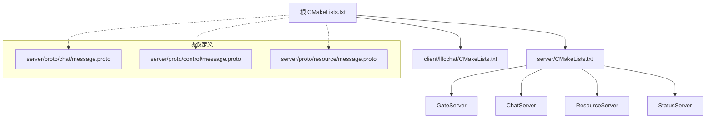
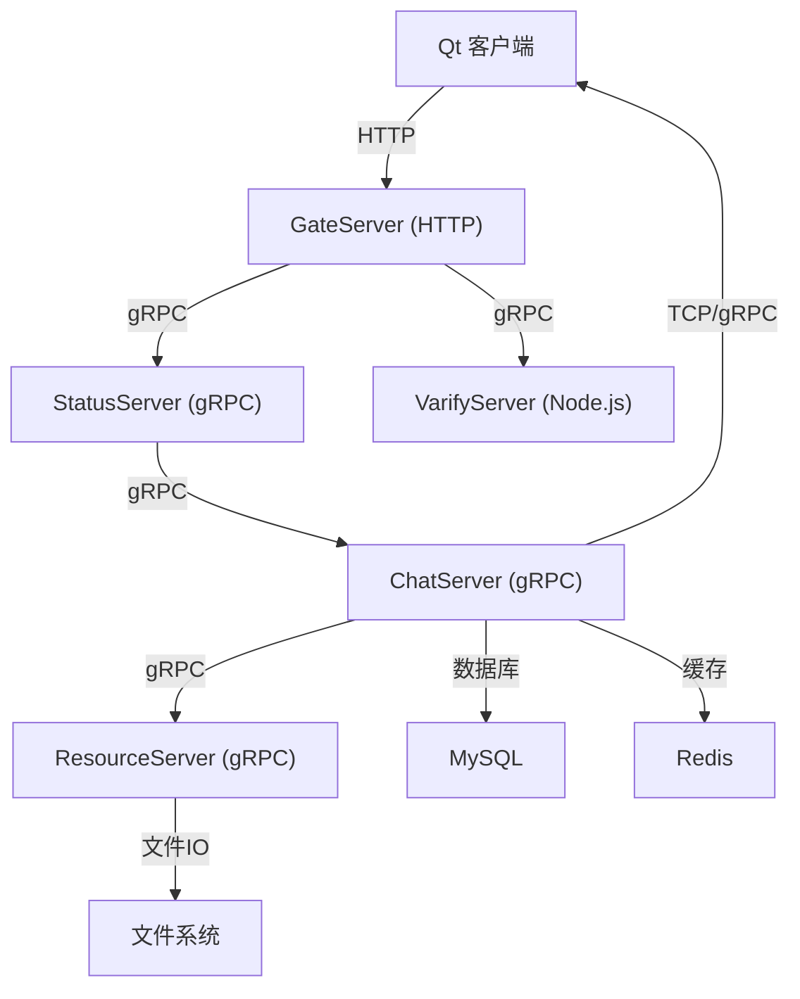
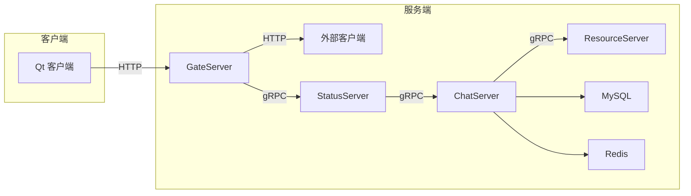

# 快速开始

<cite>
**本文引用的文件**   
- [README.md](file://README.md)
- [CMakeLists.txt](file://CMakeLists.txt)
- [CMakePresets.json](file://CMakePresets.json)
- [vcpkg.json](file://vcpkg.json)
- [cmake/Dependencies.cmake](file://cmake/Dependencies.cmake)
- [cmake/GrpcCodegen.cmake](file://cmake/GrpcCodegen.cmake)
- [server/GateServer/config/config.ini](file://server/GateServer/config/config.ini)
- [client/llfcchat/config/config.ini](file://client/llfcchat/config/config.ini)
- [server/ChatServer/config/chatserver1.ini](file://server/ChatServer/config/chatserver1.ini)
- [server/proto/chat/message.proto](file://server/proto/chat/message.proto)
- [server/proto/control/message.proto](file://server/proto/control/message.proto)
- [server/proto/resource/message.proto](file://server/proto/resource/message.proto)
- [开发文档/day03-visualstudio配置boost和jsoncpp.md](file://开发文档/day03-visualstudio配置boost和jsoncpp.md)
- [开发文档/day07-visualstudio配置grpc.md](file://开发文档/day07-visualstudio配置grpc.md)
</cite>

## 目录
1. [简介](#简介)
2. [项目结构](#项目结构)
3. [核心组件](#核心组件)
4. [架构总览](#架构总览)
5. [详细组件分析](#详细组件分析)
6. [依赖分析](#依赖分析)
7. [性能考虑](#性能考虑)
8. [故障排除指南](#故障排除指南)
9. [结论](#结论)
10. [附录](#附录)

## 简介
本快速开始指南面向首次接触 LLFCChat 的开发者，目标是帮助你在最短时间内完成环境搭建、依赖安装、编译构建与运行部署。项目采用 C++ 后端（gRPC、Boost.Asio/Beast、MySQL、Redis）与 Qt 客户端，使用 CMake + vcpkg 进行依赖管理与构建。你将学会：
- 在 Windows 上使用 Visual Studio 与 Ninja Multi-Config 生成器完成构建
- 通过 vcpkg 管理 Boost、jsoncpp、gRPC、protobuf、Qt 等依赖
- 从源码克隆到生成可执行文件的完整流程
- 启动 GateServer、StatusServer、ChatServer、ResourceServer 以及 Qt 客户端
- 常见问题的定位与解决

## 项目结构
仓库采用多模块组织：
- server：包含 GateServer、ChatServer、ResourceServer、StatusServer 四个服务，以及 gRPC 协议定义（proto）
- client/llfcchat：基于 Qt 的桌面客户端
- cmake：自定义 CMake 脚本，负责依赖查找与 gRPC/Protobuf 代码生成
- 根级 CMake 清单与 vcpkg 清单用于统一依赖与构建配置

图表来源
- [CMakeLists.txt:1-34](file://CMakeLists.txt#L1-L34)
- [server/proto/chat/message.proto:1-167](file://server/proto/chat/message.proto#L1-L167)
- [server/proto/control/message.proto:1-143](file://server/proto/control/message.proto#L1-L143)
- [server/proto/resource/message.proto:1-169](file://server/proto/resource/message.proto#L1-L169)

章节来源
- [CMakeLists.txt:1-34](file://CMakeLists.txt#L1-L34)
- [README.md:1-112](file://README.md#L1-L112)

## 核心组件
- 构建系统
  - CMake 要求使用“Ninja Multi-Config”生成器，禁止原地构建
  - CMakePresets 提供 Windows 下的便捷配置与构建预设
  - vcpkg 作为包管理器，集中声明并安装第三方库
- 依赖管理
  - vcpkg.json 声明了 Boost、jsoncpp、gRPC、protobuf、hiredis、mysql-connector-cpp、Qt5 等依赖
  - cmake/Dependencies.cmake 封装 find_package 逻辑与 MSVC 默认选项
  - cmake/GrpcCodegen.cmake 自动化 Protobuf/gRPC 代码生成
- 服务端组件
  - GateServer：HTTP 网关，处理注册、登录、验证码等 HTTP 请求
  - StatusServer：状态服务，提供聊天服务器发现与登录鉴权
  - ChatServer：聊天业务服务，处理好友、消息、踢人等
  - ResourceServer：资源服务，处理头像、图片等资源上传下载
- 客户端
  - Qt 客户端，通过 HTTP 与 GateServer 交互，通过 TCP/gRPC 与后端通信

章节来源
- [CMakePresets.json:1-36](file://CMakePresets.json#L1-L36)
- [vcpkg.json:1-32](file://vcpkg.json#L1-L32)
- [cmake/Dependencies.cmake:1-82](file://cmake/Dependencies.cmake#L1-L82)
- [cmake/GrpcCodegen.cmake:1-72](file://cmake/GrpcCodegen.cmake#L1-L72)

## 架构总览
下图展示了客户端与服务端之间的主要交互路径：客户端通过 HTTP 访问 GateServer，随后通过 gRPC/TCP 与 StatusServer、ChatServer、ResourceServer 通信。

图表来源
- [server/proto/chat/message.proto:1-167](file://server/proto/chat/message.proto#L1-L167)
- [server/proto/control/message.proto:1-143](file://server/proto/control/message.proto#L1-L143)
- [server/proto/resource/message.proto:1-169](file://server/proto/resource/message.proto#L1-L169)

## 详细组件分析

### 环境与工具准备
- 必备工具
  - Visual Studio 2022/2026 Build Tools（MSVC）
  - CMake 3.25+
  - Ninja Multi-Config 生成器
  - vcpkg（建议加入 PATH）
- 可选工具
  - Git（用于克隆源码）
  - Node.js（如需运行 VarifyServer）

章节来源
- [CMakeLists.txt:1-16](file://CMakeLists.txt#L1-L16)
- [CMakePresets.json:1-21](file://CMakePresets.json#L1-L21)

### vcpkg 依赖管理
- 依赖清单位于 vcpkg.json，包含 Boost、jsoncpp、gRPC、protobuf、hiredis、mysql-connector-cpp、Qt5 等
- 推荐使用 x64-windows-static-md 三元组以匹配项目的运行时链接策略
- 安装命令示例（在项目根目录执行）：
  - vcpkg install --triplet x64-windows-static-md

章节来源
- [vcpkg.json:1-32](file://vcpkg.json#L1-L32)
- [CMakePresets.json:15-21](file://CMakePresets.json#L15-L21)

### CMake 构建配置
- 根 CMakeLists.txt 强制使用 Ninja Multi-Config 生成器，并设置 vcpkg 相关变量
- CMakePresets.json 提供 windows-ninja 配置预设，指定 toolchainFile 与 VCPKG_TARGET_TRIPLET
- 构建输出目录由 Dependencies.cmake 中的 llfc_set_runtime_outdir 控制，统一输出到 out/run/<CONFIG>/<subdir>

章节来源
- [CMakeLists.txt:1-16](file://CMakeLists.txt#L1-L16)
- [CMakePresets.json:9-21](file://CMakePresets.json#L9-L21)
- [cmake/Dependencies.cmake:70-81](file://cmake/Dependencies.cmake#L70-L81)

### gRPC/Protobuf 代码生成
- GrpcCodegen.cmake 定义了 llfc_add_proto_library 函数，自动调用 protoc 与 grpc_cpp_plugin 生成 .pb.cc/.pb.h 与 .grpc.pb.cc/.grpc.pb.h
- 预置了 chat、control、resource 三个 proto 的生成入口
- 生成的代码将作为静态库被各服务引用

章节来源
- [cmake/GrpcCodegen.cmake:1-72](file://cmake/GrpcCodegen.cmake#L1-L72)
- [server/proto/chat/message.proto:1-167](file://server/proto/chat/message.proto#L1-L167)
- [server/proto/control/message.proto:1-143](file://server/proto/control/message.proto#L1-L143)
- [server/proto/resource/message.proto:1-169](file://server/proto/resource/message.proto#L1-L169)

### 配置文件说明
- GateServer 配置（config.ini）
  - 包含 GateServer、VarifyServer、StatusServer、Mysql、Redis、ResServer 的连接信息
- ChatServer 配置（chatserver1.ini）
  - 包含 SelfServer、PeerServer、Mysql、Redis 等连接信息
- 客户端配置（config.ini）
  - 仅包含 GateServer 的 host 与 port

章节来源
- [server/GateServer/config/config.ini:1-25](file://server/GateServer/config/config.ini#L1-L25)
- [server/ChatServer/config/chatserver1.ini:1-30](file://server/ChatServer/config/chatserver1.ini#L1-L30)
- [client/llfcchat/config/config.ini:1-4](file://client/llfcchat/config/config.ini#L1-L4)

### 服务端启动顺序与要点
- 推荐启动顺序
  1) MySQL、Redis（外部依赖）
  2) VarifyServer（Node.js，若启用邮箱验证码）
  3) StatusServer（gRPC 状态服务）
  4) ChatServer（聊天服务，可能需要多个实例）
  5) ResourceServer（资源服务）
  6) GateServer（HTTP 网关）
  7) Qt 客户端
- 注意事项
  - 确保各服务的端口与地址与配置文件一致
  - 防火墙放行相应端口
  - 日志输出位置遵循 out/run/<CONFIG>/<subdir> 约定

章节来源
- [server/GateServer/config/config.ini:1-25](file://server/GateServer/config/config.ini#L1-L25)
- [server/ChatServer/config/chatserver1.ini:1-30](file://server/ChatServer/config/chatserver1.ini#L1-L30)

### 客户端运行
- 客户端通过 config.ini 读取 GateServer 的地址与端口
- 启动后先通过 HTTP 与 GateServer 交互完成注册/登录流程，再建立长连接进行聊天

章节来源
- [client/llfcchat/config/config.ini:1-4](file://client/llfcchat/config/config.ini#L1-L4)

## 依赖分析
- 依赖关系
  - 服务端依赖 Boost.Asio/Beast、gRPC、protobuf、MySQL、Redis
  - 客户端依赖 Qt5 Core/Gui/Network/Widgets
  - gRPC 代码生成依赖 protoc 与 grpc_cpp_plugin
- 耦合性
  - 通过 proto 定义解耦服务间接口
  - CMake 脚本集中管理依赖查找与生成规则

图表来源
- [server/proto/chat/message.proto:1-167](file://server/proto/chat/message.proto#L1-L167)
- [server/proto/control/message.proto:1-143](file://server/proto/control/message.proto#L1-L143)
- [server/proto/resource/message.proto:1-169](file://server/proto/resource/message.proto#L1-L169)

章节来源
- [cmake/Dependencies.cmake:6-24](file://cmake/Dependencies.cmake#L6-L24)
- [vcpkg.json:1-32](file://vcpkg.json#L1-L32)

## 性能考虑
- 使用 Ninja Multi-Config 提升并行构建效率
- 合理配置线程池（AsioIOServicePool）与连接池（MySQL/Redis）
- 大文件传输建议使用断点续传与分块传输（ResourceServer）
- 日志级别按需调整，避免生产环境过多 I/O

[本节为通用指导，不直接分析具体文件]

## 故障排除指南
- 构建阶段
  - 错误提示需要“Ninja Multi-Config”生成器：请检查 CMake 生成器是否设置为“Ninja Multi-Config”
  - 原地构建报错：请在独立目录中进行构建（例如 out/build/windows-ninja）
  - vcpkg 未找到或三元组不匹配：确认已安装 vcpkg 且环境变量正确；使用 x64-windows-static-md
  - gRPC/Protobuf 代码生成失败：检查 protoc 与 grpc_cpp_plugin 路径是否正确
- 运行阶段
  - 端口冲突：检查 config.ini 中端口占用情况
  - 数据库/缓存连接失败：确认 MySQL、Redis 服务已启动且凭据正确
  - 客户端无法连接 GateServer：检查防火墙与网络可达性
- 参考文档
  - Visual Studio 配置 Boost 与 jsoncpp：参见开发文档 day03
  - Visual Studio 配置 gRPC：参见开发文档 day07

章节来源
- [CMakeLists.txt:1-16](file://CMakeLists.txt#L1-L16)
- [CMakePresets.json:9-21](file://CMakePresets.json#L9-L21)
- [cmake/GrpcCodegen.cmake:1-35](file://cmake/GrpcCodegen.cmake#L1-L35)
- [开发文档/day03-visualstudio配置boost和jsoncpp.md:1-194](file://开发文档/day03-visualstudio配置boost和jsoncpp.md#L1-L194)
- [开发文档/day07-visualstudio配置grpc.md:1-406](file://开发文档/day07-visualstudio配置grpc.md#L1-L406)

## 结论
通过本指南，你应能顺利完成 LLFCChat 的环境搭建、依赖安装、编译构建与运行部署。建议在熟悉基础流程后，进一步阅读开发文档了解各模块设计与实现细节，并根据实际场景调整配置与优化性能。

[本节为总结性内容，不直接分析具体文件]

## 附录

### 从零到运行的完整步骤（Windows）
- 安装必要工具
  - Visual Studio 2022/2026 Build Tools（勾选 C++ 桌面开发）
  - CMake 3.25+
  - Ninja Multi-Config 生成器
  - vcpkg（加入 PATH）
- 克隆源码
  - git clone <仓库地址>
- 安装依赖
  - 在项目根目录执行：vcpkg install --triplet x64-windows-static-md
- 配置与构建
  - 使用 CMake Presets：cmake --preset=windows-ninja
  - 构建：cmake --build --preset=windows-debug 或 windows-release
- 启动服务
  - 启动 MySQL、Redis
  - 启动 VarifyServer（如需要）
  - 依次启动 StatusServer、ChatServer、ResourceServer、GateServer
- 启动客户端
  - 运行 Qt 客户端，根据 config.ini 配置连接 GateServer

章节来源
- [CMakePresets.json:9-34](file://CMakePresets.json#L9-L34)
- [vcpkg.json:1-32](file://vcpkg.json#L1-L32)
- [server/GateServer/config/config.ini:1-25](file://server/GateServer/config/config.ini#L1-L25)
- [client/llfcchat/config/config.ini:1-4](file://client/llfcchat/config/config.ini#L1-L4)