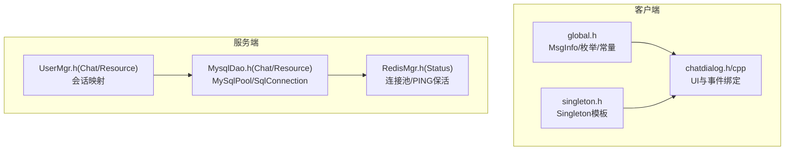
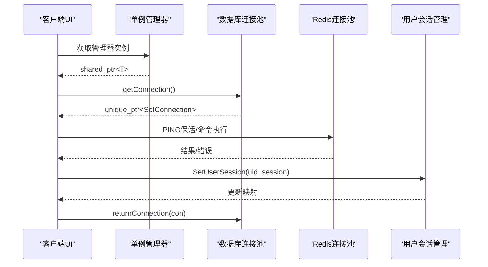
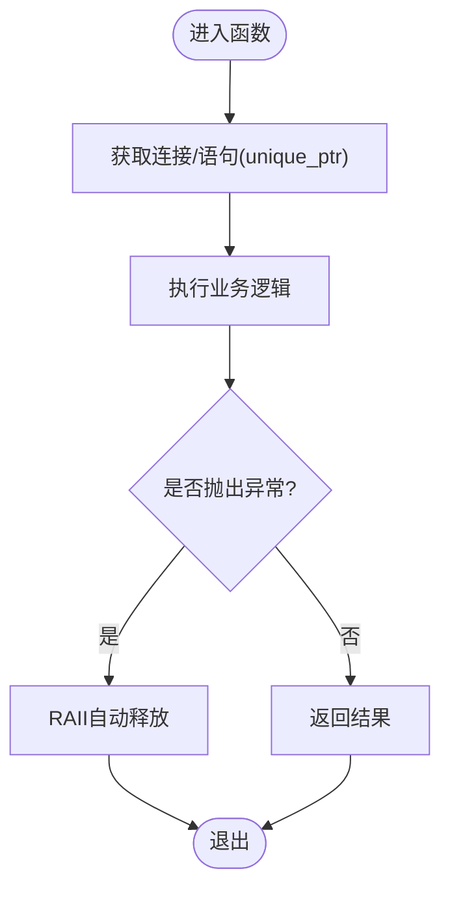
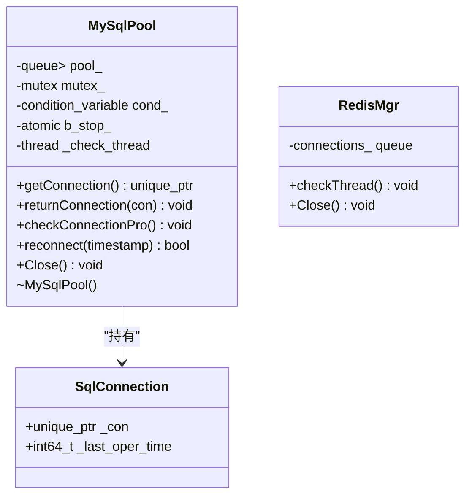
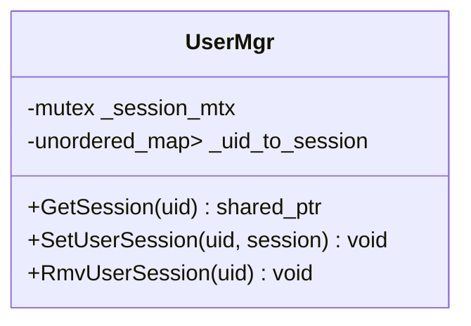
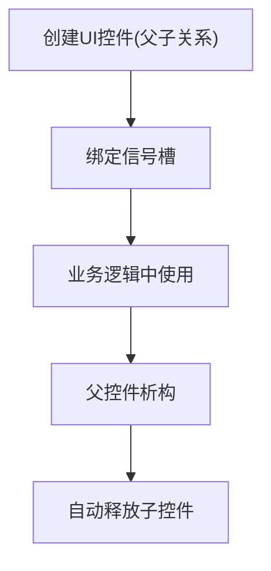
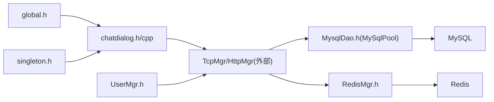

# 内存优化

<cite>
**本文引用的文件**   
- [client/llfcchat/include/global.h](file://client/llfcchat/include/global.h)
- [client/llfcchat/include/singleton.h](file://client/llfcchat/include/singleton.h)
- [client/llfcchat/include/chatdialog.h](file://client/llfcchat/include/chatdialog.h)
- [client/llfcchat/src/chatdialog.cpp](file://client/llfcchat/src/chatdialog.cpp)
- [server/ChatServer/include/MysqlDao.h](file://server/ChatServer/include/MysqlDao.h)
- [server/ResourceServer/include/MysqlDao.h](file://server/ResourceServer/include/MysqlDao.h)
- [server/StatusServer/include/RedisMgr.h](file://server/StatusServer/include/RedisMgr.h)
- [server/ChatServer/include/UserMgr.h](file://server/ChatServer/include/UserMgr.h)
- [server/ResourceServer/include/UserMgr.h](file://server/ResourceServer/include/UserMgr.h)
- [开发文档/day37-聊天信息存储方案.md](file://开发文档/day37-聊天信息存储方案.md)
- [开发文档/day35心跳逻辑.md](file://开发文档/day35心跳逻辑.md)
- [开发文档/day33单服程踢人逻辑.md](file://开发文档/day33单服程踢人逻辑.md)
</cite>

## 目录
1. [简介](#简介)
2. [项目结构](#项目结构)
3. [核心组件](#核心组件)
4. [架构总览](#架构总览)
5. [详细组件分析](#详细组件分析)
6. [依赖关系分析](#依赖关系分析)
7. [性能考量](#性能考量)
8. [故障排查指南](#故障排查指南)
9. [结论](#结论)
10. [附录](#附录)

## 简介
本文件面向LLFCChat项目的内存优化，围绕以下目标展开：
- 智能指针与RAII使用规范、对象池与连接池设计、内存碎片控制
- 内存泄漏检测与预防（静态/动态工具、常见模式识别、自动释放机制）
- 大数据结构优化（数据结构选择、内存布局、缓存友好、对齐）
- Qt特定优化（QVariant、信号槽开销、元对象系统、资源清理策略）
- 内存性能分析与调优工具使用指南

## 项目结构
本项目包含客户端（Qt）与多个服务端（C++/gRPC/Asio），内存管理贯穿UI、网络IO、数据库连接池、消息处理等模块。关键内存相关位置：
- 客户端全局数据与消息模型定义
- 单例模板与共享所有权管理
- 数据库连接池与生命周期管理
- Redis连接池与健康检查
- UI层对象创建与父子树释放

**图表来源**
- [client/llfcchat/include/global.h:167-199](file://client/llfcchat/include/global.h#L167-L199)
- [client/llfcchat/include/singleton.h:18-44](file://client/llfcchat/include/singleton.h#L18-L44)
- [client/llfcchat/include/chatdialog.h:66-97](file://client/llfcchat/include/chatdialog.h#L66-L97)
- [server/ChatServer/include/MysqlDao.h:18-232](file://server/ChatServer/include/MysqlDao.h#L18-L232)
- [server/ResourceServer/include/MysqlDao.h:19-233](file://server/ResourceServer/include/MysqlDao.h#L19-L233)
- [server/StatusServer/include/RedisMgr.h:203-246](file://server/StatusServer/include/RedisMgr.h#L203-L246)
- [server/ChatServer/include/UserMgr.h:1-20](file://server/ChatServer/include/UserMgr.h#L1-L20)
- [server/ResourceServer/include/UserMgr.h:1-21](file://server/ResourceServer/include/UserMgr.h#L1-L21)

**章节来源**
- [client/llfcchat/include/global.h:167-199](file://client/llfcchat/include/global.h#L167-L199)
- [client/llfcchat/include/singleton.h:18-44](file://client/llfcchat/include/singleton.h#L18-L44)
- [client/llfcchat/include/chatdialog.h:66-97](file://client/llfcchat/include/chatdialog.h#L66-L97)
- [server/ChatServer/include/MysqlDao.h:18-232](file://server/ChatServer/include/MysqlDao.h#L18-L232)
- [server/ResourceServer/include/MysqlDao.h:19-233](file://server/ResourceServer/include/MysqlDao.h#L19-L233)
- [server/StatusServer/include/RedisMgr.h:203-246](file://server/StatusServer/include/RedisMgr.h#L203-L246)
- [server/ChatServer/include/UserMgr.h:1-20](file://server/ChatServer/include/UserMgr.h#L1-L20)
- [server/ResourceServer/include/UserMgr.h:1-21](file://server/ResourceServer/include/UserMgr.h#L1-L21)

## 核心组件
- 全局数据与消息模型：集中定义消息类型、传输状态、文件传输参数等，便于统一内存语义与生命周期约定。
- 单例模板：基于shared_ptr的线程安全初始化，避免重复分配与手动释放。
- 数据库连接池：封装SqlConnection，提供获取/归还、健康检查、重连与析构清理。
- Redis连接池：PING保活、异常时重建连接、释放底层reply对象。
- 用户会话管理：以unordered_map维护uid到session的映射，配合互斥保护。

**章节来源**
- [client/llfcchat/include/global.h:167-199](file://client/llfcchat/include/global.h#L167-L199)
- [client/llfcchat/include/singleton.h:18-44](file://client/llfcchat/include/singleton.h#L18-L44)
- [server/ChatServer/include/MysqlDao.h:18-232](file://server/ChatServer/include/MysqlDao.h#L18-L232)
- [server/ResourceServer/include/MysqlDao.h:19-233](file://server/ResourceServer/include/MysqlDao.h#L19-L233)
- [server/StatusServer/include/RedisMgr.h:203-246](file://server/StatusServer/include/RedisMgr.h#L203-L246)
- [server/ChatServer/include/UserMgr.h:1-20](file://server/ChatServer/include/UserMgr.h#L1-L20)
- [server/ResourceServer/include/UserMgr.h:1-21](file://server/ResourceServer/include/UserMgr.h#L1-L21)

## 架构总览
下图展示客户端与服务端在内存管理上的关键交互点：客户端通过单例访问管理器，服务端通过连接池管理外部资源，会话映射与消息队列驱动对象生命周期。

**图表来源**
- [client/llfcchat/include/singleton.h:18-44](file://client/llfcchat/include/singleton.h#L18-L44)
- [server/ChatServer/include/MysqlDao.h:184-206](file://server/ChatServer/include/MysqlDao.h#L184-L206)
- [server/ResourceServer/include/MysqlDao.h:185-207](file://server/ResourceServer/include/MysqlDao.h#L185-L207)
- [server/StatusServer/include/RedisMgr.h:203-246](file://server/StatusServer/include/RedisMgr.h#L203-L246)
- [server/ChatServer/include/UserMgr.h:1-20](file://server/ChatServer/include/UserMgr.h#L1-L20)

## 详细组件分析

### 智能指针与RAII实践
- 使用unique_ptr管理独占资源（如数据库连接、语句对象），确保异常路径也能释放。
- 使用shared_ptr管理共享所有权（如UserInfo、会话对象），避免悬垂指针与重复释放。
- 在函数作用域内构造临时对象，利用栈析构保证资源回收。

**图表来源**
- [server/ChatServer/include/MysqlDao.h:18-232](file://server/ChatServer/include/MysqlDao.h#L18-L232)
- [server/ResourceServer/include/MysqlDao.h:19-233](file://server/ResourceServer/include/MysqlDao.h#L19-L233)

**章节来源**
- [server/ChatServer/include/MysqlDao.h:18-232](file://server/ChatServer/include/MysqlDao.h#L18-L232)
- [server/ResourceServer/include/MysqlDao.h:19-233](file://server/ResourceServer/include/MysqlDao.h#L19-L233)

### 连接池与对象池设计
- MySqlPool：预创建连接，条件变量等待可用连接；后台线程定期健康检查与重连；析构清空队列。
- Redis连接池：周期性PING保活，失败则重建连接并释放底层reply对象，避免内存增长。
- 连接归还：使用Defer或作用域RAII确保连接始终归还，防止泄漏。

**图表来源**
- [server/ChatServer/include/MysqlDao.h:18-232](file://server/ChatServer/include/MysqlDao.h#L18-L232)
- [server/ResourceServer/include/MysqlDao.h:19-233](file://server/ResourceServer/include/MysqlDao.h#L19-L233)
- [server/StatusServer/include/RedisMgr.h:203-246](file://server/StatusServer/include/RedisMgr.h#L203-L246)

**章节来源**
- [server/ChatServer/include/MysqlDao.h:18-232](file://server/ChatServer/include/MysqlDao.h#L18-L232)
- [server/ResourceServer/include/MysqlDao.h:19-233](file://server/ResourceServer/include/MysqlDao.h#L19-L233)
- [server/StatusServer/include/RedisMgr.h:203-246](file://server/StatusServer/include/RedisMgr.h#L203-L246)

### 用户会话管理与内存占用
- UserMgr维护uid到session的映射，使用互斥保护并发访问。
- 会话建立/删除需同步更新映射，避免悬挂引用与内存泄漏。

**图表来源**
- [server/ChatServer/include/UserMgr.h:1-20](file://server/ChatServer/include/UserMgr.h#L1-L20)
- [server/ResourceServer/include/UserMgr.h:1-21](file://server/ResourceServer/include/UserMgr.h#L1-L21)

**章节来源**
- [server/ChatServer/include/UserMgr.h:1-20](file://server/ChatServer/include/UserMgr.h#L1-L20)
- [server/ResourceServer/include/UserMgr.h:1-21](file://server/ResourceServer/include/UserMgr.h#L1-L21)

### Qt特定内存优化
- 父子树释放：Qt控件作为父对象的子节点，由父对象析构时自动释放，减少手动delete。
- 信号槽与元对象：避免在lambda中捕获大对象，优先捕获this或弱引用；合理使用Qt::UniqueConnection减少重复连接。
- QPixmap与图片：及时缩放与复用缩略图，避免重复加载大图；必要时使用QImage缓存。
- QVariant：仅在需要动态类型时使用，优先使用强类型容器与自定义结构体。

**图表来源**
- [client/llfcchat/src/chatdialog.cpp:48-80](file://client/llfcchat/src/chatdialog.cpp#L48-L80)
- [开发文档/day37-聊天信息存储方案.md:712-863](file://开发文档/day37-聊天信息存储方案.md#L712-L863)

**章节来源**
- [client/llfcchat/src/chatdialog.cpp:48-80](file://client/llfcchat/src/chatdialog.cpp#L48-L80)
- [开发文档/day37-聊天信息存储方案.md:712-863](file://开发文档/day37-聊天信息存储方案.md#L712-L863)

### 大数据结构优化
- MsgInfo结构体：包含传输状态、序列号、MD5、线程ID等字段，建议按访问热点排序以减少缓存未命中。
- 容器选择：频繁插入/删除使用deque或list，随机访问使用vector；键值映射使用unordered_map提升查找效率。
- 内存对齐：合理放置bool/char等小字段，减少填充字节；必要时使用#pragma pack或__attribute__((packed))谨慎使用。

**章节来源**
- [client/llfcchat/include/global.h:167-199](file://client/llfcchat/include/global.h#L167-L199)

### 内存泄漏检测与预防
- 静态分析：启用编译器警告（-Wall -Wextra）、Clang Static Analyzer、Cppcheck，定位潜在泄漏与未初始化。
- 动态检测：Valgrind（Linux）、AddressSanitizer（ASan）、Visual Studio CRT调试堆，捕获越界与重复释放。
- 常见模式：裸指针忘记delete、循环引用、异常路径跳过释放、容器元素未clear。
- 自动释放：优先使用RAII与智能指针，结合Defer思想确保异常安全。

**章节来源**
- [server/ChatServer/include/MysqlDao.h:18-232](file://server/ChatServer/include/MysqlDao.h#L18-L232)
- [server/ResourceServer/include/MysqlDao.h:19-233](file://server/ResourceServer/include/MysqlDao.h#L19-L233)
- [server/StatusServer/include/RedisMgr.h:203-246](file://server/StatusServer/include/RedisMgr.h#L203-L246)

### 网络与异步处理的内存要点
- Asio回调中避免捕获大对象，使用weak_ptr或拷贝必要字段。
- 消息节点复用：对频繁分配的消息缓冲进行池化，减少malloc/free抖动。
- 粘包/半包处理：正确计算长度，避免缓冲区溢出与重复拷贝。

**章节来源**
- [开发文档/day33单服程踢人逻辑.md:397-460](file://开发文档/day33单服程踢人逻辑.md#L397-L460)
- [开发文档/day35心跳逻辑.md:95-146](file://开发文档/day35心跳逻辑.md#L95-L146)

## 依赖关系分析
- 客户端依赖全局定义与单例模板，UI层通过信号槽与网络模块交互。
- 服务端各模块通过连接池访问外部资源，会话管理依赖映射表与互斥锁。
- 连接池与Redis池的生命周期由服务进程管理，析构时需确保所有资源释放。

**图表来源**
- [client/llfcchat/include/global.h:167-199](file://client/llfcchat/include/global.h#L167-L199)
- [client/llfcchat/include/singleton.h:18-44](file://client/llfcchat/include/singleton.h#L18-L44)
- [client/llfcchat/include/chatdialog.h:66-97](file://client/llfcchat/include/chatdialog.h#L66-L97)
- [server/ChatServer/include/MysqlDao.h:18-232](file://server/ChatServer/include/MysqlDao.h#L18-L232)
- [server/ResourceServer/include/MysqlDao.h:19-233](file://server/ResourceServer/include/MysqlDao.h#L19-L233)
- [server/StatusServer/include/RedisMgr.h:203-246](file://server/StatusServer/include/RedisMgr.h#L203-L246)
- [server/ChatServer/include/UserMgr.h:1-20](file://server/ChatServer/include/UserMgr.h#L1-L20)

**章节来源**
- [client/llfcchat/include/global.h:167-199](file://client/llfcchat/include/global.h#L167-L199)
- [client/llfcchat/include/singleton.h:18-44](file://client/llfcchat/include/singleton.h#L18-L44)
- [client/llfcchat/include/chatdialog.h:66-97](file://client/llfcchat/include/chatdialog.h#L66-L97)
- [server/ChatServer/include/MysqlDao.h:18-232](file://server/ChatServer/include/MysqlDao.h#L18-L232)
- [server/ResourceServer/include/MysqlDao.h:19-233](file://server/ResourceServer/include/MysqlDao.h#L19-L233)
- [server/StatusServer/include/RedisMgr.h:203-246](file://server/StatusServer/include/RedisMgr.h#L203-L246)
- [server/ChatServer/include/UserMgr.h:1-20](file://server/ChatServer/include/UserMgr.h#L1-L20)

## 性能考量
- 连接池大小：根据CPU核数与I/O负载调整，避免过多连接导致上下文切换开销。
- 内存池：对高频小对象（如消息头、临时缓冲）使用固定大小块分配，降低碎片。
- 缓存友好：顺序遍历与批量操作，减少随机访问；使用emplace_back替代push_back构造。
- 序列化：优先使用零拷贝或视图（如string_view）减少复制；JSON解析后尽快释放中间对象。

[本节为通用指导，不直接分析具体文件]

## 故障排查指南
- 内存泄漏：使用Valgrind/ASan定位，检查异常路径与RAII覆盖范围。
- 死锁与竞争：检查互斥锁顺序，避免嵌套锁；使用日志记录锁持有时间。
- 连接泄漏：确认getConnection/returnConnection成对出现，异常分支也归还。
- UI卡顿：检查信号槽阻塞主线程，将耗时任务移至工作线程。

**章节来源**
- [server/ChatServer/include/MysqlDao.h:18-232](file://server/ChatServer/include/MysqlDao.h#L18-L232)
- [server/ResourceServer/include/MysqlDao.h:19-233](file://server/ResourceServer/include/MysqlDao.h#L19-L233)
- [server/StatusServer/include/RedisMgr.h:203-246](file://server/StatusServer/include/RedisMgr.h#L203-L246)
- [开发文档/day33单服程踢人逻辑.md:397-460](file://开发文档/day33单服程踢人逻辑.md#L397-L460)
- [开发文档/day35心跳逻辑.md:95-146](file://开发文档/day35心跳逻辑.md#L95-L146)

## 结论
通过统一的智能指针与RAII策略、健壮的连接池设计、严格的Qt资源管理以及完善的检测与调优流程，LLFCChat可在高并发与大数据量场景下保持稳定的内存占用与良好的性能表现。建议在持续集成中引入静态与动态内存分析，形成闭环的质量保障体系。

[本节为总结性内容，不直接分析具体文件]

## 附录
- 工具推荐：
  - 静态分析：Clang Static Analyzer、Cppcheck、SonarQube
  - 动态检测：Valgrind、AddressSanitizer、Visual Studio CRT Debugging
  - 性能分析：perf、VTune、Qt Creator Profiler
- 最佳实践清单：
  - 优先使用智能指针与RAII
  - 连接池与对象池统一管理
  - 避免在信号槽中捕获大对象
  - 定期运行内存检测工具
  - 对热点数据结构进行布局优化

[本节为补充信息，不直接分析具体文件]