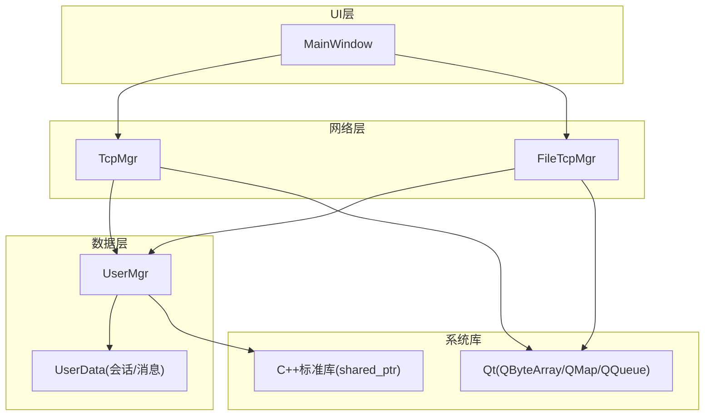
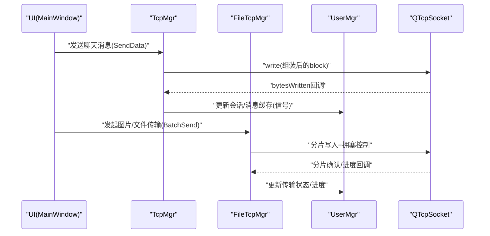
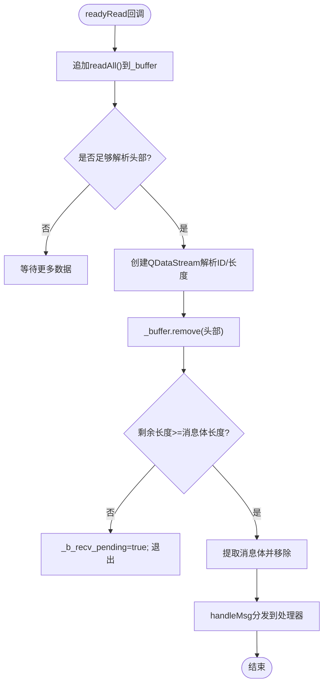
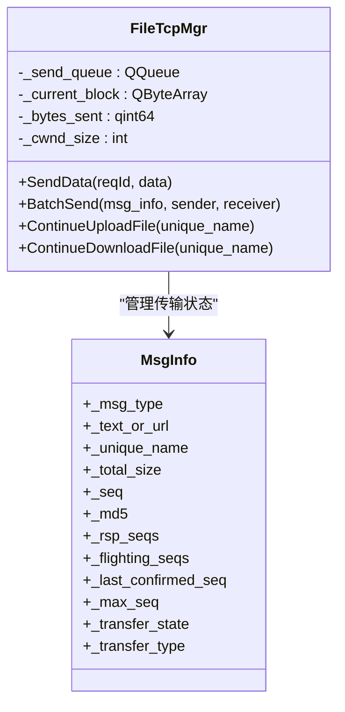
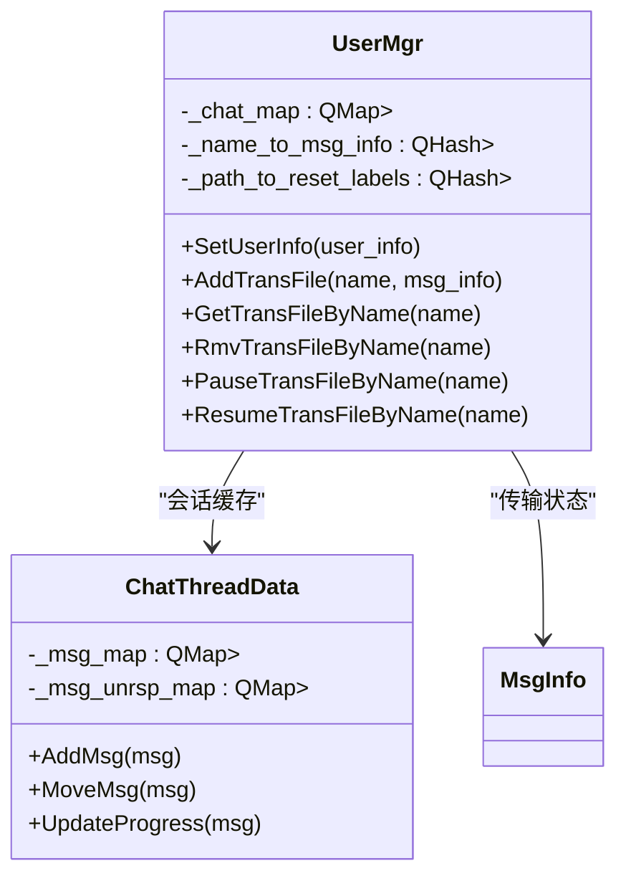
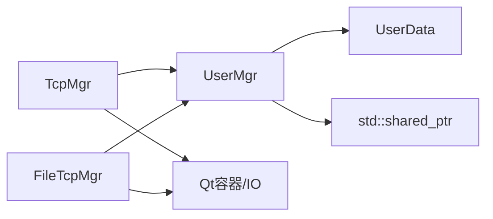

# 内存管理优化

<cite>
**本文引用的文件**   
- [tcpmgr.h](file://client/llfcchat/include/tcpmgr.h)
- [tcpmgr.cpp](file://client/llfcchat/src/tcpmgr.cpp)
- [filetcpmgr.h](file://client/llfcchat/include/filetcpmgr.h)
- [filetcpmgr.cpp](file://client/llfcchat/src/filetcpmgr.cpp)
- [global.h](file://client/llfcchat/include/global.h)
- [singleton.h](file://client/llfcchat/include/singleton.h)
- [userdata.h](file://client/llfcchat/include/userdata.h)
- [userdata.cpp](file://client/llfcchat/src/userdata.cpp)
- [usermgr.h](file://client/llfcchat/include/usermgr.h)
- [usermgr.cpp](file://client/llfcchat/src/usermgr.cpp)
- [mainwindow.h](file://client/llfcchat/include/mainwindow.h)
- [day42-Qt粘包引发的血案.md](file://开发文档/day42-Qt粘包引发的血案.md)
</cite>

## 目录
1. [简介](#简介)
2. [项目结构](#项目结构)
3. [核心组件](#核心组件)
4. [架构总览](#架构总览)
5. [详细组件分析](#详细组件分析)
6. [依赖关系分析](#依赖关系分析)
7. [性能考量](#性能考量)
8. [故障排查指南](#故障排查指南)
9. [结论](#结论)
10. [附录](#附录)

## 简介
本技术文档聚焦于 LLFCChat 客户端在 Qt 环境下的内存管理优化，围绕智能指针使用、对象生命周期管理、TCP 连接与缓冲区管理、会话对象内存占用优化、大对象处理、预分配策略以及高并发场景的内存使用与垃圾回收策略展开。文档同时给出内存监控与泄漏排查方法，帮助读者在实际工程中落地可操作的优化方案。

## 项目结构
本项目采用分层与按功能模块组织的方式：
- 网络层：TcpMgr（聊天消息）、FileTcpMgr（文件传输）负责 TCP 收发、粘包/半包处理、发送队列与拥塞控制。
- 数据层：UserMgr 集中管理用户信息、好友列表、会话映射、下载/上传状态等；UserData 定义消息与会话数据结构。
- 全局常量与类型：Global 提供协议 ID、枚举、通用结构与工具函数。
- UI 层：MainWindow 作为主窗口容器，承载登录、注册、聊天等界面切换。

图表来源
- [tcpmgr.h:1-90](file://client/llfcchat/include/tcpmgr.h#L1-L90)
- [filetcpmgr.h:1-85](file://client/llfcchat/include/filetcpmgr.h#L1-L85)
- [usermgr.h:1-116](file://client/llfcchat/include/usermgr.h#L1-L116)
- [userdata.h:1-288](file://client/llfcchat/include/userdata.h#L1-L288)
- [global.h:1-296](file://client/llfcchat/include/global.h#L1-L296)

章节来源
- [tcpmgr.h:1-90](file://client/llfcchat/include/tcpmgr.h#L1-L90)
- [filetcpmgr.h:1-85](file://client/llfcchat/include/filetcpmgr.h#L1-L85)
- [usermgr.h:1-116](file://client/llfcchat/include/usermgr.h#L1-L116)
- [userdata.h:1-288](file://client/llfcchat/include/userdata.h#L1-L288)
- [global.h:1-296](file://client/llfcchat/include/global.h#L1-L296)

## 核心组件
- TcpMgr：维护单连接、接收缓冲、解析协议头、消息分发、发送队列与字节计数，避免重复拷贝与频繁分配。
- FileTcpMgr：独立文件传输通道，支持分片、断点续传、拥塞窗口控制、进度回调与资源清理。
- UserMgr：集中缓存用户、会话、下载/上传任务，提供线程安全的访问接口，避免跨线程共享裸指针。
- UserData：消息与会话的数据模型，基于 shared_ptr 传递，减少拷贝并明确所有权。
- Global：协议ID、枚举、常量（如 MAX_FILE_LEN、MAX_CWND_SIZE），统一内存与协议边界。

章节来源
- [tcpmgr.cpp:1-137](file://client/llfcchat/src/tcpmgr.cpp#L1-L137)
- [filetcpmgr.cpp:1-143](file://client/llfcchat/src/filetcpmgr.cpp#L1-L143)
- [usermgr.cpp:1-173](file://client/llfcchat/src/usermgr.cpp#L1-L173)
- [userdata.cpp:1-162](file://client/llfcchat/src/userdata.cpp#L1-L162)
- [global.h:1-296](file://client/llfcchat/include/global.h#L1-L296)

## 架构总览
下图展示从 UI 到网络与数据层的交互路径，以及关键内存对象的生命周期流转。

图表来源
- [tcpmgr.cpp:100-137](file://client/llfcchat/src/tcpmgr.cpp#L100-L137)
- [filetcpmgr.cpp:106-143](file://client/llfcchat/src/filetcpmgr.cpp#L106-L143)
- [usermgr.cpp:461-566](file://client/llfcchat/src/usermgr.cpp#L461-L566)

## 详细组件分析

### TcpMgr 内存与生命周期
- 智能指针与所有权
  - 通过 std::shared_ptr 传递消息体与会话数据，避免深层拷贝；所有自定义类型均通过 qRegisterMetaType 注册，确保跨线程信号槽安全传递。
- 缓冲区与解析
  - 接收侧使用 QByteArray 累积数据，循环解析头部与消息体；每次解析都重新创建 QDataStream，避免位置错乱导致的内存越界或解析错误。
- 发送队列与字节计数
  - 使用 QQueue 缓存待发送块，配合 _current_block 与 _bytes_sent 实现流式发送；_pending 标志防止重入导致的多写竞争。
- 内存优化要点
  - 优先使用 remove() 而非 mid() 赋值，减少临时对象分配；对大数据使用 const 引用传递；必要时 reserve() 预分配容量。

图表来源
- [tcpmgr.cpp:18-55](file://client/llfcchat/src/tcpmgr.cpp#L18-L55)

章节来源
- [tcpmgr.h:22-87](file://client/llfcchat/include/tcpmgr.h#L22-L87)
- [tcpmgr.cpp:1-137](file://client/llfcchat/src/tcpmgr.cpp#L1-L137)
- [day42-Qt粘包引发的血案.md:322-358](file://开发文档/day42-Qt粘包引发的血案.md#L322-L358)

### FileTcpMgr 内存与拥塞控制
- 分片与断点续传
  - 将大文件切分为固定大小分片（MAX_FILE_LEN），逐片 Base64 编码传输；服务端回包包含 seq、is_last、total_size、current_size，客户端据此恢复进度。
- 拥塞窗口与批量发送
  - 维护 _cwnd_size 控制并发分片数量，避免突发流量导致内存暴涨；收到 ACK 后递减窗口，继续发送下一批。
- 资源清理
  - 下载完成后调用 UserMgr 清理下载记录；上传完成移动文件至本地存储并清理传输映射，避免悬空引用。

图表来源
- [filetcpmgr.h:26-82](file://client/llfcchat/include/filetcpmgr.h#L26-L82)
- [global.h:167-200](file://client/llfcchat/include/global.h#L167-L200)

章节来源
- [filetcpmgr.cpp:186-221](file://client/llfcchat/src/filetcpmgr.cpp#L186-L221)
- [filetcpmgr.cpp:521-608](file://client/llfcchat/src/filetcpmgr.cpp#L521-L608)
- [global.h:167-200](file://client/llfcchat/include/global.h#L167-L200)

### UserMgr 会话与对象缓存
- 会话映射与分页加载
  - 使用 QMap<int, shared_ptr<ChatThreadData>> 缓存会话，结合索引与分页常量 CHAT_COUNT_PER_PAGE 控制内存增长。
- 传输任务管理
  - 维护上传/下载/传输中的文件映射，提供暂停/恢复/查询接口，保证多线程安全。
- 图标刷新与Label集合
  - 下载头像后通过 path_to_reset_labels 批量刷新 UI，避免重复加载与内存抖动。

图表来源
- [usermgr.h:12-116](file://client/llfcchat/include/usermgr.h#L12-L116)
- [userdata.h:248-284](file://client/llfcchat/include/userdata.h#L248-L284)

章节来源
- [usermgr.cpp:288-367](file://client/llfcchat/src/usermgr.cpp#L288-L367)
- [usermgr.cpp:461-566](file://client/llfcchat/src/usermgr.cpp#L461-L566)
- [userdata.cpp:49-82](file://client/llfcchat/src/userdata.cpp#L49-L82)

### Singleton 与全局对象生命周期
- 单例模板使用 shared_ptr 管理实例，确保析构顺序可控，避免悬挂指针。
- 所有管理器（TcpMgr、FileTcpMgr、UserMgr）均继承自 Singleton，通过 GetInstance() 获取唯一实例。

章节来源
- [singleton.h:18-44](file://client/llfcchat/include/singleton.h#L18-L44)

## 依赖关系分析
- 组件耦合
  - TcpMgr/FileTcpMgr 依赖 UserMgr 进行会话与传输状态同步；UserMgr 依赖 UserData 数据结构。
- 外部依赖
  - Qt 的 QByteArray、QMap、QQueue、QTimer 等用于缓冲、缓存与异步事件；C++ 标准库 shared_ptr 用于所有权管理。
- 潜在循环依赖
  - 当前设计通过信号槽与接口解耦，未出现直接循环 include；需注意跨线程信号槽参数类型必须注册元类型。

图表来源
- [tcpmgr.h:22-87](file://client/llfcchat/include/tcpmgr.h#L22-L87)
- [filetcpmgr.h:26-82](file://client/llfcchat/include/filetcpmgr.h#L26-L82)
- [usermgr.h:12-116](file://client/llfcchat/include/usermgr.h#L12-L116)
- [userdata.h:144-234](file://client/llfcchat/include/userdata.h#L144-L234)

章节来源
- [tcpmgr.h:22-87](file://client/llfcchat/include/tcpmgr.h#L22-L87)
- [filetcpmgr.h:26-82](file://client/llfcchat/include/filetcpmgr.h#L26-L82)
- [usermgr.h:12-116](file://client/llfcchat/include/usermgr.h#L12-L116)
- [userdata.h:144-234](file://client/llfcchat/include/userdata.h#L144-L234)

## 性能考量
- 缓冲区与拷贝
  - 使用 remove() 替代 mid() 赋值，减少中间对象分配；对大数据使用 const 引用传递，避免不必要的深拷贝。
- 预分配与容量规划
  - 对高频使用的 QByteArray 可 reserve() 预分配容量；合理设置 MAX_FILE_LEN 与 MAX_CWND_SIZE，平衡吞吐与内存峰值。
- 内存碎片与释放
  - 及时清理已完成的下载/上传任务映射；会话分页加载限制内存增长；图片缩略图按需生成，避免常驻大图。
- 高并发与锁粒度
  - UserMgr 内部分配不同 mutex 保护不同资源（下载、传输、会话），降低锁竞争；避免在持有锁时执行耗时操作。

[本节为通用指导，不直接分析具体文件]

## 故障排查指南
- 常见内存问题定位
  - 使用 Valgrind 检测内存泄漏与越界访问；启用 AddressSanitizer 捕获运行时错误。
  - 针对 Qt 应用，可使用 Qt Creator 的“内存分析”插件观察对象生命周期与分配热点。
- 粘包/半包解析异常
  - 检查是否在循环外复用 QDataStream；确保每次解析前重新绑定 buffer；校验消息长度合理性。
- 发送阻塞与内存堆积
  - 观察 bytesWritten 回调中 _pending 与 _send_queue 状态；确认 write() 返回值与 _bytes_sent 累加逻辑正确。
- 会话与传输状态不一致
  - 核对 UserMgr 中 _name_to_msg_info 与 _path_to_reset_labels 的增删时机；确保完成回调触发清理。

章节来源
- [tcpmgr.cpp:18-55](file://client/llfcchat/src/tcpmgr.cpp#L18-L55)
- [filetcpmgr.cpp:106-143](file://client/llfcchat/src/filetcpmgr.cpp#L106-L143)
- [day42-Qt粘包引发的血案.md:468-514](file://开发文档/day42-Qt粘包引发的血案.md#L468-L514)

## 结论
LLFCChat 客户端通过智能指针、单例模式、发送队列与拥塞控制等手段，构建了稳健的内存管理与网络传输机制。结合合理的缓冲区策略、会话分页与资源清理，可在高并发场景下保持较低的内存峰值与稳定的性能。建议持续引入内存分析工具与静态检查，完善异常路径的资源释放，进一步提升系统的健壮性。

[本节为总结性内容，不直接分析具体文件]

## 附录
- 内存监控工具推荐
  - Valgrind、AddressSanitizer、Qt Creator 内存分析器、Windows Visual Studio 诊断工具。
- 最佳实践清单
  - 始终使用 shared_ptr 管理动态对象；避免裸指针跨线程传递；对大数据使用 const 引用；及时清理临时对象与映射表；合理设置缓冲区与窗口大小。

[本节为补充信息，不直接分析具体文件]