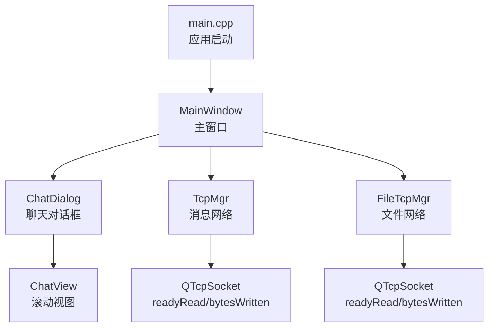
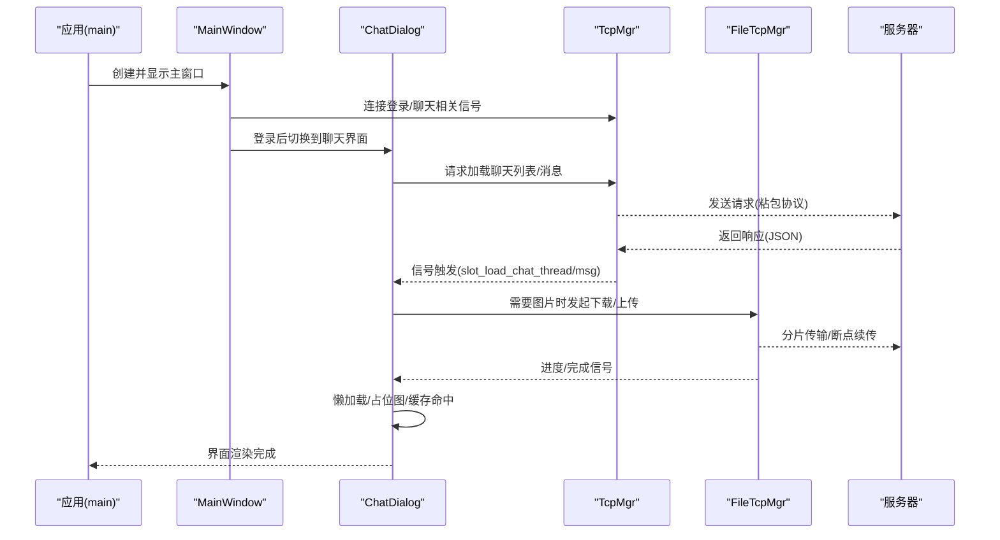
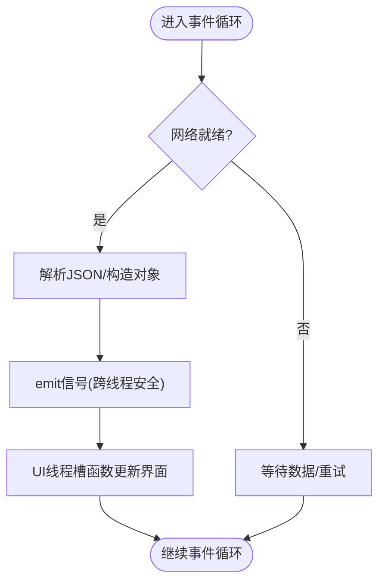
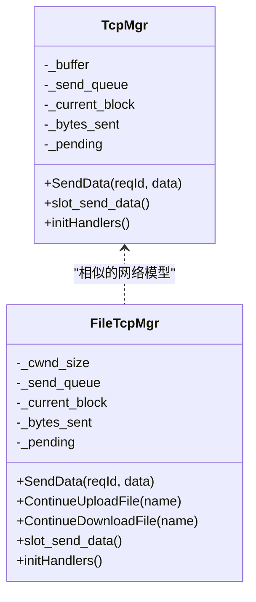
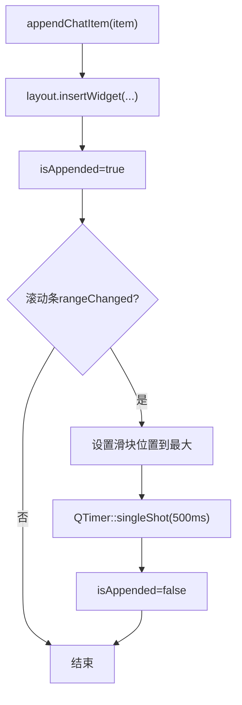
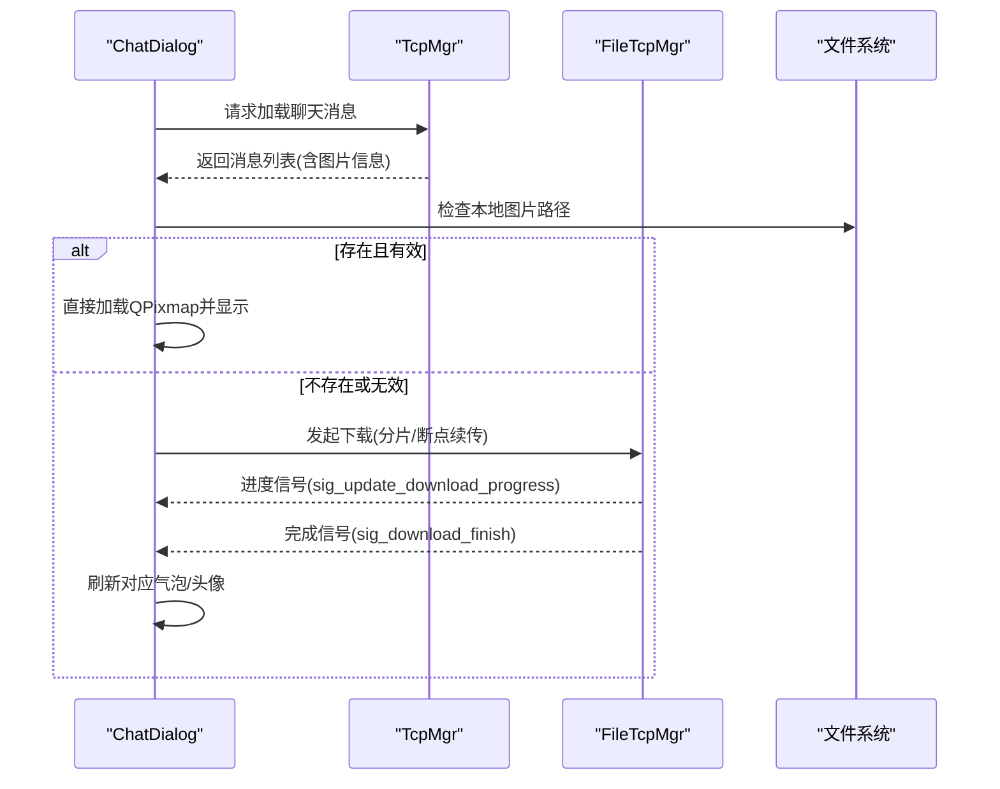
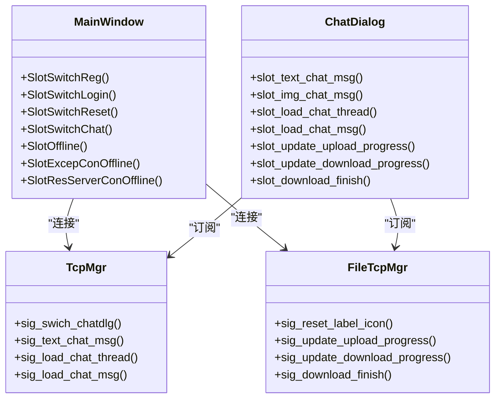
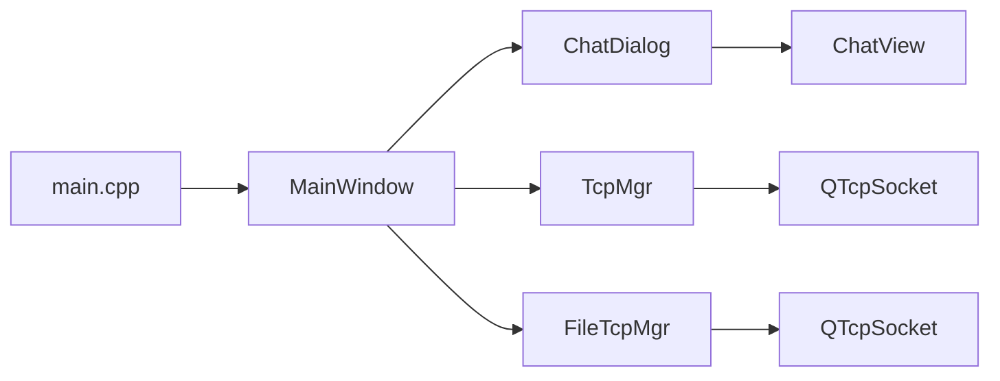

# 前端优化

<cite>
**本文引用的文件**   
- [main.cpp](file://client/llfcchat/src/main.cpp)
- [mainwindow.h](file://client/llfcchat/include/mainwindow.h)
- [mainwindow.cpp](file://client/llfcchat/src/mainwindow.cpp)
- [chatview.h](file://client/llfcchat/include/chatview.h)
- [chatview.cpp](file://client/llfcchat/src/chatview.cpp)
- [tcpmgr.h](file://client/llfcchat/include/tcpmgr.h)
- [tcpmgr.cpp](file://client/llfcchat/src/tcpmgr.cpp)
- [filetcpmgr.h](file://client/llfcchat/include/filetcpmgr.h)
- [filetcpmgr.cpp](file://client/llfcchat/src/filetcpmgr.cpp)
- [chatdialog.h](file://client/llfcchat/include/chatdialog.h)
- [chatdialog.cpp](file://client/llfcchat/src/chatdialog.cpp)
</cite>

## 目录
1. [简介](#简介)
2. [项目结构](#项目结构)
3. [核心组件](#核心组件)
4. [架构总览](#架构总览)
5. [详细组件分析](#详细组件分析)
6. [依赖关系分析](#依赖关系分析)
7. [性能考量](#性能考量)
8. [故障排查指南](#故障排查指南)
9. [结论](#结论)
10. [附录](#附录)

## 简介
本文件面向LLFCChat客户端的前端（Qt界面）优化，聚焦以下目标：
- 事件循环与UI线程分离：避免阻塞主线程，保证交互流畅。
- 异步操作处理：网络、IO、图片加载等耗时任务下沉到后台线程，通过信号槽安全回传结果。
- 渲染性能优化：减少重绘与布局计算，采用滚动区域与延迟滚动策略，控制内存占用。
- Qt信号槽机制优化：合理连接/断开、避免重复连接、使用跨线程安全的元类型注册。
- 资源加载优化：图片懒加载、预加载占位图、本地缓存与断点续传、内存管理。
- 调试与分析：提供定位卡顿、内存泄漏、网络瓶颈的方法与工具建议。

## 项目结构
客户端采用模块化分层设计：
- UI层：主窗口、聊天对话框、滚动视图、气泡控件等。
- 网络层：TcpMgr（消息）、FileTcpMgr（文件/图片）。
- 数据与状态：UserMgr、全局配置、单例模式。
- 启动入口：main.cpp负责样式加载、配置读取、线程初始化与主事件循环。

**图示来源** 
- [main.cpp:1-44](file://client/llfcchat/src/main.cpp#L1-L44)
- [mainwindow.cpp:1-164](file://client/llfcchat/src/mainwindow.cpp#L1-L164)
- [chatdialog.cpp:1-200](file://client/llfcchat/src/chatdialog.cpp#L1-L200)
- [chatview.cpp:1-133](file://client/llfcchat/src/chatview.cpp#L1-L133)
- [tcpmgr.cpp:1-137](file://client/llfcchat/src/tcpmgr.cpp#L1-L137)
- [filetcpmgr.cpp:1-143](file://client/llfcchat/src/filetcpmgr.cpp#L1-L143)

**章节来源**
- [main.cpp:1-44](file://client/llfcchat/src/main.cpp#L1-L44)
- [mainwindow.h:1-57](file://client/llfcchat/include/mainwindow.h#L1-L57)
- [mainwindow.cpp:1-164](file://client/llfcchat/src/mainwindow.cpp#L1-L164)

## 核心组件
- 主窗口 MainWindow：负责界面切换、离线恢复、信号连接。
- 聊天对话框 ChatDialog：业务编排、列表加载、消息渲染、头像加载、进度更新。
- 聊天视图 ChatView：滚动区域、事件过滤、滚动条隐藏、追加项后自动滚动到底部。
- 网络管理器 TcpMgr：消息收发、粘包处理、JSON解析、信号转发。
- 文件管理器 FileTcpMgr：大文件分片上传/下载、断点续传、进度回调、拥塞窗口控制。

**章节来源**
- [mainwindow.h:1-57](file://client/llfcchat/include/mainwindow.h#L1-L57)
- [chatdialog.h:1-98](file://client/llfcchat/include/chatdialog.h#L1-L98)
- [chatview.h:1-33](file://client/llfcchat/include/chatview.h#L1-L33)
- [tcpmgr.h:1-90](file://client/llfcchat/include/tcpmgr.h#L1-L90)
- [filetcpmgr.h:1-85](file://client/llfcchat/include/filetcpmgr.h#L1-L85)

## 架构总览
下图展示从启动到聊天界面的关键流程，以及网络与UI的解耦方式。

**图示来源** 
- [main.cpp:1-44](file://client/llfcchat/src/main.cpp#L1-L44)
- [mainwindow.cpp:1-164](file://client/llfcchat/src/mainwindow.cpp#L1-L164)
- [chatdialog.cpp:1-200](file://client/llfcchat/src/chatdialog.cpp#L1-L200)
- [tcpmgr.cpp:1-137](file://client/llfcchat/src/tcpmgr.cpp#L1-L137)
- [filetcpmgr.cpp:1-143](file://client/llfcchat/src/filetcpmgr.cpp#L1-L143)

## 详细组件分析

### 事件循环与UI线程分离
- 主线程仅负责UI绘制与用户交互，所有网络IO、JSON解析、文件读写均在各自管理器内部或后台线程中执行。
- TcpMgr/FileTcpMgr通过QTimer与信号槽将耗时结果安全投递到UI线程，避免阻塞事件循环。
- ChatDialog内定时器用于心跳上报，确保连接活跃且不阻塞UI。

**图示来源** 
- [tcpmgr.cpp:18-137](file://client/llfcchat/src/tcpmgr.cpp#L18-L137)
- [filetcpmgr.cpp:16-143](file://client/llfcchat/src/filetcpmgr.cpp#L16-L143)
- [chatdialog.cpp:156-166](file://client/llfcchat/src/chatdialog.cpp#L156-L166)

**章节来源**
- [tcpmgr.cpp:18-137](file://client/llfcchat/src/tcpmgr.cpp#L18-L137)
- [filetcpmgr.cpp:16-143](file://client/llfcchat/src/filetcpmgr.cpp#L16-L143)
- [chatdialog.cpp:156-166](file://client/llfcchat/src/chatdialog.cpp#L156-L166)

### 异步操作处理与粘包处理
- 接收侧：在readyRead中累积缓冲区，按头部长度解析，避免半包/粘包问题。
- 发送侧：bytesWritten回调驱动队列出队，保证顺序发送与流量控制。
- 错误处理：统一error/disconnected信号分支，通知UI进行状态恢复。

**图示来源** 
- [tcpmgr.h:22-90](file://client/llfcchat/include/tcpmgr.h#L22-L90)
- [filetcpmgr.h:26-85](file://client/llfcchat/include/filetcpmgr.h#L26-L85)
- [tcpmgr.cpp:103-137](file://client/llfcchat/src/tcpmgr.cpp#L103-L137)
- [filetcpmgr.cpp:106-143](file://client/llfcchat/src/filetcpmgr.cpp#L106-L143)

**章节来源**
- [tcpmgr.cpp:18-137](file://client/llfcchat/src/tcpmgr.cpp#L18-L137)
- [filetcpmgr.cpp:16-143](file://client/llfcchat/src/filetcpmgr.cpp#L16-L143)

### 界面卡顿避免与滚动优化
- ChatView使用QScrollArea承载内容，隐藏默认滚动条并通过事件过滤器控制显示。
- appendChatItem插入后延迟滚动到底部，避免频繁setSliderPosition导致抖动。
- paintEvent委托样式绘制，减少自定义绘制开销。

**图示来源** 
- [chatview.cpp:46-120](file://client/llfcchat/src/chatview.cpp#L46-L120)

**章节来源**
- [chatview.h:1-33](file://client/llfcchat/include/chatview.h#L1-L33)
- [chatview.cpp:1-133](file://client/llfcchat/src/chatview.cpp#L1-L133)

### 资源加载优化（图片懒加载、预加载、缓存、内存管理）
- 聊天消息加载时优先检查本地路径是否存在且可加载为QPixmap；失败则生成占位图，避免阻塞。
- 图片下载采用分片+Base64编码+断点续传，支持进度回调与完成后刷新UI。
- 本地存储路径基于用户ID与聊天对象ID组织，便于缓存命中与清理。

**图示来源** 
- [tcpmgr.cpp:749-798](file://client/llfcchat/src/tcpmgr.cpp#L749-L798)
- [filetcpmgr.cpp:334-433](file://client/llfcchat/src/filetcpmgr.cpp#L334-L433)
- [chatdialog.cpp:182-194](file://client/llfcchat/src/chatdialog.cpp#L182-L194)

**章节来源**
- [tcpmgr.cpp:749-798](file://client/llfcchat/src/tcpmgr.cpp#L749-L798)
- [filetcpmgr.cpp:334-433](file://client/llfcchat/src/filetcpmgr.cpp#L334-L433)
- [chatdialog.cpp:182-194](file://client/llfcchat/src/chatdialog.cpp#L182-L194)

### Qt信号槽机制的性能考虑
- 元类型注册：在TcpMgr/FileTcpMgr中集中注册跨线程使用的自定义类型，避免运行时查找开销。
- 连接管理：MainWindow集中连接生命周期相关的信号，避免重复连接与悬挂连接。
- 槽函数职责单一：UI更新集中在ChatDialog的槽函数中，保持网络与UI解耦。

**图示来源** 
- [mainwindow.cpp:22-34](file://client/llfcchat/src/mainwindow.cpp#L22-L34)
- [chatdialog.cpp:122-194](file://client/llfcchat/src/chatdialog.cpp#L122-L194)
- [tcpmgr.h:64-87](file://client/llfcchat/include/tcpmgr.h#L64-L87)
- [filetcpmgr.h:65-82](file://client/llfcchat/include/filetcpmgr.h#L65-L82)

**章节来源**
- [mainwindow.cpp:22-34](file://client/llfcchat/src/mainwindow.cpp#L22-L34)
- [chatdialog.cpp:122-194](file://client/llfcchat/src/chatdialog.cpp#L122-L194)
- [tcpmgr.h:64-87](file://client/llfcchat/include/tcpmgr.h#L64-L87)
- [filetcpmgr.h:65-82](file://client/llfcchat/include/filetcpmgr.h#L65-L82)

## 依赖关系分析
- main.cpp负责样式加载、配置读取、线程实例化与主事件循环。
- MainWindow作为UI容器，持有各子对话框指针并进行状态切换。
- ChatDialog聚合多个子组件（列表、搜索、页面栈），并订阅网络信号。
- TcpMgr/FileTcpMgr独立于UI，通过信号与UI层通信。

**图示来源** 
- [main.cpp:1-44](file://client/llfcchat/src/main.cpp#L1-L44)
- [mainwindow.cpp:1-164](file://client/llfcchat/src/mainwindow.cpp#L1-L164)
- [chatdialog.cpp:1-200](file://client/llfcchat/src/chatdialog.cpp#L1-L200)
- [chatview.cpp:1-133](file://client/llfcchat/src/chatview.cpp#L1-L133)
- [tcpmgr.cpp:1-137](file://client/llfcchat/src/tcpmgr.cpp#L1-L137)
- [filetcpmgr.cpp:1-143](file://client/llfcchat/src/filetcpmgr.cpp#L1-L143)

**章节来源**
- [main.cpp:1-44](file://client/llfcchat/src/main.cpp#L1-L44)
- [mainwindow.cpp:1-164](file://client/llfcchat/src/mainwindow.cpp#L1-L164)
- [chatdialog.cpp:1-200](file://client/llfcchat/src/chatdialog.cpp#L1-L200)

## 性能考量
- 事件循环优化
  - 避免在主线程执行耗时操作（如JSON解析、文件IO、图片解码）。
  - 使用QTimer进行周期性任务（心跳），间隔合理，避免频繁唤醒。
- UI线程分离
  - 网络与IO在TcpMgr/FileTcpMgr内部处理，通过信号槽将结果投递到UI线程。
  - 使用Qt元类型注册确保跨线程信号槽安全高效。
- 渲染优化
  - 使用QScrollArea承载大量条目，避免一次性构建全部widget。
  - 延迟滚动到底部，减少频繁setSliderPosition导致的重排。
  - 自定义paintEvent尽量委托样式系统，降低绘制成本。
- 资源管理
  - 图片先查本地缓存，失败再下载；下载分片写入，避免大对象驻留内存。
  - 及时删除不需要的widget与item，防止内存增长。
- 网络优化
  - 粘包处理与发送队列保障吞吐与顺序。
  - 拥塞窗口_cwnd_size控制并发，避免突发流量导致丢包。

[本节为通用指导，不直接分析具体文件]

## 故障排查指南
- 界面卡顿
  - 检查是否在UI线程执行了耗时操作（如文件IO、网络请求）。
  - 观察ChatView的append与滚动逻辑是否过于频繁。
- 内存泄漏
  - 确认removeAllItem是否正确释放widget与layout item。
  - 检查信号连接是否重复或未断开。
- 网络异常
  - 查看error/disconnected分支是否正确处理并提示用户。
  - 检查粘包解析逻辑与缓冲区边界条件。
- 图片加载失败
  - 验证本地路径与权限，确保QPixmap加载成功。
  - 检查下载分片与续传逻辑，确认seq与last标志。

**章节来源**
- [chatview.cpp:64-80](file://client/llfcchat/src/chatview.cpp#L64-L80)
- [tcpmgr.cpp:64-98](file://client/llfcchat/src/tcpmgr.cpp#L64-L98)
- [filetcpmgr.cpp:65-100](file://client/llfcchat/src/filetcpmgr.cpp#L65-L100)
- [tcpmgr.cpp:749-798](file://client/llfcchat/src/tcpmgr.cpp#L749-L798)
- [filetcpmgr.cpp:334-433](file://client/llfcchat/src/filetcpmgr.cpp#L334-L433)

## 结论
通过对事件循环、UI线程分离、异步处理、渲染优化与资源管理的系统性改进，LLFCChat客户端在大量消息与图片场景下仍能保持流畅体验。建议在后续迭代中持续监控性能指标，结合调试工具定位瓶颈，进一步优化用户体验。

[本节为总结性内容，不直接分析具体文件]

## 附录
- 调试工具建议
  - Qt Creator Profiler：CPU/内存热点分析。
  - Valgrind/AddressSanitizer：内存泄漏与越界检测。
  - Wireshark/抓包工具：网络协议与粘包问题定位。
  - 日志输出：在关键路径添加qDebug/qInfo，配合分级日志开关。

[本节为通用指导，不直接分析具体文件]