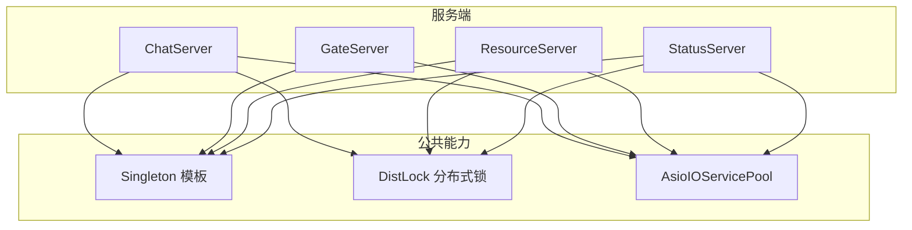
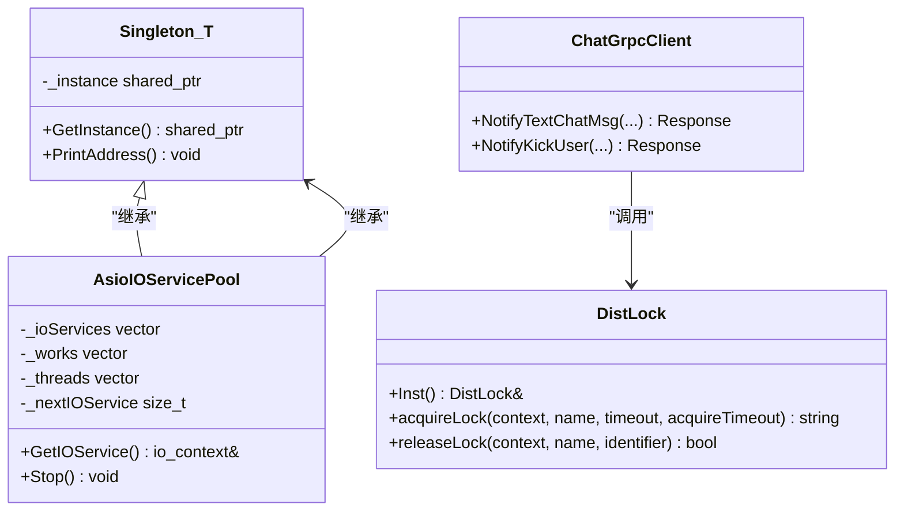
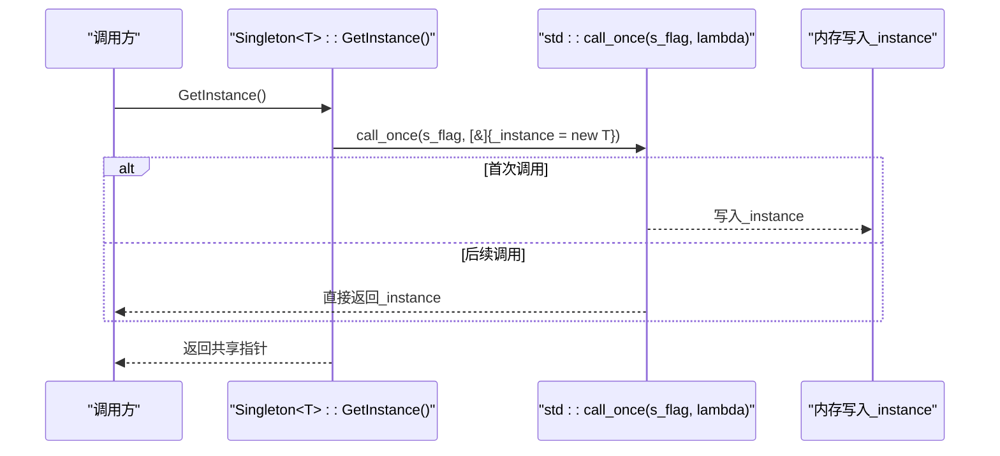
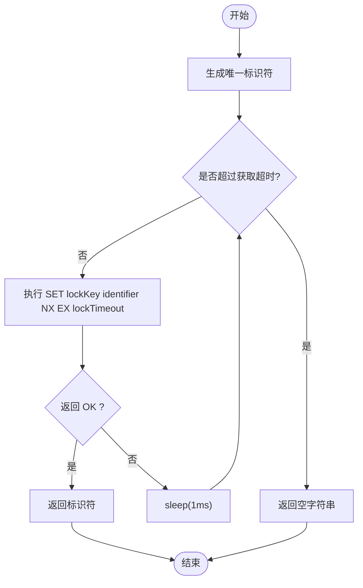
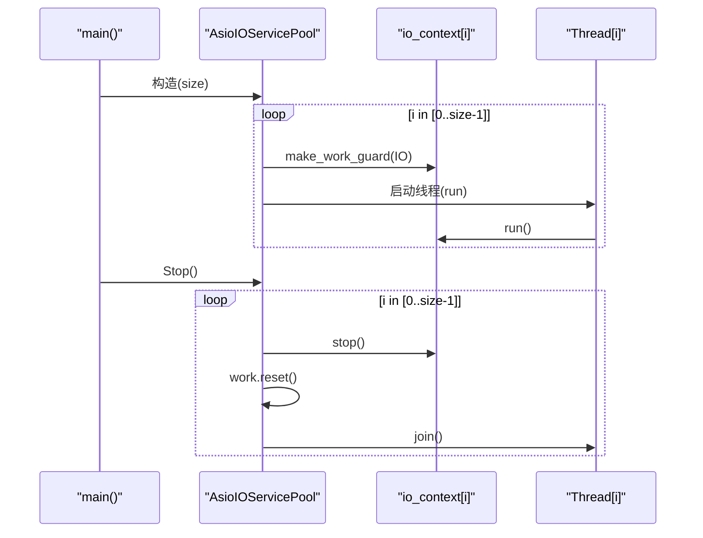
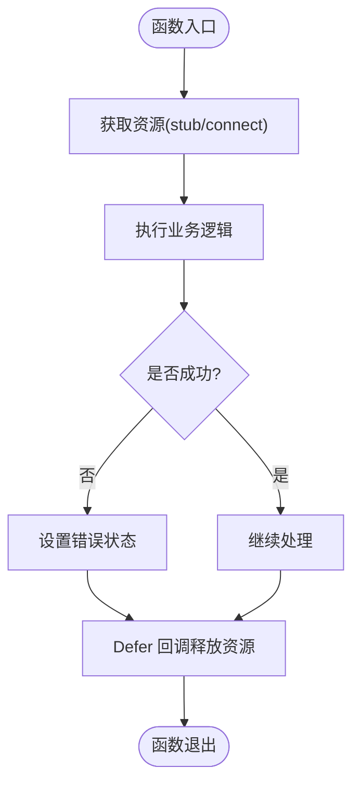
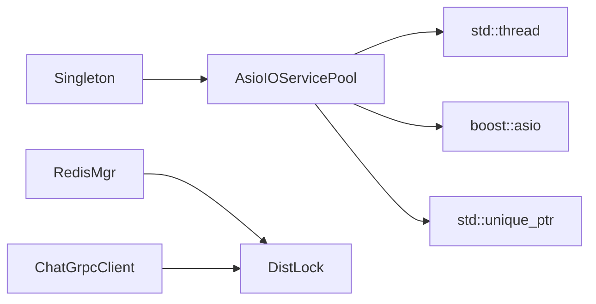

# 内存同步与线程安全

<cite>
**本文引用的文件**   
- [client/llfcchat/include/singleton.h](file://client/llfcchat/include/singleton.h)
- [server/ChatServer/include/Singleton.h](file://server/ChatServer/include/Singleton.h)
- [server/GateServer/include/Singleton.h](file://server/GateServer/include/Singleton.h)
- [server/ResourceServer/include/Singleton.h](file://server/ResourceServer/include/Singleton.h)
- [server/StatusServer/include/Singleton.h](file://server/StatusServer/include/Singleton.h)
- [server/ChatServer/include/DistLock.h](file://server/ChatServer/include/DistLock.h)
- [server/ChatServer/src/DistLock.cpp](file://server/ChatServer/src/DistLock.cpp)
- [server/ResourceServer/include/DistLock.h](file://server/ResourceServer/include/DistLock.h)
- [server/ResourceServer/src/DistLock.cpp](file://server/ResourceServer/src/DistLock.cpp)
- [server/StatusServer/include/DistLock.h](file://server/StatusServer/include/DistLock.h)
- [server/StatusServer/src/DistLock.cpp](file://server/StatusServer/src/DistLock.cpp)
- [server/StatusServer/src/RedisMgr.cpp](file://server/StatusServer/src/RedisMgr.cpp)
- [server/ResourceServer/src/RedisMgr.cpp](file://server/ResourceServer/src/RedisMgr.cpp)
- [server/ChatServer/include/AsioIOServicePool.h](file://server/ChatServer/include/AsioIOServicePool.h)
- [server/ChatServer/src/AsioIOServicePool.cpp](file://server/ChatServer/src/AsioIOServicePool.cpp)
- [server/ResourceServer/include/AsioIOServicePool.h](file://server/ResourceServer/include/AsioIOServicePool.h)
- [server/ResourceServer/src/AsioIOServicePool.cpp](file://server/ResourceServer/src/AsioIOServicePool.cpp)
- [server/ResourceServer/src/ResourceServer.cpp](file://server/ResourceServer/src/ResourceServer.cpp)
- [server/ChatServer/src/ChatGrpcClient.cpp](file://server/ChatServer/src/ChatGrpcClient.cpp)
- [开发文档/day35心跳逻辑.md](file://开发文档/day35心跳逻辑.md)
- [开发文档/day32分布式锁设计思路.md](file://开发文档/day32分布式锁设计思路.md)
</cite>

## 目录
1. [引言](#引言)
2. [项目结构](#项目结构)
3. [核心组件](#核心组件)
4. [架构总览](#架构总览)
5. [详细组件分析](#详细组件分析)
6. [依赖关系分析](#依赖关系分析)
7. [性能考量](#性能考量)
8. [故障排查指南](#故障排查指南)
9. [结论](#结论)
10. [附录](#附录)

## 引言
本文件围绕 LLFCChat 项目的内存同步与线程安全，系统梳理并解释以下主题：
- C++17 原子操作与内存序模型（std::atomic、内存序、CAS 等）
- 无锁数据结构与现代并发编程技术
- 线程局部存储（TLS）的使用与管理
- RAII 资源管理模式（智能指针、自动清理、异常安全）
- 单例模式的线程安全实现（call_once、静态局部变量、初始化顺序）
- 内存屏障的使用场景与性能影响分析

在项目中，我们观察到：
- 单例模式广泛使用 call_once 保证线程安全的延迟初始化
- 分布式锁通过 Redis SET NX EX + Lua 脚本实现跨进程互斥
- Asio IO 服务池采用多 io_context + 多线程模型，配合 unique_ptr 管理资源
- 文档中讨论了死锁避免策略（如 std::scoped_lock）与分布式锁/线程锁的嵌套问题

## 项目结构
LLFCChat 包含客户端与多个服务端模块。与并发和内存同步相关的代码主要分布在：
- 各服务的 Singleton 模板（用于线程安全单例）
- DistLock 分布式锁实现（基于 Redis）
- AsioIOServicePool 异步 IO 服务池（多线程 + 多 io_context）
- 资源管理与 RAII 实践（unique_ptr、Defer 模式）

**图表来源** 
- [server/ChatServer/include/Singleton.h:1-33](file://server/ChatServer/include/Singleton.h#L1-L33)
- [server/ChatServer/include/DistLock.h:1-18](file://server/ChatServer/include/DistLock.h#L1-L18)
- [server/ChatServer/include/AsioIOServicePool.h:1-27](file://server/ChatServer/include/AsioIOServicePool.h#L1-L27)

**章节来源**
- [server/ChatServer/include/Singleton.h:1-33](file://server/ChatServer/include/Singleton.h#L1-L33)
- [server/ChatServer/include/DistLock.h:1-18](file://server/ChatServer/include/DistLock.h#L1-L18)
- [server/ChatServer/include/AsioIOServicePool.h:1-27](file://server/ChatServer/include/AsioIOServicePool.h#L1-L27)

## 核心组件
- 单例模板 Singleton<T>：使用 std::once_flag 与 std::call_once 确保全局唯一实例的线程安全初始化；返回 shared_ptr 以支持 RAII 生命周期管理。
- 分布式锁 DistLock：基于 Redis 的 SET NX EX 获取锁，Lua 脚本原子释放锁；提供 acquireLock/releaseLock 接口。
- AsioIOServicePool：维护多个 io_context 与工作守护，按轮询分配任务，每个 io_context 运行于独立线程；Stop() 统一停止并 join 线程。
- RAII 与智能指针：大量使用 std::unique_ptr 管理工作守护与资源；通过 Defer 模式保证异常安全与资源释放。

**章节来源**
- [client/llfcchat/include/singleton.h:1-46](file://client/llfcchat/include/singleton.h#L1-L46)
- [server/ChatServer/include/Singleton.h:1-33](file://server/ChatServer/include/Singleton.h#L1-L33)
- [server/ChatServer/include/DistLock.h:1-18](file://server/ChatServer/include/DistLock.h#L1-L18)
- [server/ChatServer/src/DistLock.cpp:1-37](file://server/ChatServer/src/DistLock.cpp#L1-L37)
- [server/ChatServer/include/AsioIOServicePool.h:1-27](file://server/ChatServer/include/AsioIOServicePool.h#L1-L27)
- [server/ChatServer/src/AsioIOServicePool.cpp:1-42](file://server/ChatServer/src/AsioIOServicePool.cpp#L1-L42)
- [server/ChatServer/src/ChatGrpcClient.cpp:145-204](file://server/ChatServer/src/ChatGrpcClient.cpp#L145-L204)

## 架构总览
下图展示了服务端关键并发组件之间的关系：单例作为全局入口，AsioIOServicePool 提供高并发 IO 能力，DistLock 协调跨进程临界区，RAII 贯穿资源生命周期。

**图表来源** 
- [server/ChatServer/include/Singleton.h:1-33](file://server/ChatServer/include/Singleton.h#L1-L33)
- [server/ChatServer/include/DistLock.h:1-18](file://server/ChatServer/include/DistLock.h#L1-L18)
- [server/ChatServer/include/AsioIOServicePool.h:1-27](file://server/ChatServer/include/AsioIOServicePool.h#L1-L27)
- [server/ChatServer/src/ChatGrpcClient.cpp:145-204](file://server/ChatServer/src/ChatGrpcClient.cpp#L145-L204)

## 详细组件分析

### 单例模式的线程安全实现
- 使用 static std::once_flag 与 std::call_once 保证仅一次初始化，避免双重检查锁定的复杂性与潜在内存序问题。
- 静态成员 _instance 为 shared_ptr<T>，由 call_once 内部构造，析构由 shared_ptr 自动管理。
- 该模式在客户端与服务端多处复用，保持一致性。

**图表来源** 
- [client/llfcchat/include/singleton.h:1-46](file://client/llfcchat/include/singleton.h#L1-L46)
- [server/ChatServer/include/Singleton.h:1-33](file://server/ChatServer/include/Singleton.h#L1-L33)

**章节来源**
- [client/llfcchat/include/singleton.h:1-46](file://client/llfcchat/include/singleton.h#L1-L46)
- [server/ChatServer/include/Singleton.h:1-33](file://server/ChatServer/include/Singleton.h#L1-L33)
- [server/GateServer/include/Singleton.h:1-32](file://server/GateServer/include/Singleton.h#L1-L32)
- [server/ResourceServer/include/Singleton.h:1-33](file://server/ResourceServer/include/Singleton.h#L1-L33)
- [server/StatusServer/include/Singleton.h:1-32](file://server/StatusServer/include/Singleton.h#L1-L32)

### 分布式锁（Redis）的实现与流程
- 加锁：SET lockKey identifier NX EX lockTimeout，确保键不存在且设置过期时间，避免死锁。
- 解锁：EVAL Lua 脚本，比较标识符后删除 key，保证原子性。
- 重试：循环尝试直至超时或成功，期间 sleep 退避。

**图表来源** 
- [server/ChatServer/src/DistLock.cpp:1-37](file://server/ChatServer/src/DistLock.cpp#L1-L37)
- [server/ResourceServer/src/DistLock.cpp:1-37](file://server/ResourceServer/src/DistLock.cpp#L1-L37)
- [server/StatusServer/src/DistLock.cpp:1-37](file://server/StatusServer/src/DistLock.cpp#L1-L37)

**章节来源**
- [server/ChatServer/include/DistLock.h:1-18](file://server/ChatServer/include/DistLock.h#L1-L18)
- [server/ChatServer/src/DistLock.cpp:1-37](file://server/ChatServer/src/DistLock.cpp#L1-L37)
- [server/ResourceServer/include/DistLock.h:1-18](file://server/ResourceServer/include/DistLock.h#L1-L18)
- [server/ResourceServer/src/DistLock.cpp:1-37](file://server/ResourceServer/src/DistLock.cpp#L1-L37)
- [server/StatusServer/include/DistLock.h:1-18](file://server/StatusServer/include/DistLock.h#L1-L18)
- [server/StatusServer/src/DistLock.cpp:1-37](file://server/StatusServer/src/DistLock.cpp#L1-L37)
- [开发文档/day32分布式锁设计思路.md:40-58](file://开发文档/day32分布式锁设计思路.md#L40-L58)

### AsioIOServicePool 的多线程与资源管理
- 构造时创建 N 个 io_context 与对应的工作守护（work_guard），并为每个 io_context 启动一个线程运行 run()。
- GetIOService() 轮询返回 io_context 引用，实现负载均衡。
- Stop() 依次 stop 各 io_context，释放 work_guard，join 所有线程，确保优雅退出。
- 使用 std::unique_ptr 管理 Work 对象，避免手动释放与泄漏。

**图表来源** 
- [server/ChatServer/src/AsioIOServicePool.cpp:1-42](file://server/ChatServer/src/AsioIOServicePool.cpp#L1-L42)
- [server/ResourceServer/src/AsioIOServicePool.cpp:1-43](file://server/ResourceServer/src/AsioIOServicePool.cpp#L1-L43)
- [server/ResourceServer/src/ResourceServer.cpp:1-41](file://server/ResourceServer/src/ResourceServer.cpp#L1-L41)

**章节来源**
- [server/ChatServer/include/AsioIOServicePool.h:1-27](file://server/ChatServer/include/AsioIOServicePool.h#L1-L27)
- [server/ChatServer/src/AsioIOServicePool.cpp:1-42](file://server/ChatServer/src/AsioIOServicePool.cpp#L1-L42)
- [server/ResourceServer/include/AsioIOServicePool.h:1-27](file://server/ResourceServer/include/AsioIOServicePool.h#L1-L27)
- [server/ResourceServer/src/AsioIOServicePool.cpp:1-43](file://server/ResourceServer/src/AsioIOServicePool.cpp#L1-L43)
- [server/ResourceServer/src/ResourceServer.cpp:1-41](file://server/ResourceServer/src/ResourceServer.cpp#L1-L41)

### RAII 与异常安全（智能指针与 Defer）
- 使用 std::unique_ptr 管理临时资源（如 Work 守护、数据库连接、RPC stub），确保异常路径也能正确释放。
- Defer 模式封装“后置动作”，在函数退出（含异常）时自动执行，简化错误处理与资源回收。

**图表来源** 
- [server/ChatServer/src/ChatGrpcClient.cpp:145-204](file://server/ChatServer/src/ChatGrpcClient.cpp#L145-L204)

**章节来源**
- [server/ChatServer/src/ChatGrpcClient.cpp:145-204](file://server/ChatServer/src/ChatGrpcClient.cpp#L145-L204)

### 死锁避免与锁顺序一致性
- 文档指出心跳与读取失败路径中可能出现“线程锁 ↔ 分布式锁”交叉加锁导致死锁。
- 建议统一锁获取顺序或使用 std::scoped_lock 一次性获取多把互斥量，避免循环等待。
- 对于分布式锁与本地锁嵌套，可采用 tryLock + 回退重试策略，或将两者封装为组合锁。

**章节来源**
- [开发文档/day35心跳逻辑.md:148-270](file://开发文档/day35心跳逻辑.md#L148-L270)

## 依赖关系分析
- 单例模板被 AsioIOServicePool 继承，作为全局唯一入口。
- DistLock 被 RedisMgr 封装，提供统一的加锁/解锁接口。
- AsioIOServicePool 依赖 std::thread、boost::asio 与智能指针进行资源管理。
- 业务层（如 ChatGrpcClient）通过 DistLock 保护临界区，结合 Defer 保证资源释放。

**图表来源** 
- [server/ChatServer/include/AsioIOServicePool.h:1-27](file://server/ChatServer/include/AsioIOServicePool.h#L1-L27)
- [server/StatusServer/src/RedisMgr.cpp:408-427](file://server/StatusServer/src/RedisMgr.cpp#L408-L427)
- [server/ResourceServer/src/RedisMgr.cpp:413-460](file://server/ResourceServer/src/RedisMgr.cpp#L413-L460)
- [server/ChatServer/src/ChatGrpcClient.cpp:145-204](file://server/ChatServer/src/ChatGrpcClient.cpp#L145-L204)

**章节来源**
- [server/ChatServer/include/AsioIOServicePool.h:1-27](file://server/ChatServer/include/AsioIOServicePool.h#L1-L27)
- [server/StatusServer/src/RedisMgr.cpp:408-427](file://server/StatusServer/src/RedisMgr.cpp#L408-L427)
- [server/ResourceServer/src/RedisMgr.cpp:413-460](file://server/ResourceServer/src/RedisMgr.cpp#L413-L460)
- [server/ChatServer/src/ChatGrpcClient.cpp:145-204](file://server/ChatServer/src/ChatGrpcClient.cpp#L145-L204)

## 性能考量
- 单例初始化：call_once 开销极低，适合全局配置与资源管理器。
- 分布式锁：Redis 网络往返与 Lua 脚本执行带来额外延迟；合理设置超时与退避策略可缓解竞争。
- AsioIOServicePool：多 io_context + 多线程提升吞吐；注意 CPU 亲和与上下文切换成本。
- RAII 与智能指针：减少手动释放错误，提高异常安全；但需注意拷贝与移动语义对性能的影响。
- 内存序与原子操作：在高并发计数器或标志位场景中，选择合适的内存序（如 memory_order_relaxed/acquire-release）可降低同步开销。

[本节为通用指导，不直接分析具体文件]

## 故障排查指南
- 死锁定位：检查是否存在“线程锁 ↔ 分布式锁”交叉加锁；统一加锁顺序或使用 std::scoped_lock。
- 分布式锁失效：确认 Redis 键过期时间设置是否正确；验证 Lua 脚本标识符匹配逻辑。
- Asio 服务未退出：确保 Stop() 中依次 stop 各 io_context 并 reset work_guard，再 join 线程。
- 资源泄漏：检查是否所有动态分配都通过 unique_ptr 或 Defer 管理；异常路径是否覆盖。

**章节来源**
- [开发文档/day35心跳逻辑.md:148-270](file://开发文档/day35心跳逻辑.md#L148-L270)
- [server/ChatServer/src/AsioIOServicePool.cpp:1-42](file://server/ChatServer/src/AsioIOServicePool.cpp#L1-L42)
- [server/ChatServer/src/ChatGrpcClient.cpp:145-204](file://server/ChatServer/src/ChatGrpcClient.cpp#L145-L204)

## 结论
LLFCChat 项目在并发与内存同步方面采用了现代 C++ 最佳实践：
- 使用 call_once 的单例模板确保线程安全的全局初始化
- 基于 Redis 的分布式锁实现跨进程互斥，结合 Lua 脚本保证原子性
- AsioIOServicePool 提供高并发 IO 能力，配合智能指针与 Defer 模式实现 RAII 与异常安全
- 文档强调了死锁避免与锁顺序一致性的重要性

建议在后续优化中：
- 引入 std::atomic 与合适的内存序优化热点路径
- 评估无锁数据结构在特定场景下的收益与复杂度
- 合理使用 TLS 降低共享数据竞争
- 持续监控分布式锁竞争与网络延迟，调优超时与重试策略

[本节为总结，不直接分析具体文件]

## 附录
- C++17 原子与内存序：
  - std::atomic 类型与基本操作（load/store/CAS）
  - 内存序模型（relaxed、consume、acquire、release、acq_rel、seq_cst）
  - CAS 操作在无锁队列/栈中的应用
- 线程局部存储（TLS）：
  - thread_local 关键字与用途
  - 线程安全的数据访问与性能优化技巧
- RAII 与异常安全：
  - 智能指针（unique_ptr/shared_ptr）的最佳实践
  - 自定义资源清理与 Defer 模式
- 单例模式：
  - 双重检查锁定 vs call_once vs 静态局部变量
  - 初始化顺序与析构顺序注意事项
- 内存屏障：
  - 编译器与硬件层面的重排序
  - 使用场景与性能影响分析

[本节为概念性内容，不直接分析具体文件]