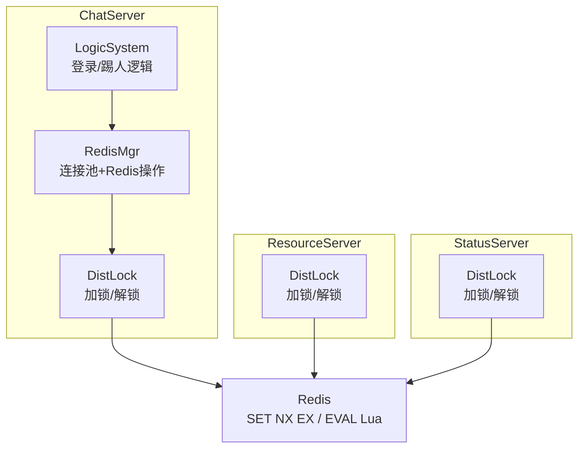
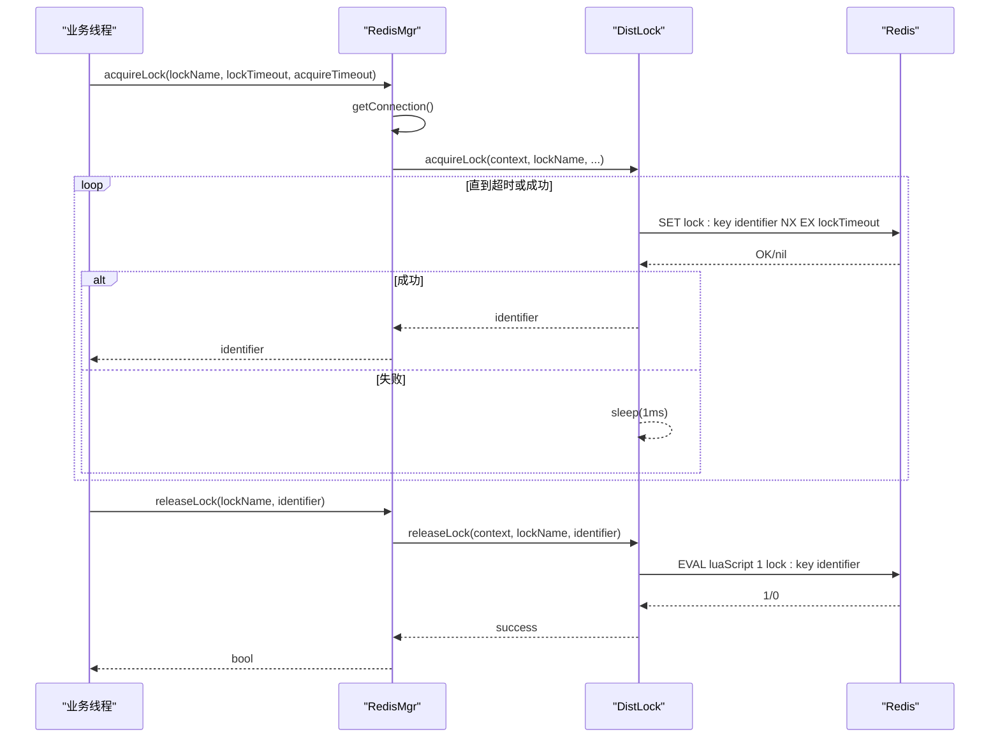
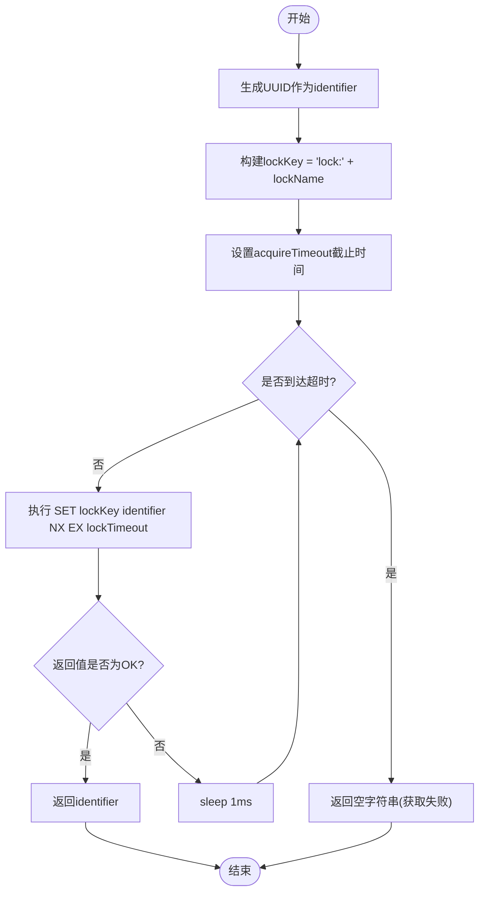
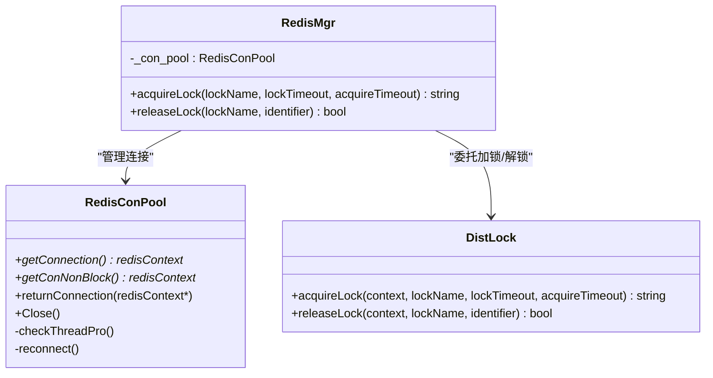
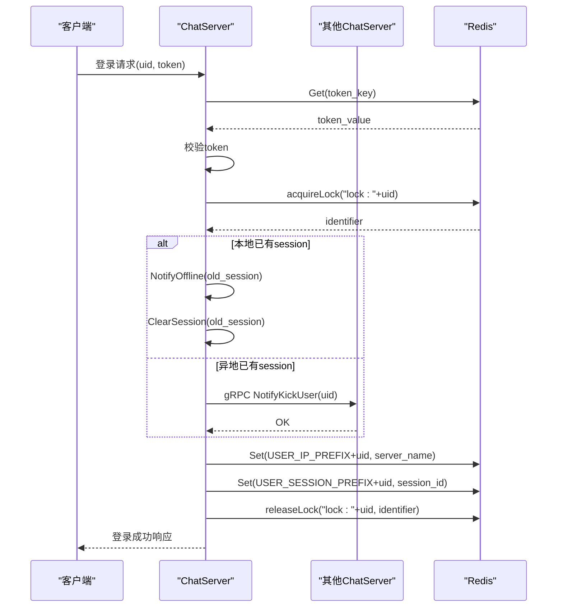
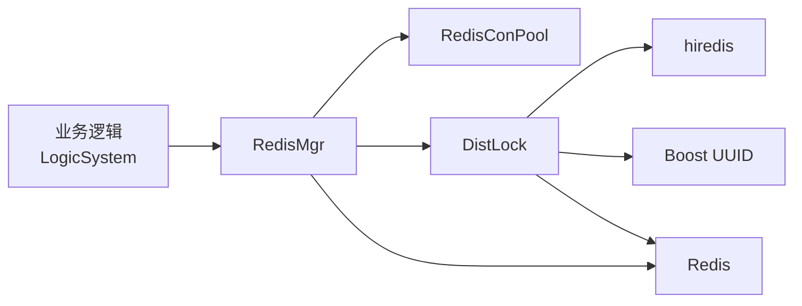

# 分布式锁实现

<cite>
**本文引用的文件**   
- [server/ChatServer/include/DistLock.h](file://server/ChatServer/include/DistLock.h)
- [server/ChatServer/src/DistLock.cpp](file://server/ChatServer/src/DistLock.cpp)
- [server/ResourceServer/include/DistLock.h](file://server/ResourceServer/include/DistLock.h)
- [server/ResourceServer/src/DistLock.cpp](file://server/ResourceServer/src/DistLock.cpp)
- [server/StatusServer/include/DistLock.h](file://server/StatusServer/include/DistLock.h)
- [server/StatusServer/src/DistLock.cpp](file://server/StatusServer/src/DistLock.cpp)
- [server/ChatServer/include/RedisMgr.h](file://server/ChatServer/include/RedisMgr.h)
- [server/ChatServer/src/RedisMgr.cpp](file://server/ChatServer/src/RedisMgr.cpp)
- [开发文档/day32分布式锁设计思路.md](file://开发文档/day32分布式锁设计思路.md)
- [开发文档/day33单服程踢人逻辑.md](file://开发文档/day33单服程踢人逻辑.md)
- [开发文档/day34多服程踢人逻辑.md](file://开发文档/day34多服程踢人逻辑.md)
</cite>

## 目录
1. [简介](#简介)
2. [项目结构](#项目结构)
3. [核心组件](#核心组件)
4. [架构总览](#架构总览)
5. [详细组件分析](#详细组件分析)
6. [依赖分析](#依赖分析)
7. [性能考虑](#性能考虑)
8. [故障排查指南](#故障排查指南)
9. [结论](#结论)
10. [附录](#附录)

## 简介
本文件面向LLFCChat项目的分布式锁实现，聚焦基于Redis的分布式锁机制与DistLock类的设计与使用。内容涵盖：
- SET NX EX命令的原子性、锁过期时间管理
- 解锁Lua脚本的原子性与安全性
- 获取锁重试策略与超时控制
- 在登录踢人、文件上传、会话管理等业务中的具体应用
- 锁粒度设计原则（细粒度 vs 粗粒度）
- 性能优化技巧与故障恢复机制
- 当前实现的局限与扩展方向（续期、公平锁、重入锁等）

## 项目结构
分布式锁相关代码分布在多个服务中，采用相同接口与实现模式：
- DistLock：提供加锁/解锁的核心能力
- RedisMgr：封装连接池与Redis操作，并对外暴露acquireLock/releaseLock
- 业务层（如LogicSystem）通过RedisMgr调用分布式锁，完成跨进程/跨服务的互斥

图示来源
- [server/ChatServer/src/RedisMgr.cpp:362-393](file://server/ChatServer/src/RedisMgr.cpp#L362-L393)
- [server/ChatServer/src/DistLock.cpp:27-73](file://server/ChatServer/src/DistLock.cpp#L27-L73)
- [server/ResourceServer/src/DistLock.cpp:27-73](file://server/ResourceServer/src/DistLock.cpp#L27-L73)
- [server/StatusServer/src/DistLock.cpp:27-73](file://server/StatusServer/src/DistLock.cpp#L27-L73)

章节来源
- [server/ChatServer/include/RedisMgr.h:267-305](file://server/ChatServer/include/RedisMgr.h#L267-L305)
- [server/ChatServer/src/RedisMgr.cpp:362-393](file://server/ChatServer/src/RedisMgr.cpp#L362-L393)

## 核心组件
- DistLock类
  - 职责：封装基于Redis的分布式锁获取与释放
  - 关键方法：acquireLock、releaseLock
  - 特性：生成唯一标识符identifier；使用SET NX EX进行原子加锁；使用EVAL执行Lua脚本原子解锁
- RedisMgr类
  - 职责：Redis连接池管理与基础命令封装；对外暴露acquireLock/releaseLock以简化上层调用
  - 关键方法：getConnection/returnConnection、HGet/HSet/Del、acquireLock/releaseLock
  - 连接健康检查：PING保活、失败重连

章节来源
- [server/ChatServer/include/DistLock.h:4-16](file://server/ChatServer/include/DistLock.h#L4-L16)
- [server/ChatServer/src/DistLock.cpp:27-73](file://server/ChatServer/src/DistLock.cpp#L27-L73)
- [server/ChatServer/include/RedisMgr.h:267-305](file://server/ChatServer/include/RedisMgr.h#L267-L305)
- [server/ChatServer/src/RedisMgr.cpp:362-393](file://server/ChatServer/src/RedisMgr.cpp#L362-L393)

## 架构总览
分布式锁的整体交互流程如下：
- 业务线程从RedisMgr获取连接
- 调用DistLock::acquireLock，使用SET key identifier NX EX timeout尝试加锁
- 成功则返回identifier，业务执行临界区后调用releaseLock
- releaseLock通过EVAL执行Lua脚本，判断value是否等于identifier再删除key，保证只有持有者能解锁

图示来源
- [server/ChatServer/src/RedisMgr.cpp:362-393](file://server/ChatServer/src/RedisMgr.cpp#L362-L393)
- [server/ChatServer/src/DistLock.cpp:27-73](file://server/ChatServer/src/DistLock.cpp#L27-L73)

## 详细组件分析

### DistLock类设计与实现
- 加锁流程
  - 生成全局唯一identifier（UUID）
  - 构造lockKey = "lock:" + lockName
  - 设置acquireTimeout截止时间，循环尝试SET NX EX
  - 成功返回identifier，失败则短暂休眠后重试
- 解锁流程
  - 使用EVAL执行Lua脚本：比较当前值是否为identifier，是则DEL，否则返回0
  - 确保解锁操作的原子性与安全性

图示来源
- [server/ChatServer/src/DistLock.cpp:27-49](file://server/ChatServer/src/DistLock.cpp#L27-L49)

章节来源
- [server/ChatServer/src/DistLock.cpp:27-73](file://server/ChatServer/src/DistLock.cpp#L27-L73)
- [开发文档/day32分布式锁设计思路.md:51-103](file://开发文档/day32分布式锁设计思路.md#L51-L103)

### RedisMgr对分布式锁的封装
- 连接池管理
  - 初始化时创建固定数量的redisContext
  - 提供getConnection/getConNonBlock/returnConnection
  - 后台线程定期PING检测连接健康，失败则重建
- 锁接口封装
  - acquireLock：获取连接后委托DistLock::acquireLock
  - releaseLock：获取连接后委托DistLock::releaseLock
  - 使用Defer确保连接归还

图示来源
- [server/ChatServer/include/RedisMgr.h:267-305](file://server/ChatServer/include/RedisMgr.h#L267-L305)
- [server/ChatServer/src/RedisMgr.cpp:362-393](file://server/ChatServer/src/RedisMgr.cpp#L362-L393)
- [server/ChatServer/include/DistLock.h:4-16](file://server/ChatServer/include/DistLock.h#L4-L16)

章节来源
- [server/ChatServer/src/RedisMgr.cpp:1-11](file://server/ChatServer/src/RedisMgr.cpp#L1-L11)
- [server/ChatServer/src/RedisMgr.cpp:362-393](file://server/ChatServer/src/RedisMgr.cpp#L362-L393)

### 业务场景：用户踢人与登录互斥
- 单服务器踢人
  - 登录流程中使用分布式锁按uid加锁，避免并发登录导致状态不一致
  - 若检测到同uid已在本地在线，发送下线通知并清理旧session
- 多服务器踢人
  - 若检测到同uid在其他服务器在线，通过gRPC通知对方服务器踢人
  - 使用分布式锁保护登录计数统计，避免并发更新错误

图示来源
- [开发文档/day33单服程踢人逻辑.md:241-383](file://开发文档/day33单服程踢人逻辑.md#L241-L383)
- [开发文档/day34多服程踢人逻辑.md:126-270](file://开发文档/day34多服程踢人逻辑.md#L126-L270)

章节来源
- [开发文档/day33单服程踢人逻辑.md:241-383](file://开发文档/day33单服程踢人逻辑.md#L241-L383)
- [开发文档/day34多服程踢人逻辑.md:126-270](file://开发文档/day34多服程踢人逻辑.md#L126-L270)

### 业务场景：文件上传与进度同步
- 文件分片上传
  - 客户端将文件切分为固定大小报文，携带seq、total_size、trans_size等字段
  - 服务端按seq顺序写入文件，支持断点续传（后续扩展）
- 分布式锁在文件上传中的应用建议
  - 针对同一文件的并发写入可使用细粒度锁（如“lock:upload:filename”），防止多进程同时写同一文件
  - 结合Redis键过期与Lua解锁，确保异常情况下锁自动释放

章节来源
- [开发文档/day31-文件传输.md:108-157](file://开发文档/day31-文件传输.md#L108-L157)
- [开发文档/day31-文件传输.md:315-372](file://开发文档/day31-文件传输.md#L315-L372)

### 高级特性与扩展方向
- 锁续期机制（Redlock思想）
  - 当前实现未包含自动续期，可在业务层根据任务耗时动态延长锁过期时间
  - 建议使用独立续期线程或异步任务，避免阻塞主流程
- 公平锁设计
  - 当前为无公平锁，可通过Redis有序集合维护等待队列，按FIFO分配锁
- 重入锁支持
  - 当前不支持重入，可引入计数器与owner标识，允许同一identifier多次获取
- 死锁预防
  - 严格遵循加锁顺序，避免嵌套加锁导致的循环等待
  - 合理设置acquireTimeout，避免长时间占用资源

章节来源
- [开发文档/day32分布式锁设计思路.md:193-242](file://开发文档/day32分布式锁设计思路.md#L193-L242)

## 依赖分析
- 组件耦合关系
  - RedisMgr依赖RedisConPool管理连接，依赖DistLock实现锁逻辑
  - DistLock依赖hiredis库与Boost UUID生成唯一标识
  - 业务层（LogicSystem等）通过RedisMgr间接使用分布式锁
- 外部依赖
  - Redis：提供原子命令SET NX EX与Lua脚本执行
  - hiredis：C语言Redis客户端库
  - Boost：UUID生成

图示来源
- [server/ChatServer/src/RedisMgr.cpp:1-11](file://server/ChatServer/src/RedisMgr.cpp#L1-L11)
- [server/ChatServer/src/DistLock.cpp:1-11](file://server/ChatServer/src/DistLock.cpp#L1-L11)

章节来源
- [server/ChatServer/include/RedisMgr.h:267-305](file://server/ChatServer/include/RedisMgr.h#L267-L305)
- [server/ChatServer/include/DistLock.h:4-16](file://server/ChatServer/include/DistLock.h#L4-L16)

## 性能考虑
- 连接池优化
  - 合理设置连接池大小，避免过多连接导致内存与上下文切换开销
  - 使用非阻塞获取连接getConNonBlock减少等待
- 锁获取优化
  - 调整acquireTimeout与sleep间隔，平衡CPU占用与延迟
  - 热点资源可考虑本地缓存锁状态，减少Redis访问频率
- 解锁优化
  - 使用Lua脚本保证原子性，避免额外网络往返
- 监控与告警
  - 记录锁获取成功率、平均耗时、超时次数等指标
  - 对Redis连接健康状态进行实时监控

[本节为通用指导，不直接分析具体文件]

## 故障排查指南
- 常见问题
  - 锁获取超时：检查Redis连通性、网络延迟、锁竞争程度
  - 解锁失败：确认identifier是否正确传递，避免误删他人锁
  - 连接池耗尽：检查连接归还逻辑，确保异常路径也能returnConnection
- 调试手段
  - 启用详细日志，记录加锁/解锁的关键步骤与返回值
  - 使用Redis CLI观察锁键状态与过期时间
- 恢复策略
  - 自动重连：RedisConPool已实现PING检测与重连
  - 锁过期保护：即使业务崩溃，锁也会自动释放

章节来源
- [server/ChatServer/src/RedisMgr.cpp:137-206](file://server/ChatServer/src/RedisMgr.cpp#L137-L206)
- [server/ChatServer/src/DistLock.cpp:52-73](file://server/ChatServer/src/DistLock.cpp#L52-L73)

## 结论
LLFCChat的分布式锁实现基于Redis的SET NX EX与Lua脚本，提供了基础的原子加锁与解锁能力。通过RedisMgr封装连接池与操作接口，业务层可以方便地在登录踢人、文件上传等场景中实现跨进程/跨服务的互斥。当前实现简洁可靠，但尚未包含锁续期、公平锁、重入锁等高级特性。建议在后续迭代中逐步完善这些功能，以提升系统的健壮性与可用性。

[本节为总结性内容，不直接分析具体文件]

## 附录
- 术语表
  - 分布式锁：用于协调分布式系统中多个节点对共享资源的访问
  - SET NX EX：Redis原子命令，仅当键不存在时设置值并指定过期时间
  - Lua脚本：在Redis服务器端执行的脚本，保证多条命令的原子性
- 最佳实践
  - 始终使用唯一identifier标识锁持有者
  - 合理设置锁过期时间，避免死锁
  - 使用Lua脚本进行解锁，确保原子性
  - 对热点资源采用细粒度锁，提高并发度

[本节为补充信息，不直接分析具体文件]