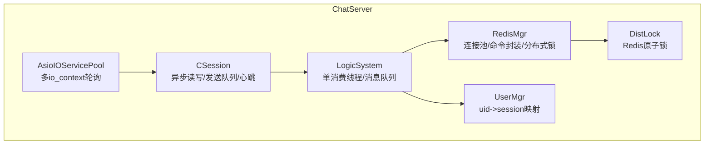
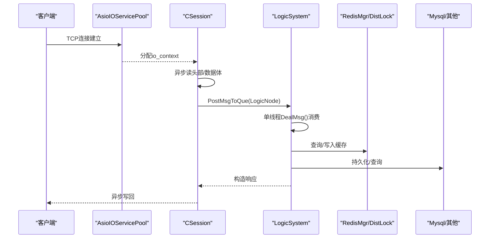
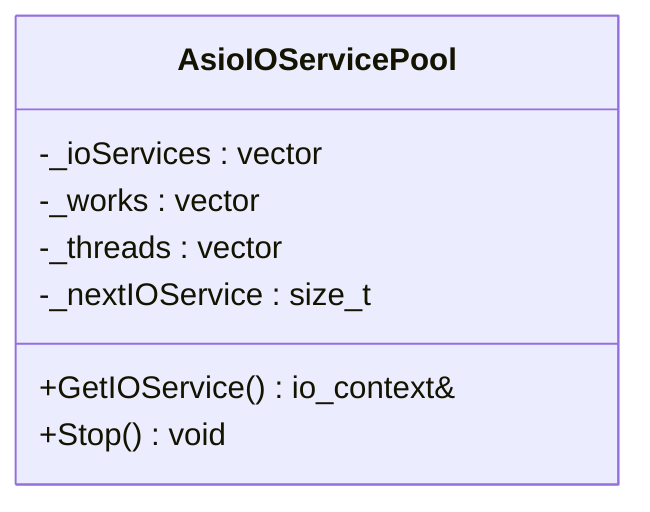
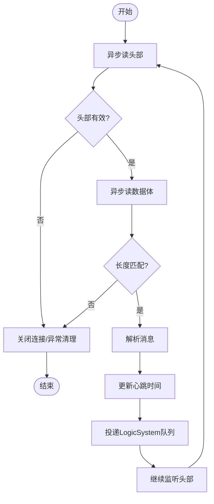
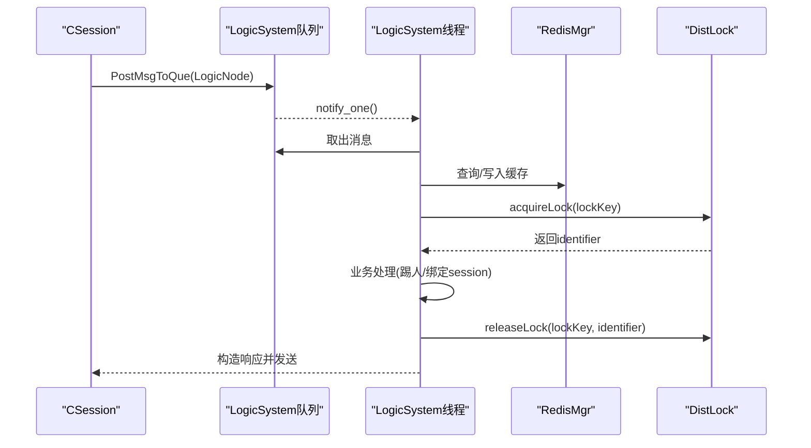
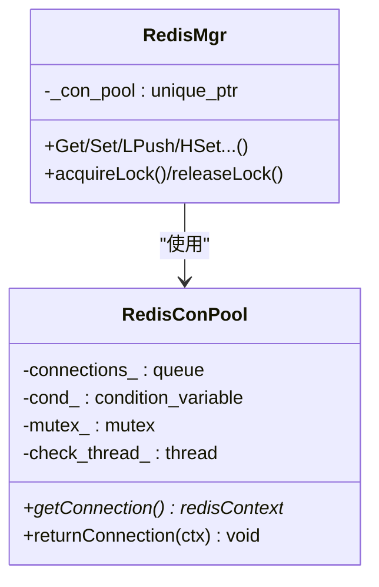
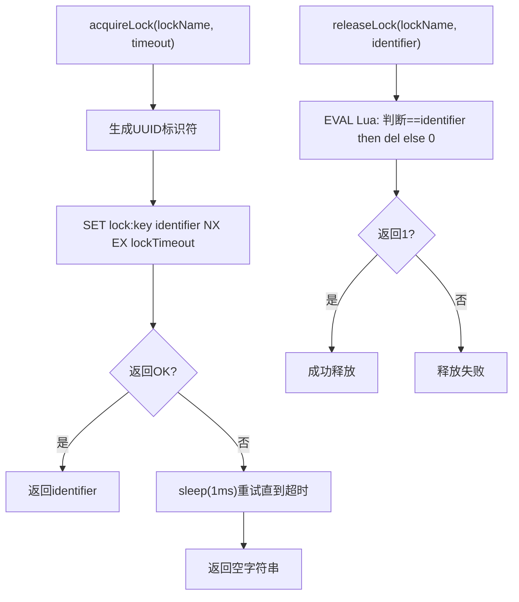
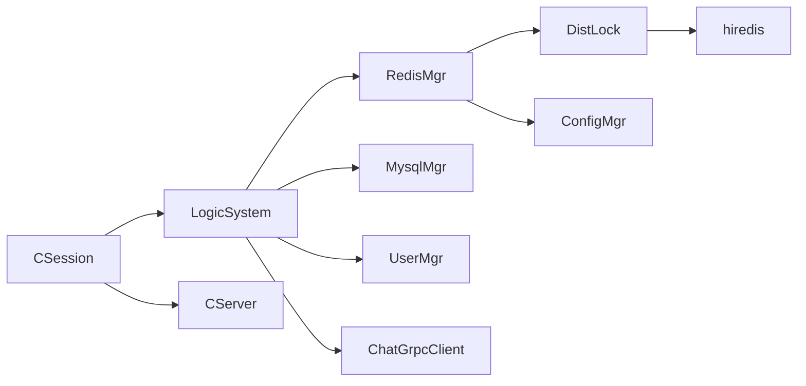

# 并发优化

<cite>
**本文引用的文件**   
- [AsioIOServicePool.h](file://server/ChatServer/include/AsioIOServicePool.h)
- [AsioIOServicePool.cpp](file://server/ChatServer/src/AsioIOServicePool.cpp)
- [CSession.h](file://server/ChatServer/include/CSession.h)
- [CSession.cpp](file://server/ChatServer/src/CSession.cpp)
- [DistLock.h](file://server/ChatServer/include/DistLock.h)
- [DistLock.cpp](file://server/ChatServer/src/DistLock.cpp)
- [RedisMgr.h](file://server/ChatServer/include/RedisMgr.h)
- [RedisMgr.cpp](file://server/ChatServer/src/RedisMgr.cpp)
- [UserMgr.h](file://server/ChatServer/include/UserMgr.h)
- [UserMgr.cpp](file://server/ChatServer/src/UserMgr.cpp)
- [LogicSystem.h](file://server/ChatServer/include/LogicSystem.h)
- [LogicSystem.cpp](file://server/ChatServer/src/LogicSystem.cpp)
- [AsioIOServicePool.h](file://server/GateServer/include/AsioIOServicePool.h)
</cite>

## 目录
1. [简介](#简介)
2. [项目结构](#项目结构)
3. [核心组件](#核心组件)
4. [架构总览](#架构总览)
5. [详细组件分析](#详细组件分析)
6. [依赖关系分析](#依赖关系分析)
7. [性能考量](#性能考量)
8. [故障排查指南](#故障排查指南)
9. [结论](#结论)
10. [附录](#附录)

## 简介
本文件面向LLFCChat项目的并发与分布式优化，聚焦以下主题：
- 多线程并发优化：线程池设计、任务调度、锁优化策略、无锁数据结构实践
- 异步I/O模型：Boost.Asio的异步读写、回调链、协程使用建议、任务并行化
- 分布式锁：基于Redis的原子操作、锁粒度控制、死锁预防
- 内存同步与线程安全：原子变量、内存屏障、线程局部存储、RAII资源管理
- 并发性能分析与调试：定位热点、减少锁竞争、提升吞吐与降低延迟

## 项目结构
本项目采用多服务架构（ChatServer、GateServer、ResourceServer等），每个服务内部普遍采用“事件驱动+线程池”的并发模型。关键并发点包括：
- AsioIOServicePool：为每个进程提供多个io_context，按轮询分配，避免单点阻塞
- CSession：封装TCP会话，异步读写、发送队列、心跳检测、异常清理
- LogicSystem：单消费者逻辑处理线程，消息队列+条件变量，解耦网络IO与业务逻辑
- RedisMgr：连接池+健康检查，封装常用命令与分布式锁接口
- DistLock：基于Redis SET NX EX + Lua释放的分布式锁实现
- UserMgr：用户会话映射表，互斥保护

**图表来源** 
- [AsioIOServicePool.h:1-28](file://server/ChatServer/include/AsioIOServicePool.h#L1-L28)
- [AsioIOServicePool.cpp:1-43](file://server/ChatServer/src/AsioIOServicePool.cpp#L1-L43)
- [CSession.h:1-86](file://server/ChatServer/include/CSession.h#L1-L86)
- [CSession.cpp:1-338](file://server/ChatServer/src/CSession.cpp#L1-L338)
- [LogicSystem.h:1-61](file://server/ChatServer/include/LogicSystem.h#L1-L61)
- [LogicSystem.cpp:1-800](file://server/ChatServer/src/LogicSystem.cpp#L1-L800)
- [RedisMgr.h:1-305](file://server/ChatServer/include/RedisMgr.h#L1-L305)
- [RedisMgr.cpp:1-462](file://server/ChatServer/src/RedisMgr.cpp#L1-L462)
- [UserMgr.h:1-22](file://server/ChatServer/include/UserMgr.h#L1-L22)
- [UserMgr.cpp:1-50](file://server/ChatServer/src/UserMgr.cpp#L1-L50)
- [DistLock.h:1-18](file://server/ChatServer/include/DistLock.h#L1-L18)
- [DistLock.cpp:1-73](file://server/ChatServer/src/DistLock.cpp#L1-L73)

**章节来源**
- [AsioIOServicePool.h:1-28](file://server/ChatServer/include/AsioIOServicePool.h#L1-L28)
- [AsioIOServicePool.cpp:1-43](file://server/ChatServer/src/AsioIOServicePool.cpp#L1-L43)
- [CSession.h:1-86](file://server/ChatServer/include/CSession.h#L1-L86)
- [CSession.cpp:1-338](file://server/ChatServer/src/CSession.cpp#L1-L338)
- [LogicSystem.h:1-61](file://server/ChatServer/include/LogicSystem.h#L1-L61)
- [LogicSystem.cpp:1-800](file://server/ChatServer/src/LogicSystem.cpp#L1-L800)
- [RedisMgr.h:1-305](file://server/ChatServer/include/RedisMgr.h#L1-L305)
- [RedisMgr.cpp:1-462](file://server/ChatServer/src/RedisMgr.cpp#L1-L462)
- [UserMgr.h:1-22](file://server/ChatServer/include/UserMgr.h#L1-L22)
- [UserMgr.cpp:1-50](file://server/ChatServer/src/UserMgr.cpp#L1-L50)
- [DistLock.h:1-18](file://server/ChatServer/include/DistLock.h#L1-L18)
- [DistLock.cpp:1-73](file://server/ChatServer/src/DistLock.cpp#L1-L73)

## 核心组件
- AsioIOServicePool：维护多个io_context与工作守护，按轮询返回；Stop时调用stop并释放work_guard使run退出，join所有线程
- CSession：封装socket、发送队列、异步读头/体、心跳时间戳（atomic）、异常清理；Send加锁入队，非空则触发一次异步写
- LogicSystem：单线程消费者，条件变量唤醒；注册消息ID到回调函数；在登录流程中使用分布式锁进行踢人/跨服协调
- RedisMgr：连接池初始化、获取/归还连接、PING健康检查与自动重连；封装GET/SET/LPUSH/HSET等命令；acquireLock/releaseLock委托DistLock
- DistLock：基于SET key identifier NX EX lockTimeout获取锁，EVAL Lua脚本原子判断并删除释放锁
- UserMgr：uid到session的映射，互斥保护增删查

**章节来源**
- [AsioIOServicePool.cpp:1-43](file://server/ChatServer/src/AsioIOServicePool.cpp#L1-L43)
- [CSession.cpp:1-338](file://server/ChatServer/src/CSession.cpp#L1-L338)
- [LogicSystem.cpp:1-800](file://server/ChatServer/src/LogicSystem.cpp#L1-L800)
- [RedisMgr.cpp:1-462](file://server/ChatServer/src/RedisMgr.cpp#L1-L462)
- [DistLock.cpp:1-73](file://server/ChatServer/src/DistLock.cpp#L1-L73)
- [UserMgr.cpp:1-50](file://server/ChatServer/src/UserMgr.cpp#L1-L50)

## 架构总览
下图展示从客户端请求到业务处理的并发路径：网络层通过AsioIOServicePool分发到CSession，读取后投递到LogicSystem队列，由单消费线程处理并访问Redis/Mysql，必要时通过DistLock保证一致性。

**图表来源** 
- [AsioIOServicePool.cpp:1-43](file://server/ChatServer/src/AsioIOServicePool.cpp#L1-L43)
- [CSession.cpp:1-338](file://server/ChatServer/src/CSession.cpp#L1-L338)
- [LogicSystem.cpp:1-800](file://server/ChatServer/src/LogicSystem.cpp#L1-L800)
- [RedisMgr.cpp:1-462](file://server/ChatServer/src/RedisMgr.cpp#L1-L462)
- [DistLock.cpp:1-73](file://server/ChatServer/src/DistLock.cpp#L1-L73)

## 详细组件分析

### AsioIOServicePool：高性能I/O线程池
- 设计要点
  - 多io_context + 工作守护，避免空转
  - 轮询选择io_context，降低热点
  - Stop顺序：先stop各context，再reset work_guard，最后join线程
- 并发特性
  - 无共享状态竞争（GetIOService仅自增索引）
  - 线程生命周期清晰，析构安全
- 优化建议
  - 根据CPU核数调整池大小
  - 监控各io_context的任务分布，必要时动态扩容

**图表来源** 
- [AsioIOServicePool.h:1-28](file://server/ChatServer/include/AsioIOServicePool.h#L1-L28)
- [AsioIOServicePool.cpp:1-43](file://server/ChatServer/src/AsioIOServicePool.cpp#L1-L43)

**章节来源**
- [AsioIOServicePool.h:1-28](file://server/ChatServer/include/AsioIOServicePool.h#L1-L28)
- [AsioIOServicePool.cpp:1-43](file://server/ChatServer/src/AsioIOServicePool.cpp#L1-L43)

### CSession：异步I/O与会话管理
- 设计要点
  - 异步读头/体：asyncReadHead -> asyncReadBody -> 解析 -> 投递LogicSystem
  - 发送队列：mutex保护，超过阈值丢弃，避免OOM
  - 心跳：atomic time_t记录最近接收时间，定时检测过期
  - 异常清理：加分布式锁清理用户会话与缓存
- 并发特性
  - 发送队列串行化写，避免竞态
  - 心跳字段使用原子类型，避免额外锁
- 优化建议
  - 发送队列可考虑无锁环形缓冲或分段队列
  - 心跳检测可改为惰性更新+后台扫描

**图表来源** 
- [CSession.cpp:133-194](file://server/ChatServer/src/CSession.cpp#L133-L194)
- [CSession.cpp:223-251](file://server/ChatServer/src/CSession.cpp#L223-L251)
- [CSession.cpp:288-302](file://server/ChatServer/src/CSession.cpp#L288-L302)

**章节来源**
- [CSession.h:1-86](file://server/ChatServer/include/CSession.h#L1-L86)
- [CSession.cpp:1-338](file://server/ChatServer/src/CSession.cpp#L1-L338)

### LogicSystem：单消费者任务调度
- 设计要点
  - 单线程DealMsg循环，条件变量唤醒
  - 注册消息ID到回调函数，统一派发
  - 登录流程中通过分布式锁实现踢人与跨服通知
- 并发特性
  - 生产者（CSession）与消费者（LogicSystem）通过队列解耦
  - 停止时清空队列，确保优雅退出
- 优化建议
  - 可按消息类型分派到多个消费者线程，提高吞吐
  - 对热键（如登录）做本地缓存或批量处理

**图表来源** 
- [LogicSystem.cpp:27-81](file://server/ChatServer/src/LogicSystem.cpp#L27-L81)
- [LogicSystem.cpp:116-254](file://server/ChatServer/src/LogicSystem.cpp#L116-L254)
- [RedisMgr.cpp:362-393](file://server/ChatServer/src/RedisMgr.cpp#L362-L393)
- [DistLock.cpp:27-73](file://server/ChatServer/src/DistLock.cpp#L27-L73)

**章节来源**
- [LogicSystem.h:1-61](file://server/ChatServer/include/LogicSystem.h#L1-L61)
- [LogicSystem.cpp:1-800](file://server/ChatServer/src/LogicSystem.cpp#L1-L800)

### RedisMgr：连接池与分布式锁封装
- 设计要点
  - 连接池：固定大小，条件变量等待可用连接
  - 健康检查：后台线程定期PING，失败计数与自动重连
  - 命令封装：GET/SET/LPUSH/HSET等，统一错误处理与连接归还
  - 分布式锁：acquireLock/releaseLock委托DistLock
- 并发特性
  - 连接池互斥保护，条件变量高效唤醒
  - 原子计数器统计失败次数
- 优化建议
  - 连接池大小按负载调优
  - PING间隔与超时参数可调

**图表来源** 
- [RedisMgr.h:1-305](file://server/ChatServer/include/RedisMgr.h#L1-L305)
- [RedisMgr.cpp:1-462](file://server/ChatServer/src/RedisMgr.cpp#L1-L462)

**章节来源**
- [RedisMgr.h:1-305](file://server/ChatServer/include/RedisMgr.h#L1-L305)
- [RedisMgr.cpp:1-462](file://server/ChatServer/src/RedisMgr.cpp#L1-L462)

### DistLock：基于Redis的分布式锁
- 设计要点
  - 获取锁：SET key identifier NX EX lockTimeout，带过期时间防死锁
  - 释放锁：EVAL Lua脚本原子判断identifier并删除
  - UUID标识符保证唯一性
- 并发特性
  - 原子操作保证跨进程/跨节点一致性
  - 超时机制防止僵尸锁
- 优化建议
  - 可引入看门狗续期机制增强可靠性
  - 锁粒度尽量细化，减少冲突

**图表来源** 
- [DistLock.cpp:27-73](file://server/ChatServer/src/DistLock.cpp#L27-L73)

**章节来源**
- [DistLock.h:1-18](file://server/ChatServer/include/DistLock.h#L1-L18)
- [DistLock.cpp:1-73](file://server/ChatServer/src/DistLock.cpp#L1-L73)

### UserMgr：用户会话映射
- 设计要点
  - unordered_map<int, shared_ptr<CSession>>，互斥保护
  - Set/Rmv/Get方法均加锁
- 并发特性
  - 简单互斥足够，避免细粒度锁复杂化
- 优化建议
  - 热点uid可考虑分片或本地缓存

**章节来源**
- [UserMgr.h:1-22](file://server/ChatServer/include/UserMgr.h#L1-L22)
- [UserMgr.cpp:1-50](file://server/ChatServer/src/UserMgr.cpp#L1-L50)

## 依赖关系分析
- 组件耦合
  - CSession依赖CServer（清除会话）、LogicSystem（投递消息）
  - LogicSystem依赖RedisMgr、MysqlMgr、UserMgr、ChatGrpcClient
  - RedisMgr依赖DistLock、ConfigMgr
  - DistLock依赖hiredis与Boost UUID
- 潜在循环依赖
  - 当前未见明显循环，注意新增回调时保持单向依赖
- 外部依赖
  - Boost.Asio/Beast、gRPC、MySQL、Redis

**图表来源** 
- [CSession.cpp:1-338](file://server/ChatServer/src/CSession.cpp#L1-L338)
- [LogicSystem.cpp:1-800](file://server/ChatServer/src/LogicSystem.cpp#L1-L800)
- [RedisMgr.cpp:1-462](file://server/ChatServer/src/RedisMgr.cpp#L1-L462)
- [DistLock.cpp:1-73](file://server/ChatServer/src/DistLock.cpp#L1-L73)

**章节来源**
- [CSession.cpp:1-338](file://server/ChatServer/src/CSession.cpp#L1-L338)
- [LogicSystem.cpp:1-800](file://server/ChatServer/src/LogicSystem.cpp#L1-L800)
- [RedisMgr.cpp:1-462](file://server/ChatServer/src/RedisMgr.cpp#L1-L462)
- [DistLock.cpp:1-73](file://server/ChatServer/src/DistLock.cpp#L1-L73)

## 性能考量
- I/O线程池
  - 合理设置io_context数量，避免上下文切换开销
  - 监控各io_context任务堆积情况
- 发送队列
  - 限制最大长度，防止内存暴涨
  - 可考虑无锁队列或分段队列降低锁竞争
- 逻辑处理
  - 单消费者可能成为瓶颈，可按消息类型拆分消费者
  - 热点操作（如登录）增加本地缓存或批量处理
- Redis连接池
  - 连接数与PING间隔需按负载调优
  - 失败重连策略避免雪崩
- 分布式锁
  - 锁粒度细化，缩短持有时间
  - 评估是否需要看门狗续期

[本节为通用指导，不直接分析具体文件]

## 故障排查指南
- 常见问题
  - 发送队列满：检查网络拥塞或下游处理慢
  - 心跳过期：检查客户端保活与服务端清理逻辑
  - Redis连接耗尽：检查连接池大小与健康检查
  - 分布式锁超时：检查业务耗时与锁超时配置
- 定位手段
  - 日志关键字：handle read failed、send que fulled、heartbeat expired
  - 指标监控：队列长度、连接池占用、锁等待时长
  - 工具：perf、valgrind、gdb追踪阻塞点

**章节来源**
- [CSession.cpp:196-220](file://server/ChatServer/src/CSession.cpp#L196-L220)
- [CSession.cpp:288-302](file://server/ChatServer/src/CSession.cpp#L288-L302)
- [RedisMgr.cpp:137-206](file://server/ChatServer/src/RedisMgr.cpp#L137-L206)
- [DistLock.cpp:27-73](file://server/ChatServer/src/DistLock.cpp#L27-L73)

## 结论
LLFCChat在服务端采用了成熟的“事件驱动+单消费者逻辑”并发模型，结合AsioIOServicePool、CSession、LogicSystem、RedisMgr与DistLock，实现了高吞吐、低延迟与强一致性的分布式能力。进一步优化方向包括：
- 将单消费者扩展为多消费者以提升吞吐
- 引入无锁数据结构优化热点路径
- 完善分布式锁的看门狗续期与监控告警
- 加强性能剖析与压测闭环

[本节为总结，不直接分析具体文件]

## 附录
- 相关服务中的AsioIOServicePool实现参考GateServer版本，结构与ChatServer一致，便于横向对比与统一优化

**章节来源**
- [AsioIOServicePool.h:1-28](file://server/GateServer/include/AsioIOServicePool.h#L1-L28)