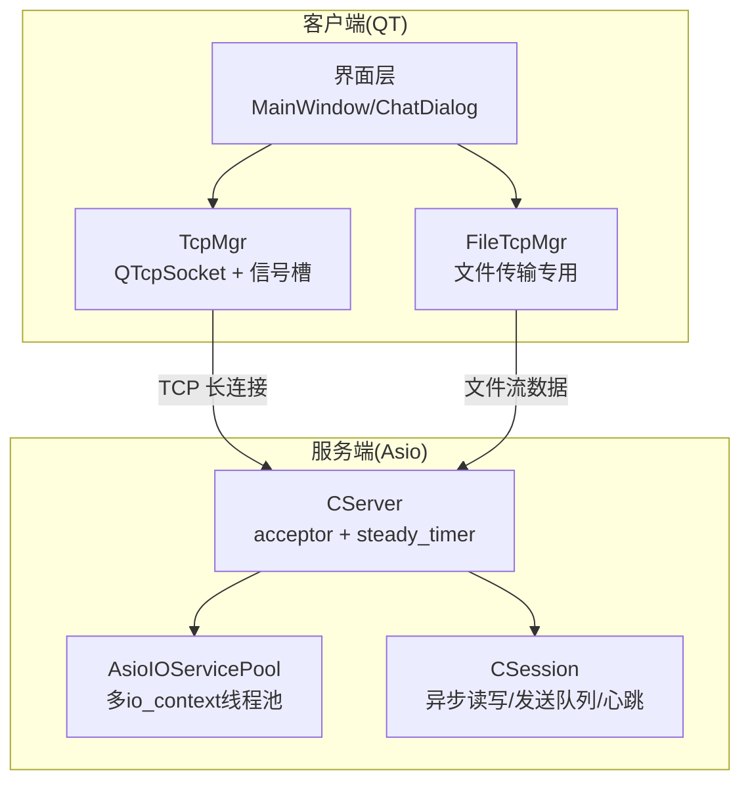
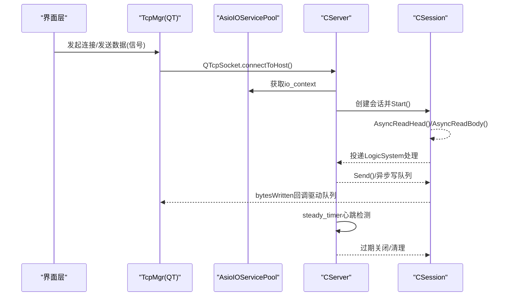
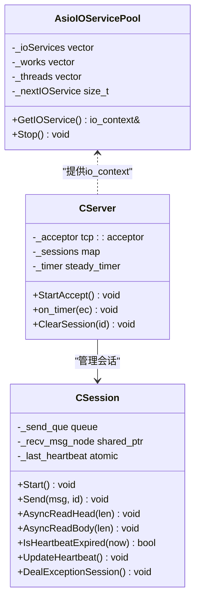
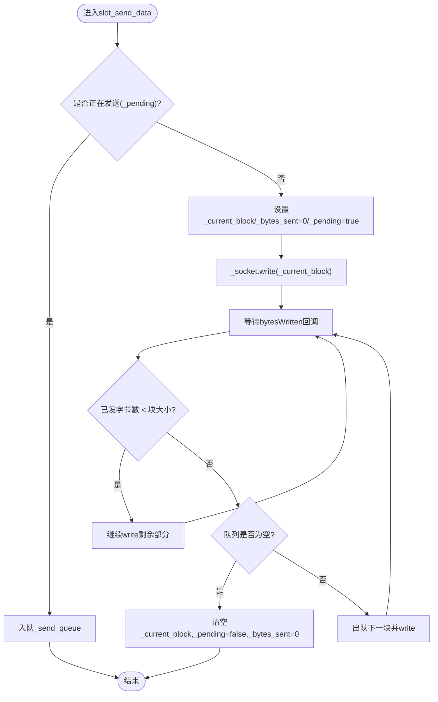
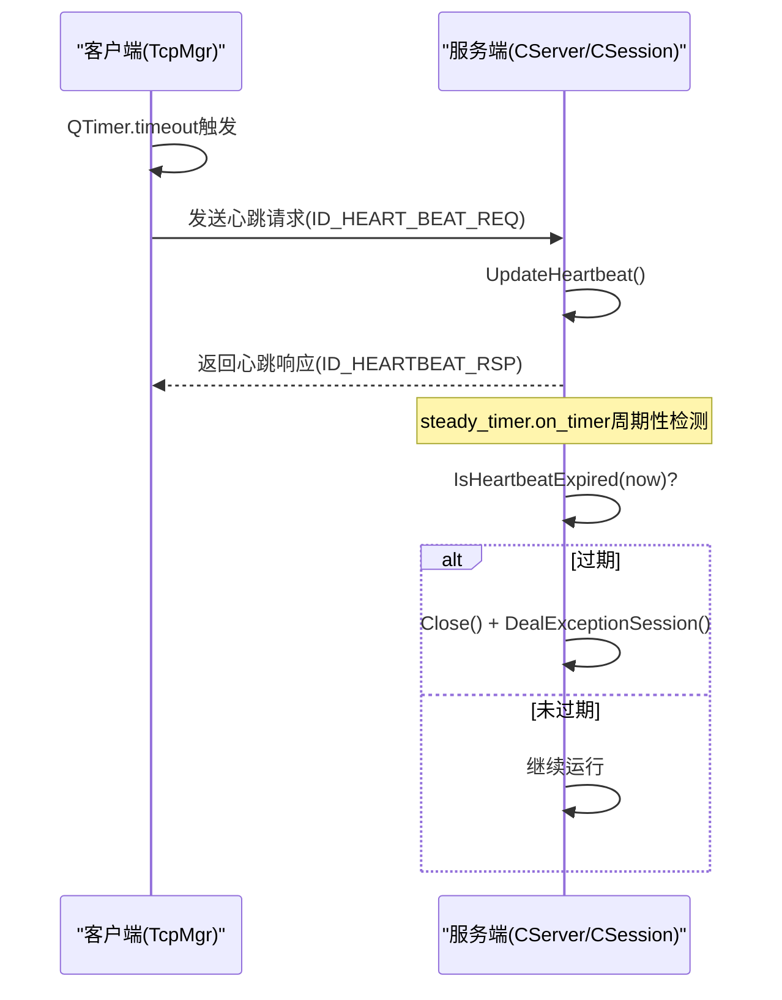
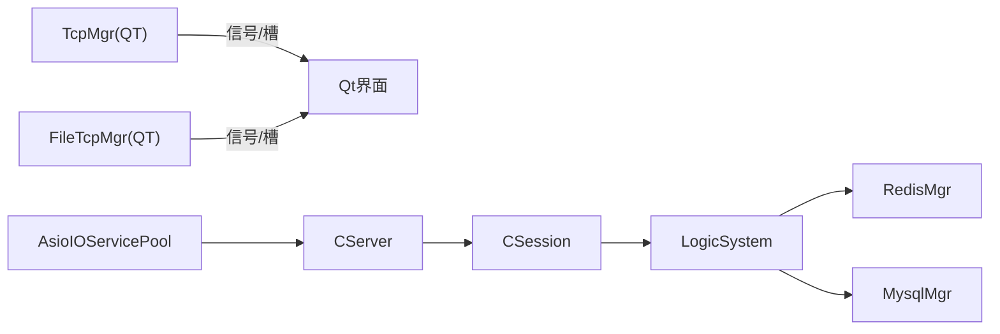

# 异步编程模型

<cite>
**本文引用的文件**   
- [tcpmgr.h](file://client/llfcchat/include/tcpmgr.h)
- [tcpmgr.cpp](file://client/llfcchat/src/tcpmgr.cpp)
- [filetcpmgr.h](file://client/llfcchat/include/filetcpmgr.h)
- [CSession.h](file://server/ChatServer/include/CSession.h)
- [CSession.cpp](file://server/ChatServer/src/CSession.cpp)
- [AsioIOServicePool.h](file://server/ChatServer/include/AsioIOServicePool.h)
- [AsioIOServicePool.cpp](file://server/ChatServer/src/AsioIOServicePool.cpp)
- [CServer.h](file://server/ChatServer/include/CServer.h)
- [day15-客户端Tcp管理类设计.md](file://开发文档/day15-客户端Tcp管理类设计.md)
- [day16-asio实现tcp服务器.md](file://开发文档/day16-asio实现tcp服务器.md)
- [day35心跳逻辑.md](file://开发文档/day35心跳逻辑.md)
- [day38-断点续传.md](file://开发文档/day38-断点续传.md)
</cite>

## 目录
1. [引言](#引言)
2. [项目结构](#项目结构)
3. [核心组件](#核心组件)
4. [架构总览](#架构总览)
5. [详细组件分析](#详细组件分析)
6. [依赖关系分析](#依赖关系分析)
7. [性能考量](#性能考量)
8. [故障排查指南](#故障排查指南)
9. [结论](#结论)
10. [附录：最佳实践与调试方法](#附录最佳实践与调试方法)

## 引言
本文件面向LLFCChat项目的异步编程模型，系统性阐述Boost.Asio在服务器端的异步I/O模式（连接建立、非阻塞读写、定时器、信号处理），以及Qt框架在客户端的异步机制（信号槽、事件循环、线程间通信、UI更新安全）。同时覆盖TCP连接管理中的连接池维护、消息队列、错误重试、超时控制等关键实现，并给出最佳实践、代码示例路径与调试方法。

## 项目结构
- 客户端（Qt）通过QTcpSocket进行长连接，使用信号槽驱动收发流程；采用发送队列与bytesWritten回调实现可靠写入。
- 服务端（Boost.Asio）基于多io_context线程池，每个会话由CSession封装，采用异步读头/体、异步写队列与定时器心跳检测。
- 服务间通过gRPC交互，状态与资源服务复用相同AsioIOServicePool模式。

**图表来源** 
- [tcpmgr.h:1-90](file://client/llfcchat/include/tcpmgr.h#L1-L90)
- [tcpmgr.cpp:1-136](file://client/llfcchat/src/tcpmgr.cpp#L1-L136)
- [filetcpmgr.h:1-85](file://client/llfcchat/include/filetcpmgr.h#L1-L85)
- [AsioIOServicePool.h:1-28](file://server/ChatServer/include/AsioIOServicePool.h#L1-L28)
- [CServer.h:1-33](file://server/ChatServer/include/CServer.h#L1-L33)
- [CSession.h:1-86](file://server/ChatServer/include/CSession.h#L1-L86)

**章节来源**
- [tcpmgr.h:1-90](file://client/llfcchat/include/tcpmgr.h#L1-L90)
- [tcpmgr.cpp:1-136](file://client/llfcchat/src/tcpmgr.cpp#L1-L136)
- [filetcpmgr.h:1-85](file://client/llfcchat/include/filetcpmgr.h#L1-L85)
- [AsioIOServicePool.h:1-28](file://server/ChatServer/include/AsioIOServicePool.h#L1-L28)
- [CServer.h:1-33](file://server/ChatServer/include/CServer.h#L1-L33)
- [CSession.h:1-86](file://server/ChatServer/include/CSession.h#L1-L86)

## 核心组件
- 客户端TcpMgr：封装QTcpSocket，负责连接、粘包/半包解析、发送队列与bytesWritten驱动、错误与断开信号上报。
- 客户端FileTcpMgr：独立文件传输通道，支持断点续传、拥塞窗口控制、进度信号。
- 服务端AsioIOServicePool：多io_context轮询分配，每进程多线程并行处理IO。
- 服务端CServer：监听端口、接受连接、维护会话映射、定时心跳检测。
- 服务端CSession：封装socket，异步读头/体、异步写队列、心跳时间戳、异常清理。

**章节来源**
- [tcpmgr.cpp:1-136](file://client/llfcchat/src/tcpmgr.cpp#L1-L136)
- [filetcpmgr.h:1-85](file://client/llfcchat/include/filetcpmgr.h#L1-L85)
- [AsioIOServicePool.cpp:1-43](file://server/ChatServer/src/AsioIOServicePool.cpp#L1-L43)
- [CServer.h:1-33](file://server/ChatServer/include/CServer.h#L1-L33)
- [CSession.cpp:1-338](file://server/ChatServer/src/CSession.cpp#L1-L338)

## 架构总览
下图展示从客户端发起请求到服务端处理的完整异步链路，包括连接建立、消息收发、心跳与异常处理。

**图表来源** 
- [tcpmgr.cpp:1-136](file://client/llfcchat/src/tcpmgr.cpp#L1-L136)
- [AsioIOServicePool.cpp:1-43](file://server/ChatServer/src/AsioIOServicePool.cpp#L1-L43)
- [CServer.h:1-33](file://server/ChatServer/include/CServer.h#L1-L33)
- [CSession.cpp:1-338](file://server/ChatServer/src/CSession.cpp#L1-L338)

## 详细组件分析

### Boost.Asio 异步I/O模式（服务器端）
- 连接建立：CServer::StartAccept使用async_accept，分配io_context后构造CSession并启动读取。
- 非阻塞读写：CSession::AsyncReadHead/AsyncReadBody组合async_read_some递归拼装完整报文；HandleWrite按队列顺序异步写出。
- 定时器：CServer::on_timer周期性检查会话心跳，超过阈值则Close并清理。
- 信号处理：main中signal_set监听SIGINT/SIGTERM，停止io_context与pool。

**图表来源** 
- [AsioIOServicePool.h:1-28](file://server/ChatServer/include/AsioIOServicePool.h#L1-L28)
- [AsioIOServicePool.cpp:1-43](file://server/ChatServer/src/AsioIOServicePool.cpp#L1-L43)
- [CServer.h:1-33](file://server/ChatServer/include/CServer.h#L1-L33)
- [CSession.h:1-86](file://server/ChatServer/include/CSession.h#L1-L86)
- [CSession.cpp:1-338](file://server/ChatServer/src/CSession.cpp#L1-L338)

**章节来源**
- [day16-asio实现tcp服务器.md:1-339](file://开发文档/day16-asio实现tcp服务器.md#L1-L339)
- [CSession.cpp:1-338](file://server/ChatServer/src/CSession.cpp#L1-L338)
- [AsioIOServicePool.cpp:1-43](file://server/ChatServer/src/AsioIOServicePool.cpp#L1-L43)
- [CServer.h:1-33](file://server/ChatServer/include/CServer.h#L1-L33)

### Qt 异步编程（客户端）
- 信号槽驱动：TcpMgr将网络事件（connected/readyRead/error/disconnected）映射为业务信号，UI层订阅处理。
- 事件循环：QTimer驱动心跳与倒计时；QTcpSocket的bytesWritten作为“回调”推进发送队列。
- 线程安全：跨线程发送统一走sig_send_data信号入队，避免直接调用write造成竞态。
- UI更新安全：所有UI操作在主线程槽函数内执行，避免跨线程访问控件。

**图表来源** 
- [tcpmgr.cpp:1-136](file://client/llfcchat/src/tcpmgr.cpp#L1-L136)
- [day38-断点续传.md:390-431](file://开发文档/day38-断点续传.md#L390-L431)

**章节来源**
- [tcpmgr.h:1-90](file://client/llfcchat/include/tcpmgr.h#L1-L90)
- [tcpmgr.cpp:1-136](file://client/llfcchat/src/tcpmgr.cpp#L1-L136)
- [day15-客户端Tcp管理类设计.md:1-236](file://开发文档/day15-客户端Tcp管理类设计.md#L1-L236)
- [day38-断点续传.md:390-431](file://开发文档/day38-断点续传.md#L390-L431)

### 心跳与超时控制
- 客户端：QTimer定时发送心跳请求，收到回复即认为连接活跃。
- 服务端：steady_timer周期遍历会话，比较_last_heartbeat与当前时间，超过阈值则关闭并清理。
- 异常清理：DealExceptionSession结合分布式锁与Redis清理用户会话信息，避免僵尸连接。

**图表来源** 
- [day35心跳逻辑.md:1-750](file://开发文档/day35心跳逻辑.md#L1-L750)
- [CSession.cpp:1-338](file://server/ChatServer/src/CSession.cpp#L1-L338)
- [CServer.h:1-33](file://server/ChatServer/include/CServer.h#L1-L33)

**章节来源**
- [day35心跳逻辑.md:1-750](file://开发文档/day35心跳逻辑.md#L1-L750)
- [CSession.cpp:1-338](file://server/ChatServer/src/CSession.cpp#L1-L338)

### 文件传输与断点续传
- FileTcpMgr独立通道，支持批量发送、断点续传、拥塞窗口控制、下载进度信号。
- 发送侧：分片写入+队列驱动；接收侧：按唯一文件名续写，失败重试。
- UI侧：通过信号更新进度条与完成提示。

**章节来源**
- [filetcpmgr.h:1-85](file://client/llfcchat/include/filetcpmgr.h#L1-L85)
- [day38-断点续传.md:390-431](file://开发文档/day38-断点续传.md#L390-L431)

## 依赖关系分析
- 客户端依赖Qt网络模块与JSON库，通过信号槽解耦网络与UI。
- 服务端依赖Boost.Asio/Beast、gRPC、Redis、MySQL；AsioIOServicePool为全局单例，被CServer与多个服务复用。
- 会话生命周期由CServer管理，CSession持有socket与发送队列，逻辑处理通过LogicSystem投递。

**图表来源** 
- [tcpmgr.h:1-90](file://client/llfcchat/include/tcpmgr.h#L1-L90)
- [AsioIOServicePool.h:1-28](file://server/ChatServer/include/AsioIOServicePool.h#L1-L28)
- [CServer.h:1-33](file://server/ChatServer/include/CServer.h#L1-L33)
- [CSession.h:1-86](file://server/ChatServer/include/CSession.h#L1-L86)

**章节来源**
- [tcpmgr.h:1-90](file://client/llfcchat/include/tcpmgr.h#L1-L90)
- [AsioIOServicePool.h:1-28](file://server/ChatServer/include/AsioIOServicePool.h#L1-L28)
- [CServer.h:1-33](file://server/ChatServer/include/CServer.h#L1-L33)
- [CSession.h:1-86](file://server/ChatServer/include/CSession.h#L1-L86)

## 性能考量
- 服务端并发：AsioIOServicePool按CPU核数创建多个io_context，降低锁竞争，提升吞吐。
- 发送队列：CSession与TcpMgr均使用队列缓冲突发流量，避免阻塞主IO线程。
- 心跳间隔：合理设置心跳阈值（如60s），平衡实时性与开销。
- 粘包/半包：服务端按固定长度头+体协议解析，客户端用缓冲区累积再拆分，减少系统调用次数。
- 资源释放：异常路径及时Close并清理会话，防止内存泄漏与僵尸连接。

[本节为通用指导，不直接分析具体文件]

## 故障排查指南
- 连接失败：检查host/port配置、防火墙、服务是否监听；查看error信号分类（拒绝、主机未知、超时等）。
- 粘包/乱序：确认两端协议一致（ID+Length前缀），检查缓冲区移除逻辑与消息边界。
- 发送卡住：检查_pending标志与bytesWritten回调是否成对出现；确认队列出队逻辑。
- 心跳超时：核对客户端QTimer间隔与服务端阈值；观察_is_expired判断与UpdateHeartbeat时机。
- 死锁风险：避免交叉加锁（本地mutex与分布式锁顺序不一致）；参考心跳文档中的重构方案。

**章节来源**
- [tcpmgr.cpp:1-136](file://client/llfcchat/src/tcpmgr.cpp#L1-L136)
- [day35心跳逻辑.md:1-750](file://开发文档/day35心跳逻辑.md#L1-L750)

## 结论
LLFCChat在客户端以Qt信号槽为核心构建异步I/O，在服务端以Boost.Asio的多io_context线程池为基础，配合会话级异步读写、发送队列与定时器心跳，形成高并发、低延迟、可观测的聊天通信体系。通过严格的协议设计与健壮的错误处理，系统在复杂网络环境下具备良好稳定性。

[本节为总结性内容，不直接分析具体文件]

## 附录：最佳实践与调试方法
- 错误处理
  - 统一错误码与日志，区分网络错误与应用错误。
  - 在异步回调中捕获异常，确保资源释放与状态回滚。
- 资源管理
  - 使用RAII与智能指针管理socket与会话；析构时确保关闭与清理。
  - 队列满时快速失败或限流，避免内存膨胀。
- 性能监控
  - 统计发送/接收速率、队列长度、心跳成功率、会话存活率。
  - 使用profiler定位热点（序列化、JSON解析、磁盘IO）。
- 调试技巧
  - 打印关键路径日志（连接、读头/体、写队列、心跳）。
  - 使用抓包工具验证协议字段与顺序。
  - 模拟网络抖动/丢包测试鲁棒性。

[本节为通用指导，不直接分析具体文件]