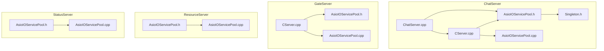
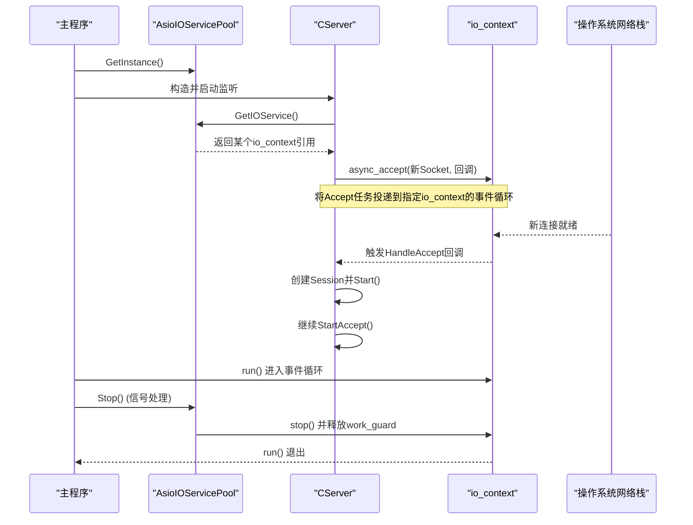
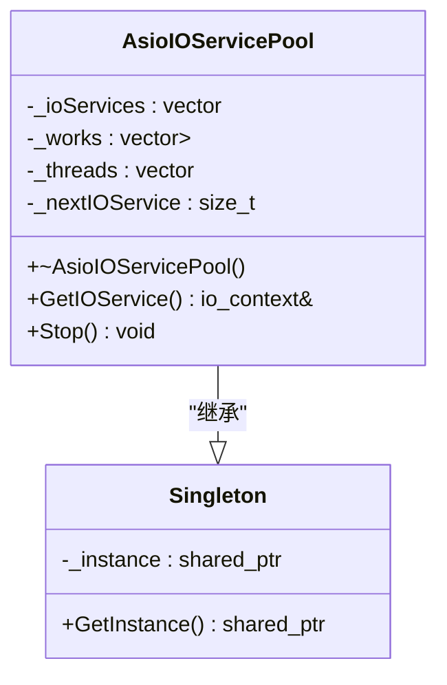
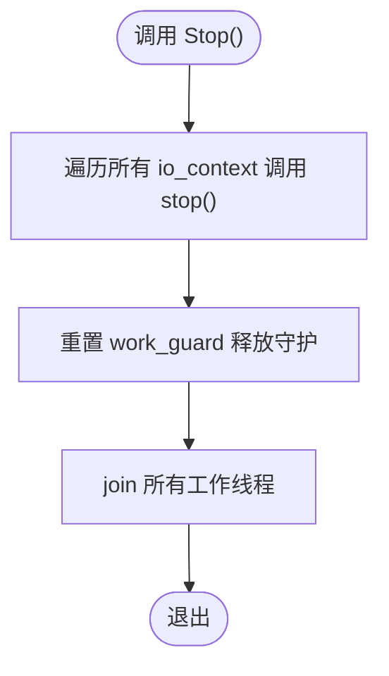
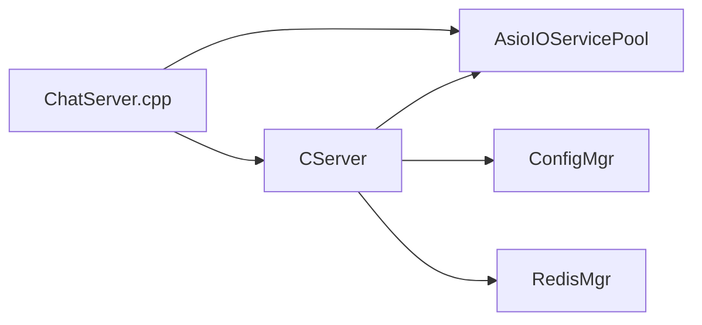

# 线程池设计

<cite>
**本文引用的文件**   
- [AsioIOServicePool.h](file://server/ChatServer/include/AsioIOServicePool.h)
- [AsioIOServicePool.cpp](file://server/ChatServer/src/AsioIOServicePool.cpp)
- [CServer.cpp](file://server/ChatServer/src/CServer.cpp)
- [ChatServer.cpp](file://server/ChatServer/src/ChatServer.cpp)
- [Singleton.h](file://server/ChatServer/include/Singleton.h)
- [config.ini](file://server/GateServer/config/config.ini)
- [chatserver1.ini](file://server/ChatServer/config/chatserver1.ini)
- [AsioIOServicePool.h（Gate）](file://server/GateServer/include/AsioIOServicePool.h)
- [AsioIOServicePool.cpp（Gate）](file://server/GateServer/src/AsioIOServicePool.cpp)
- [CServer.cpp（Gate）](file://server/GateServer/src/CServer.cpp)
- [AsioIOServicePool.h（Resource）](file://server/ResourceServer/include/AsioIOServicePool.h)
- [AsioIOServicePool.cpp（Resource）](file://server/ResourceServer/src/AsioIOServicePool.cpp)
- [AsioIOServicePool.h（Status）](file://server/StatusServer/include/AsioIOServicePool.h)
- [AsioIOServicePool.cpp（Status）](file://server/StatusServer/src/AsioIOServicePool.cpp)
</cite>

## 目录
1. [简介](#简介)
2. [项目结构](#项目结构)
3. [核心组件](#核心组件)
4. [架构总览](#架构总览)
5. [详细组件分析](#详细组件分析)
6. [依赖关系分析](#依赖关系分析)
7. [性能考量与调优](#性能考量与调优)
8. [故障排查指南](#故障排查指南)
9. [结论](#结论)
10. [附录：使用示例与最佳实践](#附录使用示例与最佳实践)

## 简介
本文件围绕LLFCChat服务端中的AsioIOServicePool线程池设计与Boost.Asio异步I/O模型进行深入解析。内容涵盖任务队列管理、线程调度算法、负载均衡策略、动态线程调整、事件循环与回调机制、任务分发与内存管理，以及配置参数调优、异常恢复与性能优化技巧，并给出使用最佳实践与常见问题解决方案。

## 项目结构
- 各服务模块（ChatServer、GateServer、ResourceServer、StatusServer）均包含独立的AsioIOServicePool实现，采用单例模式提供全局访问。
- CServer负责TCP/HTTP连接的Accept与Session生命周期管理，通过AsioIOServicePool获取io_context以注册异步操作。
- 主程序入口在各自服务的main中启动io_context.run()，并通过信号处理优雅退出。

图表来源 
- [CServer.cpp:34-38](file://server/ChatServer/src/CServer.cpp#L34-L38)
- [ChatServer.cpp:20-81](file://server/ChatServer/src/ChatServer.cpp#L20-L81)
- [AsioIOServicePool.h:1-28](file://server/ChatServer/include/AsioIOServicePool.h#L1-L28)
- [AsioIOServicePool.cpp:1-43](file://server/ChatServer/src/AsioIOServicePool.cpp#L1-L43)
- [Singleton.h:1-33](file://server/ChatServer/include/Singleton.h#L1-L33)
- [CServer.cpp（Gate）:10-36](file://server/GateServer/src/CServer.cpp#L10-L36)
- [AsioIOServicePool.h（Gate）:1-28](file://server/GateServer/include/AsioIOServicePool.h#L1-L28)
- [AsioIOServicePool.cpp（Gate）:1-44](file://server/GateServer/src/AsioIOServicePool.cpp#L1-L44)
- [AsioIOServicePool.h（Resource）:1-28](file://server/ResourceServer/include/AsioIOServicePool.h#L1-L28)
- [AsioIOServicePool.cpp（Resource）:1-44](file://server/ResourceServer/src/AsioIOServicePool.cpp#L1-L44)
- [AsioIOServicePool.h（Status）:1-28](file://server/StatusServer/include/AsioIOServicePool.h#L1-L28)
- [AsioIOServicePool.cpp（Status）:1-44](file://server/StatusServer/src/AsioIOServicePool.cpp#L1-L44)

章节来源
- [CServer.cpp:34-38](file://server/ChatServer/src/CServer.cpp#L34-L38)
- [ChatServer.cpp:20-81](file://server/ChatServer/src/ChatServer.cpp#L20-L81)
- [AsioIOServicePool.h:1-28](file://server/ChatServer/include/AsioIOServicePool.h#L1-L28)
- [AsioIOServicePool.cpp:1-43](file://server/ChatServer/src/AsioIOServicePool.cpp#L1-L43)
- [Singleton.h:1-33](file://server/ChatServer/include/Singleton.h#L1-L33)
- [CServer.cpp（Gate）:10-36](file://server/GateServer/src/CServer.cpp#L10-L36)
- [AsioIOServicePool.h（Gate）:1-28](file://server/GateServer/include/AsioIOServicePool.h#L1-L28)
- [AsioIOServicePool.cpp（Gate）:1-44](file://server/GateServer/src/AsioIOServicePool.cpp#L1-L44)
- [AsioIOServicePool.h（Resource）:1-28](file://server/ResourceServer/include/AsioIOServicePool.h#L1-L28)
- [AsioIOServicePool.cpp（Resource）:1-44](file://server/ResourceServer/src/AsioIOServicePool.cpp#L1-L44)
- [AsioIOServicePool.h（Status）:1-28](file://server/StatusServer/include/AsioIOServicePool.h#L1-L28)
- [AsioIOServicePool.cpp（Status）:1-44](file://server/StatusServer/src/AsioIOServicePool.cpp#L1-L44)

## 核心组件
- AsioIOServicePool：基于多个boost::asio::io_context的线程池，每个io_context绑定一个工作守护（work_guard），并由独立线程驱动run()循环。提供GetIOService()进行轮询分配，Stop()用于优雅停止。
- Singleton：线程安全的单例模板，保证线程池实例唯一性。
- CServer：负责监听与接受连接，从线程池获取io_context后发起异步accept，并将新连接交由对应Session处理。
- 主程序：初始化配置、创建业务服务器、启动gRPC服务、设置信号处理、运行io_context.run()并在退出时调用pool->Stop()。

章节来源
- [AsioIOServicePool.h:1-28](file://server/ChatServer/include/AsioIOServicePool.h#L1-L28)
- [AsioIOServicePool.cpp:1-43](file://server/ChatServer/src/AsioIOServicePool.cpp#L1-L43)
- [Singleton.h:1-33](file://server/ChatServer/include/Singleton.h#L1-L33)
- [CServer.cpp:34-38](file://server/ChatServer/src/CServer.cpp#L34-L38)
- [ChatServer.cpp:20-81](file://server/ChatServer/src/ChatServer.cpp#L20-L81)

## 架构总览
下图展示AsioIOServicePool与CServer、主程序的交互关系及事件循环流程。

图表来源 
- [ChatServer.cpp:20-81](file://server/ChatServer/src/ChatServer.cpp#L20-L81)
- [CServer.cpp:34-38](file://server/ChatServer/src/CServer.cpp#L34-L38)
- [AsioIOServicePool.cpp:1-43](file://server/ChatServer/src/AsioIOServicePool.cpp#L1-L43)

## 详细组件分析

### AsioIOServicePool类图

图表来源 
- [AsioIOServicePool.h:1-28](file://server/ChatServer/include/AsioIOServicePool.h#L1-L28)
- [Singleton.h:1-33](file://server/ChatServer/include/Singleton.h#L1-L33)

章节来源
- [AsioIOServicePool.h:1-28](file://server/ChatServer/include/AsioIOServicePool.h#L1-L28)
- [AsioIOServicePool.cpp:1-43](file://server/ChatServer/src/AsioIOServicePool.cpp#L1-L43)
- [Singleton.h:1-33](file://server/ChatServer/include/Singleton.h#L1-L33)

### 任务队列管理与线程调度
- 任务队列：每个io_context内部维护其任务队列。AsioIOServicePool不直接暴露队列接口，而是通过GetIOService()选择io_context，由上层将异步操作提交到该io_context。
- 线程调度：每个io_context由独立线程驱动run()循环，按FIFO顺序执行已排队的回调。
- 负载均衡：采用简单轮询（Round-Robin）策略，按_nextIOService索引依次分配io_context，避免热点集中。

章节来源
- [AsioIOServicePool.cpp:22-28](file://server/ChatServer/src/AsioIOServicePool.cpp#L22-L28)

### 动态线程调整
- 当前实现为静态线程池：构造时根据size创建固定数量的io_context与线程，不支持运行时增减。
- 如需动态调整，可在外部封装监控指标（CPU、队列长度、延迟）并实现扩容/缩容逻辑，但需考虑io_context迁移与状态一致性。

章节来源
- [AsioIOServicePool.cpp:4-16](file://server/ChatServer/src/AsioIOServicePool.cpp#L4-L16)

### Boost.Asio异步I/O模型
- 事件循环：io_context::run()持续消费队列中的完成回调；当无待处理任务且存在work_guard时，run()不会立即返回。
- 回调机制：所有异步操作（如async_accept、async_read、定时器）均以回调形式注册到io_context，完成后由事件循环调度执行。
- 任务分发：通过GetIOService()选择的io_context决定任务落点，确保同一连接或会话的任务尽量在同一线程内执行，减少锁竞争。
- 内存管理：使用std::unique_ptr管理work_guard，析构时自动释放；Stop()先stop()再reset()，确保run()能退出。

章节来源
- [AsioIOServicePool.cpp:1-43](file://server/ChatServer/src/AsioIOServicePool.cpp#L1-L43)
- [CServer.cpp:34-38](file://server/ChatServer/src/CServer.cpp#L34-L38)

### 优雅停止流程

图表来源 
- [AsioIOServicePool.cpp:30-43](file://server/ChatServer/src/AsioIOServicePool.cpp#L30-L43)

章节来源
- [AsioIOServicePool.cpp:30-43](file://server/ChatServer/src/AsioIOServicePool.cpp#L30-L43)

### 使用示例：CServer与主程序
- CServer在StartAccept中从线程池获取io_context，发起异步accept，并在回调中创建Session并继续监听。
- 主程序在main中构建业务服务器、启动gRPC服务、注册信号处理、运行io_context.run()，并在信号到来时调用pool->Stop()。

章节来源
- [CServer.cpp:34-38](file://server/ChatServer/src/CServer.cpp#L34-L38)
- [ChatServer.cpp:20-81](file://server/ChatServer/src/ChatServer.cpp#L20-L81)

## 依赖关系分析
- AsioIOServicePool依赖Boost.Asio的io_context与工作守护，依赖std::thread与智能指针进行资源管理。
- CServer依赖AsioIOServicePool获取io_context，依赖ConfigMgr读取配置，依赖RedisMgr统计在线数。
- 主程序依赖AsioIOServicePool、CServer、gRPC服务与信号处理。

图表来源 
- [ChatServer.cpp:20-81](file://server/ChatServer/src/ChatServer.cpp#L20-L81)
- [CServer.cpp:34-38](file://server/ChatServer/src/CServer.cpp#L34-L38)
- [AsioIOServicePool.cpp:1-43](file://server/ChatServer/src/AsioIOServicePool.cpp#L1-L43)

章节来源
- [ChatServer.cpp:20-81](file://server/ChatServer/src/ChatServer.cpp#L20-L81)
- [CServer.cpp:34-38](file://server/ChatServer/src/CServer.cpp#L34-L38)
- [AsioIOServicePool.cpp:1-43](file://server/ChatServer/src/AsioIOServicePool.cpp#L1-L43)

## 性能考量与调优
- 线程数量设置
  - ChatServer/ResourceServer默认使用硬件并发数作为线程池大小；Gate/Status服务默认固定为2。
  - 建议依据CPU核数、I/O密集程度与任务特性调整：CPU密集型可接近核数，I/O密集型可适当增加。
- 任务优先级
  - 当前未实现优先级队列，所有任务按提交顺序执行。若需优先级，可在应用层拆分队列或使用支持优先级的调度器。
- 超时处理
  - 使用Boost.Asio定时器（如CServer中的on_timer）实现心跳检测与过期清理，避免阻塞。
- 异常恢复
  - 在回调中检查error_code，失败路径重试或降级；Stop()确保资源释放与线程安全退出。
- 内存管理
  - 使用work_guard保持io_context运行；使用智能指针避免泄漏；避免在回调中持有大对象引用过久。
- 负载分布
  - 轮询策略简单高效；若存在热点连接，可通过哈希路由或会话亲和性改进。

章节来源
- [AsioIOServicePool.h](file://server/ChatServer/include/AsioIOServicePool.h#L22)
- [AsioIOServicePool.h（Gate）](file://server/GateServer/include/AsioIOServicePool.h#L22)
- [AsioIOServicePool.h（Status）](file://server/StatusServer/include/AsioIOServicePool.h#L22)
- [CServer.cpp:75-118](file://server/ChatServer/src/CServer.cpp#L75-L118)

## 故障排查指南
- 现象：程序无法退出
  - 原因：io_context仍有待处理任务或未释放work_guard。
  - 解决：确保Stop()先调用stop()再释放work_guard，并join所有线程。
- 现象：回调未执行
  - 原因：未将任务投递到正确的io_context或run()未运行。
  - 解决：确认GetIOService()返回的io_context正在run()循环中。
- 现象：心跳检测失效
  - 原因：定时器未正确设置或回调被中断。
  - 解决：检查on_timer逻辑与错误码处理，确保周期性重设定时器。
- 现象：连接泄漏
  - 原因：Session关闭路径未清理用户映射。
  - 解决：在Close()/DealExceptionSession中移除用户与Session关联。

章节来源
- [AsioIOServicePool.cpp:30-43](file://server/ChatServer/src/AsioIOServicePool.cpp#L30-L43)
- [CServer.cpp:75-118](file://server/ChatServer/src/CServer.cpp#L75-L118)

## 结论
AsioIOServicePool以简洁可靠的轮询策略与稳定的事件循环为基础，提供了可扩展的异步I/O线程池。结合Boost.Asio的回调模型与定时器机制，能够有效支撑高并发网络服务。通过合理配置线程数量、完善超时与异常处理、优化内存与负载分布，可进一步提升系统吞吐与稳定性。

## 附录：使用示例与最佳实践
- 获取io_context并发起异步Accept
  - 参考路径：[CServer.cpp:34-38](file://server/ChatServer/src/CServer.cpp#L34-L38)
- 启动定时器进行心跳检测
  - 参考路径：[CServer.cpp:120-133](file://server/ChatServer/src/CServer.cpp#L120-L133)
- 主程序信号处理与优雅退出
  - 参考路径：[ChatServer.cpp:59-65](file://server/ChatServer/src/ChatServer.cpp#L59-L65)
- 配置参数
  - GateServer端口等配置位于配置文件，例如：[config.ini:1-25](file://server/GateServer/config/config.ini#L1-L25)、[chatserver1.ini:1-30](file://server/ChatServer/config/chatserver1.ini#L1-L30)

章节来源
- [CServer.cpp:34-38](file://server/ChatServer/src/CServer.cpp#L34-L38)
- [CServer.cpp:120-133](file://server/ChatServer/src/CServer.cpp#L120-L133)
- [ChatServer.cpp:59-65](file://server/ChatServer/src/ChatServer.cpp#L59-L65)
- [config.ini:1-25](file://server/GateServer/config/config.ini#L1-L25)
- [chatserver1.ini:1-30](file://server/ChatServer/config/chatserver1.ini#L1-L30)