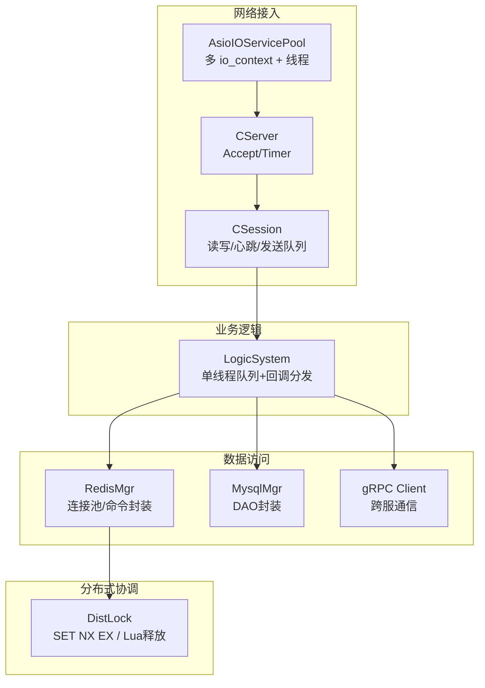
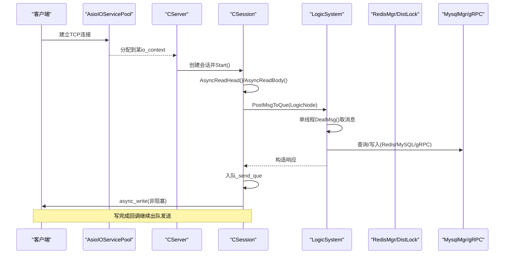
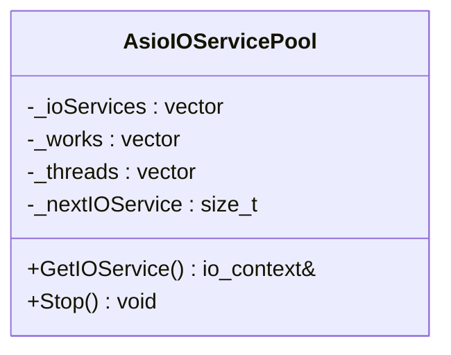
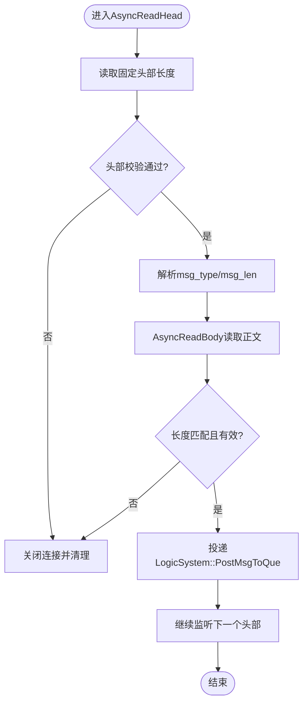
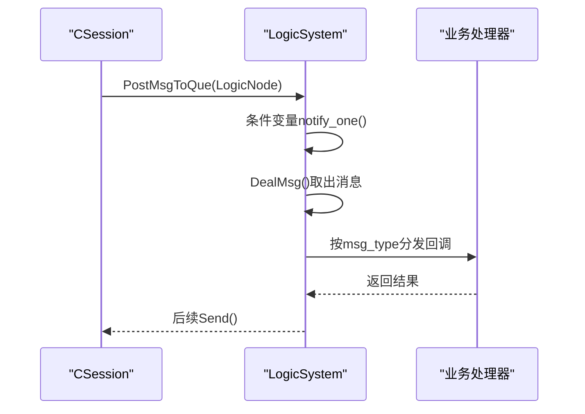
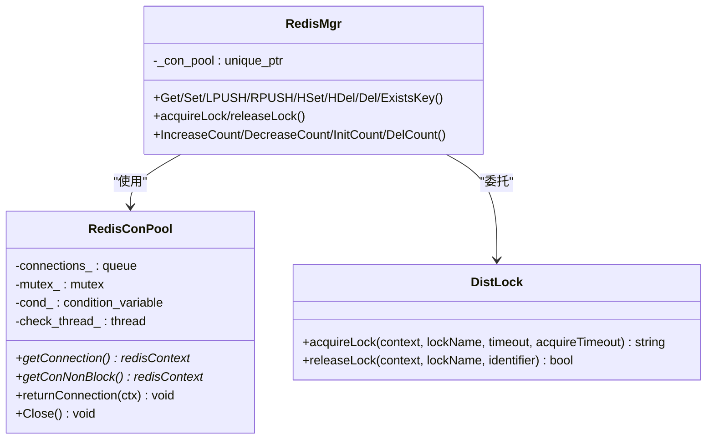
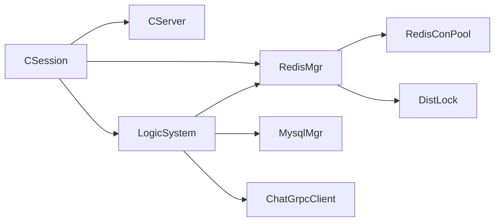

# 并发处理优化

<cite>
**本文引用的文件**   
- [AsioIOServicePool.h](file://server/ChatServer/include/AsioIOServicePool.h)
- [AsioIOServicePool.cpp](file://server/ChatServer/src/AsioIOServicePool.cpp)
- [CSession.h](file://server/ChatServer/include/CSession.h)
- [CSession.cpp](file://server/ChatServer/src/CSession.cpp)
- [LogicSystem.h](file://server/ChatServer/include/LogicSystem.h)
- [LogicSystem.cpp](file://server/ChatServer/src/LogicSystem.cpp)
- [DistLock.h](file://server/ChatServer/include/DistLock.h)
- [DistLock.cpp](file://server/ChatServer/src/DistLock.cpp)
- [RedisMgr.h](file://server/ChatServer/include/RedisMgr.h)
- [RedisMgr.cpp](file://server/ChatServer/src/RedisMgr.cpp)
- [UserMgr.h](file://server/ChatServer/include/UserMgr.h)
- [UserMgr.cpp](file://server/ChatServer/src/UserMgr.cpp)
- [MysqlMgr.h](file://server/ChatServer/include/MysqlMgr.h)
- [MysqlMgr.cpp](file://server/ChatServer/src/MysqlMgr.cpp)
- [CServer.h](file://server/ChatServer/include/CServer.h)
</cite>

## 目录
1. [引言](#引言)
2. [项目结构](#项目结构)
3. [核心组件](#核心组件)
4. [架构总览](#架构总览)
5. [详细组件分析](#详细组件分析)
6. [依赖关系分析](#依赖关系分析)
7. [性能考量](#性能考量)
8. [故障排查指南](#故障排查指南)
9. [结论](#结论)
10. [附录](#附录)

## 引言
本技术文档聚焦于 LLFCChat 服务器端在高并发场景下的并发处理优化，围绕多线程编程模型、线程池与任务调度、锁优化与无锁化思路、原子操作使用、异步 I/O 与回调优化、死锁预防、资源竞争解决以及上下文切换优化展开。通过对 Asio IO 服务池、会话层、逻辑处理队列、分布式锁与 Redis 连接池等关键模块的深度剖析，给出可落地的优化建议与最佳实践，帮助读者在复杂高并发环境下保障系统稳定性与 CPU 利用率。

## 项目结构
本项目采用分层与职责清晰的模块化设计：
- 网络接入层：基于 Boost.Asio 的 IO 事件循环与多进程/多线程 IO 服务池，负责 TCP 连接生命周期管理与非阻塞读写。
- 会话管理层：封装每个连接的协议解析、心跳维护、发送队列与异常处理。
- 业务逻辑层：单线程消息队列 + 条件变量驱动，解耦 IO 与耗时逻辑，避免阻塞 IO 线程。
- 数据访问层：Redis 连接池（含健康检查与自动重连）、MySQL 管理器、gRPC 客户端。
- 分布式协调：基于 Redis 的分布式锁实现，用于跨进程/跨实例的互斥控制。

**图示来源** 
- [AsioIOServicePool.h:1-28](file://server/ChatServer/include/AsioIOServicePool.h#L1-L28)
- [AsioIOServicePool.cpp:1-43](file://server/ChatServer/src/AsioIOServicePool.cpp#L1-L43)
- [CServer.h:1-33](file://server/ChatServer/include/CServer.h#L1-L33)
- [CSession.h:1-86](file://server/ChatServer/include/CSession.h#L1-L86)
- [LogicSystem.h:1-60](file://server/ChatServer/include/LogicSystem.h#L1-L60)
- [RedisMgr.h:1-305](file://server/ChatServer/include/RedisMgr.h#L1-L305)
- [DistLock.h:1-18](file://server/ChatServer/include/DistLock.h#L1-L18)

**章节来源**
- [AsioIOServicePool.h:1-28](file://server/ChatServer/include/AsioIOServicePool.h#L1-L28)
- [AsioIOServicePool.cpp:1-43](file://server/ChatServer/src/AsioIOServicePool.cpp#L1-L43)
- [CServer.h:1-33](file://server/ChatServer/include/CServer.h#L1-L33)
- [CSession.h:1-86](file://server/ChatServer/include/CSession.h#L1-L86)
- [LogicSystem.h:1-60](file://server/ChatServer/include/LogicSystem.h#L1-L60)
- [RedisMgr.h:1-305](file://server/ChatServer/include/RedisMgr.h#L1-L305)
- [DistLock.h:1-18](file://server/ChatServer/include/DistLock.h#L1-L18)

## 核心组件
- AsioIOServicePool：按硬件并发度创建多个 io_context，并启动对应线程轮询；通过轮询方式分配 io_context，降低热点竞争。
- CSession：封装单个 TCP 连接的读写状态机、粘包处理、发送队列与写回压测保护、心跳检测与异常清理。
- LogicSystem：单工作线程消费消息队列，按 msg_type 分派到具体处理器；使用条件变量减少忙等。
- RedisMgr：连接池管理、命令封装、健康检查与自动重连；提供分布式锁接口。
- DistLock：基于 Redis SET NX EX 获取锁，EVAL Lua 脚本原子释放锁，保证幂等与安全性。
- UserMgr：用户会话映射表，加锁保护 uid->session 的增删改查。
- MysqlMgr：数据库 DAO 封装，屏蔽底层 SQL 细节。

**章节来源**
- [AsioIOServicePool.cpp:1-43](file://server/ChatServer/src/AsioIOServicePool.cpp#L1-L43)
- [CSession.cpp:1-335](file://server/ChatServer/src/CSession.cpp#L1-L335)
- [LogicSystem.cpp:1-800](file://server/ChatServer/src/LogicSystem.cpp#L1-L800)
- [RedisMgr.cpp:1-462](file://server/ChatServer/src/RedisMgr.cpp#L1-L462)
- [DistLock.cpp:1-73](file://server/ChatServer/src/DistLock.cpp#L1-L73)
- [UserMgr.cpp:1-50](file://server/ChatServer/src/UserMgr.cpp#L1-L50)
- [MysqlMgr.cpp:1-95](file://server/ChatServer/src/MysqlMgr.cpp#L1-L95)

## 架构总览
下图展示从网络接收到业务处理的完整调用链，体现 IO 与逻辑分离、异步写队列、分布式锁与缓存/数据库访问路径。

**图示来源** 
- [AsioIOServicePool.cpp:1-43](file://server/ChatServer/src/AsioIOServicePool.cpp#L1-L43)
- [CSession.cpp:1-335](file://server/ChatServer/src/CSession.cpp#L1-L335)
- [LogicSystem.cpp:1-800](file://server/ChatServer/src/LogicSystem.cpp#L1-L800)
- [RedisMgr.cpp:1-462](file://server/ChatServer/src/RedisMgr.cpp#L1-L462)
- [DistLock.cpp:1-73](file://server/ChatServer/src/DistLock.cpp#L1-L73)

## 详细组件分析

### AsioIOServicePool：多线程 IO 服务池
- 设计要点
  - 初始化时按硬件并发度创建 N 个 io_context，并为每个 io_context 绑定 work_guard，确保 run() 不提前退出。
  - 每个 io_context 独立线程运行，GetIOService() 以简单自增轮询选择，避免集中热点。
  - Stop() 顺序停止所有 io_context 并释放 work_guard，再 join 线程，保证优雅退出。
- 并发特性
  - 无共享可变状态（除 _nextIOService），轮询索引为局部更新，避免锁竞争。
  - 线程与 io_context 一一对应，充分利用多核并行。
- 优化建议
  - 若存在特定热点 io_context，可引入加权轮询或一致性哈希，提升负载均衡性。
  - 监控各 io_context 的任务堆积情况，动态调整池大小。

**图示来源** 
- [AsioIOServicePool.h:1-28](file://server/ChatServer/include/AsioIOServicePool.h#L1-L28)
- [AsioIOServicePool.cpp:1-43](file://server/ChatServer/src/AsioIOServicePool.cpp#L1-L43)

**章节来源**
- [AsioIOServicePool.h:1-28](file://server/ChatServer/include/AsioIOServicePool.h#L1-L28)
- [AsioIOServicePool.cpp:1-43](file://server/ChatServer/src/AsioIOServicePool.cpp#L1-L43)

### CSession：会话层与异步 I/O
- 设计要点
  - 非阻塞读取：AsyncReadHead/AsyncReadBody 递归式补全长度，处理粘包与半包。
  - 发送队列：_send_que 配合 _send_lock 串行化写操作，防止并发写导致的数据错乱。
  - 心跳：原子时间戳记录最后心跳时间，定时判断过期。
  - 异常处理：统一 Close() 与 DealExceptionSession() 清理资源与分布式锁。
- 并发特性
  - 读路径由 Asio 回调驱动，写路径通过队列串行化，避免竞态。
  - 原子类型 atomic<time_t> 用于心跳时间，避免额外锁开销。
- 优化建议
  - 发送队列满策略可结合背压机制（如丢弃低优先级消息或通知上游限流）。
  - 考虑将大消息拆分为分段写，降低单次缓冲区压力。

**图示来源** 
- [CSession.cpp:1-335](file://server/ChatServer/src/CSession.cpp#L1-L335)

**章节来源**
- [CSession.h:1-86](file://server/ChatServer/include/CSession.h#L1-L86)
- [CSession.cpp:1-335](file://server/ChatServer/src/CSession.cpp#L1-L335)

### LogicSystem：单线程任务队列与回调分发
- 设计要点
  - 单工作线程 DealMsg() 通过条件变量等待队列非空，避免忙等。
  - RegisterCallBacks() 注册 msg_type 到处理函数的映射，便于扩展。
  - PostMsgToQue() 仅在队列由空变非空时唤醒消费者，减少不必要的通知。
- 并发特性
  - 单线程消费，天然避免内部竞态，简化同步复杂度。
  - 与 IO 线程解耦，避免 IO 线程被阻塞。
- 优化建议
  - 根据业务峰值评估是否需要多工作线程（需对共享状态加锁或无锁队列）。
  - 对耗时操作（如 gRPC 调用）进行超时与重试控制，避免队列积压。

**图示来源** 
- [LogicSystem.cpp:1-800](file://server/ChatServer/src/LogicSystem.cpp#L1-L800)

**章节来源**
- [LogicSystem.h:1-60](file://server/ChatServer/include/LogicSystem.h#L1-L60)
- [LogicSystem.cpp:1-800](file://server/ChatServer/src/LogicSystem.cpp#L1-L800)

### RedisMgr 与 DistLock：连接池与分布式锁
- Redis 连接池
  - 初始化固定数量连接，支持 PING 健康检查与失败重连。
  - getConnection()/returnConnection() 通过条件变量协调获取与归还。
  - 非阻塞 getConNonBlock() 用于周期性检查。
- 分布式锁
  - 获取：SET lockKey identifier NX EX lockTimeout 原子设置，带过期时间。
  - 释放：EVAL Lua 脚本比较 identifier 后删除，保证仅持有者释放。
  - 使用 Defer 模式确保连接与锁的正确释放。
- 并发特性
  - 连接池内部互斥保护，外部通过接口安全获取/归还。
  - 分布式锁跨进程/实例生效，避免重复登录、踢人冲突等。

**图示来源** 
- [RedisMgr.h:1-305](file://server/ChatServer/include/RedisMgr.h#L1-L305)
- [RedisMgr.cpp:1-462](file://server/ChatServer/src/RedisMgr.cpp#L1-L462)
- [DistLock.h:1-18](file://server/ChatServer/include/DistLock.h#L1-L18)
- [DistLock.cpp:1-73](file://server/ChatServer/src/DistLock.cpp#L1-L73)

**章节来源**
- [RedisMgr.h:1-305](file://server/ChatServer/include/RedisMgr.h#L1-L305)
- [RedisMgr.cpp:1-462](file://server/ChatServer/src/RedisMgr.cpp#L1-L462)
- [DistLock.h:1-18](file://server/ChatServer/include/DistLock.h#L1-L18)
- [DistLock.cpp:1-73](file://server/ChatServer/src/DistLock.cpp#L1-L73)

### UserMgr：用户会话映射
- 设计要点
  - 使用 unordered_map<int, shared_ptr<CSession>> 维护 uid->session。
  - 所有访问均通过互斥锁保护，保证并发安全。
- 并发特性
  - 短临界区，锁粒度合理，适合高频查找与少量修改。
- 优化建议
  - 若热点 uid 频繁访问，可考虑 per-shard 分片 map 降低锁竞争。

**章节来源**
- [UserMgr.h:1-22](file://server/ChatServer/include/UserMgr.h#L1-L22)
- [UserMgr.cpp:1-50](file://server/ChatServer/src/UserMgr.cpp#L1-L50)

### MysqlMgr：数据库访问封装
- 设计要点
  - 封装常用 CRUD 接口，屏蔽 DAO 细节。
  - 批量插入与分页查询接口支持聊天消息加载。
- 并发特性
  - 由上层 LogicSystem 单线程调用，避免并发事务问题。
- 优化建议
  - 对热点查询增加 Redis 缓存，降低数据库压力。

**章节来源**
- [MysqlMgr.h:1-41](file://server/ChatServer/include/MysqlMgr.h#L1-L41)
- [MysqlMgr.cpp:1-95](file://server/ChatServer/src/MysqlMgr.cpp#L1-L95)

## 依赖关系分析
- 组件耦合
  - CSession 依赖 CServer（会话清理）、LogicSystem（消息投递）、RedisMgr（分布式锁）。
  - LogicSystem 依赖 RedisMgr、MysqlMgr、gRPC Client 进行数据与跨服通信。
  - RedisMgr 依赖 RedisConPool 与 DistLock。
- 潜在循环依赖
  - 当前未见直接循环引用，但需注意头文件包含与 forward declaration 的使用。
- 外部依赖
  - Boost.Asio/Beast、hiredis、gRPC、nlohmann/json。

**图示来源** 
- [CSession.h:1-86](file://server/ChatServer/include/CSession.h#L1-L86)
- [LogicSystem.h:1-60](file://server/ChatServer/include/LogicSystem.h#L1-L60)
- [RedisMgr.h:1-305](file://server/ChatServer/include/RedisMgr.h#L1-L305)
- [DistLock.h:1-18](file://server/ChatServer/include/DistLock.h#L1-L18)

**章节来源**
- [CSession.h:1-86](file://server/ChatServer/include/CSession.h#L1-L86)
- [LogicSystem.h:1-60](file://server/ChatServer/include/LogicSystem.h#L1-L60)
- [RedisMgr.h:1-305](file://server/ChatServer/include/RedisMgr.h#L1-L305)
- [DistLock.h:1-18](file://server/ChatServer/include/DistLock.h#L1-L18)

## 性能考量
- 线程模型
  - IO 线程与逻辑线程分离，避免阻塞；单逻辑线程简化同步，降低上下文切换成本。
  - AsioIOServicePool 按 CPU 核数创建 io_context，最大化并行度。
- 锁与原子
  - 使用 std::atomic<time_t> 存储心跳时间，避免锁开销。
  - 发送队列使用互斥锁保护，临界区短小，减少争用。
- 异步与回调
  - 全部 I/O 为非阻塞异步，回调中避免长时间计算。
  - 写队列串行化，避免并发写导致的内存拷贝与锁竞争。
- 缓存与数据库
  - Redis 优先命中，减少 MySQL 压力；连接池健康检查与自动重连提高可用性。
- 上下文切换
  - 单逻辑线程减少线程间切换；条件变量替代忙等，降低 CPU 浪费。
- 可扩展性
  - 可按业务拆分逻辑线程池，或使用无锁队列（如 MPSC）进一步降低锁竞争。

[本节为通用指导，不直接分析具体文件]

## 故障排查指南
- 常见问题定位
  - 连接断开：检查 CSession::AsyncReadHead/AsyncReadBody 的错误码与 Close() 流程。
  - 消息丢失：确认 LogicSystem 队列是否积压，处理器是否抛出异常。
  - 分布式锁失效：核对 DistLock 的 identifier 与 Lua 释放逻辑，确保唯一性与过期时间。
  - Redis 连接耗尽：观察连接池健康检查日志，确认 PING 失败与重连行为。
- 调试建议
  - 打印关键路径日志（如 msg_type、uid、session_id、错误码）。
  - 监控队列长度、连接池大小、锁获取成功率。
  - 使用性能分析工具定位热点函数与锁竞争点。

**章节来源**
- [CSession.cpp:1-335](file://server/ChatServer/src/CSession.cpp#L1-L335)
- [LogicSystem.cpp:1-800](file://server/ChatServer/src/LogicSystem.cpp#L1-L800)
- [DistLock.cpp:1-73](file://server/ChatServer/src/DistLock.cpp#L1-L73)
- [RedisMgr.cpp:1-462](file://server/ChatServer/src/RedisMgr.cpp#L1-L462)

## 结论
LLFCChat 的并发处理通过 Asio 异步 I/O、单线程逻辑队列、Redis 连接池与分布式锁的组合，实现了高吞吐与低延迟的目标。进一步优化方向包括：更细粒度的负载均衡、无锁队列探索、背压与限流机制、监控与可观测性增强。遵循本文给出的设计与优化建议，可在高并发场景下稳定运行并高效利用 CPU 资源。

[本节为总结，不直接分析具体文件]

## 附录
- 术语说明
  - io_context：Boost.Asio 的事件循环对象，承载异步 I/O 任务。
  - work_guard：保持 io_context::run() 运行的守护对象。
  - 粘包/半包：TCP 流式传输中消息边界不清的问题，需在应用层解析。
  - 分布式锁：跨进程/实例的互斥机制，通常基于 Redis 或 ZooKeeper。
- 参考实现路径
  - AsioIOServicePool：[AsioIOServicePool.cpp:1-43](file://server/ChatServer/src/AsioIOServicePool.cpp#L1-L43)
  - CSession 读写流程：[CSession.cpp:1-335](file://server/ChatServer/src/CSession.cpp#L1-L335)
  - LogicSystem 队列与回调：[LogicSystem.cpp:1-800](file://server/ChatServer/src/LogicSystem.cpp#L1-L800)
  - Redis 连接池与锁：[RedisMgr.cpp:1-462](file://server/ChatServer/src/RedisMgr.cpp#L1-L462), [DistLock.cpp:1-73](file://server/ChatServer/src/DistLock.cpp#L1-L73)

[本节为补充信息，不直接分析具体文件]