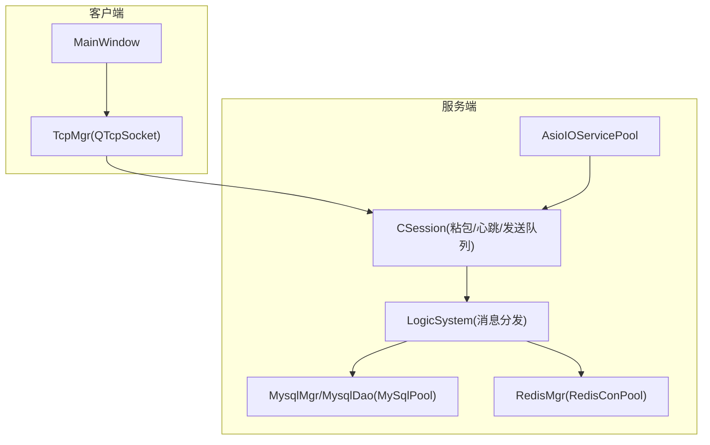
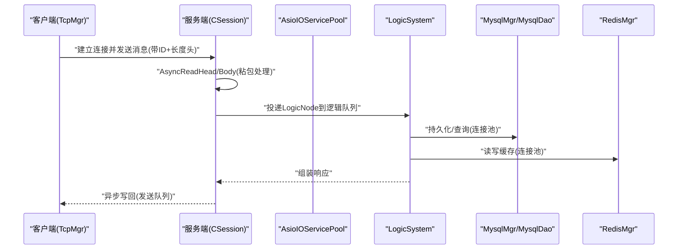
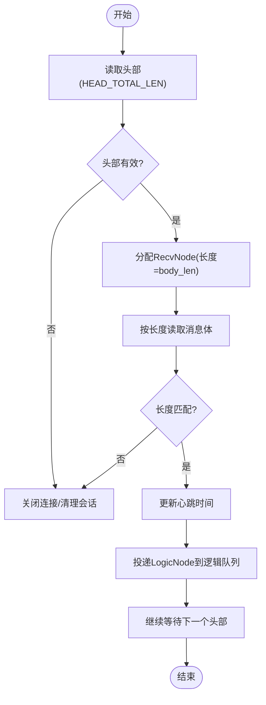
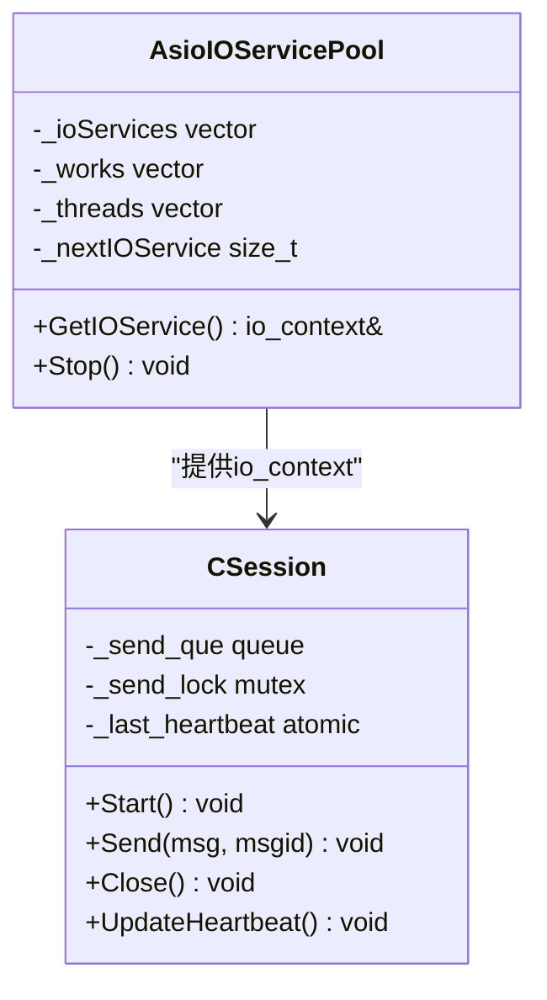
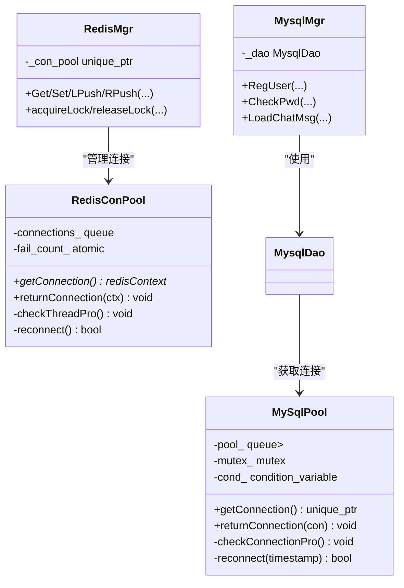
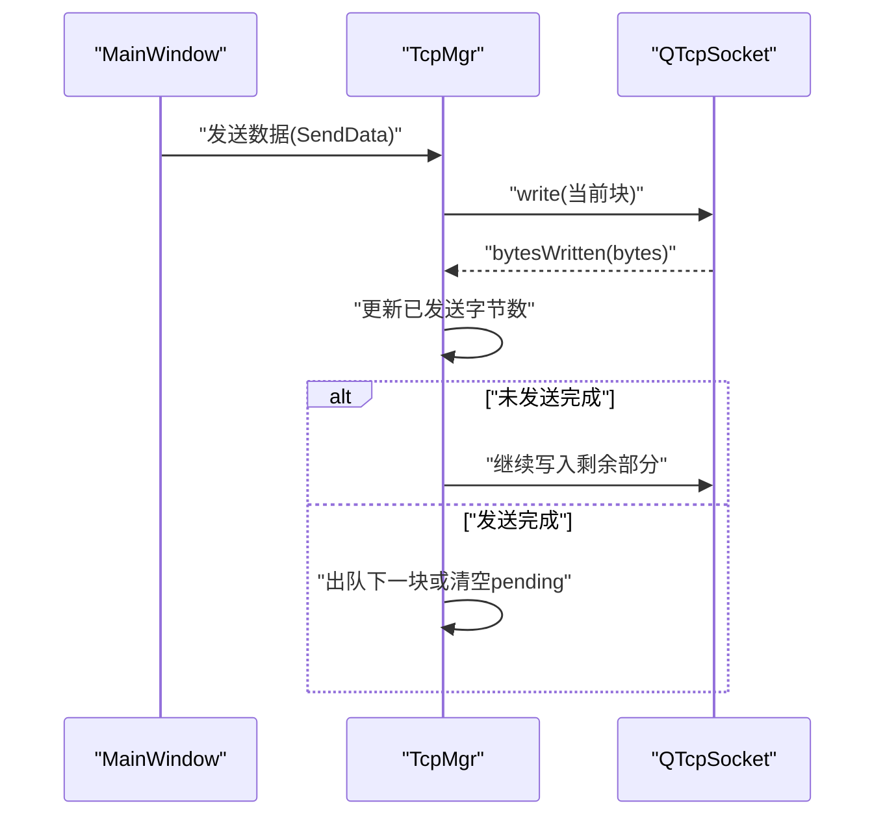
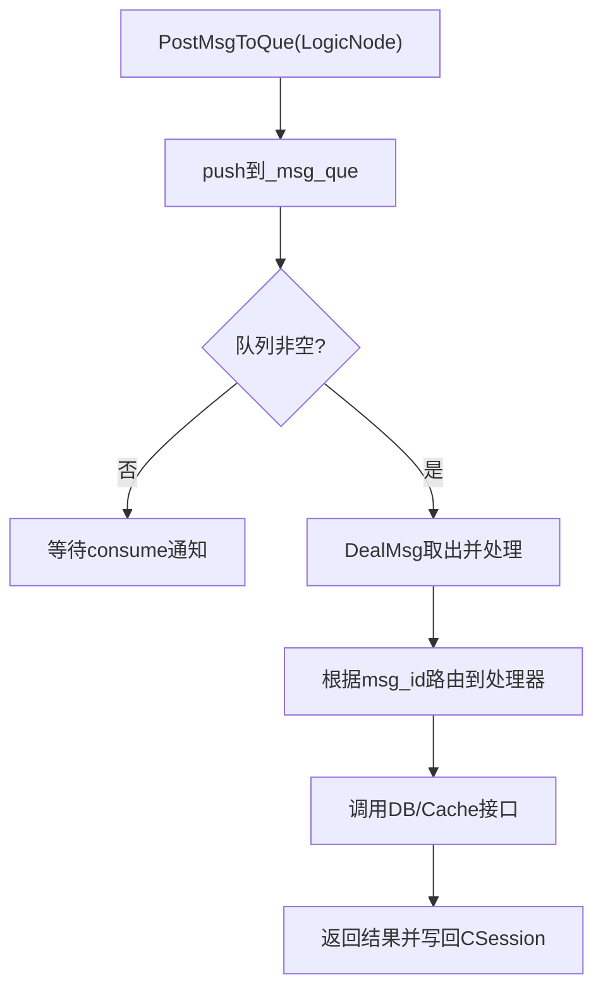
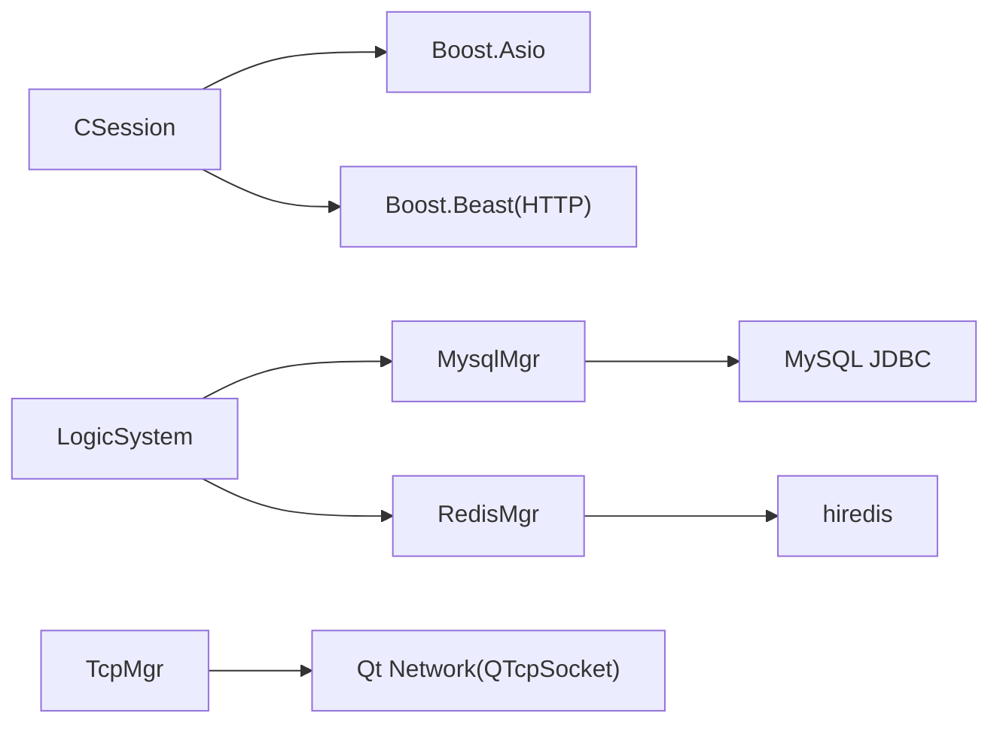

# 性能优化

<cite>
**本文引用的文件**   
- [CSession.h](file://server/ChatServer/include/CSession.h)
- [CSession.cpp](file://server/ChatServer/src/CSession.cpp)
- [AsioIOServicePool.h](file://server/ChatServer/include/AsioIOServicePool.h)
- [MsgNode.h](file://server/ChatServer/include/MsgNode.h)
- [MysqlMgr.h](file://server/ChatServer/include/MysqlMgr.h)
- [MysqlDao.h](file://server/ChatServer/include/MysqlDao.h)
- [RedisMgr.h](file://server/ChatServer/include/RedisMgr.h)
- [LogicSystem.h](file://server/ChatServer/include/LogicSystem.h)
- [tcpmgr.h](file://client/llfcchat/include/tcpmgr.h)
- [tcpmgr.cpp](file://client/llfcchat/src/tcpmgr.cpp)
- [global.h](file://client/llfcchat/include/global.h)
- [mainwindow.h](file://client/llfcchat/include/mainwindow.h)
</cite>

## 目录
1. [简介](#简介)
2. [项目结构](#项目结构)
3. [核心组件](#核心组件)
4. [架构总览](#架构总览)
5. [详细组件分析](#详细组件分析)
6. [依赖关系分析](#依赖关系分析)
7. [性能考量与优化策略](#性能考量与优化策略)
8. [故障排查指南](#故障排查指南)
9. [结论](#结论)
10. [附录](#附录)

## 简介
本文件面向LLFCChat项目的性能优化，覆盖网络层、数据库层、前端UI与多线程并发四大维度。重点包括：
- 网络层：粘包处理、连接池管理、内存复用、零拷贝技巧、异步I/O与心跳保活
- 数据库层：查询优化、索引设计、缓存策略、连接池配置、慢查询分析
- 前端UI：Qt界面响应性、资源加载、内存管理与渲染性能提升
- 并发优化：线程池设计、任务调度、锁优化、无锁数据结构
- 监控与测试：CPU/内存/网络诊断、压力与基准测试、容量规划

## 项目结构
本项目采用多服务架构（ChatServer、GateServer、ResourceServer、StatusServer、VarifyServer），客户端基于Qt实现。关键性能相关模块分布如下：
- 服务端网络与会话：CSession、AsioIOServicePool、LogicSystem
- 数据访问：MysqlMgr、MysqlDao（含MySqlPool）、RedisMgr（含RedisConPool）
- 客户端网络：TcpMgr（QTcpSocket封装）
- UI主入口：MainWindow

图表来源
- [AsioIOServicePool.h:1-28](file://server/ChatServer/include/AsioIOServicePool.h#L1-L28)
- [CSession.h:1-86](file://server/ChatServer/include/CSession.h#L1-L86)
- [MysqlMgr.h:1-41](file://server/ChatServer/include/MysqlMgr.h#L1-L41)
- [RedisMgr.h:1-305](file://server/ChatServer/include/RedisMgr.h#L1-L305)
- [tcpmgr.h:1-90](file://client/llfcchat/include/tcpmgr.h#L1-L90)
- [mainwindow.h:1-57](file://client/llfcchat/include/mainwindow.h#L1-L57)

章节来源
- [AsioIOServicePool.h:1-28](file://server/ChatServer/include/AsioIOServicePool.h#L1-L28)
- [CSession.h:1-86](file://server/ChatServer/include/CSession.h#L1-L86)
- [MysqlMgr.h:1-41](file://server/ChatServer/include/MysqlMgr.h#L1-L41)
- [RedisMgr.h:1-305](file://server/ChatServer/include/RedisMgr.h#L1-L305)
- [tcpmgr.h:1-90](file://client/llfcchat/include/tcpmgr.h#L1-L90)
- [mainwindow.h:1-57](file://client/llfcchat/include/mainwindow.h#L1-L57)

## 核心组件
- CSession：封装Boost.Asio的TCP会话，实现头部/体部异步读取、发送队列、心跳更新与异常处理
- AsioIOServicePool：基于硬件并发度的io_context池，轮询分配，避免单点阻塞
- MsgNode/SendNode/RecvNode：消息节点与缓冲区复用，减少频繁分配
- MysqlMgr/MysqlDao：MySQL访问抽象与连接池（健康检查、自动重连）
- RedisMgr/RedisConPool：Redis连接池（PING保活、失败计数与重建）
- TcpMgr：客户端TCP管理器，粘包解析、发送队列与信号回调
- LogicSystem：逻辑层消息队列与处理器注册，解耦网络与业务

章节来源
- [CSession.h:1-86](file://server/ChatServer/include/CSession.h#L1-L86)
- [CSession.cpp:1-200](file://server/ChatServer/src/CSession.cpp#L1-L200)
- [AsioIOServicePool.h:1-28](file://server/ChatServer/include/AsioIOServicePool.h#L1-L28)
- [MsgNode.h:1-48](file://server/ChatServer/include/MsgNode.h#L1-L48)
- [MysqlMgr.h:1-41](file://server/ChatServer/include/MysqlMgr.h#L1-L41)
- [MysqlDao.h:1-270](file://server/ChatServer/include/MysqlDao.h#L1-L270)
- [RedisMgr.h:1-305](file://server/ChatServer/include/RedisMgr.h#L1-L305)
- [tcpmgr.h:1-90](file://client/llfcchat/include/tcpmgr.h#L1-L90)
- [tcpmgr.cpp:1-200](file://client/llfcchat/src/tcpmgr.cpp#L1-L200)
- [LogicSystem.h:1-61](file://server/ChatServer/include/LogicSystem.h#L1-L61)

## 架构总览
下图展示从客户端到服务端的请求路径，以及数据库与缓存的交互。

图表来源
- [CSession.cpp:1-200](file://server/ChatServer/src/CSession.cpp#L1-L200)
- [LogicSystem.h:1-61](file://server/ChatServer/include/LogicSystem.h#L1-L61)
- [MysqlMgr.h:1-41](file://server/ChatServer/include/MysqlMgr.h#L1-L41)
- [RedisMgr.h:1-305](file://server/ChatServer/include/RedisMgr.h#L1-L305)
- [tcpmgr.cpp:1-200](file://client/llfcchat/src/tcpmgr.cpp#L1-L200)

## 详细组件分析

### 网络层：粘包处理与异步I/O
- 协议格式：固定长度的头部包含消息ID与消息长度，随后为变长消息体
- 接收流程：先读HEAD_TOTAL_LEN，校验ID与长度后动态分配RecvNode，再按长度读取完整体
- 发送流程：通过SendNode入队，使用async_write串行化输出，避免竞态
- 心跳机制：记录_last_heartbeat，支持过期判断与清理异常会话

图表来源
- [CSession.cpp:132-194](file://server/ChatServer/src/CSession.cpp#L132-L194)
- [CSession.cpp:89-131](file://server/ChatServer/src/CSession.cpp#L89-L131)
- [CSession.h:42-51](file://server/ChatServer/include/CSession.h#L42-L51)

章节来源
- [CSession.h:1-86](file://server/ChatServer/include/CSession.h#L1-L86)
- [CSession.cpp:1-200](file://server/ChatServer/src/CSession.cpp#L1-L200)
- [MsgNode.h:1-48](file://server/ChatServer/include/MsgNode.h#L1-L48)

### 网络层：连接池与线程模型
- AsioIOServicePool：根据硬件并发度创建多个io_context，轮询获取，降低锁竞争
- CSession：每个会话绑定一个io_context，保证同一连接上的异步操作顺序性
- 发送队列：每个会话维护_send_que与_send_lock，限制队列长度防止内存暴涨

图表来源
- [AsioIOServicePool.h:1-28](file://server/ChatServer/include/AsioIOServicePool.h#L1-L28)
- [CSession.h:28-76](file://server/ChatServer/include/CSession.h#L28-L76)

章节来源
- [AsioIOServicePool.h:1-28](file://server/ChatServer/include/AsioIOServicePool.h#L1-L28)
- [CSession.h:28-76](file://server/ChatServer/include/CSession.h#L28-L76)

### 数据库层：连接池与缓存
- MySqlPool：预创建连接，后台线程定期PING检测健康，失败计数驱动重连
- RedisConPool：初始化时AUTH认证，周期性PING保活，条件变量协调取用与归还
- MysqlMgr/RedisMgr：对外暴露统一接口，屏蔽连接池细节

图表来源
- [MysqlDao.h:25-232](file://server/ChatServer/include/MysqlDao.h#L25-L232)
- [RedisMgr.h:9-265](file://server/ChatServer/include/RedisMgr.h#L9-L265)
- [MysqlMgr.h:8-39](file://server/ChatServer/include/MysqlMgr.h#L8-L39)
- [RedisMgr.h:267-305](file://server/ChatServer/include/RedisMgr.h#L267-L305)

章节来源
- [MysqlDao.h:1-270](file://server/ChatServer/include/MysqlDao.h#L1-L270)
- [RedisMgr.h:1-305](file://server/ChatServer/include/RedisMgr.h#L1-L305)
- [MysqlMgr.h:1-41](file://server/ChatServer/include/MysqlMgr.h#L1-L41)

### 前端UI：网络与界面响应性
- TcpMgr：基于QTcpSocket的粘包解析，readyRead中循环解析头部与体部；bytesWritten回调驱动发送队列
- 全局常量：定义ReqId、传输状态、分页大小等，影响UI刷新频率与内存占用
- MainWindow：窗口切换与离线事件处理，需避免阻塞主线程

图表来源
- [tcpmgr.cpp:103-129](file://client/llfcchat/src/tcpmgr.cpp#L103-L129)
- [tcpmgr.h:22-87](file://client/llfcchat/include/tcpmgr.h#L22-L87)
- [global.h:43-88](file://client/llfcchat/include/global.h#L43-L88)

章节来源
- [tcpmgr.cpp:1-200](file://client/llfcchat/src/tcpmgr.cpp#L1-200)
- [tcpmgr.h:1-90](file://client/llfcchat/include/tcpmgr.h#L1-L90)
- [global.h:1-296](file://client/llfcchat/include/global.h#L1-L296)
- [mainwindow.h:1-57](file://client/llfcchat/include/mainwindow.h#L1-L57)

### 并发与任务调度
- LogicSystem：单例维护消息队列与工作线程，PostMsgToQue投递LogicNode，DealMsg消费并路由至具体处理器
- 锁粒度：CSession内发送队列加锁，Redis/Mysql连接池使用互斥量保护共享队列
- 无锁元素：原子心跳时间、原子停止标志，减少锁竞争

图表来源
- [LogicSystem.h:18-59](file://server/ChatServer/include/LogicSystem.h#L18-L59)
- [CSession.cpp:46-78](file://server/ChatServer/src/CSession.cpp#L46-L78)

章节来源
- [LogicSystem.h:1-61](file://server/ChatServer/include/LogicSystem.h#L1-L61)
- [CSession.cpp:46-78](file://server/ChatServer/src/CSession.cpp#L46-L78)

## 依赖关系分析
- 网络层依赖Boost.Asio与Beast（HTTP），会话与IO服务解耦
- 数据层依赖MySQL JDBC与hiredis，连接池独立于业务逻辑
- 客户端依赖Qt网络与JSON库，消息类型通过Q_DECLARE_METATYPE注册

图表来源
- [CSession.h:1-15](file://server/ChatServer/include/CSession.h#L1-L15)
- [MysqlDao.h:1-15](file://server/ChatServer/include/MysqlDao.h#L1-L15)
- [RedisMgr.h:1-8](file://server/ChatServer/include/RedisMgr.h#L1-L8)
- [tcpmgr.h:1-12](file://client/llfcchat/include/tcpmgr.h#L1-L12)

章节来源
- [CSession.h:1-15](file://server/ChatServer/include/CSession.h#L1-L15)
- [MysqlDao.h:1-15](file://server/ChatServer/include/MysqlDao.h#L1-L15)
- [RedisMgr.h:1-8](file://server/ChatServer/include/RedisMgr.h#L1-L8)
- [tcpmgr.h:1-12](file://client/llfcchat/include/tcpmgr.h#L1-L12)

## 性能考量与优化策略

### 网络层优化
- 粘包处理：固定头部+变长体，避免多次小包合并；在客户端使用QDataStream流解析，减少临时对象
- 连接池管理：AsioIOServicePool按CPU核数分配io_context，降低上下文切换；CSession发送队列限流防抖
- 内存复用：MsgNode/SendNode/RecvNode复用缓冲区，减少new/delete开销
- 零拷贝技巧：尽量使用buffer直接指向底层数组，避免额外拷贝；发送时使用const char*重载减少构造
- 心跳与超时：原子_last_heartbeat配合定时检查，及时释放异常会话

章节来源
- [CSession.cpp:89-131](file://server/ChatServer/src/CSession.cpp#L89-L131)
- [CSession.cpp:132-194](file://server/ChatServer/src/CSession.cpp#L132-L194)
- [MsgNode.h:1-48](file://server/ChatServer/include/MsgNode.h#L1-L48)
- [AsioIOServicePool.h:1-28](file://server/ChatServer/include/AsioIOServicePool.h#L1-L28)

### 数据库层优化
- 查询优化：分页查询使用lastId+pageSize，避免深翻页；批量插入合并AddChatMsg(vector)
- 索引设计：用户表(name,email)、聊天表(threadId,messageId)建议建立复合索引
- 缓存策略：热点用户信息、好友列表放入Redis；登录态与验证码使用Redis短TTL
- 连接池配置：MySqlPool初始池大小与最大空闲连接按负载调优；RedisConPool根据并发调整
- 慢查询分析：开启MySQL慢查询日志，结合EXPLAIN分析执行计划

章节来源
- [MysqlMgr.h:24-35](file://server/ChatServer/include/MysqlMgr.h#L24-L35)
- [MysqlDao.h:25-232](file://server/ChatServer/include/MysqlDao.h#L25-L232)
- [RedisMgr.h:267-305](file://server/ChatServer/include/RedisMgr.h#L267-L305)

### 前端UI优化
- 响应性：网络I/O与UI分离，TcpMgr通过信号槽异步更新；避免在主线程进行耗时操作
- 资源加载：图片缩略图延迟加载，大文件分片下载；使用CreateLoadingPlaceholder占位
- 内存管理：QByteArray缓冲及时clear；消息列表按需加载，避免一次性加载全部历史
- 渲染性能：减少样式重绘，批量更新列表项；使用QSS最小化复杂选择器

章节来源
- [tcpmgr.cpp:18-55](file://client/llfcchat/src/tcpmgr.cpp#L18-L55)
- [global.h:280-296](file://client/llfcchat/include/global.h#L280-L296)
- [mainwindow.h:29-54](file://client/llfcchat/include/mainwindow.h#L29-L54)

### 多线程并发优化
- 线程池：AsioIOServicePool与LogicSystem工作线程解耦网络与逻辑
- 任务调度：消息队列+条件变量，避免忙等；处理器注册机制提高扩展性
- 锁优化：细粒度锁（发送队列、连接池），原子变量用于简单状态
- 无锁数据结构：atomic<time_t>心跳、atomic<bool>停止标志

章节来源
- [AsioIOServicePool.h:1-28](file://server/ChatServer/include/AsioIOServicePool.h#L1-L28)
- [LogicSystem.h:18-59](file://server/ChatServer/include/LogicSystem.h#L18-L59)
- [CSession.h:73-75](file://server/ChatServer/include/CSession.h#L73-L75)

### 性能监控与分析工具
- CPU分析：perf/VTune定位热点函数（如async_read/write回调）
- 内存泄漏检测：Valgrind/Visual Studio诊断工具检查MsgNode/RecvNode生命周期
- 网络性能监控：Wireshark抓包验证粘包处理；qDebug输出统计发送队列长度
- 数据库监控：MySQL慢查询日志、Redis INFO命令观察命中率

[本节为通用指导，不直接分析具体文件]

### 压力测试与容量规划
- 基准测试：ab/wrk对HTTP接口压测；自定义脚本模拟聊天消息吞吐
- 容量规划：根据CPU核数设定AsioIOServicePool大小；连接池大小=并发数×平均RTT/超时
- 弹性扩容：水平扩展ChatServer实例，GateServer做负载均衡

[本节为通用指导，不直接分析具体文件]

## 故障排查指南
- 粘包问题：检查头部长度字段是否按网络字节序转换；确认客户端移除已解析字节
- 连接池耗尽：监控MySqlPool/RedisConPool队列长度；增加池大小或优化慢查询
- 内存泄漏：追踪MsgNode析构日志；确保所有路径都释放recv/send缓冲区
- 心跳超时：检查_last_heartbeat更新时机；确认网络丢包与防火墙策略

章节来源
- [CSession.cpp:132-194](file://server/ChatServer/src/CSession.cpp#L132-L194)
- [MysqlDao.h:62-123](file://server/ChatServer/include/MysqlDao.h#L62-L123)
- [RedisMgr.h:137-206](file://server/ChatServer/include/RedisMgr.h#L137-L206)
- [tcpmgr.cpp:18-55](file://client/llfcchat/src/tcpmgr.cpp#L18-L55)

## 结论
LLFCChat在网络层、数据库层、前端UI与并发方面已具备良好基础。通过进一步优化粘包处理、连接池配置、内存复用与UI响应性，可显著提升系统吞吐量与用户体验。建议结合监控与压测持续迭代，确保在高并发场景下的稳定性与性能。

[本节为总结，不直接分析具体文件]

## 附录
- 关键常量：MAX_LENGTH、HEAD_TOTAL_LEN、FILE_UPLOAD_HEAD_LEN等
- 消息类型：ReqId枚举涵盖登录、聊天、文件传输等
- 传输状态：TransferState与MsgInfo结构体支持断点续传与进度显示

章节来源
- [global.h:15-25](file://client/llfcchat/include/global.h#L15-L25)
- [global.h:43-88](file://client/llfcchat/include/global.h#L43-L88)
- [global.h:167-200](file://client/llfcchat/include/global.h#L167-L200)