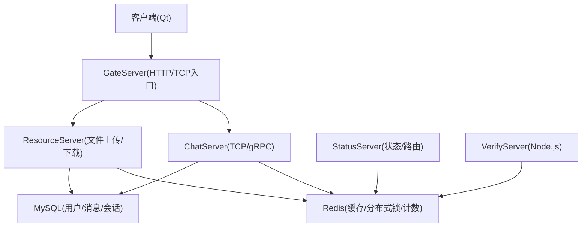
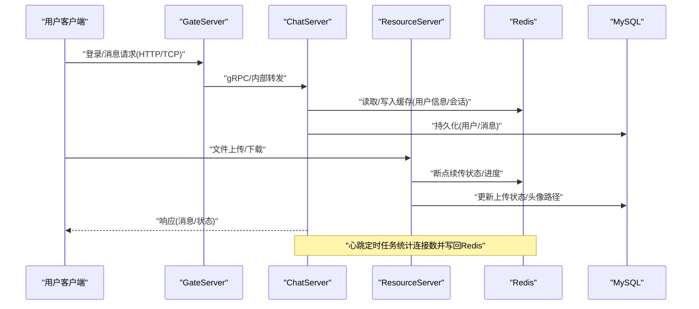
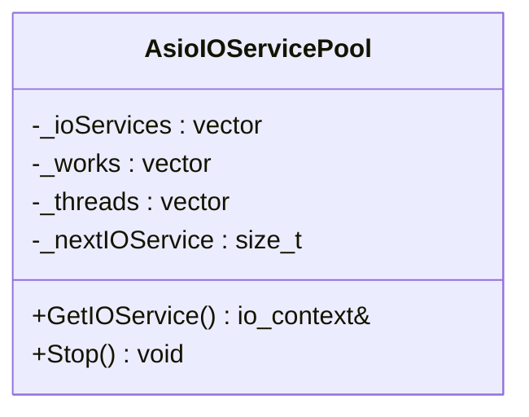
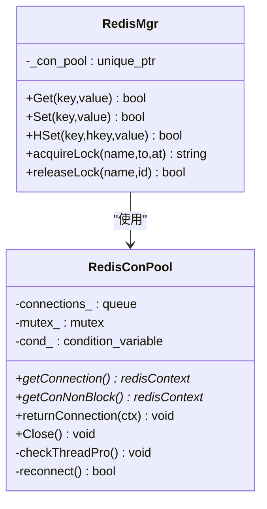
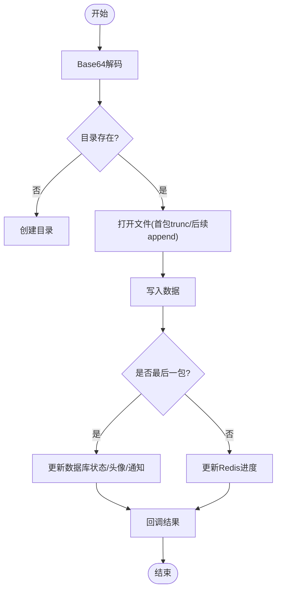
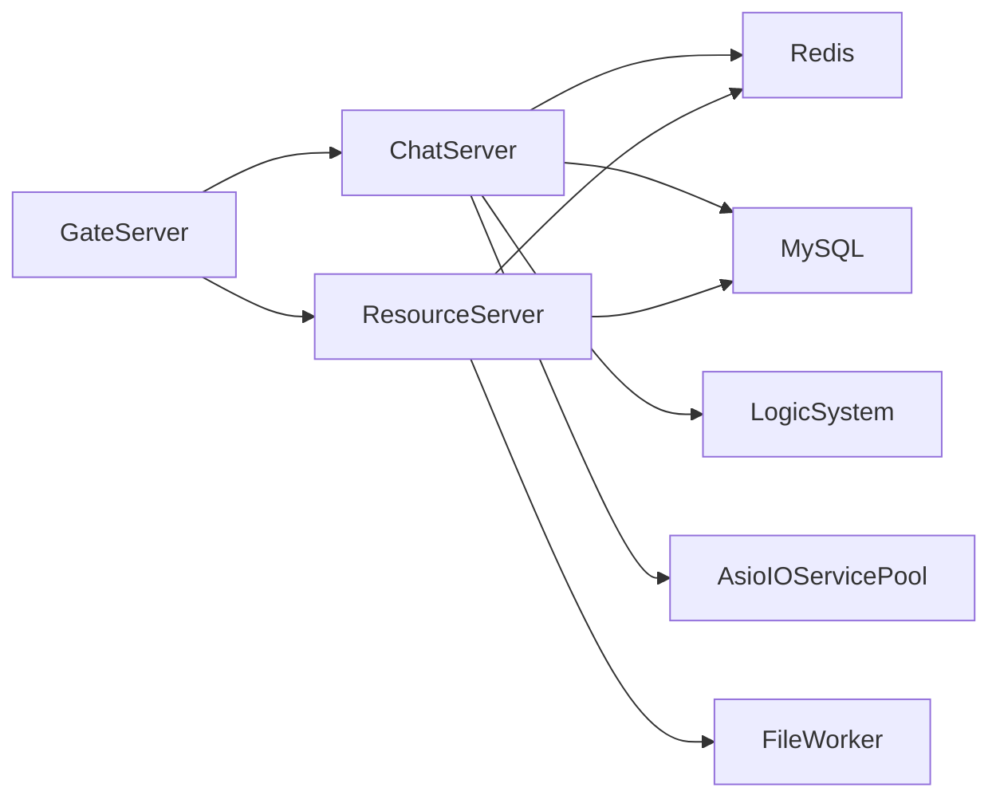

# 性能优化

<cite>
**本文引用的文件**   
- [README.md](file://README.md)
- [AsioIOServicePool.h（GateServer）](file://server/GateServer/include/AsioIOServicePool.h)
- [AsioIOServicePool.cpp（GateServer）](file://server/GateServer/src/AsioIOServicePool.cpp)
- [AsioIOServicePool.h（ChatServer）](file://server/ChatServer/include/AsioIOServicePool.h)
- [AsioIOServicePool.cpp（ChatServer）](file://server/ChatServer/src/AsioIOServicePool.cpp)
- [AsioIOServicePool.h（ResourceServer）](file://server/ResourceServer/include/AsioIOServicePool.h)
- [AsioIOServicePool.cpp（ResourceServer）](file://server/ResourceServer/src/AsioIOServicePool.cpp)
- [AsioIOServicePool.h（StatusServer）](file://server/StatusServer/include/AsioIOServicePool.h)
- [AsioIOServicePool.cpp（StatusServer）](file://server/StatusServer/src/AsioIOServicePool.cpp)
- [RedisMgr.h（ChatServer）](file://server/ChatServer/include/RedisMgr.h)
- [RedisMgr.h（GateServer）](file://server/GateServer/include/RedisMgr.h)
- [MysqlMgr.h（ChatServer）](file://server/ChatServer/include/MysqlMgr.h)
- [LogicSystem.h（ChatServer）](file://server/ChatServer/include/LogicSystem.h)
- [LogicSystem.cpp（ChatServer）](file://server/ChatServer/src/LogicSystem.cpp)
- [CServer.cpp（ChatServer）](file://server/ChatServer/src/CServer.cpp)
- [FileWorker.h（ResourceServer）](file://server/ResourceServer/include/FileWorker.h)
- [FileWorker.cpp（ResourceServer）](file://server/ResourceServer/src/FileWorker.cpp)
- [day08-邮箱认证服务.md](file://开发文档/day08-邮箱认证服务.md)
- [day16-asio实现tcp服务器.md](file://开发文档/day16-asio实现tcp服务器.md)
- [day27-分布式服务设计.md](file://开发文档/day27-分布式服务设计.md)
- [day35心跳逻辑.md](file://开发文档/day35心跳逻辑.md)
- [day33单服程踢人逻辑.md](file://开发文档/day33单服程踢人逻辑.md)
- [day42-Qt粘包引发的血案.md](file://开发文档/day42-Qt粘包引发的血案.md)
</cite>

## 目录
1. [引言](#引言)
2. [项目结构](#项目结构)
3. [核心组件](#核心组件)
4. [架构总览](#架构总览)
5. [详细组件分析](#详细组件分析)
6. [依赖关系分析](#依赖关系分析)
7. [性能考量与调优](#性能考量与调优)
8. [故障排查指南](#故障排查指南)
9. [结论](#结论)
10. [附录：基准与负载测试方法](#附录：基准与负载测试方法)

## 引言
本技术文档围绕 LLFCChat 的性能优化展开，聚焦内存管理、网络 I/O 优化、数据库与缓存优化、异步模型、连接池与缓存策略、并发处理、I/O 操作优化、资源调度、监控与瓶颈定位、GC 与 CPU 使用率优化，以及高并发场景下的性能保障。文档以代码级为依据，结合项目中的 Asio IO 多路复用、Redis 连接池、MySQL 访问封装、逻辑队列与文件传输工作线程等关键实现，给出可操作的优化建议与验证方法。

## 项目结构
LLFCChat 采用多服务架构：客户端（Qt）、网关服务（GateServer）、聊天服务（ChatServer）、资源服务（ResourceServer）、状态服务（StatusServer），以及一个基于 Node.js 的验证码服务。各服务端均基于 Boost.Asio 构建高性能异步 I/O 模型，并通过 Redis 做缓存与分布式锁，通过 MySQL 做持久化存储。

**图表来源** 
- [README.md:1-112](file://README.md#L1-L112)
- [day27-分布式服务设计.md:221-276](file://开发文档/day27-分布式服务设计.md#L221-L276)

**章节来源**
- [README.md:1-112](file://README.md#L1-L112)

## 核心组件
- AsioIOServicePool：每个服务内维护多个 io_context，按轮询分配，提升并发处理能力。
- RedisMgr + RedisConPool：连接池、健康检查、自动重连、分布式锁、计数器。
- MysqlMgr：对 MySQL 的封装，提供用户、好友申请、聊天消息等数据访问。
- LogicSystem：消息分发与业务回调注册，解耦网络层与业务逻辑。
- FileWorker/DownloadWorker：文件上传/下载的异步工作线程，支持断点续传与进度上报。
- CServer/CSession：TCP 连接生命周期管理、心跳检测、异常清理与统计。

**章节来源**
- [AsioIOServicePool.h（GateServer）:1-27](file://server/GateServer/include/AsioIOServicePool.h#L1-L27)
- [AsioIOServicePool.cpp（GateServer）:1-43](file://server/GateServer/src/AsioIOServicePool.cpp#L1-L43)
- [RedisMgr.h（ChatServer）:1-305](file://server/ChatServer/include/RedisMgr.h#L1-L305)
- [MysqlMgr.h（ChatServer）:1-41](file://server/ChatServer/include/MysqlMgr.h#L1-L41)
- [LogicSystem.h（ChatServer）:1-60](file://server/ChatServer/include/LogicSystem.h#L1-L60)
- [FileWorker.h（ResourceServer）:1-91](file://server/ResourceServer/include/FileWorker.h#L1-L91)
- [CServer.cpp（ChatServer）:47-100](file://server/ChatServer/src/CServer.cpp#L47-L100)

## 架构总览
下图展示请求从客户端进入 GateServer，再转发到 ChatServer/ResourceServer，最终落库或走缓存的完整链路；同时体现心跳与分布式锁在连接管理与跨服踢人中的作用。

**图表来源** 
- [day27-分布式服务设计.md:221-276](file://开发文档/day27-分布式服务设计.md#L221-L276)
- [day35心跳逻辑.md:644-688](file://开发文档/day35心跳逻辑.md#L644-L688)
- [FileWorker.cpp（ResourceServer）:480-660](file://server/ResourceServer/src/FileWorker.cpp#L480-L660)

## 详细组件分析

### AsioIOServicePool（异步 I/O 与并发）
- 设计要点
  - 每个服务实例持有多个 io_context，按轮询分配，避免单核热点。
  - 使用 work_guard 保证 run() 不会提前退出，Stop() 时先 stop 再释放 work，确保优雅关闭。
- 性能影响
  - 将网络 I/O 事件分散到多核线程，显著降低上下文切换与锁竞争。
  - 合理设置 pool size（默认硬件并发度或固定值）可平衡吞吐与内存占用。
- 调优建议
  - 根据 CPU 核数与 I/O 密集程度调整大小；CPU 密集任务建议不超过核数。
  - 监控各 io_context 的任务堆积情况，必要时动态扩容。

**图表来源** 
- [AsioIOServicePool.h（ChatServer）:1-27](file://server/ChatServer/include/AsioIOServicePool.h#L1-L27)
- [AsioIOServicePool.cpp（ChatServer）:1-42](file://server/ChatServer/src/AsioIOServicePool.cpp#L1-L42)

**章节来源**
- [AsioIOServicePool.h（GateServer）:1-27](file://server/GateServer/include/AsioIOServicePool.h#L1-L27)
- [AsioIOServicePool.cpp（GateServer）:1-43](file://server/GateServer/src/AsioIOServicePool.cpp#L1-L43)
- [AsioIOServicePool.h（ResourceServer）:1-27](file://server/ResourceServer/include/AsioIOServicePool.h#L1-L27)
- [AsioIOServicePool.cpp（ResourceServer）:1-43](file://server/ResourceServer/src/AsioIOServicePool.cpp#L1-L43)
- [AsioIOServicePool.h（StatusServer）:1-27](file://server/StatusServer/include/AsioIOServicePool.h#L1-L27)
- [AsioIOServicePool.cpp（StatusServer）:1-43](file://server/StatusServer/src/AsioIOServicePool.cpp#L1-L43)
- [day08-邮箱认证服务.md:227-299](file://开发文档/day08-邮箱认证服务.md#L227-L299)
- [day16-asio实现tcp服务器.md:108-167](file://开发文档/day16-asio实现tcp服务器.md#L108-L167)

### Redis 连接池与分布式锁（缓存与一致性）
- 设计要点
  - RedisConPool：初始化连接池、PING 保活、失败计数与自动重连、条件变量等待可用连接。
  - RedisMgr：统一 Get/Set/HSet/LPush/RPop/Del/ExistsKey 等操作，以及 acquireLock/releaseLock 分布式锁接口。
- 性能影响
  - 连接复用减少握手开销；PING 保活降低死连接概率；批量/原子操作减少 RTT。
  - 分布式锁用于跨服踢人与会话清理，需控制锁粒度与超时，避免热点键阻塞。
- 调优建议
  - 合理设置池大小与超时；对热点 key 分片或加前缀隔离。
  - 使用 Lua 脚本保证加解锁原子性，避免竞态。

**图表来源** 
- [RedisMgr.h（ChatServer）:1-305](file://server/ChatServer/include/RedisMgr.h#L1-L305)
- [RedisMgr.h（GateServer）:1-305](file://server/GateServer/include/RedisMgr.h#L1-L305)

**章节来源**
- [RedisMgr.h（ChatServer）:1-305](file://server/ChatServer/include/RedisMgr.h#L1-L305)
- [RedisMgr.h（GateServer）:1-305](file://server/GateServer/include/RedisMgr.h#L1-L305)
- [day35心跳逻辑.md:318-367](file://开发文档/day35心跳逻辑.md#L318-L367)

### MySQL 访问封装（持久化）
- 设计要点
  - MysqlMgr 封装用户注册、密码校验、好友申请、聊天消息增删改查等。
  - 与 Redis 配合：热数据读多写少场景优先走缓存，写后同步或异步刷新缓存。
- 性能影响
  - 连接池与批处理可降低延迟；分页查询与索引优化提升吞吐。
- 调优建议
  - 热点查询加缓存；大对象（如图片路径）尽量存 Redis/对象存储，不在 DB 中存大字段。
  - 使用事务与预编译语句，减少 SQL 注入与解析开销。

**章节来源**
- [MysqlMgr.h（ChatServer）:1-41](file://server/ChatServer/include/MysqlMgr.h#L1-L41)
- [LogicSystem.cpp（ChatServer）:294-344](file://server/ChatServer/src/LogicSystem.cpp#L294-L344)
- [LogicSystem.cpp（ChatServer）:696-718](file://server/ChatServer/src/LogicSystem.cpp#L696-L718)

### 逻辑系统（消息分发与回调）
- 设计要点
  - LogicSystem 维护消息队列与工作线程，注册不同 msg_id 的处理回调，解耦网络与业务。
- 性能影响
  - 队列缓冲削峰填谷；单消费者避免复杂同步；回调函数应轻量且快速返回。
- 调优建议
  - 根据 CPU 与 I/O 比例调整消费者数量；对耗时操作异步化（如文件落盘）。

**章节来源**
- [LogicSystem.h（ChatServer）:1-60](file://server/ChatServer/include/LogicSystem.h#L1-L60)

### 文件传输与断点续传（I/O 优化）
- 设计要点
  - FileWorker/DownloadWorker 使用独立工作线程处理上传/下载，支持分块、Base64 编解码、目录创建、权限检查。
  - 断点续传：Redis 保存文件信息与进度，服务端按 seq 偏移读取/写入。
- 性能影响
  - 分离 I/O 与网络线程，避免阻塞；顺序写与增量更新降低磁盘压力。
- 调优建议
  - 增大缓冲区、合并小写；对热点文件预热；限制并发下载数。

**图表来源** 
- [FileWorker.cpp（ResourceServer）:48-109](file://server/ResourceServer/src/FileWorker.cpp#L48-L109)
- [FileWorker.cpp（ResourceServer）:112-193](file://server/ResourceServer/src/FileWorker.cpp#L112-L193)
- [FileWorker.cpp（ResourceServer）:480-660](file://server/ResourceServer/src/FileWorker.cpp#L480-L660)

**章节来源**
- [FileWorker.h（ResourceServer）:1-91](file://server/ResourceServer/include/FileWorker.h#L1-L91)
- [FileWorker.cpp（ResourceServer）:1-660](file://server/ResourceServer/src/FileWorker.cpp#L1-L660)

### 心跳与连接管理（稳定性与统计）
- 设计要点
  - CServer 定时器周期扫描会话，判断心跳过期，收集待清理 session 并异步处理，避免长时间持锁。
  - 心跳结束后统计有效连接数写回 Redis，作为负载均衡依据。
- 性能影响
  - 批量统计与延迟清理降低锁竞争；及时回收僵尸连接释放资源。
- 调优建议
  - 心跳间隔与超时阈值按网络环境调优；清理逻辑去重与幂等。

**章节来源**
- [CServer.cpp（ChatServer）:47-100](file://server/ChatServer/src/CServer.cpp#L47-L100)
- [day35心跳逻辑.md:644-688](file://开发文档/day35心跳逻辑.md#L644-L688)
- [day33单服程踢人逻辑.md:397-460](file://开发文档/day33单服程踢人逻辑.md#L397-L460)

## 依赖关系分析
- 服务间依赖
  - GateServer 负责 HTTP/TCP 接入，转发至 ChatServer/ResourceServer。
  - ChatServer/ResourceServer 依赖 Redis 与 MySQL，ChatServer 还通过 gRPC 与 ResourceServer 通信。
- 模块内依赖
  - AsioIOServicePool 被各服务启动阶段使用；RedisMgr 贯穿登录、会话、文件传输等流程；LogicSystem 解耦网络与业务。

**图表来源** 
- [day27-分布式服务设计.md:221-276](file://开发文档/day27-分布式服务设计.md#L221-L276)
- [LogicSystem.h（ChatServer）:1-60](file://server/ChatServer/include/LogicSystem.h#L1-L60)
- [FileWorker.h（ResourceServer）:1-91](file://server/ResourceServer/include/FileWorker.h#L1-L91)

**章节来源**
- [day27-分布式服务设计.md:221-276](file://开发文档/day27-分布式服务设计.md#L221-L276)

## 性能考量与调优

### 内存管理
- 策略
  - 使用智能指针与 RAII 管理资源，避免手动 new/delete。
  - 文件读写使用流式 I/O，避免一次性加载大文件到内存。
  - Qt 端解析 QDataStream/QByteArray 时避免频繁 mid() 拷贝，改用 remove() 与零拷贝。
- 调优
  - 预分配 buffer 容量，减少 realloc 次数。
  - 大数据传递使用 const 引用，避免隐式拷贝。
  - 定期释放临时对象，避免长生命周期容器膨胀。

**章节来源**
- [day42-Qt粘包引发的血案.md:468-514](file://开发文档/day42-Qt粘包引发的血案.md#L468-L514)

### 网络优化
- 策略
  - Asio 多 io_context 并行处理；非阻塞 I/O 与回调驱动。
  - 心跳机制检测僵尸连接，及时释放资源。
  - 粘包/半包处理：循环读取、长度校验、边界处理。
- 调优
  - 合理设置 TCP 参数（如 Nagle、接收窗口）。
  - 控制并发连接数与队列长度，防止 OOM。

**章节来源**
- [AsioIOServicePool.cpp（ChatServer）:1-42](file://server/ChatServer/src/AsioIOServicePool.cpp#L1-L42)
- [day35心跳逻辑.md:644-688](file://开发文档/day35心跳逻辑.md#L644-L688)
- [day42-Qt粘包引发的血案.md:468-514](file://开发文档/day42-Qt粘包引发的血案.md#L468-L514)

### 数据库与缓存优化
- 策略
  - 读多写少走 Redis，写后异步刷新缓存；热点 key 分片。
  - MySQL 分页查询、索引优化、批处理插入。
- 调优
  - 连接池大小与超时匹配负载；慢查询日志分析与执行计划优化。
  - 分布式锁 Lua 脚本原子化，避免额外往返。

**章节来源**
- [RedisMgr.h（ChatServer）:1-305](file://server/ChatServer/include/RedisMgr.h#L1-L305)
- [MysqlMgr.h（ChatServer）:1-41](file://server/ChatServer/include/MysqlMgr.h#L1-L41)
- [LogicSystem.cpp（ChatServer）:696-718](file://server/ChatServer/src/LogicSystem.cpp#L696-L718)

### 并发处理与 I/O 优化
- 策略
  - LogicSystem 队列削峰；FileWorker/DownloadWorker 独立线程处理 I/O。
  - 定时器批量统计与清理，避免频繁加锁。
- 调优
  - 根据 CPU/IO 比例调整线程数；热点路径无锁化或细粒度锁。

**章节来源**
- [LogicSystem.h（ChatServer）:1-60](file://server/ChatServer/include/LogicSystem.h#L1-L60)
- [FileWorker.cpp（ResourceServer）:480-660](file://server/ResourceServer/src/FileWorker.cpp#L480-L660)
- [CServer.cpp（ChatServer）:47-100](file://server/ChatServer/src/CServer.cpp#L47-L100)

### 资源利用率优化与资源调度
- 策略
  - AsioIOServicePool 按核数分配；Redis 连接池与 MySQL 连接池按需扩容。
  - 定时器任务错峰执行，避免集中抖动。
- 调优
  - 监控 CPU/内存/IO 指标，动态调整池大小与线程数。

**章节来源**
- [AsioIOServicePool.h（GateServer）:1-27](file://server/GateServer/include/AsioIOServicePool.h#L1-L27)
- [RedisMgr.h（ChatServer）:1-305](file://server/ChatServer/include/RedisMgr.h#L1-L305)

### 内存泄漏检测与垃圾回收优化
- 策略
  - 使用 Valgrind/AddressSanitizer 检测泄漏；RAII 与智能指针管理生命周期。
  - 避免全局大对象常驻；及时释放临时 buffer。
- 调优
  - 针对 Qt 应用，注意信号槽与事件循环导致的引用保留。

[本节为通用指导，不直接分析具体文件]

### CPU 使用率优化
- 策略
  - 热点路径避免阻塞调用；计算密集型任务下沉到专用线程。
  - 减少序列化/反序列化开销，使用高效格式（如 Protobuf/FlatBuffers）。
- 调优
  - 使用 perf/VTune 定位热点函数；减少分支预测失败与缓存未命中。

[本节为通用指导，不直接分析具体文件]

### 高并发场景下的性能保证与资源调度
- 策略
  - 多 io_context 并行；队列限流与背压；连接池上限保护。
  - 心跳与定时任务批量处理，避免锁竞争。
- 调优
  - 压测发现瓶颈后，针对性扩容或优化算法；灰度发布验证效果。

**章节来源**
- [AsioIOServicePool.cpp（ChatServer）:1-42](file://server/ChatServer/src/AsioIOServicePool.cpp#L1-L42)
- [day35心跳逻辑.md:644-688](file://开发文档/day35心跳逻辑.md#L644-L688)

## 故障排查指南
- 常见问题
  - 连接池耗尽：检查 PING 保活与重连逻辑，确认归还连接路径。
  - 分布式锁死锁：确保加锁顺序一致（分布式锁→本地锁），超时与释放正确。
  - 粘包/半包：循环读取、长度校验、边界处理。
- 工具与方法
  - 日志埋点：关键路径打印错误码与耗时。
  - 性能剖析：perf/VTune/Valgrind；Redis/MySQL 慢查询日志。

**章节来源**
- [RedisMgr.h（ChatServer）:1-305](file://server/ChatServer/include/RedisMgr.h#L1-L305)
- [day35心跳逻辑.md:318-367](file://开发文档/day35心跳逻辑.md#L318-L367)
- [day42-Qt粘包引发的血案.md:468-514](file://开发文档/day42-Qt粘包引发的血案.md#L468-L514)

## 结论
LLFCChat 通过 Asio 多路复用、Redis 连接池与分布式锁、MySQL 封装、逻辑队列与文件工作线程，构建了高并发、可扩展的聊天系统。性能优化的关键在于：合理的 I/O 并发模型、稳定的连接与缓存管理、高效的 I/O 与内存使用、严格的锁与超时控制，以及完善的监控与压测体系。持续迭代与数据驱动的调优将进一步提升系统在高并发场景下的稳定性与吞吐。

## 附录：基准与负载测试方法
- 目标
  - 评估登录、消息收发、文件上传/下载在不同并发下的延迟与吞吐。
- 工具
  - 网络层：wrk/JMeter 模拟 HTTP/TCP 请求；自定义 gRPC 压测客户端。
  - 系统层：perf/VTune 采集 CPU/内存/IO；Valgrind 检测内存问题。
  - 中间件：Redis/MySQL 监控（慢查询、命中率、连接数）。
- 步骤
  - 基线测试：单机低并发，记录延迟分布与资源使用。
  - 压力测试：逐步增加并发，观察拐点与瓶颈。
  - 回归测试：优化后复测，对比指标变化。
- 指标
  - 吞吐（QPS/TPS）、P95/P99 延迟、错误率、CPU/内存/IO 使用率、连接池命中率。

[本节为通用指导，不直接分析具体文件]