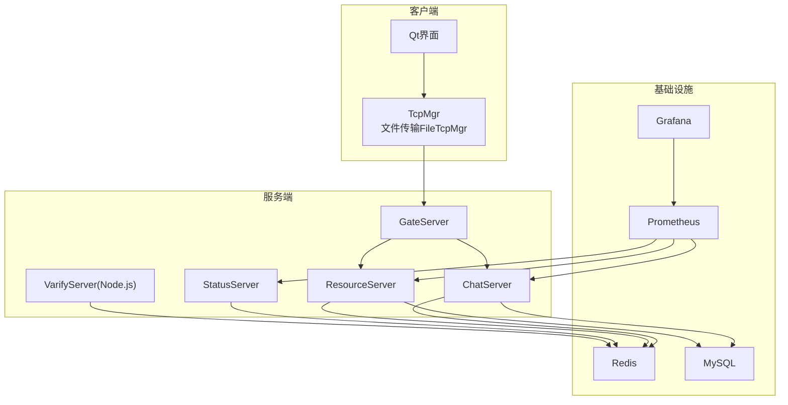
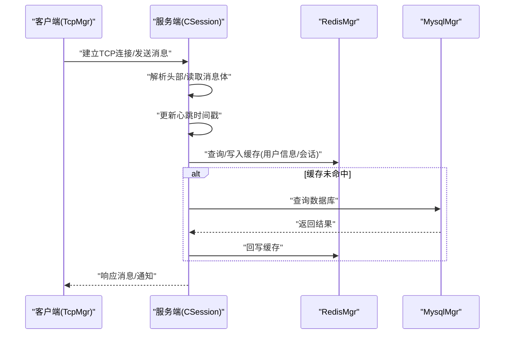
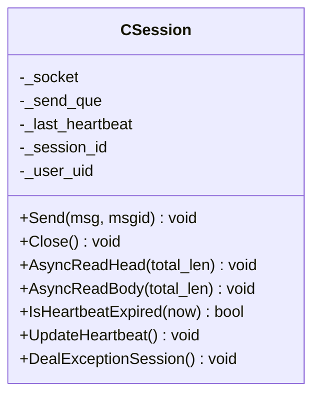
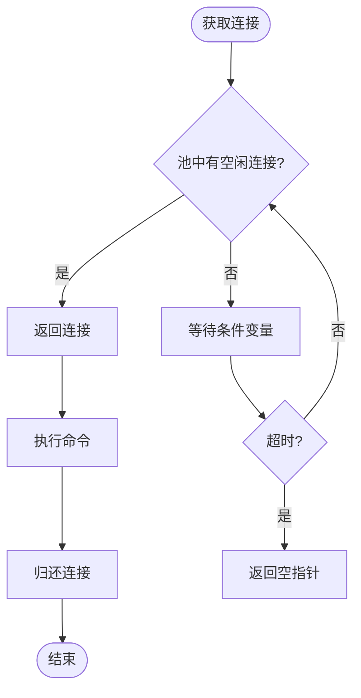
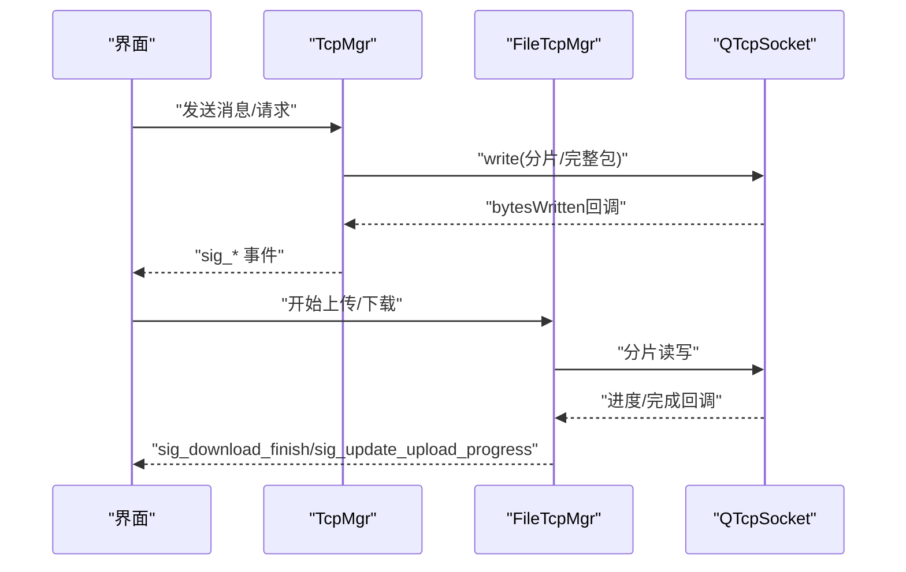
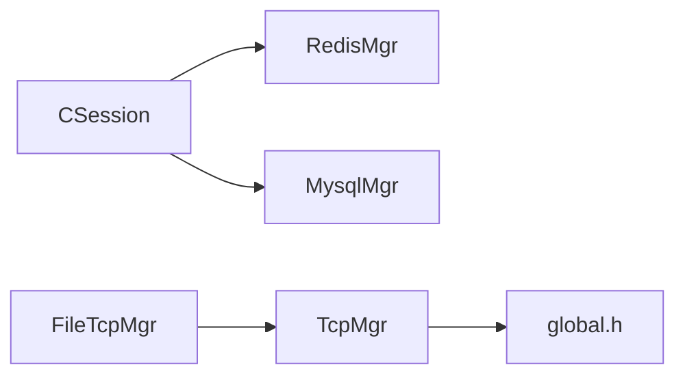

# 性能监控

<cite>
**本文引用的文件**   
- [CSession.cpp](file://server/ChatServer/src/CSession.cpp)
- [RedisMgr.h](file://server/ChatServer/include/RedisMgr.h)
- [MysqlMgr.h](file://server/ChatServer/include/MysqlMgr.h)
- [tcpmgr.h](file://client/llfcchat/include/tcpmgr.h)
- [tcpmgr.cpp](file://client/llfcchat/src/tcpmgr.cpp)
- [filetcpmgr.cpp](file://client/llfcchat/src/filetcpmgr.cpp)
- [global.h](file://client/llfcchat/include/global.h)
- [day35心跳逻辑.md](file://开发文档/day35心跳逻辑.md)
</cite>

## 目录
1. [简介](#简介)
2. [项目结构](#项目结构)
3. [核心组件](#核心组件)
4. [架构总览](#架构总览)
5. [详细组件分析](#详细组件分析)
6. [依赖关系分析](#依赖关系分析)
7. [性能指标与采集方案](#性能指标与采集方案)
8. [性能分析工具集成与使用](#性能分析工具集成与使用)
9. [日志系统设计最佳实践](#日志系统设计最佳实践)
10. [监控系统搭建（Prometheus+Grafana）](#监控系统搭建prometheusgrafana)
11. [基准测试与容量规划方法论](#基准测试与容量规划方法论)
12. [故障排查指南](#故障排查指南)
13. [结论](#结论)

## 简介
本文件面向LLFCChat项目的性能监控与可观测性建设，覆盖服务端与客户端的关键性能指标采集、分析工具集成、日志体系设计、监控平台搭建以及基准测试与容量规划方法。内容基于仓库中现有的网络会话、心跳机制、连接池、数据库访问等实现进行系统化梳理，并给出可扩展的落地建议。

## 项目结构
- 客户端（Qt/C++）：负责TCP长连接、消息编解码、文件传输、UI交互与事件分发。
- 服务端（C++/gRPC/HTTP）：包含聊天服务、网关、资源服务、状态服务等；使用Boost.Asio处理高并发I/O，通过Redis缓存与分布式锁，MySQL持久化。
- 验证服务（Node.js）：提供验证码、邮箱等服务能力。
- WebRTC演示：信令服务器与前端示例。

**图表来源** 
- [CSession.cpp:1-338](file://server/ChatServer/src/CSession.cpp#L1-L338)
- [RedisMgr.h:1-305](file://server/ChatServer/include/RedisMgr.h#L1-L305)
- [MysqlMgr.h:1-41](file://server/ChatServer/include/MysqlMgr.h#L1-L41)
- [tcpmgr.h:1-90](file://client/llfcchat/include/tcpmgr.h#L1-L90)
- [tcpmgr.cpp:556-673](file://client/llfcchat/src/tcpmgr.cpp#L556-L673)
- [filetcpmgr.cpp:74-805](file://client/llfcchat/src/filetcpmgr.cpp#L74-L805)

**章节来源**
- [CSession.cpp:1-338](file://server/ChatServer/src/CSession.cpp#L1-L338)
- [RedisMgr.h:1-305](file://server/ChatServer/include/RedisMgr.h#L1-L305)
- [MysqlMgr.h:1-41](file://server/ChatServer/include/MysqlMgr.h#L1-L41)
- [tcpmgr.h:1-90](file://client/llfcchat/include/tcpmgr.h#L1-L90)
- [tcpmgr.cpp:556-673](file://client/llfcchat/src/tcpmgr.cpp#L556-L673)
- [filetcpmgr.cpp:74-805](file://client/llfcchat/src/filetcpmgr.cpp#L74-L805)

## 核心组件
- CSession：封装单条TCP会话的异步读写、心跳更新、异常清理与发送队列管理，是服务端性能与稳定性的关键节点。
- RedisMgr：封装Redis连接池、健康检查、分布式锁与计数统计，支撑高并发下的缓存与协调。
- MysqlMgr：封装MySQL DAO接口，提供用户、好友、聊天消息等数据访问。
- TcpMgr/FileTcpMgr：客户端网络层，负责消息收发、粘包处理、断线重连与文件分片传输。

**章节来源**
- [CSession.cpp:1-338](file://server/ChatServer/src/CSession.cpp#L1-L338)
- [RedisMgr.h:1-305](file://server/ChatServer/include/RedisMgr.h#L1-L305)
- [MysqlMgr.h:1-41](file://server/ChatServer/include/MysqlMgr.h#L1-L41)
- [tcpmgr.h:1-90](file://client/llfcchat/include/tcpmgr.h#L1-L90)
- [filetcpmgr.cpp:74-805](file://client/llfcchat/src/filetcpmgr.cpp#L74-L805)

## 架构总览
下图展示从客户端到服务端的核心调用链与关键性能点（网络I/O、心跳、缓存、数据库）。

**图表来源** 
- [CSession.cpp:90-131](file://server/ChatServer/src/CSession.cpp#L90-L131)
- [RedisMgr.h:267-305](file://server/ChatServer/include/RedisMgr.h#L267-L305)
- [MysqlMgr.h:1-41](file://server/ChatServer/include/MysqlMgr.h#L1-L41)

## 详细组件分析

### CSession：会话与心跳
- 异步读写：采用非阻塞IO，避免阻塞线程；发送队列限流，防止拥塞。
- 心跳机制：每次收到消息更新_last_heartbeat；定时任务检测过期，关闭僵尸连接并清理Redis中的会话信息。
- 异常处理：读/写错误统一进入DealExceptionSession，结合分布式锁保证跨服踢人一致性。

**图表来源** 
- [CSession.cpp:1-338](file://server/ChatServer/src/CSession.cpp#L1-L338)

**章节来源**
- [CSession.cpp:90-131](file://server/ChatServer/src/CSession.cpp#L90-L131)
- [CSession.cpp:288-302](file://server/ChatServer/src/CSession.cpp#L288-L302)
- [CSession.cpp:304-336](file://server/ChatServer/src/CSession.cpp#L304-L336)

### RedisMgr：连接池与健康检查
- 连接池：初始化时创建固定数量连接，支持获取/归还；后台线程周期性PING保活，失败自动重建。
- 分布式锁：acquireLock/releaseLock用于跨进程原子操作（如登录计数、踢人清理）。
- 计数统计：HSet/HGet维护各服务器在线连接数，配合心跳周期批量更新，降低锁竞争。

**图表来源** 
- [RedisMgr.h:63-102](file://server/ChatServer/include/RedisMgr.h#L63-L102)
- [RedisMgr.h:137-206](file://server/ChatServer/include/RedisMgr.h#L137-L206)

**章节来源**
- [RedisMgr.h:1-305](file://server/ChatServer/include/RedisMgr.h#L1-L305)

### 客户端网络层：TcpMgr与文件传输
- 粘包处理：按头长度校验与循环读取，避免半包/粘包问题。
- 信号驱动：通过Qt信号槽将网络事件映射到UI与业务逻辑。
- 文件分片：按固定块大小分片上传/下载，支持暂停、续传与进度上报。

**图表来源** 
- [tcpmgr.cpp:556-673](file://client/llfcchat/src/tcpmgr.cpp#L556-L673)
- [filetcpmgr.cpp:74-805](file://client/llfcchat/src/filetcpmgr.cpp#L74-L805)
- [global.h:43-88](file://client/llfcchat/include/global.h#L43-L88)

**章节来源**
- [tcpmgr.h:1-90](file://client/llfcchat/include/tcpmgr.h#L1-L90)
- [tcpmgr.cpp:556-673](file://client/llfcchat/src/tcpmgr.cpp#L556-L673)
- [filetcpmgr.cpp:74-805](file://client/llfcchat/src/filetcpmgr.cpp#L74-L805)
- [global.h:43-88](file://client/llfcchat/include/global.h#L43-L88)

## 依赖关系分析
- 服务端：CSession依赖RedisMgr（缓存/锁）、MysqlMgr（持久化），并通过Asio事件循环驱动。
- 客户端：TcpMgr/FileTcpMgr依赖Qt网络模块与全局常量定义（ReqId、ErrorCodes等）。
- 外部依赖：Redis、MySQL、gRPC/HTTP（其他服务间通信）。

**图表来源** 
- [CSession.cpp:1-338](file://server/ChatServer/src/CSession.cpp#L1-L338)
- [RedisMgr.h:1-305](file://server/ChatServer/include/RedisMgr.h#L1-L305)
- [MysqlMgr.h:1-41](file://server/ChatServer/include/MysqlMgr.h#L1-L41)
- [tcpmgr.h:1-90](file://client/llfcchat/include/tcpmgr.h#L1-L90)
- [global.h:1-296](file://client/llfcchat/include/global.h#L1-L296)

**章节来源**
- [CSession.cpp:1-338](file://server/ChatServer/src/CSession.cpp#L1-L338)
- [RedisMgr.h:1-305](file://server/ChatServer/include/RedisMgr.h#L1-L305)
- [MysqlMgr.h:1-41](file://server/ChatServer/include/MysqlMgr.h#L1-L41)
- [tcpmgr.h:1-90](file://client/llfcchat/include/tcpmgr.h#L1-L90)
- [global.h:1-296](file://client/llfcchat/include/global.h#L1-L296)

## 性能指标与采集方案
- CPU使用率
  - 服务端：在CSession的异步读写回调、Redis连接池健康检查线程、心跳定时器处埋点，统计函数耗时与线程利用率。
  - 客户端：在TcpMgr的readyRead与bytesWritten回调中记录CPU忙闲比例。
- 内存占用
  - 服务端：跟踪CSession的_send_que长度、MsgNode分配与释放；Redis连接池上下文对象生命周期。
  - 客户端：监控QByteArray缓冲增长、文件分片缓冲区峰值。
- 网络延迟
  - 客户端：记录请求发出与响应到达的时间差（按ReqId维度聚合）。
  - 服务端：CSession接收与发送路径的端到端时延，区分文本/图片/文件类型。
- 数据库查询时间
  - MysqlMgr每个DAO方法入口/出口打点，统计慢查询与命中率。
- 连接与吞吐
  - 服务端：CSession活跃连接数、发送队列长度、心跳过期率；Redis连接池大小与失败次数。
  - 客户端：重连次数、粘包处理耗时、文件传输成功率与平均速率。

采集建议
- 在服务端关键路径插入轻量级计时器（高精度时钟），以直方图形式暴露指标。
- 客户端通过Qt定时器或QElapsedTimer收集关键事件时间戳，汇总后上报。
- 所有指标需附带标签（服务名、实例ID、ReqId、消息类型、错误码等）以便多维分析。

**章节来源**
- [CSession.cpp:90-131](file://server/ChatServer/src/CSession.cpp#L90-L131)
- [RedisMgr.h:137-206](file://server/ChatServer/include/RedisMgr.h#L137-L206)
- [MysqlMgr.h:1-41](file://server/ChatServer/include/MysqlMgr.h#L1-L41)
- [tcpmgr.cpp:556-673](file://client/llfcchat/src/tcpmgr.cpp#L556-L673)
- [filetcpmgr.cpp:74-805](file://client/llfcchat/src/filetcpmgr.cpp#L74-L805)

## 性能分析工具集成与使用
- gprof
  - 编译开启-profiling选项，运行生成gmon.out，使用gprof分析热点函数。适用于服务端CSession与Redis连接池热路径定位。
- Valgrind
  - 使用memcheck检测内存泄漏与越界；使用callgrind生成调用树与火焰图，定位CSession发送队列与消息解析瓶颈。
- Intel VTune
  - 对服务端进程进行热点分析与GPU/CPU协同分析，关注异步回调与线程调度开销。
- Qt Creator性能分析器
  - 客户端启用Performance Profiler，捕获TcpMgr与FileTcpMgr的事件循环、UI渲染与网络I/O热点。

使用技巧
- 生产环境采样：仅在压测或灰度环境开启重型分析工具，避免影响线上性能。
- 分层分析：先宏观（系统级CPU/内存/IO），再微观（函数级调用栈）。
- 基线对比：不同版本构建产物对比热点变化，评估优化效果。

[本节为通用指导，不直接分析具体文件]

## 日志系统设计最佳实践
- 分级日志
  - DEBUG/INFO/WARN/ERROR/FATAL，按模块与组件划分输出通道。
- 结构化日志
  - JSON格式，包含trace_id、span_id、service、instance、req_id、msg_type、error_code等字段，便于检索与关联。
- 性能日志
  - 关键路径耗时（网络I/O、缓存命中、SQL执行）、队列长度、连接池状态、心跳过期率。
- 错误追踪
  - 统一错误码（参考global.h中的ErrorCodes），堆栈信息、上下文快照（用户ID、会话ID、请求参数摘要）。
- 输出策略
  - 服务端：异步落盘，按大小/时间轮转；客户端：本地日志文件+可选远程上报。
  - 敏感信息脱敏（密码、Token、手机号等）。

**章节来源**
- [global.h:91-95](file://client/llfcchat/include/global.h#L91-L95)

## 监控系统搭建（Prometheus+Grafana）
- 自定义指标暴露
  - 服务端：在CSession、RedisMgr、MysqlMgr暴露HTTP或gRPC指标端点（如/process_cpu_seconds_total、/redis_pool_size、/mysql_query_duration_seconds）。
  - 客户端：通过轻量Agent或后端API上报（如网络延迟分布、重连次数、文件传输成功率）。
- 告警规则
  - 连接数突增/骤降、心跳过期率阈值、Redis连接池耗尽、慢查询占比、客户端重连风暴。
- Dashboard设计
  - 概览：CPU/内存/网络带宽、活跃连接、QPS、P95/P99延迟。
  - 组件视图：CSession发送队列长度、Redis健康检查失败率、MySQL慢查询TopN。
  - 客户端视图：粘包处理耗时、文件传输速率、错误码分布。

[本节为通用指导，不直接分析具体文件]

## 基准测试与容量规划方法论
- 基准测试
  - 场景：登录认证、好友申请、私聊消息、图片上传/下载、群聊广播。
  - 指标：吞吐（QPS）、延迟（P50/P95/P99）、错误率、资源利用率（CPU/内存/IO）。
  - 工具：Locust/JMeter（HTTP/gRPC）、自研TCP压测脚本（模拟多客户端）。
- 容量规划
  - 计算单实例承载上限（基于CPU核数、内存、网络带宽、Redis/MySQL连接限制）。
  - 水平扩展：按连接数与QPS拆分ChatServer实例，结合状态服务做负载均衡。
  - 弹性策略：基于Prometheus告警触发扩缩容（Kubernetes HPA）。

[本节为通用指导，不直接分析具体文件]

## 故障排查指南
- 常见问题
  - 粘包/半包：检查TcpMgr解析逻辑与缓冲管理（参考粘包处理文档）。
  - 心跳超时：确认客户端心跳间隔与服务端阈值匹配，检查网络中间设备回收策略。
  - Redis连接池耗尽：观察健康检查线程失败计数与自动重建情况。
  - 数据库慢查询：定位MysqlMgr慢SQL，优化索引与分页策略。
- 定位步骤
  - 查看结构化日志（trace_id关联上下游）。
  - 抓取指标趋势（延迟尖刺、错误率上升）。
  - 使用Valgrind/VTune定位热点与内存问题。
  - 复现压测场景，逐步缩小范围。

**章节来源**
- [tcpmgr.cpp:556-673](file://client/llfcchat/src/tcpmgr.cpp#L556-L673)
- [filetcpmgr.cpp:74-805](file://client/llfcchat/src/filetcpmgr.cpp#L74-L805)
- [RedisMgr.h:137-206](file://server/ChatServer/include/RedisMgr.h#L137-L206)
- [MysqlMgr.h:1-41](file://server/ChatServer/include/MysqlMgr.h#L1-L41)

## 结论
通过对CSession、RedisMgr、MysqlMgr与客户端网络层的深入分析，我们明确了LLFCChat的关键性能点与监控切入点。建议优先完善结构化日志与指标暴露，结合Prometheus+Grafana构建可视化监控与告警体系，并在压测环境中持续迭代优化。通过科学的基准测试与容量规划，确保系统在规模增长下保持稳定与高效。