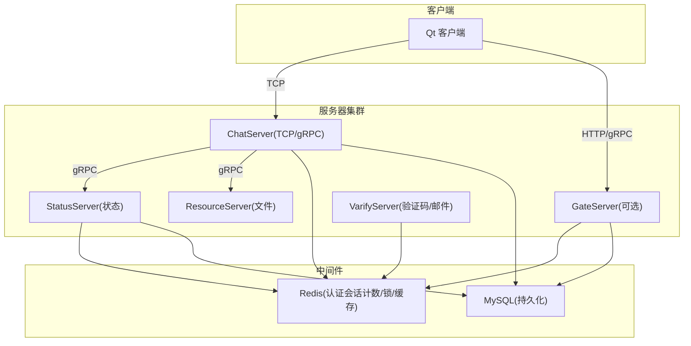
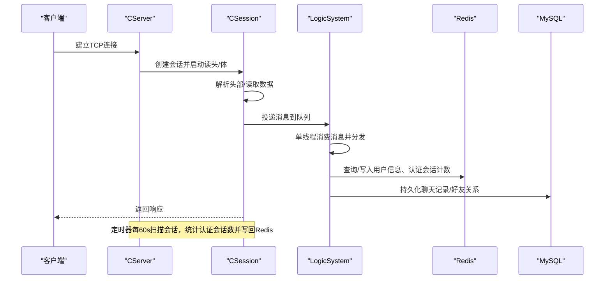
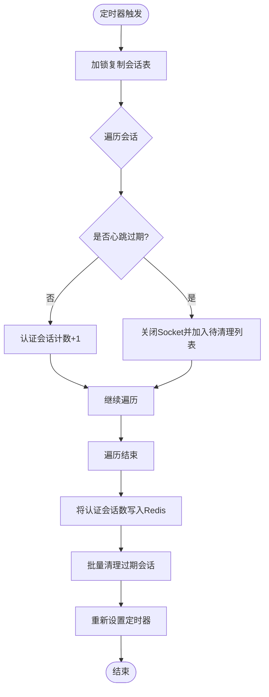
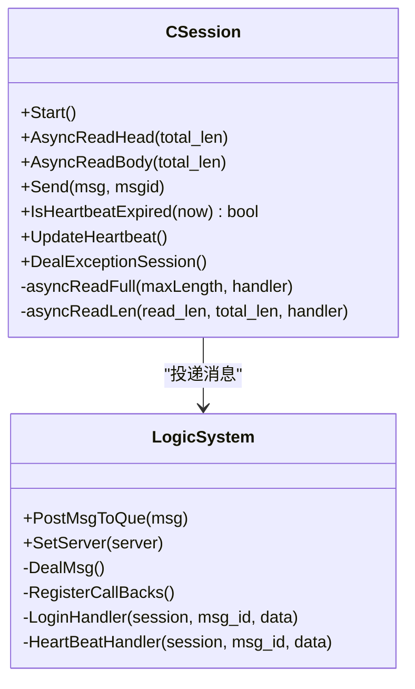
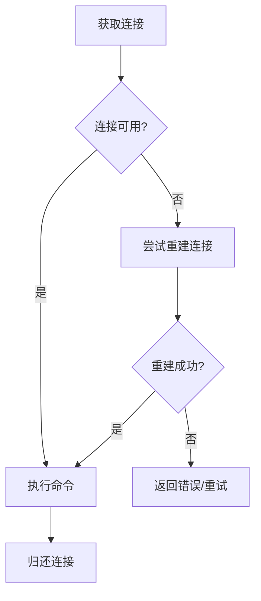
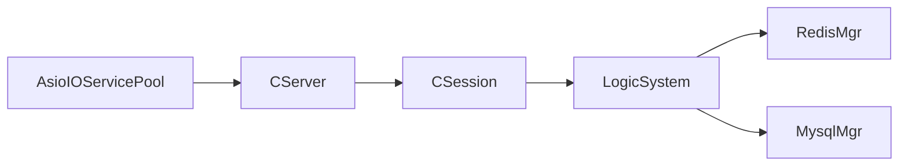

# 性能监控与分析

<cite>
**本文引用的文件**   
- [README.md](file://README.md)
- [AsioIOServicePool.h](file://server/ChatServer/include/AsioIOServicePool.h)
- [AsioIOServicePool.cpp](file://server/ChatServer/src/AsioIOServicePool.cpp)
- [CSession.h](file://server/ChatServer/include/CSession.h)
- [CSession.cpp](file://server/ChatServer/src/CSession.cpp)
- [CServer.h](file://server/ChatServer/include/CServer.h)
- [CServer.cpp](file://server/ChatServer/src/CServer.cpp)
- [LogicSystem.h](file://server/ChatServer/include/LogicSystem.h)
- [LogicSystem.cpp](file://server/ChatServer/src/LogicSystem.cpp)
- [ChatServer.cpp](file://server/ChatServer/src/ChatServer.cpp)
- [utils.h](file://server/ChatServer/include/utils.h)
- [utils.cpp](file://server/ChatServer/src/utils.cpp)
- [RedisMgr.h](file://server/ChatServer/include/RedisMgr.h)
- [MysqlDao.h](file://server/StatusServer/include/MysqlDao.h)
- [day35心跳逻辑.md](file://开发文档/day35心跳逻辑.md)
- [day34多服程踢人逻辑.md](file://开发文档/day34多服程踢人逻辑.md)
</cite>

## 更新摘要
**变更内容**   
- 移除了连接数统计相关的监控指标（LOGIN_COUNT）
- 新增认证会话计数监控功能，使用GetAuthenticatedSessionCount方法
- HeartBeatHandler方法中的连接数统计逻辑已替换为会话计数统计
- 更新了Redis监控键名从LOGIN_COUNT改为chatserver:lease:<server_name>

## 目录
1. [引言](#引言)
2. [项目结构](#项目结构)
3. [核心组件](#核心组件)
4. [架构总览](#架构总览)
5. [详细组件分析](#详细组件分析)
6. [依赖关系分析](#依赖关系分析)
7. [性能考量与指标采集](#性能考量与指标采集)
8. [故障排查指南](#故障排查指南)
9. [结论](#结论)
10. [附录：基准、负载与压力测试方法](#附录基准负载与压力测试方法)

## 引言
本技术文档围绕 LLFCChat 的性能监控与分析展开，聚焦于性能指标收集、监控数据采集与日志分析策略；阐述如何识别性能瓶颈、监控 CPU 与内存使用率；记录网络性能监控、数据库性能分析与 I/O 性能分析方法；并给出生产环境监控部署与告警机制配置建议。同时结合代码中的心跳检测、认证会话计数、异步 I/O 与消息队列等实现，提供可落地的优化与观测方案。

## 项目结构
LLFCChat 采用多服务架构（聊天、网关、资源、状态、验证），其中 ChatServer 负责 TCP 长连接、会话管理与业务逻辑调度，配合 Redis 做分布式锁与认证会话计数，MySQL 做持久化存储。关键性能相关点包括：
- AsioIOServicePool：基于 boost::asio 的多 io_context 线程池，提升并发处理能力
- CServer/CSession：TCP 接入、读写、心跳与异常处理
- LogicSystem：单线程消息消费队列，解耦 IO 与业务
- RedisMgr：连接池与分布式锁，支撑跨进程/节点协调
- MysqlDao：连接池与健康检查，保障数据库可用性

**图表来源** 
- [AsioIOServicePool.h](file://server/ChatServer/include/AsioIOServicePool.h)
- [CServer.h](file://server/ChatServer/include/CServer.h)
- [CSession.h](file://server/ChatServer/include/CSession.h)
- [LogicSystem.h](file://server/ChatServer/include/LogicSystem.h)
- [RedisMgr.h](file://server/ChatServer/include/RedisMgr.h)
- [MysqlDao.h](file://server/StatusServer/include/MysqlDao.h)

**章节来源**
- [README.md](file://README.md)

## 核心组件
- AsioIOServicePool：按硬件并发创建多个 io_context，轮询分配，避免单点阻塞
- CServer：接受连接、维护会话表、定时心跳检测与认证会话计数统计
- CSession：非阻塞读写、粘包处理、心跳更新与异常清理
- LogicSystem：消息队列+条件变量唤醒，统一分发到各处理器
- RedisMgr：连接池、分布式锁、认证会话计数原子操作
- MysqlDao：连接池健康检查与自动重连

**章节来源**
- [AsioIOServicePool.h](file://server/ChatServer/include/AsioIOServicePool.h)
- [AsioIOServicePool.cpp](file://server/ChatServer/src/AsioIOServicePool.cpp)
- [CServer.h](file://server/ChatServer/include/CServer.h)
- [CServer.cpp](file://server/ChatServer/src/CServer.cpp)
- [CSession.h](file://server/ChatServer/include/CSession.h)
- [CSession.cpp](file://server/ChatServer/src/CSession.cpp)
- [LogicSystem.h](file://server/ChatServer/include/LogicSystem.h)
- [LogicSystem.cpp](file://server/ChatServer/src/LogicSystem.cpp)
- [RedisMgr.h](file://server/ChatServer/include/RedisMgr.h)
- [MysqlDao.h](file://server/StatusServer/include/MysqlDao.h)

## 架构总览
下图展示从客户端请求到服务端处理的完整链路，以及心跳检测与认证会话计数的时序。

**图表来源** 
- [CServer.cpp](file://server/ChatServer/src/CServer.cpp)
- [CSession.cpp](file://server/ChatServer/src/CSession.cpp)
- [LogicSystem.cpp](file://server/ChatServer/src/LogicSystem.cpp)
- [ChatServer.cpp](file://server/ChatServer/src/ChatServer.cpp)
- [RedisMgr.h](file://server/ChatServer/include/RedisMgr.h)
- [day35心跳逻辑.md](file://开发文档/day35心跳逻辑.md)

## 详细组件分析

### 心跳检测与认证会话计数
- 心跳阈值：会话超过阈值（如20秒）判定为过期，触发关闭与清理
- 定时器周期：每60秒遍历会话集合，统计认证会话数并写入 Redis
- 分布式踢人：通过 Redis 分布式锁保证同一用户异地登录时的原子性清理
- **更新**：认证会话计数使用 `GetAuthenticatedSessionCount()` 方法，仅统计已登录的会话（GetUserId() > 0）

**图表来源** 
- [CServer.cpp](file://server/ChatServer/src/CServer.cpp)
- [CSession.cpp](file://server/ChatServer/src/CSession.cpp)
- [day35心跳逻辑.md](file://开发文档/day35心跳逻辑.md)

**章节来源**
- [CServer.cpp](file://server/ChatServer/src/CServer.cpp)
- [CSession.cpp](file://server/ChatServer/src/CSession.cpp)
- [day35心跳逻辑.md](file://开发文档/day35心跳逻辑.md)

### 异步 I/O 与消息队列
- 非阻塞读写：CSession 使用 async_read_some 组合成完整报文，避免阻塞
- 发送队列：每个会话维护发送队列，防止突发写放大
- 逻辑解耦：LogicSystem 以单线程消费队列，降低竞争，提高吞吐
- **更新**：HeartBeatHandler 方法简化为仅处理心跳响应，不再进行连接数统计

**图表来源** 
- [CSession.h](file://server/ChatServer/include/CSession.h)
- [CSession.cpp](file://server/ChatServer/src/CSession.cpp)
- [LogicSystem.h](file://server/ChatServer/include/LogicSystem.h)
- [LogicSystem.cpp](file://server/ChatServer/src/LogicSystem.cpp)

**章节来源**
- [CSession.cpp](file://server/ChatServer/src/CSession.cpp)
- [LogicSystem.cpp](file://server/ChatServer/src/LogicSystem.cpp)

### 连接池与中间件健康检查
- AsioIOServicePool：按 CPU 核数创建 io_context，轮询分配任务
- RedisMgr：连接池复用，支持分布式锁与认证会话计数
- MysqlDao：定期执行 SELECT 1 探测连接存活，失败则重建连接

**图表来源** 
- [AsioIOServicePool.cpp](file://server/ChatServer/src/AsioIOServicePool.cpp)
- [RedisMgr.h](file://server/ChatServer/include/RedisMgr.h)
- [MysqlDao.h](file://server/StatusServer/include/MysqlDao.h)

**章节来源**
- [AsioIOServicePool.cpp](file://server/ChatServer/src/AsioIOServicePool.cpp)
- [RedisMgr.h](file://server/ChatServer/include/RedisMgr.h)
- [MysqlDao.h](file://server/StatusServer/include/MysqlDao.h)

## 依赖关系分析
- CServer 依赖 AsioIOServicePool 进行事件循环与任务分发
- CSession 依赖 LogicSystem 进行消息投递与业务处理
- LogicSystem 依赖 RedisMgr 与 MysqlMgr 完成数据访问
- 所有服务通过 Redis 共享状态（认证会话计数、分布式锁、用户在线映射）

**图表来源** 
- [AsioIOServicePool.h](file://server/ChatServer/include/AsioIOServicePool.h)
- [CServer.h](file://server/ChatServer/include/CServer.h)
- [CSession.h](file://server/ChatServer/include/CSession.h)
- [LogicSystem.h](file://server/ChatServer/include/LogicSystem.h)
- [RedisMgr.h](file://server/ChatServer/include/RedisMgr.h)

**章节来源**
- [AsioIOServicePool.h](file://server/ChatServer/include/AsioIOServicePool.h)
- [CServer.h](file://server/ChatServer/include/CServer.h)
- [CSession.h](file://server/ChatServer/include/CSession.h)
- [LogicSystem.h](file://server/ChatServer/include/LogicSystem.h)
- [RedisMgr.h](file://server/ChatServer/include/RedisMgr.h)

## 性能考量与指标采集
本节面向生产环境的性能监控与分析，结合现有实现提出指标采集与优化建议。

- 指标定义与采集
  - **认证会话数**：CServer::GetAuthenticatedSessionCount() 统计已登录会话数，每60秒写入 Redis（chatserver:lease:<server_name>）
  - **心跳超时率**：CSession::IsHeartbeatExpired 判断超时会话比例
  - **读写延迟**：CSession::AsyncReadHead/AsyncReadBody 回调耗时（可通过时间戳工具函数记录）
  - **发送队列长度**：CSession::_send_que.size() 作为拥塞信号
  - **逻辑队列积压**：LogicSystem::_msg_que.size() 反映处理瓶颈
  - **数据库连接池健康**：MysqlDao::checkConnection 成功率与重建次数
  - **Redis 锁竞争**：acquireLock/releaseLock 调用频率与失败率

- **更新**：监控键名变更
  - 旧键名：`LOGIN_COUNT`（哈希表，存储服务器名称到连接数的映射）
  - 新键名：`chatserver:lease:<server_name>`（字符串，直接存储认证会话数）
  - 上报间隔：每 report_interval 秒（默认5秒）续租一次，TTL 15秒

- 监控数据采集
  - 在 CSession::HandleWrite、AsyncReadHead/Body 回调中记录起止时间戳，计算 P50/P95/P99 延迟
  - 在 LogicSystem::DealMsg 入队/出队处打点，统计队列长度与时延
  - 在 RedisMgr 关键路径（HSet/HGet/acquireLock）增加慢查询日志
  - 在 MysqlDao 连接健康检查中记录失败原因与重连耗时

- 日志分析策略
  - 统一时间戳格式：使用 utils::getCurrentTimestamp 输出标准化时间
  - 结构化日志：JSON 格式包含 session_id、uid、msg_id、latency_ms、error_code
  - 分级输出：ERROR/WARN/INFO/DEBUG，生产环境默认 INFO
  - 采样与限流：高频日志（如心跳）采用采样或聚合上报

- 性能瓶颈识别
  - 若 LogicSystem 队列持续增长，说明业务处理慢，需优化 Handler 或扩容
  - 若 CSession 发送队列过长，说明下游网络或对方接收慢，需背压与降级
  - 若心跳超时率上升，检查客户端保活策略与网络质量
  - 若 Redis 锁竞争激烈，考虑热点 Key 拆分或本地缓存

- CPU 与内存使用率监控
  - CPU：观察 AsioIOServicePool 线程忙闲比，必要时调整线程数
  - 内存：关注 CSession 缓冲区大小与发送队列增长趋势，限制 MAX_LENGTH 与 MAX_SENDQUE
  - 堆栈采样：在高负载时抓取线程快照，定位热点函数

- 网络性能监控
  - 统计每秒收发字节数、包数量、重传率
  - 监控 TCP 连接建立耗时与握手失败率
  - 区分不同 msg_id 的 RTT，识别慢接口

- 数据库性能分析
  - 慢查询日志：记录执行时长与 SQL 文本
  - 连接池命中率与等待时间
  - 事务死锁与锁等待（参考分布式死锁解决方案文档）

- I/O 性能分析
  - 文件传输（ResourceServer）：断点续传进度、分片大小、并发下载线程数
  - 磁盘 I/O：顺序/随机读写占比，IOPS 与吞吐

- 生产环境监控部署与告警
  - 指标上报：Prometheus 抓取自定义指标（认证会话数、延迟、队列长度）
  - 日志采集：Fluentd/Filebeat 收集结构化日志，集中存储至 Elasticsearch
  - 可视化：Grafana 面板展示 QPS、延迟分布、错误率、资源使用
  - 告警规则：认证会话数突增/突降、心跳超时率>阈值、队列积压>阈值、Redis/MySQL 错误率>阈值
  - 自愈策略：自动重启异常进程、动态扩缩容、熔断与降级开关

**章节来源**
- [CServer.cpp](file://server/ChatServer/src/CServer.cpp)
- [CSession.cpp](file://server/ChatServer/src/CSession.cpp)
- [LogicSystem.cpp](file://server/ChatServer/src/LogicSystem.cpp)
- [ChatServer.cpp](file://server/ChatServer/src/ChatServer.cpp)
- [utils.cpp](file://server/ChatServer/src/utils.cpp)
- [MysqlDao.h](file://server/StatusServer/include/MysqlDao.h)
- [RedisMgr.h](file://server/ChatServer/include/RedisMgr.h)

## 故障排查指南
- 常见问题定位
  - 连接频繁断开：检查心跳阈值与客户端保活间隔，确认网络抖动
  - 消息丢失：核对 AsyncReadHead/Body 长度校验与粘包处理
  - 异地登录冲突：查看 Redis 分布式锁与 USER_SESSION_PREFIX 一致性
  - 数据库连接不稳定：观察 checkConnection 失败日志与重连次数
  - **更新**：认证会话计数异常：检查 GetAuthenticatedSessionCount() 返回值与 Redis 键值一致性

- 调试手段
  - 开启 DEBUG 日志，打印 session_id、uid、msg_id、bytes_transfered
  - 使用抓包工具（Wireshark）分析 TCP 握手与报文结构
  - 对热点路径添加计时与计数器，快速定位瓶颈

- 恢复策略
  - 优雅关闭：停止定时器、清空队列、释放锁与连接
  - 隔离故障节点：从负载均衡摘除，逐步恢复
  - 数据一致性：通过 Redis 与 MySQL 双写校验修复不一致

**章节来源**
- [CSession.cpp](file://server/ChatServer/src/CSession.cpp)
- [day34多服程踢人逻辑.md](file://开发文档/day34多服程踢人逻辑.md)
- [day35心跳逻辑.md](file://开发文档/day35心跳逻辑.md)

## 结论
LLFCChat 在高性能方面具备良好基础：异步 I/O、线程池、消息队列与中间件健康检查均已实现。通过完善指标采集、日志分析与监控告警体系，可有效识别瓶颈并保障生产稳定性。建议在后续迭代中引入更细粒度的性能埋点与自动化测试，持续提升系统吞吐与可靠性。

## 附录：基准、负载与压力测试方法
- 基准测试
  - 目标：测量单接口最小延迟与最大吞吐
  - 方法：使用 ab/wrk/JMeter 模拟固定并发，记录 P50/P95/P99 延迟与 QPS
  - 关注点：CPU 利用率、内存峰值、GC/堆占用（如有）

- 负载测试
  - 目标：评估系统在典型负载下的表现
  - 方法：逐步增加并发用户数，观察指标变化拐点
  - 关注点：队列积压、认证会话数、错误率、资源使用

- 压力测试
  - 目标：寻找系统崩溃边界与恢复能力
  - 方法：注入高并发、大报文、异常网络（丢包/延迟）
  - 关注点：心跳超时率、锁竞争、数据库连接池耗尽、进程自恢复

- 测试环境与数据
  - 独立压测环境，隔离真实流量
  - 预置足够用户与聊天数据，覆盖热路径
  - 记录基线指标，对比版本差异

[本节为通用指导，不直接分析具体文件]