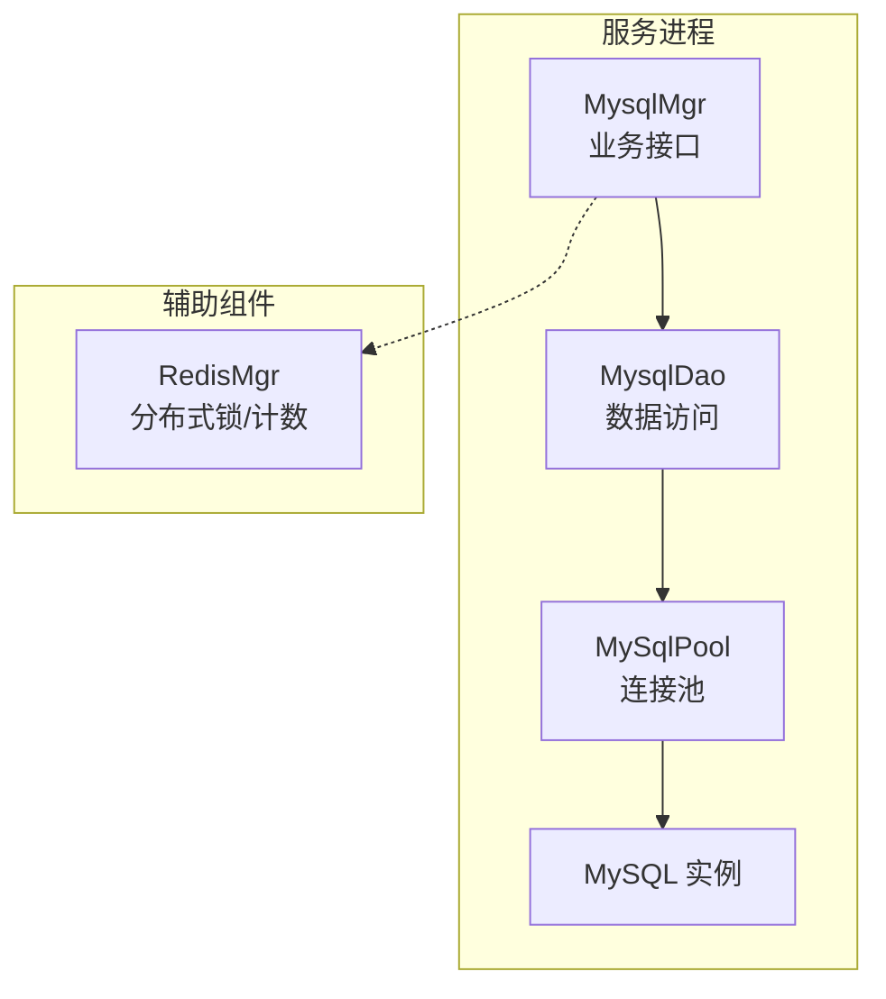
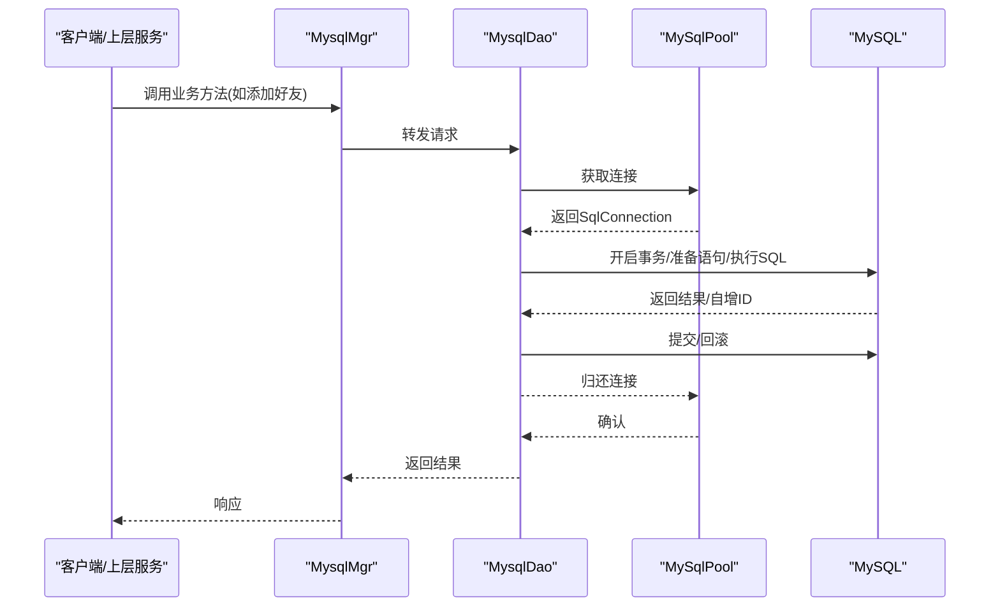
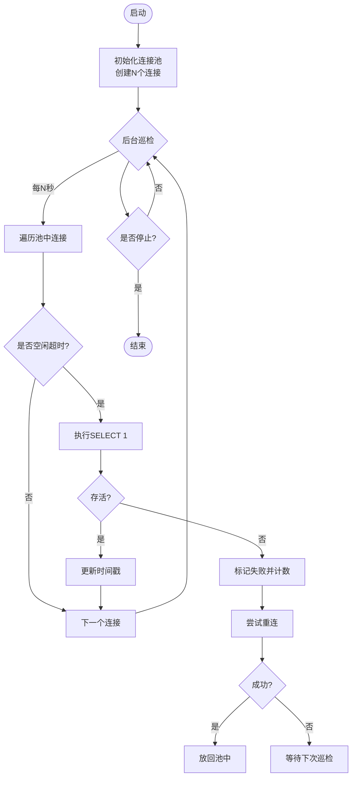
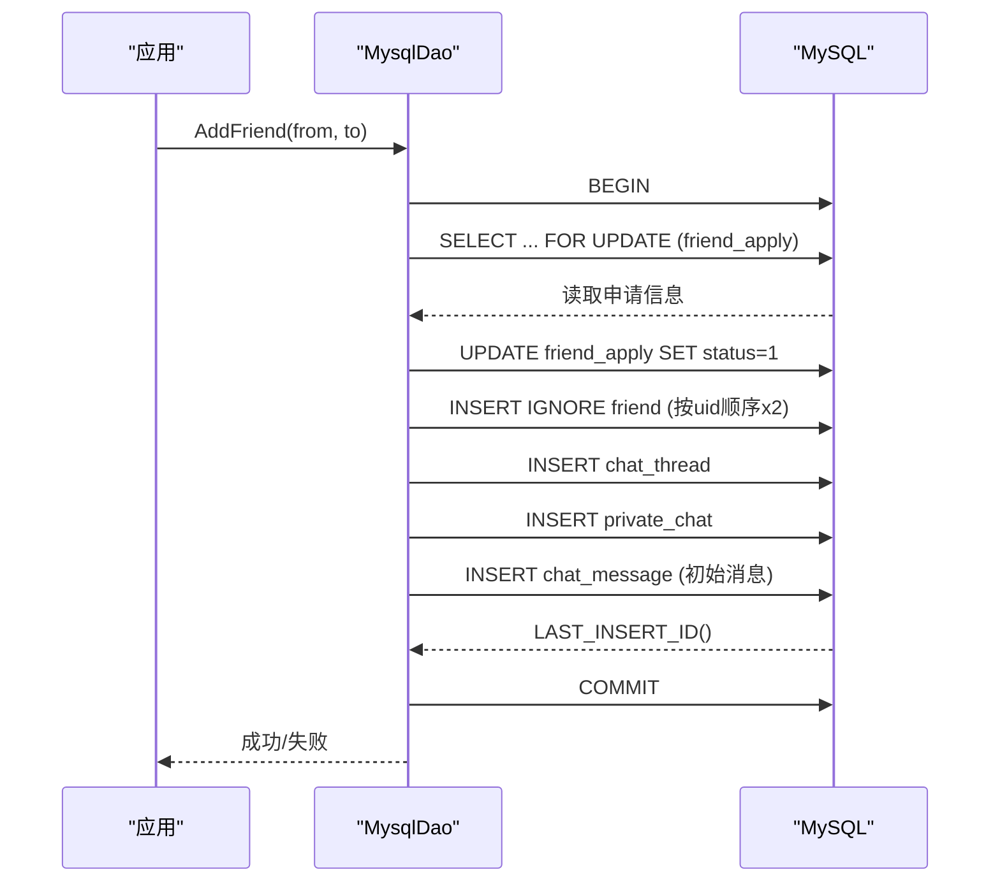
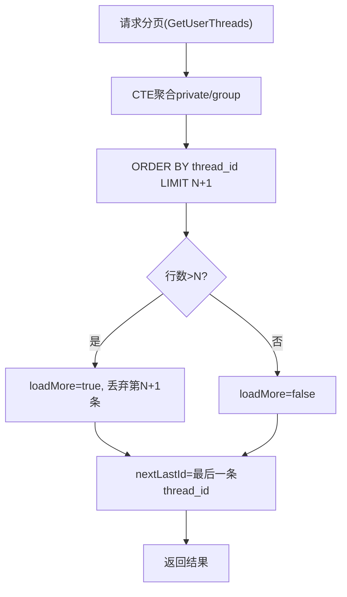
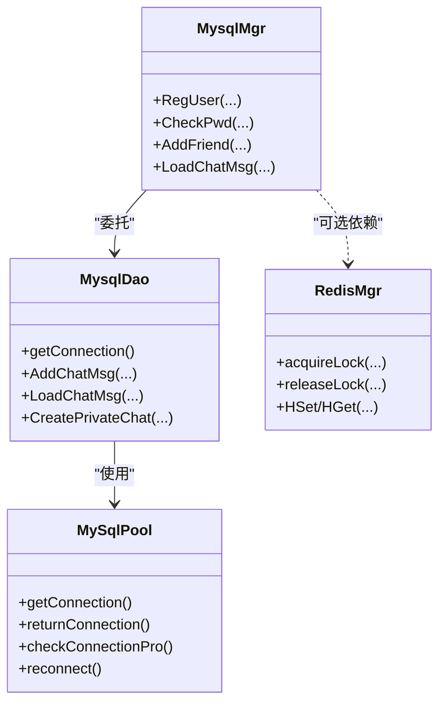
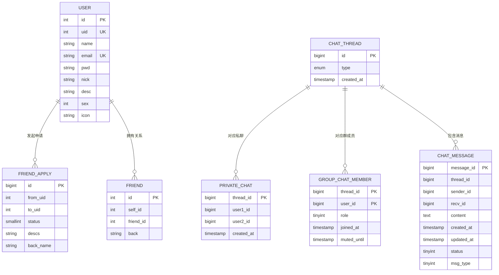

# 数据库优化

<cite>
**本文引用的文件**   
- [MysqlMgr.h](file://server/ChatServer/include/MysqlMgr.h)
- [MysqlMgr.cpp](file://server/ChatServer/src/MysqlMgr.cpp)
- [MysqlDao.h](file://server/ChatServer/include/MysqlDao.h)
- [MysqlDao.cpp](file://server/ChatServer/src/MysqlDao.cpp)
- [llfc.sql](file://sql备份/llfc.sql)
- [RedisMgr.cpp](file://server/ChatServer/src/RedisMgr.cpp)
- [day35心跳逻辑.md](file://开发文档/day35心跳逻辑.md)
- [day41-分布式死锁解决方案.md](file://开发文档/day41-分布式死锁解决方案.md)
</cite>

## 目录
1. [引言](#引言)
2. [项目结构](#项目结构)
3. [核心组件](#核心组件)
4. [架构总览](#架构总览)
5. [详细组件分析](#详细组件分析)
6. [依赖关系分析](#依赖关系分析)
7. [性能考量](#性能考量)
8. [故障排查指南](#故障排查指南)
9. [结论](#结论)
10. [附录](#附录)

## 引言
本技术文档围绕 LLFCChat 的数据库层进行系统化优化说明，覆盖 MySQL 连接池配置、查询与索引优化、事务与批量写入、读写分离与缓存策略、慢查询分析与执行计划优化、数据分片与归档、以及高并发下的锁优化。目标是提供可落地的工程实践与排障指引，帮助在聊天场景下实现稳定、高性能的数据访问能力。

## 项目结构
本项目数据库相关代码集中在 ChatServer 模块中，采用“管理器-DAO-连接池”的分层设计：
- MysqlMgr：对外暴露业务级接口（用户、好友、会话等），内部委托 DAO 完成持久化操作。
- MysqlDao：封装 SQL 操作，使用 MySqlPool 管理连接，包含事务、批处理、分页等关键路径。
- MySqlPool：自定义连接池，负责连接创建、健康检查、自动重连与资源回收。
- 数据库脚本：SQL 备份中包含表结构、索引与存储过程定义。

图表来源 
- [MysqlMgr.h](file://server/ChatServer/include/MysqlMgr.h)
- [MysqlMgr.cpp](file://server/ChatServer/src/MysqlMgr.cpp)
- [MysqlDao.h](file://server/ChatServer/include/MysqlDao.h)
- [MysqlDao.cpp](file://server/ChatServer/src/MysqlDao.cpp)
- [RedisMgr.cpp](file://server/ChatServer/src/RedisMgr.cpp)

章节来源
- [MysqlMgr.h](file://server/ChatServer/include/MysqlMgr.h)
- [MysqlMgr.cpp](file://server/ChatServer/src/MysqlMgr.cpp)
- [MysqlDao.h](file://server/ChatServer/include/MysqlDao.h)
- [MysqlDao.cpp](file://server/ChatServer/src/MysqlDao.cpp)

## 核心组件
- 连接池（MySqlPool）
  - 功能：初始化固定数量连接、周期性健康检查（SELECT 1）、失败重连、线程安全获取/归还连接、优雅关闭。
  - 关键点：条件变量等待非空队列；原子停止标志；后台线程定时巡检；失败计数器驱动补连。
- 数据访问（MysqlDao）
  - 功能：用户注册/校验、好友申请与认证、好友关系建立（含事务）、会话与消息 CRUD、分页加载。
  - 关键点：PreparedStatement 防注入；事务边界明确；LAST_INSERT_ID 回填；批量插入；游标分页。
- 业务门面（MysqlMgr）
  - 功能：统一对外 API，屏蔽 DAO 细节，便于后续替换或扩展。
- 分布式协调（RedisMgr）
  - 功能：分布式锁、登录计数统计等，配合心跳与异常清理避免死锁。

章节来源
- [MysqlDao.h](file://server/ChatServer/include/MysqlDao.h)
- [MysqlDao.cpp](file://server/ChatServer/src/MysqlDao.cpp)
- [MysqlMgr.h](file://server/ChatServer/include/MysqlMgr.h)
- [MysqlMgr.cpp](file://server/ChatServer/src/MysqlMgr.cpp)
- [RedisMgr.cpp](file://server/ChatServer/src/RedisMgr.cpp)

## 架构总览
下图展示了从业务调用到数据库的完整链路，包括连接池、事务、分页与错误回滚路径。

图表来源 
- [MysqlMgr.cpp](file://server/ChatServer/src/MysqlMgr.cpp)
- [MysqlDao.cpp](file://server/ChatServer/src/MysqlDao.cpp)
- [MysqlDao.h](file://server/ChatServer/include/MysqlDao.h)

## 详细组件分析

### 连接池设计与优化（MySqlPool）
- 连接生命周期
  - 初始化：按配置大小创建连接并设置 schema，记录最后操作时间戳。
  - 健康检查：后台线程周期遍历，对空闲超时的连接执行 SELECT 1 探测，失败则标记并触发重连。
  - 重连：根据失败计数逐步补齐连接，保证池容量稳定。
  - 获取/归还：互斥保护+条件变量唤醒，支持优雅关闭。
- 优化建议
  - 参数调优：poolSize 与并发度匹配；健康检查间隔与超时阈值按网络与 DB 负载调整。
  - 监控指标：池大小、活跃数、等待数、失败重连次数、平均获取耗时。
  - 容错增强：指数退避重试、熔断降级（连接不可用时快速失败）。

图表来源 
- [MysqlDao.h](file://server/ChatServer/include/MysqlDao.h)
- [MysqlDao.cpp](file://server/ChatServer/src/MysqlDao.cpp)

章节来源
- [MysqlDao.h](file://server/ChatServer/include/MysqlDao.h)
- [MysqlDao.cpp](file://server/ChatServer/src/MysqlDao.cpp)

### 事务与并发控制（AddFriend 流程）
- 事务边界
  - 锁定读取 friend_apply（FOR UPDATE），确保并发下只有一条申请被处理。
  - 更新状态后，按 uid 大小顺序插入双向好友关系，避免死锁。
  - 创建 chat_thread 与 private_chat，插入初始消息，最后提交。
- 死锁规避
  - 固定插入顺序（较小 uid 先写 self_id），降低锁冲突概率。
  - 捕获 MySQL 1213 死锁错误，必要时重试或回滚。
- 性能要点
  - 减少事务内往返，合并必要查询。
  - 合理使用唯一键约束（friend_apply.from_to_uid）防止重复申请。

图表来源 
- [MysqlDao.cpp](file://server/ChatServer/src/MysqlDao.cpp)

章节来源
- [MysqlDao.cpp](file://server/ChatServer/src/MysqlDao.cpp)

### 分页与游标查询（GetUserThreads / LoadChatMsg）
- 会话列表分页
  - 使用 CTE + UNION ALL 聚合私聊与群聊成员，ORDER BY thread_id，LIMIT pageSize+1 判断是否有下一页。
  - 输出 nextLastId 作为游标，避免深分页开销。
- 消息分页
  - 基于 message_id > lastId 的游标分页，LIMIT pageSize+1 判断 loadMore。
- 优化建议
  - 确保索引覆盖排序字段（thread_id, created_at 或 message_id）。
  - 限制返回列，避免大字段传输。

图表来源 
- [MysqlDao.cpp](file://server/ChatServer/src/MysqlDao.cpp)

章节来源
- [MysqlDao.cpp](file://server/ChatServer/src/MysqlDao.cpp)

### 批量写入（AddChatMsg 向量版本）
- 机制
  - 关闭自动提交，循环 PreparedStatement 绑定参数并 executeUpdate。
  - 每次插入后通过 LAST_INSERT_ID 回填消息 ID。
  - 全部成功后统一 commit，失败则 rollback。
- 优化建议
  - 合理批次大小（例如 50~200），平衡吞吐与内存占用。
  - 结合连接池健康检查，避免在坏连接上重试过多。

章节来源
- [MysqlDao.cpp](file://server/ChatServer/src/MysqlDao.cpp)

### 数据库缓存与读写分离策略
- 缓存策略
  - 热点读（用户信息、好友列表）可引入 Redis 缓存，设置过期与失效策略。
  - 写多读少（消息）不建议强一致缓存，优先直写 DB，读侧按需缓存。
- 读写分离
  - 当前实现为单库直连，可扩展为读写分离：主库写、从库读，DAO 层按路由选择连接。
  - 注意主从延迟导致的最终一致性场景（如刚写完即读）。

[本节为概念性内容，不直接分析具体文件]

### 慢查询分析与执行计划优化
- 分析方法
  - 启用慢查询日志，定位长耗时 SQL。
  - 使用 EXPLAIN/EXPLAIN ANALYZE 查看执行计划，关注全表扫描、临时表、文件排序。
- 优化方向
  - 索引优化：确保 WHERE/JOIN/ORDER BY/GROUP BY 字段命中合适索引。
  - SQL 改写：避免 SELECT *，拆分复杂子查询，利用覆盖索引。
  - 分页优化：使用游标替代 OFFSET。

[本节为通用方法论，不直接分析具体文件]

### 数据分片、分区表与归档策略
- 分片
  - 按 user_id 哈希分片（水平拆分），将不同用户的会话与消息分散到多个实例。
  - 路由规则需一致（如 shard = hash(user_id) % N）。
- 分区表
  - 对大表（chat_message）按时间范围分区（月/季度），便于归档与清理。
- 归档
  - 定期将历史数据迁移至冷存储（归档表/对象存储），保留热数据在在线库。

[本节为概念性内容，不直接分析具体文件]

### 高并发锁优化与分布式协作
- 本地锁与分布式锁顺序
  - 统一加锁顺序（如先分布式锁再线程锁），避免交叉等待导致死锁。
  - 使用 tryLock + 随机退避重试，检测潜在死锁倾向主动放弃。
- Redis 协作
  - 分布式锁用于跨进程/节点互斥（如会话清理、计数更新）。
  - Lua 脚本保证原子性，减少竞争与竞态。

章节来源
- [day35心跳逻辑.md](file://开发文档/day35心跳逻辑.md)
- [day41-分布式死锁解决方案.md](file://开发文档/day41-分布式死锁解决方案.md)
- [RedisMgr.cpp](file://server/ChatServer/src/RedisMgr.cpp)

## 依赖关系分析
- 组件耦合
  - MysqlMgr 依赖 MysqlDao；MysqlDao 依赖 MySqlPool；MySqlPool 依赖 MySQL 驱动与网络栈。
  - RedisMgr 独立于 DAO，但被上层逻辑用于分布式协调。
- 外部依赖
  - MySQL Connector/C++、InnoDB 引擎、索引与事务特性。
  - Redis（分布式锁、计数、缓存）。

图表来源 
- [MysqlMgr.h](file://server/ChatServer/include/MysqlMgr.h)
- [MysqlDao.h](file://server/ChatServer/include/MysqlDao.h)
- [RedisMgr.cpp](file://server/ChatServer/src/RedisMgr.cpp)

章节来源
- [MysqlMgr.h](file://server/ChatServer/include/MysqlMgr.h)
- [MysqlDao.h](file://server/ChatServer/include/MysqlDao.h)
- [RedisMgr.cpp](file://server/ChatServer/src/RedisMgr.cpp)

## 性能考量
- 连接池
  - 合理设置 poolSize 与 IOService 线程数匹配；监控等待队列长度与超时率。
- 事务
  - 缩短事务范围，避免长事务；合并多次更新为一次事务。
- 索引
  - 针对高频查询建立复合索引；避免过度索引影响写入。
- 分页
  - 使用游标分页；限制返回列；避免深度偏移。
- 批量
  - 批量写入时控制批次大小；失败重试与幂等设计。
- 缓存
  - 热点数据缓存（用户信息、好友列表）；缓存失效与一致性策略。
- 监控
  - 慢查询、连接池指标、错误码分布（如 1213 死锁、1062 唯一冲突）。

[本节为通用指导，不直接分析具体文件]

## 故障排查指南
- 连接池问题
  - 现象：获取连接超时、频繁重连。
  - 排查：检查网络连通性、MySQL 最大连接数、健康检查间隔与阈值。
- 事务死锁
  - 现象：错误码 1213。
  - 排查：检查加锁顺序、FOR UPDATE 使用范围、唯一键冲突；必要时重试。
- 分页性能差
  - 现象：OFFSET 大时变慢。
  - 排查：改用游标分页；检查 ORDER BY 字段索引。
- 批量写入失败
  - 现象：部分插入成功、整体回滚。
  - 排查：检查事务边界、LAST_INSERT_ID 获取、连接健康。
- 分布式锁死锁
  - 现象：线程锁与分布式锁嵌套导致阻塞。
  - 排查：统一加锁顺序；使用 tryLock + 退避重试；Lua 脚本原子化。

章节来源
- [MysqlDao.cpp](file://server/ChatServer/src/MysqlDao.cpp)
- [day35心跳逻辑.md](file://开发文档/day35心跳逻辑.md)
- [day41-分布式死锁解决方案.md](file://开发文档/day41-分布式死锁解决方案.md)

## 结论
通过对连接池、事务、索引、分页、批量写入、缓存与分布式锁的系统优化，LLFCChat 的数据库层在高并发聊天场景下具备更强的稳定性与性能。建议持续监控关键指标，结合慢查询与执行计划迭代优化，并在规模增长时引入读写分离与分片归档策略。

[本节为总结性内容，不直接分析具体文件]

## 附录

### 数据库模型与索引概览
- 用户表（user）
  - 主键 id；唯一键 uid、email；name 索引。
- 好友申请（friend_apply）
  - 唯一键 from_uid, to_uid；状态字段 status。
- 好友关系（friend）
  - 唯一键 self_id, friend_id。
- 会话（chat_thread）
  - 主键 id；类型枚举 private/group。
- 私聊（private_chat）
  - 主键 thread_id；唯一键 user1_id, user2_id；用户维度的 thread_id 索引。
- 群成员（group_chat_member）
  - 复合主键 thread_id, user_id；user_id 索引。
- 消息（chat_message）
  - 主键 message_id；索引 idx_thread_created、idx_thread_message。

图表来源 
- [llfc.sql](file://sql备份/llfc.sql)

章节来源
- [llfc.sql](file://sql备份/llfc.sql)