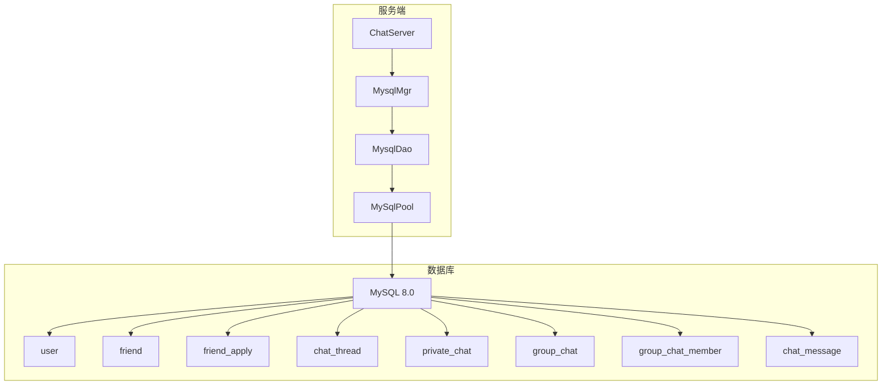
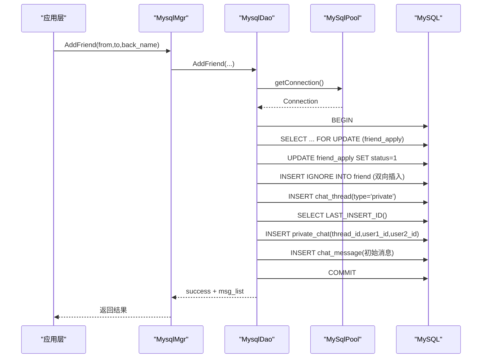
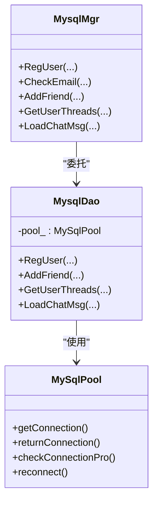

# MySQL优化

<cite>
**本文引用的文件**   
- [llfc.sql](file://sql备份/llfc.sql)
- [chat_message.sql](file://sql备份/chat_message.sql)
- [MysqlDao.h](file://server/ChatServer/include/MysqlDao.h)
- [MysqlDao.cpp](file://server/ChatServer/src/MysqlDao.cpp)
- [MysqlMgr.h](file://server/ChatServer/include/MysqlMgr.h)
- [MysqlMgr.cpp](file://server/ChatServer/src/MysqlMgr.cpp)
</cite>

## 目录
1. [引言](#引言)
2. [项目结构](#项目结构)
3. [核心组件](#核心组件)
4. [架构总览](#架构总览)
5. [详细组件分析](#详细组件分析)
6. [依赖关系分析](#依赖关系分析)
7. [性能考量与优化建议](#性能考量与优化建议)
8. [故障排查指南](#故障排查指南)
9. [结论](#结论)
10. [附录：索引设计与SQL优化清单](#附录索引设计与sql优化清单)

## 引言
本文件面向LLFCChat项目的MySQL数据库优化，围绕以下目标展开：
- 索引设计原则：主键、唯一、复合索引的选择策略与最佳实践
- 慢查询分析方法：EXPLAIN执行计划解读、瓶颈识别、SQL优化技巧
- 表结构设计优化：范式化与反范式权衡、分区表设计、存储引擎选择
- 具体SQL优化案例：JOIN优化、子查询优化、聚合查询优化等
- 监控与运维：性能指标收集、慢查询日志分析、锁等待监控

## 项目结构
本项目采用多服务架构（ChatServer、GateServer、ResourceServer、StatusServer），其中ChatServer承担聊天业务的核心逻辑，并通过MysqlDao/MysqlMgr访问MySQL。数据库脚本位于sql备份目录，包含用户、好友、会话、消息等核心表的DDL与示例数据。

图表来源
- [MysqlMgr.h:1-41](file://server/ChatServer/include/MysqlMgr.h#L1-L41)
- [MysqlMgr.cpp:1-95](file://server/ChatServer/src/MysqlMgr.cpp#L1-L95)
- [MysqlDao.h:1-270](file://server/ChatServer/include/MysqlDao.h#L1-L270)
- [MysqlDao.cpp:1-1104](file://server/ChatServer/src/MysqlDao.cpp#L1-L1104)
- [llfc.sql:1-756](file://sql备份/llfc.sql#L1-L756)

章节来源
- [MysqlMgr.h:1-41](file://server/ChatServer/include/MysqlMgr.h#L1-L41)
- [MysqlMgr.cpp:1-95](file://server/ChatServer/src/MysqlMgr.cpp#L1-L95)
- [MysqlDao.h:1-270](file://server/ChatServer/include/MysqlDao.h#L1-L270)
- [MysqlDao.cpp:1-1104](file://server/ChatServer/src/MysqlDao.cpp#L1-L1104)
- [llfc.sql:1-756](file://sql备份/llfc.sql#L1-L756)

## 核心组件
- MySqlPool：连接池管理，含健康检查、自动重连、超时控制
- MysqlDao：数据访问层，封装所有SQL操作（注册、好友申请、会话创建、消息读写）
- MysqlMgr：对外统一接口，屏蔽DAO细节，便于单例管理与扩展

关键职责与交互
- 注册流程：调用存储过程reg_user，保证用户名/邮箱唯一性
- 好友申请与认证：使用事务+行级锁避免并发冲突
- 会话创建：private_chat与chat_thread原子创建，处理唯一键冲突重试
- 消息分页加载：基于message_id游标的高效分页

章节来源
- [MysqlDao.h:18-232](file://server/ChatServer/include/MysqlDao.h#L18-L232)
- [MysqlDao.cpp:19-504](file://server/ChatServer/src/MysqlDao.cpp#L19-L504)
- [MysqlMgr.h:8-39](file://server/ChatServer/include/MysqlMgr.h#L8-L39)
- [MysqlMgr.cpp:8-93](file://server/ChatServer/src/MysqlMgr.cpp#L8-L93)

## 架构总览
下图展示从应用层到数据库的调用链路与数据流向，重点标注了事务边界与关键SQL路径。

图表来源
- [MysqlDao.cpp:247-504](file://server/ChatServer/src/MysqlDao.cpp#L247-L504)
- [MysqlDao.cpp:772-869](file://server/ChatServer/src/MysqlDao.cpp#L772-L869)
- [MysqlDao.cpp:871-936](file://server/ChatServer/src/MysqlDao.cpp#L871-L936)

## 详细组件分析

### 数据模型与索引现状
- user：主键id，唯一索引uid、email，普通索引name
- friend：主键id，唯一索引self_friend(self_id,friend_id)
- friend_apply：主键id，唯一索引from_to_uid(from_uid,to_uid)
- chat_thread：主键id
- private_chat：主键thread_id，唯一索引uniq_private_thread(user1_id,user2_id)，辅助索引idx_private_user1_thread、idx_private_user2_thread
- group_chat：主键thread_id
- group_chat_member：主键(thread_id,user_id)，辅助索引idx_user_threads(user_id)
- chat_message：主键message_id，复合索引idx_thread_created(thread_id,created_at)、idx_thread_message(thread_id,message_id)

这些索引覆盖了当前主要查询场景，如按用户查找会话、按会话分页拉取消息、好友关系去重等。

章节来源
- [llfc.sql:24-37](file://sql备份/llfc.sql#L24-L37)
- [llfc.sql:150-155](file://sql备份/llfc.sql#L150-L155)
- [llfc.sql:180-187](file://sql备份/llfc.sql#L180-L187)
- [llfc.sql:295-304](file://sql备份/llfc.sql#L295-L304)
- [llfc.sql:364-369](file://sql备份/llfc.sql#L364-L369)
- [llfc.sql:383-391](file://sql备份/llfc.sql#L383-L391)
- [llfc.sql:409-418](file://sql备份/llfc.sql#L409-L418)
- [llfc.sql:467-481](file://sql备份/llfc.sql#L467-L481)

### 连接池与事务管理
- 连接池具备健康检查与自动重连，避免长连接失效导致异常
- 关键写操作（好友申请、会话创建、消息写入）均开启事务，确保一致性
- 通过LAST_INSERT_ID获取自增ID，减少额外查询开销

章节来源
- [MysqlDao.h:25-232](file://server/ChatServer/include/MysqlDao.h#L25-L232)
- [MysqlDao.cpp:259-504](file://server/ChatServer/src/MysqlDao.cpp#L259-L504)
- [MysqlDao.cpp:939-1000](file://server/ChatServer/src/MysqlDao.cpp#L939-L1000)

### 分页与游标
- GetUserThreads：CTE+UNION ALL+LIMIT N+1实现高效分页，判断是否还有更多数据
- LoadChatMsg：基于message_id游标的分页，避免OFFSET深翻页问题

章节来源
- [MysqlDao.cpp:681-770](file://server/ChatServer/src/MysqlDao.cpp#L681-L770)
- [MysqlDao.cpp:871-936](file://server/ChatServer/src/MysqlDao.cpp#L871-L936)

### 并发与死锁防护
- 好友申请更新使用FOR UPDATE锁定申请记录，防止重复处理
- 双向插入friend时按uid大小顺序插入，降低死锁概率
- 会话创建对唯一键冲突进行捕获并回退查询现有记录

章节来源
- [MysqlDao.cpp:266-304](file://server/ChatServer/src/MysqlDao.cpp#L266-L304)
- [MysqlDao.cpp:307-357](file://server/ChatServer/src/MysqlDao.cpp#L307-L357)
- [MysqlDao.cpp:837-869](file://server/ChatServer/src/MysqlDao.cpp#L837-L869)

## 依赖关系分析
- MysqlMgr作为门面层，仅转发调用至MysqlDao
- MysqlDao依赖MySqlPool获取连接，直接操作MySQL
- SQL脚本定义了表结构与索引，DAO中的SQL与之严格对应

图表来源
- [MysqlMgr.h:8-39](file://server/ChatServer/include/MysqlMgr.h#L8-L39)
- [MysqlDao.h:236-267](file://server/ChatServer/include/MysqlDao.h#L236-L267)
- [MysqlDao.h:25-232](file://server/ChatServer/include/MysqlDao.h#L25-L232)

章节来源
- [MysqlMgr.h:1-41](file://server/ChatServer/include/MysqlMgr.h#L1-L41)
- [MysqlMgr.cpp:1-95](file://server/ChatServer/src/MysqlMgr.cpp#L1-L95)
- [MysqlDao.h:1-270](file://server/ChatServer/include/MysqlDao.h#L1-L270)

## 性能考量与优化建议

### 索引设计原则与实践
- 主键索引：所有表均采用自增主键，利于聚簇索引顺序插入与范围扫描
- 唯一索引：user.uid、user.email、friend.self_friend、friend_apply.from_to_uid、private_chat.uniq_private_thread用于强一致性与快速去重
- 复合索引：
  - chat_message.idx_thread_created(thread_id, created_at)：支持按会话时间序拉取
  - chat_message.idx_thread_message(thread_id, message_id)：支持按会话游标分页
  - private_chat.idx_private_user1_thread、idx_private_user2_thread：支持按用户查会话列表
  - group_chat_member.idx_user_threads(user_id)：支持按用户查群聊成员关系

优化建议
- 若频繁按sender_id或recv_id过滤，可考虑在chat_message上增加相应索引
- 对于高频统计（如每个会话的消息数、最近消息时间），可在应用层维护冗余字段或使用物化视图/汇总表

章节来源
- [llfc.sql:24-37](file://sql备份/llfc.sql#L24-L37)
- [llfc.sql:409-418](file://sql备份/llfc.sql#L409-L418)
- [llfc.sql:383-391](file://sql备份/llfc.sql#L383-L391)

### 慢查询分析与EXPLAIN解读
- 启用慢查询日志：slow_query_log=1，long_query_time阈值合理设置
- 使用EXPLAIN查看执行计划：关注type、key、rows、Extra列
  - type为ALL表示全表扫描，应尽量避免
  - key为空表示未命中索引
  - rows预估行数过大需优化条件或索引
- 针对chat_message分页查询，确认使用idx_thread_message或idx_thread_created

章节来源
- [MysqlDao.cpp:871-936](file://server/ChatServer/src/MysqlDao.cpp#L871-L936)
- [MysqlDao.cpp:681-770](file://server/ChatServer/src/MysqlDao.cpp#L681-L770)

### 表结构优化：范式与反范式
- 当前设计基本遵循范式，将用户、好友、会话、消息分离，利于一致性
- 反范式建议：
  - 在会话维度维护last_message_id、last_message_time、unread_count等冗余字段，减少JOIN与聚合
  - 在用户维度缓存头像、昵称等热点信息，降低读取压力

章节来源
- [llfc.sql:467-481](file://sql备份/llfc.sql#L467-L481)
- [llfc.sql:409-418](file://sql备份/llfc.sql#L409-L418)

### 分区表设计
- chat_message可按created_at按月分区，便于历史数据归档与清理
- 注意分区键与查询条件匹配，避免分区裁剪失效

章节来源
- [llfc.sql:24-37](file://sql备份/llfc.sql#L24-L37)

### 存储引擎选择
- 全部使用InnoDB，支持事务、行级锁、外键、崩溃恢复
- 对读多写少的静态配置表可考虑Memory引擎，但本项目无此类需求

章节来源
- [llfc.sql:24-37](file://sql备份/llfc.sql#L24-L37)

### SQL优化案例
- JOIN优化：GetApplyList使用JOIN关联user表，确保to_uid、id有合适索引
- 子查询优化：避免SELECT *，只取必要字段；使用EXISTS替代IN子查询
- 聚合优化：对大表聚合尽量使用覆盖索引，避免临时表与文件排序

章节来源
- [MysqlDao.cpp:593-633](file://server/ChatServer/src/MysqlDao.cpp#L593-L633)

### 监控与运维
- 慢查询日志：定期分析top慢查询，结合EXPLAIN优化
- 性能模式：开启performance_schema，监控语句耗时、锁等待
- 锁等待监控：查看sys.innodb_lock_waits，定位阻塞源

章节来源
- [MysqlDao.cpp:247-504](file://server/ChatServer/src/MysqlDao.cpp#L247-L504)

## 故障排查指南
- 连接异常：检查连接池健康检查与重连逻辑，确认网络与MySQL状态
- 死锁：查看SHOW ENGINE INNODB STATUS，调整事务顺序与锁粒度
- 唯一键冲突：CreatePrivateChat已处理1062错误，必要时增加重试与降级逻辑
- 分页性能：确认WHERE条件命中索引，避免ORDER BY filesort

章节来源
- [MysqlDao.h:62-182](file://server/ChatServer/include/MysqlDao.h#L62-L182)
- [MysqlDao.cpp:837-869](file://server/ChatServer/src/MysqlDao.cpp#L837-L869)

## 结论
LLFCChat的MySQL设计在当前规模下具备良好的可扩展性与稳定性。通过合理的索引设计、事务控制与分页策略，满足了聊天系统的核心需求。未来可进一步引入冗余字段、分区表与更精细的监控体系，以应对更高并发与更大数据量。

## 附录：索引设计与SQL优化清单
- 索引清单
  - user：uid、email唯一索引，name普通索引
  - friend：self_friend唯一索引
  - friend_apply：from_to_uid唯一索引
  - private_chat：uniq_private_thread唯一索引，user1/user2辅助索引
  - group_chat_member：主键复合，user_id辅助索引
  - chat_message：idx_thread_created、idx_thread_message复合索引

- SQL优化要点
  - 使用PREPARE语句绑定参数，避免注入与解析开销
  - 分页使用游标而非OFFSET
  - 批量写入关闭自动提交，合并事务
  - 避免SELECT *，明确所需字段
  - 合理使用覆盖索引减少回表

章节来源
- [llfc.sql:24-37](file://sql备份/llfc.sql#L24-L37)
- [llfc.sql:409-418](file://sql备份/llfc.sql#L409-L418)
- [MysqlDao.cpp:939-1000](file://server/ChatServer/src/MysqlDao.cpp#L939-L1000)
- [MysqlDao.cpp:871-936](file://server/ChatServer/src/MysqlDao.cpp#L871-L936)