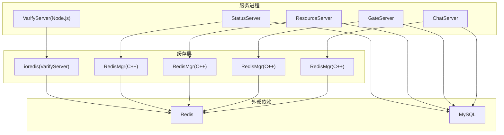
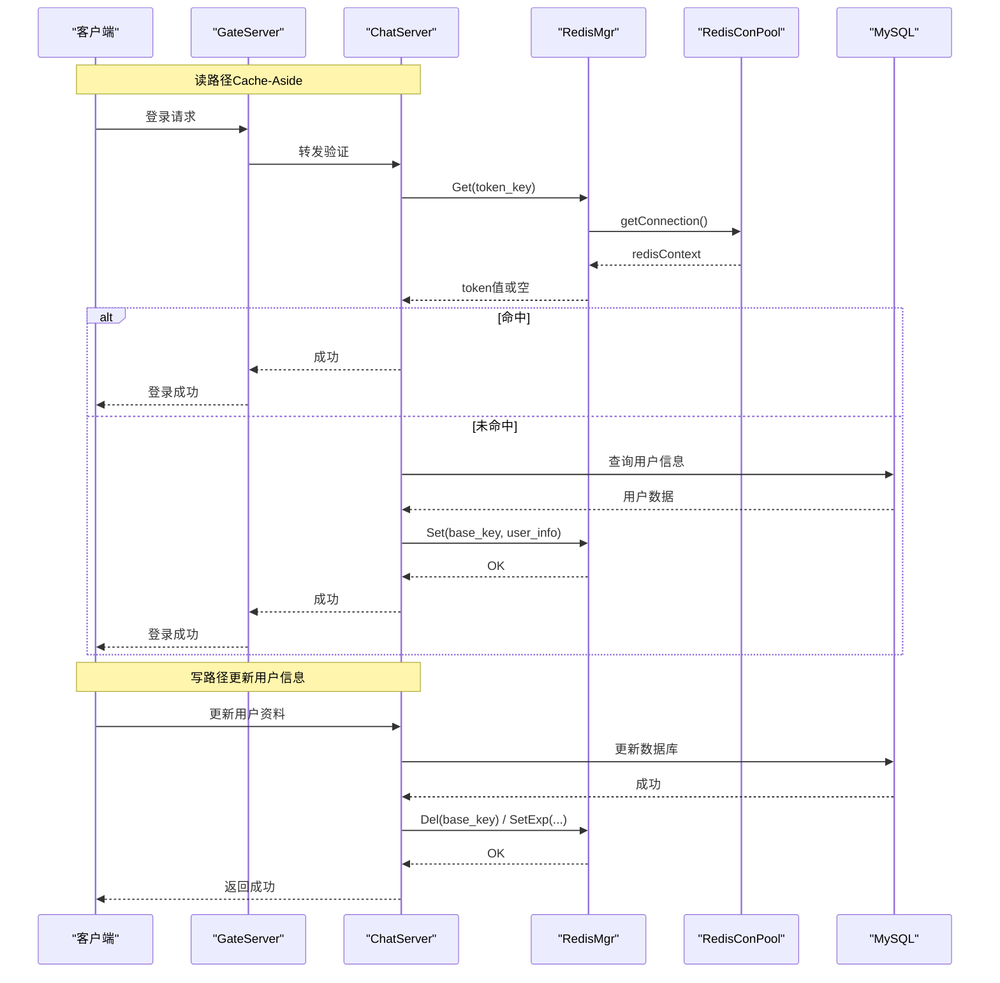
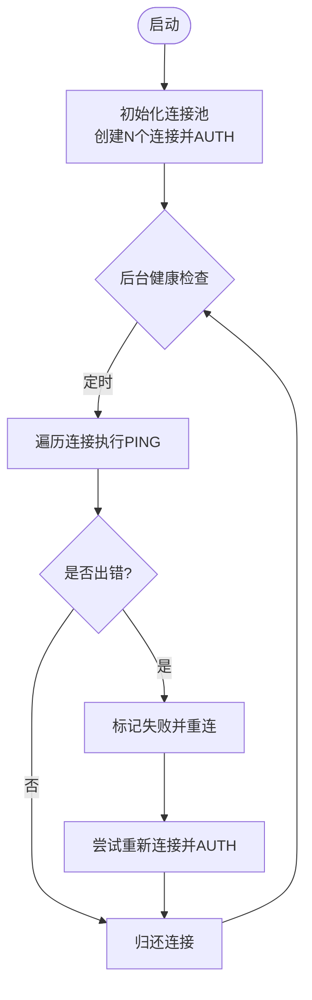
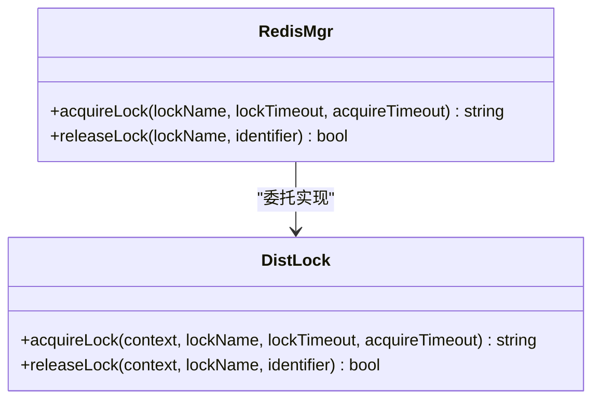
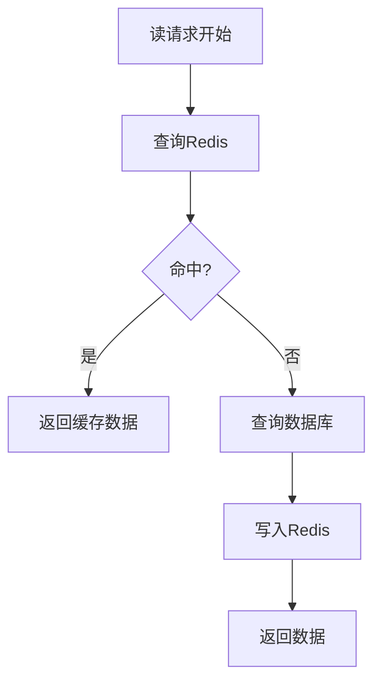
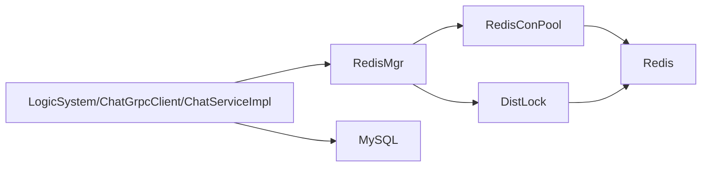

# Redis缓存策略

<cite>
**本文引用的文件**   
- [RedisMgr.h（ChatServer）](file://server/ChatServer/include/RedisMgr.h)
- [RedisMgr.cpp（ChatServer）](file://server/ChatServer/src/RedisMgr.cpp)
- [DistLock.h（ChatServer）](file://server/ChatServer/include/DistLock.h)
- [DistLock.cpp（ChatServer）](file://server/ChatServer/src/DistLock.cpp)
- [RedisMgr.h（GateServer）](file://server/GateServer/include/RedisMgr.h)
- [RedisMgr.h（ResourceServer）](file://server/ResourceServer/include/RedisMgr.h)
- [RedisMgr.h（StatusServer）](file://server/StatusServer/include/RedisMgr.h)
- [chatserver1.ini（ChatServer配置）](file://server/ChatServer/config/chatserver1.ini)
- [config.ini（GateServer配置）](file://server/GateServer/config/config.ini)
- [redis.js（VarifyServer）](file://server/VarifyServer/redis.js)
- [LogicSystem.cpp（ChatServer）](file://server/ChatServer/src/LogicSystem.cpp)
- [ChatGrpcClient.cpp（ChatServer）](file://server/ChatServer/src/ChatGrpcClient.cpp)
- [ChatServiceImpl.cpp（ChatServer）](file://server/ChatServer/src/ChatServiceImpl.cpp)
- [day32分布式锁设计思路.md](file://开发文档/day32分布式锁设计思路.md)
- [day37-聊天信息存储方案.md](file://开发文档/day37-聊天信息存储方案.md)
</cite>

## 目录
1. [引言](#引言)
2. [项目结构](#项目结构)
3. [核心组件](#核心组件)
4. [架构总览](#架构总览)
5. [详细组件分析](#详细组件分析)
6. [依赖分析](#依赖分析)
7. [性能考虑](#性能考虑)
8. [故障排查指南](#故障排查指南)
9. [结论](#结论)
10. [附录](#附录)

## 引言
本文件面向LLFCChat项目的Redis缓存策略，结合现有代码与实现，系统性说明：
- 缓存模式选择与落地方式（Cache-Aside、Read/Write Through、Write Behind）
- 数据一致性保障机制（缓存与数据库同步、版本号控制、分布式锁）
- 缓存穿透防护（布隆过滤器、空值缓存、参数校验）
- 热点数据处理（本地缓存+Redis双层缓存、预加载、动态过期）
- Redis集群配置与优化建议（分片、内存管理、持久化）

## 项目结构
本项目在多个服务中均实现了统一的Redis封装层，包括连接池、基础命令封装、分布式锁等。关键位置如下：
- ChatServer/GateServer/ResourceServer/StatusServer 各自包含 RedisMgr.h，提供一致的接口抽象
- ChatServer 的 RedisMgr.cpp 实现了具体命令调用与分布式锁集成
- VarifyServer 使用 ioredis 提供基础Redis能力
- 配置文件集中定义Redis连接参数（Host/Port/Passwd）

**图表来源** 
- [RedisMgr.h（ChatServer）](file://server/ChatServer/include/RedisMgr.h)
- [RedisMgr.h（GateServer）](file://server/GateServer/include/RedisMgr.h)
- [RedisMgr.h（ResourceServer）](file://server/ResourceServer/include/RedisMgr.h)
- [RedisMgr.h（StatusServer）](file://server/StatusServer/include/RedisMgr.h)
- [redis.js（VarifyServer）](file://server/VarifyServer/redis.js)

**章节来源**
- [chatserver1.ini（ChatServer配置）](file://server/ChatServer/config/chatserver1.ini)
- [config.ini（GateServer配置）](file://server/GateServer/config/config.ini)

## 核心组件
- RedisConPool：连接池，负责初始化、获取/归还连接、健康检查与自动重连
- RedisMgr：统一对外暴露的Redis操作接口（Get/Set/HSet/HGet/LPush/RPush等），并封装分布式锁
- DistLock：基于SET NX EX + Lua脚本的分布式锁实现
- 各服务中的业务逻辑通过RedisMgr访问缓存，配合MysqlMgr访问数据库

关键职责与关系：
- RedisConPool 保证连接复用与存活检测
- RedisMgr 屏蔽底层hiredis细节，提供原子性操作与错误处理
- DistLock 提供跨进程/跨服务的互斥能力

**章节来源**
- [RedisMgr.h（ChatServer）](file://server/ChatServer/include/RedisMgr.h)
- [RedisMgr.cpp（ChatServer）](file://server/ChatServer/src/RedisMgr.cpp)
- [DistLock.h（ChatServer）](file://server/ChatServer/include/DistLock.h)
- [DistLock.cpp（ChatServer）](file://server/ChatServer/src/DistLock.cpp)

## 架构总览
下图展示典型“读路径”和“写路径”在LLFCChat中的流程，体现Cache-Aside模式的落地与分布式锁的使用场景。

**图表来源** 
- [LogicSystem.cpp（ChatServer）](file://server/ChatServer/src/LogicSystem.cpp)
- [ChatGrpcClient.cpp（ChatServer）](file://server/ChatServer/src/ChatGrpcClient.cpp)
- [ChatServiceImpl.cpp（ChatServer）](file://server/ChatServer/src/ChatServiceImpl.cpp)
- [RedisMgr.cpp（ChatServer）](file://server/ChatServer/src/RedisMgr.cpp)

## 详细组件分析

### 连接池与健康检查（RedisConPool）
- 功能要点
  - 初始化时建立固定数量的连接，执行AUTH认证
  - 提供阻塞与非阻塞两种获取连接的方式
  - 后台线程周期性PING检测连接存活，失败计数后触发重连
  - 支持优雅关闭与资源释放
- 复杂度与性能
  - 获取/归还连接为O(1)，并发安全由mutex与condition_variable保证
  - 健康检查线程独立运行，避免阻塞业务线程
- 适用场景
  - 高并发读写Redis的场景，减少连接创建开销
  - 需要快速感知Redis不可用并自动恢复

**图表来源** 
- [RedisMgr.h（ChatServer）](file://server/ChatServer/include/RedisMgr.h)

**章节来源**
- [RedisMgr.h（ChatServer）](file://server/ChatServer/include/RedisMgr.h)

### 分布式锁（DistLock）
- 功能要点
  - 加锁：SET lockKey identifier NX EX lockTimeout
  - 解锁：EVAL Lua脚本判断identifier一致后DEL
  - 支持获取超时时间acquireTimeout，避免无限等待
- 安全性
  - 唯一标识符UUID确保只有持有者能解锁
  - 过期时间防止死锁
- 使用位置
  - 登录计数增减、服务器状态统计等共享资源保护

**图表来源** 
- [DistLock.h（ChatServer）](file://server/ChatServer/include/DistLock.h)
- [DistLock.cpp（ChatServer）](file://server/ChatServer/src/DistLock.cpp)
- [RedisMgr.cpp（ChatServer）](file://server/ChatServer/src/RedisMgr.cpp)

**章节来源**
- [DistLock.cpp（ChatServer）](file://server/ChatServer/src/DistLock.cpp)
- [RedisMgr.cpp（ChatServer）](file://server/ChatServer/src/RedisMgr.cpp)
- [day32分布式锁设计思路.md](file://开发文档/day32分布式锁设计思路.md)

### 缓存模式与一致性策略

#### Cache-Aside（旁路缓存）
- 读路径
  - 先查Redis，命中则直接返回；未命中再查数据库，写入Redis后返回
- 写路径
  - 先更新数据库，再删除或更新缓存（推荐删除，避免脏读）
- 适用场景
  - 读多写少、热点数据频繁访问
- 本项目实践
  - LogicSystem/ChatGrpcClient/ChatServiceImpl中在读取用户信息时从Redis获取，未命中则从DB加载并回写Redis

**图表来源** 
- [LogicSystem.cpp（ChatServer）](file://server/ChatServer/src/LogicSystem.cpp)
- [ChatGrpcClient.cpp（ChatServer）](file://server/ChatServer/src/ChatGrpcClient.cpp)
- [ChatServiceImpl.cpp（ChatServer）](file://server/ChatServer/src/ChatServiceImpl.cpp)

**章节来源**
- [LogicSystem.cpp（ChatServer）](file://server/ChatServer/src/LogicSystem.cpp)
- [ChatGrpcClient.cpp（ChatServer）](file://server/ChatServer/src/ChatGrpcClient.cpp)
- [ChatServiceImpl.cpp（ChatServer）](file://server/ChatServer/src/ChatServiceImpl.cpp)

#### Read/Write Through（透传缓存）
- 特点
  - 应用只与缓存交互，缓存内部负责与数据库同步
- 适用场景
  - 希望简化应用层逻辑，将一致性交给缓存层
- 本项目现状
  - 当前未实现完整的透传层，建议在RedisMgr上层增加一层CacheService，封装DB同步逻辑

#### Write Behind（异步写回）
- 特点
  - 写操作先落缓存，异步批量刷盘到数据库
- 风险
  - 可能丢失数据，需配合持久化与重试机制
- 本项目现状
  - 未实现，可在消息队列或异步任务中扩展

### 数据一致性保障
- 缓存与数据库同步
  - 采用Cache-Aside，写库后删除缓存键，读时重建
- 版本号控制
  - 可为热点对象附加version字段，更新时递增，读时校验版本
- 分布式锁
  - 对关键临界区（如登录计数、状态统计）使用DistLock保证原子性

**章节来源**
- [RedisMgr.cpp（ChatServer）](file://server/ChatServer/src/RedisMgr.cpp)
- [DistLock.cpp（ChatServer）](file://server/ChatServer/src/DistLock.cpp)

### 缓存穿透防护
- 布隆过滤器
  - 用于快速判断key是否存在，减少无效查询
  - 本项目未实现，可引入RedisBloom模块
- 空值缓存
  - 对查询结果为空的key设置短TTL，避免重复落库
- 参数校验
  - 在应用层对uid/token等进行合法性校验，提前拦截非法请求

**章节来源**
- [redis.js（VarifyServer）](file://server/VarifyServer/redis.js)

### 热点数据处理
- 本地缓存+Redis双层缓存
  - 进程内LRU缓存作为L1，Redis作为L2
- 热点数据预加载
  - 服务启动或预热阶段主动加载高频数据
- 动态过期时间
  - 根据访问频率调整TTL，热点延长、冷门缩短

**章节来源**
- [RedisMgr.h（ResourceServer）](file://server/ResourceServer/include/RedisMgr.h)

## 依赖分析
- 组件耦合
  - RedisMgr依赖RedisConPool进行连接管理
  - RedisMgr依赖DistLock实现分布式锁
  - 业务逻辑（LogicSystem/ChatGrpcClient/ChatServiceImpl）依赖RedisMgr
- 外部依赖
  - hiredis（C++客户端）
  - ioredis（Node.js客户端）
  - MySQL（持久化存储）

**图表来源** 
- [RedisMgr.h（ChatServer）](file://server/ChatServer/include/RedisMgr.h)
- [RedisMgr.cpp（ChatServer）](file://server/ChatServer/src/RedisMgr.cpp)
- [DistLock.cpp（ChatServer）](file://server/ChatServer/src/DistLock.cpp)

**章节来源**
- [RedisMgr.h（ChatServer）](file://server/ChatServer/include/RedisMgr.h)
- [RedisMgr.cpp（ChatServer）](file://server/ChatServer/src/RedisMgr.cpp)

## 性能考虑
- 连接池大小
  - 根据QPS与RT估算，避免过多连接导致上下文切换开销
- 命令合并
  - 使用pipeline批量操作，减少网络往返
- 序列化优化
  - 合理选择JSON/Binary格式，控制payload大小
- 热点键倾斜
  - 对超大Hash/List进行分片，避免单键过大

[本节为通用指导，不直接分析具体文件]

## 故障排查指南
- 连接问题
  - 检查RedisConPool的健康检查日志与重连逻辑
  - 确认配置文件中Host/Port/Passwd正确
- 锁竞争
  - 观察DistLock的获取超时与Lua解锁结果
  - 检查identifier是否正确传递
- 缓存不一致
  - 核对写库后是否删除缓存键
  - 检查TTL设置是否合理

**章节来源**
- [RedisMgr.cpp（ChatServer）](file://server/ChatServer/src/RedisMgr.cpp)
- [DistLock.cpp（ChatServer）](file://server/ChatServer/src/DistLock.cpp)
- [chatserver1.ini（ChatServer配置）](file://server/ChatServer/config/chatserver1.ini)
- [config.ini（GateServer配置）](file://server/GateServer/config/config.ini)

## 结论
LLFCChat已具备稳定的Redis接入层与分布式锁能力，适合以Cache-Aside为主的一致性模型。后续可逐步引入布隆过滤器、空值缓存、双层缓存与动态TTL等高级特性，进一步提升系统性能与鲁棒性。

[本节为总结，不直接分析具体文件]

## 附录

### 缓存模式对比与建议
- Cache-Aside：简单可靠，适合大多数场景
- Read/Write Through：简化应用逻辑，但需缓存层强一致
- Write Behind：高吞吐但存在丢数据风险，需谨慎使用

### Redis集群配置与优化建议
- 分片策略
  - 按业务域划分数据库，或使用哈希槽分片
- 内存管理
  - 设置maxmemory与淘汰策略（allkeys-lru等）
- 持久化
  - 启用AOF与RDB，平衡数据安全与性能
- 监控
  - 关注命中率、延迟、内存使用率、慢查询

[本节为通用指导，不直接分析具体文件]