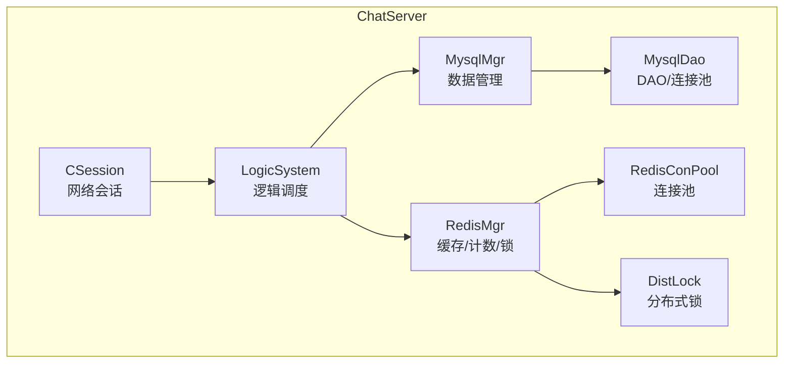
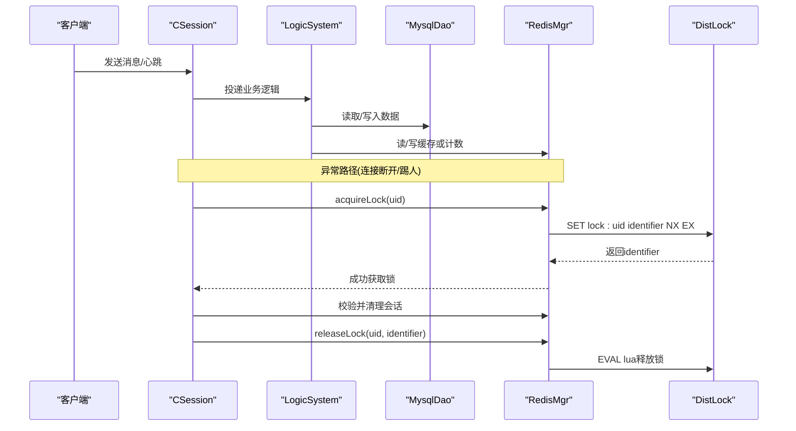
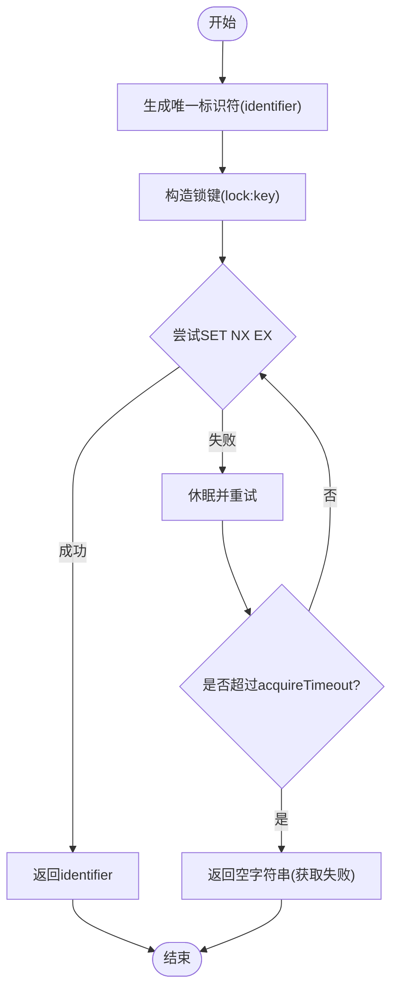
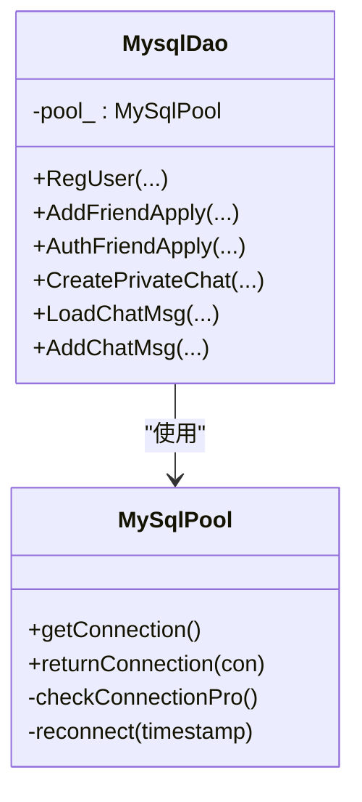
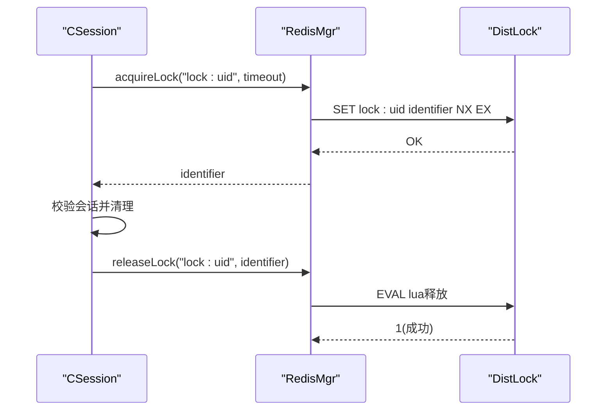
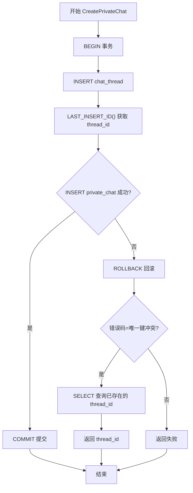
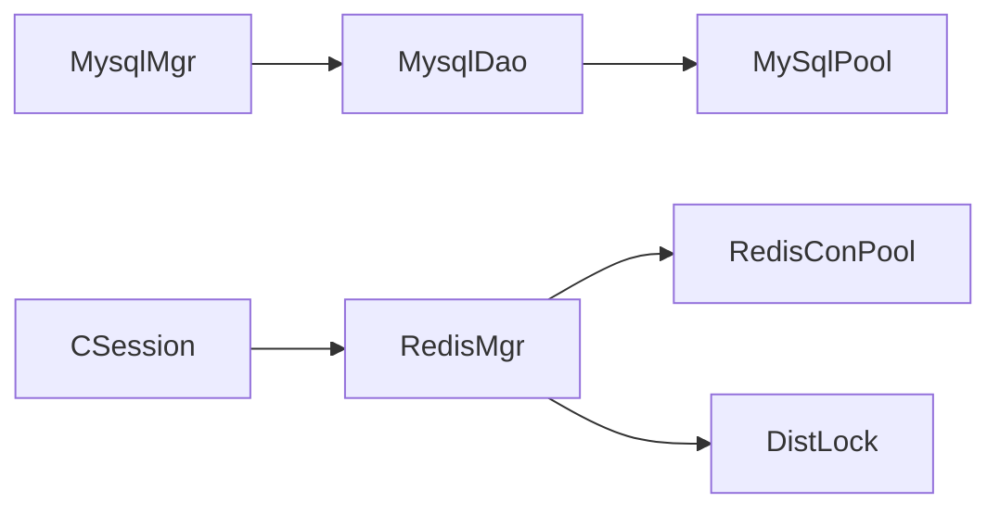

# 事务与锁优化

<cite>
**本文引用的文件**   
- [MysqlMgr.h](file://server/ChatServer/include/MysqlMgr.h)
- [MysqlMgr.cpp](file://server/ChatServer/src/MysqlMgr.cpp)
- [MysqlDao.h](file://server/ChatServer/include/MysqlDao.h)
- [RedisMgr.h](file://server/ChatServer/include/RedisMgr.h)
- [RedisMgr.cpp](file://server/ChatServer/src/RedisMgr.cpp)
- [DistLock.h](file://server/ChatServer/include/DistLock.h)
- [DistLock.cpp](file://server/ChatServer/src/DistLock.cpp)
- [CSession.cpp](file://server/ChatServer/src/CSession.cpp)
- [day41-分布式死锁解决方案.md](file://开发文档/day41-分布式死锁解决方案.md)
- [day32分布式锁设计思路.md](file://开发文档/day32分布式锁设计思路.md)
</cite>

## 目录
1. [引言](#引言)
2. [项目结构](#项目结构)
3. [核心组件](#核心组件)
4. [架构总览](#架构总览)
5. [详细组件分析](#详细组件分析)
6. [依赖关系分析](#依赖关系分析)
7. [性能考量](#性能考量)
8. [故障排查指南](#故障排查指南)
9. [结论](#结论)
10. [附录](#附录)

## 引言
本文件面向LLFCChat项目的并发与一致性优化，聚焦以下主题：
- 数据库事务隔离级别选择（READ COMMITTED、REPEATABLE READ、SERIALIZABLE）的适用场景与性能影响
- 行级锁优化策略（锁粒度控制、等待优化、死锁预防与检测）
- 分布式锁实现（Redis分布式锁、数据库乐观锁、版本控制等并发控制方案）
- 事务边界设计（短事务原则、批量操作优化、异步事务处理）
- 并发场景下的锁优化案例（读写分离、锁升级降级、无锁数据结构）

## 项目结构
本项目在服务端包含多个子系统，其中与事务和锁相关的核心代码集中在 ChatServer 模块：
- MysqlMgr/MysqlDao：封装MySQL连接池、DAO层接口，承载数据访问与事务边界
- RedisMgr/RedisConPool：封装Redis连接池与常用命令，提供分布式锁能力
- DistLock：基于Redis的分布式锁实现（SET NX EX + Lua释放）
- CSession：网络会话层，在异常路径中使用分布式锁保护用户会话清理

图表来源 
- [MysqlMgr.h:1-41](file://server/ChatServer/include/MysqlMgr.h#L1-L41)
- [MysqlDao.h:236-270](file://server/ChatServer/include/MysqlDao.h#L236-L270)
- [RedisMgr.h:267-305](file://server/ChatServer/include/RedisMgr.h#L267-L305)
- [DistLock.h:1-18](file://server/ChatServer/include/DistLock.h#L1-L18)
- [CSession.cpp:102-143](file://server/ChatServer/src/CSession.cpp#L102-L143)

章节来源
- [MysqlMgr.h:1-41](file://server/ChatServer/include/MysqlMgr.h#L1-L41)
- [MysqlDao.h:236-270](file://server/ChatServer/include/MysqlDao.h#L236-L270)
- [RedisMgr.h:267-305](file://server/ChatServer/include/RedisMgr.h#L267-L305)
- [DistLock.h:1-18](file://server/ChatServer/include/DistLock.h#L1-L18)
- [CSession.cpp:102-143](file://server/ChatServer/src/CSession.cpp#L102-L143)

## 核心组件
- MysqlMgr：对外暴露用户注册、好友申请、聊天消息等数据操作接口，内部委托给MysqlDao执行。
- MysqlDao：封装MySQL连接池、健康检查与重连，提供具体SQL执行方法；当前实现中未显式开启事务，但存在需要事务语义的业务点（如私聊创建）。
- RedisMgr：封装Redis连接池与常用命令，并提供acquireLock/releaseLock以调用DistLock实现分布式锁。
- DistLock：基于Redis的分布式锁实现，使用SET NX EX加锁、Lua脚本原子释放。
- CSession：在网络IO异常路径中，通过分布式锁保护用户会话清理，避免多进程/多线程竞态。

章节来源
- [MysqlMgr.cpp:1-95](file://server/ChatServer/src/MysqlMgr.cpp#L1-L95)
- [MysqlDao.h:236-270](file://server/ChatServer/include/MysqlDao.h#L236-L270)
- [RedisMgr.cpp:1-462](file://server/ChatServer/src/RedisMgr.cpp#L1-L462)
- [DistLock.cpp:1-73](file://server/ChatServer/src/DistLock.cpp#L1-L73)
- [CSession.cpp:102-143](file://server/ChatServer/src/CSession.cpp#L102-L143)

## 架构总览
下图展示了从网络请求到数据持久化的关键路径，以及分布式锁在异常路径中的介入点。

图表来源 
- [CSession.cpp:102-143](file://server/ChatServer/src/CSession.cpp#L102-L143)
- [RedisMgr.cpp:362-393](file://server/ChatServer/src/RedisMgr.cpp#L362-L393)
- [DistLock.cpp:27-73](file://server/ChatServer/src/DistLock.cpp#L27-L73)

## 详细组件分析

### 分布式锁（Redis）
- 加锁：使用SET key identifier NX EX timeout，保证原子性且具备过期时间，防止死锁。
- 解锁：通过EVAL执行Lua脚本，仅当值等于identifier时才删除key，确保“只有持有者能释放”。
- 重试与超时：acquireTimeout限制最大等待时间，sleep_for避免忙等。
- 连接池：RedisConPool负责连接复用与健康检查（PING），失败自动重连。

图表来源 
- [DistLock.cpp:27-49](file://server/ChatServer/src/DistLock.cpp#L27-L49)
- [RedisMgr.cpp:362-375](file://server/ChatServer/src/RedisMgr.cpp#L362-L375)

章节来源
- [DistLock.h:1-18](file://server/ChatServer/include/DistLock.h#L1-L18)
- [DistLock.cpp:1-73](file://server/ChatServer/src/DistLock.cpp#L1-L73)
- [RedisMgr.cpp:362-393](file://server/ChatServer/src/RedisMgr.cpp#L362-L393)
- [RedisMgr.h:267-305](file://server/ChatServer/include/RedisMgr.h#L267-L305)

### MySQL连接池与DAO
- 连接池：MySqlPool维护连接队列，后台线程定期执行SELECT 1健康检查，失败则重建连接。
- DAO接口：提供用户、好友、聊天消息等数据访问方法；当前实现未显式开启事务，但在私聊创建等场景需引入事务以保证一致性。
- 资源管理：getConnection/returnConnection配合RAII风格释放，避免泄漏。

图表来源 
- [MysqlDao.h:25-232](file://server/ChatServer/include/MysqlDao.h#L25-L232)
- [MysqlDao.h:236-270](file://server/ChatServer/include/MysqlDao.h#L236-L270)

章节来源
- [MysqlDao.h:25-232](file://server/ChatServer/include/MysqlDao.h#L25-L232)
- [MysqlDao.h:236-270](file://server/ChatServer/include/MysqlDao.h#L236-L270)

### 会话异常路径与分布式锁
- 在CSession的网络读取异常分支中，先对uid加分布式锁，再查询并清理会话，最后释放锁，避免多实例并发清理导致的数据不一致。

图表来源 
- [CSession.cpp:102-143](file://server/ChatServer/src/CSession.cpp#L102-L143)
- [RedisMgr.cpp:362-393](file://server/ChatServer/src/RedisMgr.cpp#L362-L393)
- [DistLock.cpp:52-73](file://server/ChatServer/src/DistLock.cpp#L52-L73)

章节来源
- [CSession.cpp:102-143](file://server/ChatServer/src/CSession.cpp#L102-L143)
- [RedisMgr.cpp:362-393](file://server/ChatServer/src/RedisMgr.cpp#L362-L393)
- [DistLock.cpp:52-73](file://server/ChatServer/src/DistLock.cpp#L52-L73)

### 事务与行级锁优化（私聊创建死锁分析与改进）
- 问题背景：在高并发下，SELECT ... FOR UPDATE未命中记录时产生间隙锁，随后INSERT需要插入意向锁，两者冲突形成死锁。
- 根因：InnoDB在RR隔离级别下使用临键锁（记录锁+间隙锁），间隙锁与插入意向锁互斥，导致循环等待。
- 改进方案：采用“先INSERT后SELECT”的乐观策略，结合唯一索引约束，失败时回退查询已存在记录。

图表来源 
- [day41-分布式死锁解决方案.md:610-690](file://开发文档/day41-分布式死锁解决方案.md#L610-L690)

章节来源
- [day41-分布式死锁解决方案.md:1-800](file://开发文档/day41-分布式死锁解决方案.md#L1-L800)

## 依赖关系分析
- MysqlMgr依赖MysqlDao进行数据访问；MysqlDao依赖MySqlPool管理连接。
- RedisMgr依赖RedisConPool管理连接，并通过DistLock实现分布式锁。
- CSession在异常路径依赖RedisMgr/DistLock保护会话清理。

图表来源 
- [MysqlMgr.h:1-41](file://server/ChatServer/include/MysqlMgr.h#L1-L41)
- [MysqlDao.h:236-270](file://server/ChatServer/include/MysqlDao.h#L236-L270)
- [RedisMgr.h:267-305](file://server/ChatServer/include/RedisMgr.h#L267-L305)
- [DistLock.h:1-18](file://server/ChatServer/include/DistLock.h#L1-L18)
- [CSession.cpp:102-143](file://server/ChatServer/src/CSession.cpp#L102-L143)

章节来源
- [MysqlMgr.h:1-41](file://server/ChatServer/include/MysqlMgr.h#L1-L41)
- [MysqlDao.h:236-270](file://server/ChatServer/include/MysqlDao.h#L236-L270)
- [RedisMgr.h:267-305](file://server/ChatServer/include/RedisMgr.h#L267-L305)
- [DistLock.h:1-18](file://server/ChatServer/include/DistLock.h#L1-L18)
- [CSession.cpp:102-143](file://server/ChatServer/src/CSession.cpp#L102-L143)

## 性能考量
- 事务隔离级别选择
  - READ COMMITTED：适合高并发读多写少场景，减少间隙锁带来的阻塞，但可能出现不可重复读。
  - REPEATABLE READ：默认隔离级别，避免不可重复读与幻读（InnoDB通过MVCC与间隙锁），但可能引发间隙锁冲突与死锁风险。
  - SERIALIZABLE：串行化最高一致性，性能最低，仅在强一致要求时使用。
- 行级锁优化
  - 缩小锁范围：尽量使用精确主键/唯一索引条件，避免全表扫描导致的间隙锁扩大。
  - 缩短持锁时间：将非必要的计算移出事务，减少锁持有时长。
  - 避免反向顺序加锁：在多表更新时统一加锁顺序，降低死锁概率。
- 分布式锁优化
  - 合理设置过期时间与获取超时，避免长时间占用与无限等待。
  - 使用Lua脚本保证释放原子性，防止误释放。
  - 连接池健康检查与自动重连，提升可用性。
- 连接池与I/O
  - MySQL/Redis连接池大小与超时参数需根据负载调优。
  - 后台健康检查间隔与重连策略平衡CPU与稳定性。

[本节为通用指导，不直接分析具体文件]

## 故障排查指南
- 死锁定位
  - 关注SELECT ... FOR UPDATE未命中引发的间隙锁与后续INSERT的插入意向锁冲突。
  - 参考私聊创建流程的死锁分析与改进方案，优先采用“先INSERT后SELECT”的乐观策略。
- 分布式锁问题
  - 确认加锁键命名规范与过期时间设置。
  - 检查Lua释放脚本返回值是否为1，确保只有持有者释放。
  - 观察Redis连接池健康状态与重连日志。
- 数据库连接问题
  - 监控MySqlPool健康检查失败次数与重连情况。
  - 检查SQL语句与索引使用情况，避免长事务与大结果集。

章节来源
- [day41-分布式死锁解决方案.md:1-800](file://开发文档/day41-分布式死锁解决方案.md#L1-L800)
- [RedisMgr.cpp:362-393](file://server/ChatServer/src/RedisMgr.cpp#L362-L393)
- [MysqlDao.h:25-232](file://server/ChatServer/include/MysqlDao.h#L25-L232)

## 结论
- 在LLFCChat中，分布式锁通过Redis实现，具备原子性与过期保护，适用于跨进程/实例的临界区保护。
- MySQL事务与行级锁需谨慎设计，避免间隙锁与插入意向锁冲突导致的死锁；推荐“先INSERT后SELECT”的乐观策略。
- 连接池与缓存层的健康检查与自动重连提升了系统鲁棒性，但仍需根据负载调优参数。
- 建议进一步在DAO层引入显式事务边界，遵循短事务原则，并结合批量操作与异步处理优化吞吐。

[本节为总结，不直接分析具体文件]

## 附录
- 分布式锁设计思路参考：[day32分布式锁设计思路.md:1-543](file://开发文档/day32分布式锁设计思路.md#L1-L543)
- 私聊功能死锁分析与改进：[day41-分布式死锁解决方案.md:1-800](file://开发文档/day41-分布式死锁解决方案.md#L1-L800)

章节来源
- [day32分布式锁设计思路.md:1-543](file://开发文档/day32分布式锁设计思路.md#L1-L543)
- [day41-分布式死锁解决方案.md:1-800](file://开发文档/day41-分布式死锁解决方案.md#L1-L800)