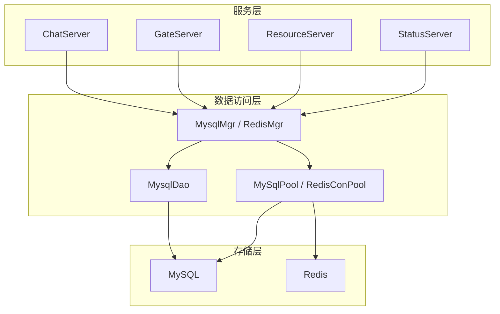
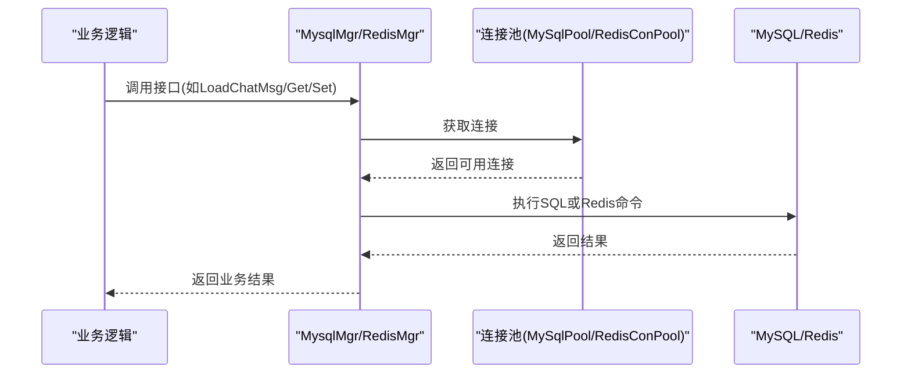
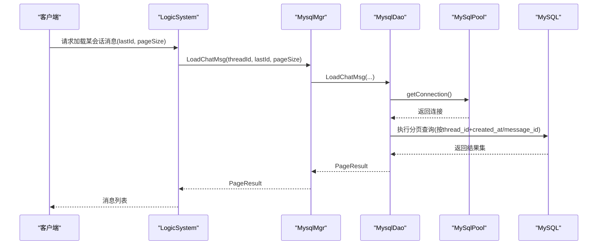
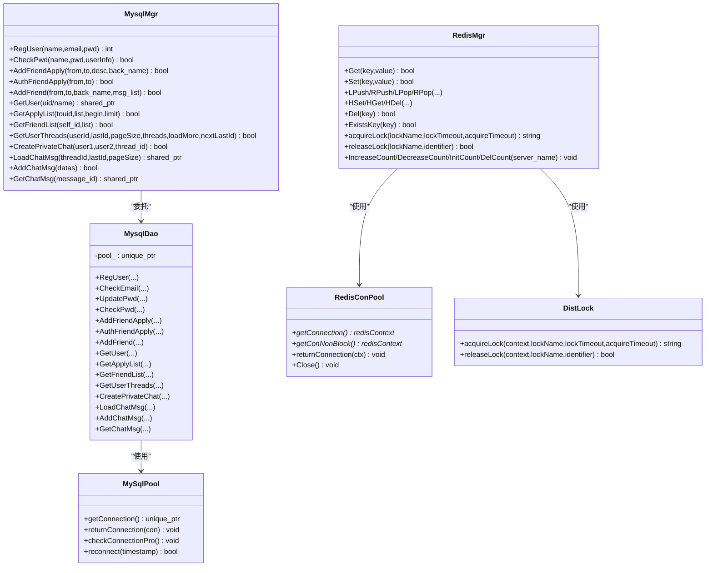

# 数据库优化

<cite>
**本文引用的文件**   
- [llfc.sql](file://sql备份/llfc.sql)
- [MysqlMgr.h](file://server/ChatServer/include/MysqlMgr.h)
- [MysqlMgr.cpp](file://server/ChatServer/src/MysqlMgr.cpp)
- [MysqlDao.h](file://server/ChatServer/include/MysqlDao.h)
- [RedisMgr.h](file://server/ChatServer/include/RedisMgr.h)
- [RedisMgr.cpp](file://server/ChatServer/src/RedisMgr.cpp)
- [DistLock.h](file://server/ChatServer/include/DistLock.h)
- [DistLock.cpp](file://server/ChatServer/src/DistLock.cpp)
- [chatserver1.ini](file://server/ChatServer/config/chatserver1.ini)
</cite>

## 目录
1. [简介](#简介)
2. [项目结构](#项目结构)
3. [核心组件](#核心组件)
4. [架构总览](#架构总览)
5. [详细组件分析](#详细组件分析)
6. [依赖关系分析](#依赖关系分析)
7. [性能考量](#性能考量)
8. [故障排查指南](#故障排查指南)
9. [结论](#结论)
10. [附录](#附录)

## 简介
本文件面向LLFCChat项目的数据库与缓存优化，聚焦以下方面：
- MySQL查询优化：索引设计原则、慢查询分析、执行计划解读、SQL语句优化
- Redis缓存策略：缓存模式选择、数据一致性保证、缓存穿透防护、热点数据处理
- 数据库连接池配置：连接数管理、超时设置、故障转移、连接泄漏检测
- 事务优化与锁机制：事务隔离级别、死锁预防、行级锁优化等并发控制策略
- 监控与容量规划：数据库性能监控工具使用方法和容量规划建议

## 项目结构
本项目在服务器端包含多个服务（ChatServer、GateServer、ResourceServer、StatusServer、VarifyServer），其中ChatServer承担聊天消息、用户、好友、会话等核心业务，并通过MysqlMgr/MysqlDao访问MySQL，通过RedisMgr/RedisConPool访问Redis。数据库结构与表定义位于sql备份中。

图表来源
- [MysqlMgr.h:1-41](file://server/ChatServer/include/MysqlMgr.h#L1-L41)
- [MysqlDao.h:236-270](file://server/ChatServer/include/MysqlDao.h#L236-L270)
- [RedisMgr.h:267-305](file://server/ChatServer/include/RedisMgr.h#L267-L305)

章节来源
- [MysqlMgr.h:1-41](file://server/ChatServer/include/MysqlMgr.h#L1-L41)
- [MysqlDao.h:236-270](file://server/ChatServer/include/MysqlDao.h#L236-L270)
- [RedisMgr.h:267-305](file://server/ChatServer/include/RedisMgr.h#L267-L305)

## 核心组件
- MysqlMgr：对外暴露注册、登录、好友、会话、消息等接口，内部委托MysqlDao完成具体SQL操作。
- MysqlDao：封装MySQL连接池、健康检查、重连、以及所有DAO方法。
- RedisMgr：封装Redis连接池、常用命令、分布式锁、计数统计等。
- DistLock：基于Redis的分布式锁实现（SET NX EX + Lua释放）。
- MySqlPool/RedisConPool：连接池与连接保活、失败重试、自动重连。

章节来源
- [MysqlMgr.h:1-41](file://server/ChatServer/include/MysqlMgr.h#L1-L41)
- [MysqlMgr.cpp:1-95](file://server/ChatServer/src/MysqlMgr.cpp#L1-L95)
- [MysqlDao.h:236-270](file://server/ChatServer/include/MysqlDao.h#L236-L270)
- [RedisMgr.h:267-305](file://server/ChatServer/include/RedisMgr.h#L267-L305)
- [RedisMgr.cpp:1-462](file://server/ChatServer/src/RedisMgr.cpp#L1-L462)
- [DistLock.h:1-18](file://server/ChatServer/include/DistLock.h#L1-L18)
- [DistLock.cpp:1-73](file://server/ChatServer/src/DistLock.cpp#L1-L73)

## 架构总览
下图展示从请求到存储的关键路径：应用层调用MysqlMgr/RedisMgr，后者通过连接池访问MySQL/Redis；分布式锁用于跨进程/节点协调。

图表来源
- [MysqlMgr.h:1-41](file://server/ChatServer/include/MysqlMgr.h#L1-L41)
- [MysqlDao.h:236-270](file://server/ChatServer/include/MysqlDao.h#L236-L270)
- [RedisMgr.h:267-305](file://server/ChatServer/include/RedisMgr.h#L267-L305)

## 详细组件分析

### MySQL表结构与索引优化
- chat_message：消息主表，含thread_id、sender_id、recv_id、content、created_at、status、msg_type等字段，已建立按thread_id+created_at和thread_id+message_id的复合索引，利于分页拉取与时间序排序。
- chat_thread：会话主题表，记录会话类型与创建时间。
- private_chat/group_chat/group_chat_member：私聊/群聊与会成员信息，提供唯一约束与索引以支撑快速查找。
- friend/friend_apply：好友关系与申请，使用唯一索引避免重复申请与冲突。
- user：用户基础信息，uid/email为唯一键，name有普通索引。

优化建议
- 对高频查询列建立覆盖索引，减少回表。例如按thread_id+created_at分页时，尽量只选取必要字段或使用覆盖索引。
- 大文本content建议外置存储（对象存储/文件服务），数据库仅存URL，降低页大小与IO压力。
- 对status/msg_type等枚举字段若参与过滤，可考虑联合索引提升条件筛选效率。
- 定期收集统计信息与重建索引，避免统计信息陈旧导致执行计划劣化。

章节来源
- [llfc.sql:24-37](file://sql备份/llfc.sql#L24-L37)
- [llfc.sql:149-155](file://sql备份/llfc.sql#L149-L155)
- [llfc.sql:364-391](file://sql备份/llfc.sql#L364-L391)
- [llfc.sql:408-418](file://sql备份/llfc.sql#L408-L418)
- [llfc.sql:179-187](file://sql备份/llfc.sql#L179-L187)
- [llfc.sql:295-304](file://sql备份/llfc.sql#L295-L304)
- [llfc.sql:467-481](file://sql备份/llfc.sql#L467-L481)

### 连接池与连接保活
- MySqlPool：初始化固定数量连接，后台线程周期性“SELECT 1”探测健康度，失败则尝试重连；支持阻塞获取与非阻塞获取，异常时更新最后操作时间戳并触发重连。
- RedisConPool：初始化hiredis连接并AUTH，后台线程PING保活，失败计数驱动重连；提供非阻塞获取以避免阻塞等待。

运维要点
- 合理设置poolSize，结合QPS与平均响应时间估算：poolSize ≈ QPS × RT/1000 + 安全系数。
- 超时与心跳阈值需与网络环境匹配，避免误判断链。
- 连接泄漏检测：确保每次获取连接后在finally/RAII中归还；可在池内增加未归还告警。
- 故障转移：当主库不可用时，切换至只读副本或降级策略（限流/熔断）。

章节来源
- [MysqlDao.h:25-60](file://server/ChatServer/include/MysqlDao.h#L25-L60)
- [MysqlDao.h:62-145](file://server/ChatServer/include/MysqlDao.h#L62-L145)
- [MysqlDao.h:148-182](file://server/ChatServer/include/MysqlDao.h#L148-L182)
- [RedisMgr.h:9-48](file://server/ChatServer/include/RedisMgr.h#L9-L48)
- [RedisMgr.h:112-206](file://server/ChatServer/include/RedisMgr.h#L112-L206)

### Redis缓存策略与分布式锁
- 基本操作：GET/SET/LPUSH/LPOP/RPUSH/RPOP/HSET/HGET/HDEL/DEL/EXISTS等。
- 分布式锁：acquireLock使用SET key value NX EX lockTimeout，releaseLock使用Lua脚本原子判断并删除，避免误删他人锁。
- 计数统计：通过HINCRBY/HGET/HSET维护各服务在线人数，配合分布式锁保证一致性。

一致性保障
- 读写分离场景下，采用“先写DB再删缓存”或“延迟双删”，并结合版本号/过期时间保证最终一致。
- 热点Key保护：本地缓存+短TTL+随机抖动，避免雪崩；使用互斥锁或信号量限制回源频率。
- 穿透防护：布隆过滤器或空值缓存（带短TTL）拦截不存在Key。

章节来源
- [RedisMgr.cpp:19-46](file://server/ChatServer/src/RedisMgr.cpp#L19-L46)
- [RedisMgr.cpp:48-79](file://server/ChatServer/src/RedisMgr.cpp#L48-L79)
- [RedisMgr.cpp:81-107](file://server/ChatServer/src/RedisMgr.cpp#L81-L107)
- [RedisMgr.cpp:109-133](file://server/ChatServer/src/RedisMgr.cpp#L109-L133)
- [RedisMgr.cpp:135-160](file://server/ChatServer/src/RedisMgr.cpp#L135-L160)
- [RedisMgr.cpp:161-184](file://server/ChatServer/src/RedisMgr.cpp#L161-L184)
- [RedisMgr.cpp:186-209](file://server/ChatServer/src/RedisMgr.cpp#L186-L209)
- [RedisMgr.cpp:211-245](file://server/ChatServer/src/RedisMgr.cpp#L211-L245)
- [RedisMgr.cpp:247-281](file://server/ChatServer/src/RedisMgr.cpp#L247-L281)
- [RedisMgr.cpp:283-307](file://server/ChatServer/src/RedisMgr.cpp#L283-L307)
- [RedisMgr.cpp:309-333](file://server/ChatServer/src/RedisMgr.cpp#L309-L333)
- [RedisMgr.cpp:335-359](file://server/ChatServer/src/RedisMgr.cpp#L335-L359)
- [RedisMgr.cpp:395-462](file://server/ChatServer/src/RedisMgr.cpp#L395-L462)
- [DistLock.cpp:27-49](file://server/ChatServer/src/DistLock.cpp#L27-L49)
- [DistLock.cpp:52-73](file://server/ChatServer/src/DistLock.cpp#L52-L73)

### 事务与并发控制
- 注册流程：使用存储过程reg_user/reg_user_procedure进行用户名/邮箱存在性校验、自增ID分配与插入，异常时回滚。
- 并发写入：消息批量插入建议使用事务与批处理，减少往返与锁竞争。
- 行级锁优化：避免长事务与大范围扫描；优先使用主键/唯一索引定位行；必要时使用FOR UPDATE谨慎加锁。

章节来源
- [llfc.sql:662-708](file://sql备份/llfc.sql#L662-L708)
- [llfc.sql:713-752](file://sql备份/llfc.sql#L713-L752)

### 关键业务流程时序（以加载聊天消息为例）

图表来源
- [MysqlMgr.h:32-35](file://server/ChatServer/include/MysqlMgr.h#L32-L35)
- [MysqlDao.h:261-264](file://server/ChatServer/include/MysqlDao.h#L261-L264)
- [MysqlDao.h:184-206](file://server/ChatServer/include/MysqlDao.h#L184-L206)

## 依赖关系分析
- MysqlMgr依赖MysqlDao，MysqlDao依赖MySqlPool与MySQL驱动。
- RedisMgr依赖RedisConPool与hiredis，同时依赖DistLock实现分布式锁。
- 配置由INI文件注入（Host/Port/User/Passwd/Schema等）。

图表来源
- [MysqlMgr.h:1-41](file://server/ChatServer/include/MysqlMgr.h#L1-L41)
- [MysqlDao.h:236-270](file://server/ChatServer/include/MysqlDao.h#L236-L270)
- [RedisMgr.h:267-305](file://server/ChatServer/include/RedisMgr.h#L267-L305)
- [DistLock.h:1-18](file://server/ChatServer/include/DistLock.h#L1-L18)

章节来源
- [chatserver1.ini:14-23](file://server/ChatServer/config/chatserver1.ini#L14-L23)

## 性能考量
- SQL优化
  - 使用EXPLAIN/EXPLAIN ANALYZE分析执行计划，关注type、key、rows、Extra中的Using filesort/Using temporary。
  - 避免SELECT *，仅取必要字段；利用覆盖索引减少回表。
  - 分页优化：基于游标（lastId）替代OFFSET，提高大偏移性能。
  - 批量写入：合并INSERT以减少网络与锁开销。
- 索引设计
  - 遵循最左前缀原则；复合索引顺序按区分度与查询选择性排序。
  - 避免过度索引导致写放大；定期评估无用索引。
- Redis优化
  - 热点Key：本地缓存+短TTL+随机抖动；使用互斥锁限流回源。
  - 缓存穿透：布隆过滤器或空值缓存。
  - 缓存雪崩：TTL加随机抖动，避免集中过期。
  - 数据结构选型：Hash/Sorted Set/List根据场景选择，减少序列化/反序列化成本。
- 连接池与超时
  - 根据压测调整poolSize、连接超时、查询超时、空闲回收时间。
  - 监控连接池耗尽与频繁重连，及时扩容或限流。
- 事务与锁
  - 缩短事务生命周期，避免长事务持有行锁。
  - 统一加锁顺序，避免死锁；必要时引入超时与重试退避。

[本节为通用指导，不直接分析具体文件]

## 故障排查指南
- 慢查询定位
  - 开启慢查询日志，结合EXPLAIN分析；关注全表扫描、临时表、文件排序。
- 连接问题
  - 观察连接池健康检查日志与重连次数；检查网络与认证配置。
- 缓存异常
  - 核对SET/NX/EX参数与Lua脚本返回值；确认分布式锁标识是否一致。
- 死锁与竞态
  - 统一锁顺序（分布式锁→线程锁）；使用带超时的tryLock与退避重试。
- 配置核查
  - 核对INI中MySQL/Redis地址、端口、密码、Schema等是否正确。

章节来源
- [RedisMgr.cpp:19-46](file://server/ChatServer/src/RedisMgr.cpp#L19-L46)
- [RedisMgr.cpp:395-462](file://server/ChatServer/src/RedisMgr.cpp#L395-L462)
- [DistLock.cpp:27-49](file://server/ChatServer/src/DistLock.cpp#L27-L49)
- [chatserver1.ini:14-23](file://server/ChatServer/config/chatserver1.ini#L14-L23)

## 结论
通过对表结构与索引的梳理、连接池与健康检查的实现、Redis缓存与分布式锁的完善，LLFCChat在数据访问层具备了较好的可扩展性与稳定性。后续应持续通过执行计划分析与压测调优，完善监控告警与容量规划，进一步提升系统在高并发场景下的性能与可靠性。

[本节为总结性内容，不直接分析具体文件]

## 附录

### 监控与容量规划建议
- 监控指标
  - MySQL：QPS/TPS、慢查询数、锁等待、缓冲池命中率、连接数、复制延迟。
  - Redis：命中率、内存使用率、持久化耗时、连接数、命令延迟分布。
- 容量规划
  - 依据峰值QPS与平均RT估算连接池大小；按数据增长趋势规划磁盘与分库分表策略。
  - 冷热数据分离：历史消息归档至冷存储，热数据保留于SSD与Redis。
- 工具与方法
  - MySQL：SHOW ENGINE INNODB STATUS、performance_schema、pt-query-digest。
  - Redis：INFO、MONITOR、redis-cli --latency、AOF/RDB监控。

[本节为通用指导，不直接分析具体文件]