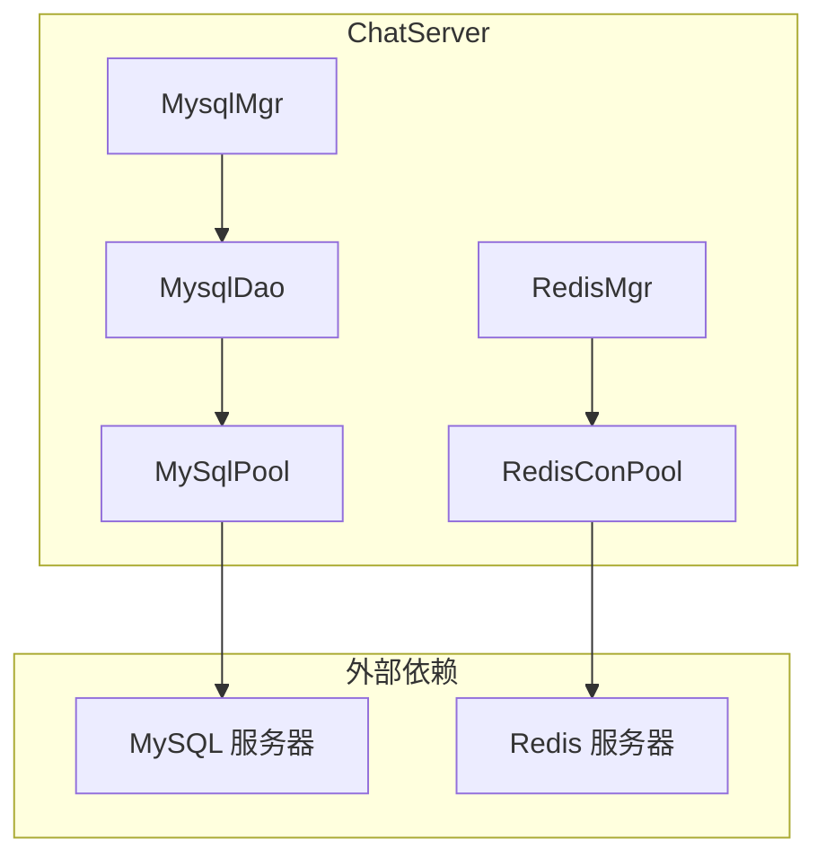
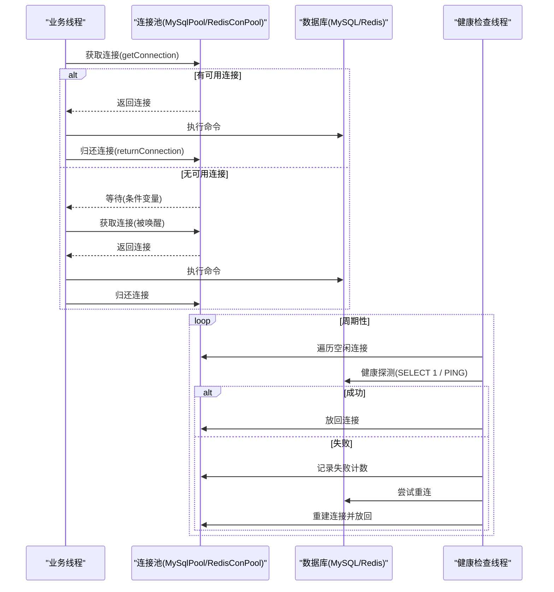
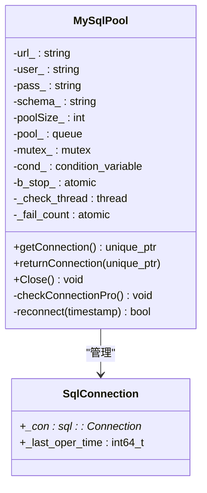
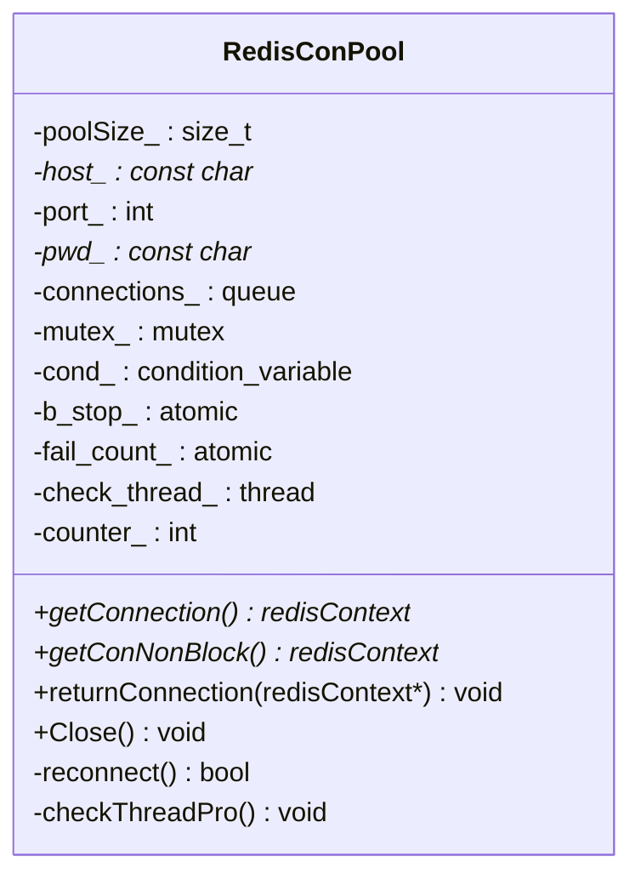
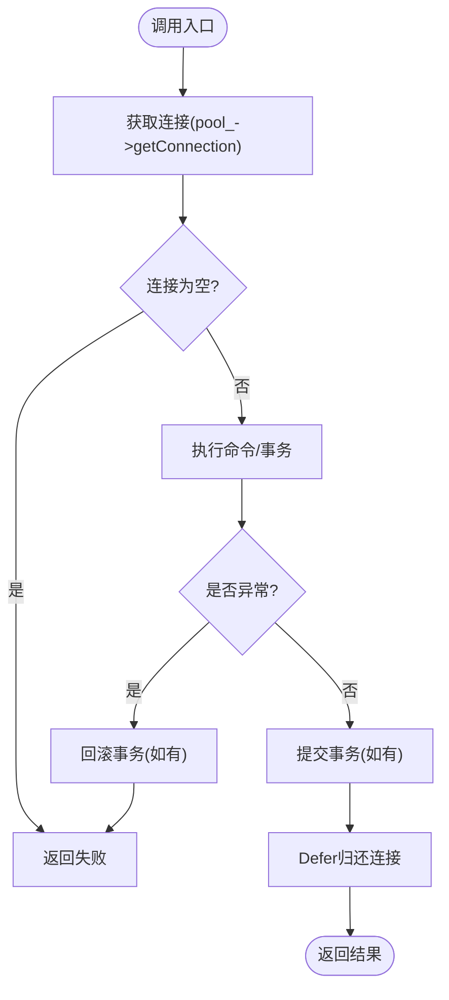
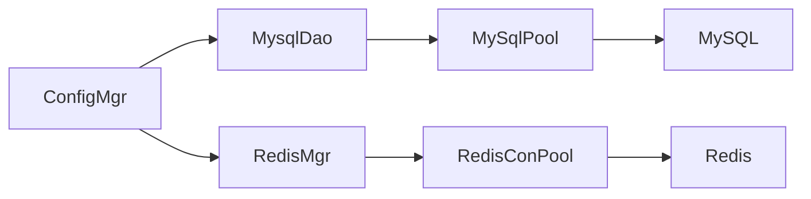

# 连接池管理

<cite>
**本文引用的文件**   
- [MysqlDao.h](file://server/ChatServer/include/MysqlDao.h)
- [MysqlDao.cpp](file://server/ChatServer/src/MysqlDao.cpp)
- [RedisMgr.h](file://server/ChatServer/include/RedisMgr.h)
- [RedisMgr.cpp](file://server/ChatServer/src/RedisMgr.cpp)
- [chatserver1.ini](file://server/ChatServer/config/chatserver1.ini)
- [ConfigMgr.h](file://server/ChatServer/include/ConfigMgr.h)
</cite>

## 目录
1. [引言](#引言)
2. [项目结构](#项目结构)
3. [核心组件](#核心组件)
4. [架构总览](#架构总览)
5. [详细组件分析](#详细组件分析)
6. [依赖关系分析](#依赖关系分析)
7. [性能考量与调优](#性能考量与调优)
8. [故障排查指南](#故障排查指南)
9. [结论](#结论)
10. [附录：配置项与监控建议](#附录配置项与监控建议)

## 引言
本文件面向LLFCChat项目的数据库连接池管理，聚焦MySQL与Redis两类连接池的实现、健康检查、自动恢复、泄漏防护、监控告警以及高并发场景下的优化实践。文档基于代码仓库中的实际实现进行梳理，并提供可操作的调优策略与排障建议，帮助读者在复杂分布式环境下稳定高效地使用数据库连接资源。

## 项目结构
本项目在服务端包含多个子服务（ChatServer、GateServer、ResourceServer、StatusServer等），每个服务通过统一的DAO层访问MySQL，并通过RedisMgr访问Redis。连接池的核心实现位于ChatServer的MysqlDao与RedisMgr中，其他服务复用相同的DAO接口或实现。

图表来源
- [MysqlDao.h:25-232](file://server/ChatServer/include/MysqlDao.h#L25-L232)
- [MysqlDao.cpp:4-13](file://server/ChatServer/src/MysqlDao.cpp#L4-L13)
- [RedisMgr.h:9-265](file://server/ChatServer/include/RedisMgr.h#L9-L265)
- [RedisMgr.cpp:5-11](file://server/ChatServer/src/RedisMgr.cpp#L5-L11)

章节来源
- [MysqlDao.h:25-232](file://server/ChatServer/include/MysqlDao.h#L25-L232)
- [MysqlDao.cpp:4-13](file://server/ChatServer/src/MysqlDao.cpp#L4-L13)
- [RedisMgr.h:9-265](file://server/ChatServer/include/RedisMgr.h#L9-L265)
- [RedisMgr.cpp:5-11](file://server/ChatServer/src/RedisMgr.cpp#L5-L11)

## 核心组件
- MySqlPool：MySQL连接池，负责连接的创建、获取、归还、健康检查与自动重连。
- RedisConPool：Redis连接池，基于hiredis封装，提供连接获取、非阻塞获取、心跳检测与故障恢复。
- MysqlDao：MySQL数据访问层，使用MySqlPool统一管理连接，封装SQL操作与事务。
- RedisMgr：Redis访问层，暴露常用命令与分布式锁能力，内部持有RedisConPool。

章节来源
- [MysqlDao.h:25-232](file://server/ChatServer/include/MysqlDao.h#L25-L232)
- [MysqlDao.cpp:4-13](file://server/ChatServer/src/MysqlDao.cpp#L4-L13)
- [RedisMgr.h:9-265](file://server/ChatServer/include/RedisMgr.h#L9-L265)
- [RedisMgr.cpp:5-11](file://server/ChatServer/src/RedisMgr.cpp#L5-L11)

## 架构总览
连接池整体采用“池化+后台线程健康检查”的模式：
- 初始化阶段：根据配置创建固定数量的连接并放入队列。
- 运行时：业务线程通过条件变量等待可用连接；使用后归还连接。
- 健康检查：后台线程周期性对空闲连接执行轻量探测（MySQL执行SELECT 1，Redis执行PING），失败则标记并尝试重建连接。
- 自动恢复：当探测失败计数大于0时，按失败次数逐步重建连接，直至恢复目标池大小。

图表来源
- [MysqlDao.h:184-218](file://server/ChatServer/include/MysqlDao.h#L184-L218)
- [MysqlDao.h:62-123](file://server/ChatServer/include/MysqlDao.h#L62-L123)
- [RedisMgr.h:63-108](file://server/ChatServer/include/RedisMgr.h#L63-L108)
- [RedisMgr.h:137-206](file://server/ChatServer/include/RedisMgr.h#L137-L206)

## 详细组件分析

### MySQL连接池（MySqlPool）
- 连接生命周期
  - 构造：根据URL、用户、密码、Schema与池大小创建连接，设置schema，记录最后操作时间戳。
  - 获取：条件变量阻塞等待直到有可用连接或停止信号。
  - 归还：将连接放回队列并通知等待者。
  - 关闭：设置停止标志并唤醒所有等待者。
- 健康检查
  - 后台线程每60秒触发一次checkConnectionPro。
  - 对空闲超过阈值的连接执行SELECT 1验证；失败则标记并增加失败计数。
  - 失败计数驱动reconnect循环，逐个重建连接。
- 线程安全
  - 使用互斥量保护队列与状态，条件变量协调获取/归还。
- 复杂度与性能
  - 获取/归还为O(1)，健康检查为O(N)（N为池大小）。
  - 避免长时间持有锁，在解锁后执行探测与重连逻辑。

图表来源
- [MysqlDao.h:18-23](file://server/ChatServer/include/MysqlDao.h#L18-L23)
- [MysqlDao.h:25-232](file://server/ChatServer/include/MysqlDao.h#L25-L232)

章节来源
- [MysqlDao.h:25-232](file://server/ChatServer/include/MysqlDao.h#L25-L232)
- [MysqlDao.cpp:4-13](file://server/ChatServer/src/MysqlDao.cpp#L4-L13)

### Redis连接池（RedisConPool）
- 连接生命周期
  - 构造：创建指定数量的redisContext，执行AUTH认证，成功后入队。
  - 获取：阻塞式与非阻塞式两种获取方式，支持停止信号。
  - 归还：将连接放回队列并通知等待者。
  - 关闭：设置停止标志，join健康检查线程。
- 健康检查
  - 后台线程每秒循环，累计计数器达到阈值后执行checkThreadPro。
  - 对每个空闲连接执行PING；若底层I/O错误或返回ERROR，则释放连接并增加失败计数。
  - 失败计数驱动reconnect，重新建立连接并认证，成功后归还。
- 线程安全
  - 互斥量保护队列与状态，条件变量用于阻塞获取。
- 复杂度与性能
  - 获取/归还为O(1)，健康检查为O(N)。
  - 非阻塞获取避免不必要的等待，适合快速失败场景。

图表来源
- [RedisMgr.h:9-265](file://server/ChatServer/include/RedisMgr.h#L9-L265)

章节来源
- [RedisMgr.h:9-265](file://server/ChatServer/include/RedisMgr.h#L9-L265)
- [RedisMgr.cpp:5-11](file://server/ChatServer/src/RedisMgr.cpp#L5-L11)

### 数据访问层（MysqlDao与RedisMgr）
- MysqlDao
  - 从配置读取MySQL连接参数，初始化MySqlPool。
  - 所有方法统一通过Defer模式确保连接归还，异常路径也保证资源清理。
  - 关键业务（如AddFriend、CreatePrivateChat、LoadChatMsg、AddChatMsg）使用事务与分页查询，提升一致性与性能。
- RedisMgr
  - 从配置读取Redis连接参数，初始化RedisConPool。
  - 提供GET/SET/LPUSH/RPUSH/HSET/HDEL/Del/ExistsKey等常用操作。
  - 分布式锁acquireLock/releaseLock通过DistLock实现，结合连接池保障原子性。

图表来源
- [MysqlDao.cpp:19-57](file://server/ChatServer/src/MysqlDao.cpp#L19-L57)
- [MysqlDao.cpp:126-167](file://server/ChatServer/src/MysqlDao.cpp#L126-L167)
- [MysqlDao.cpp:247-504](file://server/ChatServer/src/MysqlDao.cpp#L247-L504)
- [MysqlDao.cpp:871-936](file://server/ChatServer/src/MysqlDao.cpp#L871-L936)
- [MysqlDao.cpp:939-1000](file://server/ChatServer/src/MysqlDao.cpp#L939-L1000)
- [MysqlDao.cpp:1002-1054](file://server/ChatServer/src/MysqlDao.cpp#L1002-L1054)
- [RedisMgr.cpp:19-46](file://server/ChatServer/src/RedisMgr.cpp#L19-L46)
- [RedisMgr.cpp:48-79](file://server/ChatServer/src/RedisMgr.cpp#L48-L79)

章节来源
- [MysqlDao.cpp:4-13](file://server/ChatServer/src/MysqlDao.cpp#L4-L13)
- [MysqlDao.cpp:19-57](file://server/ChatServer/src/MysqlDao.cpp#L19-L57)
- [MysqlDao.cpp:247-504](file://server/ChatServer/src/MysqlDao.cpp#L247-L504)
- [MysqlDao.cpp:871-936](file://server/ChatServer/src/MysqlDao.cpp#L871-L936)
- [MysqlDao.cpp:939-1000](file://server/ChatServer/src/MysqlDao.cpp#L939-L1000)
- [MysqlDao.cpp:1002-1054](file://server/ChatServer/src/MysqlDao.cpp#L1002-L1054)
- [RedisMgr.cpp:19-46](file://server/ChatServer/src/RedisMgr.cpp#L19-L46)
- [RedisMgr.cpp:48-79](file://server/ChatServer/src/RedisMgr.cpp#L48-L79)

## 依赖关系分析
- 配置依赖
  - ConfigMgr负责解析INI配置，MysqlDao与RedisMgr通过ConfigMgr读取Host、Port、User、Passwd、Schema等参数。
- 组件耦合
  - MysqlMgr/RedisMgr作为单例对外暴露接口，内部持有DAO或连接池实例。
  - DAO与连接池强耦合，但通过接口抽象降低上层调用复杂度。
- 外部依赖
  - MySQL通过cppconn驱动访问；Redis通过hiredis访问。
- 潜在循环依赖
  - 当前实现未见明显循环依赖；DAO仅依赖连接池，连接池不反向依赖DAO。

图表来源
- [ConfigMgr.h:46-82](file://server/ChatServer/include/ConfigMgr.h#L46-L82)
- [MysqlDao.cpp:4-13](file://server/ChatServer/src/MysqlDao.cpp#L4-L13)
- [RedisMgr.cpp:5-11](file://server/ChatServer/src/RedisMgr.cpp#L5-L11)

章节来源
- [ConfigMgr.h:46-82](file://server/ChatServer/include/ConfigMgr.h#L46-L82)
- [MysqlDao.cpp:4-13](file://server/ChatServer/src/MysqlDao.cpp#L4-L13)
- [RedisMgr.cpp:5-11](file://server/ChatServer/src/RedisMgr.cpp#L5-L11)

## 性能考量与调优
- 最大连接数（池大小）
  - MySQL：默认5个连接，适用于低并发；高并发场景建议根据CPU核数与IO吞吐评估，通常设置为CPU核数的1-2倍，并结合慢查询与锁等待情况调整。
  - Redis：默认10个连接；Redis为内存型KV，连接开销较小，可适当增大以应对高QPS。
- 最小空闲连接
  - 当前实现未显式维护最小空闲连接；建议在健康检查中引入“最低存活连接”策略，当空闲连接低于阈值时主动补充。
- 连接超时设置
  - MySQL：cppconn驱动的连接超时可通过URL参数或会话级参数配置；建议设置合理的connect_timeout与net_read_timeout。
  - Redis：hiredis连接超时可通过上下文选项设置；建议设置connect_timeout与command_timeout。
- 连接存活时间（TTL）
  - 当前实现通过_last_oper_time与固定阈值（如5秒）判断是否需要探测；建议引入连接最大存活时间，定期回收长驻连接以避免服务端侧资源耗尽。
- 健康检查频率
  - MySQL与Redis均使用后台线程周期探测；建议根据负载动态调整探测间隔，避免频繁探测造成额外开销。
- 线程安全与锁粒度
  - 连接池使用互斥量保护队列，条件变量协调获取；建议在高并发下减少锁竞争，例如分片池或无锁队列。
- 内存占用优化
  - 避免在连接上持有大对象；批量操作尽量使用批处理语句减少往返。
  - Redis返回的reply需及时freeReplyObject，防止内存泄漏。

[本节为通用指导，不直接分析具体文件]

## 故障排查指南
- 连接获取阻塞
  - 现象：业务线程长时间等待 getConnection。
  - 排查：检查池大小是否过小；是否存在连接泄漏（未归还）；健康检查线程是否正常工作。
- 健康检查失败
  - 现象：后台线程打印错误日志，失败计数增加。
  - 排查：确认数据库可达性；检查网络与认证信息；查看数据库连接数上限。
- 自动重连失败
  - 现象：reconnect多次失败，池无法恢复。
  - 排查：检查数据库服务状态；确认权限与Schema；查看驱动版本兼容性。
- 事务回滚与死锁
  - 现象：AddFriend等操作出现回滚或死锁错误码。
  - 排查：检查SQL顺序与锁范围；适当重试机制；优化索引与查询计划。
- Redis命令失败
  - 现象：GET/SET等命令返回失败或类型不匹配。
  - 排查：检查键是否存在；确认返回值类型；确保freeReplyObject调用。

章节来源
- [MysqlDao.cpp:247-504](file://server/ChatServer/src/MysqlDao.cpp#L247-L504)
- [MysqlDao.cpp:871-936](file://server/ChatServer/src/MysqlDao.cpp#L871-L936)
- [RedisMgr.cpp:19-46](file://server/ChatServer/src/RedisMgr.cpp#L19-L46)
- [RedisMgr.cpp:48-79](file://server/ChatServer/src/RedisMgr.cpp#L48-L79)

## 结论
LLFCChat的数据库连接池采用简洁可靠的“池化+后台健康检查”模式，MySQL与Redis分别通过MySqlPool与RedisConPool实现连接管理与自动恢复。通过配置驱动的初始化、严格的资源归还与异常处理、以及周期性的健康探测与重连，系统在多数场景下具备较好的稳定性与可用性。针对高并发与大规模部署，建议进一步引入最小空闲连接、连接TTL、动态池大小与健康检查频率调节等增强特性，并完善监控与告警体系。

[本节为总结，不直接分析具体文件]

## 附录：配置项与监控建议
- 配置项（INI）
  - MySQL：Host、Port、User、Passwd、Schema
  - Redis：Host、Port、Passwd
- 监控指标
  - 连接池使用率：活跃连接数/池大小
  - 健康检查成功率：成功探测次数/总探测次数
  - 重连次数：单位时间内reconnect调用次数
  - 命令失败率：失败命令数/总命令数
- 容量规划建议
  - 根据峰值QPS与平均响应时间估算所需连接数。
  - 结合数据库最大连接数与系统资源（CPU、内存、IO）综合评估。
  - 对热点表与高频命令进行索引与缓存优化，降低连接压力。

章节来源
- [chatserver1.ini:14-23](file://server/ChatServer/config/chatserver1.ini#L14-L23)
- [ConfigMgr.h:46-82](file://server/ChatServer/include/ConfigMgr.h#L46-L82)