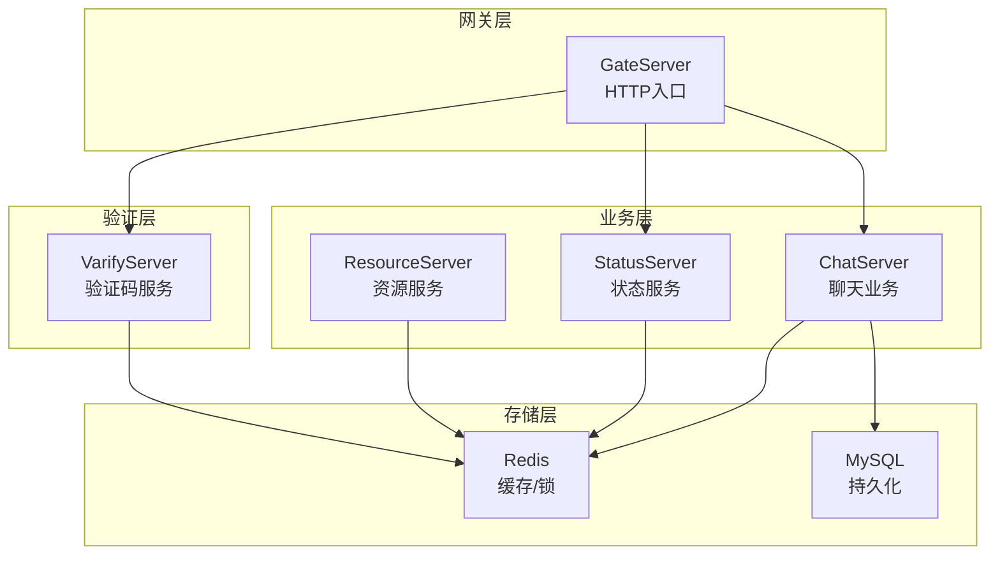
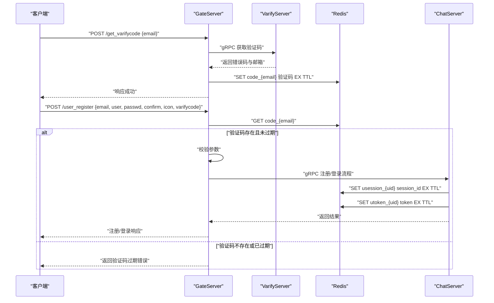
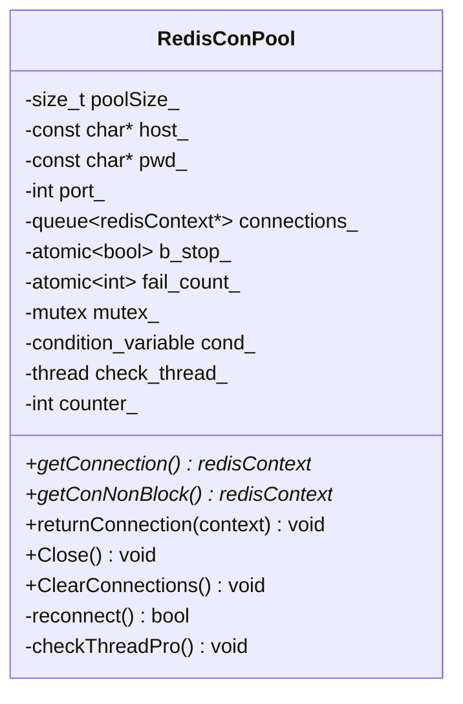
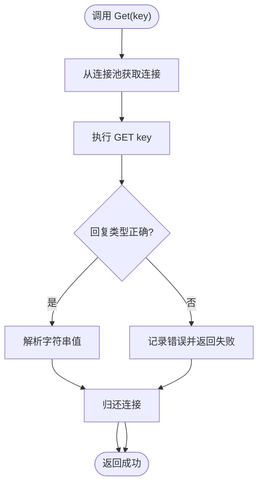
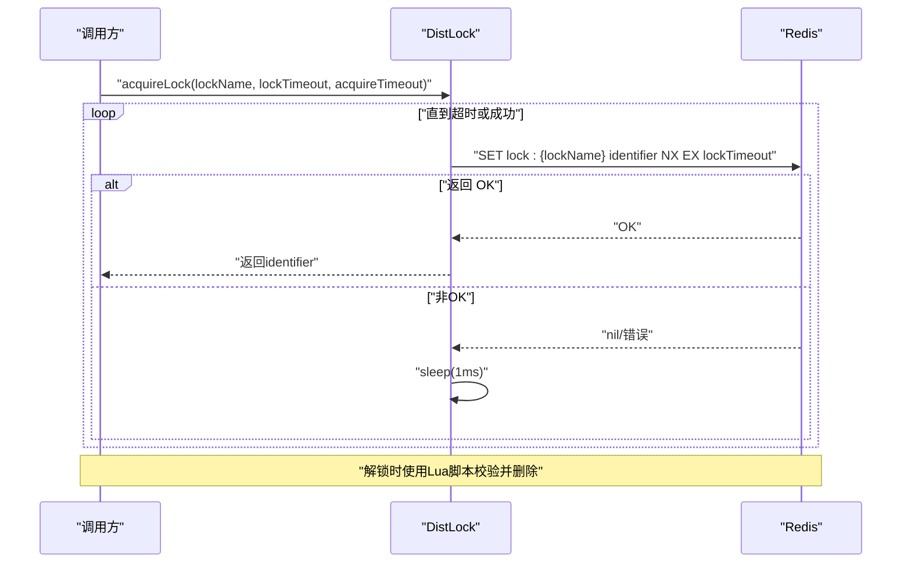
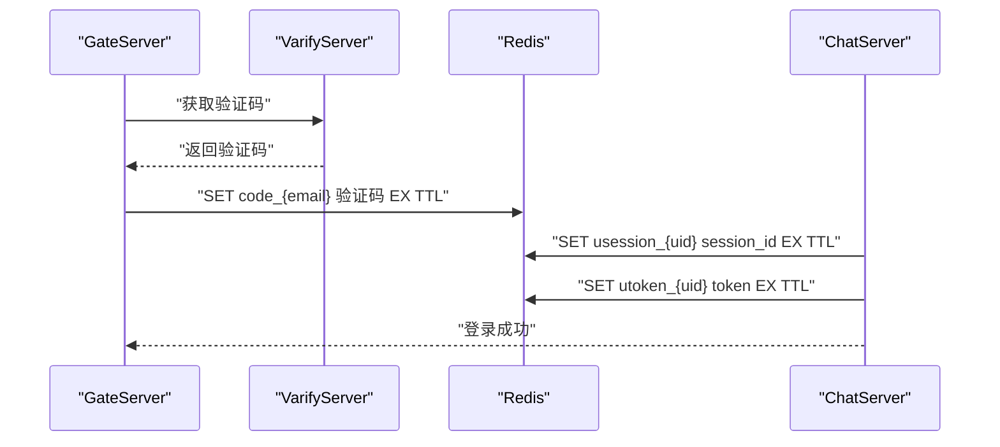
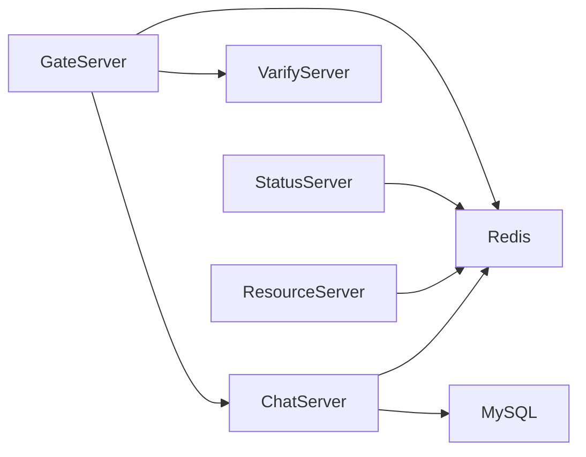

# 缓存策略优化

<cite>
**本文引用的文件**   
- [RedisMgr.h](file://server/ChatServer/include/RedisMgr.h)
- [RedisMgr.cpp](file://server/ChatServer/src/RedisMgr.cpp)
- [DistLock.h](file://server/ChatServer/include/DistLock.h)
- [DistLock.cpp](file://server/ChatServer/src/DistLock.cpp)
- [const.h](file://server/ChatServer/include/const.h)
- [chatserver1.ini](file://server/ChatServer/config/chatserver1.ini)
- [GateLogicSystem.cpp](file://server/GateServer/src/LogicSystem.cpp)
- [GateRedisMgr.h](file://server/GateServer/include/RedisMgr.h)
- [GateRedisMgr.cpp](file://server/GateServer/src/RedisMgr.cpp)
</cite>

## 目录
1. [简介](#简介)
2. [项目结构](#项目结构)
3. [核心组件](#核心组件)
4. [架构总览](#架构总览)
5. [详细组件分析](#详细组件分析)
6. [依赖关系分析](#依赖关系分析)
7. [性能考量](#性能考量)
8. [故障排查指南](#故障排查指南)
9. [结论](#结论)
10. [附录](#附录)

## 简介
本技术文档围绕 LLFCChat 的缓存策略优化展开，重点阐述 Redis 缓存架构设计、数据结构与序列化策略、缓存一致性保证、缓存穿透防护与雪崩解决方案，以及热点数据缓存、本地缓存与分布式缓存协同策略。同时覆盖缓存预热、过期策略与内存清理机制，并针对高并发访问的性能优化和数据同步给出实践建议。

## 项目结构
LLFCChat 采用多服务架构（ChatServer、GateServer、ResourceServer、StatusServer、VarifyServer），各服务通过 gRPC 通信，并使用 Redis 作为分布式缓存与分布式锁支撑。Redis 连接池由每个服务的 RedisMgr 管理，提供统一的键值、列表、哈希操作接口，并通过 DistLock 实现基于 Redis 的分布式锁。

[本图为概念性架构图，不直接映射具体源码文件]

**章节来源**
- [chatserver1.ini:20-23](file://server/ChatServer/config/chatserver1.ini#L20-L23)

## 核心组件
- Redis 连接池：封装 hiredis 连接，支持连接复用、健康检查、自动重连与线程安全获取/归还。
- Redis 管理器：统一封装 GET/SET/LPUSH/RPOP/HSET/HGET/HDEL/DEL/EXISTS 等命令，并提供分布式锁与计数统计接口。
- 分布式锁：基于 SET NX EX + Lua 脚本释放，确保原子性与安全性。
- 配置与常量：Redis 地址、端口、密码从配置文件读取；键前缀、超时时间等常量集中定义。

**章节来源**
- [RedisMgr.h:9-108](file://server/ChatServer/include/RedisMgr.h#L9-L108)
- [RedisMgr.cpp:19-78](file://server/ChatServer/src/RedisMgr.cpp#L19-L78)
- [DistLock.h:4-16](file://server/ChatServer/include/DistLock.h#L4-L16)
- [DistLock.cpp:27-49](file://server/ChatServer/src/DistLock.cpp#L27-L49)
- [const.h:81-94](file://server/ChatServer/include/const.h#L81-L94)

## 架构总览
下图展示了客户端请求经 GateServer 进入后，如何通过 Redis 进行验证码校验、用户会话与令牌管理，并在 ChatServer 中完成聊天相关的数据读写与缓存更新。

**图表来源**
- [GateLogicSystem.cpp:105-200](file://server/GateServer/src/LogicSystem.cpp#L105-L200)
- [GateRedisMgr.cpp:18-45](file://server/GateServer/src/RedisMgr.cpp#L18-L45)
- [ChatServiceImpl.cpp:72](file://server/ChatServer/src/ChatServiceImpl.cpp#L72)
- [CSession.cpp:316-330](file://server/ChatServer/src/CSession.cpp#L316-L330)

## 详细组件分析

### Redis 连接池与健康检查
- 连接池初始化：根据配置创建固定数量的 hiredis 上下文，执行 AUTH 认证后入池。
- 连接获取与归还：多线程安全，使用条件变量等待可用连接，避免忙等。
- 健康检查：后台线程周期性对池中连接执行 PING，失败则标记并尝试重建连接，保障连接可用性。
- 资源清理：Close 时停止检查线程并释放所有连接。

**图表来源**
- [RedisMgr.h:9-108](file://server/ChatServer/include/RedisMgr.h#L9-L108)

**章节来源**
- [RedisMgr.h:11-48](file://server/ChatServer/include/RedisMgr.h#L11-L48)
- [RedisMgr.h:137-206](file://server/ChatServer/include/RedisMgr.h#L137-L206)

### Redis 管理器接口与用法
- 基本操作：Get/Set/LPush/RPush/LPop/RPop/HSet/HGet/HDel/Del/ExistsKey。
- 分布式锁：acquireLock/releaseLock 委托给 DistLock。
- 计数统计：IncreaseCount/DecreaseCount/InitCount/DelCount 用于服务器在线数等统计。
- 连接生命周期：每次调用从连接池获取连接，执行命令后归还，异常路径也确保归还。

**图表来源**
- [RedisMgr.cpp:19-46](file://server/ChatServer/src/RedisMgr.cpp#L19-L46)

**章节来源**
- [RedisMgr.cpp:19-78](file://server/ChatServer/src/RedisMgr.cpp#L19-L78)
- [RedisMgr.cpp:185-244](file://server/ChatServer/src/RedisMgr.cpp#L185-L244)
- [RedisMgr.cpp:247-281](file://server/ChatServer/src/RedisMgr.cpp#L247-L281)
- [RedisMgr.cpp:309-333](file://server/ChatServer/src/RedisMgr.cpp#L309-L333)
- [RedisMgr.cpp:335-359](file://server/ChatServer/src/RedisMgr.cpp#L335-L359)

### 分布式锁实现
- 加锁：使用 SET lockKey identifier NX EX lockTimeout 原子设置，带过期时间防止死锁。
- 解锁：通过 Lua 脚本判断 identifier 是否匹配再删除，保证仅持有者可释放。
- 重试机制：在 acquireTimeout 内轮询尝试获取锁，避免长时间阻塞。

**图表来源**
- [DistLock.cpp:27-49](file://server/ChatServer/src/DistLock.cpp#L27-L49)
- [DistLock.cpp:52-73](file://server/ChatServer/src/DistLock.cpp#L52-L73)

**章节来源**
- [DistLock.h:4-16](file://server/ChatServer/include/DistLock.h#L4-L16)
- [DistLock.cpp:27-49](file://server/ChatServer/src/DistLock.cpp#L27-L49)
- [DistLock.cpp:52-73](file://server/ChatServer/src/DistLock.cpp#L52-L73)

### 键空间设计与序列化策略
- 键前缀规范：
  - USER_BASE_INFO: 用户基础信息
  - USERTOKENPREFIX: 用户令牌
  - USER_SESSION_PREFIX: 用户会话
  - IPCOUNTPREFIX: IP 计数
  - NAME_INFO: 名称信息
  - LOGIN_COUNT: 登录计数
  - LOCK_COUNT: 分布式锁计数
- 数据类型选择：
  - String：令牌、会话ID、验证码
  - Hash：用户基础信息、登录计数（按 server_name 分片）
  - List：消息队列（LPUSH/RPOP）
- 序列化策略：
  - 当前实现以字符串形式存取，业务层负责 JSON/Protobuf 编解码
  - 建议在关键对象引入结构化序列化（如 JSON 或 Protobuf），并统一编码/解码层

**章节来源**
- [const.h:81-94](file://server/ChatServer/include/const.h#L81-L94)
- [RedisMgr.cpp:185-244](file://server/ChatServer/src/RedisMgr.cpp#L185-L244)
- [GateLogicSystem.cpp:105-200](file://server/GateServer/src/LogicSystem.cpp#L105-L200)

### 验证码与用户会话缓存流程
- 验证码：GateServer 调用 VarifyServer 生成验证码并写入 Redis，TTL 控制有效期。
- 会话与令牌：ChatServer 登录后将 session_id 与 token 写入 Redis，后续鉴权优先查缓存。

**图表来源**
- [GateLogicSystem.cpp:105-200](file://server/GateServer/src/LogicSystem.cpp#L105-L200)
- [CSession.cpp:316-330](file://server/ChatServer/src/CSession.cpp#L316-L330)

**章节来源**
- [GateLogicSystem.cpp:105-200](file://server/GateServer/src/LogicSystem.cpp#L105-L200)
- [CSession.cpp:316-330](file://server/ChatServer/src/CSession.cpp#L316-L330)

## 依赖关系分析
- GateServer 与 ChatServer/StatusServer/VarifyServer 通过 gRPC 交互，GateServer 还依赖 Redis 进行验证码缓存。
- ChatServer/ResourceServer/StatusServer 均依赖 Redis 进行会话、令牌、计数与分布式锁。
- 配置中心（INI）为各服务提供 Redis 连接参数。

**图表来源**
- [chatserver1.ini:20-23](file://server/ChatServer/config/chatserver1.ini#L20-L23)
- [GateLogicSystem.cpp:105-200](file://server/GateServer/src/LogicSystem.cpp#L105-L200)

**章节来源**
- [chatserver1.ini:20-23](file://server/ChatServer/config/chatserver1.ini#L20-L23)
- [GateRedisMgr.h:1-305](file://server/GateServer/include/RedisMgr.h#L1-L305)
- [GateRedisMgr.cpp:1-361](file://server/GateServer/src/RedisMgr.cpp#L1-L361)

## 性能考量
- 连接池大小：ChatServer 默认 10，GateServer 默认 5，可根据 QPS 与网络延迟调优。
- 命令批处理：对于批量写入/读取，建议使用 pipeline 或 Lua 脚本减少往返次数。
- 热点数据：对用户基础信息与令牌采用短 TTL + 异步刷新，避免缓存击穿。
- 序列化开销：JSON/Protobuf 编解码应放在独立线程池，避免阻塞 IO。
- 监控与告警：对 Redis 连接失败率、命令延迟、命中率进行监控，设置阈值告警。

[本节为通用指导，不直接分析具体文件]

## 故障排查指南
- 连接失败：检查 Redis 主机、端口、密码配置，确认连接池初始化日志。
- 命令失败：查看对应命令的返回值类型与错误日志，确认键是否存在与类型匹配。
- 锁竞争：观察 acquireTimeout 与 lockTimeout 设置，避免过长等待或频繁重试。
- 验证码过期：确认 VarifyServer 写入 Redis 的 TTL 与业务逻辑一致。
- 会话丢失：检查 usession_{uid} 与 utoken_{uid} 的 TTL 与清理逻辑。

**章节来源**
- [RedisMgr.cpp:19-78](file://server/ChatServer/src/RedisMgr.cpp#L19-L78)
- [RedisMgr.cpp:309-333](file://server/ChatServer/src/RedisMgr.cpp#L309-L333)
- [DistLock.cpp:27-49](file://server/ChatServer/src/DistLock.cpp#L27-L49)
- [GateLogicSystem.cpp:105-200](file://server/GateServer/src/LogicSystem.cpp#L105-L200)

## 结论
LLFCChat 的缓存体系以 Redis 为核心，通过连接池、统一接口与分布式锁实现了高可用的分布式缓存能力。结合键空间规范与序列化策略，可有效支撑验证码、会话、令牌与计数等场景。在高并发下，建议进一步优化连接池、批处理与监控，以提升整体性能与稳定性。

[本节为总结性内容，不直接分析具体文件]

## 附录
- 配置示例：Redis 连接参数位于 chatserver1.ini 的 [Redis] 段。
- 键前缀常量：USER_BASE_INFO、USERTOKENPREFIX、USER_SESSION_PREFIX、LOGIN_COUNT 等定义于 const.h。
- 验证码流程：GateServer LogicSystem 中 /get_varifycode 与 /user_register 接口涉及 Redis 验证码缓存。

**章节来源**
- [chatserver1.ini:20-23](file://server/ChatServer/config/chatserver1.ini#L20-L23)
- [const.h:81-94](file://server/ChatServer/include/const.h#L81-L94)
- [GateLogicSystem.cpp:105-200](file://server/GateServer/src/LogicSystem.cpp#L105-L200)