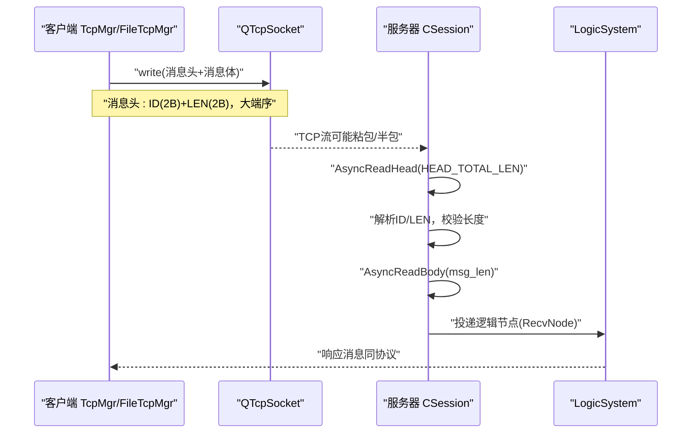
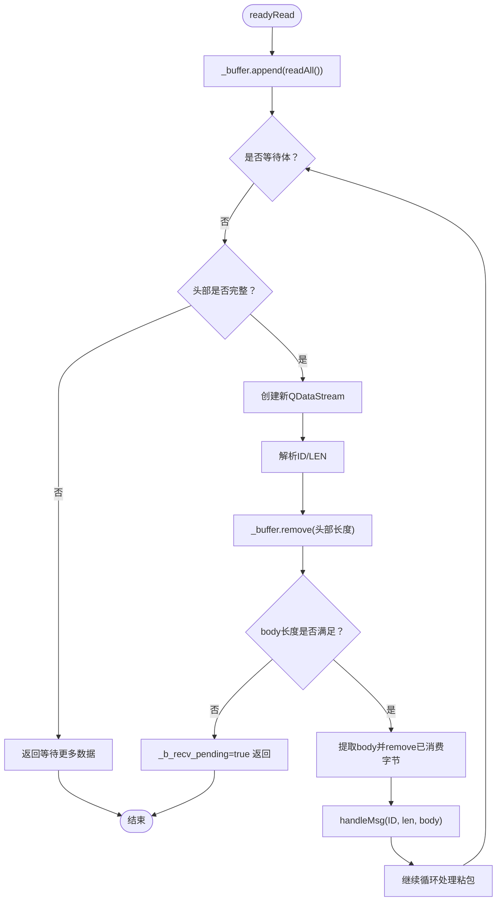
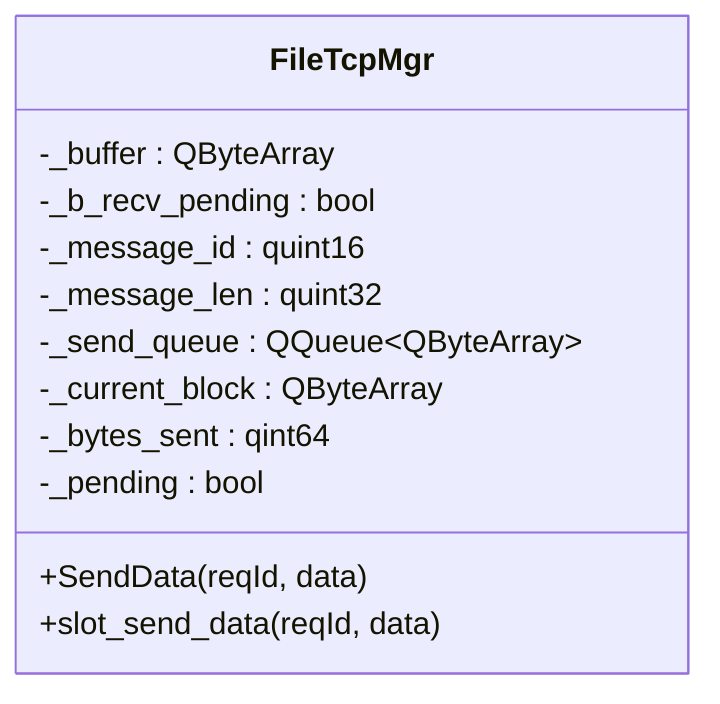
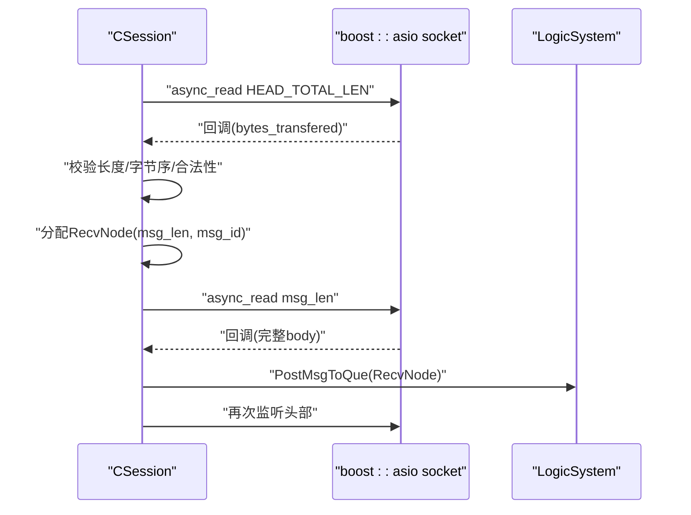
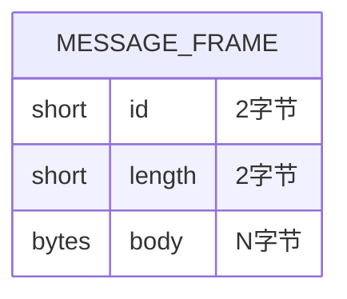
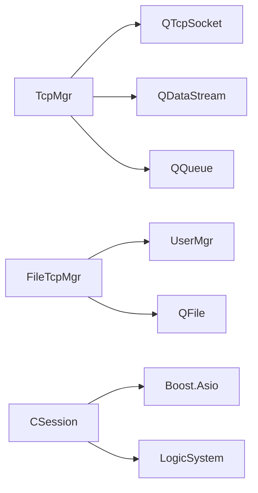

# TCP粘包处理机制

<cite>
**本文引用的文件**   
- [tcpmgr.h](file://client/llfcchat/include/tcpmgr.h)
- [tcpmgr.cpp](file://client/llfcchat/src/tcpmgr.cpp)
- [filetcpmgr.h](file://client/llfcchat/include/filetcpmgr.h)
- [filetcpmgr.cpp](file://client/llfcchat/src/filetcpmgr.cpp)
- [CSession.h](file://server/ChatServer/include/CSession.h)
- [CSession.cpp](file://server/ChatServer/src/CSession.cpp)
- [MsgNode.h](file://server/ChatServer/include/MsgNode.h)
- [const.h](file://server/ChatServer/include/const.h)
- [day42-Qt粘包引发的血案.md](file://开发文档/day42-Qt粘包引发的血案.md)
</cite>

## 目录
1. [简介](#简介)
2. [项目结构](#项目结构)
3. [核心组件](#核心组件)
4. [架构总览](#架构总览)
5. [详细组件分析](#详细组件分析)
6. [依赖关系分析](#依赖关系分析)
7. [性能考量](#性能考量)
8. [故障排查指南](#故障排查指南)
9. [结论](#结论)
10. [附录](#附录)

## 简介
本文件面向LLFCChat项目的TCP粘包处理机制，聚焦客户端与服务器端在网络层的数据帧设计、缓冲区管理、粘包检测与恢复、以及Qt网络编程中的实践要点。内容涵盖消息头定义（消息ID、长度）、序列化格式与字节序、接收缓冲区的动态扩容与分片重组、内存泄漏防护、错误恢复策略，并给出基于QDataStream的示例与最佳实践建议。

## 项目结构
本项目在客户端使用Qt的QTcpSocket进行TCP通信，采用“消息头+消息体”的自定义协议；服务器端基于Boost.Asio实现异步读写，同样遵循固定长度的头部解析与按长度读取消息体的流程。关键文件分布如下：
- 客户端：TcpMgr与FileTcpMgr负责连接、发送队列、粘包解析与业务分发
- 服务器：CSession负责会话生命周期、异步读头/读体、心跳与会话清理
- 常量与数据结构：const.h定义消息ID、头部长度等；MsgNode.h定义收发节点结构

```mermaid
graph TB
subgraph "客户端"
A["TcpMgr<br/>聊天消息收发"] --> B["FileTcpMgr<br/>文件传输"]
A --> C["QTcpSocket<br/>readyRead/bytesWritten"]
B --> C
end
subgraph "服务器"
D["CSession<br/>会话管理"] --> E["AsyncReadHead<br/>AsyncReadBody"]
D --> F["SendQueue<br/>写队列"]
E --> G["LogicSystem<br/>业务处理"]
end
C < --> D
```

**图表来源** 
- [tcpmgr.cpp:1-137](file://client/llfcchat/src/tcpmgr.cpp#L1-L137)
- [filetcpmgr.cpp:1-143](file://client/llfcchat/src/filetcpmgr.cpp#L1-L143)
- [CSession.cpp:42-194](file://server/ChatServer/src/CSession.cpp#L42-L194)

**章节来源**
- [tcpmgr.h:1-90](file://client/llfcchat/include/tcpmgr.h#L1-L90)
- [filetcpmgr.h:1-85](file://client/llfcchat/include/filetcpmgr.h#L1-L85)
- [CSession.h:1-86](file://server/ChatServer/include/CSession.h#L1-L86)
- [const.h:38-46](file://server/ChatServer/include/const.h#L38-L46)

## 核心组件
- 客户端消息管理器（TcpMgr）
  - 职责：建立连接、发送数据（带消息头）、接收数据（粘包处理）、按消息ID分发到处理器
  - 关键点：每次解析头部时重新创建QDataStream；使用_buffer.remove避免mid赋值带来的位置错乱；bytesWritten回调驱动发送队列
- 文件传输管理器（FileTcpMgr）
  - 职责：文件上传/下载控制、分片续传、进度更新
  - 关键点：与TcpMgr类似的粘包解析模式；对大文件的Base64编解码与分块写入
- 服务器会话（CSession）
  - 职责：异步读头/读体、心跳维护、异常会话清理、发送队列串行化
  - 关键点：固定头部长度HEAD_TOTAL_LEN=4（ID:2B + LEN:2B），网络字节序转换，长度校验后分配RecvNode并继续读体

**章节来源**
- [tcpmgr.cpp:18-55](file://client/llfcchat/src/tcpmgr.cpp#L18-L55)
- [filetcpmgr.cpp:16-55](file://client/llfcchat/src/filetcpmgr.cpp#L16-L55)
- [CSession.cpp:133-194](file://server/ChatServer/src/CSession.cpp#L133-L194)

## 架构总览
下图展示从客户端发送、服务器接收、解析到业务处理的完整调用链，体现粘包处理的关键路径。



**图表来源** 
- [tcpmgr.cpp:1044-1069](file://client/llfcchat/src/tcpmgr.cpp#L1044-L1069)
- [filetcpmgr.cpp:186-221](file://client/llfcchat/src/filetcpmgr.cpp#L186-L221)
- [CSession.cpp:133-194](file://server/ChatServer/src/CSession.cpp#L133-L194)

## 详细组件分析

### 客户端：TcpMgr粘包解析与发送
- 接收流程
  - readyRead中追加所有可读数据至_buffer
  - 循环解析：若未处于“等待体”状态，则检查头部是否完整；每次解析头部前新建QDataStream，避免stream内部readPos错位
  - 校验消息体长度是否满足，不足则置_b_recv_pending=true并返回
  - 提取body后remove已消费字节，调用handleMsg按ID分发
- 发送流程
  - 构造block：先写入ID和长度（BigEndian），再拼接消息体
  - bytesWritten回调推进_bytes_sent，未完成则继续写剩余部分；完成则出队下一块或重置pending



**图表来源** 
- [tcpmgr.cpp:18-55](file://client/llfcchat/src/tcpmgr.cpp#L18-L55)

**章节来源**
- [tcpmgr.cpp:18-55](file://client/llfcchat/src/tcpmgr.cpp#L18-L55)
- [tcpmgr.cpp:1044-1069](file://client/llfcchat/src/tcpmgr.cpp#L1044-L1069)

### 客户端：FileTcpMgr文件传输粘包处理
- 与TcpMgr一致的粘包解析模式，但消息体为文件分片数据（Base64编码）
- 发送侧：将ID、长度与JSON负载拼装成block，通过bytesWritten驱动队列
- 接收侧：根据seq决定覆盖/追加写入，支持断点续传



**图表来源** 
- [filetcpmgr.h:26-82](file://client/llfcchat/include/filetcpmgr.h#L26-L82)
- [filetcpmgr.cpp:16-55](file://client/llfcchat/src/filetcpmgr.cpp#L16-L55)
- [filetcpmgr.cpp:186-221](file://client/llfcchat/src/filetcpmgr.cpp#L186-L221)

**章节来源**
- [filetcpmgr.cpp:16-55](file://client/llfcchat/src/filetcpmgr.cpp#L16-L55)
- [filetcpmgr.cpp:186-221](file://client/llfcchat/src/filetcpmgr.cpp#L186-L221)

### 服务器：CSession异步读头/读体
- 头部固定长度HEAD_TOTAL_LEN=4（ID:2B + LEN:2B），使用network_to_host_short进行字节序转换
- 长度校验通过后分配RecvNode，进入AsyncReadBody按长度读取消息体
- 异常路径：读长度不匹配、无效ID/长度、会话失效均触发Close与ClearSession



**图表来源** 
- [CSession.cpp:133-194](file://server/ChatServer/src/CSession.cpp#L133-L194)
- [const.h:38-46](file://server/ChatServer/include/const.h#L38-L46)

**章节来源**
- [CSession.cpp:133-194](file://server/ChatServer/src/CSession.cpp#L133-L194)
- [const.h:38-46](file://server/ChatServer/include/const.h#L38-L46)

### 消息头设计与序列化
- 客户端（TcpMgr）
  - 使用QDataStream设置BigEndian，写入ID(2B)与长度(2B)，随后拼接消息体
  - 接收时每次新建QDataStream，确保readPos从0开始
- 服务器（CSession）
  - 固定头部4字节：ID(2B) + LEN(2B)，网络字节序转主机字节序
  - 长度校验严格，非法直接关闭会话



**图表来源** 
- [tcpmgr.cpp:1044-1069](file://client/llfcchat/src/tcpmgr.cpp#L1044-L1069)
- [CSession.cpp:162-185](file://server/ChatServer/src/CSession.cpp#L162-L185)
- [const.h:38-46](file://server/ChatServer/include/const.h#L38-L46)

**章节来源**
- [tcpmgr.cpp:1044-1069](file://client/llfcchat/src/tcpmgr.cpp#L1044-L1069)
- [CSession.cpp:162-185](file://server/ChatServer/src/CSession.cpp#L162-L185)
- [const.h:38-46](file://server/ChatServer/include/const.h#L38-L46)

### 缓冲区管理与内存安全
- 接收缓冲
  - 使用_buffer.append累积数据，解析后使用remove(0, n)原地删除已消费字节，避免频繁mid赋值导致的内存拷贝与stream位置错乱
  - 通过_b_recv_pending标记“等待体”，防止半包误判
- 发送缓冲
  - _send_queue作为待发送队列，_current_block保存当前正在发送的块，_bytes_sent跟踪已发送字节数
  - bytesWritten回调驱动队列出队与继续写入，避免阻塞
- 服务器端
  - RecvNode/MsgNode预分配固定大小缓冲，避免动态增长带来的碎片；异常时及时释放并清理会话

**章节来源**
- [tcpmgr.cpp:18-55](file://client/llfcchat/src/tcpmgr.cpp#L18-L55)
- [filetcpmgr.cpp:16-55](file://client/llfcchat/src/filetcpmgr.cpp#L16-L55)
- [CSession.cpp:133-194](file://server/ChatServer/src/CSession.cpp#L133-L194)
- [MsgNode.h:1-48](file://server/ChatServer/include/MsgNode.h#L1-L48)

### 粘包检测算法与错误恢复
- 长度校验：头部长度字段必须与实际body长度一致，不一致视为异常
- 完整性检查：只有当_buffer.size() >= message_len时才提取body
- 错误恢复：遇到非法ID/长度或解析失败，清空缓冲或关闭会话，避免污染后续解析
- 调试技巧：打印Buffer size、ID/LEN、已消费字节数，便于定位粘包/半包问题

**章节来源**
- [tcpmgr.cpp:18-55](file://client/llfcchat/src/tcpmgr.cpp#L18-L55)
- [filetcpmgr.cpp:16-55](file://client/llfcchat/src/filetcpmgr.cpp#L16-L55)
- [CSession.cpp:133-194](file://server/ChatServer/src/CSession.cpp#L133-L194)
- [day42-Qt粘包引发的血案.md:1-514](file://开发文档/day42-Qt粘包引发的血案.md#L1-L514)

## 依赖关系分析
- 客户端模块依赖
  - TcpMgr依赖QTcpSocket、QDataStream、QQueue、QByteArray
  - FileTcpMgr依赖用户管理（UserMgr）、文件系统（QFile）、JSON（QJsonDocument）
- 服务器模块依赖
  - CSession依赖Boost.Asio、JSON库、LogicSystem、Redis/Mysql（间接）
  - MsgNode提供收发缓冲抽象



**图表来源** 
- [tcpmgr.h:1-90](file://client/llfcchat/include/tcpmgr.h#L1-L90)
- [filetcpmgr.h:1-85](file://client/llfcchat/include/filetcpmgr.h#L1-L85)
- [CSession.h:1-86](file://server/ChatServer/include/CSession.h#L1-L86)

**章节来源**
- [tcpmgr.h:1-90](file://client/llfcchat/include/tcpmgr.h#L1-L90)
- [filetcpmgr.h:1-85](file://client/llfcchat/include/filetcpmgr.h#L1-L85)
- [CSession.h:1-86](file://server/ChatServer/include/CSession.h#L1-L86)

## 性能考量
- 解析优化
  - 每次解析头部前新建QDataStream，避免readPos错位；优先使用_buffer.remove减少拷贝
  - 大数据场景可考虑手动解析头部（位运算），降低QDataStream开销
- 发送优化
  - 使用队列串行化发送，避免多次write竞争；bytesWritten回调最小化拷贝
  - 预分配_buffer容量（reserve）减少扩容次数
- 服务器优化
  - 固定缓冲大小与队列上限，防止内存暴涨；异常快速回收会话资源

[本节为通用指导，无需特定文件引用]

## 故障排查指南
- 常见问题
  - 解析错位：确认是否在循环外复用QDataStream；确保每次解析头部前新建stream
  - 粘包误判：检查_buffer.size()与_message_len比较逻辑；确认remove顺序与长度一致
  - 字节序错误：客户端BigEndian与服务器network_to_host_*需一致
- 调试手段
  - 打印Buffer size、ID/LEN、已消费字节数、bytesWritten返回值
  - 断点观察_buffer内容与stream内部位置变化

**章节来源**
- [day42-Qt粘包引发的血案.md:1-514](file://开发文档/day42-Qt粘包引发的血案.md#L1-L514)
- [tcpmgr.cpp:18-55](file://client/llfcchat/src/tcpmgr.cpp#L18-L55)
- [filetcpmgr.cpp:16-55](file://client/llfcchat/src/filetcpmgr.cpp#L16-L55)
- [CSession.cpp:133-194](file://server/ChatServer/src/CSession.cpp#L133-L194)

## 结论
LLFCChat在客户端与服务器端均采用“固定长度头部+按长度读取体”的协议设计，结合严格的长度校验与状态标记，有效解决了TCP粘包/半包问题。客户端通过QDataStream与缓冲区操作实现健壮解析，服务器端通过Asio异步IO与固定缓冲提升吞吐与稳定性。遵循本文的最佳实践与排查方法，可进一步提升系统的可靠性与性能。

[本节为总结性内容，无需特定文件引用]

## 附录
- Qt粘包常见陷阱与解决方案参考
  - 不要在循环外创建QDataStream
  - 使用_buffer.remove替代mid赋值
  - 添加长度合法性校验与异常恢复
  - 使用状态机组织解析逻辑

**章节来源**
- [day42-Qt粘包引发的血案.md:1-514](file://开发文档/day42-Qt粘包引发的血案.md#L1-L514)