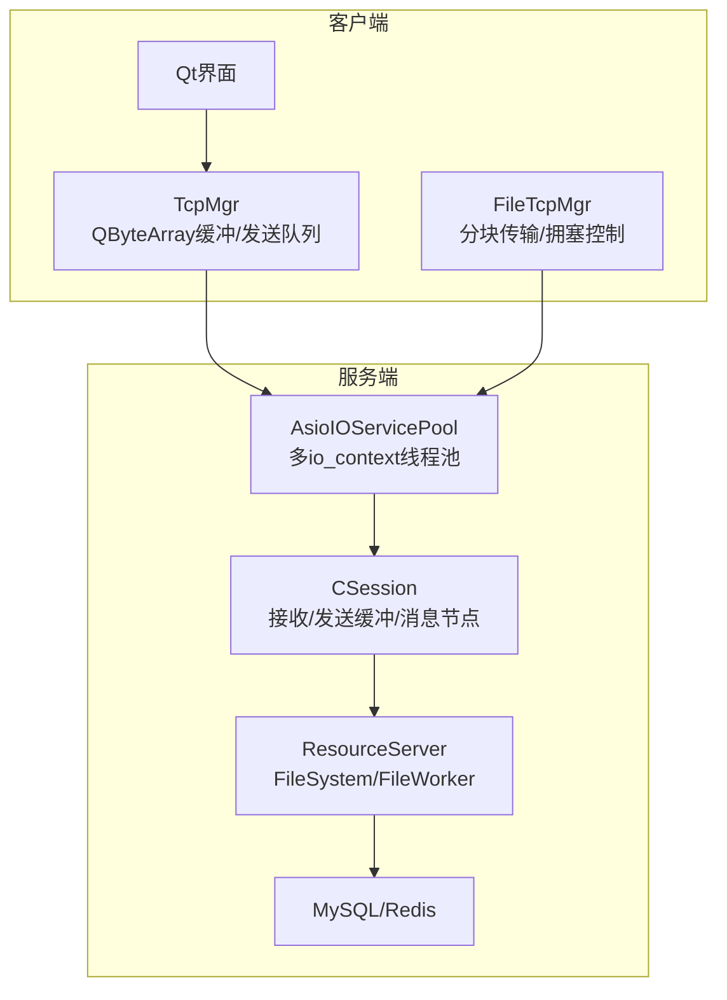
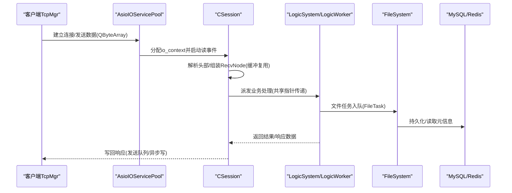
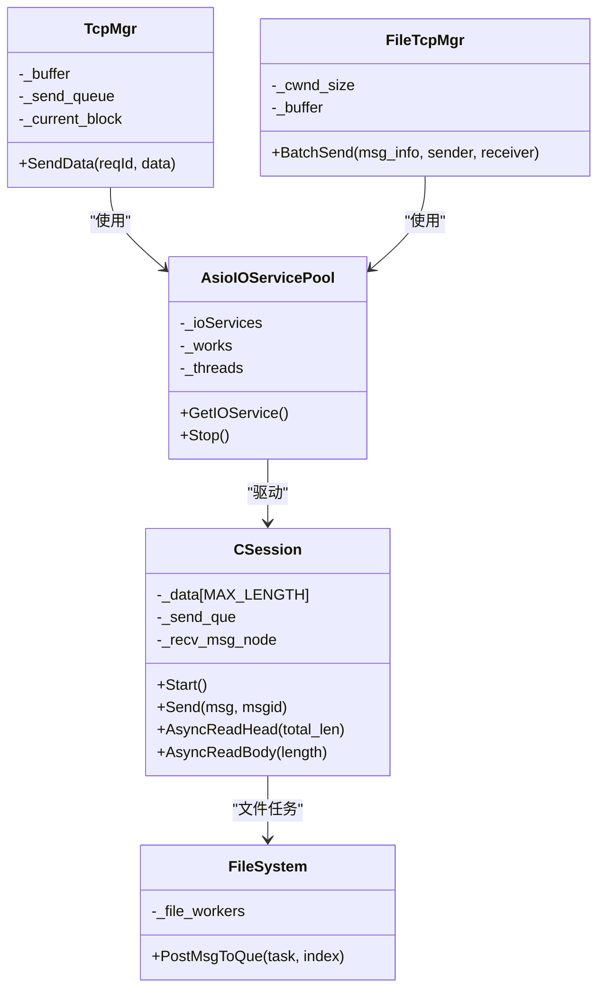

# 内存优化技术

<cite>
**本文引用的文件**   
- [CMakeLists.txt](file://CMakeLists.txt)
- [README.md](file://README.md)
- [AsioIOServicePool.h](file://server/ChatServer/include/AsioIOServicePool.h)
- [AsioIOServicePool.cpp](file://server/ChatServer/src/AsioIOServicePool.cpp)
- [CSession.h](file://server/ChatServer/include/CSession.h)
- [TcpMgr.h](file://client/llfcchat/include/tcpmgr.h)
- [tcpmgr.cpp](file://client/llfcchat/src/tcpmgr.cpp)
- [FileTcpMgr.h](file://client/llfcchat/include/filetcpmgr.h)
- [filetcpmgr.cpp](file://client/llfcchat/src/filetcpmgr.cpp)
- [global.h](file://client/llfcchat/include/global.h)
- [FileSystem.h](file://server/ResourceServer/include/FileSystem.h)
- [LogicWorker.cpp](file://server/ResourceServer/src/LogicWorker.cpp)
- [day38-断点续传.md](file://开发文档/day38-断点续传.md)
- [day42-Qt粘包引发的血案.md](file://开发文档/day42-Qt粘包引发的血案.md)
- [Singleton.h](file://server/ChatServer/include/Singleton.h)
- [ChatGrpcClient.h](file://server/ChatServer/include/ChatGrpcClient.h)
- [MysqlDao.h](file://server/ChatServer/include/MysqlDao.h)
</cite>

## 目录
1. [简介](#简介)
2. [项目结构](#项目结构)
3. [核心组件](#核心组件)
4. [架构总览](#架构总览)
5. [详细组件分析](#详细组件分析)
6. [依赖关系分析](#依赖关系分析)
7. [性能考量](#性能考量)
8. [故障排查指南](#故障排查指南)
9. [结论](#结论)
10. [附录](#附录)

## 简介
本技术文档聚焦于LLFCChat项目的内存优化，围绕零拷贝、内存池、缓冲区复用与RAII等高性能编程实践展开。结合客户端与服务端代码，系统梳理网络I/O缓冲、对象生命周期管理、连接池与线程池对内存分配的影响，并给出可操作的优化建议与监控方法。

## 项目结构
- 客户端（Qt + C++）：基于QTcpSocket进行TCP通信，使用QByteArray作为收发缓冲，消息解析采用QDataStream；存在发送队列与粘包处理逻辑。
- 服务端（Boost.Asio + gRPC + MySQL/Redis）：多进程/多线程服务，使用AsioIOServicePool实现多io_context并发；会话层维护接收/发送缓冲与消息节点；资源服务提供文件上传下载与断点续传。

**图示来源** 
- [AsioIOServicePool.h:1-27](file://server/ChatServer/include/AsioIOServicePool.h#L1-L27)
- [AsioIOServicePool.cpp:1-43](file://server/ChatServer/src/AsioIOServicePool.cpp#L1-L43)
- [CSession.h:1-86](file://server/ChatServer/include/CSession.h#L1-L86)
- [TcpMgr.h:1-90](file://client/llfcchat/include/tcpmgr.h#L1-L90)
- [filetcpmgr.cpp:895-949](file://client/llfcchat/src/filetcpmgr.cpp#L895-L949)
- [FileSystem.h:1-21](file://server/ResourceServer/include/FileSystem.h#L1-L21)

**章节来源**
- [CMakeLists.txt:1-34](file://CMakeLists.txt#L1-L34)
- [README.md:1-112](file://README.md#L1-L112)

## 核心组件
- AsioIOServicePool：按硬件并发度创建多个io_context与工作守护，轮询分发任务，降低锁竞争与上下文切换开销。
- CSession：封装socket读写状态机，维护接收头/体缓冲与发送队列，支持心跳与异常处理。
- TcpMgr/FileTcpMgr：客户端TCP管理器，负责粘包处理、消息路由、分块上传/下载与拥塞窗口控制。
- FileSystem：资源服务中的文件工作器集合，将文件任务投递到后台worker队列，解耦IO与业务逻辑。
- Singleton：线程安全的单例模板，配合智能指针管理全局资源生命周期。

**章节来源**
- [AsioIOServicePool.h:1-27](file://server/ChatServer/include/AsioIOServicePool.h#L1-L27)
- [AsioIOServicePool.cpp:1-43](file://server/ChatServer/src/AsioIOServicePool.cpp#L1-L43)
- [CSession.h:1-86](file://server/ChatServer/include/CSession.h#L1-L86)
- [TcpMgr.h:1-90](file://client/llfcchat/include/tcpmgr.h#L1-L90)
- [filetcpmgr.cpp:895-949](file://client/llfcchat/src/filetcpmgr.cpp#L895-L949)
- [FileSystem.h:1-21](file://server/ResourceServer/include/FileSystem.h#L1-L21)
- [Singleton.h:1-32](file://server/ChatServer/include/Singleton.h#L1-L32)

## 架构总览
下图展示从客户端发起请求到服务端处理的端到端流程，重点标注了缓冲与对象生命周期关键点。

**图示来源** 
- [AsioIOServicePool.cpp:1-43](file://server/ChatServer/src/AsioIOServicePool.cpp#L1-L43)
- [CSession.h:1-86](file://server/ChatServer/include/CSession.h#L1-L86)
- [LogicWorker.cpp:532-570](file://server/ResourceServer/src/LogicWorker.cpp#L532-L570)
- [FileSystem.h:1-21](file://server/ResourceServer/include/FileSystem.h#L1-L21)

## 详细组件分析

### 零拷贝与直接缓冲区
- 目标：减少用户态与内核态之间的数据拷贝，提升吞吐、降低延迟。
- 适用场景：大文件传输、高吞吐网络I/O。
- 在项目中可落地的方向：
  - 使用boost::asio的buffer接口或自定义iovec数组，避免中间QByteArray复制。
  - 对于文件IO，优先使用mmap映射文件，配合sendfile/recvfile（平台相关）完成零拷贝传输。
  - 在gRPC中利用protobuf的零拷贝特性（如string_view、flatbuffers等）。

注意：当前客户端主要使用QByteArray与QDataStream，属于“浅拷贝”策略（通过引用计数），并非严格意义上的零拷贝。若需进一步优化，可在发送路径上尽量复用QByteArray缓冲，避免频繁构造临时对象。

**章节来源**
- [tcpmgr.cpp:1-800](file://client/llfcchat/src/tcpmgr.cpp#L1-L800)
- [filetcpmgr.cpp:895-949](file://client/llfcchat/src/filetcpmgr.cpp#L895-L949)

### 内存映射文件
- 原理：将文件内容映射到进程地址空间，减少read/write的系统调用次数与数据拷贝。
- 优势：适合顺序读取/写入的大文件；可与网络栈协同实现高效传输。
- 风险：大文件映射可能引发虚拟内存压力；需要谨慎管理映射生命周期与同步策略。

建议在资源服务的文件下载路径引入mmap，并结合异步I/O与分页加载，避免一次性映射超大文件。

[本节为概念性说明，不直接分析具体文件]

### 数据传递优化
- 使用std::shared_ptr传递对象，避免深拷贝；在服务端会话层使用RecvNode/SendNode封装消息节点，减少重复解析。
- 在Qt信号槽中注册元类型，避免运行时转换带来的额外分配。

**章节来源**
- [CSession.h:1-86](file://server/ChatServer/include/CSession.h#L1-L86)
- [tcpmgr.cpp:1-800](file://client/llfcchat/src/tcpmgr.cpp#L1-L800)

### 内存池设计模式
- 对象池：gRPC客户端连接池、数据库连接池，减少连接建立与销毁的开销。
- 缓冲区池：预分配固定大小的QByteArray或char[]缓冲，循环复用，避免频繁分配释放。
- 碎片整理：通过固定大小块分配与回收，降低堆碎片；必要时引入jemalloc/tcmalloc。

项目中已实现的池化示例：
- ChatConPool：gRPC连接池，条件变量等待可用连接。
- MySqlPool：数据库连接池，周期性检查与清理。
- AsioIOServicePool：io_context池，降低锁竞争。

**章节来源**
- [ChatGrpcClient.h:51-116](file://server/ChatServer/include/ChatGrpcClient.h#L51-L116)
- [MysqlDao.h:213-232](file://server/ChatServer/include/MysqlDao.h#L213-L232)
- [AsioIOServicePool.h:1-27](file://server/ChatServer/include/AsioIOServicePool.h#L1-L27)

### 缓冲区复用策略
- 循环缓冲区：在CSession中维护_recv_msg_node与_send_que，避免每次新建/销毁。
- 内存预分配：根据MAX_FILE_LEN分块大小预分配缓冲，减少动态扩容。
- 垃圾回收机制：使用智能指针自动释放；对长生命周期对象（如UserMgr）定期清理过期缓存。

**章节来源**
- [CSession.h:1-86](file://server/ChatServer/include/CSession.h#L1-L86)
- [global.h:167-197](file://client/llfcchat/include/global.h#L167-L197)

### Qt与C++内存优化实践
- 智能指针：统一使用std::shared_ptr管理跨模块对象所有权，避免悬空指针。
- RAII原则：所有资源（socket、文件句柄、锁）在析构时自动释放。
- 内存泄漏检测：启用Valgrind/AddressSanitizer，结合日志定位问题。

**章节来源**
- [Singleton.h:1-32](file://server/ChatServer/include/Singleton.h#L1-L32)
- [tcpmgr.cpp:1-800](file://client/llfcchat/src/tcpmgr.cpp#L1-L800)

### 粘包与解析优化
- 问题：QDataStream绑定QByteArray后，修改_buffer会导致readPos错位，引发解析错误。
- 解决：每次解析前重新创建QDataStream，确保读取位置正确；或使用偏移量手动解析。

**章节来源**
- [day42-Qt粘包引发的血案.md:148-191](file://开发文档/day42-Qt粘包引发的血案.md#L148-L191)
- [tcpmgr.cpp:1-800](file://client/llfcchat/src/tcpmgr.cpp#L1-L800)

### 断点续传与内存占用控制
- 策略：分块传输（MAX_FILE_LEN）、序列号确认、Redis持久化进度。
- 内存控制：仅保留当前块缓冲，避免全量加载；使用流式写入磁盘。

**章节来源**
- [day38-断点续传.md:1719-1837](file://开发文档/day38-断点续传.md#L1719-L1837)
- [LogicWorker.cpp:532-570](file://server/ResourceServer/src/LogicWorker.cpp#L532-L570)
- [global.h:167-197](file://client/llfcchat/include/global.h#L167-L197)

## 依赖关系分析
- 客户端依赖Qt网络库与JSON解析库，服务端依赖Boost.Asio、gRPC、MySQL/Redis。
- 关键依赖链：TcpMgr -> QTcpSocket -> AsioIOServicePool -> CSession -> LogicSystem -> FileSystem -> Store。

**图示来源** 
- [AsioIOServicePool.h:1-27](file://server/ChatServer/include/AsioIOServicePool.h#L1-L27)
- [CSession.h:1-86](file://server/ChatServer/include/CSession.h#L1-L86)
- [TcpMgr.h:1-90](file://client/llfcchat/include/tcpmgr.h#L1-L90)
- [filetcpmgr.cpp:895-949](file://client/llfcchat/src/filetcpmgr.cpp#L895-L949)
- [FileSystem.h:1-21](file://server/ResourceServer/include/FileSystem.h#L1-L21)

**章节来源**
- [AsioIOServicePool.cpp:1-43](file://server/ChatServer/src/AsioIOServicePool.cpp#L1-L43)
- [CSession.h:1-86](file://server/ChatServer/include/CSession.h#L1-L86)
- [TcpMgr.h:1-90](file://client/llfcchat/include/tcpmgr.h#L1-L90)
- [filetcpmgr.cpp:895-949](file://client/llfcchat/src/filetcpmgr.cpp#L895-L949)
- [FileSystem.h:1-21](file://server/ResourceServer/include/FileSystem.h#L1-L21)

## 性能考量
- 减少临时对象：在高频路径避免创建不必要的QByteArray副本，优先使用移动语义与引用。
- 缓冲复用：在CSession与TcpMgr中复用缓冲，降低分配频率。
- 池化资源：连接池与线程池减少握手与线程创建开销。
- I/O合并：批量发送与接收，减少系统调用次数。
- 内存分配器：考虑替换默认分配器为tcmalloc/jemalloc以降低碎片。

[本节为通用指导，不直接分析具体文件]

## 故障排查指南
- 粘包问题：检查QDataStream绑定与_buffer修改顺序，确保每次解析前重建stream。
- 内存泄漏：使用Valgrind/ASan捕获未释放对象，重点关注信号槽回调与异步任务。
- 死锁与竞态：审查互斥锁使用范围，避免长时间持有锁；检查条件变量唤醒逻辑。
- 性能瓶颈：使用perf/VTune分析热点函数，定位CPU与I/O瓶颈。

**章节来源**
- [day42-Qt粘包引发的血案.md:148-191](file://开发文档/day42-Qt粘包引发的血案.md#L148-L191)
- [AsioIOServicePool.cpp:1-43](file://server/ChatServer/src/AsioIOServicePool.cpp#L1-L43)

## 结论
LLFCChat项目在内存管理方面已具备良好基础：对象池、连接池、缓冲复用与智能指针广泛使用。未来可进一步引入零拷贝、内存映射与更精细的缓冲池设计，以提升高吞吐场景下的性能表现。同时，完善内存监控与泄漏检测工具链，有助于持续优化与维护稳定性。

[本节为总结性内容，不直接分析具体文件]

## 附录
- 推荐工具：Valgrind、AddressSanitizer、perf、VTune、gperftools。
- 最佳实践：RAII、智能指针、移动语义、缓冲复用、池化资源、异步I/O。

[本节为补充信息，不直接分析具体文件]