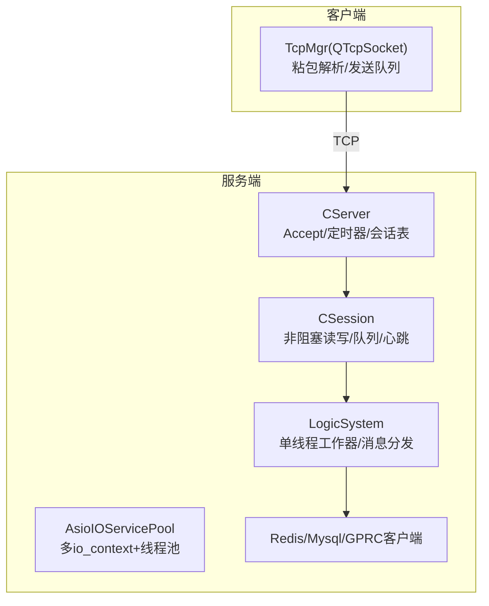
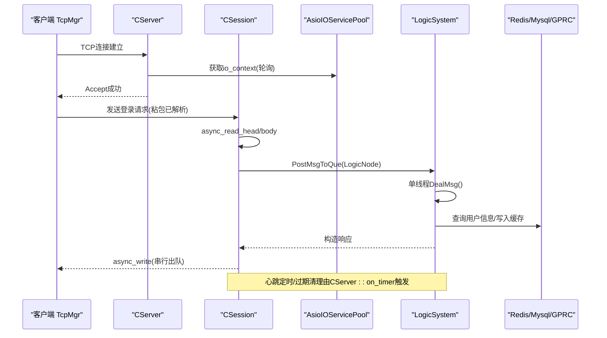
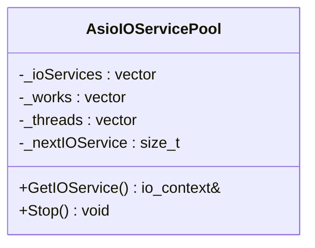
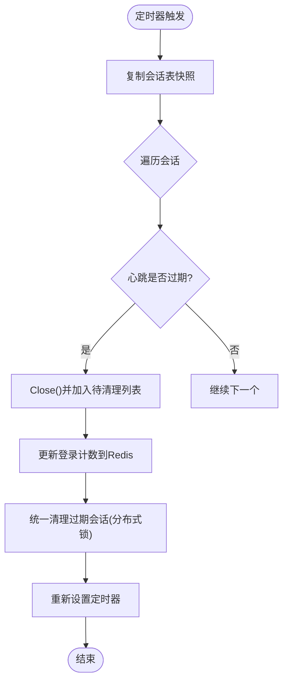
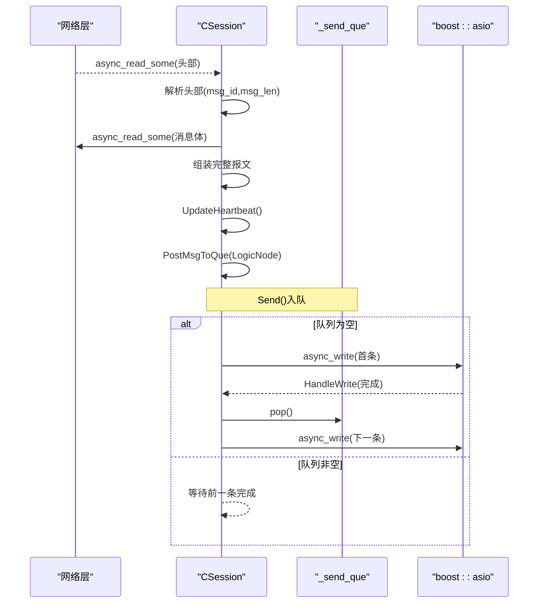
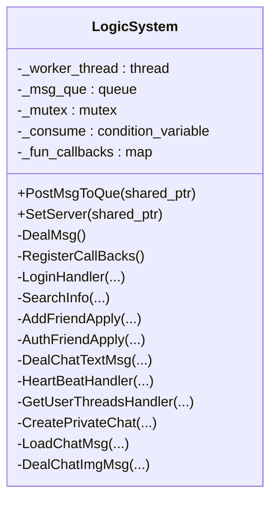
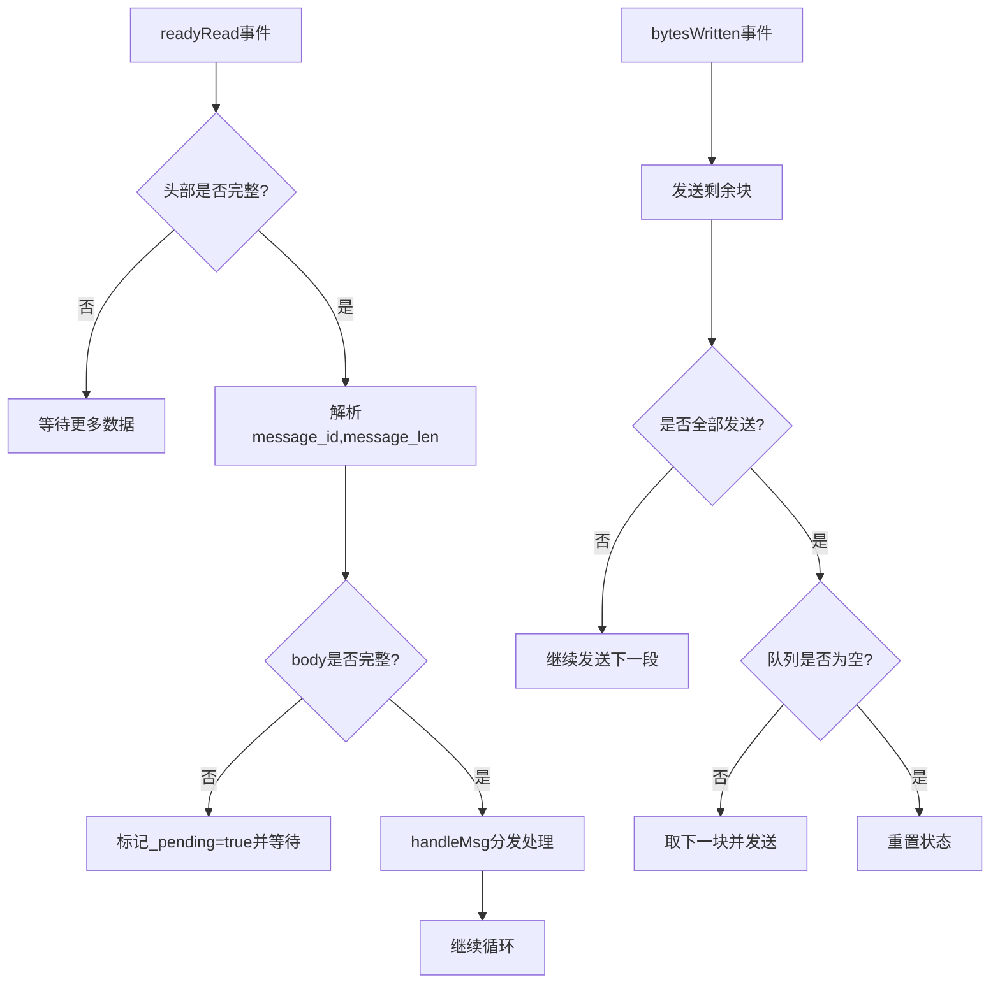
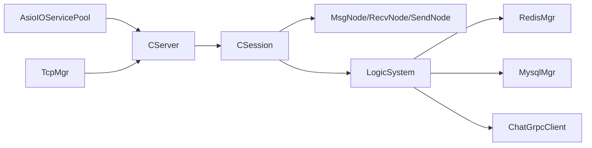

# 异步I/O模型优化

<cite>
**本文引用的文件**   
- [AsioIOServicePool.h](file://server/ChatServer/include/AsioIOServicePool.h)
- [AsioIOServicePool.cpp](file://server/ChatServer/src/AsioIOServicePool.cpp)
- [CSession.h](file://server/ChatServer/include/CSession.h)
- [CSession.cpp](file://server/ChatServer/src/CSession.cpp)
- [CServer.h](file://server/ChatServer/include/CServer.h)
- [CServer.cpp](file://server/ChatServer/src/CServer.cpp)
- [LogicSystem.h](file://server/ChatServer/include/LogicSystem.h)
- [LogicSystem.cpp](file://server/ChatServer/src/LogicSystem.cpp)
- [MsgNode.h](file://server/ChatServer/include/MsgNode.h)
- [MsgNode.cpp](file://server/ChatServer/src/MsgNode.cpp)
- [const.h](file://server/ChatServer/include/const.h)
- [utils.h](file://server/ChatServer/include/utils.h)
- [tcpmgr.h](file://client/llfcchat/include/tcpmgr.h)
- [tcpmgr.cpp](file://client/llfcchat/src/tcpmgr.cpp)
</cite>

## 目录
1. [引言](#引言)
2. [项目结构](#项目结构)
3. [核心组件](#核心组件)
4. [架构总览](#架构总览)
5. [详细组件分析](#详细组件分析)
6. [依赖关系分析](#依赖关系分析)
7. [性能考量](#性能考量)
8. [故障排查指南](#故障排查指南)
9. [结论](#结论)
10. [附录](#附录)

## 引言
本文件面向LLFCChat项目的异步I/O模型优化，围绕Boost.Asio的事件驱动架构展开，系统阐述事件循环、回调注册、任务调度等核心概念；并结合项目中的实际实现，给出非阻塞I/O、协程支持（思路与路径）、批量操作等高性能技巧。同时覆盖线程安全设计（无锁数据结构、原子操作、线程间通信）与最佳实践（避免回调地狱、错误处理策略、资源管理），并提供可落地的代码级参考路径，帮助读者快速定位并优化关键路径。

## 项目结构
本项目在服务端采用多进程/多服务架构，每个服务内部基于Boost.Asio构建高并发网络栈：
- ChatServer：聊天业务主服务，负责TCP连接、会话管理、消息路由、心跳检测、跨服通知等。
- GateServer/ResourceServer/StatusServer：网关、资源、状态等服务，均复用相同的AsioIOServicePool模式。
- Client：Qt客户端，使用QTcpSocket实现非阻塞收发与粘包处理。

图表来源 
- [AsioIOServicePool.h:1-27](file://server/ChatServer/include/AsioIOServicePool.h#L1-L27)
- [AsioIOServicePool.cpp:1-43](file://server/ChatServer/src/AsioIOServicePool.cpp#L1-L43)
- [CServer.h:1-33](file://server/ChatServer/include/CServer.h#L1-L33)
- [CServer.cpp:1-133](file://server/ChatServer/src/CServer.cpp#L1-L133)
- [CSession.h:1-86](file://server/ChatServer/include/CSession.h#L1-L86)
- [CSession.cpp:1-338](file://server/ChatServer/src/CSession.cpp#L1-L338)
- [LogicSystem.h:1-61](file://server/ChatServer/include/LogicSystem.h#L1-L61)
- [LogicSystem.cpp:1-800](file://server/ChatServer/src/LogicSystem.cpp#L1-L800)
- [tcpmgr.h:1-90](file://client/llfcchat/include/tcpmgr.h#L1-L90)
- [tcpmgr.cpp:1-200](file://client/llfcchat/src/tcpmgr.cpp#L1-L200)

章节来源
- [AsioIOServicePool.h:1-27](file://server/ChatServer/include/AsioIOServicePool.h#L1-L27)
- [AsioIOServicePool.cpp:1-43](file://server/ChatServer/src/AsioIOServicePool.cpp#L1-L43)
- [CServer.h:1-33](file://server/ChatServer/include/CServer.h#L1-L33)
- [CServer.cpp:1-133](file://server/ChatServer/src/CServer.cpp#L1-L133)
- [CSession.h:1-86](file://server/ChatServer/include/CSession.h#L1-L86)
- [CSession.cpp:1-338](file://server/ChatServer/src/CSession.cpp#L1-L338)
- [LogicSystem.h:1-61](file://server/ChatServer/include/LogicSystem.h#L1-L61)
- [LogicSystem.cpp:1-800](file://server/ChatServer/src/LogicSystem.cpp#L1-L800)
- [tcpmgr.h:1-90](file://client/llfcchat/include/tcpmgr.h#L1-L90)
- [tcpmgr.cpp:1-200](file://client/llfcchat/src/tcpmgr.cpp#L1-L200)

## 核心组件
- AsioIOServicePool：多io_context池化与线程绑定，轮询分配，优雅停止。
- CServer：监听端口、接受连接、维护会话映射、周期性心跳清理。
- CSession：非阻塞读头/体、写队列串行化、异常会话清理、心跳更新。
- LogicSystem：单工作线程的消息队列与回调分发，解耦I/O与逻辑。
- MsgNode/RecvNode/SendNode：协议缓冲与序列化封装。
- const.h：协议ID、常量、Defer RAII工具。
- utils.h：时间戳工具。
- 客户端TcpMgr：基于QTcpSocket的非阻塞收发、粘包处理、发送队列。

章节来源
- [AsioIOServicePool.h:1-27](file://server/ChatServer/include/AsioIOServicePool.h#L1-L27)
- [AsioIOServicePool.cpp:1-43](file://server/ChatServer/src/AsioIOServicePool.cpp#L1-L43)
- [CServer.h:1-33](file://server/ChatServer/include/CServer.h#L1-L33)
- [CServer.cpp:1-133](file://server/ChatServer/src/CServer.cpp#L1-L133)
- [CSession.h:1-86](file://server/ChatServer/include/CSession.h#L1-L86)
- [CSession.cpp:1-338](file://server/ChatServer/src/CSession.cpp#L1-L338)
- [LogicSystem.h:1-61](file://server/ChatServer/include/LogicSystem.h#L1-L61)
- [LogicSystem.cpp:1-800](file://server/ChatServer/src/LogicSystem.cpp#L1-L800)
- [MsgNode.h:1-48](file://server/ChatServer/include/MsgNode.h#L1-L48)
- [MsgNode.cpp:1-18](file://server/ChatServer/src/MsgNode.cpp#L1-L18)
- [const.h:1-104](file://server/ChatServer/include/const.h#L1-L104)
- [utils.h:1-7](file://server/ChatServer/include/utils.h#L1-L7)
- [tcpmgr.h:1-90](file://client/llfcchat/include/tcpmgr.h#L1-L90)
- [tcpmgr.cpp:1-200](file://client/llfcchat/src/tcpmgr.cpp#L1-L200)

## 架构总览
下图展示从客户端到服务端的完整调用链，以及I/O与逻辑的解耦方式。

图表来源 
- [CServer.cpp:1-133](file://server/ChatServer/src/CServer.cpp#L1-L133)
- [CSession.cpp:1-338](file://server/ChatServer/src/CSession.cpp#L1-L338)
- [AsioIOServicePool.cpp:1-43](file://server/ChatServer/src/AsioIOServicePool.cpp#L1-L43)
- [LogicSystem.cpp:1-800](file://server/ChatServer/src/LogicSystem.cpp#L1-L800)
- [tcpmgr.cpp:1-200](file://client/llfcchat/src/tcpmgr.cpp#L1-L200)

## 详细组件分析

### AsioIOServicePool：事件循环与线程池
- 设计要点
  - 多io_context实例，每个绑定一个线程，run()驱动事件循环。
  - executor_work_guard确保run()在存在挂起任务时不退出。
  - 轮询GetIOService()将新连接均匀分配到不同io_context，提升并行度。
  - Stop()先stop各io_context再释放work_guard，最后join线程，保证优雅关闭。
- 复杂度与特性
  - GetIOService()为O(1)，Stop()为O(N)。
  - 内存占用与线程数线性相关，适合CPU密集型与I/O混合场景。
- 优化建议
  - 根据硬件并发调整池大小，避免过度线程切换。
  - 对热点io_context可引入亲和性策略或按会话哈希分配。

图表来源 
- [AsioIOServicePool.h:1-27](file://server/ChatServer/include/AsioIOServicePool.h#L1-L27)
- [AsioIOServicePool.cpp:1-43](file://server/ChatServer/src/AsioIOServicePool.cpp#L1-L43)

章节来源
- [AsioIOServicePool.h:1-27](file://server/ChatServer/include/AsioIOServicePool.h#L1-L27)
- [AsioIOServicePool.cpp:1-43](file://server/ChatServer/src/AsioIOServicePool.cpp#L1-L43)

### CServer：Accept与定时器
- 功能
  - 启动acceptor，异步接受连接，创建CSession并Start。
  - 维护_sessions映射，提供ClearSession/GetSession/CheckValid。
  - 定时器每60秒扫描会话，检查心跳是否过期，收集并清理过期会话。
- 并发与锁
  - _sessions访问加互斥锁，避免并发修改。
  - 定时器回调中复制会话快照，避免持有锁期间执行耗时操作。
- 优化点
  - 可将过期清理与Redis交互移出临界区，减少锁竞争。

图表来源 
- [CServer.cpp:1-133](file://server/ChatServer/src/CServer.cpp#L1-L133)

章节来源
- [CServer.h:1-33](file://server/ChatServer/include/CServer.h#L1-L33)
- [CServer.cpp:1-133](file://server/ChatServer/src/CServer.cpp#L1-L133)

### CSession：非阻塞I/O与写队列
- 读取流程
  - AsyncReadHead读取固定长度头部，解析msg_id与msg_len后进入AsyncReadBody。
  - asyncReadFull/asyncReadLen递归组装完整报文，避免粘包/半包问题。
- 写入流程
  - Send将数据入队_send_que，若队列为空则立即发起async_write，并在HandleWrite中串行出队继续发送。
  - 通过_send_lock保护队列，防止并发写导致的数据竞争。
- 心跳与会话生命周期
  - 每次接收数据更新_last_heartbeat；IsHeartbeatExpired用于判断超时。
  - DealExceptionSession使用分布式锁清理用户关联信息与Token。
- 错误处理
  - 所有异步回调均检查error_code，失败时Close并清理会话。

图表来源 
- [CSession.cpp:1-338](file://server/ChatServer/src/CSession.cpp#L1-L338)
- [MsgNode.cpp:1-18](file://server/ChatServer/src/MsgNode.cpp#L1-L18)

章节来源
- [CSession.h:1-86](file://server/ChatServer/include/CSession.h#L1-L86)
- [CSession.cpp:1-338](file://server/ChatServer/src/CSession.cpp#L1-L338)
- [MsgNode.h:1-48](file://server/ChatServer/include/MsgNode.h#L1-L48)
- [MsgNode.cpp:1-18](file://server/ChatServer/src/MsgNode.cpp#L1-L18)

### LogicSystem：I/O与逻辑解耦
- 设计要点
  - 单工作线程DealMsg()消费_msg_que，避免多线程竞争与复杂同步。
  - RegisterCallBacks将消息ID映射到具体处理器，便于扩展与维护。
  - PostMsgToQue使用条件变量唤醒消费者，避免忙等。
- 典型流程
  - 登录/搜索/好友申请/文本聊天/图片聊天等均由对应Handler处理。
  - 使用Defer统一返回响应，简化错误路径。
- 性能与可扩展性
  - 单线程顺序处理降低锁开销，但需控制Handler内耗时操作（如数据库、RPC）。
  - 可按会话哈希分片投递到多个LogicSystem实例，实现水平扩展（参考ResourceServer用法）。

图表来源 
- [LogicSystem.h:1-61](file://server/ChatServer/include/LogicSystem.h#L1-L61)
- [LogicSystem.cpp:1-800](file://server/ChatServer/src/LogicSystem.cpp#L1-L800)

章节来源
- [LogicSystem.h:1-61](file://server/ChatServer/include/LogicSystem.h#L1-L61)
- [LogicSystem.cpp:1-800](file://server/ChatServer/src/LogicSystem.cpp#L1-L800)

### 客户端TcpMgr：非阻塞收发与粘包处理
- 读取流程
  - readyRead事件累积数据，优先解析头部（message_id/message_len），不足则等待。
  - 当缓冲区满足body长度时，取出完整消息并交由handleMsg分发。
- 写入流程
  - bytesWritten事件驱动分段发送，维护_bytes_sent与_pending状态，确保顺序发送。
  - 使用_send_queue缓冲待发数据，避免频繁write调用。
- 错误处理
  - error/disconnected信号分别处理连接失败、远端关闭等场景，向上层发出信号。

图表来源 
- [tcpmgr.cpp:1-200](file://client/llfcchat/src/tcpmgr.cpp#L1-L200)
- [tcpmgr.h:1-90](file://client/llfcchat/include/tcpmgr.h#L1-L90)

章节来源
- [tcpmgr.h:1-90](file://client/llfcchat/include/tcpmgr.h#L1-L90)
- [tcpmgr.cpp:1-200](file://client/llfcchat/src/tcpmgr.cpp#L1-L200)

## 依赖关系分析
- I/O层依赖AsioIOServicePool提供的io_context，CServer通过轮询获取以分散负载。
- CSession依赖MsgNode进行协议编解码，依赖LogicSystem进行消息投递。
- LogicSystem依赖Redis/Mysql/GPRC客户端进行持久化与跨服通信。
- 客户端TcpMgr与服务端CSession遵循相同协议（头部+体），确保端到端一致性。

图表来源 
- [AsioIOServicePool.cpp:1-43](file://server/ChatServer/src/AsioIOServicePool.cpp#L1-L43)
- [CServer.cpp:1-133](file://server/ChatServer/src/CServer.cpp#L1-L133)
- [CSession.cpp:1-338](file://server/ChatServer/src/CSession.cpp#L1-L338)
- [LogicSystem.cpp:1-800](file://server/ChatServer/src/LogicSystem.cpp#L1-L800)
- [tcpmgr.cpp:1-200](file://client/llfcchat/src/tcpmgr.cpp#L1-L200)

章节来源
- [AsioIOServicePool.cpp:1-43](file://server/ChatServer/src/AsioIOServicePool.cpp#L1-L43)
- [CServer.cpp:1-133](file://server/ChatServer/src/CServer.cpp#L1-L133)
- [CSession.cpp:1-338](file://server/ChatServer/src/CSession.cpp#L1-L338)
- [LogicSystem.cpp:1-800](file://server/ChatServer/src/LogicSystem.cpp#L1-L800)
- [tcpmgr.cpp:1-200](file://client/llfcchat/src/tcpmgr.cpp#L1-L200)

## 性能考量
- 事件循环与线程模型
  - 多io_context+线程池提升并发能力，注意合理设置线程数以避免上下文切换开销。
  - 定时器与I/O在同一io_context上运行，避免跨上下文同步带来的额外成本。
- 非阻塞I/O与缓冲
  - 使用async_read_some组合成完整报文，减少系统调用次数。
  - 写队列串行化避免多次小写导致的拥塞与乱序。
- 逻辑解耦与批处理
  - LogicSystem单线程顺序处理，降低锁竞争；对于批量消息（如文本聊天数组）可在Handler内合并写入。
  - 对热路径（如登录、心跳）尽量走缓存（Redis），降低数据库压力。
- 协程支持（思路）
  - Boost.Asio支持协程（coroutine2），可将嵌套回调改写为顺序风格，提高可读性与可维护性。
  - 建议在CSession的asyncReadFull/asyncReadLen处引入协程封装，避免深层回调。
- 资源管理
  - 使用RAII（如Defer）确保响应发送与锁释放的确定性。
  - 会话对象通过shared_from_this管理生命周期，避免悬垂指针。

[本节为通用指导，不直接分析具体文件]

## 故障排查指南
- 常见问题
  - 粘包/半包：检查客户端与服务端头部解析逻辑与缓冲区拼接是否正确。
  - 写拥塞：观察_send_que长度与HandleWrite回调频率，必要时限流或背压。
  - 心跳超时：确认客户端心跳间隔与服务器阈值一致，检查定时器回调是否被阻塞。
  - 跨服踢人：分布式锁获取失败或会话不一致时需重试或告警。
- 调试建议
  - 在关键回调打印error_code与字节数，定位失败阶段。
  - 使用日志记录队列长度、定时器周期、Redis命中率等指标。
  - 针对异常会话，集中查看DealExceptionSession与ClearSession的执行路径。

章节来源
- [CSession.cpp:1-338](file://server/ChatServer/src/CSession.cpp#L1-L338)
- [CServer.cpp:1-133](file://server/ChatServer/src/CServer.cpp#L1-L133)
- [LogicSystem.cpp:1-800](file://server/ChatServer/src/LogicSystem.cpp#L1-L800)
- [tcpmgr.cpp:1-200](file://client/llfcchat/src/tcpmgr.cpp#L1-L200)

## 结论
LLFCChat在服务端采用Boost.Asio的事件驱动架构，结合AsioIOServicePool的多io_context线程池、CSession的非阻塞I/O与写队列、LogicSystem的单线程消息分发，实现了高并发、低延迟、易扩展的网络通信模型。通过合理的错误处理、资源管理与缓存策略，系统在稳定性与性能之间取得良好平衡。未来可进一步引入协程与批处理优化，提升代码可读性与吞吐能力。

[本节为总结，不直接分析具体文件]

## 附录
- 协议与常量
  - 头部长度、消息ID枚举、错误码定义见const.h。
  - 时间戳工具见utils.h。
- 参考路径
  - 事件循环与线程池：AsioIOServicePool.h/.cpp
  - 会话与I/O：CSession.h/.cpp、MsgNode.h/.cpp
  - 服务器与定时器：CServer.h/.cpp
  - 逻辑分发：LogicSystem.h/.cpp
  - 客户端收发：tcpmgr.h/.cpp

章节来源
- [const.h:1-104](file://server/ChatServer/include/const.h#L1-L104)
- [utils.h:1-7](file://server/ChatServer/include/utils.h#L1-L7)
- [AsioIOServicePool.h:1-27](file://server/ChatServer/include/AsioIOServicePool.h#L1-L27)
- [AsioIOServicePool.cpp:1-43](file://server/ChatServer/src/AsioIOServicePool.cpp#L1-L43)
- [CSession.h:1-86](file://server/ChatServer/include/CSession.h#L1-L86)
- [CSession.cpp:1-338](file://server/ChatServer/src/CSession.cpp#L1-L338)
- [MsgNode.h:1-48](file://server/ChatServer/include/MsgNode.h#L1-L48)
- [MsgNode.cpp:1-18](file://server/ChatServer/src/MsgNode.cpp#L1-L18)
- [CServer.h:1-33](file://server/ChatServer/include/CServer.h#L1-L33)
- [CServer.cpp:1-133](file://server/ChatServer/src/CServer.cpp#L1-L133)
- [LogicSystem.h:1-61](file://server/ChatServer/include/LogicSystem.h#L1-L61)
- [LogicSystem.cpp:1-800](file://server/ChatServer/src/LogicSystem.cpp#L1-L800)
- [tcpmgr.h:1-90](file://client/llfcchat/include/tcpmgr.h#L1-L90)
- [tcpmgr.cpp:1-200](file://client/llfcchat/src/tcpmgr.cpp#L1-L200)